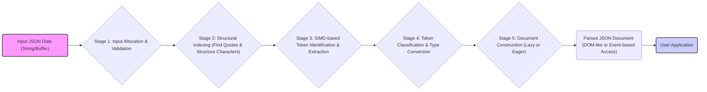

## Project Design Document: simdjson Library (Improved)

**1. Introduction**

This document provides an enhanced and more detailed design overview of the `simdjson` library, a high-performance JSON parser and serializer. This document is intended to serve as a robust foundation for subsequent threat modeling activities. It elaborates on the key architectural components, data flow, and security considerations of the library, providing a deeper understanding of its internal workings.

**2. Project Overview**

*   **Project Name:** simdjson
*   **Project Repository:** [https://github.com/simd-lite/simd-json](https://github.com/simd-lite/simd-json)
*   **Project Goal:** To achieve the fastest possible JSON parsing and serialization performance by strategically leveraging Single Instruction, Multiple Data (SIMD) instructions, branchless programming techniques, and carefully optimized algorithms.
*   **Target Audience:** Software developers and engineers who require extremely efficient JSON processing in their applications, particularly in performance-sensitive domains such as web services, data analytics, and game development.
*   **Key Features:**
    *   **Exceptional Parsing Speed:** Achieves significantly faster JSON parsing compared to traditional methods.
    *   **Comprehensive JSON Support:** Handles a wide range of valid JSON documents and data types.
    *   **Lazy Parsing Capabilities:** Allows for efficient access to specific parts of a JSON document without parsing the entire structure upfront.
    *   **Strict UTF-8 Validation:** Enforces and validates UTF-8 encoding of JSON input.
    *   **C++ Implementation with Bindings:** Primarily implemented in C++ for performance, with bindings available for other programming languages to facilitate broader adoption.
    *   **Memory Efficiency:** Designed to minimize memory allocations and overhead during parsing.

**3. Architectural Overview**

The `simdjson` library employs a carefully orchestrated multi-stage architecture to maximize parsing throughput. The primary components involved in the parsing process and their interactions are visualized below:

*   **Input JSON Data (String/Buffer):** The raw JSON data to be processed, typically provided as a contiguous block of memory, either as a `std::string` or a character array.
*   **Stage 1: Input Allocation & Validation:** This initial stage handles the allocation of necessary internal buffers and performs preliminary validation checks on the input data, such as verifying UTF-8 encoding.
*   **Stage 2: Structural Indexing (Find Quotes & Structure Characters):** This stage scans the input buffer to locate key structural characters like quotation marks, brackets, braces, colons, and commas. It creates an index or bitmap representing the positions of these characters, which is crucial for subsequent SIMD operations.
*   **Stage 3: SIMD-based Token Identification & Extraction:** The performance heart of `simdjson`. Leveraging the structural index, SIMD instructions are used to efficiently identify and extract individual JSON tokens (e.g., strings, numbers, booleans, null values) from the input stream in parallel.
*   **Stage 4: Token Classification & Type Conversion:** Once tokens are extracted, this stage classifies them according to their JSON type (string, number, boolean, null) and performs any necessary type conversions or interpretations.
*   **Stage 5: Document Construction (Lazy or Eager):** This stage builds the final in-memory representation of the parsed JSON document. `simdjson` often employs a lazy approach, constructing the object model on demand as elements are accessed. Alternatively, an eager construction can be performed.
*   **Parsed JSON Document (DOM-like or Event-based Access):** The output of the parsing process, providing a structured way for the user application to navigate and access the parsed JSON data. This can be a Document Object Model (DOM)-like structure or an event-based interface.
*   **User Application:** The external software component that utilizes the `simdjson` library to parse and process JSON data.

**4. Detailed Component Description**

*   **Input Handling and Validation Module:**
    *   Receives the raw JSON data as input (e.g., `std::string`, `char*`, memory mapped files).
    *   Performs initial validation, including UTF-8 encoding verification and basic sanity checks on the input data.
    *   Manages the allocation of internal buffers required for processing.
*   **Structural Indexing Engine:**
    *   Scans the input buffer using optimized algorithms to identify the locations of structural characters (`{`, `}`, `[`, `]`, `:`, `,`, `"`).
    *   Generates an index (often a bitmap or an array of offsets) that efficiently represents the positions of these structural elements. This index is critical for the SIMD processing stage.
*   **SIMD-Powered Tokenizer:**
    *   The core parsing engine that leverages SIMD instructions (e.g., AVX2, SSE4) to process chunks of the input data in parallel.
    *   Uses the structural index to guide the identification and extraction of JSON tokens.
    *   Implements specialized routines for handling different token types (strings, numbers, booleans, null).
    *   Employs branchless programming techniques to further enhance performance.
*   **Token Classification and Conversion Module:**
    *   Analyzes the extracted tokens to determine their JSON type (string, integer, floating-point number, boolean, null).
    *   Performs necessary conversions, such as converting string representations of numbers into numerical types.
    *   Handles escape sequences within strings.
*   **Document Construction and Access Layer:**
    *   Builds the in-memory representation of the parsed JSON document.
    *   Supports both lazy and eager construction strategies.
    *   Provides an API for user applications to access and navigate the parsed JSON data (e.g., using a DOM-like interface or an event-based approach).
    *   Manages the lifetime of the parsed document and its associated memory.
*   **Error Detection and Reporting:**
    *   Implements mechanisms to detect and report errors during the parsing process, such as invalid JSON syntax or encoding issues.
    *   Provides informative error messages to assist developers in debugging.
    *   May offer different levels of error reporting granularity.
*   **Memory Management Subsystem:**
    *   Handles the allocation and deallocation of memory for internal data structures used during parsing.
    *   Optimized for performance and to minimize memory fragmentation.
    *   May utilize custom allocators for efficiency.
*   **Serialization Engine (if included):**
    *   Responsible for converting in-memory JSON data structures back into JSON strings.
    *   May offer options for formatting (e.g., indentation, pretty-printing) and escaping special characters.

**5. Data Flow Description**

The typical data flow for parsing JSON data using the `simdjson` library follows these steps:

1. The **User Application** provides a JSON string or buffer to the `simdjson` library's parsing interface.
2. The **Input Handling and Validation Module** receives the input, allocates necessary buffers, and performs initial validation checks (e.g., UTF-8 validity).
3. The **Structural Indexing Engine** scans the input buffer and generates an index of structural characters.
4. The **SIMD-Powered Tokenizer** utilizes the structural index and SIMD instructions to efficiently identify and extract JSON tokens in parallel.
5. The **Token Classification and Conversion Module** analyzes the extracted tokens, determines their types, and performs necessary conversions.
6. The **Document Construction and Access Layer** builds the in-memory representation of the parsed JSON document, either eagerly or lazily.
7. The **User Application** interacts with the parsed JSON document through the provided API to access and process the data.
8. If serialization is required, the **Serialization Engine** converts the in-memory representation back into a JSON string.
9. If errors occur during any stage, the **Error Detection and Reporting** module generates an error message.
10. The **Memory Management Subsystem** handles memory allocation and deallocation throughout the process.

**6. Key Security Considerations (Pre-Threat Modeling)**

This section expands on potential security considerations to provide a more detailed understanding of potential vulnerabilities.

*   **Input Validation Vulnerabilities:**
    *   **Malformed JSON Exploitation:**  How robust is the library against maliciously crafted, syntactically invalid JSON that could trigger unexpected behavior, crashes, or resource exhaustion? For example, consider JSON with excessive commas, missing brackets, or incorrect nesting.
    *   **Denial of Service through Large Inputs:** Can an attacker provide extremely large JSON payloads (e.g., very long strings, deeply nested objects/arrays) that consume excessive memory or processing time, leading to a denial-of-service condition?
    *   **Stack Overflow from Deeply Nested Structures:** Could parsing deeply nested JSON objects or arrays exhaust the call stack, leading to a stack overflow?
    *   **Unicode Exploits:** How does the library handle invalid or unexpected UTF-8 sequences or other Unicode vulnerabilities (e.g., overlong encodings, surrogate pairs)? Could these be used to bypass security checks or cause unexpected behavior?
*   **Memory Management Vulnerabilities:**
    *   **Memory Leaks:** Are there code paths, especially in error handling scenarios, where allocated memory might not be properly freed, leading to memory leaks over time?
    *   **Buffer Overflows:** Could vulnerabilities exist in how the library handles string or array boundaries during parsing, potentially leading to buffer overflows if input data exceeds expected sizes?
    *   **Use-After-Free/Double-Free:** Are there scenarios where memory is freed prematurely or multiple times, leading to use-after-free or double-free vulnerabilities that could be exploited?
*   **Integer Overflow Vulnerabilities:**
    *   **Size Calculations:** Are there calculations involving input sizes, string lengths, or array indices that could potentially overflow integer limits, leading to unexpected behavior or exploitable conditions?
*   **Side-Channel Attack Potential:**
    *   **Timing Attacks:** Given the focus on performance and the use of SIMD instructions, could variations in parsing time based on input data reveal sensitive information (e.g., the presence or absence of specific keys or values)?
*   **Dependency Chain Risks:**
    *   Are there any external dependencies (even standard library components) that could introduce security vulnerabilities into the `simdjson` library?
*   **Serialization Vulnerabilities (if applicable):**
    *   **Injection Attacks:** If the library includes serialization functionality, could vulnerabilities exist that allow for the injection of arbitrary content or code into the generated JSON output?

**7. Assumptions and Constraints**

*   The primary design driver for `simdjson` is achieving the highest possible parsing performance. Security is a critical consideration but is often balanced against performance optimizations.
*   The core implementation is in C++, leveraging SIMD instructions, which may limit portability to platforms without the necessary instruction set support.
*   The library assumes the input is generally well-formed JSON, although it aims to handle errors gracefully. The level of strictness in error handling can be a trade-off with performance.
*   The use of SIMD instructions and branchless programming techniques can make the codebase more complex and potentially harder to audit for security vulnerabilities.

**8. Future Considerations**

*   Continuous performance optimization and exploration of new SIMD instruction sets.
*   Support for additional JSON features and emerging standards.
*   Enhanced and more granular error reporting and recovery mechanisms.
*   Proactive security audits and penetration testing to identify and address potential vulnerabilities.
*   Formal verification of critical parsing logic to ensure correctness and security.
*   Further development of language bindings and integration with other ecosystems.

This improved design document provides a more in-depth understanding of the `simdjson` library's architecture, data flow, and potential security considerations. This enhanced detail will be invaluable for conducting a comprehensive threat modeling exercise to identify and mitigate potential security risks.
