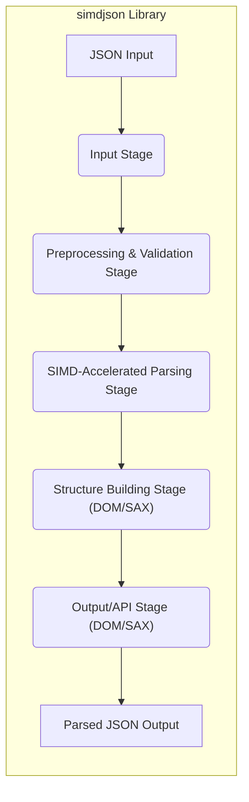

# Project Design Document: simdjson Library

**Version:** 1.1
**Date:** October 26, 2023
**Author:** AI Software Architect

## 1. Introduction

This document provides a detailed architectural design for the `simdjson` library (as found at https://github.com/simd-lite/simd-json). This design aims to be comprehensive enough to facilitate effective threat modeling and security analysis of the library. `simdjson` is a high-performance JSON parser that leverages Single Instruction, Multiple Data (SIMD) instructions to achieve significant speed improvements over traditional JSON parsing methods. This document will cover the key components, data flow, and design decisions that are relevant from a security perspective, providing more granular detail than the previous version.

## 2. Goals and Objectives

The primary goals of `simdjson` are:

* **Extreme Performance:** Achieve the fastest possible JSON parsing speed, often orders of magnitude faster than standard libraries.
* **Guaranteed Correctness:** Ensure accurate and reliable parsing of valid JSON documents according to the JSON specification (RFC 8259).
* **Robust Security:** Process untrusted JSON input safely, preventing common vulnerabilities such as buffer overflows, denial-of-service attacks, and injection vulnerabilities.
* **Developer Friendliness:** Provide a relatively straightforward and well-documented API for integration into various projects across different programming languages.
* **Broad Platform Support:** Support multiple operating systems (Linux, macOS, Windows) and architectures (x86, ARM).

This design document focuses on elucidating the architecture in a way that explicitly highlights potential security considerations and attack surfaces related to these goals.

## 3. System Architecture

`simdjson`'s architecture can be broadly divided into the following stages and interacting components:

* **Input Stage:** Responsible for receiving the raw JSON data and preparing it for initial processing.
* **Preprocessing and Validation Stage:** Performs essential checks and transformations on the input data to ensure it conforms to basic JSON requirements and is safe to process further.
* **SIMD-Accelerated Parsing Stage:** The core of the library, utilizing SIMD instructions for parallel processing of the JSON structure.
* **Structure Building Stage:** Constructs the in-memory representation of the parsed JSON, offering both DOM-style and SAX-style APIs.
* **Output/API Stage:** Provides the interfaces for accessing and utilizing the parsed JSON data.

## 4. Key Components

This section provides a more detailed breakdown of the key components within the `simdjson` library and their specific functionalities, with a focus on security implications.

* **Input Stage:**
    * **Input Buffer Management:** Receives the raw JSON data, typically as a `std::string_view` or a pointer to a memory buffer with a specified length. This component must handle potential issues with buffer boundaries and ensure no out-of-bounds reads occur.
    * **Encoding Detection (Implicit):** While primarily focused on UTF-8, the initial stages implicitly handle some aspects of encoding by validating UTF-8 sequences. Incorrect handling here could lead to misinterpretation of characters.

* **Preprocessing & Validation Stage:**
    * **Whitespace Skipping (SIMD-Accelerated):** Efficiently identifies and skips whitespace characters using SIMD instructions. This is crucial for performance but must be implemented carefully to avoid skipping over meaningful characters in malformed JSON.
    * **UTF-8 Validation (Critical Security Component):**  A core security feature. This component rigorously validates that the input is valid UTF-8. Bypasses or vulnerabilities in this stage could allow for injection attacks or unexpected behavior in downstream processing. It likely involves checking for valid byte sequences and preventing overlong or ill-formed UTF-8.
    * **Structural Validation (Initial Checks):** Performs preliminary checks for basic JSON structure, such as balanced brackets (`{}`, `[]`). This helps to quickly reject obviously malformed input and prevent more costly parsing operations on invalid data. Examples include checking if the input starts with an opening bracket or brace.

* **SIMD-Accelerated Parsing Stage:**
    * **Character Classification (SIMD Intrinsics):**  Uses SIMD instructions (e.g., SSE, AVX) to classify characters in parallel. This involves identifying structural characters (`{`, `}`, `[`, `]`, `:`, `,`, `"`) and value characters. Incorrect classification could lead to misinterpretation of the JSON structure.
    * **Structural Element Identification (Bit Manipulation & SIMD):** Identifies the boundaries of JSON objects, arrays, and strings using advanced bit manipulation techniques and SIMD comparisons. This is where the core performance gains are achieved. Care must be taken to handle edge cases and potential overlaps or inconsistencies in malformed JSON.
    * **String Parsing and Unescaping:** Parses string literals, handling escape sequences (`\`, `\"`, `\\`, `\n`, `\r`, `\t`, `\uXXXX`). Vulnerabilities can arise from incorrect handling of escape sequences, potentially leading to injection attacks if the parsed data is later used in contexts where these escapes have special meaning. Buffer overflows are a risk if the unescaped string is larger than the allocated buffer.
    * **Number Parsing (Integer and Floating-Point):** Parses numeric values. This involves different code paths for integers and floating-point numbers. Security considerations include preventing integer overflows, handling extremely large or small numbers, and correctly parsing different number formats. Denial-of-service vulnerabilities could arise from attempting to parse extremely long sequences of digits.

* **Structure Building Stage (DOM/SAX):**
    * **DOM (Document Object Model) Builder:** Creates a tree-like in-memory representation of the JSON document.
        * **Memory Allocation:** Dynamically allocates memory for JSON values (strings, numbers, booleans, null, objects, arrays). Careful memory management is crucial to prevent leaks and buffer overflows. The allocator used should be robust against fragmentation and exhaustion.
        * **Tree Construction:** Establishes parent-child relationships between nodes in the DOM tree. Errors in tree construction could lead to incorrect data access or manipulation.
    * **SAX (Simple API for XML) Event Generator (Lazy Parsing):** Provides an event-driven interface, reporting parsing events (start object, key, value, end object, etc.) without necessarily building a full DOM tree in memory.
        * **Event Sequencing:** Ensures the correct sequence of parsing events is generated.
        * **State Management:** Maintains the internal parsing state to correctly identify the context of each event.

* **Output/API Stage (DOM/SAX):**
    * **DOM API:** Provides methods for accessing and traversing the constructed DOM tree.
        * **Safe Accessors:**  Access methods should be designed to prevent out-of-bounds access or access to uninitialized data.
        * **Immutability (Optional but Recommended):**  If the DOM is designed to be immutable after parsing, it can reduce the risk of accidental or malicious modification.
    * **SAX API:** Provides callbacks that are invoked as parsing events occur.
        * **Callback Security:**  The library needs to ensure that the callbacks are invoked safely and that user-provided callback functions do not introduce vulnerabilities.

## 5. Data Flow (Enhanced Detail)

The typical data flow through `simdjson` with a focus on security checkpoints is as follows:

1. **JSON Input:** The library receives the raw JSON data. Potential attack vectors here include providing excessively large input or malformed data.
2. **Input Stage:** The input data is buffered. Security checks should ensure buffer boundaries are respected.
3. **Preprocessing & Validation Stage:**
    * **UTF-8 Validation:**  **CRITICAL SECURITY CHECKPOINT.** Invalid UTF-8 will be rejected. This prevents many common injection attacks.
    * **Whitespace Skipping:**  Performed efficiently.
    * **Initial Structural Validation:** Basic structural checks help filter out obviously invalid JSON early.
4. **SIMD-Accelerated Parsing Stage:**
    * **Character Classification:**  SIMD instructions are used for speed. Errors here could lead to misinterpretation of structure.
    * **Structural Element Identification:**  SIMD and bit manipulation are used. Robustness against malformed input is key.
    * **String Parsing and Unescaping:**  **POTENTIAL VULNERABILITY AREA.**  Careful handling of escape sequences is essential to prevent injection attacks and buffer overflows.
    * **Number Parsing:**  **POTENTIAL VULNERABILITY AREA.**  Integer overflows and handling of very large numbers need careful implementation.
5. **Structure Building Stage:**
    * **DOM Mode:** Memory is allocated for the DOM tree. **MEMORY MANAGEMENT IS A KEY SECURITY CONCERN.**
    * **SAX Mode:** Parsing events are generated. The sequence and correctness of events are important.
6. **Output/API Stage:**
    * **DOM API:** Users access the DOM. API design should prevent unsafe access.
    * **SAX API:** User-defined callbacks are invoked. The library must ensure safe invocation.
7. **Parsed JSON Output:** The user retrieves the parsed JSON data.

```mermaid
graph LR
    A["Receive JSON Input"] --> B("Input Stage: Buffering");
    B --> C("Preprocessing: UTF-8 Validation (SECURITY CHECKPOINT)");
    C -- "Valid UTF-8" --> D("Preprocessing: Whitespace Skipping");
    C -- "Invalid UTF-8" --> Z1["Error: Invalid UTF-8"];
    D --> E("Preprocessing: Initial Structural Validation");
    E --> F("SIMD-Accelerated Parsing: Character Classification");
    F --> G("SIMD-Accelerated Parsing: Structural Element Identification");
    G --> H("SIMD-Accelerated Parsing: String Parsing & Unescaping (POTENTIAL VULNERABILITY)");
    H --> I("SIMD-Accelerated Parsing: Number Parsing (POTENTIAL VULNERABILITY)");
    I --> J{{"DOM API Path"}};
    I --> K{{"SAX API Path"}};
    J -- "Build DOM Tree (MEMORY MANAGEMENT - SECURITY CONCERN)" --> L("DOM Structure in Memory");
    K -- "Generate Parsing Events" --> M("SAX Event Callbacks");
    L --> N["Return Parsed Data (DOM)"];
    M --> O["Return Parsed Data (SAX)"];
```

## 6. Security Considerations (Expanded)

This section expands on the security considerations, providing more specific examples and potential attack vectors:

* **Input Validation Vulnerabilities:**
    * **UTF-8 Validation Bypass:** A vulnerability in the UTF-8 validation could allow attackers to inject arbitrary characters or bypass security checks in later stages. For example, using overlong UTF-8 sequences or other encoding tricks.
    * **Malformed JSON Exploitation:**  Subtly malformed JSON that is not strictly invalid but can cause unexpected behavior in the parser or the application consuming the parsed data. Examples include deeply nested structures leading to stack overflows or excessively long strings causing memory allocation issues.

* **Memory Management Vulnerabilities:**
    * **Buffer Overflows in String Handling:** Incorrectly calculating the required buffer size for unescaped strings or other parsed values could lead to buffer overflows when writing data.
    * **Integer Overflows in Memory Allocation:**  Integer overflows when calculating the size of memory to allocate for large JSON structures could lead to small allocations and subsequent buffer overflows.
    * **Denial of Service via Resource Exhaustion:**  Providing extremely large or deeply nested JSON documents could exhaust available memory or processing time, leading to a denial of service.

* **Parsing Logic Vulnerabilities:**
    * **Incorrect Escape Sequence Handling:**  Failing to correctly handle all valid escape sequences or misinterpreting them could lead to injection vulnerabilities if the parsed data is used in contexts where these escapes have special meaning (e.g., SQL injection, command injection).
    * **Integer Overflow During Number Parsing:** Parsing very large numeric values without proper bounds checking could lead to integer overflows, resulting in incorrect values or potentially exploitable behavior.
    * **Floating-Point Parsing Issues:**  While less common, vulnerabilities could arise from incorrect handling of edge cases or specific formats in floating-point number parsing.

* **API Security:**
    * **Unsafe Accessors:**  DOM API methods that do not perform bounds checking or type validation could lead to crashes or unexpected behavior if used incorrectly.
    * **Mutability of Parsed Data:** If the DOM API allows modification of the parsed structure after parsing, this could introduce vulnerabilities if the original JSON was untrusted.

* **Side-Channel Attack Potential:**  While primarily a concern for cryptographic libraries, the performance-focused nature of `simdjson` means that timing variations in parsing different inputs could potentially leak information in highly sensitive scenarios.

## 7. Deployment Considerations (Security Focused)

Security considerations during deployment are paramount:

* **Secure Compilation Practices:**  Compile `simdjson` with compiler flags that enable security features such as:
    * **Stack Canaries:** To detect stack buffer overflows.
    * **Address Space Layout Randomization (ASLR):** To make memory addresses unpredictable, hindering exploitation.
    * **Position Independent Executable (PIE):**  To further enhance ASLR.
* **Regular Security Audits and Updates:**  Ensure that the deployed version of `simdjson` is up-to-date with the latest security patches and has undergone recent security audits.
* **Sandboxing and Isolation:**  In environments processing untrusted JSON, run applications using `simdjson` within sandboxed environments or containers to limit the impact of potential vulnerabilities.
* **Input Sanitization and Validation at Application Level:**  While `simdjson` performs validation, applications should also implement their own input sanitization and validation logic to enforce expected data formats and constraints.
* **Resource Limits:**  Configure resource limits (e.g., maximum input size, maximum nesting depth) at the application level to mitigate potential denial-of-service attacks.

## 8. Future Enhancements (Security Prioritized)

Future development should continue to prioritize security:

* **Continuous Fuzzing Integration:** Implement and maintain a robust continuous fuzzing infrastructure using tools like libFuzzer or AFL to automatically discover potential vulnerabilities.
* **Advanced Static Analysis Integration:**  Incorporate advanced static analysis tools into the development pipeline to identify potential security weaknesses early in the development cycle.
* **Formal Verification of Critical Components:**  Explore the feasibility of using formal verification techniques for critical parsing components, such as the UTF-8 validator and core parsing engine, to provide a higher level of assurance about their correctness and security.
* **Memory Safety Enhancements:**  Investigate the use of memory-safe languages or techniques within the C++ codebase where appropriate, or utilize advanced memory error detection tools during development and testing.
* **Security Hardening Options:**  Provide compile-time or runtime options to enable more aggressive security checks or resource limits for deployments in high-security environments.
* **Vulnerability Disclosure Program:** Establish a clear process for reporting and addressing security vulnerabilities discovered by external researchers.

This improved design document provides a more detailed and security-focused view of the `simdjson` library's architecture, intended to be a valuable resource for threat modeling and security analysis.