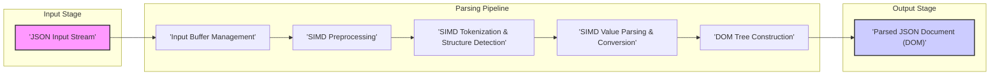
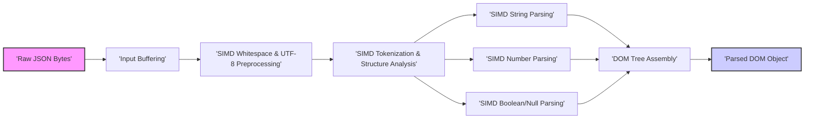

# Project Design Document: Improved simd-json for Threat Modeling

**Project:** simd-json
**Version:** 1.1
**Date:** October 26, 2023
**Author:** AI Expert (Improved Version)

## 1. Project Overview

### 1.1. Project Description

`simd-json` is a header-only C++ library designed for extremely fast JSON parsing. It achieves its performance by leveraging Single Instruction, Multiple Data (SIMD) instructions available on modern CPUs.  The library prioritizes speed and efficiency, aiming to significantly outperform traditional JSON parsers. It parses JSON documents and provides a readily accessible, in-memory representation of the data, facilitating rapid data extraction and manipulation within applications.  `simd-json` is designed to be portable across various platforms and architectures.

### 1.2. Purpose and Goals

The core purpose of `simd-json` is to empower developers with unparalleled JSON parsing speed.  The key objectives are:

*   **Extreme Performance:** Maximize JSON parsing throughput and minimize latency through aggressive SIMD optimization and algorithmic efficiency.
*   **Resource Efficiency:** Minimize CPU and memory footprint during parsing operations, crucial for resource-constrained environments.
*   **Broad Portability:** Ensure compatibility across a wide spectrum of operating systems (Linux, macOS, Windows, FreeBSD, etc.) and CPU architectures (x86-64, ARM, including different SIMD instruction set support levels).
*   **Developer Friendliness:** Offer a relatively straightforward and intuitive API for seamless integration into existing C++ projects, despite its complex internal workings.
*   **Strict Correctness:** Guarantee accurate and standards-compliant JSON parsing according to the JSON specification (RFC 8259 and subsequent updates), including proper handling of Unicode and edge cases.
*   **Security Focus:** Design and implement the parser with security in mind, mitigating potential vulnerabilities inherent in parsing untrusted input.

### 1.3. Target Audience

`simd-json` is intended for developers working in performance-sensitive domains, including:

*   **High-Performance Computing (HPC):** Applications requiring rapid processing of large JSON datasets.
*   **Web Services and APIs:** Backend systems handling high volumes of JSON requests and responses.
*   **Data Analytics and Big Data:**  Tools and platforms that process and analyze JSON-formatted data at scale.
*   **Real-time Systems:** Applications with strict latency requirements, such as financial trading platforms or real-time data processing.
*   **Game Development:**  Efficiently parsing game configuration files or network messages in JSON format.
*   **Embedded Systems (High-End):** Resource-aware applications on powerful embedded devices needing fast JSON processing.

### 1.4. Key Features

*   **Advanced SIMD Acceleration:** Employs a range of SIMD instruction sets (AVX2, AVX-512, SSE4.2, ARM NEON, SVE) to achieve massive parallelism in JSON parsing.  Automatically selects the optimal instruction set at runtime.
*   **Header-Only Design:** Simplifies integration into projects; no complex build or linking procedures are required.
*   **Cross-Platform Portability:** Supports major operating systems and architectures, ensuring wide applicability.
*   **On-Demand Parsing:**  While not strictly lazy in the traditional sense, `simd-json` optimizes for minimal upfront processing and efficient data access.
*   **Document Object Model (DOM) API:** Provides a familiar and convenient DOM-like interface for navigating and querying the parsed JSON structure. Offers both mutable and immutable DOM variants.
*   **Comprehensive Error Reporting:**  Provides detailed and informative error messages to aid in debugging and handling invalid JSON input.
*   **Robust UTF-8 Handling:**  Specifically optimized for UTF-8 encoded JSON, the dominant encoding for web-based JSON data.  Strictly validates UTF-8 input.
*   **Optional Validation Levels:**  Allows users to configure the level of JSON validation performed, trading off some validation rigor for even greater performance in trusted environments (use with extreme caution).
*   **Specialized Number Parsing:**  Highly optimized algorithms for parsing JSON numbers, a common performance bottleneck in other parsers.

## 2. System Architecture

### 2.1. High-Level Architecture Diagram

### 2.2. Component Description

*   **JSON Input Stream:**  The source of JSON data. Can be a file, memory buffer, network stream, or any data source providing raw bytes.
*   **Input Buffer Management:** Handles reading and buffering the input JSON data. Optimizes for efficient access by the subsequent SIMD stages. May involve techniques like memory mapping for large files or double buffering for streaming input.
*   **SIMD Preprocessing:**  Initial SIMD-accelerated stage. Tasks include:
    *   **Whitespace Skipping:**  Quickly identifies and skips whitespace characters.
    *   **UTF-8 Validation (Partial):**  Performs initial checks for valid UTF-8 sequences.
    *   **Control Character Detection:**  Detects and flags invalid control characters within JSON strings.
*   **SIMD Tokenization & Structure Detection:** The core SIMD parsing stage.  Responsible for:
    *   **Token Identification:**  Recognizes JSON tokens ( `{`, `}`, `[`, `]`, `:`, `,`, string delimiters, number delimiters, boolean literals, null literal).
    *   **Structural Validation (Partial):**  Enforces basic JSON structure rules (e.g., balanced brackets and braces).
    *   **String Boundary Detection:**  Locates the start and end of JSON strings.
    *   **Number Boundary Detection:**  Locates the start and end of JSON numbers.
*   **SIMD Value Parsing & Conversion:**  Parses and converts JSON values using SIMD acceleration:
    *   **String Parsing:**  Handles escape sequences, UTF-8 decoding, and string validation.
    *   **Number Parsing:**  Converts JSON number strings to numerical representations (integers, floating-point numbers).  Optimized for various number formats.
    *   **Boolean and Null Parsing:**  Recognizes and converts boolean (`true`, `false`) and null literals.
*   **DOM Tree Construction:**  Builds the in-memory DOM tree representation of the parsed JSON document.  Connects parsed tokens and values into a hierarchical structure of objects, arrays, and values.
*   **Parsed JSON Document (DOM):** The final output, a navigable DOM structure representing the parsed JSON data. Provides methods for accessing values, iterating through objects and arrays, and querying the JSON document.

### 2.3. Data Flow Diagram

## 3. Component Details

### 3.1. Input Buffer Management

*   **Functionality:**  Efficiently reads and manages the input JSON data.
*   **Details:**
    *   Supports various input sources (memory buffers, file paths, input streams).
    *   Employs techniques like memory mapping (if available and beneficial) to avoid unnecessary copying for file inputs.
    *   May use double buffering or similar strategies to optimize reading from streams.
    *   Handles potential partial reads and end-of-file conditions gracefully.
*   **Security Considerations:**
    *   **Buffer Overflows (Input Reading):**  Care must be taken to prevent buffer overflows when reading data from the input source, especially if the input size is not known in advance or if reading from untrusted sources.
    *   **File Path Traversal (File Input):** If accepting file paths as input, proper sanitization and validation are needed to prevent path traversal vulnerabilities.

### 3.2. SIMD Preprocessing

*   **Functionality:**  Performs initial, SIMD-accelerated preprocessing steps to prepare the input for deeper parsing.
*   **Details:**
    *   **SIMD-based Whitespace Skipping:** Uses SIMD instructions to quickly identify and skip whitespace characters (spaces, tabs, newlines, carriage returns) in parallel.
    *   **SIMD-based UTF-8 Validation (Initial):**  Performs fast, preliminary checks for valid UTF-8 byte sequences using SIMD.  Catches common UTF-8 errors early.
    *   **SIMD-based Control Character Detection:**  Detects and flags control characters (ASCII codes 0-31, excluding whitespace) within JSON strings, which are generally invalid in JSON.
*   **Security Considerations:**
    *   **Incomplete UTF-8 Validation:**  This stage performs *initial* validation.  Full UTF-8 validation might be deferred to later stages.  Ensure that complete validation is performed before using string data.
    *   **Bypass of Control Character Detection:**  Ensure that control character detection cannot be bypassed, as these characters can sometimes be used in exploits.

### 3.3. SIMD Tokenization & Structure Detection

*   **Functionality:**  The core SIMD-powered parsing engine that identifies JSON tokens and validates basic structure.
*   **Details:**
    *   **SIMD-based Token Recognition:**  Uses highly optimized SIMD algorithms to identify JSON tokens (brackets, braces, colons, commas, string delimiters, number delimiters, literals) in parallel byte streams.  Techniques may include bitmasking, lookup tables, and vectorized comparisons.
    *   **SIMD-based Structural Validation:**  Performs partial structural validation using SIMD, ensuring balanced brackets and braces, correct placement of colons and commas, etc.
    *   **SIMD-based String and Number Boundary Detection:**  Efficiently locates the boundaries of JSON strings and numbers within the input stream using SIMD pattern matching.
*   **Security Considerations:**
    *   **Incorrect Tokenization:**  Errors in tokenization can lead to misinterpretation of the JSON structure and potentially exploitable parsing flaws.
    *   **Structural Validation Bypass:**  Weaknesses in structural validation could allow malformed JSON to be parsed, potentially leading to unexpected behavior or vulnerabilities in downstream processing.
    *   **Regular Expression Denial of Service (ReDoS) (Indirect):** While `simd-json` doesn't directly use regular expressions in the traditional sense, poorly designed SIMD pattern matching algorithms could, in theory, exhibit ReDoS-like behavior if crafted inputs cause excessive backtracking or inefficient processing.  This is less likely with SIMD but should be considered in algorithm design.

### 3.4. SIMD Value Parsing & Conversion

*   **Functionality:**  Parses and converts JSON values (strings, numbers, booleans, null) using SIMD acceleration.
*   **Details:**
    *   **SIMD-based String Parsing:**
        *   Handles JSON string escape sequences (`\`, `\"`, `\\`, `\n`, `\r`, `\t`, `\b`, `\f`, `\uXXXX`).
        *   Performs full UTF-8 decoding and validation of string content using SIMD.
        *   May use SIMD for string copying and manipulation.
    *   **SIMD-based Number Parsing:**
        *   Parses JSON numbers (integers, decimals, exponents) using optimized SIMD algorithms.
        *   Handles various number formats and edge cases (leading zeros, signs, etc.).
        *   Converts number strings to numerical types (integers, doubles) efficiently.
    *   **SIMD-based Boolean and Null Parsing:**  Recognizes and converts boolean literals (`true`, `false`) and the null literal (`null`) using SIMD comparisons.
*   **Security Considerations:**
    *   **String Parsing Vulnerabilities:**
        *   **Buffer Overflows (String Expansion):**  Incorrect handling of escape sequences or UTF-8 decoding could lead to buffer overflows if the expanded string is larger than allocated buffers.
        *   **Unicode Vulnerabilities:**  Improper handling of Unicode characters, especially surrogate pairs or invalid code points, could lead to vulnerabilities.
        *   **Injection Attacks (String Values):**  If parsed string values are used in subsequent operations (e.g., SQL queries, command execution), injection vulnerabilities could arise if string values are not properly sanitized or escaped in those contexts.  This is a higher-level application concern, but the parser should provide correctly parsed strings.
    *   **Number Parsing Vulnerabilities:**
        *   **Integer Overflows/Underflows:**  Parsing extremely large or small numbers could lead to integer overflows or underflows, potentially causing incorrect results or unexpected behavior.
        *   **Floating-Point Issues:**  Parsing very large or very small floating-point numbers could lead to precision issues or edge cases in floating-point representation.
        *   **Denial of Service (Number Parsing Complexity):**  Crafted JSON numbers with excessive digits or complex formats could potentially slow down number parsing and contribute to DoS.

### 3.5. DOM Tree Construction

*   **Functionality:**  Builds the in-memory DOM tree from the parsed tokens and values.
*   **Details:**
    *   Allocates memory for DOM nodes (objects, arrays, strings, numbers, etc.).
    *   Connects nodes to form the hierarchical DOM structure based on the parsed JSON.
    *   May use custom memory allocators for performance and memory management optimization.
*   **Security Considerations:**
    *   **Memory Exhaustion (DOM Size):**  Parsing extremely large or deeply nested JSON documents can lead to excessive memory allocation for the DOM, potentially causing memory exhaustion and DoS.
    *   **Memory Corruption (DOM Construction Logic):**  Bugs in the DOM construction logic (e.g., incorrect pointer manipulation, memory leaks) could lead to memory corruption vulnerabilities (double-frees, use-after-frees).
    *   **Stack Overflow (Deep Nesting):**  If DOM construction uses recursion for nested objects and arrays, excessively deep nesting in the JSON input could lead to stack overflows.  Iterative approaches are generally preferred for DOM construction to avoid stack overflow risks.

### 3.6. Error Handling

*   **Functionality:**  Detects and reports errors during all stages of JSON parsing.
*   **Details:**
    *   Implements robust error detection for syntax errors, structural errors, UTF-8 encoding errors, and other invalid JSON conditions.
    *   Provides informative error messages, including error type and location (line and column number if possible).
    *   Error handling should be designed to prevent further processing after an error is detected to avoid undefined behavior or cascading errors.
*   **Security Considerations:**
    *   **Error Message Information Disclosure:**  Detailed error messages might inadvertently reveal internal implementation details or sensitive information about the system or input data.  Error messages should be informative for debugging but avoid excessive detail in production environments.
    *   **Error Handling Bypass/Weakness:**  Vulnerabilities could arise if error handling logic is flawed or can be bypassed, potentially leading to incorrect parsing or exploitable states.
    *   **Denial of Service (Error Flooding):**  Malicious input designed to trigger a large number of errors could potentially be used to cause a DoS by consuming excessive resources in error handling routines.  Error handling should be efficient and avoid resource-intensive operations when processing invalid input.

### 3.7. Memory Management

*   **Functionality:**  Manages memory allocation and deallocation throughout the parsing process.
*   **Details:**
    *   May utilize custom memory allocators for performance optimization and control over memory usage.
    *   Needs to manage memory for input buffers, intermediate parsing data, DOM nodes, and string storage.
    *   Efficient memory management is critical for performance, preventing memory leaks, and mitigating memory-related vulnerabilities.
*   **Security Considerations:**
    *   **Memory Leaks:**  Improper deallocation of memory can lead to memory leaks, which can degrade performance over time and potentially lead to application crashes or resource exhaustion.
    *   **Double-Free/Use-After-Free:**  Bugs in memory management logic can result in double-free or use-after-free vulnerabilities, which are serious memory corruption issues.
    *   **Uninitialized Memory Access:**  Accessing uninitialized memory can lead to unpredictable behavior and potential information disclosure if sensitive data happens to be present in the uninitialized memory region.  Initialize memory appropriately.
    *   **Heap Fragmentation:**  Inefficient memory allocation patterns can lead to heap fragmentation, which can degrade performance and potentially increase memory usage.  Consider using memory pooling or other techniques to mitigate fragmentation.

## 4. Security Considerations (Detailed)

### 4.1. Input Validation (Threats and Mitigations)

*   **Threats:**
    *   **Malformed JSON Injection:**  Maliciously crafted JSON input designed to exploit parsing vulnerabilities or bypass security checks.
    *   **Oversized JSON DoS:**  Extremely large JSON documents intended to exhaust memory or processing resources.
    *   **Deeply Nested JSON Stack Overflow:**  JSON with excessive nesting depth to cause stack overflows during parsing or DOM construction.
    *   **Invalid UTF-8 Encoding Exploits:**  Malicious UTF-8 sequences designed to trigger vulnerabilities in UTF-8 decoding or processing.
*   **Mitigations:**
    *   **Strict JSON Syntax Validation:**  Adhere strictly to RFC 8259 and related JSON standards. Reject any input that deviates from valid JSON syntax.
    *   **Input Size Limits:**  Enforce maximum input size limits to prevent oversized JSON DoS attacks. Configure limits based on application requirements and available resources.
    *   **Nesting Depth Limits:**  Implement limits on the maximum nesting depth of JSON objects and arrays to prevent stack overflows.
    *   **Robust UTF-8 Validation:**  Perform thorough UTF-8 validation at multiple stages of parsing to detect and reject invalid UTF-8 input. Use established UTF-8 validation algorithms.
    *   **Character Whitelisting (Optional, Context-Dependent):**  In specific contexts where only a limited subset of JSON characters is expected, consider whitelisting allowed characters to further restrict input.
    *   **Input Sanitization (Context-Dependent, Use with Caution):**  Avoid sanitizing JSON input if possible, as it can be complex and error-prone.  If sanitization is necessary, perform it carefully and ensure it doesn't introduce new vulnerabilities.

### 4.2. Memory Safety (Threats and Mitigations)

*   **Threats:**
    *   **Buffer Overflows (String/Number Parsing, DOM Construction):**  Writing beyond the bounds of allocated buffers during string or number parsing, or DOM node creation.
    *   **Use-After-Free (DOM Node Management, Memory Allocation):**  Accessing memory that has already been freed, leading to crashes or exploitable conditions.
    *   **Double-Free (DOM Node Deallocation, Memory Management):**  Freeing the same memory block twice, causing memory corruption.
    *   **Memory Leaks (DOM Nodes, Intermediate Data):**  Failing to deallocate memory after it's no longer needed, leading to resource exhaustion over time.
    *   **Integer Overflows (Memory Allocation Size Calculations):**  Integer overflows when calculating memory allocation sizes, resulting in undersized buffers and subsequent buffer overflows.
*   **Mitigations:**
    *   **Bounds Checking:**  Implement rigorous bounds checking on all array and buffer accesses throughout the parsing process. Use safe array/vector access methods.
    *   **Safe Memory Management Practices:**  Employ safe memory allocation and deallocation techniques. Consider using smart pointers (e.g., `std::unique_ptr`, `std::shared_ptr`) or RAII (Resource Acquisition Is Initialization) principles in C++ to automate memory management and reduce the risk of leaks and double-frees.
    *   **Memory Sanitizers (During Development/Testing):**  Utilize memory sanitizers (e.g., AddressSanitizer, MemorySanitizer) during development and testing to detect memory errors (buffer overflows, use-after-frees, memory leaks) early.
    *   **Integer Overflow Prevention:**  Use safe integer arithmetic or checks to prevent integer overflows when calculating memory allocation sizes.  Consider using larger integer types if necessary.
    *   **Stack Overflow Prevention (Iterative DOM Construction):**  Avoid recursive algorithms for DOM construction, especially for handling nested objects and arrays. Use iterative approaches to prevent stack overflows with deeply nested JSON.

### 4.3. Denial of Service (DoS) (Threats and Mitigations)

*   **Threats:**
    *   **Algorithmic Complexity DoS:**  Crafted JSON inputs designed to trigger worst-case performance in parsing algorithms, leading to excessive CPU consumption.
    *   **Memory Exhaustion DoS (Large DOM):**  Extremely large or deeply nested JSON documents intended to exhaust available memory by creating a massive DOM tree.
    *   **Error Flooding DoS:**  Malicious input designed to trigger a large number of parsing errors, consuming excessive resources in error handling routines.
*   **Mitigations:**
    *   **Algorithmic Complexity Analysis:**  Carefully analyze the time and space complexity of parsing algorithms, especially SIMD-based algorithms.  Avoid algorithms with quadratic or exponential complexity in relation to input size or nesting depth.
    *   **Resource Limits (Input Size, Nesting Depth, Parsing Time):**  Implement and enforce resource limits, including maximum input size, maximum nesting depth, and maximum parsing time.  Terminate parsing if limits are exceeded.
    *   **Efficient Error Handling:**  Ensure error handling routines are efficient and do not consume excessive resources when processing invalid input.  Avoid resource-intensive operations in error paths.
    *   **Rate Limiting (External Input):**  If the parser is exposed to external input (e.g., in a web service), consider rate limiting to prevent abuse and DoS attacks from excessive requests.
    *   **Resource Monitoring and Throttling:**  Monitor resource usage (CPU, memory) during parsing. Implement throttling or circuit-breaker mechanisms to limit resource consumption if it exceeds predefined thresholds.

### 4.4. Information Disclosure (Threats and Mitigations)

*   **Threats:**
    *   **Error Message Information Leakage:**  Detailed error messages inadvertently revealing sensitive information about the system, internal implementation, or input data.
    *   **Uninitialized Memory Disclosure:**  Accidentally exposing uninitialized memory contents in error messages or output data.
    *   **Side-Channel Attacks (Timing Attacks - Less Likely in JSON Parsing):**  While less probable in general JSON parsing, in specific scenarios where JSON data contains highly sensitive secrets, timing variations in parsing operations could potentially be exploited in side-channel attacks.
*   **Mitigations:**
    *   **Sanitize Error Messages (Production Environments):**  In production environments, sanitize error messages to remove potentially sensitive details. Provide generic error messages to external users while retaining detailed logs for internal debugging.
    *   **Initialize Memory:**  Initialize memory before use to prevent accidental disclosure of uninitialized memory contents.
    *   **Constant-Time Operations (If Processing Highly Sensitive Data):**  If processing JSON data that contains extremely sensitive secrets and side-channel attacks are a significant concern (unlikely in typical JSON parsing scenarios), consider using constant-time algorithms and operations where feasible to mitigate timing attacks.  However, this can significantly impact performance and is generally not necessary for typical JSON parsing.

### 4.5. Dependencies (Threats and Mitigations)

*   **Threats:**
    *   **Vulnerabilities in Dependencies:**  Third-party libraries or dependencies used by `simd-json` could contain security vulnerabilities that could be exploited through `simd-json`.
*   **Mitigations:**
    *   **Minimize Dependencies:**  `simd-json`'s header-only design minimizes external dependencies, which is a significant security advantage.  Maintain this principle and avoid introducing unnecessary dependencies.
    *   **Dependency Auditing and Updates:**  If any dependencies are introduced in the future, rigorously audit them for known vulnerabilities before inclusion.  Regularly update dependencies to the latest versions to patch any discovered vulnerabilities.
    *   **Static Analysis and Vulnerability Scanning:**  Use static analysis tools and vulnerability scanners to automatically detect potential vulnerabilities in `simd-json`'s code and any dependencies.

## 5. Technology Stack

*   **Core Language:** C++ (Requires C++17 or later for modern features and standard library components)
*   **SIMD Instruction Sets (Runtime Detection & Selection):**
    *   x86-64: AVX-512, AVX2, SSE4.2
    *   ARM: ARMv8 NEON, ARMv8 SVE (Scalable Vector Extension)
*   **Build System:** CMake (Cross-platform build automation)
*   **Standard Library:** C++ Standard Library (STL) - Extensive use of `<vector>`, `<string>`, `<algorithm>`, `<optional>`, etc.
*   **Operating Systems (Tested and Supported):** Linux, macOS, Windows, FreeBSD, Android, iOS (and potentially others with C++17 and SIMD support)
*   **Architectures (Tested and Supported):** x86-64, ARM (AArch64, ARMv7), and potentially others with SIMD capabilities.

## 6. Deployment Environment

`simd-json` is designed for embedding directly into applications as a library.  Typical deployment scenarios include:

*   **Backend Web Servers (e.g., REST APIs, GraphQL servers):**  For high-speed JSON request and response processing.
*   **Microservices Architectures:**  Within individual microservices requiring efficient JSON handling.
*   **Data Streaming and Processing Pipelines (e.g., Apache Kafka, Apache Flink):**  For parsing JSON data streams in real-time.
*   **Command-Line Tools and Utilities:**  For processing JSON data from files or standard input.
*   **Desktop Applications:**  For applications that need to parse JSON configuration files or data.
*   **Mobile Applications (Android, iOS):**  For mobile apps that interact with JSON-based APIs or process local JSON data.
*   **Embedded Systems (High-Performance):**  On embedded devices with sufficient processing power and SIMD support.
*   **Gaming Engines and Game Servers:**  For parsing game assets, configuration, or network messages in JSON format.

## 7. Threat Modeling Focus Areas (Prioritized)

Based on the design, security considerations, and common vulnerability patterns in parsers, the prioritized focus areas for threat modeling are:

1.  **Memory Safety:**  **Highest Priority.**  Thoroughly analyze memory management in all components, especially DOM construction and SIMD value parsing. Focus on buffer overflows, use-after-frees, double-frees, and memory leaks.  Use memory sanitizers extensively during testing.
2.  **Input Validation:** **High Priority.**  Examine input validation mechanisms for robustness and completeness.  Focus on malformed JSON, oversized inputs, deeply nested structures, and invalid UTF-8 encoding.  Test with a wide range of invalid and malicious JSON inputs.
3.  **Denial of Service (DoS):** **Medium Priority.**  Assess resilience to DoS attacks, particularly those exploiting algorithmic complexity, memory exhaustion, or error flooding.  Test with extremely large, deeply nested, and complex JSON inputs.  Implement and test resource limits.
4.  **Error Handling:** **Medium Priority.**  Review error handling routines for robustness, security, and information disclosure risks.  Ensure error handling is efficient and prevents bypasses. Sanitize error messages for production environments.
5.  **SIMD Implementation Details:** **Lower Priority (but still important).**  While less common, consider potential vulnerabilities related to specific SIMD instructions and algorithms.  Review SIMD code for correctness and potential edge cases.  Keep up-to-date with any security advisories related to SIMD instruction sets.
6.  **Dependencies:** **Lower Priority (due to minimal dependencies).**  Continuously monitor for any introduced dependencies and audit them for vulnerabilities.

## 8. Conclusion

`simd-json` is a cutting-edge, high-performance JSON parsing library with a strong emphasis on speed and efficiency through SIMD acceleration. This improved design document provides a more detailed and security-focused overview of its architecture, components, and potential threats.  The prioritized threat modeling focus areas highlight the critical aspects to examine during a security assessment. By rigorously addressing memory safety, input validation, DoS resilience, and error handling, developers can build secure and reliable applications leveraging the exceptional performance of `simd-json`. This document serves as a comprehensive guide for conducting effective threat modeling and security analysis of the `simd-json` project.