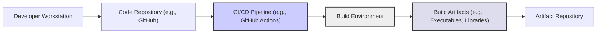

# BUSINESS POSTURE

This project, `simdjson`, provides a high-performance JSON parsing library. The primary business priority it addresses is improving the performance and efficiency of applications that process JSON data. This is crucial for applications where speed and low latency are critical, such as web servers, data analytics pipelines, and real-time systems.

Most important business risks that need to be addressed:

- Performance bottlenecks due to slow JSON parsing can impact application responsiveness and user experience.
- Inefficient resource utilization due to slow parsing can increase operational costs, especially in cloud environments.
- Potential vulnerabilities in the parsing library could lead to application security breaches if not properly addressed.
- Compatibility issues with different JSON formats or edge cases could lead to application errors or data corruption.

# SECURITY POSTURE

Existing security controls:

- security control: Code review process is likely in place as part of the open-source contribution model. (Location: GitHub repository - pull request reviews)
- security control: Static analysis tools might be used during development, although not explicitly mentioned in the repository. (Location: Assumption based on common software development practices)
- security control: Unit and integration tests are present to ensure code correctness and prevent regressions. (Location: GitHub repository - test directory and CI workflows)

Accepted risks:

- accepted risk: As an open-source project, the project relies on community contributions for security vulnerability identification and patching. Response time to vulnerabilities might vary.
- accepted risk:  The library's focus on performance might lead to overlooking certain less common but potentially exploitable edge cases in JSON parsing.

Recommended security controls:

- security control: Implement automated static analysis security testing (SAST) in the CI/CD pipeline to detect potential vulnerabilities early in the development lifecycle.
- security control: Integrate dependency scanning to identify and manage vulnerabilities in third-party libraries used by `simdjson`.
- security control: Establish a clear process for reporting and handling security vulnerabilities, including a security policy and contact information.
- security control: Perform regular security audits and penetration testing to proactively identify and address potential security weaknesses.

Security requirements:

- Authentication: Not applicable. `simdjson` is a library and does not handle authentication.
- Authorization: Not applicable. `simdjson` is a library and does not handle authorization.
- Input validation:
    - security requirement: The library must robustly handle malformed or invalid JSON input without crashing or exhibiting unexpected behavior.
    - security requirement: The library should protect against common JSON parsing vulnerabilities, such as denial-of-service attacks via excessively large JSON documents or deeply nested structures.
    - security requirement: The library should handle various JSON encoding formats correctly and securely.
- Cryptography: Not applicable directly. `simdjson` is a JSON parsing library and does not handle cryptography directly. However, it should not interfere with or weaken any cryptographic operations performed on data before or after parsing.

# DESIGN

## C4 CONTEXT

```mermaid
graph LR
    subgraph "Organization"
        A["Application using simdjson"]
    end
    B["Developer"]
    C["JSON Data Source"]

    B -->|Integrates| A
    C -->|Provides JSON Data| A
    A -->>|Parses JSON Data| simdjson["simdjson Library"]

    style simdjson fill:#f9f,stroke:#333,stroke-width:2px
```

Elements of context diagram:

- Name: Application using simdjson
  - Type: Software System
  - Description:  An application developed by the organization that utilizes the `simdjson` library to parse JSON data. This could be a web server, data processing application, or any software requiring fast JSON parsing.
  - Responsibilities:
    -  Integrates `simdjson` library into its codebase.
    -  Provides JSON data to `simdjson` for parsing.
    -  Processes the parsed JSON data for its intended functionality.
  - Security controls:
    - security control: Input validation on data before passing to `simdjson`.
    - security control: Error handling for parsing failures.
    - security control: Secure coding practices in the application logic that uses parsed JSON data.

- Name: Developer
  - Type: Person
  - Description: Software developers within the organization who are responsible for integrating and using the `simdjson` library in their applications.
  - Responsibilities:
    -  Selects and integrates `simdjson` into applications.
    -  Writes code that utilizes `simdjson` for JSON parsing.
    -  Tests and debugs applications using `simdjson`.
  - Security controls:
    - security control: Secure development training.
    - security control: Code review process.
    - security control: Access control to development environments and code repositories.

- Name: JSON Data Source
  - Type: External System
  - Description:  External systems or services that provide JSON data to the application. This could be APIs, databases, message queues, or files.
  - Responsibilities:
    -  Provides JSON data in a defined format.
    -  Ensures availability and reliability of JSON data.
  - Security controls:
    - security control: Authentication and authorization for accessing JSON data.
    - security control: Data validation and sanitization at the source.
    - security control: Secure communication channels (e.g., HTTPS) for data transfer.

- Name: simdjson Library
  - Type: Software System (External Library)
  - Description: The `simdjson` library itself, a high-performance JSON parsing library written in C++. It is an external dependency for the "Application using simdjson".
  - Responsibilities:
    -  Efficiently and correctly parses JSON data provided by the application.
    -  Provides parsed JSON data in a usable format for the application.
    -  Maintains performance and correctness.
  - Security controls:
    - security control: Input validation within the library to handle malformed JSON.
    - security control: Memory safety to prevent buffer overflows and other memory-related vulnerabilities.
    - security control: Regular updates and patching of the library by its maintainers.

## C4 CONTAINER

```mermaid
graph LR
    subgraph "Application using simdjson"
        A["Application Code"]
        B["simdjson Library"]
    end

    A -->>|Uses for JSON Parsing| B

    style B fill:#f9f,stroke:#333,stroke-width:2px
```

Elements of container diagram:

- Name: Application Code
  - Type: Software Container (Application Component)
  - Description:  The application's own codebase, written in a language compatible with `simdjson` (typically C++ or languages with C++ bindings). This code handles the application's core logic and uses `simdjson` for JSON parsing.
  - Responsibilities:
    -  Application-specific business logic.
    -  Integration with other application components and external systems.
    -  Calling `simdjson` library functions to parse JSON data.
    -  Handling parsed JSON data and using it within the application.
  - Security controls:
    - security control: Secure coding practices in application code.
    - security control: Input validation before and after using `simdjson`.
    - security control: Proper error handling and logging.

- Name: simdjson Library
  - Type: Software Container (External Library)
  - Description: The `simdjson` library, typically included as a shared library or a statically linked library within the application.
  - Responsibilities:
    -  Provides JSON parsing functionality to the application code.
    -  Handles the low-level details of JSON parsing, including syntax analysis and data structure creation.
    -  Optimizes for performance using SIMD instructions and other techniques.
  - Security controls:
    - security control: Input validation within the library.
    - security control: Memory safety within the library.
    - security control: Regular updates and patching of the library.

## DEPLOYMENT

Deployment of `simdjson` is not about deploying the library itself, but rather deploying the *application that uses* `simdjson`.  The deployment architecture will depend entirely on the application using the library.

Assuming a common scenario: a web application using `simdjson` deployed in a cloud environment (e.g., AWS).

```mermaid
graph LR
    subgraph "AWS Cloud Environment"
        subgraph "Availability Zone 1"
            A["Load Balancer"]
            B["Web Server Instance 1"]
        end
        subgraph "Availability Zone 2"
            C["Web Server Instance 2"]
        end
        D["Database Instance"]
    end
    E["Internet"]

    E -->> A
    A -->> B & C
    B & C -->> D

    style A fill:#ccf,stroke:#333,stroke-width:2px
    style B fill:#eee,stroke:#333,stroke-width:2px
    style C fill:#eee,stroke:#333,stroke-width:2px
    style D fill:#dde,stroke:#333,stroke-width:2px
```

Elements of deployment diagram:

- Name: Load Balancer
  - Type: Infrastructure (Load Balancer)
  - Description:  A load balancer (e.g., AWS ALB) distributes incoming internet traffic across multiple web server instances for high availability and scalability.
  - Responsibilities:
    -  Distributes traffic to web server instances.
    -  Performs health checks on web server instances.
    -  Provides SSL/TLS termination.
  - Security controls:
    - security control: DDoS protection.
    - security control: SSL/TLS encryption.
    - security control: Access control lists (ACLs).

- Name: Web Server Instance 1 & 2
  - Type: Infrastructure (Compute Instance)
  - Description:  Virtual machines (e.g., AWS EC2 instances) running the web application that uses `simdjson`. These instances process requests and utilize `simdjson` for JSON parsing.
  - Responsibilities:
    -  Runs the web application code.
    -  Handles HTTP requests.
    -  Parses JSON data using `simdjson`.
    -  Interacts with the database.
  - Security controls:
    - security control: Operating system hardening.
    - security control: Security groups/firewalls.
    - security control: Intrusion detection/prevention systems (IDS/IPS).
    - security control: Regular security patching.

- Name: Database Instance
  - Type: Infrastructure (Database Service)
  - Description:  A database instance (e.g., AWS RDS) used by the web application to store and retrieve data.
  - Responsibilities:
    -  Stores application data.
    -  Provides data persistence.
    -  Handles database queries.
  - Security controls:
    - security control: Database access control and authentication.
    - security control: Data encryption at rest and in transit.
    - security control: Database auditing and monitoring.
    - security control: Regular database backups.

- Name: Internet
  - Type: External Network
  - Description: The public internet, representing external users accessing the web application.
  - Responsibilities:
    -  Provides access to the web application.
    -  Source of incoming HTTP requests.
  - Security controls:
    - security control:  N/A - external network, security is managed at the perimeter (Load Balancer, Web Server).

## BUILD

The build process for an application using `simdjson` will involve compiling the application code and linking it with the `simdjson` library.  The security of the build process is crucial for supply chain security.



Elements of build diagram:

- Name: Developer Workstation
  - Type: Environment
  - Description:  The local machine used by developers to write, test, and commit code.
  - Responsibilities:
    -  Code development and testing.
    -  Committing code changes to the repository.
  - Security controls:
    - security control: Endpoint security software (antivirus, EDR).
    - security control: Operating system security hardening.
    - security control: Access control and authentication.

- Name: Code Repository (e.g., GitHub)
  - Type: System
  - Description:  A version control system (e.g., GitHub) used to store and manage the application's source code, including dependencies like `simdjson` (typically managed via package managers or submodules).
  - Responsibilities:
    -  Source code version control.
    -  Collaboration and code sharing.
    -  Triggering CI/CD pipelines on code changes.
  - Security controls:
    - security control: Access control and authentication.
    - security control: Branch protection and code review requirements.
    - security control: Audit logging of code changes.

- Name: CI/CD Pipeline (e.g., GitHub Actions)
  - Type: System
  - Description:  An automated CI/CD pipeline that builds, tests, and potentially deploys the application. This pipeline is triggered by code changes in the repository.
  - Responsibilities:
    -  Automated build process.
    -  Automated testing (unit, integration, etc.).
    -  Security checks (SAST, dependency scanning).
    -  Artifact creation and publishing.
  - Security controls:
    - security control: Secure pipeline configuration and access control.
    - security control: Use of secure build environments (containerized builds).
    - security control: Integration of security scanning tools (SAST, dependency scanning).
    - security control: Audit logging of pipeline activities.

- Name: Build Environment
  - Type: Environment
  - Description:  The environment where the application is built, typically a clean and isolated environment managed by the CI/CD pipeline.
  - Responsibilities:
    -  Compiling source code.
    -  Linking dependencies (including `simdjson`).
    -  Running tests.
    -  Creating build artifacts.
  - Security controls:
    - security control: Hardened build environment.
    - security control: Minimal software installed in the build environment.
    - security control: Secure access to build environment.

- Name: Build Artifacts (e.g., Executables, Libraries)
  - Type: Data
  - Description:  The output of the build process, such as executable files, libraries, and container images.
  - Responsibilities:
    -  Deployable application components.
    -  Input for deployment processes.
  - Security controls:
    - security control: Integrity checks (e.g., checksums, signatures) of build artifacts.
    - security control: Secure storage of build artifacts.

- Name: Artifact Repository
  - Type: System
  - Description:  A repository (e.g., container registry, package repository) used to store and manage build artifacts.
  - Responsibilities:
    -  Secure storage of build artifacts.
    -  Version control of build artifacts.
    -  Distribution of build artifacts for deployment.
  - Security controls:
    - security control: Access control and authentication.
    - security control: Encryption at rest and in transit.
    - security control: Vulnerability scanning of artifacts (e.g., container image scanning).

# RISK ASSESSMENT

What are critical business process we are trying to protect?

- The critical business process is the application's ability to efficiently and reliably process JSON data. This is essential for the application's core functionality and performance.  If JSON parsing is slow or fails, the application's business processes will be negatively impacted.

What data we are trying to protect and what is their sensitivity?

- The data being protected is the JSON data itself, and the application's code and infrastructure.
- Sensitivity of JSON data depends on the application. It could range from publicly available data to highly sensitive personal or financial information. The sensitivity level directly impacts the required security controls.
- The application code and infrastructure are also sensitive assets, as their compromise could lead to data breaches, service disruption, or reputational damage.

# QUESTIONS & ASSUMPTIONS

Questions:

- What type of application is using `simdjson`? (Web server, data pipeline, etc.) - This would help to refine the deployment and risk assessment sections.
- What is the sensitivity of the JSON data being processed? - This is crucial for determining appropriate security controls.
- What is the organization's risk appetite? - A startup might accept more risks than a Fortune 500 company.
- Are there any specific compliance requirements (e.g., GDPR, PCI DSS)? - Compliance requirements will dictate specific security controls.
- What is the existing security infrastructure and tooling in place? -  This will help to tailor the recommended security controls.

Assumptions:

- Assumption: The application using `simdjson` is performance-sensitive and benefits significantly from fast JSON parsing.
- Assumption: The application is deployed in a cloud environment for scalability and availability.
- Assumption: Standard software development practices are followed, including code review and testing.
- Assumption: Security is a concern, but performance is a primary driver for using `simdjson`.
- Assumption: The organization has a basic understanding of security principles and is willing to implement reasonable security controls.