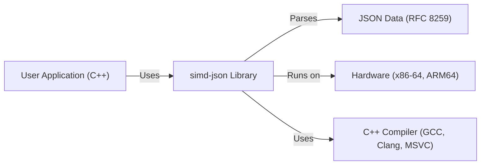
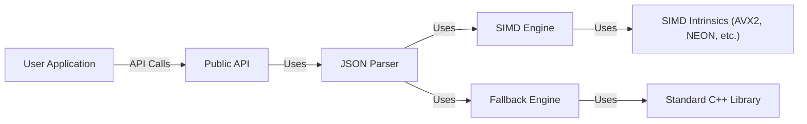
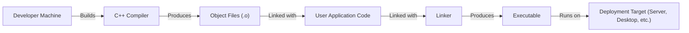
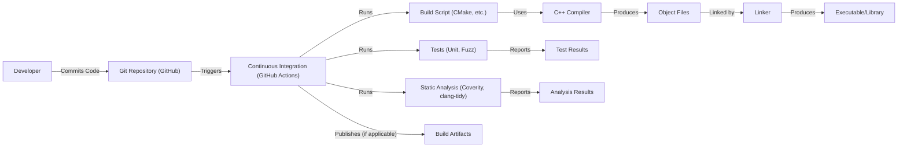

Okay, let's create a design document for the `simd-json` project.

# BUSINESS POSTURE

Business Priorities and Goals:

*   High Performance: The primary goal is to provide extremely fast JSON parsing, significantly outperforming traditional parsers. This speed is crucial for applications processing large volumes of JSON data, such as data analytics, high-frequency trading, and real-time data streaming.
*   Efficiency: Minimize CPU cycles and memory usage during JSON parsing. This is important for resource-constrained environments and large-scale deployments where even small inefficiencies can accumulate.
*   Correctness: Ensure accurate and reliable parsing of JSON documents, adhering strictly to the JSON specification (RFC 8259).  Incorrect parsing can lead to data corruption, application errors, and security vulnerabilities.
*   Ease of Integration: Provide a simple and easy-to-use API for C++ developers, allowing seamless integration into existing projects.
*   Portability: Support a wide range of hardware architectures and operating systems, maximizing the reach and applicability of the library.
*   Open Source: Maintain an open-source codebase to foster community contributions, transparency, and trust.

Business Risks:

*   Performance Degradation: Any changes that negatively impact parsing speed could undermine the core value proposition of the library.
*   Compatibility Issues:  Changes that break compatibility with existing user code or supported platforms could lead to adoption barriers and user frustration.
*   Security Vulnerabilities:  Bugs in the parser could be exploited to cause denial-of-service (DoS) attacks, arbitrary code execution, or information disclosure.  This is a major concern given the library's focus on performance and low-level memory manipulation.
*   Maintainability:  The highly optimized nature of the code, using SIMD instructions and advanced C++, could make it difficult to maintain and extend.
*   Licensing Issues:  Incorrect handling of licensing or dependencies could lead to legal problems.

# SECURITY POSTURE

Existing Security Controls:

*   security control: Fuzz Testing: The project uses extensive fuzz testing (OSS-Fuzz) to identify potential vulnerabilities and edge cases that could lead to crashes or security issues. (Found in the repository's fuzzing directory and continuous integration setup).
*   security control: Static Analysis: The project employs static analysis tools (like Coverity, clang-tidy) to detect potential bugs and security vulnerabilities during development. (Mentioned in documentation and CI configuration).
*   security control: Continuous Integration (CI):  Automated builds and tests are run on every commit to ensure code quality and prevent regressions. (GitHub Actions workflows).
*   security control: AddressSanitizer (ASan): Used during testing to detect memory errors like buffer overflows and use-after-free vulnerabilities. (Part of the CI configuration).
*   security control: MemorySanitizer (MSan): Used to detect use of uninitialized memory. (Part of CI).
*   security control: UndefinedBehaviorSanitizer (UBSan): Used to detect undefined behavior in C++. (Part of CI).
*   security control: Code Reviews: All changes are subject to code review by other developers. (Standard GitHub workflow).
*   security control: Adherence to JSON Specification: The parser is designed to strictly adhere to the RFC 8259 JSON specification, preventing common parsing errors.
*   security control: Input Validation: While the library's primary focus is parsing, it does perform validation to ensure the input conforms to the JSON grammar. This helps prevent many classes of injection attacks.

Accepted Risks:

*   accepted risk: Complexity: The use of SIMD instructions and low-level optimizations inherently increases code complexity, making it potentially harder to audit and maintain. This risk is mitigated by extensive testing and code reviews.
*   accepted risk: Platform-Specific Code: The library uses platform-specific intrinsics (e.g., AVX2, NEON) for performance. This introduces a risk of potential issues on unsupported platforms or with specific compiler versions. This is mitigated by providing fallback mechanisms and thorough testing on various platforms.
*   accepted risk: Denial of Service (DoS): While fuzzing helps, there's always a residual risk that a specially crafted, extremely large or deeply nested JSON input could cause excessive resource consumption, leading to a denial-of-service. This is partially mitigated by design choices that aim to minimize memory allocation and processing overhead, but the risk is not entirely eliminated.

Recommended Security Controls:

*   security control: Regular Expression Hardening: If any regular expressions are used (even indirectly), ensure they are carefully reviewed and potentially hardened against ReDoS (Regular Expression Denial of Service) attacks.
*   security control: Memory Allocation Limits: Consider adding configurable limits on memory allocation to provide an additional layer of protection against DoS attacks that attempt to exhaust memory.

Security Requirements:

*   Authentication: Not applicable (library, not a service).
*   Authorization: Not applicable (library, not a service).
*   Input Validation:
    *   The library *must* strictly adhere to the JSON specification (RFC 8259).
    *   The library *should* reject invalid JSON input with clear error messages.
    *   The library *should* handle potentially malicious input (e.g., deeply nested objects, extremely long strings) gracefully, without crashing or exhibiting undefined behavior.
*   Cryptography: Not directly applicable, but if the library ever handles encrypted JSON Web Tokens (JWTs) or similar formats, it should rely on established cryptographic libraries for the actual encryption/decryption and signature verification.
*   Memory Safety:
    *   The library *must* avoid buffer overflows, use-after-free errors, and other memory corruption vulnerabilities.
    *   The library *should* use memory sanitizers (ASan, MSan) during testing to detect memory errors.

# DESIGN

## C4 CONTEXT

Element Descriptions:

*   Element:
    *   Name: User Application (C++)
    *   Type: External System
    *   Description: Any C++ application that utilizes the simd-json library to parse JSON data.
    *   Responsibilities:
        *   Provides JSON data to the simd-json library.
        *   Calls the simd-json API to parse the data.
        *   Handles the parsed JSON data.
    *   Security controls:
        *   Input validation of data *before* passing it to simd-json (if the data comes from an untrusted source).
        *   Proper error handling when simd-json reports parsing errors.

*   Element:
    *   Name: simd-json Library
    *   Type: Project
    *   Description: The core of the project, a high-performance JSON parsing library.
    *   Responsibilities:
        *   Parsing JSON data according to RFC 8259.
        *   Providing an API for C++ applications to access the parsed data.
        *   Optimizing performance using SIMD instructions.
    *   Security controls:
        *   Fuzz testing.
        *   Static analysis.
        *   Continuous integration.
        *   Sanitizers (ASan, MSan, UBSan).
        *   Code reviews.
        *   Strict adherence to the JSON specification.

*   Element:
    *   Name: JSON Data (RFC 8259)
    *   Type: Data
    *   Description: The input data to be parsed, conforming to the JSON standard.
    *   Responsibilities: N/A (passive data)
    *   Security controls: N/A (the *source* of the data might have security controls, but the data itself doesn't).

*   Element:
    *   Name: Hardware (x86-64, ARM64)
    *   Type: External System
    *   Description: The underlying hardware architecture on which the library runs.
    *   Responsibilities: Executing the compiled code.
    *   Security controls: Hardware-level security features (e.g., memory protection) are relevant but outside the direct control of the library.

*   Element:
    *   Name: C++ Compiler (GCC, Clang, MSVC)
    *   Type: External System
    *   Description: The compiler used to build the simd-json library.
    *   Responsibilities: Translating the C++ code into machine code.
    *   Security controls: Compiler security flags (e.g., stack protection, warnings as errors) are important.

## C4 CONTAINER

Since `simd-json` is a library, the "container" diagram is essentially an expanded view of the library itself.

Element Descriptions:

*   Element:
    *   Name: User Application
    *   Type: External System
    *   Description:  The application using the `simd-json` library.
    *   Responsibilities:  Calls the `simd-json` API.
    *   Security controls:  Input validation (if applicable).

*   Element:
    *   Name: Public API
    *   Type: API
    *   Description: The set of functions and classes exposed to the user application.
    *   Responsibilities:  Provides a user-friendly interface to the parser.
    *   Security controls:  Input validation (e.g., checking for null pointers).

*   Element:
    *   Name: JSON Parser
    *   Type: Component
    *   Description:  The core logic for parsing JSON data.
    *   Responsibilities:  Implements the JSON parsing algorithm.  Manages the SIMD and fallback engines.
    *   Security controls:  Strict adherence to the JSON specification.  Extensive testing.

*   Element:
    *   Name: SIMD Engine
    *   Type: Component
    *   Description:  The component that uses SIMD instructions for fast parsing.
    *   Responsibilities:  Handles the fast path for JSON parsing on supported architectures.
    *   Security controls:  Careful use of SIMD intrinsics to avoid memory errors.

*   Element:
    *   Name: Fallback Engine
    *   Type: Component
    *   Description:  The component that uses standard C++ for parsing when SIMD is not available.
    *   Responsibilities:  Provides a fallback mechanism for parsing on unsupported architectures.
    *   Security controls:  Standard C++ coding practices to ensure memory safety.

*   Element:
    *   Name: SIMD Intrinsics (AVX2, NEON, etc.)
    *   Type: Library
    *   Description:  The platform-specific SIMD instructions.
    *   Responsibilities:  Provides low-level SIMD operations.
    *   Security controls:  Reliance on the correctness of the compiler and hardware implementation.

*   Element:
    *   Name: Standard C++ Library
    *   Type: Library
    *   Description:  The standard C++ library (e.g., for string manipulation, memory allocation).
    *   Responsibilities:  Provides basic functionalities used by the fallback engine.
    *   Security controls:  Reliance on the correctness of the standard library implementation.

## DEPLOYMENT

Deployment Solutions:

1.  **Static Linking:** The most common and recommended approach. The `simd-json` library is compiled directly into the user's application. This simplifies distribution and avoids dependency issues.
2.  **Dynamic Linking:** Less common, but possible. The `simd-json` library is compiled as a shared library (e.g., `.so` on Linux, `.dll` on Windows) and linked at runtime. This can reduce the size of the application executable but introduces dependency management complexities.
3.  **Header-Only Library:** `simd-json` is designed to be used as header only library.

Chosen Solution: Static Linking (most common and recommended)

Element Descriptions:

*   Element:
    *   Name: Developer Machine
    *   Type: Environment
    *   Description: The machine where the `simd-json` library and user application are built.
    *   Responsibilities:  Provides the development environment.
    *   Security controls:  Developer machine security best practices.

*   Element:
    *   Name: C++ Compiler
    *   Type: Tool
    *   Description:  The compiler (GCC, Clang, MSVC).
    *   Responsibilities:  Compiles the `simd-json` and user application code.
    *   Security controls:  Compiler security flags.

*   Element:
    *   Name: Object Files (.o)
    *   Type: Artifact
    *   Description:  The intermediate output of the compiler.
    *   Responsibilities:  Contains compiled code.
    *   Security controls:  None directly applicable.

*   Element:
    *   Name: User Application Code
    *   Type: Code
    *   Description:  The source code of the user's application.
    *   Responsibilities:  Implements the application logic.
    *   Security controls:  Application-specific security controls.

*   Element:
    *   Name: Linker
    *   Type: Tool
    *   Description:  The linker (part of the compiler toolchain).
    *   Responsibilities:  Combines the object files into an executable.
    *   Security controls:  None directly applicable.

*   Element:
    *   Name: Executable
    *   Type: Artifact
    *   Description:  The final executable file.
    *   Responsibilities:  Runs the application.
    *   Security controls:  Operating system-level security controls.

*   Element:
    *   Name: Deployment Target (Server, Desktop, etc.)
    *   Type: Environment
    *   Description:  The environment where the application is deployed.
    *   Responsibilities:  Provides the runtime environment.
    *   Security controls:  Environment-specific security controls (firewalls, access controls, etc.).

## BUILD

Build Process Description:

1.  **Code Commit:** A developer commits code changes to the GitHub repository.
2.  **CI Trigger:** GitHub Actions is triggered by the commit.
3.  **Build Script:** The CI workflow executes a build script (using CMake).
4.  **Compilation:** The C++ compiler compiles the source code into object files.
5.  **Linking:** The linker combines the object files to create the library (either static or dynamic, depending on the configuration).
6.  **Testing:** The CI workflow runs a suite of tests, including:
    *   **Unit Tests:** Verify individual components of the parser.
    *   **Fuzz Tests:**  Use OSS-Fuzz to generate a large number of random inputs to test for crashes and vulnerabilities.
7.  **Static Analysis:** Static analysis tools (Coverity, clang-tidy) are run to identify potential bugs and security issues.
8.  **Artifact Publication:**  While `simd-json` is primarily a header-only library, build artifacts (e.g., for testing or benchmarking) might be published.

Security Controls in Build Process:

*   security control: Continuous Integration (CI): Automates the build and testing process, ensuring that all changes are thoroughly tested.
*   security control: Static Analysis:  Identifies potential vulnerabilities before runtime.
*   security control: Fuzz Testing:  Discovers edge cases and vulnerabilities that might be missed by traditional testing.
*   security control: Sanitizers (ASan, MSan, UBSan): Detect memory errors and undefined behavior during testing.
*   security control: Dependency Management: CMake is used to manage dependencies, reducing the risk of using outdated or vulnerable libraries.
*   security control: Compiler Security Flags: The build process uses appropriate compiler security flags (e.g., stack protection) to mitigate potential vulnerabilities.

# RISK ASSESSMENT

Critical Business Processes:

*   **JSON Parsing:** The core functionality of the library. Any disruption or failure of this process would directly impact users.
*   **Data Integrity:** Ensuring that JSON data is parsed correctly and without modification.

Data Sensitivity:

*   The `simd-json` library itself does *not* handle specific data classifications. It parses *any* JSON data provided to it. The sensitivity of the data depends entirely on the *user application* and the *content* of the JSON being parsed.
*   The library *must* be designed to handle potentially sensitive data securely, without introducing vulnerabilities that could lead to data breaches. This means preventing buffer overflows, injection attacks, and other vulnerabilities that could allow an attacker to access or modify the data being parsed.

# QUESTIONS & ASSUMPTIONS

Questions:

*   Are there any specific performance benchmarks or targets that must be met? (Beyond the general goal of being "very fast").
*   Are there any specific regulatory requirements (e.g., GDPR, HIPAA) that apply to the *use* of this library in certain applications? (This is primarily a concern for users of the library, but it's good to be aware of potential implications).
*   What is the expected lifespan of this library? (This helps inform long-term maintainability considerations).
*   What level of backward compatibility is required? (How disruptive can future updates be?).

Assumptions:

*   BUSINESS POSTURE: The primary business goal is to provide a high-performance JSON parsing library.
*   BUSINESS POSTURE: The library is intended for use in performance-critical applications.
*   BUSINESS POSTURE: The library will be maintained and updated over time.
*   SECURITY POSTURE: Users of the library are responsible for the security of the data they are parsing.
*   SECURITY POSTURE: The library is used in environments where security is a concern.
*   DESIGN: The library will be used primarily as a header-only, statically-linked library.
*   DESIGN: The target platforms are primarily x86-64 and ARM64 architectures.
*   DESIGN: The user application is written in C++.