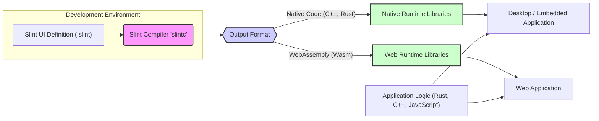
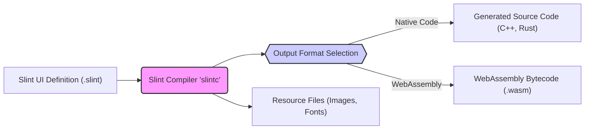
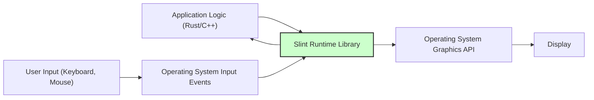
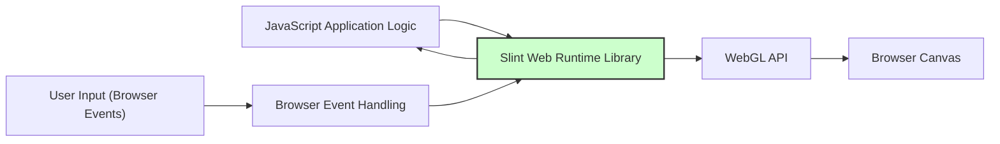

# Project Design Document: Slint UI Framework

## 1. Project Overview

*   **Project Name:** Slint UI Framework
*   **Project Repository:** [https://github.com/slint-ui/slint](https://github.com/slint-ui/slint)
*   **Project Description:** Slint is a modern declarative UI language and toolkit for efficiently building user interfaces across various platforms, including embedded systems, desktop applications, and web browsers. It is designed with a focus on performance, minimal resource footprint, and developer productivity. Slint enables UI development using a declarative markup language, which is then compiled into optimized native code or WebAssembly. This approach allows for a consistent UI development experience and code reuse across diverse target environments, from resource-constrained microcontrollers to powerful desktop machines and web platforms.
*   **Purpose of this Document:** This document provides a comprehensive design overview of the Slint UI Framework. It serves as a foundational resource for subsequent threat modeling activities. By clearly outlining the system's architecture, components, data flow, and technology stack, this document aims to facilitate the identification of potential security vulnerabilities and guide the development of appropriate security mitigation strategies.

## 2. Architecture Overview

The Slint UI Framework is architected around a clear separation of concerns, primarily divided into the compilation phase and the runtime execution phase. Key components include:

*   **Slint Language:** A declarative UI markup language designed for describing UI structure, styling, and behavior in a concise and human-readable manner. It emphasizes ease of use and maintainability for UI developers.
*   **Slint Compiler (`slintc`):** The build tool responsible for processing Slint UI definition files (`.slint`). It performs parsing, semantic analysis, optimization, and code generation. The compiler targets multiple output formats, enabling cross-platform compatibility:
    *   **Native Code (C++, Rust):** Generates platform-specific source code in C++ or Rust, which is then compiled by a native compiler for optimal performance on desktop and embedded systems.
    *   **WebAssembly (Wasm):** Compiles Slint UI definitions into WebAssembly bytecode, allowing execution within web browsers and other WebAssembly runtimes, enabling web-based UI applications.
*   **Slint Runtime Libraries:** Platform-specific libraries that provide the necessary runtime environment for executing compiled Slint UI code. These libraries handle core functionalities such as:
    *   **Rendering:**  Drawing UI elements on the screen using platform-specific graphics APIs.
    *   **Event Handling:** Managing user interactions and dispatching events to UI elements.
    *   **Layout Management:**  Arranging UI elements according to defined layout rules.
    *   **Data Binding:**  Implementing the dynamic connection between UI elements and application data.
    Runtime libraries are available for desktop platforms (Linux, Windows, macOS), embedded systems, and web browsers.
*   **Bindings and Integration Layer:** Mechanisms that facilitate the integration of Slint UI with application logic written in various programming languages. Slint offers bindings for:
    *   **Rust:**  Native and efficient integration with Rust applications.
    *   **C++:**  Bindings for interoperability with existing C++ codebases.
    *   **JavaScript:**  For web application development and integration with JavaScript-based logic in browser environments.

The following diagram provides a visual representation of the Slint UI Framework's high-level architecture:

## 3. Component Details

### 3.1. Slint Language

*   **Description:** The Slint Language is a declarative Domain Specific Language (DSL) specifically designed for user interface definition. Its declarative nature allows developers to describe *what* the UI should look like and how it should behave, rather than *how* to implement it procedurally. This promotes a clear separation of concerns between UI design and application logic.
*   **Functionality:**
    *   **Declarative UI Structure Definition:** Enables developers to define UI elements (windows, buttons, text inputs, images, custom components, etc.) and their hierarchical relationships in a structured and intuitive manner.
    *   **Styling and Theming Capabilities:** Provides a system for defining visual styles (colors, fonts, spacing, borders, etc.) and applying themes to UI elements, allowing for consistent look and feel and easy customization.
    *   **Data Binding Mechanism:** Supports binding UI element properties to application data, enabling dynamic UI updates in response to data changes and facilitating reactive UI patterns.
    *   **Event Handling System:** Allows defining event handlers for user interactions (mouse clicks, keyboard presses, touch gestures) to trigger actions and logic within the application.
    *   **Component-Based Architecture:** Facilitates the creation of reusable UI components, promoting modularity, code reuse, and maintainability in UI development.
*   **Data Flow:**
    *   Slint UI definition files (`.slint`) serve as the primary input to the Slint Compiler.
    *   The language itself defines the structure and behavior of the UI, and data flow at runtime is managed through data binding and event handling mechanisms connecting the UI to application logic.
*   **Technologies:**
    *   Custom DSL syntax, designed for UI expressiveness and developer ergonomics.
    *   Parser and Abstract Syntax Tree (AST) representation within the Slint Compiler for processing and analyzing Slint code.

### 3.2. Slint Compiler (`slintc`)

*   **Description:** The Slint Compiler (`slintc`) is the core build tool of the Slint framework. It acts as a translator, converting human-readable Slint UI definitions into optimized code executable on target platforms. The compiler is designed to be cross-platform, generating code for various environments.
*   **Functionality:**
    *   **Parsing and Lexing:** Reads and parses Slint UI definition files, breaking them down into tokens and constructing an Abstract Syntax Tree (AST) representing the UI structure.
    *   **Semantic Analysis and Validation:** Performs in-depth analysis of the AST to ensure the semantic correctness of the Slint code, checking for type errors, undefined variables, and other language-level issues.
    *   **UI Optimization:** Applies various optimization techniques to the UI definition to enhance performance, reduce resource consumption, and improve rendering efficiency. This may include techniques like dead code elimination, UI element flattening, and layout optimizations.
    *   **Code Generation for Multiple Targets:** Generates output code in different formats based on the specified target platform:
        *   **C++ Source Code Generation:** Produces C++ source code that leverages the Slint C++ runtime library for native execution.
        *   **Rust Source Code Generation:** Generates Rust source code that utilizes the Slint Rust runtime library, benefiting from Rust's performance and safety features.
        *   **WebAssembly (Wasm) Bytecode Generation:** Compiles Slint UI definitions into WebAssembly bytecode for execution in web browsers and other Wasm-compatible environments.
    *   **Resource Embedding and Management:** Handles the inclusion of external resources (images, fonts, etc.) referenced in Slint UI definitions into the compiled output, ensuring resources are available at runtime.
*   **Data Flow:**
    *   **Input:** Slint UI definition files (`.slint`).
    *   **Processing Pipeline:** Parsing -> Semantic Analysis -> Optimization -> Code Generation.
    *   **Output:** Generated source code (C++, Rust) or WebAssembly bytecode (`.wasm`), along with associated resource files packaged for deployment.
*   **Technologies:**
    *   Rust programming language (used for compiler implementation, leveraging Rust's safety and performance).
    *   Parser combinator libraries or parser generators (implementation details are internal to the compiler).
    *   Code generation techniques tailored for C++, Rust, and WebAssembly target languages.

### 3.3. Slint Runtime Libraries

*   **Description:** Slint Runtime Libraries are platform-specific components that provide the essential runtime environment for executing compiled Slint UI applications. They abstract away platform differences and provide a consistent API for rendering, event handling, and other core UI functionalities.
*   **Functionality:**
    *   **Platform-Abstracted UI Rendering:**  Handles the rendering of UI elements on the screen, utilizing platform-specific graphics APIs (e.g., OpenGL, Vulkan, Direct3D, Metal, WebGL) to achieve optimal performance and visual fidelity on each target platform.
    *   **Cross-Platform Event Handling:** Manages user input events from various sources (mouse, keyboard, touch, etc.) and dispatches them to the appropriate UI elements in a platform-independent manner.
    *   **Layout Management Engine:** Implements layout algorithms (e.g., flexbox, grid-like layouts) to automatically arrange UI elements according to the layout rules defined in the Slint UI, adapting to different screen sizes and resolutions.
    *   **Animation and Transition Framework:** Provides mechanisms for creating smooth animations and transitions between UI states, enhancing the user experience and visual appeal of Slint applications.
    *   **Data Binding Implementation at Runtime:**  Manages the runtime aspects of data binding, efficiently updating UI elements when the underlying bound data changes, ensuring UI reactivity.
    *   **Platform Integration Services:** Offers abstractions for accessing platform-specific functionalities when necessary, such as file system access, timers, and potentially networking capabilities (depending on the specific runtime library and platform).
*   **Data Flow:**
    *   **Input:** Compiled Slint UI code (output from `slintc`), application data provided through bindings.
    *   **Runtime Operations:** Rendering UI elements, processing user input events, managing UI layout, handling animations, and updating UI based on data binding changes.
    *   **Output:** Displayed user interface on the screen, user interactions communicated back to the application logic through event callbacks and data binding updates.
*   **Technologies:**
    *   **C++ Runtime Library:** Serves as a foundational runtime library, often used for native C++ applications and as a base for other language-specific runtimes. Emphasizes performance and cross-platform compatibility.
    *   **Rust Runtime Library:**  Built for native Rust applications, potentially leveraging or reimplementing parts of the C++ runtime while taking advantage of Rust's memory safety and concurrency features.
    *   **Web Runtime Library (JavaScript/WebAssembly):**  Designed for web browser environments, implemented using a combination of JavaScript and WebGL for rendering, and potentially WebAssembly for performance-critical UI logic.
    *   Graphics APIs: OpenGL, Vulkan, Direct3D, Metal, WebGL (platform-dependent).
    *   Platform-specific system APIs for input handling, window management, and other OS-level interactions.

### 3.4. Bindings and Integration Layer

*   **Description:** The Bindings and Integration Layer provides the crucial interface between Slint UI and application logic, enabling seamless communication and data exchange regardless of the programming language used for application development.
*   **Functionality:**
    *   **Data Exchange and Synchronization:**  Provides mechanisms to efficiently transfer data between application logic and the Slint UI runtime. This is primarily used for data binding, allowing application data to drive UI updates and vice versa.
    *   **Event Handling and Callbacks:** Enables application logic to register event handlers for UI events (e.g., button clicks, value changes). When these events occur in the UI, the registered handlers in the application logic are invoked, allowing the application to respond to user interactions.
    *   **Function Invocation (Limited):** In certain scenarios, bindings might allow calling functions defined in application logic from within Slint UI definitions (e.g., for complex data transformations or actions triggered by UI events). However, the primary direction of function calls is typically from UI events to application logic callbacks.
*   **Data Flow:**
    *   **Data Flow from Application Logic to UI:** Application logic updates data variables that are bound to UI properties. These updates are propagated through the bindings to the Slint Runtime, triggering UI re-rendering and updates.
    *   **Event Flow from UI to Application Logic:** User interactions within the Slint UI generate events. These events are captured by the Slint Runtime and propagated through the bindings to the application logic, invoking registered event handlers.
*   **Technologies:**
    *   **Rust Bindings:**  Utilize Rust's Foreign Function Interface (FFI) for efficient and safe integration between Rust application logic and the Slint Rust runtime.
    *   **C++ Bindings:**  Provide C++ APIs and mechanisms for C++ applications to interact with the Slint C++ runtime. These might involve C++ class interfaces, function calls, and data marshaling.
    *   **JavaScript Bindings:**  Employ JavaScript APIs and potentially WebAssembly interop techniques to enable communication between JavaScript application logic and the Slint Web Runtime running in a browser environment.
    *   Potentially, in more complex scenarios or for specific platforms, inter-process communication (IPC) mechanisms might be used for integration, although direct in-process bindings are the primary approach.

## 4. Data Flow Diagrams

### 4.1. Compilation Process Data Flow

### 4.2. Runtime Data Flow (Native Application)

### 4.3. Runtime Data Flow (Web Application)

## 5. Technology Stack

*   **Programming Languages:**
    *   **Rust:** Primary language for Slint Compiler development, core runtime libraries (especially the Rust runtime), and increasingly for general Slint development due to its safety and performance.
    *   **C++:** Used for the foundational C++ runtime library, C++ bindings, and for interoperability with existing C++ ecosystems.
    *   **JavaScript/TypeScript:** Employed for the Web Runtime Library, JavaScript bindings, and web application integration. TypeScript might be used for improved type safety in web-related components.
    *   **Slint Language:** The declarative UI language itself, defining the syntax and semantics for UI descriptions.
*   **Build System and Tooling:**
    *   Cargo: Rust's package manager and build system, used for building Rust components of Slint (compiler, Rust runtime).
    *   CMake: Cross-platform build system, likely used for managing the build process for C++ components, cross-compilation, and potentially coordinating builds across different languages.
    *   npm/yarn: JavaScript package managers, potentially used for managing dependencies and build processes related to the Web Runtime Library and web examples.
*   **Graphics APIs (Platform Specific):**
    *   OpenGL: Widely adopted cross-platform graphics API, used for rendering on various desktop and embedded platforms.
    *   Vulkan: Modern, high-performance, cross-platform graphics API, offering improved control and efficiency, increasingly used for demanding UI applications.
    *   Direct3D: Microsoft's graphics API, primarily used on Windows platforms.
    *   Metal: Apple's graphics API, used on macOS and iOS platforms.
    *   WebGL: Web-standard graphics API, essential for rendering Slint UIs within web browsers.
*   **Web Technologies (for Web Applications):**
    *   WebAssembly (Wasm): Enables execution of compiled Slint UI code within web browsers at near-native performance.
    *   JavaScript: Used for the Web Runtime Library, browser API interactions, and integration with JavaScript application logic.
    *   HTML5 Canvas: The rendering surface in web browsers where Slint UI elements are drawn using WebGL.
    *   WebGL: The graphics API used within web browsers for hardware-accelerated rendering of Slint UIs.
*   **Operating Systems (Target Platforms):**
    *   Linux (various distributions).
    *   Windows.
    *   macOS.
    *   Embedded Linux and Real-Time Operating Systems (RTOS) for embedded devices.
    *   Web browsers (Chrome, Firefox, Safari, Edge, and others supporting WebAssembly and WebGL).

## 6. Deployment Model

Slint applications offer flexible deployment options depending on the target environment:

*   **Desktop Applications:**
    *   Compiled into platform-specific native executables for each supported desktop operating system (Linux, Windows, macOS).
    *   Distribution as standalone application bundles or packages, often including necessary runtime libraries.
    *   Installation through operating system package managers (e.g., apt, yum, pacman, brew) or via platform-specific installers (e.g., MSI for Windows, DMG for macOS).
*   **Embedded Applications:**
    *   Compilation and integration into embedded system firmware images or operating system images tailored for specific embedded hardware.
    *   Deployment directly onto embedded devices, often involving custom flashing or deployment procedures depending on the embedded platform and bootloader.
    *   May require cross-compilation and careful resource management due to the resource-constrained nature of embedded systems.
*   **Web Applications:**
    *   Compilation into WebAssembly modules (`.wasm` files) and associated JavaScript files, hosted on web servers.
    *   Accessed by users through standard web browsers.
    *   Deployment as static files served by web servers or integrated into more complex web application frameworks and content delivery networks (CDNs).

## 7. Security Considerations (Initial Thoughts for Threat Modeling)

This section outlines initial security considerations to be further investigated during a comprehensive threat modeling process.

*   **Compiler Security (`slintc`):**
    *   **Robust Input Validation:** The Slint Compiler must rigorously validate input `.slint` files to prevent vulnerabilities arising from maliciously crafted input. This includes:
        *   **File Path Traversal Prevention:** Ensuring that input file paths are properly validated to prevent access to unauthorized files or directories during compilation.
        *   **Denial-of-Service (DoS) Protection:** Guarding against excessively complex or recursive Slint code that could lead to compiler crashes or resource exhaustion (e.g., stack overflow, excessive memory usage).
        *   **Injection Attack Prevention:**  Sanitizing or escaping any user-provided data that might be incorporated into generated code to prevent code injection vulnerabilities.
    *   **Secure Code Generation:**  Ensuring that the generated code (C++, Rust, Wasm) is inherently secure and does not introduce new vulnerabilities. This involves:
        *   **Memory Safety in Generated C++ Code:** Employing safe coding practices and potentially static analysis tools to minimize memory safety issues in generated C++ code. Rust inherently provides memory safety.
        *   **Avoiding Unsafe Operations in Wasm:**  Generating WebAssembly code that adheres to secure coding principles and avoids potentially unsafe WebAssembly features where possible.
    *   **Dependency Security Management:**  Securely managing dependencies used by the compiler itself. This includes:
        *   **Vulnerability Scanning:** Regularly scanning compiler dependencies for known security vulnerabilities and updating to patched versions.
        *   **Dependency Pinning:**  Pinning dependency versions to ensure reproducible builds and prevent unexpected behavior due to dependency updates.
*   **Runtime Library Security:**
    *   **Memory Safety and Robustness:** Runtime libraries, especially the C++ runtime, must be designed with memory safety in mind to prevent vulnerabilities like buffer overflows, use-after-free, and other memory corruption issues. Rust runtime benefits from Rust's memory safety guarantees.
    *   **Resource Management and Limits:**  Properly managing system resources (memory, graphics resources, file handles, etc.) to prevent resource exhaustion, leaks, or denial-of-service conditions. Implementing resource limits where appropriate.
    *   **Secure Input Handling:**  Runtime libraries must securely handle user input events (keyboard, mouse, touch) to prevent injection attacks or other input-related vulnerabilities. This includes validating and sanitizing input data before processing.
    *   **Platform API Security:**  Ensuring secure interaction with underlying operating system or browser APIs. Avoiding insecure API usage patterns and adhering to platform security guidelines.
    *   **Secure Defaults and Configuration:**  Providing secure default configurations for runtime libraries and encouraging secure configuration practices for applications.
*   **WebAssembly Security (for Web Applications):**
    *   **WebAssembly Sandbox Reliance:**  Primarily relying on the browser's built-in WebAssembly sandbox for security isolation. Understanding the limitations and security boundaries of the sandbox.
    *   **Secure JavaScript Interop:**  Ensuring secure communication and data exchange between WebAssembly code and JavaScript. Carefully validating data passed between Wasm and JavaScript to prevent vulnerabilities in the interop layer.
    *   **Content Security Policy (CSP) Enforcement:**  Recommending and supporting the use of Content Security Policy (CSP) to mitigate risks in web deployments, such as Cross-Site Scripting (XSS) attacks.
    *   **Browser Security Policies and Features:**  Adhering to browser security policies and leveraging browser security features to enhance the security of web-based Slint applications.
*   **Data Binding Security:**
    *   **Data Sanitization and Output Encoding:**  If user-provided data or data from untrusted sources is directly bound to UI elements, ensuring proper sanitization and output encoding to prevent injection vulnerabilities, such as Cross-Site Scripting (XSS) in web contexts or command injection if data is used to construct system commands.
    *   **Access Control and Data Sensitivity:**  Considering access control mechanisms if sensitive data is displayed or manipulated through the UI. Ensuring that sensitive data is handled securely and access is restricted to authorized users or components.
*   **Dependency Management (Application Level Security):**
    *   Applications built with Slint are responsible for managing their own dependencies securely, including the Slint runtime libraries and any other third-party libraries they utilize. This includes vulnerability scanning and secure update practices.
*   **Secure Update Mechanisms:**
    *   Considering and implementing secure update mechanisms for both the Slint framework itself (compiler, runtime libraries) and applications built using Slint. This is crucial for patching vulnerabilities and maintaining the security of deployed systems.
*   **Secure Development Lifecycle (SDL):**
    *   Adopting a Secure Development Lifecycle (SDL) approach throughout the Slint project, incorporating security considerations at each stage of development, from design to deployment and maintenance.
*   **Security Testing and Auditing:**
    *   Regularly conducting security testing (e.g., penetration testing, fuzzing) and security audits of the Slint framework and applications built with it to identify and address potential vulnerabilities.

This document provides a detailed design overview of the Slint UI Framework, intended to be a valuable resource for threat modeling and security analysis. A thorough threat modeling exercise, building upon these initial security considerations, is the next crucial step to comprehensively assess and mitigate potential security risks in the Slint UI Framework and applications built with it.