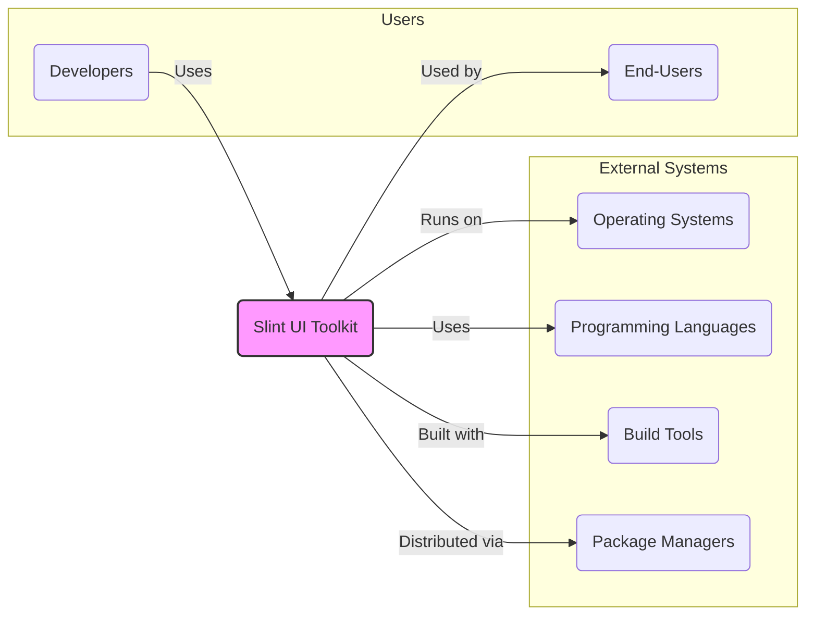

# BUSINESS POSTURE

This project aims to provide a declarative UI toolkit named Slint for developers to efficiently build modern user interfaces for various platforms, including desktop and embedded systems. The primary business goals are to offer a user-friendly, cross-platform, and performant solution for UI development, thereby increasing developer productivity and enabling the creation of visually appealing and responsive applications.

The key business priorities are:

*   Ease of Use: The toolkit should be easy to learn and use for developers with varying levels of experience.
*   Cross-Platform Compatibility: Applications built with Slint should run seamlessly on different operating systems (e.g., Windows, Linux, macOS, embedded OS).
*   Performance: The toolkit should enable the creation of performant user interfaces, especially crucial for embedded systems and resource-constrained environments.
*   Community Adoption: Growing a strong community around Slint to ensure its long-term sustainability and feature development.

The most important business risks that need to be addressed are:

*   Risk of low adoption: If developers do not find Slint compelling compared to existing UI frameworks, adoption rates may be low, hindering the project's success.
*   Risk of security vulnerabilities: Security flaws in the Slint toolkit itself could lead to vulnerabilities in applications built using it, damaging reputation and trust.
*   Risk of performance issues: If Slint does not deliver on its performance promises, especially on embedded systems, it may not be suitable for its intended use cases.
*   Risk of insufficient community support: Lack of active community could slow down development, bug fixing, and support for developers, impacting user satisfaction and adoption.

# SECURITY POSTURE

Existing security controls for the Slint project, based on common open-source project practices on GitHub, include:

*   security control: Public repository on GitHub: The source code is publicly accessible, allowing for community review and scrutiny. Implemented on GitHub.
*   security control: Issue tracking on GitHub: GitHub Issues are used for bug reporting, feature requests, and potentially vulnerability reporting. Implemented on GitHub.
*   security control: Contribution guidelines: Project likely has contribution guidelines that may include some basic security considerations for code contributions (needs verification in repository). Described in `CONTRIBUTING.md` or similar file in the repository.
*   security control: Code review process: Contributions are likely reviewed before merging, which can help identify potential security issues. Implemented as part of GitHub pull request workflow.

Accepted risks for the Slint project include:

*   accepted risk: Reliance on community contributions for security fixes: As an open-source project, security fixes may depend on community contributions, which can vary in timeliness.
*   accepted risk: Potential vulnerabilities due to the complexity of UI frameworks: UI frameworks are complex software, and vulnerabilities can be introduced during development.
*   accepted risk: Limited dedicated security team: Open-source projects often lack a dedicated security team, relying on community and maintainers for security efforts.

Recommended security controls to implement for Slint project:

*   security control: Implement automated security scanning (SAST): Integrate Static Application Security Testing tools into the CI/CD pipeline to automatically detect potential vulnerabilities in the code.
*   security control: Establish a clear vulnerability disclosure policy: Create a documented process for reporting and handling security vulnerabilities, making it easy for security researchers to report issues responsibly.
*   security control: Conduct regular security audits: Perform periodic security audits, potentially by external security experts, to identify and address security weaknesses proactively.
*   security control: Security training for maintainers: Provide security training to project maintainers to increase their awareness of secure coding practices and common vulnerabilities.
*   security control: Dependency scanning: Implement dependency scanning to identify and manage vulnerabilities in third-party libraries used by Slint.

Security requirements for the Slint project and applications built with it:

*   Authentication:
    *   Requirement: Slint toolkit itself does not directly handle authentication. However, applications built with Slint will likely require authentication mechanisms. Slint should not hinder the implementation of secure authentication in applications.
    *   Requirement: Example applications provided by Slint should demonstrate secure authentication practices where applicable.
*   Authorization:
    *   Requirement: Slint toolkit itself does not directly handle authorization. Applications built with Slint will require authorization mechanisms to control access to resources and functionalities. Slint should not hinder the implementation of secure authorization in applications.
    *   Requirement: Example applications provided by Slint should demonstrate secure authorization practices where applicable.
*   Input Validation:
    *   Requirement: Slint toolkit should provide mechanisms and guidance to developers for implementing robust input validation in applications built with Slint. This is crucial to prevent vulnerabilities like Cross-Site Scripting (XSS) and injection attacks in applications using Slint.
    *   Requirement: Slint examples and documentation should emphasize the importance of input validation and demonstrate best practices.
*   Cryptography:
    *   Requirement: Slint toolkit itself may not directly implement cryptographic functionalities. However, if applications built with Slint require cryptography, Slint should not introduce vulnerabilities or limitations that hinder secure cryptographic operations.
    *   Requirement: If Slint provides any utilities related to data handling or storage, it should ensure that these utilities do not compromise the confidentiality or integrity of data, and ideally support or encourage the use of encryption where appropriate.

# DESIGN

## C4 CONTEXT



Elements of the Context Diagram:

*   Name: Slint UI Toolkit
    *   Type: Software System
    *   Description: A declarative UI toolkit for building native user interfaces for desktop and embedded systems.
    *   Responsibilities: Provides a framework and tools for developers to create user interfaces, handles UI rendering and event management, supports cross-platform UI development.
    *   Security controls: Code review process, public repository, issue tracking, recommended security controls like SAST, vulnerability disclosure policy, security audits.

*   Name: Developers
    *   Type: Person
    *   Description: Software developers who use Slint to build applications.
    *   Responsibilities: Use Slint to design and implement user interfaces, integrate Slint into their applications, contribute to Slint project.
    *   Security controls: Secure development practices, input validation in applications, secure handling of user data in applications.

*   Name: End-Users
    *   Type: Person
    *   Description: Users who interact with applications built using Slint.
    *   Responsibilities: Use applications built with Slint, provide feedback on application usability and functionality.
    *   Security controls: Operating system security controls, application-level security controls implemented by developers.

*   Name: Operating Systems
    *   Type: External System
    *   Description: Target operating systems where Slint applications run (e.g., Windows, Linux, macOS, embedded OS).
    *   Responsibilities: Provide runtime environment for Slint applications, manage system resources, enforce operating system level security policies.
    *   Security controls: OS-level security features (firewall, access control, kernel security), regular security updates and patching.

*   Name: Programming Languages
    *   Type: External System
    *   Description: Programming languages used to develop Slint and applications using Slint (e.g., Rust, C++, JavaScript).
    *   Responsibilities: Provide language features and libraries for Slint development, language-level security features.
    *   Security controls: Language-specific security best practices, secure coding guidelines for chosen languages.

*   Name: Build Tools
    *   Type: External System
    *   Description: Tools used to build and compile Slint and applications using Slint (e.g., Cargo, CMake, npm).
    *   Responsibilities: Compile source code, manage dependencies, create build artifacts.
    *   Security controls: Secure build pipelines, dependency vulnerability scanning, build artifact integrity checks.

*   Name: Package Managers
    *   Type: External System
    *   Description: Package managers used to distribute Slint libraries and dependencies (e.g., crates.io, npm, system package managers).
    *   Responsibilities: Distribute Slint libraries, manage dependencies for developers, provide a platform for discovering and installing Slint.
    *   Security controls: Package integrity verification, vulnerability scanning of packages, secure package distribution infrastructure.

## C4 CONTAINER

```mermaid
flowchart LR
    subgraph "Slint UI Toolkit"
        subgraph "Core"
            SlintCore["Slint Core Library (Rust/C++)"]
        end
        subgraph "Language Bindings"
            RustBindings["Rust Bindings"]
            CppBindings["C++ Bindings"]
            JSBindings["JavaScript Bindings"]
        end
        SlintCompiler["Slint Compiler"]
        Examples["Example Applications"]
        Documentation["Documentation"]
    end

    Developer("Developers") -->|Uses| SlintCompiler
    Developer -->|Uses| RustBindings
    Developer -->|Uses| CppBindings
    Developer -->|Uses| JSBindings
    Developer -->|Uses| Documentation

    SlintCompiler --> SlintCore
    RustBindings --> SlintCore
    CppBindings --> SlintCore
    JSBindings --> SlintCore
    Examples --> RustBindings
    Examples --> CppBindings
    Examples --> JSBindings

    style Slint UI Toolkit fill:#f9f,stroke:#333,stroke-width:2px
    style Core fill:#eee,stroke:#333,stroke-dasharray: 5 5
    style "Language Bindings" fill:#eee,stroke:#333,stroke-dasharray: 5 5
```

Elements of the Container Diagram:

*   Name: Slint Core Library (Rust/C++)
    *   Type: Library
    *   Description: The core implementation of the Slint UI toolkit, written in Rust and C++. Provides the fundamental UI rendering engine, layout algorithms, and core functionalities.
    *   Responsibilities: UI rendering, event handling, layout management, core toolkit logic.
    *   Security controls: Memory safety features of Rust, secure coding practices in C++, SAST scanning, code review.

*   Name: Rust Bindings
    *   Type: Library
    *   Description: Provides Rust language bindings for the Slint Core Library, allowing Rust developers to use Slint in their applications.
    *   Responsibilities: Expose Slint Core API to Rust, facilitate integration with Rust ecosystem.
    *   Security controls: Secure binding generation, Rust's memory safety, code review.

*   Name: C++ Bindings
    *   Type: Library
    *   Description: Provides C++ language bindings for the Slint Core Library, allowing C++ developers to use Slint in their applications.
    *   Responsibilities: Expose Slint Core API to C++, facilitate integration with C++ ecosystem.
    *   Security controls: Secure binding generation, secure coding practices in C++, code review.

*   Name: JavaScript Bindings
    *   Type: Library
    *   Description: Provides JavaScript language bindings for the Slint Core Library, allowing JavaScript developers to use Slint in web-based or other JavaScript environments.
    *   Responsibilities: Expose Slint Core API to JavaScript, facilitate integration with JavaScript ecosystem.
    *   Security controls: Secure binding generation, secure coding practices in JavaScript, code review, consideration of web security context.

*   Name: Slint Compiler
    *   Type: Application
    *   Description: A compiler that processes Slint UI definition files (`.slint`) and generates code for different target languages.
    *   Responsibilities: Compile `.slint` files, generate code for Rust, C++, JavaScript, optimize UI definitions.
    *   Security controls: Input validation of `.slint` files to prevent injection attacks, secure code generation, SAST scanning of compiler code.

*   Name: Example Applications
    *   Type: Application
    *   Description: A collection of example applications built using Slint, demonstrating various features and use cases.
    *   Responsibilities: Showcase Slint capabilities, provide learning resources for developers, demonstrate best practices.
    *   Security controls: Secure coding practices in example applications, input validation, demonstration of security features where applicable.

*   Name: Documentation
    *   Type: Documentation
    *   Description: User manuals, API documentation, tutorials, and guides for Slint.
    *   Responsibilities: Provide comprehensive information about Slint, guide developers in using Slint effectively and securely, document security considerations.
    *   Security controls: Review documentation for security accuracy, include security best practices and warnings where relevant.

## DEPLOYMENT

Deployment of Slint itself as a toolkit is primarily through package managers. Applications built with Slint are deployed as native applications for their target platforms.

Deployment Diagram for Slint Toolkit Libraries:

```mermaid
flowchart LR
    subgraph "Build Environment"
        BuildServer("Build Server")
    end
    subgraph "Package Repositories"
        CratesIO("crates.io")
        NPMRegistry("npm Registry")
        SystemRepos("System Package Repositories")
    end
    DeveloperWorkstation("Developer Workstation")

    DeveloperWorkstation -->|Build & Publish| BuildServer
    BuildServer -->|Publishes Rust crates| CratesIO
    BuildServer -->|Publishes npm packages| NPMRegistry
    BuildServer -->|Packages for| SystemRepos

    style "Package Repositories" fill:#f9f,stroke:#333,stroke-width:2px
```

Elements of the Deployment Diagram:

*   Name: Build Server
    *   Type: Server
    *   Description: Automated build server responsible for compiling, testing, and packaging Slint libraries.
    *   Responsibilities: Automated build process, running tests, creating release packages, publishing packages to repositories.
    *   Security controls: Secure build environment, access control to build server, build process integrity checks, vulnerability scanning during build, secure artifact storage.

*   Name: crates.io
    *   Type: Package Repository
    *   Description: The package registry for Rust crates, used to distribute Slint Rust crates.
    *   Responsibilities: Host and distribute Rust packages, manage package versions, provide package download service.
    *   Security controls: Package integrity verification, malware scanning of packages, secure package distribution infrastructure.

*   Name: npm Registry
    *   Type: Package Repository
    *   Description: The package registry for npm packages, used to distribute Slint JavaScript packages.
    *   Responsibilities: Host and distribute npm packages, manage package versions, provide package download service.
    *   Security controls: Package integrity verification, malware scanning of packages, secure package distribution infrastructure.

*   Name: System Package Repositories
    *   Type: Package Repository
    *   Description: System-level package repositories (e.g., apt, yum) that may be used to distribute Slint system packages or dependencies.
    *   Responsibilities: Host and distribute system packages, manage package dependencies, provide package installation service.
    *   Security controls: Package integrity verification, repository security, secure package distribution infrastructure.

*   Name: Developer Workstation
    *   Type: Workstation
    *   Description: Developer's local machine used for developing applications with Slint and potentially contributing to Slint itself.
    *   Responsibilities: Development environment, code editing, building and testing applications, potentially publishing packages.
    *   Security controls: Workstation security best practices, secure development tools, access control, malware protection.

## BUILD

Build process for Slint involves compiling the core Rust/C++ libraries, generating language bindings, compiling the Slint compiler, and packaging everything for distribution.

Build Process Diagram:


Elements of the Build Diagram:

*   Name: Developer
    *   Type: Person
    *   Description: Software developer contributing code to the Slint project.
    *   Responsibilities: Writing code, committing code changes, creating pull requests.
    *   Security controls: Secure coding practices, code review before commit, workstation security.

*   Name: Source Code Repository (GitHub)
    *   Type: Code Repository
    *   Description: GitHub repository hosting the Slint source code.
    *   Responsibilities: Version control, code storage, collaboration platform, pull request management.
    *   Security controls: Access control, branch protection, audit logs, vulnerability scanning of repository infrastructure.

*   Name: CI/CD System (GitHub Actions)
    *   Type: Automation System
    *   Description: Continuous Integration and Continuous Delivery system, likely GitHub Actions, used to automate the build, test, and release process.
    *   Responsibilities: Automated build process, running tests, security checks, artifact creation, deployment/publishing.
    *   Security controls: Secure CI/CD configuration, access control to CI/CD system, secret management, build process isolation, audit logs.

*   Name: Build Environment
    *   Type: Environment
    *   Description: Isolated environment where the build process takes place, including necessary build tools and dependencies.
    *   Responsibilities: Compiling code, running tests, creating build artifacts.
    *   Security controls: Isolated build environment, hardened build images, minimal necessary tools, access control.

*   Name: Security Checks
    *   Type: Security Tooling
    *   Description: Automated security checks integrated into the build pipeline, such as SAST scanners and dependency vulnerability scanners.
    *   Responsibilities: Static code analysis, dependency vulnerability scanning, reporting security findings.
    *   Security controls: Regularly updated security scanners, configured security rules, automated reporting of findings, fail-build on critical findings.

*   Name: Artifact Repository
    *   Type: Storage
    *   Description: Repository for storing build artifacts, such as compiled libraries and packages, before publishing.
    *   Responsibilities: Secure storage of build artifacts, versioning of artifacts, access control to artifacts.
    *   Security controls: Access control, encryption at rest, integrity checks, audit logs.

*   Name: Package Managers (crates.io, npm)
    *   Type: Package Distribution
    *   Description: Package registries used to distribute Slint libraries to developers.
    *   Responsibilities: Package hosting, distribution, version management, package download service.
    *   Security controls: Package integrity verification, malware scanning, secure distribution infrastructure.

# RISK ASSESSMENT

Critical business processes we are trying to protect:

*   Development and distribution of the Slint UI toolkit itself.
*   Adoption and use of Slint by developers to build applications.
*   Reputation and trust in the Slint project and toolkit.

Data we are trying to protect and their sensitivity:

*   Source code of Slint UI toolkit: Intellectual property, needs to be protected from unauthorized access and modification. Sensitivity: High (Confidentiality, Integrity).
*   Build artifacts (libraries, packages): Integrity is crucial to ensure users download and use untampered software. Sensitivity: High (Integrity).
*   Developer contributions (code commits, pull requests): Integrity is important to maintain the integrity of the codebase. Sensitivity: Medium (Integrity).
*   Issue reports and vulnerability disclosures: Confidentiality of vulnerability reports until fixes are released. Sensitivity: Medium to High (Confidentiality, Integrity).

# QUESTIONS & ASSUMPTIONS

Questions:

*   What is the intended scope of security responsibility for the Slint project? Is it primarily focused on the security of the toolkit itself, or also on providing guidance for secure application development using Slint?
*   Are there specific compliance requirements or industry standards that Slint needs to adhere to (e.g., for embedded systems, desktop applications)?
*   What is the process for handling vulnerability reports and releasing security patches? Is there a dedicated security team or point of contact?
*   What are the performance constraints and target environments for Slint applications, as these can influence security design choices?

Assumptions:

*   Slint is intended to be used by a broad range of developers, from hobbyists to professional software engineers, building applications for various platforms.
*   Security of applications built with Slint is a shared responsibility between the Slint project and application developers. Slint should provide secure foundations and guidance, but application-specific security is the developer's responsibility.
*   The Slint project operates with limited resources typical of open-source projects, relying on community contributions and maintainer efforts for security.
*   The primary deployment model for Slint libraries is through public package registries like crates.io and npm.