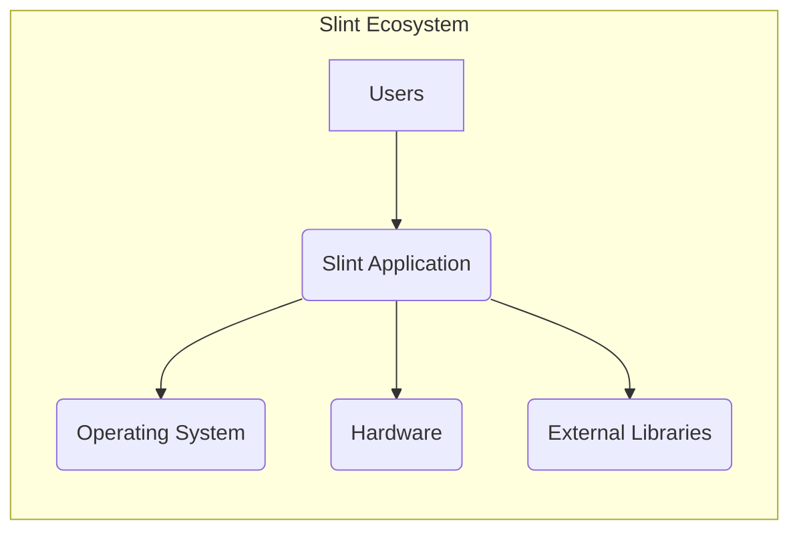
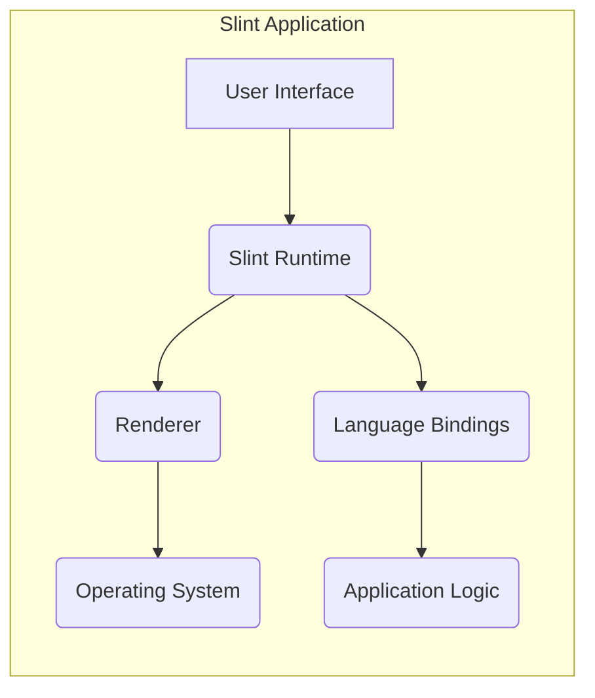
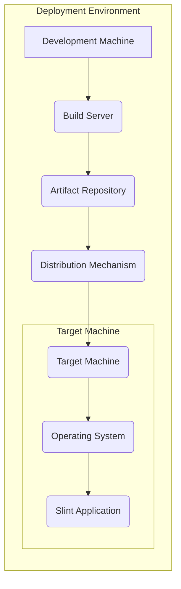
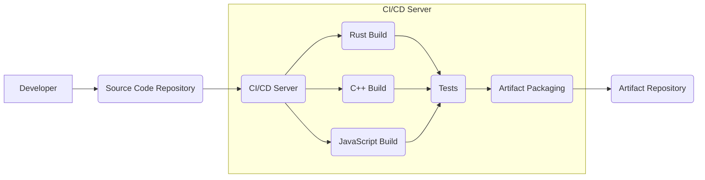

Okay, let's create a design document for the Slint UI project.

# BUSINESS POSTURE

Slint is a declarative GUI toolkit to build native user interfaces for desktop and embedded applications.  The business priorities appear to be:

*   Provide a fast, lightweight, and easy-to-use UI toolkit.
*   Support multiple programming languages (Rust, C++, JavaScript).
*   Enable development for both desktop and embedded systems.
*   Offer a flexible licensing model (including a free software option and commercial licenses).
*   Build a community around the project and attract contributors.
*   Provide professional services and support.

Based on these priorities, the most important business risks are:

*   Security vulnerabilities in the toolkit that could lead to compromise of applications built with Slint. This is critical for both desktop and, especially, embedded systems, where updates might be infrequent.
*   Inability to maintain compatibility across supported languages and platforms, leading to fragmentation and developer frustration.
*   Failure to attract and retain a sufficient developer base, hindering long-term project viability.
*   Competition from other established UI toolkits.
*   Legal challenges related to licensing or intellectual property.
*   Supply chain attacks that compromise the build process or distributed binaries.

# SECURITY POSTURE

Existing security controls (based on the repository and general best practices for similar projects):

*   security control: Code Reviews: Pull requests on GitHub are used, implying a code review process before merging changes.
*   security control: Static Analysis:  The project uses linters (clippy for Rust) and likely other static analysis tools as part of their CI/CD pipeline, although the specifics need confirmation.
*   security control: Fuzzing: The project includes fuzzing tests, which are crucial for identifying memory safety issues, especially in C++ and Rust code.
*   security control: Issue Tracking:  GitHub Issues are used to track bugs and feature requests, including potential security vulnerabilities.
*   security control: Dependency Management:  Dependencies are managed using package managers (Cargo for Rust, npm for JavaScript, CMake for C++), allowing for tracking and updates.
*   security control: Secure Coding Practices: The use of Rust provides inherent memory safety advantages over languages like C++.  However, `unsafe` code blocks in Rust still require careful scrutiny.
*   security control: Access Control: GitHub repository access controls are in place, limiting who can commit code and manage the project.

Accepted risks:

*   accepted risk:  The project uses multiple programming languages (Rust, C++, JavaScript), increasing the attack surface and the complexity of security analysis.
*   accepted risk:  The project targets embedded systems, which often have limited resources for security controls and updates.
*   accepted risk:  The project relies on third-party libraries and dependencies, which may introduce their own vulnerabilities.
*   accepted risk:  The project has a relatively small core team, which may limit the capacity for thorough security reviews and rapid response to vulnerabilities.

Recommended security controls:

*   Implement a comprehensive Security Development Lifecycle (SDL) process, including threat modeling, security training for developers, and regular security audits.
*   Integrate Software Composition Analysis (SCA) tools to identify and manage vulnerabilities in third-party dependencies.
*   Establish a clear vulnerability disclosure policy and a process for handling reported security issues.
*   Consider using a bug bounty program to incentivize external security researchers to find and report vulnerabilities.
*   Implement code signing for released binaries to ensure their integrity and authenticity.
*   Use memory sanitizers (e.g., ASan, MSan) during testing to detect memory corruption issues.

Security Requirements:

*   Authentication: Not directly applicable to the Slint toolkit itself, but applications built with Slint should implement secure authentication mechanisms where appropriate.
*   Authorization:  Similarly, authorization is the responsibility of applications built with Slint.  Slint should provide mechanisms (e.g., role-based access control) to facilitate secure authorization.
*   Input Validation: Slint must properly handle and sanitize all user inputs to prevent injection attacks (e.g., cross-site scripting in the case of web-based rendering). This includes text input, file uploads, and any other data received from external sources.
*   Cryptography:  Slint should use strong cryptographic algorithms and libraries for any security-sensitive operations (e.g., secure communication, data encryption).  Applications built with Slint should follow cryptographic best practices.
*   Memory Management: Slint should be free of memory leaks, buffer overflows, and other memory safety issues. The use of Rust helps, but careful attention is still needed, especially in C++ code and `unsafe` Rust blocks.
*   Error Handling: Slint should handle errors gracefully and securely, without revealing sensitive information or creating vulnerabilities.
*   Configuration: Slint should provide secure default configurations and allow for easy customization of security-related settings.

# DESIGN

## C4 CONTEXT

Element Descriptions:

*   1.  Name: Users
    *   Type: Person
    *   Description: Individuals interacting with applications built using Slint.
    *   Responsibilities: Provide input to the application, view and interact with the UI.
    *   Security controls: None directly implemented by Slint; security is the responsibility of the application.

*   2.  Name: Slint Application
    *   Type: Software System
    *   Description: An application built using the Slint UI toolkit.
    *   Responsibilities: Render the user interface, handle user input, interact with the operating system and hardware.
    *   Security controls: Inherits security controls from the Slint toolkit and the underlying operating system.  Application developers are responsible for implementing additional security measures as needed.

*   3.  Name: Operating System
    *   Type: Software System
    *   Description: The underlying operating system (e.g., Windows, Linux, macOS, embedded OS).
    *   Responsibilities: Provide system resources and services to the Slint application.
    *   Security controls: OS-level security controls (e.g., process isolation, memory protection, access controls).

*   4.  Name: Hardware
    *   Type: Device
    *   Description: The physical hardware on which the Slint application runs.
    *   Responsibilities: Execute the application code and provide access to peripherals.
    *   Security controls: Hardware-level security features (e.g., secure boot, trusted execution environment).

*   5.  Name: External Libraries
    *   Type: Software System
    *   Description: Third-party libraries used by the Slint application or the Slint toolkit itself.
    *   Responsibilities: Provide specific functionality not included in Slint or the standard libraries.
    *   Security controls: Rely on the security of the external libraries themselves.  Slint should use well-maintained and reputable libraries.

## C4 CONTAINER

Element Descriptions:

*   1.  Name: User Interface
    *   Type: Container
    *   Description: The declarative UI definition (written in the Slint language).
    *   Responsibilities: Define the structure and appearance of the user interface.
    *   Security controls: Input validation to prevent injection attacks.

*   2.  Name: Slint Runtime
    *   Type: Container
    *   Description: The core runtime library of the Slint toolkit.
    *   Responsibilities: Parse the UI definition, manage the UI state, handle events, and interact with the renderer.
    *   Security controls: Memory safety checks, input validation, error handling.

*   3.  Name: Renderer
    *   Type: Container
    *   Description: The component responsible for drawing the UI on the screen.
    *   Responsibilities: Translate the UI definition into graphical output, interact with the operating system's graphics API.
    *   Security controls: Protection against graphics-related vulnerabilities (e.g., buffer overflows in image processing).

*   4.  Name: Operating System
    *   Type: External Container
    *   Description: The underlying operating system.
    *   Responsibilities: Provide system resources and services.
    *   Security controls: OS-level security controls.

*   5.  Name: Language Bindings
    *   Type: Container
    *   Description: The interface between the Slint runtime and the application logic written in different programming languages (Rust, C++, JavaScript).
    *   Responsibilities: Allow application code to interact with the Slint runtime.
    *   Security controls: Secure handling of data passed between different languages, prevention of memory corruption.

*   6.  Name: Application Logic
    *   Type: Container
    *   Description: The application-specific code that interacts with the Slint UI.
    *   Responsibilities: Handle business logic, interact with external systems, and update the UI state.
    *   Security controls: Application-specific security measures (e.g., authentication, authorization, data validation).

## DEPLOYMENT

Slint applications can be deployed in several ways:

1.  **Desktop Application:** Traditional desktop application deployment (e.g., Windows installer, macOS .app bundle, Linux package).
2.  **Embedded System:** Deployment to an embedded device, often involving flashing a firmware image.
3.  **WebAssembly (Experimental):** Compilation to WebAssembly for web-based deployment.

We'll describe the **Desktop Application** deployment in detail:

Element Descriptions:

*   1.  Name: Development Machine
    *   Type: Infrastructure Node
    *   Description: The developer's workstation where the code is written and tested.
    *   Responsibilities: Code development, local testing.
    *   Security controls: Developer machine security (e.g., antivirus, firewall).

*   2.  Name: Build Server
    *   Type: Infrastructure Node
    *   Description: A server that builds the Slint application. This could be a CI/CD server (e.g., GitHub Actions, Jenkins).
    *   Responsibilities: Compile the code, run tests, create release artifacts.
    *   Security controls: Secure build environment, access controls, build process integrity checks.

*   3.  Name: Artifact Repository
    *   Type: Infrastructure Node
    *   Description: A repository for storing build artifacts (e.g., installers, binaries).
    *   Responsibilities: Store and manage release artifacts.
    *   Security controls: Access controls, integrity checks (e.g., checksums, signatures).

*   4.  Name: Distribution Mechanism
    *   Type: Infrastructure Node
    *   Description: The method used to distribute the application to users (e.g., website download, app store).
    *   Responsibilities: Make the application available to users.
    *   Security controls: Secure download channels (e.g., HTTPS), code signing.

*   5.  Name: Target Machine
    *   Type: Infrastructure Node
    *   Description: The user's computer where the Slint application is installed and run.
    *   Responsibilities: Run the application.
    *   Security controls: User machine security (e.g., antivirus, firewall).

*   6.  Name: Operating System
    *   Type: Software System
    *   Description: The operating system on the target machine.
    *   Responsibilities: Provide system resources.
    *   Security controls: OS-level security controls.

*   7.  Name: Slint Application
    *   Type: Software System
    *   Description: The installed Slint application.
    *   Responsibilities: Run the application logic and render the UI.
    *   Security controls: Inherits security controls from Slint and the OS.

## BUILD

The Slint build process involves multiple languages and build systems. A simplified overview is provided below:

*   Developer commits code to the Source Code Repository (GitHub).
*   A CI/CD server (e.g., GitHub Actions) is triggered.
*   The CI/CD server runs separate build processes for Rust, C++, and JavaScript.
*   Each build process compiles the code, runs linters (e.g., clippy for Rust), and performs static analysis.
*   Tests (including unit tests and fuzzing tests) are executed.
*   If all builds and tests pass, the artifacts are packaged (e.g., creating installers, binaries).
*   The packaged artifacts are uploaded to an Artifact Repository.

Security Controls in the Build Process:

*   Source Code Repository: Access controls, branch protection rules.
*   CI/CD Server: Secure build environment, limited access, build process integrity checks.
*   Linters and Static Analysis: Identify potential code quality and security issues.
*   Tests: Verify functionality and identify vulnerabilities.
*   Artifact Packaging: Code signing to ensure artifact integrity.
*   Artifact Repository: Access controls, integrity checks.
*   Dependency Management: Use of package managers to track and update dependencies.
*   Supply Chain Security:  Needs further strengthening (e.g., using tools to analyze dependencies for known vulnerabilities).

# RISK ASSESSMENT

*   Critical Business Processes:
    *   Software Development: Ensuring the integrity and security of the Slint toolkit itself.
    *   Distribution: Providing secure and reliable access to the toolkit and applications built with it.
    *   Community Engagement: Maintaining a healthy and active community of developers and users.
    *   Professional Services: Providing reliable and secure support and consulting services.

*   Data to Protect:
    *   Source Code: High sensitivity.  Compromise could lead to malicious code injection.
    *   Build Artifacts: High sensitivity.  Compromise could lead to distribution of malicious software.
    *   User Data (in applications built with Slint): Sensitivity varies depending on the application.  Slint itself does not directly handle user data, but applications built with it may.
    *   Community Data (e.g., forum posts, issue reports): Low to moderate sensitivity.
    *   Internal Development Data (e.g., design documents, internal communications): Moderate sensitivity.

# QUESTIONS & ASSUMPTIONS

*   Questions:
    *   What specific static analysis tools are used beyond linters?
    *   What is the exact CI/CD pipeline configuration?
    *   Are there any existing security audits or penetration test reports?
    *   What is the process for handling security vulnerabilities reported by external researchers?
    *   What are the specific security requirements for embedded systems deployments?
    *   Are there plans for supporting other platforms or languages in the future?
    *   What level of code coverage is achieved by the tests?
    *   How are secrets (e.g., API keys, signing keys) managed in the build and deployment process?

*   Assumptions:
    *   The GitHub repository is the primary source of truth for the project.
    *   The project follows secure coding practices, even if not explicitly documented.
    *   The core team is aware of and addresses security concerns.
    *   The project aims to minimize the use of `unsafe` code in Rust.
    *   The project uses up-to-date versions of its dependencies.
    *   The build process is automated and reproducible.
    *   Basic security hygiene is practiced by developers and contributors (e.g., strong passwords, secure development environments).
    *   The project is in its early stages, and security controls will evolve over time.