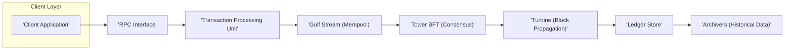
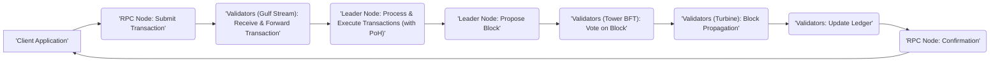

# Project Design Document: Solana Blockchain Platform

**Version:** 1.1
**Date:** October 26, 2023
**Author:** AI Software Architect

## 1. Project Overview

This document provides a detailed architectural overview of the Solana blockchain platform, designed to facilitate threat modeling and security analysis. Solana is a high-throughput, permissionless, and open-source blockchain operating at Layer 1. Its primary focus is to enable scalable and fast decentralized applications (dApps) by addressing the scalability limitations of earlier blockchain technologies. This document outlines the core components, their interactions, and the data flow within the Solana network.

## 2. Goals and Objectives

*   **Ultra-High Transaction Throughput:**  Achieve transaction processing speeds exceeding tens of thousands of transactions per second (TPS).
*   **Sub-Second Transaction Latency:** Minimize the time required for transaction confirmation, aiming for sub-second finality.
*   **Horizontal Scalability:** Design the network to scale with increasing demand by adding more nodes without significant performance degradation.
*   **Decentralized and Permissionless Operation:** Maintain a distributed network where anyone can participate as a validator without requiring specific permissions.
*   **Robust Security:** Ensure the integrity of the blockchain, the security of user funds, and resilience against various attack vectors.
*   **Developer-Friendly Platform:** Provide a comprehensive set of tools and resources to enable developers to build and deploy dApps efficiently.

## 3. Target Audience

This document is intended for individuals and teams involved in the security analysis and development of the Solana platform and applications built upon it. This includes:

*   Security architects and engineers conducting threat modeling and penetration testing.
*   Software developers building core Solana infrastructure or decentralized applications.
*   System administrators responsible for deploying, operating, and monitoring Solana nodes.
*   Researchers and auditors seeking a deep understanding of Solana's technical architecture.

## 4. Scope

This document focuses on the core architectural elements of the Solana blockchain, specifically those relevant to transaction processing, consensus mechanisms, data storage, and network communication. The scope includes:

*   The roles and responsibilities of different node types (validators, RPC nodes, archivers).
*   The key protocols and algorithms employed by Solana (Proof of History, Tower BFT, Turbine, Gulf Stream).
*   The lifecycle of a transaction from submission to finalization.
*   The structure and organization of the Solana ledger.
*   High-level security considerations for each component.

This document does not cover:

*   The specifics of individual smart contracts or dApp implementations.
*   Detailed code-level implementation specifics.
*   Economic models and tokenomics in detail.

## 5. High-Level Architecture

Solana's architecture is characterized by several innovative features designed to optimize performance. The core components work in concert to process transactions and maintain the blockchain's state.

*   **Client Application:**  Software applications, including web interfaces, mobile apps, or command-line tools, used by users to interact with the Solana network. These applications generate and submit transactions.
*   **RPC Interface:** A set of APIs (typically JSON-RPC over HTTP/WebSockets) that allows clients to communicate with Solana nodes. This interface handles transaction submission, data queries, and other network interactions.
*   **Transaction Processing Unit:** The central component responsible for receiving, verifying, and executing transactions. This unit interacts with the runtime environment for smart contract execution.
*   **Gulf Stream (Mempool):**  A transaction forwarding protocol that proactively relays transactions to validators before they are included in a block. This reduces transaction confirmation times by minimizing the time transactions spend in a traditional mempool.
*   **Tower BFT (Consensus):** Solana's custom Proof-of-Stake (PoS) consensus mechanism. It leverages Proof of History (PoH) to establish a global, verifiable ordering of events, significantly speeding up consensus.
*   **Turbine (Block Propagation):** A block propagation protocol optimized for high bandwidth networks. Turbine breaks blocks into smaller packets and streams them to nodes using a tree-like distribution mechanism, improving propagation speed and efficiency.
*   **Ledger Store:** The persistent storage layer where the Solana blockchain data, including blocks, transactions, and account states, is stored. Validators maintain a full copy of the ledger.
*   **Archivers (Historical Data):**  Separate nodes responsible for storing historical blockchain data. This offloads the burden of storing the entire history from validators, allowing them to focus on processing recent transactions and maintaining consensus.

## 6. Key Components and their Functionality

*   **Validators:**
    *   Core participants in the Solana network responsible for validating transactions, participating in consensus, and maintaining a copy of the ledger.
    *   Stake SOL tokens as collateral to participate in the consensus process and earn rewards for their contributions.
    *   Run the core Solana node software, which implements the consensus protocol, transaction processing logic, and networking functionalities.
*   **Leaders:**
    *   Validators elected for a specific time slot (a few seconds) to produce new blocks.
    *   The leader schedule is determined in advance based on validator stake and historical performance, leveraging the Proof of History mechanism.
    *   Responsible for ordering transactions and proposing new blocks to the network.
*   **Proof of History (PoH):**
    *   A high-frequency Verifiable Delay Function (VDF) that creates a historical record proving that a certain amount of time has passed between events.
    *   Allows nodes to independently verify the order and timing of events without relying solely on network timestamps.
    *   Generated by repeatedly hashing the previous output, making it computationally intensive to generate but easy to verify.
*   **Tower BFT:**
    *   Solana's Proof-of-Stake based consensus algorithm that utilizes Proof of History to achieve high throughput and fast finality.
    *   Validators vote on the validity of blocks proposed by the leader, with votes weighted by their stake.
    *   Leverages the pre-established order of events from PoH to streamline the consensus process and reduce communication overhead.
*   **Transaction Processing Unit:**
    *   Receives transactions from the RPC interface and the Gulf Stream protocol.
    *   Verifies transaction signatures and account balances.
    *   Executes smart contracts (programs) associated with the transactions within the Solana Runtime.
    *   Updates the state of accounts based on the outcome of transaction execution.
*   **Smart Contracts (Programs):**
    *   Executable code deployed on the Solana blockchain that defines the logic for decentralized applications.
    *   Primarily written in Rust and compiled to Berkeley Packet Filter (BPF) bytecode for execution within the Solana Runtime.
    *   Interact with accounts to read and modify their data.
*   **Accounts:**
    *   Represent entities on the Solana blockchain, such as user accounts, program accounts, and data accounts.
    *   Hold SOL tokens and arbitrary data.
    *   Identified by unique public keys.
    *   Have associated program owners that define how the account's data can be modified.
*   **Solana Runtime (Sealevel):**
    *   The execution environment for smart contracts on Solana.
    *   Designed for parallel transaction processing, allowing multiple smart contracts to execute concurrently if they do not access the same state.
    *   Utilizes the BPF virtual machine for secure and efficient execution of smart contract bytecode.
*   **Banks:**
    *   Represent snapshots of the Solana ledger state at specific points in time.
    *   Updated as new blocks are finalized.
    *   Used to track account balances, program data, and other relevant information.
*   **Archivers:**
    *   Nodes that store historical snapshots of the Solana ledger.
    *   Replicate data from validators to provide long-term storage and allow validators to prune older data.
    *   Participate in a proof-of-replication mechanism to ensure data integrity and availability.
*   **Gossip Protocol:**
    *   Used by validators to discover peers, share information about the network topology, and disseminate transaction information and block proposals.
    *   Ensures that all validators have an up-to-date view of the network.

## 7. Data Flow

The lifecycle of a transaction on the Solana network involves several key stages:

1. **Transaction Creation and Signing:** A client application constructs a transaction containing instructions for state changes and signs it using the sender's private key.
2. **Transaction Submission:** The signed transaction is submitted to the network via an RPC node.
3. **Transaction Broadcasting (Gulf Stream):** The RPC node forwards the transaction to a known set of validators, who then propagate it further through the Gulf Stream protocol. This proactive forwarding reduces latency.
4. **Transaction Processing and Execution:** The current leader for the slot receives transactions and begins processing them. This involves verifying signatures, checking account balances, and executing the relevant smart contracts within the Solana Runtime. Proof of History provides a timestamp for each operation.
5. **Block Proposal:** The leader proposes a new block containing a set of processed and ordered transactions, along with the Proof of History sequence.
6. **Consensus Voting (Tower BFT):** Validators receive the proposed block and vote on its validity based on the Proof of History timestamps, transaction signatures, and the correctness of state transitions. Votes are weighted by stake.
7. **Block Finalization:** Once a supermajority of validators has voted for the block, it is considered finalized and added to the blockchain.
8. **Block Propagation (Turbine):** The finalized block is propagated to all validators using the Turbine protocol, which efficiently streams block data in small packets.
9. **Ledger Update:** Validators append the new block to their local copy of the ledger, updating the blockchain state.
10. **Confirmation:** The client application receives confirmation from an RPC node that the transaction has been included in a finalized block.

## 8. Security Considerations (Preliminary)

Solana's architecture incorporates several security features, but like any complex system, it is subject to potential threats.

*   **Byzantine Fault Tolerance:** Tower BFT is designed to tolerate up to one-third of validators acting maliciously or failing. This ensures the network can continue operating even if some nodes are compromised.
*   **Sybil Resistance:** The Proof-of-Stake mechanism makes it economically expensive for an attacker to gain control of the network by requiring a significant amount of staked SOL.
*   **Proof of History Security:** PoH makes it difficult for malicious actors to manipulate the order of transactions or timestamps, as any alteration would require recomputing the entire PoH sequence.
*   **Smart Contract Vulnerabilities:**  Bugs or vulnerabilities in smart contracts can be exploited. Secure coding practices, formal verification, and thorough auditing are crucial for mitigating this risk.
*   **Denial of Service (DoS) Attacks:** The network is susceptible to DoS attacks targeting RPC nodes or validators. Rate limiting, resource management, and robust network infrastructure are necessary defenses.
*   **Validator Key Management:**  The security of validator private keys is paramount. Compromised keys could allow attackers to sign malicious transactions or disrupt consensus. Secure key storage and handling procedures are essential.
*   **State Bloat:**  The continuous growth of the blockchain state can pose challenges. State compression techniques and efficient data pruning mechanisms are important for long-term sustainability.
*   **Governance Risks:**  The mechanisms for upgrading the Solana protocol and managing the network's evolution need to be secure and transparent to prevent malicious takeovers.
*   **MEV (Miner Extractable Value) / Front-Running:**  The potential for validators or other actors to profit by reordering or inserting transactions exists and needs careful consideration.

## 9. Technology Stack

*   **Core Programming Language:** Rust (for the Solana core, smart contracts, and tooling)
*   **Smart Contract Execution Environment:** Berkeley Packet Filter (BPF) virtual machine
*   **Consensus Algorithm:** Tower BFT (Proof of Stake)
*   **Cryptographic Libraries:**  Libsodium, various Rust-based cryptography crates
*   **Networking Protocols:** UDP (primary for inter-validator communication), TCP (for RPC and other services)
*   **Data Storage:** Append-only ledger, potentially utilizing technologies like RocksDB for efficient storage and retrieval
*   **Transaction Serialization:**  Binary encoding (e.g., Borsh) for efficient data transmission
*   **Build System:** Cargo (Rust's package manager and build tool)

## 10. Deployment Model

Solana operates as a decentralized, permissionless network.

*   **Validator Nodes:**  Run by individuals, organizations, or professional staking providers. Require significant hardware resources, technical expertise, and a stake of SOL tokens.
*   **RPC Nodes:** Provide API access to the network. Can be run by exchanges, infrastructure providers, or individual developers. Offer a gateway for interacting with the blockchain.
*   **Archiver Nodes:**  Store historical blockchain data. Can be run by various participants to contribute to the network's long-term data availability.
*   **Light Clients:**  Simplified clients that do not store the entire blockchain. Rely on RPC nodes for accessing blockchain data.

## 11. Future Considerations

*   **State Compression:** Implementing techniques to significantly reduce the storage requirements for on-chain data.
*   **Interoperability Solutions:** Exploring bridges and other mechanisms to enable seamless interaction with other blockchain networks.
*   **On-Chain Governance Enhancements:**  Developing more robust and decentralized mechanisms for protocol upgrades and network parameter adjustments.
*   **Continued Performance Optimization:**  Ongoing research and development to further improve transaction throughput and reduce latency.
*   **Enhanced Developer Tools:**  Expanding the suite of tools and resources available to developers building on Solana.

This document provides a comprehensive architectural overview of the Solana blockchain, serving as a valuable resource for security analysis and threat modeling. Understanding these core components and their interactions is crucial for identifying potential vulnerabilities and designing effective security measures.
