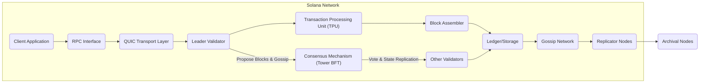

# Project Design Document: Solana Blockchain Platform

**Version:** 1.1
**Date:** October 26, 2023
**Prepared By:** [Your Name/Team Name]

## 1. Introduction

This document provides an enhanced architectural overview of the Solana blockchain platform, drawing upon information available in the public GitHub repository ([https://github.com/solana-labs/solana](https://github.com/solana-labs/solana)). This revised document aims to provide an even stronger foundation for subsequent threat modeling activities, offering a more detailed understanding of the system's components, interactions, and data flows. We have expanded on key areas to provide greater clarity and depth.

## 2. Goals and Objectives

The primary goals of the Solana project are to provide:

*   **Ultra-High Throughput:** Achieve significantly higher transaction processing speeds, targeting tens of thousands of transactions per second (TPS), compared to traditional blockchains.
*   **Sub-Second Latency:** Minimize transaction confirmation times to near real-time.
*   **Global Scalability:** Design an architecture capable of supporting a massive number of users and applications worldwide.
*   **Developer Accessibility and Composability:** Provide a robust, developer-friendly platform that enables the creation of complex and interconnected decentralized applications (dApps).

## 3. Target Audience

This document is intended for:

*   Security engineers and architects responsible for threat modeling, security assessments, and penetration testing.
*   Development teams building applications on Solana or integrating with the Solana network.
*   Operations and infrastructure teams deploying and maintaining Solana validator nodes and related infrastructure.
*   Researchers and individuals seeking a comprehensive understanding of Solana's internal architecture and design principles.

## 4. Scope

This document covers the core architectural components and processes within the Solana blockchain platform, focusing on elements relevant for security analysis:

*   Detailed client interactions and transaction submission pathways.
*   In-depth explanation of validator roles (Leader, Verifier/Observer) and their responsibilities.
*   A thorough examination of Solana's core innovations, particularly Proof of History (PoH) and its role.
*   A granular breakdown of the transaction processing pipeline within the Transaction Processing Unit (TPU).
*   The structure and management of data storage and the distributed ledger.
*   The architecture and execution environment of Solana's smart contracts (Sealevel).
*   Mechanisms for inter-validator communication and data propagation.

This document will primarily focus on the core platform architecture. While smart contract security is a crucial aspect, the specifics of individual smart contracts are outside the scope unless directly relevant to understanding platform-level security considerations. External integrations will also be addressed at a high level.

## 5. High-Level Architecture

**Components:**

*   **Client Application:** Software, such as wallets or dApps, that interacts with the Solana network to create, sign, and submit transactions, as well as query network data.
*   **RPC Interface:** The primary interface through which clients interact with the Solana network, providing APIs for transaction submission, account state queries, and block data retrieval.
*   **QUIC Transport Layer:** Solana utilizes the QUIC protocol for efficient and reliable communication, particularly between clients and validators.
*   **Leader Validator:** A validator node elected for a specific time slot (slot leader) responsible for proposing new blocks to the network based on the order established by Proof of History.
*   **Other Validators:** Validator nodes that participate in the consensus process by verifying proposed blocks, voting on their validity, and maintaining a synchronized copy of the ledger. These can be further categorized (e.g., block producers, observers).
*   **Consensus Mechanism (Tower BFT):** Solana's Byzantine Fault Tolerant (BFT) consensus algorithm, which leverages Proof of History (PoH) as a global clock source and employs a voting mechanism to achieve agreement on the canonical ledger state.
*   **Transaction Processing Unit (TPU):** The core processing engine within a validator node responsible for handling incoming transactions through a pipelined architecture.
*   **Block Assembler:** A component within the Leader validator that collects processed and verified transactions from the TPU and organizes them into a candidate block.
*   **Ledger/Storage:** The distributed, append-only database that stores the complete history of transactions and the current state of all accounts on the Solana network.
*   **Gossip Network:** A peer-to-peer communication network used by validators to share information about the network state, including block proposals, votes, and node availability.
*   **Replicator Nodes:** Nodes that download and store copies of the ledger data from validators, providing historical data for auditability and serving client queries.
*   **Archival Nodes:** Specialized nodes that maintain a complete archive of the Solana ledger, ensuring long-term data preservation.

## 6. Detailed Component Descriptions

### 6.1. Client Application

*   **Functionality:**  Responsible for creating, signing, and submitting transactions to the Solana network via the RPC interface. Also queries the network for account balances, transaction status, and other relevant data.
*   **Key Interactions:** Primarily interacts with the RPC interface using methods defined by the Solana JSON-RPC API.
*   **Security Considerations:**  Crucially responsible for secure private key management. Vulnerable to phishing attacks, malware, and insecure storage of cryptographic keys.

### 6.2. RPC Interface

*   **Functionality:**  Provides a set of APIs (typically JSON-RPC) that allow clients to interact with the Solana network. Handles request routing, rate limiting, and potentially load balancing across validator nodes.
*   **Key Interactions:** Receives transaction submission and query requests from clients and forwards them to appropriate validator nodes. Returns responses to clients.
*   **Security Considerations:**  Must be robust against denial-of-service (DoS) attacks, unauthorized access, and injection vulnerabilities. Proper authentication and authorization mechanisms are essential for sensitive operations.

### 6.3. QUIC Transport Layer

*   **Functionality:** Provides a secure and reliable transport protocol for communication within the Solana network, especially between clients and validators. QUIC offers features like multiplexing, flow control, and inherent encryption.
*   **Key Interactions:** Underlies communication between clients, RPC interfaces, and validator nodes.
*   **Security Considerations:**  While QUIC provides built-in encryption, proper configuration and implementation are crucial. Vulnerabilities in the QUIC implementation itself could pose risks.

### 6.4. Leader Validator

*   **Functionality:**  Elected for a specific slot duration to propose new blocks. Receives transactions processed by its TPU, assembles them into blocks, signs the block, and broadcasts it to other validators via the gossip network.
*   **Key Interactions:** Interacts heavily with the TPU, the Consensus mechanism, and other validators through the gossip network.
*   **Security Considerations:**  A highly critical component. Compromise of a Leader validator could lead to censorship, double-spending, or other attacks. Requires stringent security measures, including secure key management and robust infrastructure protection.

### 6.5. Other Validators

*   **Functionality:**  Participate in the consensus process by verifying proposed blocks against their local state, voting on their validity, and maintaining a synchronized copy of the ledger. They also retransmit blocks and votes through the gossip network.
*   **Key Interactions:**  Receive block proposals and votes from other validators via the gossip network. Interact with the Consensus mechanism to cast votes.
*   **Security Considerations:**  Must be protected against attacks that could compromise the consensus process, such as Sybil attacks, denial-of-service, and attempts to manipulate voting behavior.

### 6.6. Consensus Mechanism (Tower BFT)

*   **Functionality:**  Ensures agreement among validators on the order of transactions and the state of the ledger. Relies on Proof of History (PoH) to establish a global, verifiable ordering of events and utilizes a voting mechanism where validators lock up stake to vote on the correct fork.
*   **Key Interactions:**  Receives proposed blocks and votes from validators. Processes votes and determines when a block is finalized.
*   **Security Considerations:**  Must be resilient to Byzantine faults, network partitions, and attacks that attempt to manipulate the PoH sequence or the voting process. The security of the stake-weighted voting mechanism is paramount.

### 6.7. Transaction Processing Unit (TPU)

*   **Functionality:**  The core transaction processing engine within a validator, designed for high throughput. It employs a multi-stage pipeline:
    *   **Fetch Stage:** Receives incoming transaction packets from the network.
    *   **SigVerify Stage:** Verifies the cryptographic signatures of transactions in parallel using the GPU.
    *   **Banking Stage:** Executes transactions against the current account state using the Sealevel runtime. This stage can also be parallelized.
    *   **Vote Stage:** Processes vote transactions, which are critical for the consensus mechanism.
    *   **Forwarding Stage:** Forwards processed transactions to the block assembler.
*   **Key Interactions:**  Receives transactions from the network, interacts with the Sealevel runtime for execution, and passes processed transactions to the Block Assembler.
*   **Security Considerations:**  Must prevent the processing of invalid or malicious transactions. Secure implementation of the Sealevel runtime and robust error handling are critical. Vulnerabilities in the parallel processing logic could be exploited.

### 6.8. Block Assembler

*   **Functionality:**  A component within the Leader validator that gathers processed and verified transactions from the TPU and organizes them into a proposed block, adhering to the order established by Proof of History.
*   **Key Interactions:**  Receives processed transactions from the TPU.
*   **Security Considerations:**  Ensures the correct ordering of transactions within a block according to the PoH sequence. Vulnerabilities could lead to incorrect block construction.

### 6.9. Ledger/Storage

*   **Functionality:**  The distributed, append-only database that stores the complete history of all transactions and the current state of accounts on the Solana network. Data is typically sharded or segmented for scalability.
*   **Key Interactions:**  Receives finalized blocks from validators. Read by validators, replicators, and archival nodes.
*   **Security Considerations:**  Data integrity and availability are paramount. Needs robust protection against data corruption, unauthorized modification, and censorship. Mechanisms for data recovery and auditability are essential.

### 6.10. Gossip Network

*   **Functionality:**  A peer-to-peer network used by validators to exchange information about the network state, including block proposals, votes, cluster membership, and other relevant data.
*   **Key Interactions:**  Validators send and receive messages related to block propagation, voting, and network status.
*   **Security Considerations:**  Needs to be resilient to attacks that could disrupt communication or spread false information, such as eclipse attacks or Sybil attacks targeting the gossip protocol.

### 6.11. Replicator Nodes

*   **Functionality:**  Download and store copies of the Solana ledger from validator nodes. These nodes can serve client queries for historical data and contribute to network resilience.
*   **Key Interactions:**  Read ledger data from validator nodes via the gossip network or direct connections.
*   **Security Considerations:**  Ensuring the integrity and authenticity of the replicated data. Vulnerabilities could allow for the distribution of corrupted or tampered ledger history.

### 6.12. Archival Nodes

*   **Functionality:**  Specialized nodes that maintain a complete and permanent archive of the Solana ledger, providing long-term data availability and auditability.
*   **Key Interactions:**  Receive ledger data from replicator nodes or directly from validators.
*   **Security Considerations:**  Long-term data integrity and storage security are critical. Protection against data loss, corruption, and unauthorized access is essential.

## 7. Key Data Flows

```mermaid
graph LR
    subgraph "Transaction Submission & Processing"
        direction TB
        ClientApp("Client Application") -- "1. Create & Sign Transaction" --> RPCInterface("RPC Interface");
        RPCInterface -- "2. Forward via QUIC" --> LeaderNode("Leader Validator");
        LeaderNode -- "3. Fetch Stage" --> TPUFetch("TPU - Fetch Stage");
        TPUFetch -- "4. SigVerify Stage (GPU)" --> TPUSigVerify("TPU - SigVerify Stage");
        TPUSigVerify -- "5. Banking Stage (Sealevel)" --> TPUBanking("TPU - Banking Stage");
        TPUBanking -- "6. Vote Stage" --> TPUVote("TPU - Vote Stage");
        TPUVote -- "7. Forward Processed TXs" --> BlockAssembly("Block Assembler");
    end

    subgraph "Block Creation, Consensus & Finalization"
        direction TB
        BlockAssembly -- "8. Assemble Proposed Block" --> LeaderNode;
        LeaderNode -- "9. Broadcast Block (Gossip)" --> OtherValidators("Other Validators");
        OtherValidators -- "10. Verify & Vote" --> ConsensusMechanism("Consensus Mechanism (Tower BFT)");
        ConsensusMechanism -- "11. Finalize Block" --> LedgerStorage("Ledger/Storage");
        LedgerStorage -- "12. Ledger Updates (Gossip)" --> ReplicatorNodes("Replicator Nodes");
    end

    subgraph "State & Historical Data Query"
        direction TB
        ClientQuery("Client Application") -- "1. Query State/History" --> RPCQuery("RPC Interface");
        RPCQuery -- "2a. Current State Query" --> ValidatorNode("Validator Node");
        RPCQuery -- "2b. Historical Query" --> ReplicatorNodes;
        ValidatorNode -- "3a. Return State" --> RPCQuery;
        ReplicatorNodes -- "3b. Return Historical Data" --> RPCQuery;
        RPCQuery -- "4. Return to Client" --> ClientQuery;
    end
```

**Data Flow Descriptions:**

*   **Transaction Submission & Processing:**
    1. A client application creates and cryptographically signs a transaction.
    2. The client submits the signed transaction to an RPC interface.
    3. The RPC interface forwards the transaction to the current Leader validator using QUIC.
    4. The Leader's TPU begins processing the transaction in the Fetch Stage.
    5. The SigVerify Stage verifies the transaction's signature, often leveraging GPU acceleration.
    6. The Banking Stage executes the transaction against the current account state using the Sealevel runtime.
    7. The Vote Stage processes any embedded vote transactions.
    8. Processed transactions are forwarded to the Block Assembler.

*   **Block Creation, Consensus & Finalization:**
    9. The Block Assembler organizes processed transactions into a proposed block.
    10. The Leader validator broadcasts the proposed block to other validators via the gossip network.
    11. Other validators verify the block and vote on its validity, participating in the Tower BFT consensus mechanism.
    12. The Consensus Mechanism finalizes the block once a supermajority of votes is achieved.
    13. The finalized block is appended to the Ledger/Storage.
    14. Ledger updates are propagated to Replicator Nodes via the gossip network.

*   **State & Historical Data Query:**
    15. A client application sends a request to query either the current state of an account or historical data.
    16. The RPC interface routes the query. Current state queries are typically directed to validator nodes. Historical queries can be served by Replicator Nodes.
    17. The appropriate node retrieves the requested data.
    18. The node returns the data to the RPC interface.
    19. The RPC interface returns the data to the client application.

## 8. Technology Stack

*   **Core Programming Languages:** Rust (primary), C, C++ (for performance-critical components)
*   **Smart Contract Runtime:** Sealevel (based on the Berkeley Packet Filter - BPF)
*   **Consensus Algorithm:** Tower BFT (Byzantine Fault Tolerance) leveraging Proof of History (PoH)
*   **Networking Protocols:** QUIC, UDP, TCP
*   **Cryptography:**  Libsodium, and other standard cryptographic libraries for hashing, digital signatures, and encryption.
*   **Data Serialization:**   используется формат  [Borsh](https://borsh.io/) (Binary Object Representation Serializer for Hashing)

## 9. Security Considerations (For Threat Modeling)

This section provides more specific security considerations to guide the threat modeling process:

*   **Consensus Mechanism Vulnerabilities:**
    *   **Long-Range Attacks:**  Potential for attackers with sufficient stake to rewrite historical parts of the chain.
    *   **Grinding Attacks:** Attempts to manipulate the slot leader election process.
    *   **Denial of Service (DoS) on Voting:**  Attacks targeting the voting process to prevent block finalization.
*   **Proof of History Security:**
    *   **Verifiability Issues:**  Ensuring the PoH sequence is genuinely verifiable and cannot be forged.
    *   **Timestamp Manipulation:**  Potential for subtle manipulation of the PoH sequence to influence transaction ordering.
*   **Smart Contract Security (Sealevel):**
    *   **Reentrancy Attacks:**  Vulnerabilities in smart contracts that allow recursive calls to drain funds.
    *   **Integer Overflows/Underflows:**  Arithmetic errors leading to unexpected behavior.
    *   **Access Control Issues:**  Improperly implemented permissions allowing unauthorized actions.
    *   **Rent Exemption Vulnerabilities:**  Exploiting the rent mechanism for malicious purposes.
*   **Validator Security:**
    *   **Private Key Compromise:**  Theft of validator private keys leading to control of the validator's stake and voting power.
    *   **Remote Code Execution (RCE):**  Vulnerabilities in validator software allowing attackers to execute arbitrary code.
    *   **Denial of Service (DoS) Attacks:**  Overwhelming validator nodes with traffic to disrupt their operation.
    *   **State Corruption:**  Attacks aimed at corrupting the validator's local ledger state.
*   **Network Security:**
    *   **Gossip Protocol Attacks:**  Exploiting vulnerabilities in the gossip protocol to spread false information or disrupt communication.
    *   **Eclipse Attacks:**  Isolating a validator from the rest of the network.
    *   **Sybil Attacks:**  Creating a large number of fake identities to gain undue influence.
*   **Client-Side Security:**
    *   **Private Key Management:**  Insecure storage or handling of user private keys.
    *   **Transaction Malleability:**  Manipulating transaction signatures without invalidating them.
    *   **Phishing Attacks:**  Tricking users into revealing their private keys or signing malicious transactions.
*   **RPC Interface Security:**
    *   **API Abuse and Rate Limiting:**  Overloading the RPC interface with requests.
    *   **Authentication and Authorization Bypass:**  Gaining unauthorized access to sensitive RPC methods.
    *   **Injection Vulnerabilities:**  Exploiting vulnerabilities in the RPC interface to execute arbitrary code.
*   **Data Integrity and Availability:**
    *   **Ledger Corruption:**  Attempts to modify or corrupt the historical transaction data.
    *   **Censorship Attacks:**  Preventing certain transactions from being included in blocks.
    *   **Data Availability Attacks:**  Preventing nodes from accessing the ledger data.

## 10. Assumptions and Constraints

*   The information presented is based on the public GitHub repository and publicly available documentation as of the current date.
*   The Solana architecture is under active development and is subject to change.
*   The security of the underlying cryptographic primitives and libraries is assumed.
*   The network operates as a permissionless and decentralized blockchain.
*   Validators are assumed to be economically rational and incentivized to act in the best interest of the network (by not getting slashed).

## 11. Future Considerations

*   Ongoing research and development into further optimizing transaction processing speed and reducing latency.
*   Enhancements to the Sealevel smart contract development environment and tooling.
*   Exploration and implementation of layer-2 scaling solutions to further increase throughput.
*   Continuous improvements to network resilience, security, and stability.
*   Potential integration with other blockchain ecosystems and technologies.
*   Further development of governance mechanisms and community participation.
