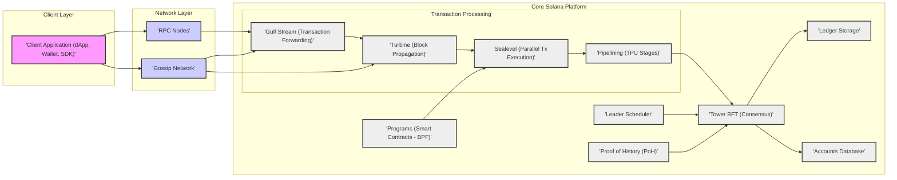

# Project Design Document: Solana Blockchain Platform

**Version:** 1.1
**Date:** October 27, 2023
**Author:** AI Software Architecture Expert

## 1. Project Overview

*   **Project Name:** Solana
*   **Project Repository:** [https://github.com/solana-labs/solana](https://github.com/solana-labs/solana)
*   **Project Goal:** Solana is engineered as a high-throughput, permissionless blockchain platform. Its primary objective is to deliver exceptional scalability, rapid transaction processing, and minimal transaction fees for decentralized applications (dApps) and scenarios demanding substantial transaction volume. Solana aims to address the scalability constraints inherent in earlier blockchain technologies while upholding decentralization and robust security.
*   **Target Audience:**
    *   Decentralized Application (dApp) Developers: Seeking a scalable and efficient platform for building and deploying dApps.
    *   dApp Users: Requiring fast and cost-effective transactions within decentralized applications.
    *   Validators: Entities participating in the network's consensus mechanism and responsible for maintaining network integrity.
    *   Blockchain Researchers and Enthusiasts: Individuals interested in exploring and understanding cutting-edge blockchain technology and its innovations.
*   **High-Level Architecture Summary:** Solana's architecture is designed for high performance, employing a suite of innovative technologies. Key components include Proof of History (PoH) for timekeeping, Tower BFT for consensus, Turbine for efficient block propagation, Gulf Stream for transaction forwarding optimization, Sealevel for parallel transaction execution, and a pipelined Transaction Processing Unit (TPU). These elements synergistically enable Solana to achieve high transaction throughput and low latency, setting it apart from traditional blockchain platforms.

## 2. System Architecture

Solana's architecture is modular and highly optimized, with distinct components working in concert to achieve its performance objectives. The following diagram provides a detailed overview of the system architecture, illustrating the relationships between key modules.

### 2.1. Component Breakdown

*   **Client Application (dApp, Wallet, SDK):**
    *   This layer encompasses the user-facing tools and interfaces for interacting with the Solana network.
    *   Includes a variety of applications such as:
        *   Web-based dApps: Decentralized applications accessible through web browsers.
        *   Mobile Wallets: Applications for managing and transacting with Solana assets on mobile devices.
        *   Software Development Kits (SDKs): Libraries and tools in languages like JavaScript, Rust, Python, enabling developers to build Solana applications.
        *   Command-Line Interfaces (CLIs): Tools for developers and advanced users to interact with the Solana network directly from the command line.
    *   Key responsibilities include:
        *   Transaction Creation: Constructing transactions to perform actions on the Solana network.
        *   Transaction Signing: Digitally signing transactions using user's private keys for authorization.
        *   Transaction Submission: Broadcasting signed transactions to the network via RPC nodes for processing.

*   **RPC Nodes:**
    *   Serve as the primary communication interface between clients and the Solana network.
    *   Function as API endpoints, handling requests from clients and relaying information to and from the core network.
    *   Key functionalities include:
        *   Transaction Reception: Accepting transaction submissions from clients.
        *   Transaction Broadcasting: Relaying transactions into the transaction processing pipeline.
        *   Data Querying: Providing clients with access to blockchain data, such as account balances, transaction history, and program execution results.
        *   Network Information: Offering information about the network's status and configuration.

*   **Gossip Network:**
    *   Forms the backbone of validator communication and network-wide information dissemination.
    *   Operates as a peer-to-peer network, enabling validators to discover each other and exchange critical network state information.
    *   Employs a gossip protocol for efficient and resilient communication, ensuring information propagates reliably across the validator network even in the presence of network disruptions.

*   **Gulf Stream (Transaction Forwarding):**
    *   An innovative transaction forwarding protocol designed to optimize transaction processing speed.
    *   Proactively pushes transactions to validators, specifically targeting the anticipated block leader for the upcoming slot.
    *   Significantly reduces transaction confirmation times by enabling pre-processing and early propagation of transactions.
    *   Contributes to lower latency and higher throughput by streamlining transaction flow.

*   **Turbine (Block Propagation):**
    *   A highly efficient block propagation protocol tailored for high-bandwidth networks.
    *   Ensures rapid and reliable dissemination of newly produced blocks across the validator network.
    *   Utilizes a layered propagation mechanism, breaking blocks into smaller packets and distributing them in stages to maximize efficiency and minimize propagation time.
    *   Crucial for maintaining network synchronization and ensuring all validators have timely access to the latest blockchain state.

*   **Sealevel (Parallel Transaction Execution):**
    *   Solana's core parallel transaction processing engine, a key innovation for achieving high throughput.
    *   Enables concurrent execution of transactions by identifying and processing independent transactions in parallel.
    *   Leverages the "accounts" model, where transactions declare the accounts they will access, allowing Sealevel to determine dependencies and execute non-conflicting transactions simultaneously.
    *   Maximizes utilization of multi-core processors, dramatically increasing transaction processing capacity.

*   **Pipelining (Transaction Processing Unit - TPU Stages):**
    *   Organizes the transaction processing workflow into a pipelined architecture, the Transaction Processing Unit (TPU).
    *   Divides processing into distinct stages, allowing for parallel execution of different stages for different transactions, further enhancing throughput.
    *   Key stages include:
        *   Fetch Stage: Receiving transactions from the network.
        *   SigVerify Stage: Verifying transaction signatures.
        *   Banking Stage: Executing transactions using Sealevel.
        *   Vote Stage: Preparing votes on processed blocks.
        *   Write Stage: Persisting processed blocks and state changes.

*   **Leader Scheduler:**
    *   Responsible for determining the sequence of block leaders, the validators responsible for proposing new blocks.
    *   Utilizes a deterministic schedule based on validator stake and Proof of History (PoH).
    *   Predictable leader schedule enables optimizations like Gulf Stream, as the next leader is known in advance.
    *   Ensures fair and decentralized block production by rotating leadership among validators based on their stake.

*   **Tower BFT (Consensus):**
    *   Solana's Byzantine Fault Tolerant (BFT) consensus algorithm, ensuring agreement on the blockchain's state.
    *   A Proof of Stake (PoS) based consensus mechanism, where validators are selected to participate in consensus based on the amount of Solana tokens they have staked.
    *   Leverages Proof of History (PoH) as a source of time, reducing communication overhead and improving consensus efficiency.
    *   Provides robust fault tolerance, allowing the network to function correctly even if a significant portion of validators are faulty or malicious.

*   **Proof of History (PoH):**
    *   A crucial innovation in Solana, providing a cryptographic timestamping mechanism.
    *   Functions as a decentralized, verifiable source of time, recording the order of events cryptographically.
    *   Validators can verify the passage of time and the order of transactions without relying on external time sources or constant communication.
    *   Significantly reduces consensus overhead and latency, as validators can agree on transaction order more efficiently.

*   **Ledger Storage:**
    *   The persistent storage layer for the entire Solana blockchain ledger, containing the complete history of blocks and transactions.
    *   Designed for scalability and durability, storing blockchain data in a distributed and replicated manner across validators.
    *   Ensures data integrity and availability, providing a permanent record of all network activity.

*   **Accounts Database:**
    *   Stores the current state of all accounts on the Solana blockchain, representing the latest balances, program data, and other relevant information.
    *   Optimized for high-speed read and write operations to support Solana's high transaction throughput requirements.
    *   Provides fast access to account data for transaction processing and client queries.

*   **Programs (Smart Contracts - BPF):**
    *   Solana's equivalent of smart contracts, defining the logic and functionality of decentralized applications.
    *   Developed in languages like Rust and compiled to Berkeley Packet Filter (BPF) bytecode for execution on the Solana Virtual Machine.
    *   Executed by the Sealevel parallel processing engine, enabling high-performance smart contract execution.
    *   Programs are stateless; all persistent data is stored in accounts, promoting composability and efficient resource management.

## 3. Data Flow

The following diagram illustrates the typical data flow for a transaction as it propagates through the Solana network, from client submission to ledger inclusion and state update.

```mermaid
graph LR
    A["'Client Application'"] --> B["'RPC Node: Submit Transaction'"];
    B --> C["'Gulf Stream: Transaction Forwarding'"];
    C --> D["'Validator Leader'"];
    D --> E["'SigVerify Stage'"];
    E --> F["'Banking Stage (Sealevel)'"];
    F --> G["'Vote Stage'"];
    G --> H["'Consensus (Tower BFT)'"];
    H --> I["'Ledger Storage: Block Append'"];
    H --> J["'Accounts Database: State Update'"];
    J --> K["'RPC Node: Query Account State'"];
    K --> A["'Client Application'"];

    style A fill:#f9f,stroke:#333,stroke-width:2px
    style B fill:#ccf,stroke:#333,stroke-width:2px
    style C fill:#eee,stroke:#333,stroke-width:2px
    style D fill:#eee,stroke:#333,stroke-width:2px
    style E fill:#eee,stroke:#333,stroke-width:2px
    style F fill:#eee,stroke:#333,stroke-width:2px
    style G fill:#eee,stroke:#333,stroke-width:2px
    style H fill:#eee,stroke:#333,stroke-width:2px
    style I fill:#eee,stroke:#333,stroke-width:2px
    style J fill:#eee,stroke:#333,stroke-width:2px
    style K fill:#ccf,stroke:#333,stroke-width:2px

    linkStyle 0,1,2,3,4,5,6,7,8,9,10 stroke:#333, stroke-width:1.5px;
```

### 3.1. Data Flow Description

1.  **Transaction Submission:**
    *   A user initiates an action within a dApp, leading to the creation of a transaction.
    *   The client application constructs a transaction detailing the intended action and includes necessary data.
    *   The user's private key is used to digitally sign the transaction, authorizing the action and ensuring authenticity.
    *   The signed transaction is then transmitted to an RPC node for network entry.

2.  **Transaction Forwarding (Gulf Stream):**
    *   The RPC node, upon receiving the transaction, leverages Gulf Stream to optimize propagation.
    *   It forwards the transaction directly to the validator designated as the leader for the upcoming slot.
    *   This proactive forwarding minimizes latency by ensuring the transaction reaches the processing pipeline as quickly as possible.

3.  **Transaction Processing Pipeline (TPU):**
    *   The leader validator's TPU processes the incoming transactions through a series of stages:
        *   **SigVerify Stage:** The first stage verifies the cryptographic signatures of all transactions in the incoming batch, ensuring they are valid and authorized.
        *   **Banking Stage (Sealevel):** Valid transactions are passed to the Sealevel engine for parallel execution. Sealevel processes transactions concurrently based on account dependencies, maximizing throughput. Account states are updated in memory.
        *   **Vote Stage:** After successful execution, the validator prepares votes on the block containing these processed transactions. These votes are crucial for the consensus process.

4.  **Consensus (Tower BFT):**
    *   The leader validator, having processed a batch of transactions, proposes a new block to the network. This block includes the processed transactions, the resulting state changes, and the validator's votes.
    *   Other validators participate in the Tower BFT consensus process. They verify the proposed block, check transaction validity, and validate the state transitions.
    *   Validators then cast votes based on their verification, aiming to reach a supermajority agreement on the proposed block.
    *   Proof of History (PoH) plays a vital role in ordering events and streamlining the consensus process, making it faster and more efficient.

5.  **Ledger and State Update:**
    *   Once the network achieves consensus on a block, it is considered finalized and immutable.
    *   The finalized block is appended to the Ledger Storage, permanently recording the transactions and their order in the blockchain history.
    *   The Accounts Database is updated to reflect the state changes resulting from the executed transactions in the finalized block. This ensures the current state of all accounts is consistent across the network.

6.  **State Query and Response:**
    *   Client applications can query RPC nodes to retrieve the latest blockchain state, including account balances, transaction confirmations, and program data.
    *   RPC nodes access the Accounts Database and Ledger Storage to fetch the requested information.
    *   The RPC node then responds to the client application with the queried data, allowing users to monitor transaction status and account information.

## 4. Security Considerations

*   **Authentication and Authorization:**
    *   **Transaction Signing:**  Fundamental to Solana's security model. Transactions are secured through digital signatures, ensuring authenticity and non-repudiation. Users' private keys are essential for authorizing any action on the network. Compromise of private keys is a critical security risk.
    *   **Program Derived Addresses (PDAs):** A unique Solana feature enabling programs to control accounts without requiring private key management. PDAs are addresses cryptographically derived from program IDs and seeds, allowing programs to act as secure custodians of assets and enforce complex authorization logic. This reduces reliance on traditional key management for program-controlled functionalities.
    *   **Account Ownership Model:** Solana employs a clear account ownership model. Each account is owned by a specific public key, which dictates who can authorize modifications or transfers related to that account. This granular control over account access is crucial for building secure dApps and managing user assets.

*   **Data Integrity and Confidentiality:**
    *   **Data Integrity Mechanisms:** Solana heavily relies on cryptographic hashing and Merkle trees to guarantee the integrity of the blockchain ledger. Every block's hash cryptographically links it to the previous block, forming a chain of custody. Merkle trees efficiently verify the inclusion of transactions within blocks. Any unauthorized alteration of data would be immediately detectable due to hash mismatches.
    *   **Confidentiality Limitations:** Solana, as a permissionless public blockchain, inherently lacks built-in confidentiality for transaction data. All transaction details are publicly visible on the ledger. For applications requiring privacy, developers must implement privacy-enhancing technologies at the application level. Examples include:
        *   Encryption: Encrypting sensitive data before submitting it in transactions.
        *   Zero-Knowledge Proofs: Utilizing ZKPs to prove transaction validity without revealing underlying data.
        *   Off-Chain Solutions: Processing sensitive data off-chain and only committing necessary proofs or commitments to the blockchain.

*   **Network Security:**
    *   **Gossip Network Security:** The gossip network is secured using cryptographic signatures and robust identity verification protocols. This is essential to prevent malicious actors from launching Sybil attacks (creating numerous fake identities to gain undue influence) or injecting false information into the network. Secure validator identity management is paramount.
    *   **Denial of Service (DoS) Protection:** Solana incorporates various rate limiting and resource management strategies to mitigate DoS attacks. These mechanisms aim to prevent attackers from overwhelming the network with excessive requests, ensuring network availability and responsiveness even under attack. Specific techniques include transaction prioritization, resource quotas, and network traffic monitoring.
    *   **Secure Communication Channels:** Communication within the Solana network, especially between validators, is secured using cryptographic protocols. This protects against eavesdropping, man-in-the-middle attacks, and data manipulation during network communication. Protocols like TLS/SSL or custom secure protocols might be employed.

*   **Smart Contract Security (Programs):**
    *   **BPF Sandboxing Environment:** Solana programs (smart contracts) execute within a sandboxed Berkeley Packet Filter (BPF) environment. This sandboxing is critical for security, isolating program execution from the validator's operating system and preventing malicious programs from causing harm to the validator or the broader network. It restricts program access to system resources and enforces strict execution boundaries.
    *   **Rust Programming Language Security:** Solana programs are predominantly written in Rust, a memory-safe programming language. Rust's memory safety features (like ownership and borrowing) significantly reduce the risk of common software vulnerabilities such as buffer overflows, dangling pointers, and use-after-free errors, which are often exploited in smart contract attacks.
    *   **Importance of Program Audits:** Rigorous security audits of Solana programs are indispensable. Audits by independent security experts can identify potential vulnerabilities in program logic, coding errors, and security flaws that might be missed during development. Audits are crucial before deploying programs handling significant value or sensitive operations.

*   **Consensus Mechanism Security (Tower BFT):**
    *   **Byzantine Fault Tolerance (BFT):** Tower BFT is inherently designed to be Byzantine Fault Tolerant. This means it can maintain consensus and network operation even if a certain proportion of validators (up to a defined threshold) act maliciously or fail unexpectedly. BFT is crucial for the robustness and reliability of a decentralized blockchain.
    *   **Economic Security via Proof of Stake (PoS):** Solana's PoS mechanism provides economic security. Validators are required to stake a significant amount of SOL tokens. Malicious behavior, such as attempting to double-spend or disrupt consensus, can lead to stake slashing – the loss of a portion of their staked tokens. This economic disincentive encourages validators to act honestly and maintain network integrity.
    *   **Proof of History (PoH) for Enhanced Security:** PoH contributes to security by providing a verifiable and auditable time ordering of events. This makes certain types of attacks, such as timestamp manipulation or reordering of transactions, significantly more difficult to execute. PoH strengthens the overall security and resilience of the consensus process.

*   **Key Management Security:**
    *   **Client-Side Key Generation and Storage:** Solana emphasizes client-side key management. Users are responsible for generating and securely storing their private keys. Wallets and SDKs provide tools to assist with key generation, encryption, and secure storage (e.g., using hardware wallets, secure enclaves, or encrypted software wallets). User education on secure key management practices is vital.
    *   **Validator Key Management Best Practices:** Validators, who play a critical role in network security, must adhere to stringent key management practices. Validator keys are used for signing blocks and participating in consensus. Secure storage, access control, and operational security for validator keys are paramount to prevent key compromise, which could have severe consequences for the network. Hardware Security Modules (HSMs) are often recommended for validator key protection.

## 5. Technology Stack

*   **Programming Languages:**
    *   Rust: The primary language for developing the core Solana platform, including the validator client, core libraries, and Solana programs (smart contracts). Rust's performance, memory safety, and concurrency features make it well-suited for blockchain development.
    *   C++: Used in performance-critical sections of the core Solana implementation, particularly in networking and low-level system components where fine-grained control and optimization are essential.
    *   C: Employed in certain low-level components and for the BPF runtime environment. C's close-to-hardware nature is beneficial for specific performance-sensitive tasks.

*   **Databases/Storage:**
    *   Custom Distributed Ledger Storage: Solana utilizes a custom-built, highly optimized distributed ledger storage system. This system is designed for extremely high throughput and low latency, crucial for handling Solana's transaction volume. Details of the specific database technology are often implementation-specific and may evolve.
    *   Accounts Database: A specialized database optimized for rapid state access. This database stores the current state of all Solana accounts and is engineered for fast read and write operations to support the demands of parallel transaction execution and frequent state updates.

*   **Networking Protocols:**
    *   UDP (User Datagram Protocol): The primary protocol for gossip communication and transaction propagation within the Solana network. UDP's connectionless nature and lower overhead are favored for high-throughput, low-latency communication, although reliability needs to be handled at the application layer.
    *   TCP (Transmission Control Protocol): Used for RPC communication and certain control plane functions where reliable, ordered delivery is essential. TCP provides connection-oriented communication with error recovery and flow control.
    *   QUIC (Quick UDP Internet Connections): Considered as a potential future protocol for further network performance enhancements. QUIC, built on top of UDP, offers features like multiplexing, encryption, and improved congestion control, potentially offering benefits over both UDP and TCP for certain Solana network communication patterns.

*   **Cryptography Libraries:**
    *   Libsodium: A core cryptographic library used extensively throughout the Solana codebase. Libsodium provides a wide range of modern cryptographic primitives, including symmetric and asymmetric encryption, hashing, and digital signatures, implemented securely and efficiently.
    *   Standard Cryptographic Libraries: Solana also leverages other standard and well-vetted cryptographic libraries for specific cryptographic operations, ensuring adherence to established security practices and algorithms.

*   **Build System:**
    *   Cargo: Rust's package manager and build system. Cargo is used for managing dependencies, compiling Rust code, and building Solana components written in Rust.
    *   Bazel: A build system from Google, used for building larger, more complex parts of the Solana project. Bazel is known for its scalability, reproducibility, and support for multi-language projects.

## 6. Deployment Environment

*   **Nodes:**
    *   **Validators:** The core participants in the Solana network. Validators are responsible for:
        *   Participating in the Tower BFT consensus process.
        *   Processing transactions within the TPU pipeline.
        *   Maintaining a copy of the blockchain ledger.
        *   Staking SOL tokens to secure the network and participate in consensus.
    *   **RPC Nodes:** Provide API access for clients (dApps, wallets, etc.) to interact with the Solana network. RPC nodes can be run by:
        *   Validators: Often validators also operate RPC nodes to provide access to the network.
        *   Independent Operators: Entities can run dedicated RPC nodes to provide services without participating in validation.
    *   **Archivers:** Specialized nodes focused on long-term storage of historical ledger data. Archivers:
        *   Store the full blockchain history, potentially going back to genesis.
        *   May not participate in real-time transaction processing or consensus.
        *   Provide access to historical data for analytics, auditing, and other purposes.

*   **Network Topology:**
    *   Decentralized and Permissionless: Solana is designed as a fully decentralized, permissionless blockchain network. Anyone can participate as a validator or user without needing specific authorization.
    *   Geographically Distributed Validators: Validators are intended to be geographically distributed across the globe. This distribution enhances network resilience, reduces censorship risks, and improves overall decentralization.

*   **Infrastructure:**
    *   Commodity Hardware Compatibility: Solana is designed to be deployable on commodity-grade hardware. This reduces the barrier to entry for validators and promotes broader participation in the network.
    *   Cloud and Bare Metal Deployment: Validators and other nodes can be deployed in various environments:
        *   Cloud Providers (AWS, Google Cloud, Azure, etc.): Cloud infrastructure offers scalability, ease of deployment, and managed services.
        *   Bare Metal Servers: For validators seeking maximum performance and control, bare metal servers provide dedicated hardware resources.
    *   No Centralized Authority: Solana's architecture explicitly avoids reliance on any central authority or single point of failure. The network's operation is distributed across numerous independent validators.

## 7. Threat Modeling Focus Areas

Based on the detailed system design, the following areas are identified as critical focus areas for comprehensive threat modeling. These areas represent potential attack vectors and vulnerabilities that should be thoroughly analyzed:

*   **Consensus Mechanism Vulnerabilities (Tower BFT):**
    *   **Byzantine Attacks:** Analysis of how malicious validators could attempt to disrupt consensus, submit invalid blocks, or fork the chain. This includes considering scenarios with varying numbers of malicious validators and different attack strategies.
    *   **Liveness Failures:** Threats that could halt block production or prevent the network from reaching consensus, leading to network downtime. Examples include denial-of-service attacks targeting validators or network partitions.
    *   **Censorship Attacks:** Scenarios where malicious validators collude to censor specific transactions or accounts, preventing them from being included in the blockchain.
    *   **Stake Grinding:** Attacks where validators attempt to manipulate randomness or leader selection to gain an unfair advantage in block production or rewards.
    *   **Long-Range Attacks:** Potential vulnerabilities related to the security of the chain's history, where attackers might attempt to rewrite past blocks, especially relevant in Proof-of-Stake systems.
    *   **Proof of History (PoH) Implementation Vulnerabilities:** Security analysis of the PoH implementation itself. Are there any cryptographic weaknesses or vulnerabilities in the verifiable delay function used in PoH that could be exploited?
    *   **Economic Attacks Related to Staking and Validator Incentives:** Examination of economic incentive structures. Could attackers manipulate staking mechanisms, validator rewards, or slashing conditions to their advantage or to destabilize the network's economics?

*   **Smart Contract Vulnerabilities (Programs):**
    *   **Reentrancy Attacks:** Classic smart contract vulnerability where a malicious contract can recursively call back into the vulnerable contract before the initial call completes, potentially leading to unexpected state changes or asset theft.
    *   **Integer Overflows/Underflows:** Arithmetic vulnerabilities where calculations can result in unexpected values due to exceeding the maximum or minimum representable integer values, potentially leading to incorrect logic or security breaches.
    *   **Logic Errors in Program Code:** Flaws in the program's business logic that could be exploited to manipulate program behavior, bypass intended access controls, or cause unintended consequences.
    *   **Access Control Vulnerabilities:** Weaknesses in how programs control access to functions and data. Are there vulnerabilities that allow unauthorized users to perform privileged actions or access sensitive data?
    *   **Denial of Service (DoS) in Programs:** Programs that can be intentionally or unintentionally designed to consume excessive resources (computation, storage, etc.), leading to DoS conditions for the program itself or the validator processing it.
    *   **BPF Runtime Environment Vulnerabilities:** Security analysis of the BPF runtime environment. Are there vulnerabilities in the BPF virtual machine or its interaction with the validator that could be exploited by malicious programs?
    *   **Issues Arising from Program Upgrades and Governance:** Security risks associated with program upgrades. How are upgrades managed? Are there vulnerabilities in the upgrade process that could be exploited to inject malicious code or disrupt program functionality? Governance mechanisms for program upgrades also need security scrutiny.

*   **Network Attacks:**
    *   **Denial of Service (DoS) and Distributed Denial of Service (DDoS) Attacks:** Attacks aimed at overwhelming validators and RPC nodes with network traffic, making the network unavailable or unresponsive to legitimate users.
    *   **Sybil Attacks on the Gossip Network:** Attackers creating a large number of fake validator identities to gain control over the gossip network, potentially disrupting communication or manipulating network information.
    *   **Eclipse Attacks:** Attacks where a malicious actor isolates a validator from the rest of the network, controlling the information it receives and potentially manipulating its view of the blockchain.
    *   **Network Partitioning and Message Manipulation Attacks:** Attacks that attempt to disrupt network connectivity, create partitions within the network, or manipulate messages exchanged between validators, potentially disrupting consensus or causing forks.
    *   **Routing Attacks (BGP Hijacking):** Advanced attacks targeting internet routing protocols (like BGP) to redirect network traffic intended for legitimate validators to attacker-controlled nodes, potentially enabling various attacks.

*   **Data Integrity Issues:**
    *   **Ledger Corruption or Manipulation:** Threats that could lead to unauthorized modification of the blockchain ledger, compromising the integrity of transaction history and account balances.
    *   **Data Inconsistencies Between Validators:** Scenarios where different validators might have divergent views of the blockchain state due to network issues, attacks, or software bugs, potentially leading to consensus failures or chain splits.
    *   **Vulnerabilities in Data Serialization and Deserialization:** Flaws in how data is encoded and decoded for storage and transmission. Exploitable vulnerabilities in serialization/deserialization could lead to data corruption, crashes, or even code execution.

*   **Key Management Weaknesses:**
    *   **Private Key Compromise (Users and Validators):** The most fundamental security risk. If user or validator private keys are compromised, attackers can steal funds, manipulate accounts, or disrupt network operations. Analysis should consider various key compromise scenarios (phishing, malware, insider threats, physical theft, etc.).
    *   **Vulnerabilities in Key Generation, Storage, and Distribution Mechanisms:** Weaknesses in the processes used to generate, store, and distribute cryptographic keys. Are key generation processes truly random? Are key storage mechanisms sufficiently secure (encryption, access controls)? Are key distribution methods secure and resistant to interception?
    *   **Risks Associated with Key Rotation and Recovery:** Analysis of key rotation procedures (how keys are changed periodically) and key recovery mechanisms (how keys can be recovered if lost). Are these processes secure and user-friendly? Are there potential vulnerabilities in these processes that could be exploited?

*   **Transaction Processing Pipeline Vulnerabilities:**
    *   **Vulnerabilities in Parallel Transaction Execution (Sealevel):** Security analysis of the Sealevel parallel processing engine. Are there potential race conditions, concurrency bugs, or vulnerabilities in the parallel execution logic that could be exploited to cause incorrect state updates or DoS?
    *   **Exploits Related to Transaction Ordering and Dependencies:** Attacks that exploit the order in which transactions are processed or dependencies between transactions. Can attackers manipulate transaction ordering to their advantage or create dependency conflicts to disrupt processing?
    *   **Issues in the Pipelining Stages (TPU):** Security analysis of each stage in the TPU pipeline (Fetch, SigVerify, Banking, Vote, Write). Are there vulnerabilities within each stage or in the transitions between stages that could be exploited? For example, vulnerabilities in signature verification or banking logic.

This detailed threat modeling focus area list provides a starting point for a comprehensive security assessment of the Solana platform. A thorough threat model should delve into each of these areas, identify specific threats, assess their likelihood and impact, and propose mitigation strategies.