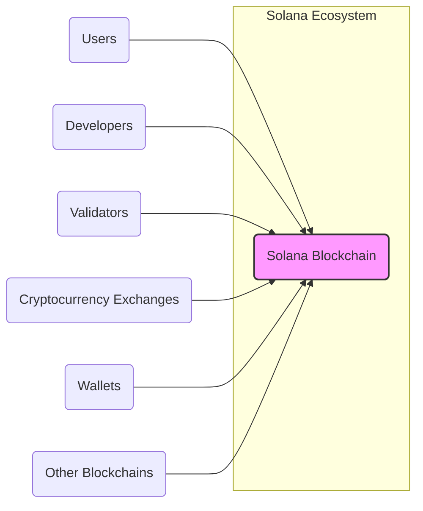
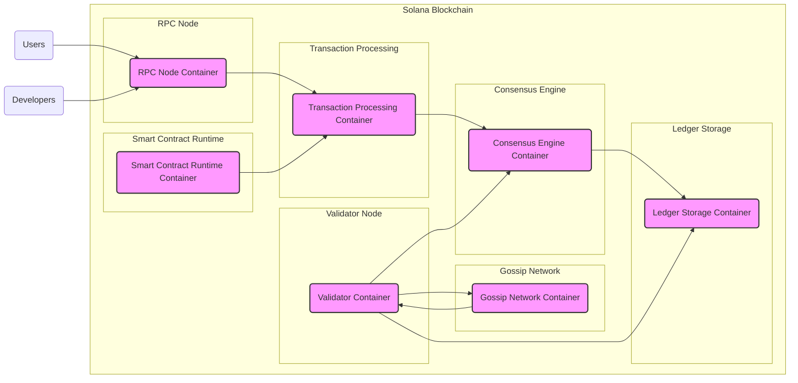
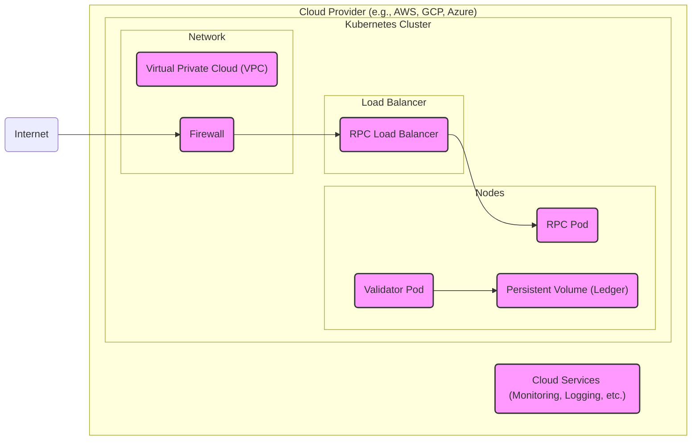

# BUSINESS POSTURE

The Solana project aims to create a high-performance, permissionless blockchain platform. The primary business goal is to provide a scalable and fast infrastructure for decentralized applications (dApps) and cryptocurrencies, addressing the limitations of existing blockchain platforms in terms of transaction speed and cost. Solana targets developers and users who require high throughput and low latency for blockchain applications, such as decentralized finance (DeFi), non-fungible tokens (NFTs), and other high-transaction volume use cases.

Key business priorities include:
- Achieving high transaction throughput and low latency.
- Maintaining network stability and availability.
- Fostering a vibrant ecosystem of developers and applications.
- Ensuring the security and integrity of the blockchain.
- Promoting decentralization and censorship resistance.

Most important business risks that need to be addressed:
- Network congestion and performance degradation under high load.
- Security vulnerabilities in the Solana protocol or smart contracts leading to financial losses or data breaches.
- Centralization risks in validator operations or governance.
- Regulatory uncertainty and compliance challenges for blockchain platforms.
- Competition from other high-performance blockchain platforms.

# SECURITY POSTURE

Existing security controls:
- security control: Solana uses a Proof of History (PoH) consensus mechanism combined with Proof of Stake (PoS) to secure the blockchain. Described in Solana documentation and whitepaper.
- security control: Rust programming language is used for development, which inherently provides memory safety and reduces certain classes of vulnerabilities. Implemented in the codebase.
- security control: Code is publicly available on GitHub, allowing for community review and scrutiny. Implemented in GitHub repository.
- security control: Solana Foundation and community actively engage in bug bounty programs to incentivize vulnerability disclosure. Described in Solana documentation and community channels.

Accepted risks:
- accepted risk: Novelty of the Proof of History consensus mechanism introduces potential for unforeseen vulnerabilities.
- accepted risk: Reliance on third-party validators for network security introduces trust assumptions.
- accepted risk: Complexity of the Solana protocol increases the attack surface and potential for implementation errors.

Recommended security controls:
- security control: Implement regular, independent security audits of the Solana protocol and core codebase by reputable security firms.
- security control: Establish a formal Security Incident Response Plan (SIRP) to handle security incidents effectively.
- security control: Integrate automated security scanning tools (SAST, DAST, dependency scanning) into the development pipeline.
- security control: Implement rate limiting and DDoS protection mechanisms at the network level.
- security control: Provide secure coding guidelines and training for developers building on Solana.

Security requirements:
- Authentication:
  - Requirement: Nodes participating in the network (validators, RPC nodes) must be authenticated to prevent unauthorized access and participation.
  - Requirement: Users interacting with the blockchain (e.g., sending transactions) must be authenticated through cryptographic key pairs.
- Authorization:
  - Requirement: Transaction authorization must be enforced through digital signatures, ensuring that only authorized users can perform actions on the blockchain.
  - Requirement: Access control mechanisms should be in place to restrict access to sensitive data and functionalities within the Solana network and related infrastructure.
- Input validation:
  - Requirement: All inputs to the Solana protocol, including transactions and network messages, must be rigorously validated to prevent injection attacks and other input-related vulnerabilities.
  - Requirement: Smart contracts deployed on Solana must implement robust input validation to protect against vulnerabilities.
- Cryptography:
  - Requirement: Strong cryptographic algorithms and secure key management practices must be used for all cryptographic operations, including consensus, transaction signing, and data encryption where applicable.
  - Requirement: Cryptographic libraries should be regularly updated and vetted for known vulnerabilities.

# DESIGN

## C4 CONTEXT

Context Diagram Elements:

- Element:
  - Name: Solana Blockchain
  - Type: Software System
  - Description: The core Solana blockchain network, providing a platform for decentralized applications and cryptocurrency transactions.
  - Responsibilities: Processing transactions, maintaining the ledger, achieving consensus, executing smart contracts, providing network services.
  - Security controls: Consensus mechanism (PoH, PoS), cryptographic protocols, network security measures, access control for node operations.

- Element:
  - Name: Users
  - Type: Person
  - Description: Individuals or entities interacting with the Solana blockchain to send transactions, use dApps, or hold cryptocurrency.
  - Responsibilities: Initiating transactions, interacting with dApps, managing cryptocurrency holdings.
  - Security controls: Private key management, secure wallet practices, awareness of phishing and social engineering attacks.

- Element:
  - Name: Developers
  - Type: Person
  - Description: Software developers building decentralized applications (dApps) and tools on the Solana platform.
  - Responsibilities: Developing and deploying dApps, writing smart contracts, integrating with Solana APIs.
  - Security controls: Secure coding practices, vulnerability testing of dApps, secure key management for development tools.

- Element:
  - Name: Validators
  - Type: Software System
  - Description: Nodes in the Solana network responsible for validating transactions, participating in consensus, and maintaining the blockchain.
  - Responsibilities: Running validator nodes, participating in consensus, securing the network, maintaining network availability.
  - Security controls: Secure node infrastructure, key management for validator keys, DDoS protection, intrusion detection systems.

- Element:
  - Name: Cryptocurrency Exchanges
  - Type: External System
  - Description: Platforms for buying, selling, and trading Solana (SOL) and other cryptocurrencies.
  - Responsibilities: Listing and trading SOL, providing liquidity, facilitating cryptocurrency exchange.
  - Security controls: Exchange security measures (KYC/AML, wallet security, trading platform security), API security for Solana integration.

- Element:
  - Name: Wallets
  - Type: Software System
  - Description: Software applications or hardware devices used to store, manage, and interact with Solana cryptocurrency (SOL) and other Solana-based assets.
  - Responsibilities: Securely storing private keys, facilitating transaction signing, providing user interface for interacting with Solana.
  - Security controls: Wallet security features (encryption, multi-factor authentication), secure key generation and storage, vulnerability management.

- Element:
  - Name: Other Blockchains
  - Type: External System
  - Description: Other blockchain networks that may interact with Solana through bridges or interoperability solutions.
  - Responsibilities: Cross-chain communication, asset transfers, interoperability between blockchains.
  - Security controls: Secure bridge protocols, cross-chain validation mechanisms, monitoring for cross-chain vulnerabilities.

## C4 CONTAINER

Container Diagram Elements:

- Element:
  - Name: Validator Container
  - Type: Container
  - Description: Responsible for participating in the consensus process, validating transactions, and maintaining the blockchain ledger.
  - Responsibilities: Block production, transaction validation, voting in consensus, ledger replication, network participation.
  - Security controls: Secure key management for validator keys, secure boot process, network hardening, intrusion detection, monitoring.

- Element:
  - Name: RPC Node Container
  - Type: Container
  - Description: Provides an API endpoint for users and developers to interact with the Solana blockchain, query data, and submit transactions.
  - Responsibilities: Handling API requests, querying ledger data, submitting transactions, broadcasting network information.
  - Security controls: API authentication and authorization, rate limiting, input validation, DDoS protection, secure API gateway.

- Element:
  - Name: Ledger Storage Container
  - Type: Container
  - Description: Stores the Solana blockchain ledger data, including blocks, transactions, and account states.
  - Responsibilities: Persistent storage of blockchain data, efficient data retrieval, data integrity and consistency.
  - Security controls: Data encryption at rest, access control to storage volumes, data integrity checks, backups and disaster recovery.

- Element:
  - Name: Gossip Network Container
  - Type: Container
  - Description: Facilitates communication and data propagation between validator nodes in the Solana network.
  - Responsibilities: Broadcasting blocks and transactions, node discovery, network health monitoring.
  - Security controls: Network encryption, authentication of gossip messages, anti-spoofing measures, network segmentation.

- Element:
  - Name: Transaction Processing Container
  - Type: Container
  - Description: Handles the processing of incoming transactions, including signature verification, fee calculation, and state updates.
  - Responsibilities: Transaction validation, execution, state transition, transaction pool management.
  - Security controls: Input validation, signature verification, resource limits, anti-replay mechanisms, secure transaction processing logic.

- Element:
  - Name: Smart Contract Runtime Container
  - Type: Container
  - Description: Executes smart contracts deployed on the Solana blockchain, providing a secure and deterministic execution environment.
  - Responsibilities: Smart contract execution, resource management, security sandbox, interaction with blockchain state.
  - Security controls: Security sandbox for smart contract execution, gas metering, vulnerability scanning of smart contracts, secure runtime environment.

- Element:
  - Name: Consensus Engine Container
  - Type: Container
  - Description: Implements the Proof of History (PoH) and Proof of Stake (PoS) consensus mechanisms to achieve agreement on the state of the blockchain.
  - Responsibilities: Leader election, block ordering (PoH), block finalization (PoS), fault tolerance, network synchronization.
  - Security controls: Robust consensus algorithm, Byzantine fault tolerance, Sybil resistance, secure randomness generation, protection against consensus attacks.

## DEPLOYMENT

Deployment Architecture: Cloud-based Deployment on Kubernetes

Deployment Diagram Elements:

- Element:
  - Name: Kubernetes Cluster
  - Type: Infrastructure
  - Description: A Kubernetes cluster deployed in a cloud environment to orchestrate and manage Solana containers.
  - Responsibilities: Container orchestration, scaling, health monitoring, resource management.
  - Security controls: Kubernetes RBAC, network policies, container security context, security audits of Kubernetes configuration.

- Element:
  - Name: Validator Pod
  - Type: Deployment Unit
  - Description: A Kubernetes pod running the Validator Container, responsible for consensus and blockchain maintenance.
  - Responsibilities: Running validator process, participating in consensus, managing validator keys.
  - Security controls: Container image security scanning, least privilege container configuration, secure secrets management, resource limits.

- Element:
  - Name: RPC Pod
  - Type: Deployment Unit
  - Description: A Kubernetes pod running the RPC Node Container, providing API access to the Solana blockchain.
  - Responsibilities: Handling API requests, serving blockchain data, transaction submission.
  - Security controls: Container image security scanning, least privilege container configuration, API authentication and authorization, rate limiting.

- Element:
  - Name: Ledger Volume
  - Type: Infrastructure
  - Description: Persistent volume in Kubernetes used to store the Solana blockchain ledger data.
  - Responsibilities: Persistent storage of blockchain data, data availability and durability.
  - Security controls: Volume encryption, access control to volume, backups, data integrity checks.

- Element:
  - Name: RPC Load Balancer
  - Type: Infrastructure
  - Description: A load balancer distributing traffic to RPC Pods, providing high availability and scalability for API access.
  - Responsibilities: Load balancing API requests, health checks for RPC Pods, traffic routing.
  - Security controls: Load balancer security configuration, TLS termination, DDoS protection.

- Element:
  - Name: Virtual Private Cloud (VPC)
  - Type: Infrastructure
  - Description: A virtual network in the cloud environment isolating the Solana deployment.
  - Responsibilities: Network isolation, security boundary, network routing.
  - Security controls: Network segmentation, access control lists (ACLs), security groups.

- Element:
  - Name: Firewall
  - Type: Infrastructure
  - Description: A firewall protecting the VPC and Kubernetes cluster from external threats.
  - Responsibilities: Network traffic filtering, intrusion prevention, security monitoring.
  - Security controls: Firewall rules, intrusion detection and prevention system (IDPS), security logging.

- Element:
  - Name: Cloud Services
  - Type: Infrastructure
  - Description: Cloud provider services used for monitoring, logging, and other operational aspects of the Solana deployment.
  - Responsibilities: Monitoring system health, collecting logs, alerting, infrastructure management.
  - Security controls: Cloud service security configurations, access control to cloud services, security logging and monitoring.

## BUILD

```mermaid
graph LR
    developer("Developer") --> code_commit("Code Commit (GitHub)")
    code_commit --> github_actions("GitHub Actions CI/CD")
    github_actions --> build_process("Build Process (Rust, Cargo)")
    build_process --> security_checks("Security Checks (SAST, Linters, Dependency Scan)")
    security_checks --> container_build("Container Image Build (Docker)")
    container_build --> artifact_registry("Artifact Registry (Container Registry)")

    style developer fill:#f9f,stroke:#333,stroke-width:2px
    style code_commit fill:#f9f,stroke:#333,stroke-width:2px
    style github_actions fill:#f9f,stroke:#333,stroke-width:2px
    style build_process fill:#f9f,stroke:#333,stroke-width:2px
    style security_checks fill:#f9f,stroke:#333,stroke-width:2px
    style container_build fill:#f9f,stroke:#333,stroke-width:2px
    style artifact_registry fill:#f9f,stroke:#333,stroke-width:2px
```

Build Process Description:

The Solana project likely utilizes a modern CI/CD pipeline for building and publishing software artifacts. The build process can be described as follows:

1. Developer commits code changes to the GitHub repository.
2. GitHub Actions CI/CD pipelines are triggered automatically upon code commits or pull requests.
3. The build process is initiated, which involves:
    - Compiling Rust code using Cargo build system.
    - Running unit and integration tests.
4. Security checks are performed as part of the build pipeline:
    - Static Application Security Testing (SAST) tools are used to scan the codebase for potential vulnerabilities.
    - Linters are used to enforce code quality and style guidelines, reducing potential for errors.
    - Dependency scanning tools are used to identify vulnerabilities in third-party dependencies.
5. If all checks pass, container images (e.g., Docker images for Validator and RPC nodes) are built.
6. Built container images and other artifacts are pushed to an artifact registry (e.g., a container registry like Docker Hub or a cloud provider's registry).

Build Process Security Controls:

- security control: Automated CI/CD pipeline (GitHub Actions) ensures consistent and repeatable builds.
- security control: Source code version control (Git/GitHub) provides traceability and integrity of code changes.
- security control: Static Application Security Testing (SAST) integrated into the build pipeline to identify code vulnerabilities early.
- security control: Dependency scanning to detect and manage vulnerabilities in third-party libraries.
- security control: Code linters to enforce code quality and reduce potential errors.
- security control: Container image scanning to identify vulnerabilities in base images and dependencies within containers.
- security control: Secure artifact registry with access control to protect build artifacts.
- security control: Code signing and artifact signing to ensure integrity and authenticity of build artifacts.

# RISK ASSESSMENT

Critical business processes we are trying to protect:
- Consensus and block production: Ensuring the network continues to operate and process transactions.
- Transaction processing: Guaranteeing that user transactions are processed correctly and securely.
- Network availability: Maintaining network uptime and accessibility for users and applications.
- Smart contract execution: Ensuring secure and reliable execution of decentralized applications.
- Ledger integrity: Protecting the integrity and immutability of the blockchain ledger.

Data we are trying to protect and their sensitivity:
- Private keys of validators and users: Highly sensitive, loss or compromise leads to loss of funds and control.
- Transaction data: Sensitive, contains financial information and user activity.
- Account balances and ledger state: Sensitive, reflects the financial state of the network.
- Network configuration and operational data: Sensitive, can be used to disrupt or attack the network.
- Smart contract code and data: Potentially sensitive, may contain business logic and user data.

Data sensitivity levels:
- Private keys: Critical
- Transaction data: Confidential
- Account balances and ledger state: Confidential, Integrity critical
- Network configuration and operational data: Confidential, Integrity critical
- Smart contract code and data: Confidential, Integrity critical

# QUESTIONS & ASSUMPTIONS

BUSINESS POSTURE:
- Question: What are the specific target industries or use cases that Solana is prioritizing for adoption?
- Question: What are the key performance indicators (KPIs) for measuring the success of the Solana project?
- Assumption: Solana's primary business goal is to become a leading platform for high-performance decentralized applications.

SECURITY POSTURE:
- Question: What security audits have been conducted on the Solana protocol and codebase, and what were the findings?
- Question: Is there a public Security Incident Response Plan (SIRP) available for Solana?
- Assumption: Solana Foundation and community are committed to addressing security vulnerabilities and maintaining a secure platform.

DESIGN:
- Question: What specific consensus mechanism (variants of PoH and PoS) are implemented in Solana, and what are their security properties?
- Question: What smart contract languages are officially supported on Solana, and what security considerations are specific to those languages?
- Question: What is the planned roadmap for future development and security enhancements of the Solana platform?
- Assumption: The design of Solana prioritizes scalability and performance while maintaining a reasonable level of security and decentralization.