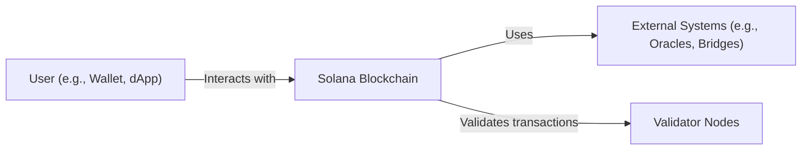
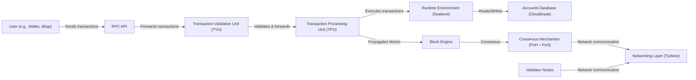
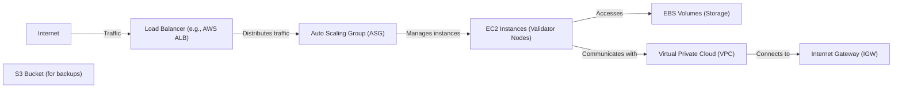
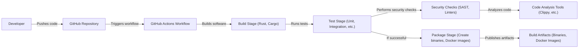

Okay, let's create a design document for the Solana project, focusing on aspects relevant for threat modeling.

# BUSINESS POSTURE

Solana is a high-performance blockchain designed to support scalable, decentralized applications (dApps) and marketplaces.  Its primary business goals are:

*   Provide a fast and low-cost platform for developers to build and deploy dApps.
*   Achieve global scalability to support a large number of transactions and users.
*   Maintain a high level of security and decentralization to ensure the integrity of the network and user assets.
*   Foster a vibrant ecosystem of developers, validators, and users.
*   Become a leading blockchain platform for DeFi, NFTs, and other Web3 applications.

Business priorities:

*   Network uptime and stability.
*   Transaction throughput and latency.
*   Security of user funds and data.
*   Developer adoption and ecosystem growth.
*   Resistance to censorship and attacks.

Most important business risks:

*   Critical vulnerabilities in the core blockchain code leading to network halts, loss of funds, or data breaches.
*   Concentration of validator power, leading to potential censorship or manipulation of the network.
*   Scalability bottlenecks that limit the growth and adoption of the platform.
*   Competition from other high-performance blockchains.
*   Regulatory uncertainty and potential legal challenges.
*   Lack of adoption by developers and users.

# SECURITY POSTURE

Existing security controls (based on reviewing the repository and general knowledge of blockchain security):

*   security control: Cryptographic signatures for transaction authorization and account management. (Implemented in core Solana codebase, transaction processing logic).
*   security control: Proof-of-History (PoH) as a verifiable delay function to provide a global, synchronized clock. (Implemented in core consensus mechanism).
*   security control: Proof-of-Stake (PoS) consensus mechanism with slashing for malicious validator behavior. (Implemented in core consensus mechanism).
*   security control: Gulf Stream, a mempool-less transaction forwarding protocol. (Implemented in transaction processing).
*   security control: Sealevel, a parallel smart contracts runtime. (Implemented in runtime environment).
*   security control: Pipeline VM for transaction processing optimization. (Implemented in runtime environment).
*   security control: Cloudbreak, a horizontally scalable accounts database. (Implemented in data storage layer).
*   security control: Turbine, a block propagation protocol. (Implemented in networking layer).
*   security control: Regular security audits and bug bounty programs. (Mentioned in documentation and community resources).
*   security control: Use of Rust, a memory-safe programming language, for core development. (Evident in codebase).
*   security control: Formal verification of critical components (mentioned in some documentation, extent unclear).

Accepted risks:

*   accepted risk: Complexity of the codebase increases the risk of undiscovered vulnerabilities.
*   accepted risk: Reliance on a relatively new consensus mechanism (PoH + PoS) introduces potential risks.
*   accepted risk: Rapid development and innovation may introduce new security challenges.
*   accepted risk: Potential for 51% attacks, although mitigated by PoS and slashing.
*   accepted risk: Dependence on the security of underlying hardware and infrastructure.
*   accepted risk: Potential for smart contract vulnerabilities in dApps built on Solana.

Recommended security controls:

*   Implement a comprehensive fuzzing framework for continuous testing of various components.
*   Enhance formal verification efforts, particularly for consensus-critical code.
*   Develop a robust incident response plan to address potential security breaches.
*   Strengthen supply chain security for dependencies and build processes.
*   Provide more detailed security documentation and guidelines for developers building on Solana.

Security Requirements:

*   Authentication:
    *   All transactions must be cryptographically signed by the authorized account holder.
    *   Validators must authenticate themselves using cryptographic keys.
    *   Multi-factor authentication should be supported for user accounts (where applicable, e.g., wallets).

*   Authorization:
    *   Access control mechanisms must be in place to restrict access to sensitive data and functions.
    *   Smart contracts should implement appropriate authorization checks to prevent unauthorized access.
    *   Validators should have limited privileges based on their stake.

*   Input Validation:
    *   All inputs to the system (transactions, smart contract calls, etc.) must be rigorously validated to prevent malformed data or malicious payloads.
    *   Input validation should be performed at multiple layers (network, runtime, smart contract).

*   Cryptography:
    *   Use strong, well-vetted cryptographic algorithms for all security-critical operations (signatures, encryption, hashing).
    *   Key management practices must be secure and follow industry best practices.
    *   Regularly review and update cryptographic libraries to address any discovered vulnerabilities.

# DESIGN

## C4 CONTEXT

Context Diagram Element Descriptions:

*   Element:
    *   Name: User (e.g., Wallet, dApp)
    *   Type: Person
    *   Description: Represents an end-user interacting with the Solana blockchain, either directly through a wallet or indirectly via a decentralized application.
    *   Responsibilities:
        *   Initiate transactions.
        *   Manage accounts and keys.
        *   Interact with smart contracts.
    *   Security controls:
        *   Cryptographic signatures for transaction authorization.
        *   Secure key storage and management (responsibility of the wallet/dApp).
        *   (Potentially) Multi-factor authentication.

*   Element:
    *   Name: Solana Blockchain
    *   Type: Software System
    *   Description: The core Solana blockchain platform, providing a distributed ledger and smart contract execution environment.
    *   Responsibilities:
        *   Process transactions.
        *   Maintain consensus.
        *   Execute smart contracts.
        *   Store data.
    *   Security controls:
        *   Proof-of-History (PoH).
        *   Proof-of-Stake (PoS).
        *   Gulf Stream.
        *   Sealevel.
        *   Pipeline VM.
        *   Cloudbreak.
        *   Turbine.

*   Element:
    *   Name: External Systems (e.g., Oracles, Bridges)
    *   Type: Software System
    *   Description: External systems that interact with the Solana blockchain, such as oracles providing real-world data or bridges connecting to other blockchains.
    *   Responsibilities:
        *   Provide data feeds to smart contracts.
        *   Facilitate cross-chain communication.
    *   Security controls:
        *   Depend on the specific external system.
        *   Should be carefully vetted and audited.

*   Element:
    *   Name: Validator Nodes
    *   Type: Software System
    *   Description: Nodes in the network that participate in consensus and validate transactions.
    *   Responsibilities:
        *   Validate transactions.
        *   Produce blocks.
        *   Maintain the integrity of the blockchain.
    *   Security controls:
        *   Proof-of-Stake (PoS) with slashing.
        *   Secure communication protocols.
        *   Regular security audits.

## C4 CONTAINER

Container Diagram Element Descriptions:

*   Element:
    *   Name: User (e.g., Wallet, dApp)
    *   Type: Person
    *   Description: Same as in the Context Diagram.
    *   Responsibilities: Same as in the Context Diagram.
    *   Security controls: Same as in the Context Diagram.

*   Element:
    *   Name: RPC API
    *   Type: Container (API)
    *   Description: Provides an interface for users and applications to interact with the Solana blockchain.
    *   Responsibilities:
        *   Receive and validate incoming requests.
        *   Forward transactions to the TVU.
        *   Provide data querying capabilities.
    *   Security controls:
        *   Input validation.
        *   Rate limiting.
        *   Authentication (if applicable).

*   Element:
    *   Name: Transaction Validation Unit (TVU)
    *   Type: Container (Software Component)
    *   Description: Validates transactions before they are processed.
    *   Responsibilities:
        *   Verify signatures.
        *   Check account balances.
        *   Prevent double-spending.
    *   Security controls:
        *   Cryptographic signature verification.
        *   Input validation.

*   Element:
    *   Name: Transaction Processing Unit (TPU)
    *   Type: Container (Software Component)
    *   Description: Processes validated transactions and executes smart contracts.
    *   Responsibilities:
        *   Execute smart contract code.
        *   Update account states.
        *   Forward transactions to the block engine.
    *   Security controls:
        *   Sandboxing of smart contract execution.
        *   Resource limits.

*   Element:
    *   Name: Runtime Environment (Sealevel)
    *   Type: Container (Runtime)
    *   Description: The parallel smart contracts runtime environment.
    *   Responsibilities:
        *   Execute smart contracts in parallel.
        *   Manage account states.
    *   Security controls:
        *   Parallel execution with conflict detection.
        *   Memory safety (Rust).

*   Element:
    *   Name: Accounts Database (Cloudbreak)
    *   Type: Container (Database)
    *   Description: Horizontally scalable database for storing account data.
    *   Responsibilities:
        *   Store account balances, program data, and other state information.
        *   Provide fast access to account data.
    *   Security controls:
        *   Data encryption (if applicable).
        *   Access control.

*   Element:
    *   Name: Block Engine
    *   Type: Container (Software Component)
    *   Description: Assembles validated transactions into blocks.
    *   Responsibilities:
        *   Order transactions.
        *   Create block headers.
        *   Propagate blocks to the network.
    *   Security controls:
        *   Timestamping (PoH).

*   Element:
    *   Name: Consensus Mechanism (PoH + PoS)
    *   Type: Container (Software Component)
    *   Description: The core consensus mechanism that ensures agreement on the state of the blockchain.
    *   Responsibilities:
        *   Validate blocks.
        *   Reach consensus on the next block.
        *   Handle forks.
    *   Security controls:
        *   Proof-of-History (PoH).
        *   Proof-of-Stake (PoS) with slashing.

*   Element:
    *   Name: Networking Layer (Turbine)
    *   Type: Container (Network Protocol)
    *   Description: Handles communication between nodes in the network.
    *   Responsibilities:
        *   Propagate blocks and transactions.
        *   Maintain connections with other nodes.
    *   Security controls:
        *   Secure communication protocols (e.g., TLS).
        *   DoS protection.

*   Element:
    *   Name: Validator Nodes
    *   Type: Software System
    *   Description: Same as in the Context Diagram.
    *   Responsibilities: Same as in the Context Diagram.
    *   Security controls: Same as in the Context Diagram.

## DEPLOYMENT

Solana validators can be deployed in various configurations, ranging from individual setups to large-scale deployments across multiple data centers.  Here are some possible deployment solutions:

1.  **Single Validator Node:** A single machine running the Solana validator software.  Suitable for testing or small-scale participation.
2.  **Multi-Validator Setup:** Multiple validator nodes running on separate machines, potentially in different locations.  Increases resilience and decentralization.
3.  **Cloud-Based Deployment:** Utilizing cloud providers (AWS, GCP, Azure, etc.) to deploy validator nodes.  Offers scalability and ease of management.
4.  **Data Center Deployment:** Deploying validator nodes in dedicated data centers for maximum control and performance.
5.  **Hybrid Deployment:** Combining cloud-based and on-premise deployments for a balance of flexibility and control.

We will describe the **Cloud-Based Deployment** using AWS as an example:

Deployment Diagram Element Descriptions:

*   Element:
    *   Name: Internet
    *   Type: External Entity
    *   Description: The global network.
    *   Responsibilities:
        *   Route traffic to the Solana network.
    *   Security controls:
        *   Standard internet security protocols.

*   Element:
    *   Name: Load Balancer (e.g., AWS ALB)
    *   Type: Infrastructure Node (Load Balancer)
    *   Description: Distributes incoming traffic across multiple validator nodes.
    *   Responsibilities:
        *   Handle incoming connections.
        *   Distribute traffic based on load and health checks.
    *   Security controls:
        *   SSL/TLS termination.
        *   DDoS protection (e.g., AWS Shield).
        *   Web Application Firewall (WAF) integration.

*   Element:
    *   Name: Auto Scaling Group (ASG)
    *   Type: Infrastructure Node (Auto Scaling Group)
    *   Description: Manages the scaling of validator nodes based on demand.
    *   Responsibilities:
        *   Launch and terminate EC2 instances as needed.
        *   Maintain a desired number of running instances.
    *   Security controls:
        *   IAM roles and policies.
        *   Security groups.

*   Element:
    *   Name: EC2 Instances (Validator Nodes)
    *   Type: Infrastructure Node (Virtual Machine)
    *   Description: Virtual machines running the Solana validator software.
    *   Responsibilities:
        *   Run the Solana validator software.
        *   Participate in consensus.
        *   Process transactions.
    *   Security controls:
        *   Security groups.
        *   IAM roles and policies.
        *   Regular patching and updates.
        *   Intrusion detection systems (IDS).

*   Element:
    *   Name: EBS Volumes (Storage)
    *   Type: Infrastructure Node (Storage)
    *   Description: Persistent storage for validator data.
    *   Responsibilities:
        *   Store the Solana blockchain data.
    *   Security controls:
        *   Encryption at rest.
        *   Regular backups.

*   Element:
    *   Name: Virtual Private Cloud (VPC)
    *   Type: Infrastructure Node (Network)
    *   Description: A logically isolated section of the AWS cloud.
    *   Responsibilities:
        *   Provide a private network for the validator nodes.
    *   Security controls:
        *   Network Access Control Lists (NACLs).
        *   Security groups.
        *   VPC flow logs.

*   Element:
    *   Name: Internet Gateway (IGW)
    *   Type: Infrastructure Node (Gateway)
    *   Description: Enables communication between the VPC and the internet.
    *   Responsibilities:
        *   Route traffic between the VPC and the internet.
    *   Security controls:
        *   Security groups.

*   Element:
    *   Name: S3 Bucket (for backups)
    *   Type: Infrastructure Node (Storage)
    *   Description: Object storage for backups of validator data.
    *   Responsibilities:
        *   Store backups of validator data.
    *   Security controls:
        *   Encryption at rest.
        *   Access control policies.
        *   Versioning.

## BUILD

Solana's build process is primarily managed through GitHub Actions, as evidenced by the `.github/workflows` directory in the repository. The build process involves multiple stages, including building, testing, and packaging the software.

Build Process Security Controls:

*   security control: Use of Rust and Cargo for building the software, providing memory safety and dependency management.
*   security control: Automated build process using GitHub Actions, ensuring consistency and reproducibility.
*   security control: Unit and integration tests to verify the correctness of the code.
*   security control: Security checks, including static analysis (SAST) using tools like Clippy, to identify potential vulnerabilities.
*   security control: Dependency analysis to identify and manage vulnerable dependencies.
*   security control: Code signing (potentially, not explicitly mentioned in the repository).
*   security control: Containerization (Docker) for packaging and deployment, providing isolation and consistency.

# RISK ASSESSMENT

Critical Business Processes:

*   Transaction processing: Ensuring that transactions are processed quickly, reliably, and securely.
*   Consensus: Maintaining agreement on the state of the blockchain among validator nodes.
*   Smart contract execution: Providing a secure and reliable environment for executing smart contracts.
*   Data storage: Storing blockchain data securely and reliably.
*   Network communication: Ensuring secure and efficient communication between nodes.

Data to Protect and Sensitivity:

*   Account balances: Highly sensitive, representing the value held by users.
*   Transaction data: Sensitive, revealing information about user activity and potentially private data.
*   Smart contract code: Sensitive, as vulnerabilities can lead to loss of funds or data breaches.
*   Private keys: Extremely sensitive, providing control over accounts and funds. (Managed by users/wallets, not directly by the Solana blockchain itself).
*   Validator keys: Extremely sensitive, as compromise can lead to network disruption or manipulation.
*   Network metadata: Moderately sensitive, potentially revealing information about network topology and validator identities.

# QUESTIONS & ASSUMPTIONS

Questions:

*   What is the specific threat model used by the Solana Foundation for ongoing security assessments?
*   What are the detailed procedures for handling security incidents and vulnerabilities?
*   What are the specific criteria for selecting and onboarding validators?
*   What is the extent of formal verification applied to the codebase?
*   What are the plans for addressing potential long-term scalability challenges?
*   What specific measures are in place to prevent and mitigate DDoS attacks?
*   What is the process for auditing and approving external systems (oracles, bridges) that interact with the Solana blockchain?
*   How is the supply chain security of dependencies managed and monitored?

Assumptions:

*   BUSINESS POSTURE: The Solana Foundation prioritizes security and is committed to addressing vulnerabilities promptly.
*   BUSINESS POSTURE: The Solana community actively participates in security discussions and bug reporting.
*   SECURITY POSTURE: Regular security audits are conducted by reputable third-party firms.
*   SECURITY POSTURE: The development team follows secure coding practices.
*   DESIGN: The core components of Solana are designed with security in mind.
*   DESIGN: The deployment infrastructure for validators is secured according to industry best practices.
*   DESIGN: The build process includes automated security checks.
*   DESIGN: Validators are responsible for securing their own infrastructure.