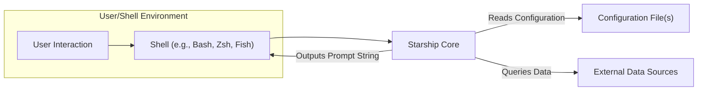
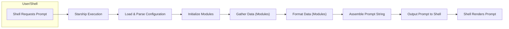

# Project Design Document: Starship Cross-Shell Prompt

**Version:** 1.1
**Date:** October 26, 2023
**Author:** Gemini (AI Language Model)

## 1. Introduction

This document provides an enhanced architectural design of the Starship cross-shell prompt, building upon the previous version. It offers a more detailed explanation of the key components, data flow, and interactions within the system, specifically tailored for effective threat modeling. This document aims to provide a robust foundation for identifying and analyzing potential security vulnerabilities.

## 2. Goals and Non-Goals

**Goals:**

*   Provide a clear and comprehensive overview of Starship's architecture, with a focus on security-relevant aspects.
*   Identify key components and their specific responsibilities and interactions.
*   Describe the data flow within the application, highlighting potential points of interest for security analysis.
*   Outline external dependencies and interactions, including the nature of the data exchanged.
*   Serve as a robust basis for identifying potential security threats, vulnerabilities, and attack vectors.

**Non-Goals:**

*   Provide a detailed, line-by-line code-level implementation guide.
*   Document every single possible configuration option exhaustively.
*   Include performance benchmarks, optimization strategies, or resource utilization metrics.
*   Detail the internal implementation of individual modules beyond their core function and interfaces.

## 3. Architectural Overview

Starship is a highly customizable, cross-shell prompt written in Rust. Its primary function is to dynamically generate and display an informative and aesthetically pleasing command prompt by gathering data from the environment and formatting it according to user-defined configurations.

### 3.1. High-Level Architecture Diagram

### 3.2. Key Components

*   **Starship Core:** The central orchestrator of the application, responsible for the overall prompt generation process. Its key responsibilities include:
    *   **Configuration Management:** Parsing and validating configuration files, merging default and user-defined settings.
    *   **Module Management:**  Loading, initializing, and managing the lifecycle of individual modules based on the active configuration.
    *   **Data Orchestration:**  Coordinating the data gathering process by invoking relevant modules.
    *   **Prompt Formatting and Rendering:**  Assembling the output from individual modules into the final prompt string according to the configured format. This involves string manipulation and potentially terminal control sequences for styling.
    *   **Shell Interface:** Interacting with the specific shell to retrieve environment information and set the prompt string. This involves shell-specific logic and potentially executing shell commands.
    *   **Error Handling:** Managing errors during configuration loading, module execution, and data retrieval.
*   **Modules:** Independent, self-contained units of functionality dedicated to gathering and formatting specific pieces of information for the prompt. Each module typically focuses on a single domain or data source. Examples include:
    *   `directory`: Determines and formats the current working directory path.
    *   `git_branch`: Queries the local Git repository to determine the current branch, commit status, and other relevant information. This often involves executing `git` commands.
    *   `nodejs`:  Checks for the presence of Node.js and retrieves the active version, potentially by executing `node -v`.
    *   `python`: Detects the active Python environment and displays the version, potentially by executing `python --version` or similar commands.
    *   `time`: Retrieves and formats the current system time.
    *   `line_break`:  Introduces a line break in the prompt.
    *   `status`: Displays the exit code of the previous command.
    *   **Custom Modules:** User-defined modules that execute arbitrary commands and format their output. These represent a significant area for potential security concerns.
*   **Configuration File(s):** YAML-based files (`starship.toml`) that dictate the prompt's appearance and behavior. They define:
    *   **Module Selection and Ordering:** Specifies which modules are active and the order in which their output is displayed.
    *   **Module-Specific Configuration:**  Provides settings for individual modules, such as:
        *   Enabling or disabling the module.
        *   Customizing the displayed symbol or icon.
        *   Defining the output format string, including placeholders for module-specific data.
        *   Setting styles (colors, font attributes) using terminal escape codes.
        *   Defining conditions (`when` clauses) for when a module should be displayed.
        *   For custom modules, specifying the command to execute and how to interpret its output.
    *   **Global Settings:**  Configuration options that apply to the entire prompt, such as the default prompt format.
*   **Shell Integration:**  The part of Starship responsible for interacting with the specific shell in use. This involves:
    *   **Environment Variable Access:** Retrieving environment variables that might be used by modules or for conditional logic.
    *   **Prompt String Setting:**  Constructing and sending the final prompt string to the shell. This often involves shell-specific syntax and escape sequences.
    *   **Handling Shell-Specific Behaviors:**  Addressing any nuances or requirements of the particular shell.
*   **External Data Sources:** External tools, systems, and data sources that Starship modules interact with to gather information. These represent potential trust boundaries and points of interaction with the external environment:
    *   **Version Control Systems (e.g., Git, Mercurial):** Accessed through command-line interfaces.
    *   **Programming Language Runtimes (e.g., Python, Node.js, Go):**  Interacted with via command execution to retrieve version information or environment details.
    *   **Operating System Utilities:** Used to gather system information (e.g., time, hostname).
    *   **File System:** Accessed to check for the presence of specific files or directories (e.g., `.git` directory).

### 3.3. Data Flow

The process of generating and displaying the prompt follows these steps:

1. **Shell Prompt Request:** The shell determines it needs to display a new prompt to the user.
2. **Starship Invocation:** The shell executes the Starship binary.
3. **Configuration Loading and Parsing:** Starship Core loads configuration data from:
    *   Built-in default configuration.
    *   User-specific configuration file(s), typically located at `~/.config/starship.toml`.
    *   Environment variables that might override configuration settings.
4. **Module Initialization:** Based on the parsed configuration, Starship Core initializes the configured modules. This might involve setting up internal state or preparing for data gathering.
5. **Data Gathering (Module Execution):** For each active module, Starship Core triggers the data gathering process. This involves:
    *   Accessing environment variables.
    *   Performing file system checks.
    *   Executing external commands (for relevant modules like `git_branch`, `nodejs`, and custom modules).
6. **Data Formatting:** Each module formats the gathered data according to its specific configuration and the overall prompt format. This involves string manipulation and potentially adding styling using terminal escape codes.
7. **Prompt String Assembly:** Starship Core assembles the formatted output from all active modules into a single prompt string, respecting the configured order and separators.
8. **Prompt Output to Shell:** Starship Core outputs the generated prompt string to the shell's standard output.
9. **Shell Rendering:** The shell receives the prompt string and renders it in the terminal for the user.

## 4. Configuration

Starship's extensive customization is driven by its configuration system.

*   **Configuration File Location and Hierarchy:**
    *   Default configuration embedded within the Starship binary.
    *   User-specific configuration file: Typically located at `~/.config/starship.toml`.
    *   Configuration is merged, with user-specific settings overriding defaults.
*   **Configuration Format:** Uses the TOML (Tom's Obvious, Minimal Language) format, known for its readability.
*   **Key Configuration Sections and Options:**
    *   **`format` (String):** Defines the overall structure of the prompt, including the order of modules and separators. Uses placeholders like `$all` to include all enabled modules.
    *   **`palette` (Table):** Allows defining custom color palettes for styling the prompt.
    *   **`[character]` (Table):** Configures the appearance of the prompt character (e.g., `❯`).
    *   **`[package]` (Table):**  Settings related to package managers.
    *   **`[module.<module_name>]` (Table):**  Sections for configuring individual modules. Common options include:
        *   `disabled` (Boolean): Enables or disables the module.
        *   `format` (String): Specifies the output format of the module, often using placeholders for module-specific data.
        *   `symbol` (String): Sets the symbol displayed by the module.
        *   `style` (String): Customizes the styling (colors, attributes) of the module's output using terminal escape sequences or predefined color names.
        *   `prefix` and `suffix` (String):  Text added before and after the module's output.
        *   `command` (String): For custom modules, defines the command to execute. This is a critical security consideration.
        *   `when` (String or Array of Strings): Conditional logic (using shell syntax) to determine when a module should be displayed. This can involve checking environment variables or the output of commands.
*   **Custom Modules:** Users can define their own modules by specifying a `command` to execute. The output of this command can then be incorporated into the prompt using the module's `format` setting. This feature offers great flexibility but introduces significant security risks if not used carefully.

## 5. Security Considerations

This section details potential security considerations based on Starship's architecture, serving as a starting point for a more in-depth threat model.

*   **Configuration File Vulnerabilities:**
    *   **Malicious Configuration Injection:** If a user's configuration file is compromised (e.g., through social engineering, account takeover, or insecure synchronization), an attacker could inject malicious configurations. This is particularly concerning for custom modules, where arbitrary commands can be specified.
    *   **Command Injection via Custom Modules:**  A compromised configuration file could define a custom module that executes arbitrary and potentially harmful commands. The `command` field in a custom module is a direct execution point.
    *   **Information Disclosure via Configuration:** While less direct, a compromised configuration could be crafted to display sensitive information present in environment variables or the output of commands.
*   **External Command Execution Vulnerabilities:**
    *   **Command Injection in Custom Modules:**  If user input or environment variables are incorporated into the `command` of a custom module without proper sanitization, it could lead to command injection vulnerabilities.
    *   **Unintended Command Execution:** Even with built-in modules, if the logic for determining when to execute external commands is flawed, it could lead to unintended execution of system commands.
*   **Dependency Management and Supply Chain Security:**
    *   **Vulnerable Dependencies:** Starship relies on external Rust crates. Vulnerabilities in these dependencies could be exploited.
    *   **Dependency Confusion Attacks:**  The risk of malicious dependencies being introduced through dependency management mechanisms.
*   **Information Disclosure in the Prompt:**
    *   **Accidental Exposure of Secrets:**  Carelessly configured modules or custom modules could inadvertently display sensitive information like API keys, passwords, or internal paths in the prompt.
    *   **Information Leaks via Module Output:**  Modules might inadvertently expose sensitive information gathered from external commands or the environment.
*   **Shell Integration Issues:**
    *   **Prompt Injection:**  While less likely in Starship's context, vulnerabilities in how the prompt string is constructed and sent to the shell could potentially be exploited in certain scenarios.
    *   **Escape Sequence Vulnerabilities:**  Improper handling of terminal escape sequences could potentially lead to unexpected behavior or even security issues in the terminal.
*   **Trust Boundaries:**
    *   **User Configuration:**  Starship inherently trusts the user's configuration file. This is a primary trust boundary.
    *   **External Commands:**  Modules that execute external commands rely on the integrity and security of those external tools. This represents another significant trust boundary.
    *   **Shell Environment:** Starship operates within the context of the user's shell environment and trusts the information provided by it (e.g., environment variables).

## 6. Future Considerations

*   **Sandboxing or Isolation of Module Execution:** Exploring mechanisms to isolate the execution of modules, particularly custom modules, to limit the impact of potential vulnerabilities. This could involve using techniques like process isolation or restricted execution environments.
*   **Input Sanitization and Validation:** Implementing robust input sanitization and validation for user-provided configuration, especially for custom module commands and `when` clauses.
*   **Security Audits and Penetration Testing:**  Regular security audits and penetration testing to identify potential vulnerabilities in the codebase and configuration logic.
*   **Fine-grained Permissions for Modules:**  Potentially introducing a permission system to restrict the capabilities of modules, limiting their access to system resources or the ability to execute arbitrary commands.
*   **Secure Defaults and Best Practices:**  Providing secure default configurations and promoting best practices for configuring Starship to minimize security risks.
*   **Content Security Policy (CSP) for Prompt Output:** Investigating the feasibility of implementing a form of CSP for the prompt output to mitigate potential risks associated with terminal escape sequences.

This enhanced design document provides a more detailed and security-focused overview of Starship's architecture. The identified components, data flow, interactions, and trust boundaries are crucial for conducting a thorough threat model and developing effective security mitigations.
