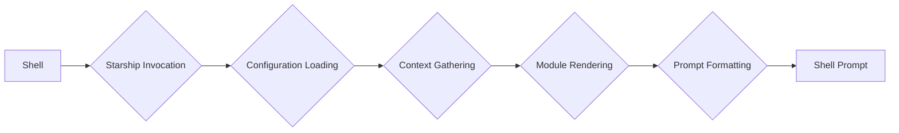
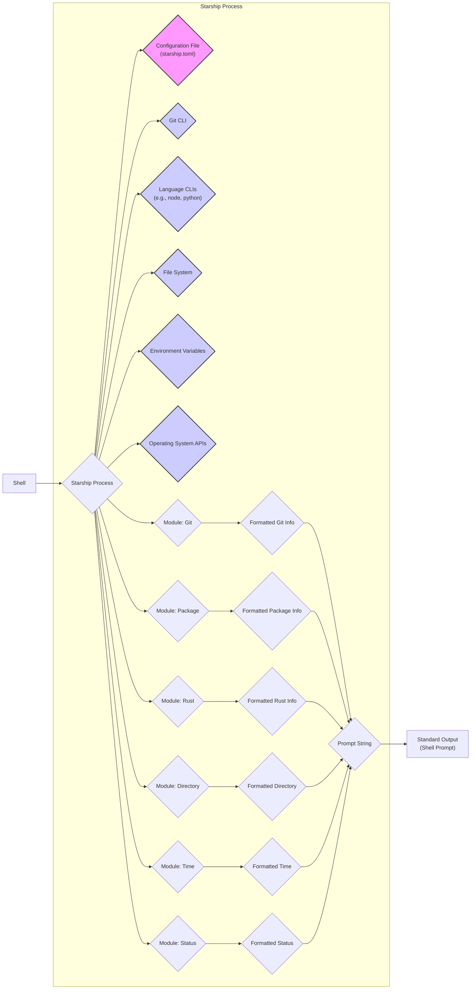

# Project Design Document: Starship - The Cross-Shell Prompt

**Version:** 1.1
**Date:** October 26, 2023
**Author:** AI Software Architect

## 1. Introduction

This document provides an enhanced design specification for the Starship project, a highly customizable, cross-shell prompt written in Rust. Building upon the initial design, this version offers more granular detail and clarifies certain aspects of the system. The primary objective remains to furnish a comprehensive architectural understanding of Starship, serving as a robust foundation for subsequent threat modeling exercises. This document meticulously describes the system's components, data flow, interactions, and key functionalities.

## 2. Project Overview

Starship is a shell prompt engineered for exceptional speed and extensive user customization. Its core function is to dynamically present pertinent information within the terminal prompt, encompassing details such as the current Git branch and status, programming language versioning, container context (e.g., Docker), and overall system status. A key design principle is cross-shell compatibility, ensuring seamless operation across widely used shells including Bash, Zsh, Fish, PowerShell, and others.

## 3. Goals

*   Deliver a shell prompt that exhibits high performance and minimal latency.
*   Empower users with a rich set of customization options to tailor the prompt to their specific needs and preferences.
*   Maintain broad compatibility across a diverse range of shell environments and operating systems (Linux, macOS, Windows).
*   Facilitate easy extension of functionality through a well-defined module system.
*   Ensure the secure and reliable operation of the prompt, minimizing potential vulnerabilities.
*   Provide clear and comprehensive documentation for users and developers.

## 4. Non-Goals

*   To replace the underlying shell interpreter.
*   To provide general-purpose shell scripting capabilities beyond prompt generation.
*   To implement complex shell functionalities unrelated to prompt display and information presentation.
*   To act as a general-purpose system monitoring tool.

## 5. High-Level Architecture

At a high level, Starship functions as a command-line utility that is invoked by the shell whenever a new prompt needs to be displayed. Upon invocation, it proceeds to load its configuration, gather relevant contextual information, render the configured modules, format the final prompt string, and output it to the shell.

## 6. Detailed Design

### 6.1. Starship Invocation

*   The active shell (e.g., Bash, Zsh, Fish) executes the `starship` command as part of its prompt generation process. This is typically configured within the shell's initialization scripts (e.g., `.bashrc`, `.zshrc`, `config.fish`).
*   The shell may pass specific arguments or set environment variables that provide Starship with initial context, although Starship primarily relies on its own internal context gathering mechanisms.
*   The invocation is generally synchronous, meaning the shell waits for Starship to complete and output the prompt before proceeding.

### 6.2. Configuration Loading

*   Starship loads its configuration from a TOML (Tom's Obvious, Minimal Language) file named `starship.toml`.
*   Configuration files are searched for in the following order of precedence:
    *   A local `.starship.toml` file in the current directory (useful for project-specific prompts).
    *   The global configuration file located at `$XDG_CONFIG_HOME/starship.toml` or `~/.config/starship.toml` on Unix-like systems.
    *   The configuration file located in the user's configuration directory on Windows.
*   The configuration file dictates the overall structure of the prompt, the order in which modules are displayed, and specific settings for individual modules.
*   Starship utilizes a robust TOML parsing library (likely a Rust crate like `toml`) to parse the configuration file into an internal data structure.
*   Error handling is implemented to gracefully manage invalid or malformed configuration files, often falling back to default settings or providing informative error messages.

### 6.3. Context Gathering

*   Starship dynamically gathers information relevant to the prompt based on the current shell environment and user configuration.
*   This process involves querying various aspects of the system and interacting with external tools.
*   Examples of context gathering activities include:
    *   **Git Repository Status:** Executing `git status` and other `git` commands to determine the current branch, commit status, and any uncommitted changes.
    *   **Programming Language Versions:**  Looking for version files (e.g., `.node-version`, `.python-version`) or executing language-specific command-line interfaces (CLIs) like `node -v`, `python --version`, `rustc --version`.
    *   **System Information:** Retrieving details such as battery level (on supported systems), current time, hostname, and username.
    *   **Environment Context:** Checking for the presence of specific files or directories (e.g., indicating a particular project type).
    *   **Container Context:** Detecting if the user is within a Docker container, Kubernetes environment, etc.
    *   **Shell Status:**  Retrieving the exit code of the previously executed command.
    *   **Operating System:** Identifying the current operating system to tailor certain module behaviors.
*   Context gathering is performed by individual modules or by shared utility functions within Starship.

### 6.4. Module Rendering

*   Starship's architecture is highly modular, with each module responsible for generating and displaying a specific piece of information within the prompt.
*   Modules are implemented as independent units of code within the Starship codebase, promoting maintainability and extensibility.
*   The order and visual appearance of modules are determined by the `[prompt]` section of the `starship.toml` configuration file.
*   Each module typically performs the following steps:
    *   **Context Acquisition:**  Retrieves the specific context information it needs to display (often leveraging the context gathering mechanisms).
    *   **Formatting:**  Formats the acquired information into a string according to its own logic and the user's configuration settings for that module. This includes applying colors, icons, and styling.
    *   **Output Generation:**  Returns the formatted string to the core Starship engine.
*   Examples of core modules include:
    *   `git_branch`: Displays the current Git branch name and status.
    *   `package`: Shows the version of the current project's package manager (e.g., npm, cargo).
    *   `rust`: Displays the active Rust toolchain version.
    *   `directory`: Presents the current working directory path.
    *   `time`: Shows the current time.
    *   `status`: Indicates the exit code of the previous command, often using different colors for success and failure.
    *   `hostname`: Displays the system's hostname.
    *   `python`: Shows the active Python version.

### 6.5. Prompt Formatting

*   Once all enabled modules have rendered their output, Starship assembles the final prompt string.
*   This involves concatenating the output of individual modules in the order specified in the configuration.
*   The `[format]` section in `starship.toml` allows for global customization of the prompt's appearance, including:
    *   Defining the separator between modules.
    *   Adding a persistent prefix and suffix to the entire prompt.
    *   Controlling the overall styling and colors.
*   Starship utilizes string manipulation and formatting capabilities provided by the Rust standard library and potentially external crates for advanced styling.
*   The final formatted prompt string is written to the standard output, which is then picked up and displayed by the shell.

### 6.6. Caching

*   To optimize performance and reduce the overhead of repeatedly querying external tools, Starship implements caching mechanisms.
*   Caching can be applied at different levels:
    *   **Module-Level Caching:** Individual modules may cache the results of expensive operations (e.g., querying Git status) for a short period.
    *   **Global Caching:** Starship might maintain a global cache for frequently accessed information.
*   Cache invalidation strategies are crucial to ensure that the displayed information remains accurate and up-to-date. This might involve time-based expiration or event-driven invalidation (e.g., when a file system change is detected).
*   The caching implementation aims to balance performance gains with the need for timely updates to the prompt information.

## 7. Data Flow Diagram

## 8. Key Components

*   **Core Engine:** The central component responsible for orchestrating the prompt generation process, including configuration loading, module management, and prompt formatting.
*   **Configuration Manager:** Handles the loading, parsing, validation, and access to the `starship.toml` configuration file. It provides an API for other components to retrieve configuration settings.
*   **Module Trait/Interface:** Defines the common structure and behavior that all prompt modules must adhere to. This includes methods for context acquisition, formatting, and any necessary initialization or cleanup.
*   **Module Implementations:** Concrete implementations of individual prompt modules (e.g., `GitModule`, `PackageModule`, `RustModule`). Each module encapsulates the logic for displaying a specific piece of information.
*   **Context Gatherers/Providers:** Functions or services responsible for retrieving information from external sources (e.g., Git repositories, language CLIs, the file system, operating system APIs). These may be shared across multiple modules.
*   **Formatter:**  Takes the formatted output from individual modules and combines them into the final prompt string, applying global formatting rules, separators, and styling.
*   **Caching Subsystem:**  Manages the caching of external data to improve performance. This includes mechanisms for storing, retrieving, and invalidating cached data.
*   **Error Handling:**  A consistent mechanism for handling errors that occur during configuration loading, context gathering, or module rendering. This includes logging errors and providing informative messages to the user.

## 9. Configuration

*   The primary configuration mechanism for Starship is the `starship.toml` file, which uses the TOML data serialization format.
*   Users can customize various aspects of the prompt through this file, including:
    *   **Module Ordering:** The `[prompt]` section defines the order in which modules are displayed in the prompt.
    *   **Module Formatting:** Each module typically has its own section in the configuration file (e.g., `[git_branch]`, `[package]`) allowing users to customize its appearance (colors, icons, prefixes, suffixes, symbols).
    *   **Global Settings:** The `[format]` section allows for customization of the overall prompt appearance, such as separators, persistent prefixes/suffixes, and style.
    *   **Conditional Display:** Modules can often be configured to only display under certain conditions (e.g., only show the Git branch if inside a Git repository).
    *   **Custom Commands:** Some modules allow the execution of custom commands to gather specific information.

## 10. Extensibility

*   Starship is designed with extensibility in mind, allowing users and developers to add new functionality through custom modules.
*   While the core team maintains a set of standard modules, the architecture supports the development and integration of external modules.
*   Custom modules would need to adhere to the defined module trait/interface, ensuring compatibility with the core engine.
*   Configuration allows users to enable and configure these custom modules, potentially by specifying their location or entry point.
*   Mechanisms for distributing and managing custom modules (e.g., through package managers or community repositories) could be considered.

## 11. Security Considerations (Preliminary)

This section outlines preliminary security considerations that will be further analyzed and refined during the dedicated threat modeling process.

*   **Configuration Loading Vulnerabilities:**
    *   **Path Traversal:**  If Starship blindly loads configuration files from user-specified paths, an attacker could potentially craft a malicious configuration file located outside the intended directories, leading to unintended behavior or information disclosure. Strict path validation and sanitization are necessary.
    *   **TOML Parsing Exploits:**  Vulnerabilities in the TOML parsing library could be exploited by providing a specially crafted configuration file. Keeping dependencies up-to-date and using well-vetted libraries is crucial.
*   **External Command Execution Risks:**
    *   **Command Injection:**  Care must be taken when constructing command-line arguments for external processes based on user configuration or environment variables. Improper sanitization could allow an attacker to inject malicious commands.
    *   **Dependency on External Tools:** Starship's security is inherently tied to the security of the external tools it invokes (e.g., `git`, language CLIs). Vulnerabilities in these tools could indirectly impact Starship users.
    *   **Privilege Escalation:** If Starship is run with elevated privileges (which is generally not recommended), vulnerabilities in external commands could be exploited to gain further access.
*   **Custom Module Security:**
    *   **Malicious Code Execution:** Allowing arbitrary custom modules introduces a significant risk of malicious code execution within the Starship process. Sandboxing or code signing mechanisms might be necessary to mitigate this.
    *   **Data Exfiltration:** Malicious custom modules could potentially access and exfiltrate sensitive information from the user's environment.
*   **Information Disclosure:**
    *   **Sensitive Data in Prompt:** The prompt itself might inadvertently display sensitive information (e.g., API keys, internal paths) if modules are not carefully designed.
    *   **Terminal Emulation Vulnerabilities:**  Exploits in terminal emulators could potentially allow attackers to intercept or manipulate the displayed prompt.
*   **Denial of Service (DoS):**
    *   **Resource Exhaustion:**  Modules that perform computationally expensive operations or make excessive calls to external services could lead to performance degradation or a denial of service.
    *   **Configuration-Based DoS:**  A maliciously crafted configuration file could force Starship to perform an excessive number of operations, leading to a DoS.
*   **Dependency Management Security:**
    *   **Vulnerable Dependencies:**  Using outdated or vulnerable Rust crates could introduce security flaws into Starship. Regular dependency audits and updates are essential.
    *   **Supply Chain Attacks:**  Compromised dependencies could be used to inject malicious code into Starship.

This enhanced design document provides a more detailed and nuanced understanding of the Starship project's architecture. It serves as a more robust foundation for identifying and analyzing potential security threats during the subsequent threat modeling phase.
