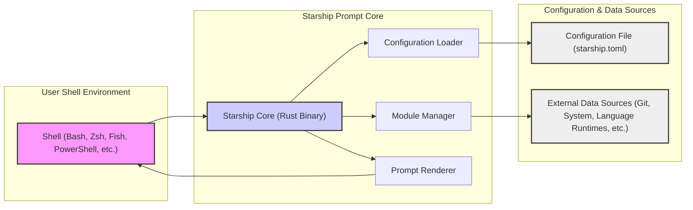
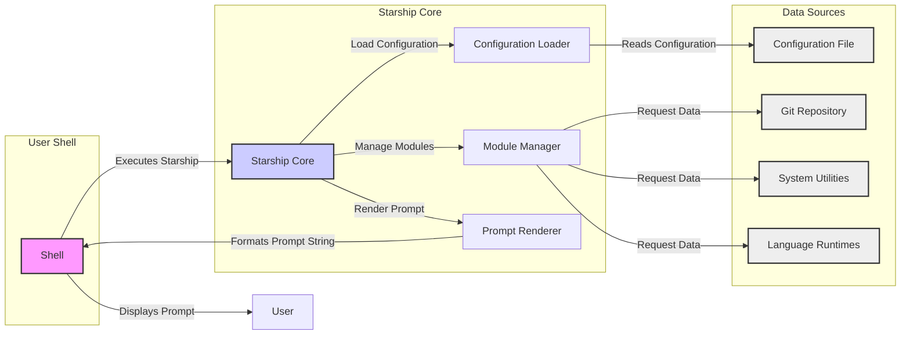

# Project Design Document: Starship Cross-Shell Prompt

**Project Name:** Starship

**Project Repository:** [https://github.com/starship/starship](https://github.com/starship/starship)

**Document Version:** 1.1

**Date:** 2023-10-27

**Author:** AI Expert (Based on request)

**Changes from Version 1.0:**
*   Expanded Security Considerations section with more detail.
*   Improved clarity and wording in several sections.
*   Minor formatting adjustments.

## 1. Project Overview

### 1.1. Project Goal

Starship is a highly customizable, cross-shell prompt written in Rust. Its primary goal is to provide a fast, feature-rich, and aesthetically pleasing command-line prompt that works consistently across various shells (like Bash, Zsh, Fish, PowerShell, etc.). Starship aims to enhance the user's command-line experience by displaying relevant, context-aware information directly in the prompt, such as:

*   Current working directory
*   Git repository status (branch, changes, etc.)
*   Programming language and tool versions (e.g., Node.js, Python, Go)
*   System information (OS, hostname)
*   Status of background jobs
*   Customizable segments and modules for diverse information display

### 1.2. Target Audience

The target audience for Starship is primarily software developers, system administrators, DevOps engineers, and general power users who spend significant time in the command-line interface and seek a more informative, efficient, and visually appealing prompt experience.

### 1.3. Key Features

*   **Cross-Shell Compatibility:** Designed to function seamlessly across a wide range of shells, ensuring a consistent experience regardless of the user's shell preference.
*   **Highly Customizable:** Offers extensive customization options through a TOML configuration file, allowing users to tailor the prompt's appearance, modules, and behavior to their exact needs.
*   **Performance-Focused:** Written in Rust, leveraging its performance and efficiency to ensure minimal overhead and a fast prompt rendering experience.
*   **Modular Architecture:** Employs a modular design, with a rich ecosystem of modules that can be enabled or disabled to display specific types of information.
*   **Extensibility:** Provides mechanisms for users and developers to create custom modules, extending Starship's functionality beyond the built-in modules.
*   **Theming Support:** Includes support for themes, enabling users to quickly switch between different visual styles for their prompt.
*   **Asynchronous Operations:** Utilizes asynchronous rendering and data fetching to prevent blocking the shell and maintain responsiveness, even when modules need to access external resources.

## 2. Architecture Overview

### 2.1. High-Level Architecture Diagram

### 2.2. Architecture Description

The architecture of Starship is structured around three primary layers:

*   **User Shell Environment:** This layer represents the user's interactive command-line environment, encompassing shells like Bash, Zsh, Fish, and PowerShell. Starship is designed to integrate seamlessly with these shells to replace or augment the default prompt.
*   **Starship Prompt Core:** This is the central processing unit of Starship, implemented as a compiled Rust binary. It orchestrates the entire prompt generation process, encompassing:
    *   **Configuration Loading:**  Responsible for reading and interpreting the `starship.toml` configuration file, which dictates prompt behavior and appearance.
    *   **Module Management:** Handles the loading, initialization, and execution of various modules that gather and format specific pieces of information for the prompt.
    *   **Prompt Rendering:** Assembles the final prompt string by combining the outputs from modules according to the configured format and styling, and then delivers it to the shell.
*   **Configuration & Data Sources:** This layer encompasses the external resources that Starship relies on:
    *   **Configuration File (`starship.toml`):** A user-editable TOML file that defines all aspects of the prompt's customization, including module selection, formatting, and themes.
    *   **External Data Sources:** A diverse set of external systems and tools that Starship modules interact with to retrieve dynamic information. These include Git repositories, operating system utilities, language runtime environments, package managers, and potentially network resources.

## 3. Component Description

### 3.1. Shell (Bash, Zsh, Fish, PowerShell, etc.)

*   **Description:** The command-line shell application used by the user to interact with the operating system. Starship acts as a prompt replacement for these shells.
*   **Functionality:**
    *   Interprets and executes user commands entered at the command line.
    *   Manages the command prompt display, traditionally showing user, hostname, and current directory.
    *   Provides mechanisms for customizing the prompt, which Starship leverages.
*   **Interaction with Starship:** The shell is configured to execute the Starship binary just before displaying the prompt. Starship generates the formatted prompt string and outputs it to the shell's standard output. The shell then takes this output and displays it as the command prompt.

### 3.2. Starship Core (Rust Binary)

*   **Description:** The core executable of Starship, written in Rust for performance and reliability. It is the central component responsible for generating the prompt.
*   **Functionality:**
    *   **Initialization:** Starts execution when invoked by the shell, typically at the beginning of each command prompt cycle.
    *   **Configuration Loading:** Reads and parses the `starship.toml` configuration file to determine the user's desired prompt settings, including enabled modules, format strings, and theme.
    *   **Module Management:** Manages the lifecycle of modules. This includes:
        *   Loading and initializing modules based on the configuration.
        *   Orchestrating the execution of modules to gather data.
        *   Handling module dependencies and potential errors during module execution.
    *   **Data Aggregation:** Collects the data returned by each enabled module.
    *   **Prompt Rendering:** Takes the aggregated data from modules, applies formatting and styling rules defined in the configuration and theme, and constructs the final prompt string.
    *   **Output:** Writes the rendered prompt string to the standard output, which is then captured and displayed by the shell.
*   **Sub-components:**
    *   **Configuration Loader:**  Specifically designed to read, parse, and validate the `starship.toml` configuration file. It handles TOML syntax parsing, schema validation against expected configuration options, and error reporting for invalid configurations.
    *   **Module Manager:**  Responsible for the dynamic loading and management of Starship modules. It determines which modules to load based on the configuration, initializes each module, and provides a mechanism for modules to interact with external data sources and return data to the core.
    *   **Prompt Renderer:**  The component that takes the structured data from modules and the configuration settings to generate the final, formatted prompt string. It handles string manipulation, styling using ANSI escape codes for colors and formatting, and applies theming rules to create the visual prompt output.

### 3.3. Configuration File (`starship.toml`)

*   **Description:** A TOML-formatted configuration file that stores all user-specific settings for Starship. It is typically located in a user's configuration directory (e.g., `~/.config/starship.toml` or `~/.starship.toml`).
*   **Functionality:**
    *   **Persistent Configuration Storage:** Provides a persistent storage mechanism for user preferences, allowing customization to be retained across shell sessions.
    *   **Prompt Structure Definition:** Defines the overall structure of the prompt, including the order and format of different segments and modules.
    *   **Module Configuration:** Allows users to configure individual modules, specifying options and settings specific to each module's behavior.
    *   **Theme Selection and Customization:** Enables users to select and customize themes, controlling the visual appearance of the prompt, including colors, icons, and styles.
*   **Data Stored:** Configuration data is stored in TOML format, encompassing:
    *   Global prompt settings.
    *   Definitions of prompt segments and their order.
    *   Module-specific configurations (e.g., Git module settings, language version display options).
    *   Theme definitions or theme selection.
    *   Custom formatting strings and style rules.

### 3.4. External Data Sources (Git, System, Language Runtimes, etc.)

*   **Description:** External systems, tools, and environments that Starship modules interact with to gather dynamic information for display in the prompt.
*   **Examples:**
    *   **Git Repositories:** For retrieving Git branch, commit status, working directory cleanliness, and other repository-related information.
    *   **Operating System Utilities:** Commands like `uname`, `date`, `hostname`, `whoami`, etc., to fetch system-level information such as OS type, date/time, hostname, and current user.
    *   **Language Runtime Environments:** Interpreters and tools for programming languages like Python, Node.js, Go, Rust, Ruby, etc., to determine installed versions and project-specific information.
    *   **Package Managers:** Tools like `npm`, `pip`, `cargo`, `gem`, etc., to check for project dependencies or package versions.
    *   **Environment Variables:** Access to environment variables set in the user's shell environment.
    *   **Network Resources (Less Common, but Possible):** In some cases, modules might interact with network resources, although this is less typical for core prompt functionality due to performance considerations.
*   **Functionality:**
    *   **Dynamic Data Provision:** Provide real-time, context-sensitive information to Starship modules, ensuring the prompt is always up-to-date.
    *   **External System Interaction:** Modules execute commands, access file system information, or interact with APIs of these external sources to retrieve the necessary data.
*   **Data Accessed:** The specific data accessed varies greatly depending on the module. Examples include:
    *   Git repository metadata (branch names, commit hashes, diff status).
    *   System information strings (OS name, kernel version).
    *   Language version numbers (Python version, Node.js version).
    *   Project dependency information (e.g., presence of `node_modules`, `venv`).
    *   Environment variable values.

## 4. Data Flow

### 4.1. Data Flow Diagram

### 4.2. Data Flow Description

The data flow within Starship follows these steps:

1.  **Shell Invokes Starship:** When the shell is ready to display a new command prompt (typically after a command has completed), it executes the Starship binary. This invocation is usually configured in the shell's initialization files (e.g., `.bashrc`, `.zshrc`).
2.  **Configuration Loading:** The Starship Core binary starts, and the Configuration Loader component immediately reads and parses the `starship.toml` configuration file. This file provides all the instructions for how the prompt should be generated, including which modules to use and how they should be formatted.
3.  **Module Management and Data Collection:** The Module Manager component takes over, initializing and managing the modules that are enabled in the configuration. For each enabled module:
    *   The Module Manager instructs the module to collect its specific data.
    *   Modules then interact with their designated external data sources to retrieve the required information. For example:
        *   The `git_status` module interacts with the Git command-line interface to get repository status.
        *   The `os` module executes system utilities to gather OS-related details.
        *   Language-specific modules might execute commands to query language runtime versions.
4.  **Prompt Rendering:** Once all enabled modules have collected their data, the Prompt Renderer component receives this data along with the configuration settings. It then performs the following actions:
    *   Formats the data from each module according to the configured format strings and styling rules.
    *   Assembles these formatted segments into a complete prompt string, respecting the order and structure defined in the configuration.
    *   Applies theming rules to add colors, icons, and other visual enhancements to the prompt string.
5.  **Prompt Output to Shell:** The Starship Core binary outputs the fully rendered prompt string to its standard output stream.
6.  **Shell Displays Prompt:** The shell receives the prompt string from Starship's standard output and displays it as the command prompt to the user, ready for the next command input.

## 5. Security Considerations (Detailed)

This section expands on the initial security considerations, providing more detail and potential attack vectors for threat modeling.

*   **Configuration File Security (`starship.toml`):**
    *   **Storage Location and Permissions:** The configuration file is typically stored in user-specific directories (`~/.config` or `~/.starship`).  Incorrect file permissions could allow unauthorized users to modify the configuration, potentially leading to:
        *   **Information Disclosure:**  Modifying the prompt to display sensitive information unintentionally.
        *   **Subtle Misdirection:**  Changing the prompt to mislead the user about their current environment or status.
    *   **TOML Parsing Vulnerabilities:** While TOML is generally considered safe, vulnerabilities in the TOML parsing library used by Starship could potentially be exploited if a maliciously crafted `starship.toml` file is processed. This is less likely but should be considered.
    *   **Configuration Injection (Less Likely in TOML):**  Although TOML is not designed for code execution, vulnerabilities in how configuration values are interpreted and used within Starship modules could theoretically lead to unexpected behavior if malicious data is injected via the configuration.

*   **Module Security:**
    *   **Module Code Execution Vulnerabilities:** While Starship's core and built-in modules are written in Rust (memory-safe language), vulnerabilities could still exist in the logic. If custom modules are allowed (through plugins or extensions in the future), the risk of malicious or poorly written code execution increases significantly.
    *   **External Command Injection:** Modules frequently execute external commands to gather data (e.g., `git`, `python --version`). If module logic does not properly sanitize inputs when constructing these external commands, it could be vulnerable to command injection attacks. A malicious actor could potentially craft a configuration or manipulate the environment to inject arbitrary commands that Starship would then execute.
    *   **Data Sensitivity and Leakage:** Modules may access sensitive data, such as Git repository information (commit history, branch names), environment variables, or potentially even file contents.  Improper handling of this data could lead to:
        *   **Accidental Logging or Display:** Sensitive information being unintentionally logged or displayed in the prompt itself.
        *   **Exposure through Error Messages:** Sensitive data being revealed in error messages if modules fail or encounter unexpected situations.
    *   **Module Dependencies (Supply Chain Risks):** If Starship modules rely on external libraries or dependencies (even within the Rust ecosystem), vulnerabilities in those dependencies could indirectly affect Starship's security.

*   **External Data Source Interaction:**
    *   **Compromised External Tools:** Starship relies on the integrity and security of external tools like `git`, language runtimes, and system utilities. If these external tools are compromised or replaced with malicious versions, Starship could be misled or tricked into displaying incorrect or malicious information. This is more of a system-level security concern but relevant to Starship's operational environment.
    *   **Denial of Service (DoS) through External Queries:** Modules that excessively or inefficiently query slow or unreliable external data sources could lead to performance degradation or DoS. If prompt generation becomes excessively slow due to module interactions, it could negatively impact the user experience.

*   **Update Mechanism Security:**
    *   **Binary Update Integrity:** The process for updating the Starship binary is critical. If updates are not delivered through secure channels and properly verified, there is a risk of:
        *   **Malicious Updates:** Attackers distributing compromised Starship binaries that could contain malware or backdoors.
        *   **Man-in-the-Middle Attacks:** During download of updates, attackers intercepting and replacing the legitimate binary with a malicious one.
    *   **Lack of Signature Verification:** If Starship updates are not cryptographically signed and verified by the update mechanism, it becomes easier for attackers to distribute malicious updates. Secure update mechanisms should include signature verification to ensure authenticity and integrity.

## 6. Technology Stack

*   **Core Programming Language:** Rust (for performance, safety, and reliability)
*   **Configuration Language:** TOML (Tom's Obvious, Minimal Language) (for human-readable and easily parsable configuration)
*   **Build System and Package Manager:** Cargo (Rust's built-in build system and package manager)
*   **Shell Compatibility Layer:** Uses shell-specific logic and command invocation methods to ensure cross-shell compatibility.
*   **Version Control System:** Git (for project development, source code management, and potentially used by modules like `git_status`)
*   **Potentially External Libraries (Rust Crates):** Starship may depend on various Rust crates for functionalities like:
    *   TOML parsing.
    *   ANSI escape code handling for terminal styling.
    *   Asynchronous operations.
    *   Interacting with external commands and processes.

## 7. Deployment Model

*   **Installation Methods:** Users can install Starship through various methods:
    *   **Pre-built Binaries:** Downloading pre-compiled binaries from the official GitHub releases page. This is the most common and recommended method for ease of installation.
    *   **Package Managers:** Utilizing system package managers like `brew` (macOS), `apt` (Debian/Ubuntu), `scoop` (Windows), `pacman` (Arch Linux), etc., which provide automated installation and updates.
    *   **Compilation from Source:** Building Starship from source code using Rust and Cargo. This method is for advanced users or developers who want to customize or contribute to Starship.
*   **Configuration Process:** After installation, users customize Starship by:
    *   Creating or modifying the `starship.toml` configuration file.
    *   Placing this file in the appropriate configuration directory (e.g., `~/.config/starship.toml`).
    *   Restarting their shell or opening a new shell session to apply the configuration changes.
*   **Execution at Runtime:** Starship is executed by the shell every time a new command prompt is needed. This is achieved by:
    *   Modifying the shell's configuration files (e.g., `.bashrc`, `.zshrc`, `config.fish`).
    *   Setting the shell's prompt variable (e.g., `PS1` in Bash/Zsh, `prompt` in Fish) to execute the Starship binary.
    *   The shell then captures Starship's output and displays it as the prompt.
*   **Runtime Environment and Permissions:** Starship runs within the user's shell environment, inheriting the permissions of the user who is running the shell. It relies on the availability of system utilities and external tools that its modules need to interact with. Starship itself typically does not require elevated privileges.

This improved design document provides a more detailed and comprehensive overview of the Starship project, particularly in the security considerations section. It should serve as a robust foundation for conducting a thorough threat modeling exercise and developing appropriate security mitigations.