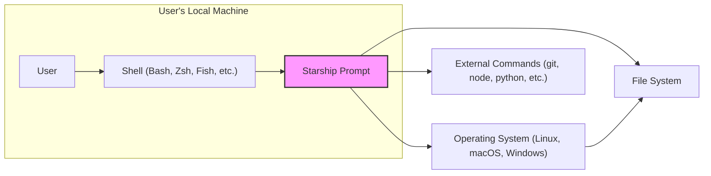
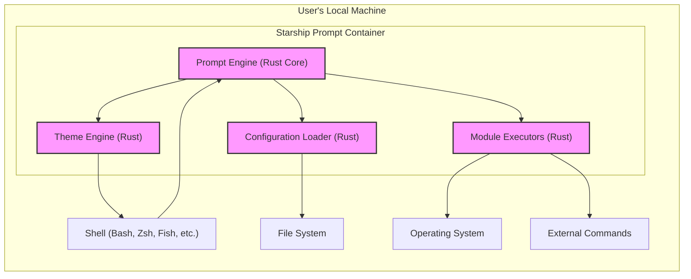
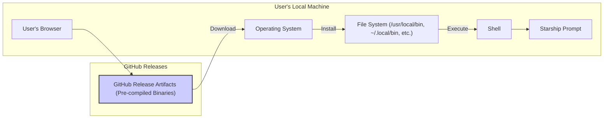

# BUSINESS POSTURE

- Business Priorities and Goals:
 - Goal: To provide a highly customizable and efficient command-line prompt that enhances user productivity and experience across different shells and operating systems.
 - Priority: User experience and customization are paramount. The project aims to be easy to install, configure, and extend. Cross-platform compatibility and performance are also key priorities.
 - Priority: Community growth and adoption. As an open-source project, widespread adoption and a vibrant community are crucial for its success and sustainability.

- Business Risks:
 - Risk:  Complexity in maintaining cross-shell and cross-platform compatibility. Changes in shell behaviors or operating systems could break functionality and require significant maintenance effort.
 - Risk: Security vulnerabilities in the prompt itself or its configuration. A compromised prompt could potentially lead to information disclosure or execution of malicious code in a user's shell environment.
 - Risk:  Dependence on community contributions. The project's progress and maintenance rely heavily on community contributions, which can be unpredictable.
 - Risk:  Competition from alternative prompt customization tools. The project needs to continuously innovate and adapt to stay relevant and attract users.

# SECURITY POSTURE

- Existing Security Controls:
 - security control: Code is publicly available on GitHub, allowing for community review and scrutiny. (Implemented: GitHub Repository)
 - security control:  Project uses GitHub Actions for CI/CD, which can include basic security checks like linters and formatters. (Implemented: GitHub Workflows - inferred from common open-source practices)
 - security control:  Reliance on Rust's memory safety features to reduce the risk of memory-related vulnerabilities. (Implemented: Language Choice - Rust)
 - accepted risk:  Vulnerability in dependencies. The project relies on external Rust crates, which could contain vulnerabilities. (Accepted Risk: Dependency Management)
 - accepted risk:  Configuration complexity.  Highly customizable nature can lead to users creating insecure configurations. (Accepted Risk: User Configuration)

- Recommended Security Controls:
 - security control: Implement automated security scanning (SAST/DAST) in the CI/CD pipeline to detect potential vulnerabilities in the code.
 - security control:  Regularly audit dependencies for known vulnerabilities and update them promptly. Use tools like `cargo audit`.
 - security control:  Provide secure configuration guidelines and examples to users to minimize the risk of insecure configurations.
 - security control:  Implement input validation and sanitization for user-provided configuration values to prevent injection attacks.

- Security Requirements:
 - Authentication: Not applicable. Starship is a client-side application and does not handle user authentication.
 - Authorization: Not applicable. Starship does not manage access control or authorization.
 - Input Validation:
  - Requirement: Validate user-provided configuration values (e.g., in `starship.toml`) to prevent injection attacks or unexpected behavior.
  - Requirement: Sanitize environment variables used by Starship to prevent command injection vulnerabilities.
 - Cryptography:
  - Requirement:  If Starship were to handle sensitive data in the future (currently it doesn't seem to), ensure proper encryption and secure storage mechanisms are implemented. (Currently not applicable, but good practice to consider for future development).

# DESIGN

## C4 CONTEXT

- Elements of Context Diagram:
 - - Name: User
   - Type: Person
   - Description: The end-user who interacts with the command-line interface.
   - Responsibilities:  Configures Starship prompt to their preferences, uses the shell for daily tasks.
   - Security controls:  Responsible for securing their local machine and shell environment.
 - - Name: Shell (Bash, Zsh, Fish, etc.)
   - Type: Software System
   - Description: The command-line interpreter used by the user (e.g., Bash, Zsh, Fish).
   - Responsibilities: Executes commands, interprets user input, interacts with the operating system.
   - Security controls: Shell security is managed by the operating system and shell maintainers. Users can configure shell security settings.
 - - Name: Starship Prompt
   - Type: Software System
   - Description: The cross-shell prompt application that enhances the shell's display with contextual information.
   - Responsibilities:  Generates and displays the command prompt, retrieves information from the operating system, file system, and external commands to display relevant context.
   - Security controls: Input validation of configuration, secure handling of environment variables, and reliance on Rust's memory safety.
 - - Name: Operating System (Linux, macOS, Windows)
   - Type: Software System
   - Description: The underlying operating system on which the shell and Starship are running.
   - Responsibilities: Provides system resources, manages processes, enforces security policies.
   - Security controls: Operating system level security controls (user permissions, access control lists, etc.).
 - - Name: File System
   - Type: Data Store
   - Description: The local file system where Starship configuration and user files are stored.
   - Responsibilities: Stores user data, configuration files, and executable files.
   - Security controls: File system permissions, access control mechanisms provided by the operating system.
 - - Name: External Commands (git, node, python, etc.)
   - Type: Software System
   - Description: External command-line tools that Starship interacts with to display contextual information (e.g., git for branch information, node for node version).
   - Responsibilities: Provide information to Starship about the current environment and project status.
   - Security controls: Security of external commands is managed by their respective maintainers and the operating system's execution environment.

## C4 CONTAINER

- Elements of Container Diagram:
 - - Name: Prompt Engine (Rust Core)
   - Type: Application Component
   - Description: The core logic of Starship, written in Rust, responsible for orchestrating prompt generation.
   - Responsibilities:  Manages configuration loading, module execution, theme application, and prompt output.
   - Security controls:  Rust's memory safety, input validation within modules, secure configuration handling.
 - - Name: Configuration Loader (Rust)
   - Type: Application Component
   - Description:  Component responsible for loading and parsing the `starship.toml` configuration file from the file system.
   - Responsibilities: Reads and parses the configuration file, validates configuration settings.
   - Security controls: Input validation of configuration file content, secure file access permissions.
 - - Name: Module Executors (Rust)
   - Type: Application Component
   - Description:  Component responsible for executing individual modules to gather contextual information (e.g., git status, language versions).
   - Responsibilities:  Interacts with the operating system and external commands to retrieve module-specific data.
   - Security controls:  Input sanitization when interacting with external commands, secure handling of environment variables, resource limits for module execution.
 - - Name: Theme Engine (Rust)
   - Type: Application Component
   - Description: Component responsible for applying themes to the prompt output, controlling the visual appearance.
   - Responsibilities:  Applies styling and formatting to the prompt based on the selected theme and configuration.
   - Security controls:  Theme definitions should not introduce security vulnerabilities (though this is less of a concern for prompt themes).

## DEPLOYMENT

- Deployment Architecture Options:
 - Option 1:  Pre-compiled binaries distributed via package managers (e.g., apt, brew, pacman).
 - Option 2:  Pre-compiled binaries distributed via GitHub Releases.
 - Option 3:  Building from source using `cargo install`.

- Selected Deployment Architecture: Option 2: Pre-compiled binaries distributed via GitHub Releases. This is a common and straightforward approach for open-source CLI tools.

- Elements of Deployment Diagram:
 - - Name: GitHub Release Artifacts (Pre-compiled Binaries)
   - Type: Distribution Package
   - Description:  Pre-compiled binary executables of Starship for different operating systems, hosted on GitHub Releases.
   - Responsibilities:  Provide a readily available and trusted source for downloading Starship binaries.
   - Security controls:  GitHub's infrastructure security, code signing of binaries (if implemented), HTTPS for download.
 - - Name: User's Browser
   - Type: Application
   - Description:  Web browser used by the user to access GitHub Releases and download the Starship binary.
   - Responsibilities:  Facilitates downloading the release artifact.
   - Security controls: Browser security features (HTTPS validation, sandboxing). User's responsibility to use a secure browser and network.
 - - Name: Operating System
   - Type: System Software
   - Description:  User's operating system where the binary is downloaded and installed.
   - Responsibilities:  Provides the environment for downloading, installing, and executing Starship.
   - Security controls: Operating system security controls, user permissions.
 - - Name: File System (/usr/local/bin, ~/.local/bin, etc.)
   - Type: Data Store
   - Description:  The file system location where the Starship binary is installed.
   - Responsibilities:  Stores the executable file.
   - Security controls: File system permissions to control access to the binary.
 - - Name: Shell
   - Type: Application
   - Description:  User's shell that executes the Starship binary.
   - Responsibilities:  Executes Starship when the prompt is displayed.
   - Security controls: Shell security features.
 - - Name: Starship Prompt
   - Type: Application
   - Description:  The installed Starship prompt application.
   - Responsibilities:  Provides the enhanced command prompt.
   - Security controls: Security controls implemented within the Starship application itself.

## BUILD

```mermaid
flowchart LR
    A["Developer"] --> B["Code Changes (Git)"]
    B --> C["GitHub Repository"]
    C --> D["GitHub Actions Workflow"]
    D --> E["Build Environment (Rust Toolchain)"]
    E --> F["Build Process (cargo build)"]
    F --> G["Security Checks (Linters, Formatters, cargo audit)"]
    G --> H["Test Suite (cargo test)"]
    H --> I["Build Artifacts (Binaries)"]
    I --> J["GitHub Releases"]

    style D fill:#ccf,stroke:#333,stroke-width:2px
    style E fill:#ccf,stroke:#333,stroke-width:2px
```

- Elements of Build Diagram:
 - - Name: Developer
   - Type: Person
   - Description:  Software developer contributing to the Starship project.
   - Responsibilities:  Writes code, commits changes, and pushes to the GitHub repository.
   - Security controls:  Developer's local development environment security, secure coding practices, code review process.
 - - Name: Code Changes (Git)
   - Type: Data
   - Description:  Code modifications tracked using Git version control.
   - Responsibilities:  Represent changes to the codebase.
   - Security controls:  Git's integrity checks, code review process to identify malicious changes.
 - - Name: GitHub Repository
   - Type: Code Repository
   - Description:  The central repository hosting the Starship source code on GitHub.
   - Responsibilities:  Stores and manages the codebase, tracks changes, facilitates collaboration.
   - Security controls:  GitHub's security features (access control, audit logs), branch protection rules.
 - - Name: GitHub Actions Workflow
   - Type: CI/CD System
   - Description:  Automated workflows defined in GitHub Actions to build, test, and release Starship.
   - Responsibilities:  Automates the build process, runs security checks, executes tests, and creates release artifacts.
   - Security controls:  GitHub Actions security features, secure workflow configuration, secrets management.
 - - Name: Build Environment (Rust Toolchain)
   - Type: Build Tooling
   - Description:  The environment where the code is compiled, including the Rust compiler, Cargo build system, and necessary dependencies.
   - Responsibilities:  Provides the tools and libraries required to build Starship.
   - Security controls:  Secure base images for build environments, dependency management, vulnerability scanning of build tools.
 - - Name: Build Process (cargo build)
   - Type: Build Process
   - Description:  The actual compilation and linking of the Rust code using `cargo build`.
   - Responsibilities:  Transforms source code into executable binaries.
   - Security controls:  Rust compiler's security features, build flags to enhance security (e.g., hardening).
 - - Name: Security Checks (Linters, Formatters, cargo audit)
   - Type: Security Tooling
   - Description:  Automated security checks performed during the build process, including linters, formatters, and dependency vulnerability scanning (`cargo audit`).
   - Responsibilities:  Identify potential code quality issues and security vulnerabilities.
   - Security controls:  Configuration of security tools, regular updates to tool versions and vulnerability databases.
 - - Name: Test Suite (cargo test)
   - Type: Testing Framework
   - Description:  Automated tests executed to verify the functionality and stability of Starship.
   - Responsibilities:  Ensures code quality and reduces the risk of regressions.
   - Security controls:  Well-designed test cases, security-focused testing (e.g., fuzzing, integration tests).
 - - Name: Build Artifacts (Binaries)
   - Type: Distribution Package
   - Description:  The compiled binary executables of Starship for different platforms.
   - Responsibilities:  Ready-to-use executables for distribution.
   - Security controls:  Integrity checks (checksums), code signing (if implemented), secure storage of artifacts.
 - - Name: GitHub Releases
   - Type: Release Management System
   - Description:  GitHub Releases used to distribute the build artifacts to users.
   - Responsibilities:  Provides a platform for distributing and managing releases.
   - Security controls:  GitHub's release management features, secure release process.

# RISK ASSESSMENT

- Critical Business Processes:
 - Process: Providing a functional and reliable command-line prompt to users. While not a direct business process in a traditional sense, for developers and system administrators, a functional prompt is crucial for their daily workflow and productivity.
 - Process: Maintaining the project's reputation and community trust.  Security vulnerabilities or instability could damage the project's reputation and lead to decreased adoption.

- Data Sensitivity:
 - Data: User configuration files (`starship.toml`). These files can contain user preferences and potentially sensitive information if users inadvertently include secrets or API keys (though this is not the intended use).
 - Sensitivity: Low to Medium. Configuration files are generally user-specific and not intended to contain highly sensitive data. However, misconfiguration could expose some user preferences or potentially accidentally included secrets.
 - Data: Environment variables accessed by Starship. These can contain sensitive information depending on the user's environment.
 - Sensitivity: Medium to High. Environment variables can contain API keys, passwords, and other sensitive credentials. Starship needs to handle environment variables securely to avoid accidental exposure or misuse.

# QUESTIONS & ASSUMPTIONS

- Questions:
 - Question: What is the intended user base for Starship? (Assumed: Developers, system administrators, and general command-line users).
 - Question: Are there any specific compliance requirements for Starship? (Assumed: No specific compliance requirements as it's an open-source CLI tool, but general security best practices are expected).
 - Question: Are there any plans to introduce features that handle more sensitive data in the future? (Assumed: Currently, Starship is primarily focused on prompt display and doesn't handle sensitive data directly, but future features might require more stringent security considerations).

- Assumptions:
 - Assumption: Business Posture: The primary goal is user experience and community growth for an open-source project.
 - Assumption: Security Posture:  Security is important, but the project operates with typical open-source security practices. Focus is on preventing common vulnerabilities and ensuring code quality.
 - Assumption: Design: The architecture is relatively simple, client-side application focused on prompt customization. Deployment is primarily through pre-compiled binaries. Build process uses standard CI/CD practices with some basic security checks.