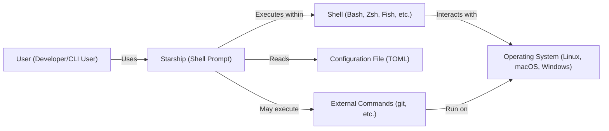
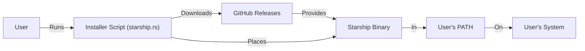
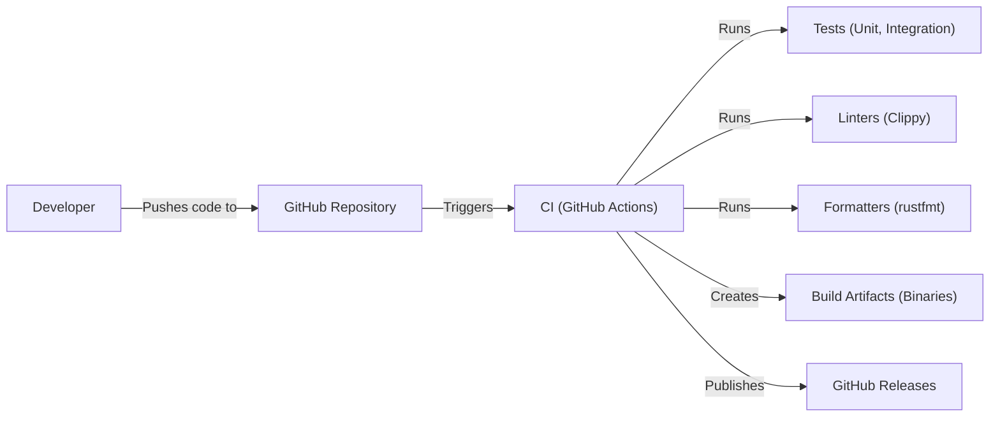

Okay, let's create a design document for the Starship project.

# BUSINESS POSTURE

Starship is a customizable prompt for any shell. The project's primary goal is to provide a fast, aesthetically pleasing, and highly configurable prompt experience for developers and command-line users. The business priorities are:

*   User Experience: Providing a seamless and enjoyable user experience is paramount. This includes speed, customization, and ease of use.
*   Community Engagement: Fostering a strong and active community around the project is crucial for its long-term success. This includes contributions, feedback, and support.
*   Maintainability: Ensuring the project remains maintainable and easy to contribute to is important for its longevity.
*   Cross-Shell Compatibility: Supporting a wide range of shells ensures broad adoption and usability.

Business risks that need to be addressed:

*   Performance Degradation: Any changes that significantly impact the prompt's rendering speed could negatively affect user experience.
*   Configuration Complexity: Overly complex configuration options could deter users and make the prompt difficult to set up.
*   Security Vulnerabilities: While primarily a client-side tool, vulnerabilities in configuration parsing or external command execution could pose security risks.
*   Breaking Changes: Introducing changes that break existing user configurations could lead to user frustration and abandonment.
*   Lack of Community Adoption: If the project fails to attract and retain users and contributors, its long-term viability is at risk.

# SECURITY POSTURE

Existing security controls:

*   security control: Code Reviews: All contributions go through a code review process on GitHub. (Described in GitHub pull request process).
*   security control: Community Scrutiny: Being an open-source project, the codebase is subject to scrutiny by the community. (Described in GitHub repository).
*   security control: Limited External Dependencies: The project strives to minimize external dependencies to reduce the attack surface. (Described in project's `Cargo.toml` file).
*   security control: Regular Updates: The project is actively maintained, and updates are released regularly, including security patches. (Described in GitHub releases).
*   security control: Sandboxing: Starship executes within the user's shell environment, inheriting its security context. It doesn't run with elevated privileges. (Implicit in shell execution model).

Accepted risks:

*   accepted risk: User-Defined Configuration: The prompt's behavior is heavily influenced by user-defined configuration, which could potentially introduce vulnerabilities if not handled carefully.
*   accepted risk: External Command Execution: The prompt can execute external commands based on user configuration, which poses a risk if those commands are compromised.
*   accepted risk: Shell-Specific Vulnerabilities: The security of the prompt is ultimately dependent on the security of the underlying shell.

Recommended security controls:

*   security control: Input Sanitization: Implement rigorous input sanitization for all user-configurable values, especially those used in external command execution.
*   security control: Static Analysis: Integrate static analysis tools (e.g., Clippy for Rust) into the build process to identify potential security vulnerabilities.
*   security control: Fuzz Testing: Implement fuzz testing to identify potential vulnerabilities in configuration parsing and command execution.
*   security control: Dependency Auditing: Regularly audit dependencies for known vulnerabilities and update them promptly.
*   security control: Security Policy: Create a `SECURITY.md` file in the repository to provide clear instructions for reporting security vulnerabilities.

Security Requirements:

*   Authentication: Not directly applicable, as Starship operates within the user's existing shell authentication context.
*   Authorization: Not directly applicable, as Starship inherits the user's shell permissions.
*   Input Validation: All user-configurable inputs, especially those used in external command execution, MUST be rigorously validated and sanitized to prevent injection attacks.
*   Cryptography: If any cryptographic operations are performed (e.g., for future features like credential management), industry-standard cryptographic libraries and practices MUST be used.
*   Configuration Security: The configuration file parsing logic MUST be secure and resistant to injection attacks.

# DESIGN

## C4 CONTEXT

Element Descriptions:

*   Element:
    *   Name: User
    *   Type: Person
    *   Description: A developer or command-line user who interacts with the shell.
    *   Responsibilities: Interacts with the shell, triggering the prompt to display.
    *   Security controls: Relies on OS and shell user authentication and authorization.

*   Element:
    *   Name: Starship
    *   Type: Software System
    *   Description: The customizable shell prompt.
    *   Responsibilities: Renders the prompt based on configuration and context.
    *   Security controls: Input sanitization, code reviews, community scrutiny, limited external dependencies.

*   Element:
    *   Name: Operating System
    *   Type: Software System
    *   Description: The underlying operating system (Linux, macOS, Windows).
    *   Responsibilities: Provides the environment for the shell and Starship to run.
    *   Security controls: OS-level security controls (user accounts, permissions, etc.).

*   Element:
    *   Name: Shell
    *   Type: Software System
    *   Description: The user's shell (Bash, Zsh, Fish, etc.).
    *   Responsibilities: Executes commands, manages the user's session, and hosts Starship.
    *   Security controls: Shell-specific security features and configurations.

*   Element:
    *   Name: Configuration File
    *   Type: File
    *   Description: A TOML file containing the user's Starship configuration.
    *   Responsibilities: Stores the user's preferences for the prompt's appearance and behavior.
    *   Security controls: File permissions, input validation during parsing.

*   Element:
    *   Name: External Commands
    *   Type: Software System
    *   Description: External commands (e.g., git) that Starship may execute based on configuration.
    *   Responsibilities: Provide information to Starship (e.g., Git status).
    *   Security controls: Rely on the security of the external commands themselves.

## C4 CONTAINER

```mermaid
graph LR
    User["User (Developer/CLI User)"]
    Starship["Starship (Shell Prompt)"]
    ConfigurationFile["Configuration File (TOML)"]
    Shell["Shell (Bash, Zsh, Fish, etc.)"]
    OperatingSystem["Operating System"]
    ExternalCommands["External Commands"]
    Parser["Configuration Parser"]
    Renderer["Prompt Renderer"]
    ModuleExecutor["Module Executor"]

    User -- Uses --> Starship
    Starship -- Reads --> ConfigurationFile
    Starship -- Executes within --> Shell
    Shell -- Interacts with --> OperatingSystem
    Starship -- May execute --> ExternalCommands
    ExternalCommands -- Run on --> OperatingSystem
    ConfigurationFile -- Parsed by --> Parser
    Parser -- Provides config to --> Renderer
    Renderer -- Uses --> ModuleExecutor
    ModuleExecutor -- Executes --> ExternalCommands

```

Element Descriptions:

*   Element:
    *   Name: User
    *   Type: Person
    *   Description: A developer or command-line user.
    *   Responsibilities: Interacts with the shell.
    *   Security controls: Relies on OS and shell user authentication and authorization.

*   Element:
    *   Name: Starship
    *   Type: Software System
    *   Description: The customizable shell prompt.
    *   Responsibilities: Renders the prompt.
    *   Security controls: Input sanitization, code reviews, community scrutiny.

*   Element:
    *   Name: Configuration File
    *   Type: File
    *   Description: TOML configuration file.
    *   Responsibilities: Stores user preferences.
    *   Security controls: File permissions, input validation.

*   Element:
    *   Name: Shell
    *   Type: Software System
    *   Description: The user's shell.
    *   Responsibilities: Executes commands, hosts Starship.
    *   Security controls: Shell-specific security.

*   Element:
    *   Name: Operating System
    *   Type: Software System
    *   Description: The underlying OS.
    *   Responsibilities: Provides the environment.
    *   Security controls: OS-level security.

*   Element:
    *   Name: External Commands
    *   Type: Software System
    *   Description: External commands executed by Starship.
    *   Responsibilities: Provide information.
    *   Security controls: Rely on the security of the commands.

*   Element:
    *   Name: Configuration Parser
    *   Type: Container (Component)
    *   Description: Parses the TOML configuration file.
    *   Responsibilities: Reads and validates the configuration.
    *   Security controls: Input validation, secure parsing library.

*   Element:
    *   Name: Prompt Renderer
    *   Type: Container (Component)
    *   Description: Renders the prompt based on the parsed configuration.
    *   Responsibilities: Generates the prompt string.
    *   Security controls: Output encoding (if applicable).

*   Element:
    *   Name: Module Executor
    *   Type: Container (Component)
    *   Description: Executes modules (e.g., Git, directory) based on configuration.
    *   Responsibilities: Executes external commands, gathers information.
    *   Security controls: Input sanitization, command whitelisting (if applicable).

## DEPLOYMENT

Possible deployment solutions:

1.  Manual Installation: Downloading the pre-built binary and placing it in a directory within the user's `PATH`.
2.  Package Managers: Installing Starship via package managers like `apt`, `brew`, `choco`, etc.
3.  Installation Script: Using the provided installation script (`sh -c "$(curl -fsSL https://starship.rs/install.sh)"`).
4.  Building from Source: Cloning the repository and building the binary using Cargo.

Chosen solution (for detailed description): Installation Script.

Element Descriptions:

*   Element:
    *   Name: User
    *   Type: Person
    *   Description: The user initiating the installation.
    *   Responsibilities: Runs the installation script.
    *   Security controls: User authentication and authorization on the system.

*   Element:
    *   Name: Installer Script
    *   Type: Script
    *   Description: The shell script downloaded from starship.rs.
    *   Responsibilities: Downloads the appropriate Starship binary, places it in a suitable location, and potentially updates shell configuration files.
    *   Security controls: HTTPS connection to starship.rs, script integrity checks (if implemented).

*   Element:
    *   Name: GitHub Releases
    *   Type: Server
    *   Description: The GitHub Releases page for the Starship project.
    *   Responsibilities: Hosts pre-built binaries for various platforms.
    *   Security controls: GitHub's infrastructure security.

*   Element:
    *   Name: User's System
    *   Type: Node
    *   Description: The user's computer.
    *   Responsibilities: The environment where Starship is installed.
    *   Security controls: Operating system security controls.

*   Element:
    *   Name: Starship Binary
    *   Type: File
    *   Description: The compiled Starship executable.
    *   Responsibilities: Executes the prompt logic.
    *   Security controls: Code signing (if implemented), file permissions.

*   Element:
    *   Name: User's PATH
    *   Type: Environment Variable
    *   Description: The environment variable that lists directories containing executable files.
    *   Responsibilities: Allows the shell to find the Starship binary.
    *   Security controls: Controlled by user and system permissions.

## BUILD

Build Process Description:

1.  Developers push code changes to the GitHub repository.
2.  GitHub Actions (the CI system) is triggered by push events and pull requests.
3.  The CI workflow performs the following steps:
    *   Checks out the code.
    *   Sets up the Rust toolchain.
    *   Runs unit and integration tests.
    *   Runs linters (Clippy) to check for code style and potential errors.
    *   Runs formatters (rustfmt) to ensure consistent code formatting.
    *   Builds the Starship binary for various target platforms.
    *   Creates release artifacts (binaries).
    *   Publishes the artifacts to GitHub Releases (on tagged commits).

Security Controls in Build Process:

*   security control: Automated Build: The build process is fully automated using GitHub Actions, ensuring consistency and reproducibility.
*   security control: CI/CD Pipeline: GitHub Actions provides a secure and controlled environment for building and testing the software.
*   security control: Static Analysis: Linters (Clippy) are used to perform static analysis and identify potential security vulnerabilities.
*   security control: Testing: Automated tests (unit and integration) help ensure the correctness and security of the code.
*   security control: Code Review: All code changes are reviewed before being merged into the main branch.
*   security control: Dependency Management: Cargo (Rust's package manager) manages dependencies, and regular audits should be performed.

# RISK ASSESSMENT

*   Critical Business Processes:
    *   Providing a fast and customizable prompt experience.
    *   Maintaining a healthy and active open-source project.

*   Data:
    *   Configuration Data (TOML file): Sensitivity is low, as it primarily contains user preferences for the prompt's appearance. However, vulnerabilities in parsing this data could lead to code execution.
    *   System Information (gathered by modules): Sensitivity varies depending on the modules used. Information like Git status is generally low sensitivity, but modules that access environment variables or other system data could have higher sensitivity.
    *   No user data is stored or transmitted by Starship itself. It operates entirely locally.

# QUESTIONS & ASSUMPTIONS

*   Questions:
    *   Are there any plans to introduce features that would require handling sensitive data (e.g., credentials)?
    *   What is the process for handling security vulnerabilities reported by the community?
    *   Are there any specific shell versions or operating system configurations that are known to be problematic?
    *   Is there a mechanism for users to report performance issues or bugs?
    *   What level of assurance is provided for the integrity of the installation script and pre-built binaries?

*   Assumptions:
    *   BUSINESS POSTURE: The project prioritizes user experience and community engagement.
    *   BUSINESS POSTURE: The project aims to be cross-platform and support a wide range of shells.
    *   SECURITY POSTURE: Users are responsible for securing their own shell environment and configuration files.
    *   SECURITY POSTURE: The project relies on the security of external commands executed by modules.
    *   DESIGN: The installation script is the primary recommended installation method.
    *   DESIGN: GitHub Actions is used for CI/CD.
    *   DESIGN: The configuration file is in TOML format.
    *   DESIGN: Starship operates within the user's existing shell environment and does not require elevated privileges.