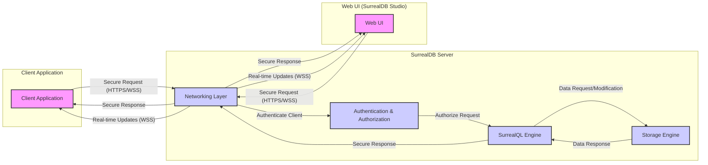

## Project Design Document: SurrealDB (Improved)

**1. Introduction**

This document provides an enhanced architectural design of the SurrealDB project, a cloud database engineered for modern application development. Building upon the initial design, this version offers greater detail and emphasizes aspects crucial for effective threat modeling. The information is derived from publicly available resources, primarily the SurrealDB GitHub repository, and aims to provide a comprehensive and security-focused overview.

**2. Project Overview**

SurrealDB stands out as a multi-model database, seamlessly integrating document, graph, and relational database functionalities into a single, scalable platform. Its key strengths include a flexible schema, real-time data handling, and the powerful SurrealQL query language. The project's core objective is to simplify backend development by offering a unified data management solution adaptable to diverse application requirements. This document focuses on the architectural elements relevant to security analysis.

**3. System Architecture**

The SurrealDB architecture comprises several interconnected components, each playing a vital role:

*   **SurrealDB Server:** The central processing unit responsible for:
    *   Receiving and processing client requests via various protocols (e.g., HTTP, WebSockets).
    *   Parsing, validating, and executing SurrealQL queries.
    *   Managing data persistence and retrieval through the pluggable Storage Engine.
    *   Enforcing authentication and authorization policies, potentially supporting mechanisms like:
        *   Username/password authentication.
        *   Token-based authentication (e.g., JWT).
        *   API keys for programmatic access.
    *   Coordinating distributed operations, including data replication and consensus (in clustered deployments, likely using Raft).
    *   Managing real-time subscriptions and broadcasting data changes to subscribed clients.
*   **SurrealQL Engine:** This module is dedicated to processing SurrealQL queries. Its responsibilities include:
    *   Lexing and parsing the query string.
    *   Semantic analysis and validation of the query.
    *   Query optimization and execution plan generation.
    *   Interacting with the Storage Engine to fetch or modify data.
    *   Returning query results to the SurrealDB Server.
*   **Storage Engine:** A key component with a pluggable architecture, allowing for different storage backends. This design choice impacts performance, scalability, and security characteristics. Examples include:
    *   **Embedded Storage:** Suitable for single-node deployments, offering simplicity.
    *   **Distributed Storage:** Designed for clustered environments, ensuring data durability and availability. This likely involves:
        *   Data partitioning or sharding across multiple nodes.
        *   Replication of data for fault tolerance.
        *   A consensus mechanism (e.g., Raft) to ensure data consistency across the cluster.
        *   Potential for encryption at rest depending on the chosen backend and configuration.
*   **Authentication and Authorization Module:** This critical security component manages user identity and access control:
    *   **Authentication:** Verifying the identity of connecting clients. This may involve:
        *   Verifying provided credentials against stored user information.
        *   Validating tokens or API keys.
        *   Potentially integrating with external authentication providers in the future.
    *   **Authorization:** Enforcing access control policies to determine what actions authenticated users are permitted to perform on specific resources (records, tables, namespaces, databases). This likely involves:
        *   Role-Based Access Control (RBAC).
        *   Permission management at various levels.
        *   Potentially row-level or field-level security in the future.
*   **Networking Layer:** Handles communication between clients and the SurrealDB server, and between nodes in a clustered deployment:
    *   **Client Communication:** Supports protocols like:
        *   HTTPS for secure API interactions.
        *   WebSockets (WSS) for real-time bidirectional communication.
    *   **Inter-node Communication (Clustered):** Utilizes an efficient and reliable protocol for internal communication, potentially involving:
        *   Data replication traffic.
        *   Consensus protocol messages (e.g., Raft).
        *   Service discovery mechanisms.
*   **Web UI (SurrealDB Studio):** A browser-based interface for managing and interacting with the database:
    *   Provides a visual query editor and execution environment.
    *   Allows for schema definition and management.
    *   Facilitates user and permission management.
    *   Offers monitoring and administrative tools.
    *   Relies on the SurrealDB Server's API for its functionality.
*   **Client Libraries (SDKs):** Provide convenient ways for applications to interact with SurrealDB:
    *   Offer language-specific APIs for executing queries and managing data.
    *   Handle connection management and protocol details.
    *   Available for various programming languages (e.g., JavaScript, Python, Go).

**4. Data Flow (Detailed)**

The data flow within SurrealDB involves a series of steps, with security checks at various stages:

*   A client application or the Web UI initiates a request (e.g., a SurrealQL query, data modification, or subscription).
*   The Networking Layer receives the request, establishing a secure connection (ideally HTTPS or WSS).
*   The Authentication and Authorization Module intercepts the request to verify the client's identity. This might involve:
    *   Checking for valid session cookies or authorization headers.
    *   Validating provided credentials against stored user data.
    *   Verifying the signature of tokens (e.g., JWT).
*   If authentication is successful, the Authorization component determines if the authenticated user has the necessary permissions to perform the requested action on the target resource.
*   If authorized, the request is passed to the SurrealQL Engine.
*   The SurrealQL Engine parses and validates the query, checking for syntax errors and potential security vulnerabilities (e.g., injection risks).
*   The engine generates an execution plan and interacts with the Storage Engine to retrieve or modify the data. This interaction might involve:
    *   Accessing data from disk or memory.
    *   Applying data modifications.
    *   Ensuring data consistency in a distributed environment.
*   The Storage Engine performs the requested data operation, potentially involving:
    *   Reading data from the underlying storage medium.
    *   Writing or updating data.
    *   Applying encryption/decryption if configured.
*   The results are returned to the SurrealQL Engine.
*   The SurrealDB Server formats the response and sends it back to the client through the Networking Layer over the established secure connection.
*   For real-time subscriptions:
    *   Upon successful authorization of a subscription request, the server maintains a persistent connection with the client.
    *   When relevant data changes occur, the server identifies subscribed clients and pushes updates to them through the open connection.

**5. Security Considerations (Enhanced)**

This section expands on the security aspects, providing more specific examples and potential threats:

*   **Authentication:**
    *   **Threats:** Brute-force attacks, credential stuffing, compromised credentials, insecure storage of credentials.
    *   **Mitigations:** Strong password policies, multi-factor authentication (future consideration), rate limiting on login attempts, secure storage of password hashes (e.g., using bcrypt or Argon2), protection against replay attacks for token-based authentication.
*   **Authorization:**
    *   **Threats:** Privilege escalation, unauthorized data access, data manipulation by unauthorized users.
    *   **Mitigations:** Fine-grained access control mechanisms (RBAC), principle of least privilege, regular review of permissions, secure default permissions, prevention of authorization bypass vulnerabilities.
*   **Data Encryption:**
    *   **Threats:** Data breaches, unauthorized access to data at rest and in transit.
    *   **Mitigations:** Encryption at rest for sensitive data within the Storage Engine (implementation details depend on the chosen backend), encryption in transit using HTTPS/WSS, secure key management practices.
*   **Input Validation:**
    *   **Threats:** Injection attacks (SurrealQL injection, NoSQL injection), cross-site scripting (XSS) if user-provided data is displayed in the Web UI.
    *   **Mitigations:** Strict input validation and sanitization on all data received from clients, parameterized queries to prevent injection, output encoding to prevent XSS.
*   **Network Security:**
    *   **Threats:** Man-in-the-middle attacks, eavesdropping, denial-of-service (DoS) attacks.
    *   **Mitigations:** Enforce HTTPS/WSS for all client communication, secure network configurations (firewalls, intrusion detection/prevention systems), rate limiting to mitigate DoS attacks.
*   **Web UI Security:**
    *   **Threats:** Cross-Site Scripting (XSS), Cross-Site Request Forgery (CSRF), insecure authentication and session management.
    *   **Mitigations:** Implementation of security headers (e.g., Content-Security-Policy, X-Frame-Options), anti-CSRF tokens, secure session management practices, regular security audits of the Web UI codebase.
*   **Dependency Management:**
    *   **Threats:** Vulnerabilities in third-party libraries.
    *   **Mitigations:** Regularly scanning dependencies for known vulnerabilities, keeping dependencies up-to-date, using software composition analysis tools.
*   **Auditing and Logging:**
    *   **Threats:** Lack of visibility into security events, difficulty in identifying and responding to incidents.
    *   **Mitigations:** Comprehensive audit logging of authentication attempts, authorization decisions, data access, and administrative actions, secure storage and management of audit logs.
*   **Secure Defaults:**
    *   **Threats:** Exploitation of insecure default configurations.
    *   **Mitigations:** Configuring SurrealDB with secure default settings, providing clear guidance on secure configuration practices.
*   **Rate Limiting:**
    *   **Threats:** Denial-of-service attacks, brute-force attacks.
    *   **Mitigations:** Implementing rate limiting on API endpoints, authentication attempts, and other critical operations.
*   **Protection against Data Breaches:**
    *   **Threats:** Unauthorized access to and exfiltration of sensitive data.
    *   **Mitigations:** A combination of the above measures, including strong authentication and authorization, data encryption, and network security.

**6. Deployment Options (Security Implications)**

The chosen deployment option significantly impacts the security considerations:

*   **Embedded Mode:**
    *   **Security Implications:** Security is highly dependent on the security of the application embedding SurrealDB. Vulnerabilities in the application can directly expose the database. Network security is less of a concern as it's typically not exposed over a network.
*   **Single-Node Server:**
    *   **Security Implications:** Requires careful configuration of network security (firewalls), operating system security, and SurrealDB's own security settings. The attack surface is larger than embedded mode.
*   **Clustered Deployment:**
    *   **Security Implications:** Introduces complexities related to inter-node communication security. Secure communication channels between nodes are crucial. Consensus mechanisms need to be resilient against malicious actors. Requires robust access control and potentially network segmentation.

**7. Technologies Used (Security Relevance)**

*   **Rust:** The use of Rust is beneficial from a security perspective due to its memory safety features, reducing the risk of buffer overflows and other memory-related vulnerabilities.
*   **HTTPS/WSS:**  Essential for encrypting communication between clients and the server, protecting against eavesdropping and man-in-the-middle attacks.
*   **Potential use of established cryptography libraries:**  For encryption and hashing, leveraging well-vetted libraries is crucial to avoid implementing insecure cryptographic algorithms.
*   **Raft (for clustering):** A widely adopted consensus algorithm known for its fault tolerance and security properties when implemented correctly.

**8. Future Considerations (Security Focused)**

Future development should prioritize enhancing security features:

*   **Enhanced Authentication Mechanisms:**  Integration with OAuth 2.0, OpenID Connect for federated identity management.
*   **Attribute-Based Access Control (ABAC):**  More granular and flexible access control based on user and resource attributes.
*   **Data Masking and Redaction:**  Capabilities to mask or redact sensitive data based on user roles or permissions.
*   **Integration with Security Information and Event Management (SIEM) systems:**  For centralized security monitoring and incident response.
*   **Regular Penetration Testing and Security Audits:**  To proactively identify and address potential vulnerabilities.
*   **Improved Secret Management:** Securely managing database credentials and other sensitive information.

This improved design document provides a more detailed and security-focused overview of SurrealDB's architecture, serving as a stronger foundation for subsequent threat modeling activities.
