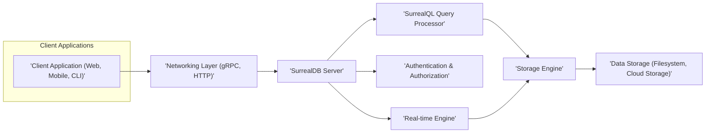

# Project Design Document: SurrealDB

**Version:** 1.1
**Date:** October 26, 2023
**Prepared By:** AI Architecture Expert

## 1. Project Overview

This document details the architectural design of SurrealDB, a cloud-native database engineered for building collaborative applications. SurrealDB's core innovation lies in its unified approach to graph, document, and relational data modeling within a single, scalable, and secure platform. This design document is crucial for understanding the system's structure and serves as the foundation for subsequent threat modeling activities.

## 2. Goals and Objectives

*   To offer a versatile data model accommodating graph, document, and relational data structures seamlessly.
*   To provide real-time query processing and efficient data synchronization capabilities.
*   To facilitate horizontal scalability and ensure high availability of the database service.
*   To implement comprehensive security measures, encompassing authentication, authorization, and robust data protection mechanisms.
*   To support diverse deployment scenarios, including self-hosted environments and a cloud-managed offering.
*   To empower users with a powerful and intuitive query language, SurrealQL.

## 3. Target Audience

This document is primarily intended for:

*   Security engineers tasked with performing threat modeling and security assessments of SurrealDB.
*   Software architects and developers involved in the development of or integration with SurrealDB.
*   Operations and infrastructure teams responsible for the deployment, management, and maintenance of SurrealDB instances.

## 4. System Architecture

SurrealDB's architecture comprises several interconnected components working in concert.

### 4.1. Component Diagram

### 4.2. Component Descriptions

*   **Client Application (Web, Mobile, CLI):** Represents various applications that interact with the SurrealDB server to execute data operations. This includes web frontends, mobile applications, and command-line interface tools.
*   **SurrealDB Server:** The central process of SurrealDB, responsible for receiving and processing client requests, managing data, executing queries, and handling real-time updates. It acts as the primary interface to the database.
*   **SurrealQL Query Processor:** This component is responsible for parsing, validating, and optimizing SurrealQL queries received from clients. It generates execution plans and interacts with the storage engine to retrieve or modify data.
*   **Authentication & Authorization:** This critical component manages user identity verification (authentication) and access control (authorization). It enforces security policies to ensure that only authorized users can access specific resources and perform permitted actions. This might involve methods like username/password, API keys, or OAuth 2.0.
*   **Storage Engine:**  The component responsible for the persistent storage and retrieval of data. SurrealDB is designed to be flexible and can support various storage backends, including local filesystems for development or embedded use cases, and cloud storage solutions for scalability and resilience.
*   **Real-time Engine:** This component manages the real-time capabilities of SurrealDB. It handles subscriptions from clients and efficiently pushes data updates to those clients whenever relevant data changes occur. This is crucial for collaborative applications.
*   **Networking Layer (gRPC, HTTP):** Provides the communication infrastructure for clients to interact with the SurrealDB server. gRPC is likely used for efficient and type-safe communication, especially internally, while HTTP (potentially with WebSockets) is used for broader client connectivity and real-time updates.
*   **Data Storage (Filesystem, Cloud Storage):** The physical location where the database files are stored persistently. This could be local disk storage, network-attached storage, or cloud-based object storage services depending on the deployment configuration.

## 5. Data Flow

Understanding the data flow is crucial for identifying potential vulnerabilities.

### 5.1. Write Operation Data Flow

1. A "'Client Application (Web, Mobile, CLI)'" initiates a data modification request by sending a SurrealQL write query to the "'SurrealDB Server'" through the "'Networking Layer (gRPC, HTTP)'".
2. The "'SurrealDB Server'" receives the request and invokes the "'Authentication & Authorization'" component to verify the identity of the client and ensure they have the necessary permissions to perform the requested operation. This might involve checking credentials or API keys.
3. Upon successful authentication and authorization, the "'SurrealDB Server'" forwards the query to the "'SurrealQL Query Processor'".
4. The "'SurrealQL Query Processor'" parses and validates the SurrealQL query to ensure its syntax is correct and semantically valid, preventing potential injection attacks.
5. The "'SurrealQL Query Processor'" then interacts with the "'Storage Engine'" to execute the write operation, which involves modifying the data stored in the "'Data Storage (Filesystem, Cloud Storage)'".
6. The "'Storage Engine'" persists the changes to the underlying storage medium, ensuring data durability. This might involve transaction management and write-ahead logging.
7. The "'Real-time Engine'" is notified of the successful data modification.
8. The "'Real-time Engine'" identifies any clients that have active subscriptions relevant to the modified data and pushes updates to these "'Client Application (Web, Mobile, CLI)'" instances via the "'Networking Layer (gRPC, HTTP)'".
9. Finally, the "'SurrealDB Server'" sends a confirmation response back to the initiating "'Client Application (Web, Mobile, CLI)'" indicating the success or failure of the operation.

### 5.2. Read Operation Data Flow

1. A "'Client Application (Web, Mobile, CLI)'" sends a SurrealQL read query to the "'SurrealDB Server'" via the "'Networking Layer (gRPC, HTTP)'".
2. The "'SurrealDB Server'" uses the "'Authentication & Authorization'" component to verify the client's identity and permissions to access the requested data.
3. If authorized, the "'SurrealDB Server'" passes the query to the "'SurrealQL Query Processor'".
4. The "'SurrealQL Query Processor'" parses and validates the query.
5. The "'SurrealQL Query Processor'" interacts with the "'Storage Engine'" to retrieve the requested data from the "'Data Storage (Filesystem, Cloud Storage)'".
6. The "'Storage Engine'" fetches the data from the underlying storage.
7. The "'SurrealDB Server'" receives the retrieved data from the "'Storage Engine'".
8. The "'SurrealDB Server'" sends the data back to the initiating "'Client Application (Web, Mobile, CLI)'" through the "'Networking Layer (gRPC, HTTP)'".

## 6. Security Considerations

Security is a paramount concern in the design of SurrealDB.

*   **Authentication:** SurrealDB likely supports various authentication mechanisms to verify user identities. This could include:
    *   Username and password-based authentication.
    *   API keys for programmatic access.
    *   Integration with OAuth 2.0 or other identity providers for federated authentication.
*   **Authorization:**  SurrealDB likely implements a robust authorization system to control access to data and operations. This may involve:
    *   Role-Based Access Control (RBAC), where users are assigned roles with specific permissions.
    *   Attribute-Based Access Control (ABAC), allowing for more fine-grained control based on user and resource attributes.
    *   Record-level permissions to restrict access to specific data entries.
*   **Data Encryption:** Protecting data at rest and in transit is crucial:
    *   **At Rest:** Data stored in the "'Data Storage (Filesystem, Cloud Storage)'" should be encrypted using industry-standard encryption algorithms.
    *   **In Transit:** Communication between clients and the "'SurrealDB Server'" via the "'Networking Layer (gRPC, HTTP)'" must be encrypted using TLS/SSL.
*   **Network Security:**  Securing the network infrastructure is essential:
    *   Utilizing TLS/SSL for all network communication.
    *   Implementing firewall rules to restrict access to the "'SurrealDB Server'" to authorized networks and ports.
    *   Considering network segmentation to isolate the database server.
*   **Input Validation:** The "'SurrealQL Query Processor'" plays a critical role in preventing injection attacks:
    *   Rigorous validation and sanitization of all incoming SurrealQL queries.
    *   Parameterized queries to prevent malicious code injection.
*   **Auditing:**  Comprehensive logging and auditing of security-related events are necessary for monitoring and incident response:
    *   Tracking user logins and logouts.
    *   Logging data access and modification attempts.
    *   Auditing administrative actions.
*   **Rate Limiting:** Implementing rate limiting on API endpoints can help mitigate denial-of-service (DoS) attacks.
*   **Secure Defaults:**  The system should be configured with secure default settings, minimizing the attack surface out of the box.
*   **Dependency Management:**  Maintaining up-to-date and secure dependencies is crucial to prevent vulnerabilities arising from third-party libraries.

## 7. Deployment Options

The deployment method significantly impacts the security posture and responsibilities.

*   **Self-Hosted:** When deploying SurrealDB on their own infrastructure, users are responsible for the security of the underlying operating system, network, and hardware. This includes patching, firewall configuration, and physical security.
*   **Surreal Cloud:** In the managed cloud offering, the SurrealDB team handles many of the underlying infrastructure security concerns, such as server maintenance, network security, and physical security. However, users are still responsible for configuring access controls and managing their data securely within the platform.
*   **Embedded:** When embedded within an application, the security of SurrealDB is closely tied to the security of the host application. Developers need to be mindful of how the embedded database is accessed and managed within their application to prevent vulnerabilities.

## 8. Technology Stack

The technologies used in SurrealDB's development are important to understand for potential security implications.

*   **Rust:** The core of the "'SurrealDB Server'" is built using Rust, a language known for its memory safety and performance, which helps reduce certain classes of vulnerabilities.
*   **SurrealQL:** The custom query language, requiring careful design and implementation to prevent injection vulnerabilities.
*   **gRPC:** Likely used for efficient and secure internal communication, offering features like authentication and encryption.
*   **HTTP/WebSockets:** Used for client communication, requiring secure configuration (HTTPS) to protect data in transit.
*   **Various Storage Backends:** The choice of storage backend can impact security. For example, using cloud storage requires understanding the security features and configurations offered by the cloud provider.

## 9. Future Considerations

The ongoing development of SurrealDB may introduce new features and security considerations.

*   **Enhanced Security Features:**  Continuous improvement and addition of advanced security features, such as more granular access controls, data masking, and threat detection capabilities.
*   **Improved Scalability and Performance:** Optimizations to handle larger datasets and higher traffic volumes, ensuring security measures remain effective under load.
*   **Integration with Security Tools:**  Potential integration with security information and event management (SIEM) systems and other security tools for enhanced monitoring and threat detection.

This improved design document provides a more detailed and comprehensive overview of the SurrealDB architecture, with a stronger focus on security considerations. This will be beneficial for conducting a thorough threat modeling exercise.