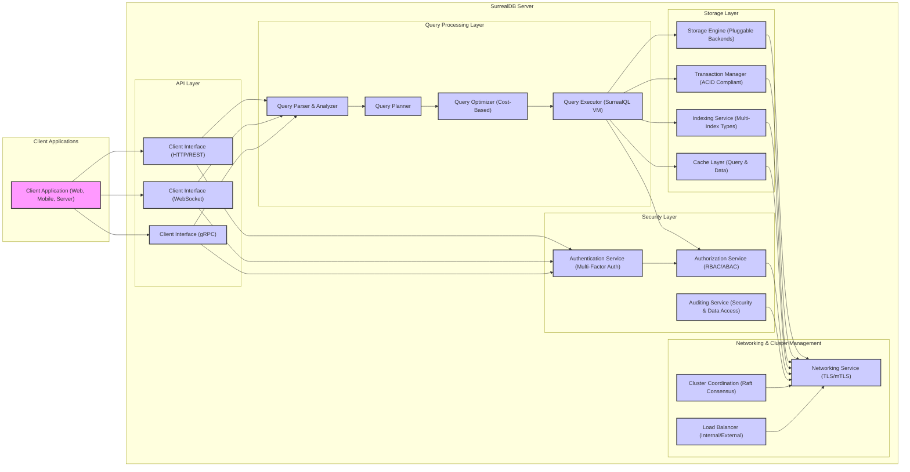
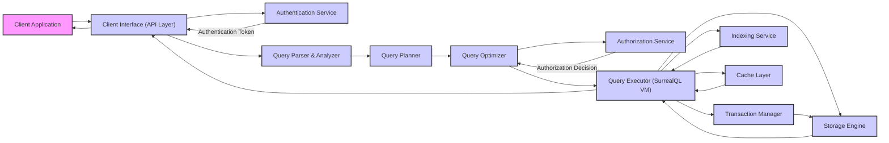

# Project Design Document: SurrealDB (Improved Version)

**Project Name:** SurrealDB

**Project Repository:** [https://github.com/surrealdb/surrealdb](https://github.com/surrealdb/surrealdb)

**Document Version:** 1.1

**Date:** 2023-10-27

**Author:** AI Cloud & Security Architect

## 1. Project Overview

SurrealDB is a cutting-edge, cloud-native database system engineered to function as both a document and graph database. Its primary objective is to deliver a versatile, scalable, and high-performance database solution tailored for contemporary web applications, mobile platforms, and serverless architectures.  Key features are designed to address the demands of modern data management:

*   **Unified Multi-model Database:** Seamlessly integrates document, graph, and key-value data models within a single, cohesive database instance, reducing complexity and data silos.
*   **Real-time Query Capabilities:**  Optimized for instantaneous data access and updates, featuring robust support for live queries and subscriptions, enabling reactive applications.
*   **Horizontal Scalability and Performance:** Architected for effortless horizontal scaling to handle massive datasets and high traffic loads, ensuring consistent performance under pressure.
*   **SurrealQL: Expressive Query Language:** Introduces SurrealQL, a purpose-built query language that blends SQL-like syntax with powerful extensions for graph traversal and document manipulation, simplifying complex data interactions.
*   **Cloud-Native Foundation:**  Built from the ground up for cloud environments, embracing containerization (like Docker) and orchestration (like Kubernetes) for streamlined deployment and management.
*   **Comprehensive Security Framework:**  Incorporates advanced authentication and authorization mechanisms to meticulously control access to sensitive data and database operations, ensuring data protection and compliance.

This document provides an enhanced and more detailed design overview of SurrealDB, delving deeper into its architecture, individual components, data flow pathways, and the underlying technologies employed. This refined design document will serve as a more robust and informative foundation for subsequent threat modeling exercises, enabling a more thorough security analysis.

## 2. Architecture Overview

SurrealDB is structured around a modular architecture, carefully separating concerns into distinct, yet interconnected components. This modularity promotes maintainability, scalability, and security. The following diagram presents a more detailed high-level view of the system architecture, expanding on the previous version:

## 3. Component Details

This section provides an in-depth description of each component within the SurrealDB architecture, expanding on the previous version with more detail and security considerations.

### 3.1. Client Interface (API Layer)

*   **Functionality:**
    *   Serves as the primary interaction point for client applications to access SurrealDB functionalities.
    *   Offers a range of communication protocols to cater to diverse client needs and environments.
    *   Manages incoming client requests, routing them to the appropriate internal components.
    *   Exposes a comprehensive set of APIs for executing SurrealQL queries, managing database connections, and performing administrative tasks such as schema management and user administration.
*   **Protocols:**
    *   **HTTP/REST:** Provides a standard RESTful API for general-purpose interactions, ideal for web applications and integrations. Supports standard HTTP methods (GET, POST, PUT, DELETE) for CRUD operations and query execution.
    *   **WebSocket:** Enables persistent, bidirectional communication channels, crucial for real-time features like live queries and subscriptions. Facilitates efficient push-based data delivery to clients.
    *   **gRPC:** Offers a high-performance, contract-based API using Protocol Buffers for serialization. Optimized for speed and efficiency, suitable for internal microservices communication and performance-sensitive client applications.
*   **Security Considerations:**
    *   **Transport Layer Security (TLS) Encryption:** Mandates TLS encryption for all communication channels (HTTP, WebSocket, gRPC) to safeguard data confidentiality and integrity during transit. Supports modern TLS versions and cipher suites.
    *   **Authentication Mechanisms:** Integrates tightly with the Authentication Service to rigorously verify client identities before granting access. Supports multiple authentication methods including:
        *   Username/Password authentication with secure password hashing (e.g., Argon2).
        *   API Keys for programmatic access and service integrations.
        *   OAuth 2.0 for delegated authorization and integration with identity providers.
        *   JSON Web Tokens (JWT) for stateless authentication and authorization.
        *   Multi-Factor Authentication (MFA) to enhance security by requiring multiple verification factors.
    *   **Input Validation and Sanitization:** Implements robust input validation at the API layer to prevent common web vulnerabilities:
        *   Validates all incoming requests against expected schemas and data types.
        *   Sanitizes user inputs to mitigate injection attacks such as SurrealQL injection, cross-site scripting (XSS), and command injection.
    *   **Rate Limiting and DoS Protection:** Employs rate limiting mechanisms to protect against denial-of-service (DoS) and distributed denial-of-service (DDoS) attacks. Limits the number of requests from a single IP address or client within a given time window.
    *   **CORS (Cross-Origin Resource Sharing) Policy:** Enforces a strict CORS policy to control which origins are permitted to access the API, preventing unauthorized cross-domain requests and protecting against CSRF attacks.

### 3.2. Query Processing Layer

This layer is the brain of SurrealDB, responsible for the entire lifecycle of SurrealQL queries, from parsing to execution. It is further refined into these sub-components:

*   **3.2.1. Query Parser & Analyzer:**
    *   **Functionality:**
        *   Receives SurrealQL queries from the API Layer and performs lexical analysis and parsing to understand the query structure.
        *   Analyzes the query syntax and semantics, verifying its correctness against the SurrealQL grammar and database schema.
        *   Constructs an Abstract Syntax Tree (AST) representation of the query for further processing.
        *   Performs semantic analysis to resolve identifiers, validate data types, and ensure query consistency.
    *   **Security Considerations:**
        *   **SurrealQL Injection Prevention:**  The parser is designed to be resilient against SurrealQL injection attacks. It strictly validates the query structure and rejects any malformed or potentially malicious queries. Parameterized queries are encouraged to further mitigate injection risks.
        *   **Denial of Service (DoS) Prevention:**  Limits query parsing complexity and processing time to prevent resource exhaustion and DoS attacks caused by excessively complex or malformed queries.

*   **3.2.2. Query Planner:**
    *   **Functionality:**
        *   Takes the AST from the parser and generates multiple possible execution plans for the query.
        *   Considers various factors like available indexes, data access paths, and query operations to create efficient plans.
        *   Explores different query execution strategies, such as join algorithms, index usage, and data retrieval methods.
    *   **Security Considerations:**
        *   **Plan Optimization Security:** Ensures that query plan optimization does not introduce security vulnerabilities. For example, avoids creating plans that could inadvertently bypass authorization checks or expose sensitive data through side-channel attacks.

*   **3.2.3. Query Optimizer (Cost-Based):**
    *   **Functionality:**
        *   Evaluates the cost of each execution plan generated by the Query Planner.
        *   Uses a cost model that considers factors like I/O operations, CPU usage, network communication, and memory consumption.
        *   Selects the most efficient execution plan with the lowest estimated cost.
        *   May rewrite the query plan to further optimize performance, such as applying query transformations or utilizing materialized views (if supported).
    *   **Security Considerations:**
        *   **Resource Limit Enforcement:**  The optimizer respects resource limits and constraints defined for users or queries. It avoids generating plans that would exceed these limits, preventing resource exhaustion and ensuring fair resource allocation.
        *   **Avoidance of Information Disclosure:**  Ensures that optimization strategies do not inadvertently expose sensitive information through query execution timings or error messages. Cost estimations and plan selection are performed securely without revealing internal database details.

*   **3.2.4. Query Executor (SurrealQL Virtual Machine - VM):**
    *   **Functionality:**
        *   Executes the optimized query plan selected by the Query Optimizer.
        *   Interprets the query plan instructions and interacts with the Storage Engine, Transaction Manager, and Indexing Service to retrieve and manipulate data.
        *   Implements the SurrealQL operators and functions within a secure and isolated execution environment (potentially a virtual machine).
        *   Manages data flow and intermediate results during query execution.
        *   Enforces authorization checks through the Authorization Service before accessing any data.
    *   **Security Considerations:**
        *   **Authorization Enforcement Point:**  Acts as the primary authorization enforcement point, ensuring that every data access operation is authorized before execution. Integrates with the Authorization Service to verify user permissions based on roles, policies, or attributes.
        *   **Data Access Control:**  Strictly controls data access based on the authorization policies. The Query Executor only retrieves and manipulates data that the authenticated and authorized user is permitted to access.
        *   **Secure Execution Environment:**  Executes queries within a secure and isolated environment (e.g., a VM or sandbox) to prevent code injection or escape vulnerabilities. Limits the capabilities of the execution environment to only necessary operations.
        *   **Error Handling and Information Leakage Prevention:**  Handles errors gracefully and securely. Error messages are carefully crafted to avoid exposing sensitive information about the database schema, data, or internal workings.

### 3.3. Storage Layer

The Storage Layer is responsible for the durable and reliable persistence of data. It is composed of:

*   **3.3.1. Storage Engine (Pluggable Backends):**
    *   **Functionality:**
        *   Manages the physical storage of data on persistent media (disk, SSD, cloud storage).
        *   Provides a pluggable architecture to support various storage backends, allowing flexibility in deployment and optimization for different workloads. Potential backends include:
            *   Local File System (for development and single-node deployments).
            *   RocksDB (embedded key-value store for performance and scalability).
            *   Cloud-based object storage (e.g., AWS S3, Azure Blob Storage) for cloud-native deployments.
            *   Distributed file systems (e.g., HDFS, Ceph) for large-scale clustered deployments.
        *   Handles data encoding, compression (e.g., LZ4, Zstd), and encryption at rest.
        *   Provides APIs for data persistence, retrieval, updates, and deletions, optimized for performance and concurrency.
    *   **Security Considerations:**
        *   **Encryption at Rest (Data Encryption):**  Mandatory encryption of data at rest to protect data confidentiality if the storage media is compromised. Supports industry-standard encryption algorithms (e.g., AES-256) and key management practices. Encryption keys should be securely managed and rotated.
        *   **Access Control to Storage Backends:**  Implements access control mechanisms to restrict access to the underlying storage files and resources. Only authorized SurrealDB processes should be able to access the storage backend.
        *   **Data Integrity and Checksums:**  Ensures data integrity through checksums (e.g., CRC32, SHA-256) to detect and prevent data corruption during storage and retrieval. Data integrity checks are performed regularly to ensure data consistency.
        *   **Secure Deletion and Data Wiping:**  Implements secure deletion mechanisms to ensure that sensitive data is securely wiped when deleted, preventing data remanence. Overwriting data multiple times may be used for secure deletion.

*   **3.3.2. Transaction Manager (ACID Compliant):**
    *   **Functionality:**
        *   Guarantees ACID (Atomicity, Consistency, Isolation, Durability) properties for all database transactions, ensuring data integrity and reliability.
        *   Manages concurrent access to data using concurrency control mechanisms (e.g., multi-version concurrency control - MVCC, two-phase locking - 2PL) to prevent data corruption and race conditions.
        *   Handles transaction logging (write-ahead logging - WAL) to ensure durability and recoverability in case of system failures.
        *   Provides transaction isolation levels (e.g., Read Committed, Repeatable Read, Serializable) to control the degree of isolation between concurrent transactions.
    *   **Security Considerations:**
        *   **Isolation Level Configuration:**  Allows configuration of transaction isolation levels to balance consistency and performance.  Appropriate isolation levels should be chosen to prevent data leakage or inconsistencies due to concurrent transactions (e.g., phantom reads, dirty reads). Serializable isolation provides the highest level of consistency but may impact performance.
        *   **Transaction Logging Security:**  Securely stores transaction logs and protects them from unauthorized access or modification. Transaction logs may contain sensitive data and should be encrypted and access-controlled.
        *   **Transaction Rollback and Recovery:**  Implements robust transaction rollback and recovery mechanisms to ensure data consistency in case of failures. Recovery processes should be secure and prevent data corruption or loss.

*   **3.3.3. Indexing Service (Multi-Index Types):**
    *   **Functionality:**
        *   Creates, manages, and maintains indexes on data to significantly accelerate query performance, especially for complex queries and large datasets.
        *   Supports a variety of indexing techniques to optimize different query patterns and data types:
            *   B-tree indexes for efficient range queries and ordered data access.
            *   Inverted indexes for full-text search and keyword-based queries.
            *   Graph indexes for efficient graph traversals and relationship queries.
            *   Spatial indexes for geospatial queries and location-based data.
        *   Automatically updates indexes in real-time as data is modified, ensuring index consistency.
    *   **Security Considerations:**
        *   **Index Data Security:**  Ensures that index data is also protected with appropriate security measures, as indexes can contain sensitive information derived from the indexed data. Index data should be encrypted at rest and access-controlled.
        *   **Index Integrity and Consistency:**  Maintains index integrity and consistency to prevent incorrect query results or potential denial-of-service attacks through index corruption. Index corruption can lead to data inconsistencies and application errors. Regular index integrity checks and repair mechanisms should be in place.
        *   **Index Access Control:**  Potentially implements access control on indexes to restrict access to sensitive index data based on user roles and permissions.

*   **3.3.4. Cache Layer (Query & Data):**
    *   **Functionality:**
        *   Implements caching mechanisms to improve query performance and reduce latency by storing frequently accessed data and query results in memory.
        *   Includes multiple levels of caching:
            *   Query result cache: Stores the results of frequently executed queries to avoid redundant query processing.
            *   Data cache: Caches frequently accessed data blocks or documents in memory for faster retrieval.
        *   Uses cache invalidation strategies to ensure cache coherency and data consistency.
    *   **Security Considerations:**
        *   **Cache Data Security:**  Ensures that cached data is protected with appropriate security measures, especially if sensitive data is cached. Cached data in memory should be protected from unauthorized access. Consider using secure memory allocation and access control for the cache.
        *   **Cache Invalidation Security:**  Securely manages cache invalidation to prevent cache poisoning attacks. Cache invalidation mechanisms should be robust and prevent malicious actors from injecting invalid data into the cache.
        *   **Cache Side-Channel Attacks:**  Consider potential side-channel attacks related to caching, such as timing attacks that could reveal information about cached data. Mitigate these risks through secure coding practices and potentially cache partitioning or obfuscation techniques.

### 3.4. Security Layer

This layer provides dedicated security functionalities to protect SurrealDB and its data.

*   **3.4.1. Authentication Service (Multi-Factor Auth):**
    *   **Functionality:**
        *   Rigorous verification of client identities attempting to connect to SurrealDB.
        *   Supports a wide range of authentication mechanisms to accommodate different security requirements and environments:
            *   Username/Password authentication with strong password policies and secure hashing (Argon2, bcrypt).
            *   API Keys for programmatic access and service-to-service authentication.
            *   OAuth 2.0 and OpenID Connect for delegated authorization and integration with external identity providers (e.g., Google, Azure AD).
            *   JSON Web Tokens (JWT) for stateless authentication and authorization, enabling secure microservices communication.
            *   Mutual TLS (mTLS) for strong client authentication using X.509 certificates.
            *   Multi-Factor Authentication (MFA) to enhance security by requiring users to provide multiple verification factors (e.g., password + OTP, security key). Supports TOTP, HOTP, and potentially push-based MFA.
        *   Manages user accounts, credentials, and authentication policies.
        *   Issues authentication tokens or sessions upon successful authentication, securely managing session lifecycles and timeouts.
    *   **Security Considerations:**
        *   **Secure Credential Storage:**  Stores user credentials (passwords, API keys) securely using strong, one-way hashing algorithms (e.g., Argon2id) with salting. Encryption of stored credentials at rest is also recommended.
        *   **Multi-Factor Authentication (MFA) Enforcement:**  Provides options to enforce MFA for different user roles or access levels, significantly reducing the risk of account compromise.
        *   **Account Lockout and Brute-Force Protection:**  Implements account lockout policies to prevent brute-force password guessing attacks. Limits the number of failed login attempts and temporarily locks accounts after exceeding the limit.
        *   **Session Management Security:**  Securely manages user sessions, using cryptographically strong session IDs and implementing appropriate session timeouts and renewal mechanisms. Protects session tokens from cross-site scripting (XSS) and cross-site request forgery (CSRF) attacks.
        *   **Password Policies and Complexity Requirements:**  Enforces strong password policies, including minimum length, complexity requirements (e.g., uppercase, lowercase, numbers, symbols), and password history to improve password strength.
        *   **Regular Security Audits and Penetration Testing:**  Conducts regular security audits and penetration testing of the Authentication Service to identify and address potential vulnerabilities.

*   **3.4.2. Authorization Service (RBAC/ABAC):**
    *   **Functionality:**
        *   Determines whether an authenticated user is authorized to perform a specific action (e.g., read, write, delete) on a specific resource (e.g., database, table, record).
        *   Enforces fine-grained access control policies based on:
            *   Role-Based Access Control (RBAC): Assigns users to roles and grants permissions to roles. Simplifies access management for large user groups.
            *   Attribute-Based Access Control (ABAC): Uses attributes of users, resources, and the environment to define access policies. Provides more granular and flexible access control.
            *   Policy-Based Access Control (PBAC): Defines access control policies using a declarative policy language.
        *   Integrates seamlessly with the Query Executor to enforce authorization checks before any data access or modification operation.
        *   Supports dynamic policy updates and policy enforcement.
    *   **Security Considerations:**
        *   **Principle of Least Privilege Enforcement:**  Implements authorization policies based on the principle of least privilege, granting users only the minimum necessary permissions to perform their tasks.
        *   **Robust Authorization Model (RBAC/ABAC):**  Utilizes a robust and flexible authorization model like RBAC or ABAC to manage permissions effectively and scale to complex access control requirements.
        *   **Policy Enforcement Points (PEPs):**  Ensures that authorization checks are consistently enforced at all relevant points in the system (e.g., API layer, Query Executor, Storage Layer).
        *   **Policy Decision Points (PDPs):**  Centralizes policy decision-making in the Authorization Service (PDP) to ensure consistent policy enforcement across the system.
        *   **Policy Auditing and Logging:**  Audits and logs all authorization decisions and policy changes for security monitoring and compliance purposes.
        *   **Policy Testing and Validation:**  Regularly tests and validates authorization policies to ensure they are correctly configured and effectively enforce access control requirements.

*   **3.4.3. Auditing Service (Security & Data Access):**
    *   **Functionality:**
        *   Tracks and logs security-relevant events and data access activities within SurrealDB for security monitoring, compliance auditing, and incident response.
        *   Logs events such as:
            *   Authentication attempts (successful and failed).
            *   Authorization decisions (access granted or denied).
            *   Data access operations (reads, writes, deletes).
            *   Schema changes and administrative actions.
            *   Security policy changes.
        *   Provides configurable audit logging levels and destinations (e.g., local files, syslog, security information and event management - SIEM systems).
        *   Supports log rotation and retention policies.
    *   **Security Considerations:**
        *   **Secure Log Storage and Management:**  Stores audit logs securely and protects them from unauthorized access, modification, or deletion. Audit logs may contain sensitive information and should be encrypted at rest and in transit. Access to audit logs should be restricted to authorized personnel only.
        *   **Log Integrity and Tamper-Proofing:**  Ensures log integrity and tamper-proofing to prevent malicious actors from altering or deleting audit logs to cover their tracks. Digital signatures or cryptographic hashing can be used to ensure log integrity.
        *   **Centralized Log Management and SIEM Integration:**  Supports centralized log management and integration with SIEM systems for real-time security monitoring, alerting, and incident response.
        *   **Audit Log Review and Analysis:**  Regularly reviews and analyzes audit logs to detect security incidents, identify suspicious activities, and improve security posture.

### 3.5. Networking & Cluster Management

This layer manages network communications and cluster operations for scalable and resilient deployments.

*   **3.5.1. Networking Service (TLS/mTLS):**
    *   **Functionality:**
        *   Manages all network connections between clients and the SurrealDB server, and between internal components within a cluster.
        *   Implements network protocols (TCP, UDP) and handles network communication details.
        *   Provides load balancing and connection pooling to distribute traffic and optimize resource utilization.
        *   Supports TLS encryption for secure communication and mutual TLS (mTLS) for strong authentication between components.
    *   **Security Considerations:**
        *   **Network Segmentation and Isolation:**  Implements network segmentation to isolate the database server and its components from untrusted networks. Uses firewalls and network access control lists (ACLs) to restrict network access.
        *   **Firewall Configuration and Intrusion Detection/Prevention:**  Requires proper firewall configuration to restrict network access to only necessary ports and services. Consider deploying Intrusion Detection/Prevention Systems (IDS/IPS) to monitor network traffic for malicious activity and automatically block or alert on suspicious traffic.
        *   **TLS/mTLS for Secure Communication:**  Mandates TLS encryption for all network communication channels to protect data in transit. Supports mutual TLS (mTLS) for strong authentication between internal components and potentially for client authentication in high-security environments.
        *   **DoS/DDoS Protection at Network Layer:**  Implements network-level DoS/DDoS protection measures, such as SYN flood protection, connection rate limiting, and traffic filtering, to mitigate network-based attacks.

*   **3.5.2. Cluster Coordination (Raft Consensus):**
    *   **Functionality:**
        *   Manages cluster membership, leader election, and node discovery in clustered deployments of SurrealDB.
        *   Utilizes a consensus algorithm (likely Raft) to ensure data consistency and agreement across all nodes in the cluster.
        *   Handles data replication and distribution across cluster nodes for fault tolerance and high availability.
        *   Provides automatic failover and recovery mechanisms in case of node failures, ensuring continuous service availability.
    *   **Security Considerations:**
        *   **Secure Inter-Node Communication (Encryption and Authentication):**  Mandates encryption for all communication between cluster nodes to protect data in transit within the cluster. Implements authentication and authorization mechanisms for inter-node communication to prevent unauthorized nodes from joining the cluster and participating in consensus.
        *   **Raft Consensus Security:**  Ensures the security of the Raft consensus algorithm implementation to prevent manipulation or denial-of-service attacks on the cluster's consensus process. Protects against vulnerabilities in the Raft implementation and configuration.
        *   **Cluster Membership Control and Node Authentication:**  Implements strict cluster membership control and node authentication to prevent unauthorized nodes from joining the cluster and compromising cluster security. Only authorized and authenticated nodes should be allowed to join the cluster.
        *   **Quorum and Split-Brain Prevention:**  Ensures proper quorum configuration and split-brain prevention mechanisms in the cluster to maintain data consistency and availability in the face of network partitions or node failures.

*   **3.5.3. Load Balancer (Internal/External):**
    *   **Functionality:**
        *   Distributes client traffic across multiple SurrealDB server nodes in a clustered deployment to improve performance, scalability, and availability.
        *   Provides both internal load balancing (for distributing traffic within the cluster) and external load balancing (for distributing traffic from external clients).
        *   Supports various load balancing algorithms (e.g., round robin, least connections, IP hash) and health checks to ensure traffic is routed to healthy nodes.
    *   **Security Considerations:**
        *   **Load Balancer Security Hardening:**  Hardens the load balancer itself against security vulnerabilities. Regularly updates and patches the load balancer software and operating system.
        *   **Secure Load Balancer Configuration:**  Configures the load balancer securely, disabling unnecessary features and services, and implementing access control to the load balancer management interface.
        *   **TLS Termination at Load Balancer (Optional):**  Optionally terminates TLS connections at the load balancer to offload TLS processing from the SurrealDB server nodes. If TLS termination is used, ensure secure key management and protection of TLS private keys on the load balancer.
        *   **DoS/DDoS Protection at Load Balancer:**  Utilizes load balancer features for DoS/DDoS protection, such as rate limiting, connection limiting, and traffic filtering, to protect the SurrealDB cluster from network-based attacks.

## 4. Data Flow (Improved Diagram)

The following diagram provides a more detailed illustration of the data flow for a query request in SurrealDB, highlighting the interactions between components and security checks:

**Data Flow Steps (Detailed):**

1.  **Client Request Initiation:** A client application initiates a query request and sends it to the Client Interface via HTTP, WebSocket, or gRPC.
2.  **Authentication Attempt (Optional):** The Client Interface may initiate authentication with the Authentication Service if the request requires authentication (e.g., for data modification or access to protected resources). The Authentication Service verifies client credentials (username/password, API key, JWT, etc.).
3.  **Authentication Token Issuance:** Upon successful authentication, the Authentication Service issues an authentication token (e.g., JWT, session ID) and returns it to the Client Interface. This token will be used for subsequent requests to identify the authenticated client.
4.  **Query Parsing and Analysis:** The Client Interface forwards the query to the Query Parser & Analyzer. The parser analyzes the SurrealQL query, validates its syntax, and builds an Abstract Syntax Tree (AST).
5.  **Query Planning:** The Query Planner takes the AST and generates multiple potential query execution plans.
6.  **Query Optimization (Cost-Based):** The Query Optimizer evaluates the cost of each plan and selects the most efficient one.
7.  **Authorization Check:** Before executing the query, the Query Optimizer (or Query Executor) interacts with the Authorization Service. The Authorization Service evaluates the user's permissions based on roles, policies, or attributes and the requested operation and resource.
8.  **Authorization Decision Enforcement:** The Authorization Service returns an authorization decision (permit or deny) to the Query Optimizer/Executor. Only if authorized, the query execution proceeds.
9.  **Query Execution (SurrealQL VM):** The Query Executor executes the optimized query plan within a secure execution environment (VM). It interacts with:
    *   **Transaction Manager:** To begin and manage transactions, ensuring ACID properties.
    *   **Indexing Service:** To utilize indexes for efficient data retrieval.
    *   **Storage Engine:** To access and manipulate data on persistent storage.
    *   **Cache Layer:** To check for cached data or query results before accessing the Storage Engine, improving performance.
10. **Data Retrieval and Processing:** The Query Executor retrieves data from the Storage Engine (potentially via the Cache Layer and Indexing Service), processes the data according to the query plan, and formats the results.
11. **Response Handling:** The Query Executor sends the query results back to the Client Interface.
12. **Client Response Delivery:** The Client Interface sends the response back to the client application.

## 5. Technology Stack (Detailed and Speculative)

This section provides a more detailed and speculative technology stack for SurrealDB, based on common practices in database systems and the project's likely requirements.

*   **Core Programming Language:** Rust
    *   Rationale: Performance, memory safety, concurrency, and suitability for systems programming. Rust's ecosystem provides excellent libraries for building high-performance and reliable systems.
*   **Asynchronous Networking Framework:** Tokio
    *   Rationale:  Rust's asynchronous runtime for building highly concurrent and efficient network applications. Tokio provides abstractions for asynchronous I/O, timers, and task scheduling.
*   **Storage Engine Backend (Pluggable):**
    *   **Default/Embedded:** RocksDB (Rust bindings via `rust-rocksdb` crate)
        *   Rationale: High-performance embedded key-value store, widely used in databases. Offers good performance, scalability, and features like compression and snapshots.
    *   **Cloud Storage (Potential):** AWS S3 (using `aws-sdk-rust` crate), Azure Blob Storage (using `azure-sdk-for-rust` crate), Google Cloud Storage (using `google-cloud-rust` crate)
        *   Rationale: For cloud-native deployments, leveraging cloud object storage for scalability and cost-effectiveness.
    *   **Distributed Storage (Potential):**  Integration with distributed file systems like Ceph (using Ceph client libraries in Rust or FFI) or HDFS (less likely due to complexity).
        *   Rationale: For large-scale clustered deployments requiring distributed storage and high availability.
*   **Query Language:** SurrealQL (Custom-designed)
    *   Rationale: Purpose-built for SurrealDB's multi-model capabilities, offering a unified syntax for document, graph, and key-value operations.
*   **Query Parser and Lexer:**  Likely custom-built using Rust's parsing libraries (e.g., `nom`, `pest`) or parser generators.
*   **Query Optimizer:**  Custom-built, potentially using cost-based optimization techniques and algorithms.
*   **Query Executor (SurrealQL VM):** Custom-built virtual machine or interpreter for executing SurrealQL query plans.
*   **Transaction Management:**  Custom-built Transaction Manager, likely implementing MVCC or 2PL concurrency control and Write-Ahead Logging (WAL).
*   **Indexing Service:**
    *   **B-tree Indexes:**  Likely implemented using Rust's standard library data structures or specialized B-tree crates.
    *   **Inverted Indexes:**  Potentially using crates like `tantivy` (Rust-based search engine library) or custom implementation.
    *   **Graph Indexes:**  Custom implementation or leveraging graph database libraries in Rust (if available and suitable).
    *   **Spatial Indexes:**  Potentially using spatial indexing libraries in Rust (if available) or custom implementation.
*   **Data Serialization:** Protocol Buffers (using `protobuf-rust` crate) or similar efficient binary serialization formats (e.g., FlatBuffers, Cap'n Proto) for internal communication and data storage.
*   **Clustering and Consensus:** Raft consensus algorithm (likely using a Rust Raft library like `raft-rs` or custom implementation).
*   **Security Libraries:**
    *   **TLS/SSL:** `rustls` or `openssl-sys` crates for TLS encryption.
    *   **Cryptography:** `ring` or `