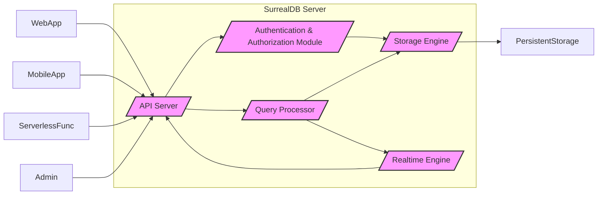
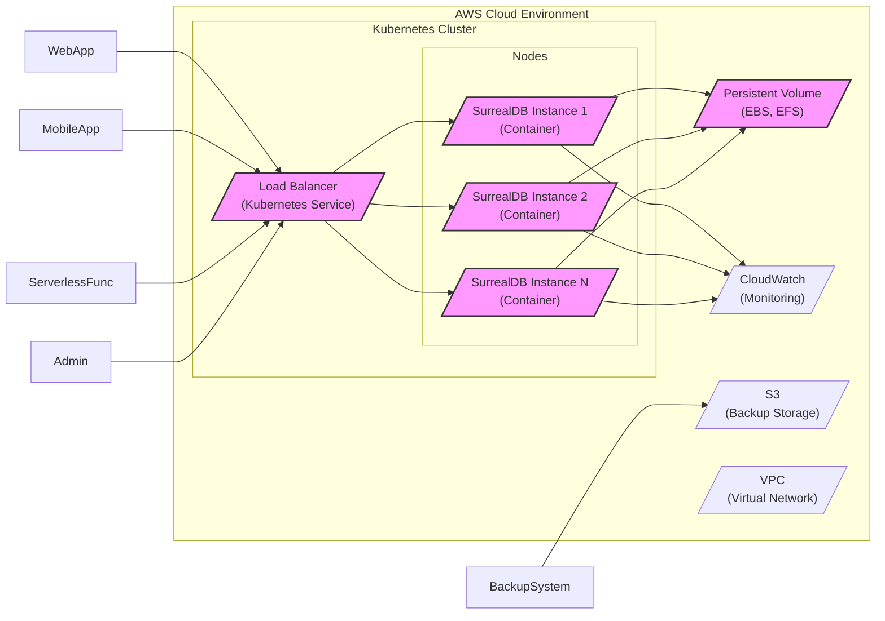
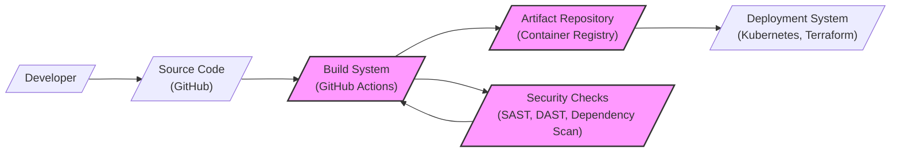

# BUSINESS POSTURE

SurrealDB is positioned as a next-generation database solution designed to simplify development and enhance application performance. It targets a wide range of applications, including web, mobile, and serverless, emphasizing real-time data capabilities and a flexible data model.

- Business priorities:
  - Ease of use and developer productivity: SurrealDB aims to reduce the complexity of database management and integration, allowing developers to focus on application logic.
  - Performance and scalability: The database is designed for high performance and scalability to handle demanding application workloads.
  - Real-time data capabilities: SurrealDB provides real-time query and subscription features, enabling applications to react instantly to data changes.
  - Versatility and flexibility: Supporting both document and graph data models, SurrealDB offers flexibility for various application data needs.

- Business goals:
  - Market adoption: To become a widely adopted database solution, challenging established databases in the market.
  - Community growth: To build a strong and active community around the database, fostering contributions and support.
  - Revenue generation (for SurrealDB Ltd, the company behind it): To establish a sustainable business model, likely through cloud offerings, enterprise support, or premium features.

- Most important business risks:
  - Security vulnerabilities: Data breaches or system compromises could severely damage reputation and hinder adoption, especially for a database system that handles sensitive data.
  - Performance bottlenecks: Failure to deliver on promised performance and scalability could lead to user dissatisfaction and migration to alternative solutions.
  - Data integrity issues: Bugs or design flaws that compromise data consistency or durability could erode trust and limit adoption in critical applications.
  - Lock-in and migration challenges: If users perceive it as difficult to migrate data to or from SurrealDB, adoption might be limited.
  - Competition: The database market is crowded. SurrealDB needs to differentiate itself effectively and compete against established and emerging databases.

# SECURITY POSTURE

- Existing security controls:
  - security control: Access control mechanisms are likely in place to manage user permissions and database access, although details need to be confirmed in documentation. (Location: Documentation and source code)
  - security control: Encryption of data in transit using TLS/HTTPS for client-server communication is expected. (Location: Documentation and network configuration guides)
  - security control: Authentication mechanisms to verify user identities before granting access. (Location: Documentation and authentication module in source code)
  - security control: Authorization mechanisms to control what authenticated users can do within the database. (Location: Documentation and authorization module in source code)
  - security control: Regular security audits and vulnerability scanning are likely conducted by the SurrealDB team. (Location: Internal processes of SurrealDB Ltd)
  - security control: Secure coding practices are expected to be followed during development. (Location: Development guidelines and code review processes within SurrealDB Ltd)
  - accepted risk: As a relatively new database, SurrealDB might have a smaller track record of security testing and real-world deployment compared to mature databases. This implies a potentially higher risk of undiscovered vulnerabilities.
  - accepted risk: Reliance on community contributions might introduce security risks if contributions are not thoroughly vetted.

- Recommended security controls:
  - security control: Implement robust input validation and sanitization to prevent injection attacks.
  - security control: Implement comprehensive logging and auditing of security-related events for monitoring and incident response.
  - security control: Provide options for data encryption at rest to protect data stored on disk.
  - security control: Conduct regular penetration testing by external security experts to identify and address vulnerabilities.
  - security control: Establish a clear vulnerability disclosure and response process to handle security issues reported by the community or found internally.
  - security control: Implement automated security scanning tools (SAST/DAST) in the CI/CD pipeline.
  - security control: Dependency scanning to identify and manage vulnerabilities in third-party libraries.

- Security requirements:
  - Authentication:
    - Requirement: Support strong authentication mechanisms, such as password policies, multi-factor authentication (MFA), or integration with external identity providers (e.g., OAuth, LDAP).
    - Requirement: Securely store and manage user credentials, avoiding plaintext storage and using strong hashing algorithms.
    - Requirement: Implement protection against brute-force attacks and account lockout mechanisms.
  - Authorization:
    - Requirement: Implement fine-grained access control to manage permissions at the database, namespace, table, and record level.
    - Requirement: Support role-based access control (RBAC) to simplify permission management.
    - Requirement: Enforce the principle of least privilege, granting users only the necessary permissions.
  - Input validation:
    - Requirement: Validate all user inputs to prevent injection attacks (SQL injection, NoSQL injection, command injection, etc.).
    - Requirement: Sanitize user inputs before processing and storing them in the database.
    - Requirement: Implement input validation at multiple layers (client-side and server-side).
  - Cryptography:
    - Requirement: Use strong encryption algorithms and protocols for data in transit (TLS/HTTPS).
    - Requirement: Provide options for data encryption at rest using industry-standard encryption algorithms.
    - Requirement: Securely manage cryptographic keys, protecting them from unauthorized access.
    - Requirement: Consider using cryptography for data integrity checks to detect tampering.

# DESIGN

## C4 CONTEXT

```mermaid
graph LR
    subgraph "SurrealDB Ecosystem"
        center["SurrealDB Project"]
    end
    User[/"Application Users"/] --> center
    WebApp[/"Web Applications"/] --> center
    MobileApp[/"Mobile Applications"/] --> center
    ServerlessFunc[/"Serverless Functions"/] --> center
    Admin[/"Database Administrators"/] --> center
    MonitoringSystem[/"Monitoring System"/] <-- center
    BackupSystem[/"Backup System"/] <-- center
    ExternalAuth[/"External Authentication Providers (OAuth, LDAP)"/] <-- center
    center --> StorageSystem[/"Persistent Storage"/]

    style center fill:#f9f,stroke:#333,stroke-width:2px
```

- Context Diagram Elements:
  - Element:
    - Name: SurrealDB Project
    - Type: Software System
    - Description: The SurrealDB database system itself, providing data storage, query, and real-time capabilities.
    - Responsibilities:
      - Managing data storage and retrieval.
      - Processing queries and transactions.
      - Providing real-time data subscriptions.
      - Enforcing security policies and access control.
      - Exposing APIs for application interaction.
    - Security controls:
      - Authentication and authorization mechanisms.
      - Input validation and sanitization.
      - Data encryption in transit and at rest (optional).
      - Logging and auditing.

  - Element:
    - Name: Application Users
    - Type: Person
    - Description: End-users who interact with applications that use SurrealDB as their data store.
    - Responsibilities:
      - Accessing application features and data.
      - Generating data and requests to the applications.
    - Security controls:
      - Authenticating to applications (application-level security).
      - Authorization within applications (application-level security).

  - Element:
    - Name: Web Applications
    - Type: Software System
    - Description: Web-based applications that utilize SurrealDB to store and manage their data.
    - Responsibilities:
      - Interacting with SurrealDB APIs to read and write data.
      - Implementing application logic and user interfaces.
      - Handling user authentication and authorization (application-level).
    - Security controls:
      - Secure coding practices.
      - Input validation and output encoding.
      - Session management.
      - Protection against web application vulnerabilities (OWASP Top 10).

  - Element:
    - Name: Mobile Applications
    - Type: Software System
    - Description: Mobile applications running on user devices that rely on SurrealDB for data persistence and real-time updates.
    - Responsibilities:
      - Interacting with SurrealDB APIs via backend services or directly (depending on architecture).
      - Managing local data caching and synchronization.
      - Providing user interfaces and mobile-specific features.
    - Security controls:
      - Secure coding practices for mobile platforms.
      - Secure data storage on mobile devices.
      - Secure communication with backend services and SurrealDB.
      - Protection against mobile application vulnerabilities.

  - Element:
    - Name: Serverless Functions
    - Type: Software System
    - Description: Serverless functions (e.g., AWS Lambda, Azure Functions, Google Cloud Functions) that use SurrealDB for data processing and storage in event-driven architectures.
    - Responsibilities:
      - Interacting with SurrealDB APIs to perform data operations.
      - Executing business logic in response to events.
      - Scaling automatically based on demand.
    - Security controls:
      - Secure configuration of serverless functions.
      - Least privilege access to SurrealDB.
      - Monitoring and logging of function executions.
      - Protection against serverless-specific vulnerabilities.

  - Element:
    - Name: Database Administrators
    - Type: Person
    - Description: Individuals responsible for managing and maintaining the SurrealDB database system.
    - Responsibilities:
      - Database configuration and setup.
      - User and permission management.
      - Performance monitoring and tuning.
      - Backup and recovery.
      - Security administration.
    - Security controls:
      - Strong authentication and authorization for administrative access.
      - Audit logging of administrative actions.
      - Secure access to database servers and infrastructure.

  - Element:
    - Name: Monitoring System
    - Type: Software System
    - Description: External system used to monitor the health, performance, and security of the SurrealDB database.
    - Responsibilities:
      - Collecting metrics and logs from SurrealDB.
      - Alerting administrators to issues.
      - Providing dashboards and visualizations.
    - Security controls:
      - Secure communication channels for data collection.
      - Access control to monitoring data and dashboards.

  - Element:
    - Name: Backup System
    - Type: Software System
    - Description: System responsible for creating backups of the SurrealDB database for disaster recovery and data protection.
    - Responsibilities:
      - Scheduling and performing database backups.
      - Storing backups securely.
      - Restoring backups when needed.
    - Security controls:
      - Secure storage of backups (encryption).
      - Access control to backups.
      - Integrity checks for backups.

  - Element:
    - Name: External Authentication Providers (OAuth, LDAP)
    - Type: Software System
    - Description: External identity providers used for user authentication in SurrealDB, allowing integration with existing identity management systems.
    - Responsibilities:
      - Verifying user credentials.
      - Issuing authentication tokens or assertions.
    - Security controls:
      - Secure communication protocols (e.g., OAuth 2.0, LDAP over TLS).
      - Secure configuration of integration with SurrealDB.

  - Element:
    - Name: Persistent Storage
    - Type: Infrastructure
    - Description: The underlying storage infrastructure where SurrealDB data is physically stored (e.g., disks, SSDs, cloud storage).
    - Responsibilities:
      - Providing durable and reliable data storage.
      - Ensuring data availability and performance.
    - Security controls:
      - Physical security of storage infrastructure.
      - Data encryption at rest (storage-level encryption).
      - Access control to storage resources.

## C4 CONTAINER



- Container Diagram Elements:
  - Element:
    - Name: API Server
    - Type: Container
    - Description: Exposes the SurrealDB API (likely HTTP/WebSockets) for client applications to interact with the database. Handles requests, manages connections, and routes requests to other internal modules.
    - Responsibilities:
      - Receiving and processing client API requests.
      - Handling authentication and authorization for API access.
      - Routing queries to the Query Processor.
      - Managing real-time subscriptions via WebSockets.
      - Returning responses to clients.
    - Security controls:
      - TLS/HTTPS encryption for API communication.
      - API request authentication and authorization.
      - Input validation for API requests.
      - Rate limiting and DDoS protection.

  - Element:
    - Name: Query Processor
    - Type: Container
    - Description: Parses and optimizes database queries written in SurrealQL. Executes queries against the Storage Engine and Realtime Engine.
    - Responsibilities:
      - Parsing SurrealQL queries.
      - Query optimization and planning.
      - Executing data retrieval and manipulation operations.
      - Interacting with the Storage Engine for persistent data access.
      - Interacting with the Realtime Engine for real-time data processing.
    - Security controls:
      - Query parsing and validation to prevent injection attacks.
      - Authorization checks before query execution.
      - Resource management to prevent denial-of-service through complex queries.

  - Element:
    - Name: Storage Engine
    - Type: Container
    - Description: Manages the persistent storage of data. Handles data persistence, indexing, and transaction management. Likely interacts directly with the underlying file system or storage service.
    - Responsibilities:
      - Storing and retrieving data records.
      - Managing indexes for efficient data access.
      - Handling transactions and ensuring data consistency.
      - Data persistence and durability.
    - Security controls:
      - Data encryption at rest (if implemented).
      - Access control to data files and storage resources.
      - Data integrity checks.
      - Backup and recovery mechanisms.

  - Element:
    - Name: Realtime Engine
    - Type: Container
    - Description: Handles real-time data subscriptions and notifications. Manages connections with clients for real-time updates and processes data changes to push updates to subscribed clients.
    - Responsibilities:
      - Managing real-time subscriptions.
      - Detecting data changes.
      - Pushing real-time updates to subscribed clients via WebSockets.
      - Ensuring efficient and low-latency real-time data delivery.
    - Security controls:
      - Secure WebSocket connections (WSS).
      - Authorization for real-time subscriptions.
      - Rate limiting for real-time updates.

  - Element:
    - Name: Authentication & Authorization Module
    - Type: Container
    - Description: Handles user authentication and authorization for all components of SurrealDB. Verifies user credentials, manages sessions, and enforces access control policies. May integrate with external authentication providers.
    - Responsibilities:
      - User authentication (verifying user identities).
      - Authorization (enforcing access control policies).
      - Session management.
      - Integration with external authentication providers.
      - Role-based access control (RBAC) management.
    - Security controls:
      - Secure authentication mechanisms (password hashing, MFA, etc.).
      - Secure session management.
      - Fine-grained access control policies.
      - Audit logging of authentication and authorization events.

## DEPLOYMENT

Deployment options for SurrealDB can vary. It can be deployed as:

1.  **Self-hosted on-premises:** Deploying SurrealDB on company-managed servers within their own data centers.
2.  **Self-hosted in the cloud (IaaS):** Deploying SurrealDB on virtual machines or containers in cloud environments like AWS EC2, Azure VMs, or Google Compute Engine.
3.  **Managed cloud service (PaaS/DBaaS):** Utilizing a managed SurrealDB service offered by SurrealDB Ltd or a third-party cloud provider (if available in the future).
4.  **Embedded within applications:** Embedding SurrealDB directly into applications as a library or process.

Let's consider a **Self-hosted in the cloud (IaaS)** deployment scenario on AWS using containers (Docker) and orchestration (Kubernetes).



- Deployment Diagram Elements:
  - Element:
    - Name: Kubernetes Cluster
    - Type: Environment
    - Description: A Kubernetes cluster deployed in AWS, providing container orchestration for SurrealDB instances.
    - Responsibilities:
      - Container orchestration and management.
      - Service discovery and load balancing.
      - Scalability and high availability.
    - Security controls:
      - Kubernetes RBAC for cluster access control.
      - Network policies to isolate workloads.
      - Security updates and patching of Kubernetes components.
      - Container security scanning.

  - Element:
    - Name: Nodes
    - Type: Infrastructure
    - Description: Worker nodes within the Kubernetes cluster, running SurrealDB container instances.
    - Responsibilities:
      - Executing containers.
      - Providing compute resources.
    - Security controls:
      - Hardened operating system images.
      - Security updates and patching of OS and runtime.
      - Host-based intrusion detection systems (HIDS).

  - Element:
    - Name: SurrealDB Instance (Container)
    - Type: Container
    - Description: Docker containers running the SurrealDB server application. Multiple instances are deployed for scalability and high availability.
    - Responsibilities:
      - Running the SurrealDB server application.
      - Handling database operations.
    - Security controls:
      - Container image security scanning.
      - Least privilege container configurations.
      - Resource limits for containers.
      - Application-level security controls (as described in Container Diagram).

  - Element:
    - Name: Load Balancer (Kubernetes Service)
    - Type: Infrastructure
    - Description: Kubernetes LoadBalancer service that distributes incoming traffic across multiple SurrealDB instances.
    - Responsibilities:
      - Load balancing API requests.
      - Exposing SurrealDB API endpoints.
      - Health checks for SurrealDB instances.
    - Security controls:
      - TLS termination at the load balancer.
      - DDoS protection.
      - Access control lists (ACLs) or security groups to restrict access.

  - Element:
    - Name: Persistent Volume (EBS, EFS)
    - Type: Infrastructure
    - Description: Persistent storage volumes (e.g., AWS EBS or EFS) attached to Kubernetes nodes to store SurrealDB data persistently.
    - Responsibilities:
      - Providing persistent storage for database data.
      - Ensuring data durability and availability.
    - Security controls:
      - Data encryption at rest (EBS encryption, EFS encryption).
      - Access control to storage volumes.
      - Backup and recovery of persistent volumes.

  - Element:
    - Name: CloudWatch (Monitoring)
    - Type: Software System
    - Description: AWS CloudWatch service used for monitoring SurrealDB instances and the Kubernetes cluster.
    - Responsibilities:
      - Collecting logs and metrics from SurrealDB and Kubernetes.
      - Providing monitoring dashboards and alerts.
    - Security controls:
      - Secure access to CloudWatch logs and metrics.
      - Audit logging of CloudWatch access.

  - Element:
    - Name: S3 (Backup Storage)
    - Type: Infrastructure
    - Description: AWS S3 service used for storing SurrealDB database backups.
    - Responsibilities:
      - Securely storing database backups.
      - Providing scalable and durable backup storage.
    - Security controls:
      - Encryption of backups at rest in S3.
      - Access control policies for S3 buckets.
      - Versioning and lifecycle policies for backups.

  - Element:
    - Name: VPC (Virtual Network)
    - Type: Infrastructure
    - Description: AWS Virtual Private Cloud (VPC) that provides a private and isolated network environment for the Kubernetes cluster and SurrealDB deployment.
    - Responsibilities:
      - Network isolation and security.
      - Network routing and connectivity.
    - Security controls:
      - Network security groups to control traffic flow.
      - Network access control lists (NACLs).
      - Subnet isolation.

## BUILD



- Build Process Elements:
  - Element:
    - Name: Developer
    - Type: Person
    - Description: Software developers who write and commit code to the SurrealDB project repository.
    - Responsibilities:
      - Writing and testing code.
      - Committing code changes to the source code repository.
    - Security controls:
      - Secure development environment.
      - Code review processes.
      - Security awareness training.
      - Access control to source code repository.

  - Element:
    - Name: Source Code (GitHub)
    - Type: Software System
    - Description: The GitHub repository hosting the SurrealDB source code.
    - Responsibilities:
      - Version control of source code.
      - Collaboration and code sharing.
      - Triggering build processes.
    - Security controls:
      - Access control to the repository (authentication and authorization).
      - Branch protection rules.
      - Audit logging of repository activities.

  - Element:
    - Name: Build System (GitHub Actions)
    - Type: Software System
    - Description: Automated build system, likely GitHub Actions, used to compile, test, and package SurrealDB.
    - Responsibilities:
      - Automating the build process.
      - Compiling source code.
      - Running unit and integration tests.
      - Packaging build artifacts (e.g., Docker images, binaries).
      - Triggering security checks.
      - Publishing build artifacts to the artifact repository.
    - Security controls:
      - Secure configuration of CI/CD pipelines.
      - Access control to build system configurations and secrets.
      - Audit logging of build activities.
      - Isolation of build environments.

  - Element:
    - Name: Security Checks (SAST, DAST, Dependency Scan)
    - Type: Software System
    - Description: Automated security scanning tools integrated into the build pipeline to identify vulnerabilities. Includes Static Application Security Testing (SAST), Dynamic Application Security Testing (DAST), and dependency scanning.
    - Responsibilities:
      - Static code analysis for security vulnerabilities.
      - Dynamic testing of deployed application for vulnerabilities.
      - Scanning dependencies for known vulnerabilities.
      - Reporting security findings to the build system.
    - Security controls:
      - Configuration and management of security scanning tools.
      - Secure storage of scan results.
      - Integration with build system for automated vulnerability checks.

  - Element:
    - Name: Artifact Repository (Container Registry)
    - Type: Software System
    - Description: Repository for storing build artifacts, such as Docker container images for SurrealDB. Could be Docker Hub, GitHub Container Registry, or a private registry.
    - Responsibilities:
      - Storing and managing build artifacts.
      - Providing access to build artifacts for deployment.
    - Security controls:
      - Access control to the artifact repository.
      - Image signing and verification.
      - Vulnerability scanning of container images in the registry.

  - Element:
    - Name: Deployment System (Kubernetes, Terraform)
    - Type: Software System
    - Description: Systems used to deploy SurrealDB to target environments, such as Kubernetes for container orchestration and Terraform for infrastructure provisioning.
    - Responsibilities:
      - Automating deployment processes.
      - Provisioning infrastructure.
      - Deploying and configuring SurrealDB instances.
    - Security controls:
      - Secure configuration of deployment pipelines.
      - Infrastructure as Code (IaC) security scanning.
      - Access control to deployment systems and infrastructure.
      - Secrets management for deployment credentials.

# RISK ASSESSMENT

- Critical business processes:
  - Data storage and retrieval: The core function of SurrealDB is to reliably store and retrieve data for applications. Disruption or compromise of this process would impact all applications relying on SurrealDB.
  - Real-time data processing: SurrealDB's real-time capabilities are a key feature. Failure to deliver real-time updates or data corruption in real-time streams would affect applications that depend on this functionality.
  - Authentication and authorization: Securely controlling access to data and database operations is crucial. Weaknesses in authentication or authorization could lead to unauthorized data access or manipulation.
  - Database administration and maintenance: Processes for managing, monitoring, and maintaining the database are essential for its continuous operation and security. Failures in these processes could lead to instability or vulnerabilities.

- Data being protected and sensitivity:
  - Application data: SurrealDB is designed to store various types of application data, which can range from public information to highly sensitive personal data, financial records, or intellectual property, depending on the application using it.
  - Database credentials: Credentials used to access and manage the database itself (e.g., administrator passwords, API keys) are highly sensitive and must be protected.
  - Audit logs: Logs containing security-related events and user activity are sensitive as they can reveal security incidents or vulnerabilities.
  - Backups: Database backups contain all the data and are highly sensitive. Unauthorized access to backups could lead to data breaches.

# QUESTIONS & ASSUMPTIONS

- Questions:
  - What specific authentication mechanisms are currently supported by SurrealDB (e.g., password-based, API keys, OAuth)?
  - Is data encryption at rest currently implemented or planned for SurrealDB? If so, what encryption algorithms and key management solutions are used?
  - What logging and auditing capabilities are built into SurrealDB? What security-related events are logged?
  - What is the vulnerability disclosure and response process for SurrealDB?
  - Are there any specific compliance certifications (e.g., SOC 2, ISO 27001) that SurrealDB is pursuing or has achieved?
  - What are the recommended best practices for securing a SurrealDB deployment?

- Assumptions:
  - BUSINESS POSTURE:
    - The primary business goal is to gain market adoption and build a strong community.
    - Security is a critical factor for achieving business goals, especially for a database product.
    - Performance and scalability are key differentiators for SurrealDB.
  - SECURITY POSTURE:
    - Basic security controls like authentication, authorization, and TLS are implemented.
    - Secure development practices are followed by the SurrealDB team.
    - There is an ongoing effort to improve the security posture of SurrealDB.
  - DESIGN:
    - The architecture is modular, with distinct components for API handling, query processing, storage, and real-time features.
    - Deployment is flexible and supports various environments, including cloud and on-premises.
    - Build process is automated and includes basic security checks.