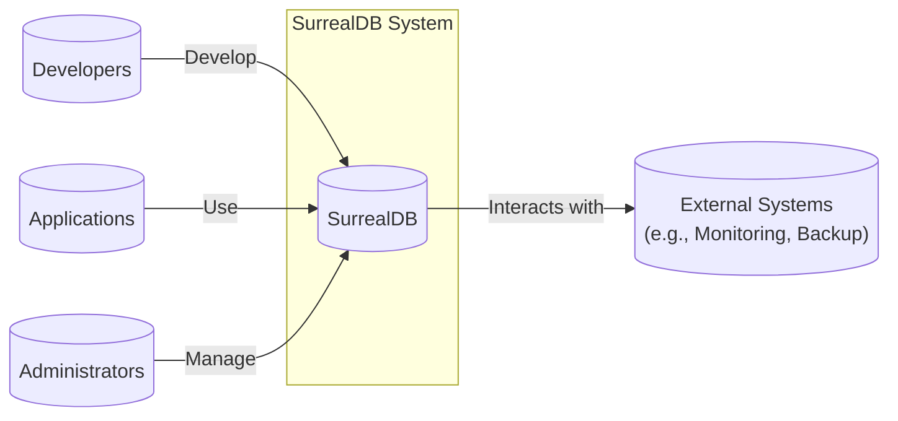
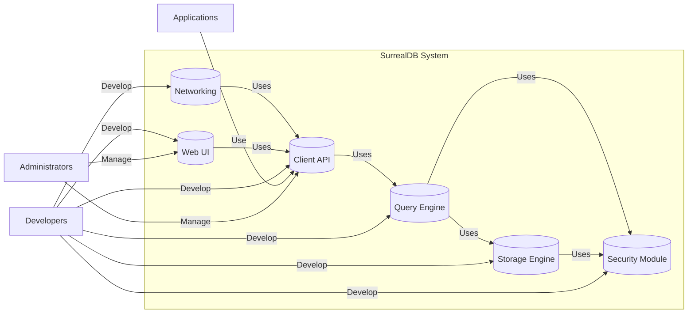
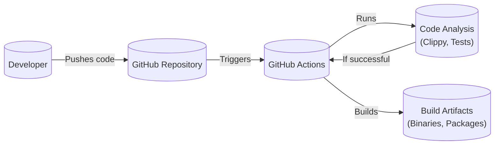

Okay, let's create a design document for SurrealDB based on the provided GitHub repository.

# BUSINESS POSTURE

SurrealDB is positioned as a next-generation database aiming to simplify database interactions and provide flexibility for various application needs.  It combines the features of traditional databases, graph databases, and document stores.  Given its open-source nature and ambitious feature set, the following business priorities and risks are apparent:

Priorities:

*   Rapid Adoption:  Attracting a large user base (developers and organizations) is crucial for the project's long-term viability and sustainability.
*   Community Growth:  Building a strong and active community around SurrealDB is essential for contributions, feedback, and advocacy.
*   Feature Velocity:  Continuing to deliver new features and improvements at a rapid pace to maintain a competitive edge in the database market.
*   Commercial Viability:  Establishing a sustainable business model (likely through cloud offerings, enterprise support, or related services) to fund ongoing development.
*   Ease of Use: Making the database easy to learn, use, and integrate into existing workflows.
*   Performance and Scalability: Providing a database solution that can handle significant workloads and scale to meet growing demands.

Business Risks:

*   Data Loss/Corruption:  Any vulnerability leading to data loss or corruption would be catastrophic for a database system and severely damage user trust.
*   Security Breaches:  Unauthorized access to data or the database system itself could expose sensitive information and lead to legal and reputational damage.
*   Performance Bottlenecks:  If the database cannot perform under expected loads, it will limit adoption and usability.
*   Lack of Adoption:  If the project fails to gain sufficient traction, it may struggle to attract contributors and funding.
*   Competition:  The database market is highly competitive, with established players and numerous emerging solutions.
*   Complexity:  Balancing the extensive feature set with ease of use and maintainability is a significant challenge.

# SECURITY POSTURE

Based on the GitHub repository and available documentation, the following security controls and accepted risks are identified.  Note that this assessment is based on publicly available information and may not be fully comprehensive.

Existing Security Controls:

*   security control: Authentication: SurrealDB supports multiple authentication methods, including root user authentication, and scope-based authentication (user/scope level). Described in documentation and implemented in code.
*   security control: Authorization: SurrealDB implements a granular permission system allowing control over access to namespaces, tables, and even individual records and fields.  This is a core feature described in the documentation and implemented in the codebase.
*   security control: Input Validation:  While specifics are not extensively detailed in the readily available documentation, the use of Rust as the primary programming language provides inherent memory safety benefits, reducing the risk of buffer overflows and similar vulnerabilities.  Further input validation is likely implemented within the query parsing and processing logic.
*   security control: Cryptography: SurrealDB supports encryption at rest using a variety of encryption keys and algorithms. It also supports TLS for secure communication. Described in documentation and implemented in code.
*   security control: Secure Development Practices: The project appears to follow some secure development practices, including code reviews (evident from pull requests) and the use of a memory-safe language (Rust).
*   security control: Access Control: SurrealDB allows for fine-grained access control at the namespace, table, record, and field levels.

Accepted Risks:

*   accepted risk: Complexity of Security Model: The comprehensive permission system, while powerful, introduces complexity that could lead to misconfigurations if not carefully managed.
*   accepted risk: Emerging Technology: As a relatively new database, SurrealDB may have undiscovered vulnerabilities or limitations compared to more mature solutions.
*   accepted risk: Reliance on Third-Party Libraries: Like all software, SurrealDB depends on external libraries, which could introduce vulnerabilities if not properly vetted and updated.
*   accepted risk: Community Contributions: While beneficial, open-source contributions require careful review to ensure they meet security standards.

Recommended Security Controls:

*   Static Analysis Security Testing (SAST): Integrate SAST tools into the CI/CD pipeline to automatically scan for potential vulnerabilities in the codebase.
*   Dynamic Analysis Security Testing (DAST): Implement DAST to test the running application for vulnerabilities, particularly in the API endpoints.
*   Software Composition Analysis (SCA): Use SCA tools to identify and track third-party dependencies and their associated vulnerabilities.
*   Regular Penetration Testing: Conduct periodic penetration tests by external security experts to identify and address potential weaknesses.
*   Formal Security Audits: Engage a third-party security firm to perform a comprehensive security audit of the codebase and architecture.
*   Bug Bounty Program: Establish a bug bounty program to incentivize security researchers to find and report vulnerabilities.

Security Requirements:

*   Authentication:
    *   Support for strong password policies.
    *   Multi-factor authentication (MFA) options.
    *   Integration with external identity providers (e.g., LDAP, OAuth).
    *   Secure storage of credentials (hashing and salting).
*   Authorization:
    *   Role-Based Access Control (RBAC) to simplify permission management.
    *   Regular review and auditing of access permissions.
    *   Principle of least privilege enforcement.
*   Input Validation:
    *   Strict validation of all user inputs to prevent injection attacks (SQL injection, NoSQL injection, command injection).
    *   Parameterized queries or equivalent mechanisms to prevent injection vulnerabilities.
    *   Encoding of output data to prevent cross-site scripting (XSS) vulnerabilities.
*   Cryptography:
    *   Use of strong, industry-standard cryptographic algorithms.
    *   Secure key management practices.
    *   Protection of data in transit using TLS/SSL.
    *   Options for data at rest encryption.
*   Auditing:
    *   Detailed audit logs of all security-relevant events (authentication, authorization, data access, configuration changes).
    *   Secure storage and protection of audit logs.
    *   Regular review of audit logs.

# DESIGN

## C4 CONTEXT



Element Descriptions:

*   Element:
    *   Name: SurrealDB
    *   Type: Database System
    *   Description: A multi-model, distributed, real-time database.
    *   Responsibilities: Storing data, processing queries, managing transactions, enforcing security policies, providing APIs for interaction.
    *   Security controls: Authentication, Authorization, Encryption, Access Control, Input Validation.

*   Element:
    *   Name: Developers
    *   Type: Users
    *   Description: Individuals who develop and maintain SurrealDB and its related tools.
    *   Responsibilities: Writing code, fixing bugs, adding features, contributing to documentation.
    *   Security controls: Code reviews, secure coding practices, SAST, SCA.

*   Element:
    *   Name: Applications
    *   Type: Users
    *   Description: Software applications that utilize SurrealDB as their data store.
    *   Responsibilities: Sending queries to SurrealDB, processing results, interacting with users.
    *   Security controls: Application-level security measures, secure communication with SurrealDB (TLS).

*   Element:
    *   Name: Administrators
    *   Type: Users
    *   Description: Individuals responsible for managing and maintaining SurrealDB instances.
    *   Responsibilities: Deploying, configuring, monitoring, backing up, and securing SurrealDB deployments.
    *   Security controls: Strong authentication, access controls, monitoring, regular security audits.

*   Element:
    *   Name: External Systems
    *   Type: External Systems
    *   Description: Systems that interact with SurrealDB for monitoring, backup, or other purposes.
    *   Responsibilities: Varies depending on the specific system.
    *   Security controls: Secure communication with SurrealDB (TLS), appropriate authentication and authorization.

## C4 CONTAINER



Element Descriptions:

*   Element:
    *   Name: Client API
    *   Type: API
    *   Description: Provides interfaces for applications to interact with SurrealDB (e.g., SurrealQL, REST, WebSockets).
    *   Responsibilities: Handling client connections, parsing requests, routing requests to the Query Engine.
    *   Security controls: Input validation, authentication, authorization checks (delegated to Security Module).

*   Element:
    *   Name: Query Engine
    *   Type: Component
    *   Description: Processes queries, optimizes execution plans, and interacts with the Storage Engine.
    *   Responsibilities: Parsing SurrealQL queries, optimizing query execution, coordinating data retrieval and updates.
    *   Security controls: Input validation, authorization checks (delegated to Security Module).

*   Element:
    *   Name: Storage Engine
    *   Type: Component
    *   Description: Manages the underlying data storage, retrieval, and persistence.
    *   Responsibilities: Storing data, retrieving data based on requests from the Query Engine, managing transactions.
    *   Security controls: Data at rest encryption, access controls (delegated to Security Module).

*   Element:
    *   Name: Security Module
    *   Type: Component
    *   Description: Handles authentication, authorization, and other security-related functions.
    *   Responsibilities: Authenticating users, enforcing access control policies, managing encryption keys.
    *   Security controls: Authentication mechanisms, authorization policies, key management.

*   Element:
    *   Name: Networking
    *   Type: Component
    *   Description: Manages network communication between SurrealDB nodes and clients.
    *   Responsibilities: Handling network connections, ensuring secure communication (TLS).
    *   Security controls: TLS encryption, firewall rules.

*   Element:
    *   Name: Web UI
    *   Type: Web Application
    *   Description: Provides a web-based interface for managing and interacting with SurrealDB.
    *   Responsibilities: Providing a user interface for database administration, query execution, and data visualization.
    *   Security controls: Authentication, authorization, input validation, protection against web vulnerabilities (XSS, CSRF).

## DEPLOYMENT

SurrealDB can be deployed in various ways, including:

1.  Single-Node Deployment: For development and testing.
2.  Distributed Deployment: For production environments requiring high availability and scalability.  This can be achieved using a distributed consensus algorithm (likely Raft, based on the use of the `tikv/raft-rs` crate).
3.  Cloud-Based Deployment:  Deploying SurrealDB on cloud platforms like AWS, Azure, or GCP, potentially using containerization (Docker) and orchestration (Kubernetes).
4.  Embedded Deployment: SurrealDB can be embedded within other applications.

We'll describe the Distributed Deployment in detail, as it's the most relevant for production use cases.

```mermaid
graph LR
    subgraph Deployment Environment (e.g., Kubernetes Cluster)
        subgraph Node 1
            SurrealDBInstance1[(SurrealDB Instance)]
        end
        subgraph Node 2
            SurrealDBInstance2[(SurrealDB Instance)]
        end
        subgraph Node 3
            SurrealDBInstance3[(SurrealDB Instance)]
        end

        SurrealDBInstance1 -- Raft --> SurrealDBInstance2
        SurrealDBInstance1 -- Raft --> SurrealDBInstance3
        SurrealDBInstance2 -- Raft --> SurrealDBInstance3

        LoadBalancer[("Load Balancer")]
        LoadBalancer -- Distributes traffic --> SurrealDBInstance1
        LoadBalancer -- Distributes traffic --> SurrealDBInstance2
        LoadBalancer -- Distributes traffic --> SurrealDBInstance3
    end
    Applications -- Connect to --> LoadBalancer
```

Element Descriptions:

*   Element:
    *   Name: SurrealDB Instance
    *   Type: Server
    *   Description: A running instance of the SurrealDB database.
    *   Responsibilities: Storing data, processing queries, participating in the distributed consensus algorithm.
    *   Security controls: All security controls described in the Container diagram, plus OS-level security measures.

*   Element:
    *   Name: Load Balancer
    *   Type: Load Balancer
    *   Description: Distributes client requests across multiple SurrealDB instances.
    *   Responsibilities: Distributing traffic, health checks, potentially SSL termination.
    *   Security controls: TLS termination, DDoS protection, access control lists.

*   Element:
    *   Name: Node
    *   Type: Physical or Virtual Machine
    *   Description: A physical or virtual machine hosting a SurrealDB instance.
    *   Responsibilities: Providing compute resources for the SurrealDB instance.
    *   Security controls: OS hardening, firewall rules, intrusion detection/prevention systems.

## BUILD

The SurrealDB build process, based on the GitHub repository, leverages Rust's Cargo build system and GitHub Actions for CI/CD.



Build Process Description:

1.  Developers write code and push changes to the GitHub repository.
2.  GitHub Actions workflows are triggered by push events or pull requests.
3.  The workflows perform various tasks, including:
    *   Code Analysis: Running linters (Clippy) and unit/integration tests.
    *   Building: Compiling the Rust code using Cargo.
    *   Packaging: Creating binaries and packages for different platforms.
    *   Testing: Running further tests, potentially including integration and end-to-end tests.
    *   Publishing:  Potentially publishing releases to GitHub or other repositories.

Security Controls in Build Process:

*   security control: Code Reviews: Pull requests require review and approval before merging, ensuring code quality and security.
*   security control: Static Analysis: Clippy (Rust linter) is used to identify potential code quality and security issues.
*   security control: Automated Testing: Unit and integration tests are run automatically to catch bugs and regressions.
*   security control: Dependency Management: Cargo manages dependencies, and tools like `cargo audit` (though not explicitly seen in the workflows, it's highly recommended) can be used to check for known vulnerabilities in dependencies.

# RISK ASSESSMENT

Critical Business Processes:

*   Data Storage and Retrieval: The core function of the database; any disruption impacts all users.
*   Query Processing:  Ensuring efficient and accurate query execution is crucial for application performance.
*   Data Consistency and Durability: Maintaining data integrity and preventing data loss are paramount.
*   Secure Access Control: Protecting sensitive data from unauthorized access.

Data Sensitivity:

*   SurrealDB can store a wide variety of data, ranging from non-sensitive to highly sensitive, depending on the user's application.  The sensitivity level is determined by the user, not by SurrealDB itself.  However, SurrealDB must provide the mechanisms to protect data of all sensitivity levels.
*   Examples:
    *   High Sensitivity: Personally Identifiable Information (PII), financial data, health records.
    *   Medium Sensitivity: User preferences, application configurations, internal business data.
    *   Low Sensitivity: Publicly available data, test data.

# QUESTIONS & ASSUMPTIONS

Questions:

*   What are the specific compliance requirements (e.g., GDPR, HIPAA, PCI DSS) that SurrealDB aims to support?
*   What are the performance targets and scalability goals for SurrealDB?
*   What are the plans for disaster recovery and business continuity?
*   What is the intended threat model for SurrealDB? (Who are the expected attackers, and what are their capabilities?)
*   Are there any plans to integrate with hardware security modules (HSMs) for key management?
*   What level of support will be provided for different deployment environments (cloud, on-premise, hybrid)?

Assumptions:

*   BUSINESS POSTURE:  The primary goal is to build a successful and widely adopted database system, with a balance between rapid innovation and security.
*   SECURITY POSTURE:  The development team is aware of security best practices and strives to implement them, but there may be resource constraints limiting the scope of security measures.
*   DESIGN:  The architecture is designed for scalability and high availability, but specific implementation details may evolve. The use of Rust provides a strong foundation for memory safety. The deployment model will primarily target cloud-native environments (Kubernetes).