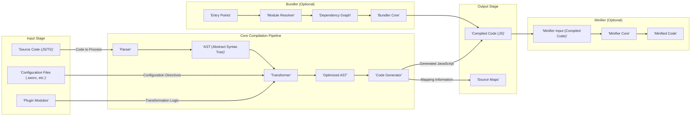

# Project Design Document: SWC (Speedy Web Compiler)

**Version:** 1.1
**Date:** October 26, 2023
**Author:** AI Software Architect

## 1. Introduction

This document provides an enhanced and detailed design overview of the SWC (Speedy Web Compiler) project. SWC is a robust platform, primarily written in Rust, dedicated to the efficient compilation and transformation of JavaScript and TypeScript code. This document aims to deliver a comprehensive understanding of the system's architecture, individual components, and the flow of data within it. This detailed design will serve as a solid foundation for subsequent threat modeling activities, enabling a thorough analysis of potential security vulnerabilities.

## 2. Project Overview

SWC is engineered as a high-performance compiler and bundler specifically for web development workflows. Its primary goal is to offer a compelling alternative to tools like Babel and Terser, often providing significant speed advantages in common use cases. The core functionalities of SWC encompass:

*   **Parsing:**  Analyzing JavaScript and TypeScript source code to understand its structure.
*   **Transformation:** Modifying the code's structure and syntax based on predefined rules, configurations, and plugins.
*   **Code Generation:** Producing optimized and target-specific JavaScript code from the transformed representation.
*   **Bundling (Optional):** Combining multiple JavaScript modules and their dependencies into single or a few output files for efficient loading in browsers or Node.js environments.
*   **Minification (Optional):** Reducing the size of the output JavaScript code by removing unnecessary characters and shortening identifiers.

## 3. System Architecture

The SWC architecture is designed with modularity in mind, where distinct components are responsible for specific stages within the compilation pipeline. This separation of concerns enhances maintainability and allows for targeted optimizations. The following diagram illustrates the high-level architecture and the interactions between key components:

## 4. Data Flow

The typical flow of data within SWC as it processes source code involves the following sequential steps:

1. **Input Acquisition:** The process begins by receiving JavaScript or TypeScript source code files, along with configuration files that dictate how the compilation should proceed. Optionally, plugin modules can be loaded to extend the transformation capabilities of SWC.
2. **Parsing and AST Generation:** The `Parser` component takes the raw source code as input and performs lexical and syntax analysis. This results in the creation of an Abstract Syntax Tree (AST), which is a hierarchical representation of the code's structure.
3. **Transformation based on Configuration and Plugins:** The `Transformer` component receives the AST. It then applies a series of transformations to the AST. These transformations are guided by the settings specified in the configuration files and the logic implemented within any loaded plugin modules. Examples of transformations include:
    *   Transpiling modern JavaScript or TypeScript syntax to older, more widely supported versions.
    *   Applying custom code modifications defined by plugins.
    *   Removing code intended only for development environments (e.g., `console.log` statements).
4. **AST Optimization:** The transformation process often leads to an optimized AST, where unnecessary nodes might be removed or the structure might be adjusted for more efficient code generation.
5. **Code Generation from AST:** The `Code Generator` component takes the optimized AST as input and translates it back into executable JavaScript code. This component is also responsible for generating source maps, which provide a mapping between the generated code and the original source code, aiding in debugging.
6. **Optional Bundling:** If the bundling feature is enabled, the `Bundler` component takes a set of entry points (the main modules of the application) as input. It then proceeds to:
    *   Resolve all module dependencies, tracing the import and export relationships between files.
    *   Construct a dependency graph, representing the interconnectedness of the modules.
    *   Utilize the `Bundler Core` to combine the individual modules into one or more bundled output files.
7. **Optional Minification:** If minification is enabled, the `Minifier` component takes the compiled JavaScript code (either directly from the code generator or from the bundler) and applies various techniques to reduce its size. These techniques include:
    *   Removing whitespace, comments, and other non-essential characters.
    *   Shortening variable and function names.
    *   Applying other code optimizations to reduce the overall byte count.
8. **Output Delivery:** The final output of the SWC process consists of the compiled JavaScript code. Depending on the configuration, this may also include source maps and minified versions of the code.

## 5. Key Components

This section provides a more detailed description of the major components within the SWC project:

*   **Parser:**
    *   **Responsibility:**  The initial stage of the compilation process, responsible for taking raw JavaScript or TypeScript source code as input and converting it into a structured representation.
    *   **Functionality:** Performs lexical analysis (breaking the code into tokens) and syntax analysis (verifying the code's structure against the language grammar).
    *   **Features:** Supports various ECMAScript and TypeScript syntax versions and features. Employs efficient parsing algorithms for speed.
*   **AST (Abstract Syntax Tree):**
    *   **Responsibility:**  Serves as the central intermediate representation of the source code's structure after parsing.
    *   **Functionality:** Represents the code in a hierarchical, tree-like format, making it easier for subsequent components to analyze and manipulate.
    *   **Details:** Each node in the AST represents a specific construct in the code (e.g., variables, functions, expressions).
*   **Transformer:**
    *   **Responsibility:**  Modifying the AST based on configuration settings and loaded plugins. This is where the core logic of code transformation resides.
    *   **Functionality:** Traverses the AST and applies transformations to its nodes.
    *   **Extensibility:** Provides a plugin system that allows developers to write custom transformation logic. Common transformations include:
        *   **Transpilation:** Converting newer JavaScript/TypeScript features to older equivalents for browser compatibility.
        *   **JSX Transformation:** Converting JSX syntax into standard JavaScript function calls.
        *   **Type Removal:** Stripping TypeScript-specific syntax.
*   **Code Generator:**
    *   **Responsibility:**  Taking the transformed (and potentially optimized) AST and converting it back into textual JavaScript code.
    *   **Functionality:**  Traverses the AST and generates the corresponding JavaScript syntax.
    *   **Features:**  Handles code formatting (indentation, spacing), and generates source maps that link the generated code back to the original source.
*   **Bundler:**
    *   **Responsibility:**  Combining multiple JavaScript modules and their dependencies into single or a few output files.
    *   **Functionality:**
        *   **Module Resolution:**  Locates and resolves the dependencies of each module based on import statements.
        *   **Dependency Graph Construction:**  Builds a graph representing the relationships between modules.
        *   **Code Concatenation:**  Combines the code of the resolved modules into the output bundle(s).
        *   **Tree-shaking:**  Removes unused code exports to reduce the bundle size.
    *   **Features:** Supports various module formats (e.g., CommonJS, ES Modules).
*   **Minifier:**
    *   **Responsibility:**  Reducing the size of the compiled JavaScript code for faster loading times.
    *   **Functionality:** Applies various code optimization techniques, including:
        *   **Whitespace Removal:** Removing unnecessary spaces, tabs, and newlines.
        *   **Comment Removal:** Stripping out code comments.
        *   **Identifier Renaming (Mangling):** Shortening variable and function names.
        *   **Dead Code Elimination:** Removing code that is never executed.
*   **Configuration Loader:**
    *   **Responsibility:**  Reading and parsing configuration files (typically `.swcrc` or similar) that dictate how SWC should operate.
    *   **Functionality:**  Loads configuration options that control various aspects of the compilation process, such as target environments, enabled transformations, and plugin settings.
*   **Plugin System:**
    *   **Responsibility:**  Providing a mechanism for developers to extend SWC's functionality by creating custom transformations and optimizations.
    *   **Functionality:** Allows developers to write modules that can hook into the compilation pipeline, typically by interacting with the AST.
    *   **Benefits:** Enables highly customized build processes and the integration of specialized code transformations.

## 6. Security Considerations (Detailed)

This section expands on the potential security considerations relevant to SWC, providing more specific examples of potential threats:

*   **Input Validation Vulnerabilities in the Parser:**
    *   **Threat:** Maliciously crafted source code could exploit vulnerabilities in the `Parser`, leading to crashes, infinite loops, or even arbitrary code execution on the build server.
    *   **Examples:**  Extremely deeply nested code structures, excessively long identifiers, or invalid syntax that triggers parser bugs.
    *   **Mitigation:** Robust input validation and sanitization within the `Parser` are crucial. Fuzzing and thorough testing can help identify potential vulnerabilities.
*   **Security Risks Associated with Plugins:**
    *   **Threat:**  Malicious or poorly written plugins could introduce security vulnerabilities, as they have direct access to the AST and can execute arbitrary code during the compilation process.
    *   **Examples:** A plugin that reads sensitive environment variables and sends them to an external server, or a plugin that modifies the output code in a harmful way.
    *   **Mitigation:** Implementing a secure plugin loading and execution mechanism with sandboxing or permission controls could mitigate this risk. Code reviews and security audits of popular plugins are also important.
*   **Dependency Chain Vulnerabilities:**
    *   **Threat:** SWC relies on external Rust crates. Vulnerabilities in these dependencies could be exploited to compromise SWC's functionality or the build process.
    *   **Examples:** A vulnerable version of a parsing library used internally by SWC.
    *   **Mitigation:** Regularly updating dependencies to their latest secure versions and performing security audits of the dependency tree are essential. Using tools that scan for known vulnerabilities in dependencies can also help.
*   **Configuration Manipulation:**
    *   **Threat:** If configuration files are not handled securely, attackers could potentially manipulate them to introduce malicious behavior into the build process.
    *   **Examples:** Modifying the configuration to load a malicious plugin or to alter the output code.
    *   **Mitigation:**  Restricting write access to configuration files and validating configuration options can help prevent unauthorized modifications.
*   **Information Disclosure via Source Maps:**
    *   **Threat:** While helpful for debugging, source maps expose the original, unminified source code. If exposed in production environments, this could reveal sensitive business logic or security vulnerabilities.
    *   **Mitigation:**  Carefully consider the implications of deploying source maps to production. Implement access controls and consider alternative debugging strategies for production environments.
*   **Denial of Service (DoS) Attacks:**
    *   **Threat:**  Submitting specially crafted input code could consume excessive resources during parsing or transformation, leading to a denial of service on the build server.
    *   **Examples:**  Extremely large input files or code with complex structures that cause the compiler to hang or consume excessive memory.
    *   **Mitigation:** Implementing resource limits (e.g., time limits, memory limits) for the compilation process can help mitigate DoS risks.

## 7. Deployment

SWC offers flexibility in how it can be deployed and integrated into development workflows:

*   **As a Command-Line Interface (CLI) Tool:** Developers can directly invoke the SWC executable from the command line to compile and bundle code. This is useful for local development and scripting build processes.
    *   **Example:** `swc ./src -d ./dist`
*   **As a Library within Build Tools:** SWC can be integrated as a library into popular JavaScript build tools like Webpack, Rollup, and Parcel, replacing their default compilation and bundling engines for improved performance.
    *   **Example:** Using `swc-loader` in a Webpack configuration.
*   **Direct Integration into Node.js Projects:** SWC can be used directly as a library within Node.js applications for on-the-fly compilation or other code processing tasks.
    *   **Example:** Using the `@swc/core` package programmatically.
*   **Within CI/CD Pipelines:** SWC is commonly used in Continuous Integration and Continuous Deployment (CI/CD) pipelines to automate the build and deployment process. Its speed makes it well-suited for this purpose.

## 8. Future Considerations

The SWC project continues to evolve, with several potential future developments under consideration:

*   **Enhanced Plugin API Capabilities:**  Further expanding the plugin API to provide more fine-grained control over the compilation process and enable more complex and powerful transformations. This could include features like accessing semantic information or modifying the code generation phase.
*   **Improved Error Reporting and Diagnostics:**  Focusing on providing more informative and user-friendly error messages during compilation. This would help developers quickly identify and resolve issues in their code.
*   **WebAssembly (WASM) Compilation:**  Exploring the possibility of compiling parts of SWC or its core functionalities to WebAssembly. This could potentially lead to performance benefits in certain environments, especially within web browsers.
*   **Formal Security Audits:**  Conducting regular and thorough security audits by external experts to proactively identify and address potential vulnerabilities in the codebase and its dependencies. This is crucial for maintaining the security and trustworthiness of the project.
*   **Advanced Code Optimization Techniques:**  Implementing more sophisticated code optimization techniques within the `Minifier` and `Transformer` to further reduce the size and improve the performance of the generated code.

This enhanced document provides a more detailed and comprehensive design overview of the SWC project. It aims to provide a solid understanding of the system's inner workings, which is essential for effective threat modeling and ongoing development efforts.
