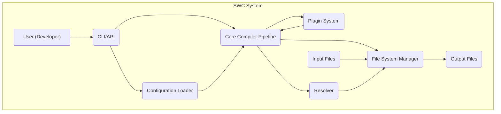
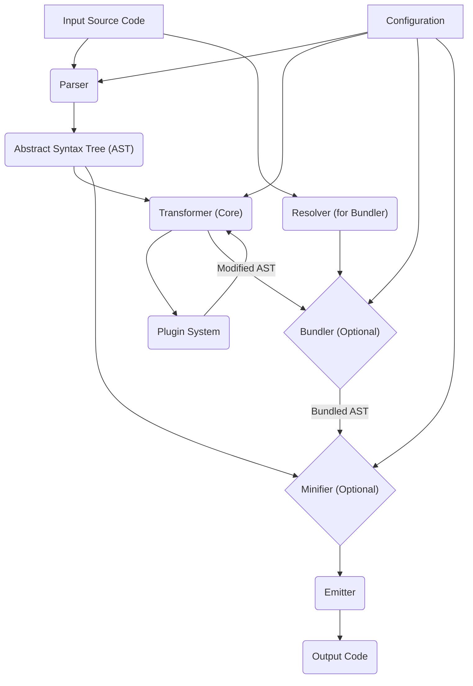

# Project Design Document: SWC (Speedy Web Compiler) - Improved

**Version:** 1.1
**Date:** October 26, 2023
**Author:** AI Software Architect

## 1. Introduction

This document provides an enhanced and more detailed design overview of the SWC (Speedy Web Compiler) project, based on the codebase at [https://github.com/swc-project/swc](https://github.com/swc-project/swc). This revision builds upon the previous version, offering greater clarity and depth regarding the system's architecture, components, data flow, and key technologies. This document remains intended as a foundation for subsequent threat modeling activities.

SWC is a high-performance platform designed for building next-generation JavaScript tooling. Leveraging the speed and efficiency of Rust, SWC offers significant performance improvements over traditional JavaScript-based tools. Its core functionalities encompass:

*   Transpilation: Converting modern JavaScript and TypeScript syntax to older, compatible versions.
*   Bundling: Combining multiple JavaScript modules and their dependencies into optimized bundles.
*   Minification: Reducing the size of JavaScript and CSS code by removing whitespace and shortening identifiers.
*   Compilation: Specifically for languages like TypeScript, compiling to JavaScript.
*   Code Analysis and Transformation: Providing a framework for custom code manipulation.

This document focuses on elucidating the core architecture, data flow, and extension points of SWC to facilitate a comprehensive understanding for security analysis.

## 2. Goals and Objectives

The fundamental goals driving the SWC project are:

*   **Exceptional Performance:** To deliver significantly faster JavaScript tooling compared to existing alternatives.
*   **Robust Extensibility:** To empower developers to extend SWC's capabilities through a well-defined plugin system.
*   **Broad Compatibility:** To ensure support for a wide spectrum of JavaScript and TypeScript language features and standards.
*   **Simplified Integration:** To provide a user-friendly and intuitive API for seamless integration into diverse build pipelines and workflows.

The objectives of this improved design document are:

*   To provide a more granular description of the major components within the SWC project.
*   To clearly illustrate the interactions and data transformations occurring between these components.
*   To explicitly identify the key technologies, dependencies, and extension points.
*   To serve as a robust and detailed foundation for conducting a thorough and effective threat model.

## 3. High-Level Architecture

SWC's architecture is organized into several key interacting components:

*   **User Interface (CLI/API):** The primary interface through which users interact with SWC. This includes both a command-line interface and a programmatic API.
*   **Configuration Loader:** Responsible for loading, merging, and validating configuration settings from various sources.
*   **Core Compiler Pipeline:** The central processing unit of SWC, encompassing parsing, transformation, and code generation.
*   **Plugin System:**  The mechanism for extending SWC's functionality through custom code transformations and analyses.
*   **File System Manager:** Handles all interactions with the file system, including reading input files and writing output.
*   **Resolver:** Responsible for resolving module specifiers and locating module files during the bundling process.

## 4. Detailed Component Descriptions

*   **User Interface (CLI/API):**
    *   **Command-Line Interface (CLI):** Provides executable commands for common tasks such as `swc compile`, `swc bundle`, and `swc minify`. Handles argument parsing and validation using libraries like `clap`.
    *   **Programmatic API:** Offers Rust crates and functions that allow developers to embed and utilize SWC's functionalities within other Rust applications or build tools. Provides a more granular level of control over the compilation process.
    *   **Error Reporting:**  Responsible for presenting clear and informative error messages to the user, including location and context.

*   **Configuration Loader:**
    *   **Configuration File Parsing:**  Parses configuration files such as `.swcrc`, `package.json` (for relevant SWC configurations), and potentially other formats.
    *   **Schema Validation:** Validates the loaded configuration against a predefined schema to ensure correctness and prevent unexpected behavior.
    *   **Configuration Merging:**  Merges configuration settings from different sources (e.g., command-line arguments, configuration files, default settings) with a defined precedence.
    *   **Environment Variable Handling:**  Allows for configuration values to be overridden or specified through environment variables.

*   **Core Compiler Pipeline:**
    *   **Parser:**  Takes source code (JavaScript or TypeScript) as input and transforms it into an Abstract Syntax Tree (AST) using libraries like `swc_ecma_parser`.
    *   **Transformer:**  Operates on the AST, applying a series of transformations. This includes:
        *   **Core Transformations:** Built-in transformations for syntax conversion (e.g., down-leveling ES6 features), optimization, and type removal (for TypeScript).
        *   **Plugin Integration:**  Provides an interface for plugins to hook into the transformation process and modify the AST.
    *   **Emitter:**  Takes the transformed AST and generates the output code (JavaScript). This involves traversing the AST and serializing it back into code, handling formatting and sourcemap generation.
    *   **Bundler:** (Potentially a sub-component or a separate but tightly integrated module) Analyzes module dependencies (using the Resolver), reads the necessary files, and combines them into a single or multiple output bundles. Handles various module formats (e.g., CommonJS, ES Modules).
    *   **Minifier:** (Potentially a sub-component or a separate but tightly integrated module) Reduces the size of the generated code by removing whitespace, shortening identifiers, and applying other code optimization techniques.

*   **Plugin System:**
    *   **Plugin Interface:** Defines a clear API (likely using Rust traits and FFI - Foreign Function Interface) that plugins must adhere to. This API allows plugins to interact with the AST and access compiler context.
    *   **Plugin Loading and Registration:**  Handles the dynamic loading of plugins based on configuration. Plugins can be implemented in Rust or potentially other languages through WASM.
    *   **AST Access and Manipulation:**  Provides plugins with access to the Abstract Syntax Tree, allowing them to inspect and modify the code structure.
    *   **Contextual Information:**  Provides plugins with access to relevant compiler context, such as configuration settings and file paths.

*   **File System Manager:**
    *   **Input File Reading:**  Provides a consistent interface for reading source code and other input files from the file system.
    *   **Output File Writing:**  Handles writing the generated output code and other artifacts (e.g., sourcemaps) to the file system.
    *   **Caching Mechanisms:**  May implement caching to improve performance by avoiding redundant file system operations.
    *   **Path Handling:**  Manages and sanitizes file paths to prevent potential security vulnerabilities like path traversal.

*   **Resolver:**
    *   **Module Specifier Resolution:**  Takes module specifiers (e.g., `import "lodash"`) and resolves them to absolute file paths based on configured module resolution algorithms (e.g., Node.js-style resolution).
    *   **Dependency Graph Construction:**  Builds a graph representing the dependencies between modules, which is crucial for bundling.
    *   **Package Management Integration:**  Interacts with package managers (like npm or yarn) to locate and resolve dependencies.

## 5. Data Flow

The typical flow of data through the SWC system is as follows:

1. **Input:** The user provides source code files and configuration options via the CLI or API.
2. **Configuration Loading:** The Configuration Loader loads and merges configuration settings from various sources, validating them against the schema.
3. **Parsing:** The Parser within the Core Compiler Pipeline reads the input source code files and generates an Abstract Syntax Tree (AST) for each file.
4. **Transformation:** The Transformer processes the AST. Core transformations are applied first, followed by any configured plugins, which can modify the AST.
5. **Module Resolution (if bundling):** If bundling is enabled, the Resolver analyzes import statements and resolves module specifiers to their corresponding file paths.
6. **Bundling (if enabled):** The Bundler reads the resolved module files, parses them into ASTs, and combines them into a single or multiple bundled ASTs.
7. **Minification (if enabled):** The Minifier processes the AST(s) to reduce code size.
8. **Emission:** The Emitter takes the final AST(s) and generates the output code, including any configured sourcemaps.
9. **Output:** The File System Manager writes the generated output files to the specified destination(s).

## 6. Technology Stack

The core technologies and significant libraries used in the SWC project include:

*   **Rust:** The primary programming language for the core compiler, CLI, and much of the infrastructure, providing performance and memory safety.
*   **JavaScript/TypeScript:** The target languages processed by SWC.
*   **WebAssembly (WASM):** SWC can be compiled to WASM, enabling its use in web browsers and other WASM environments, and potentially for plugin development.
*   **`swc_ecma_parser`:**  A Rust crate for parsing JavaScript and TypeScript code into an AST.
*   **`swc_ecma_codegen`:** A Rust crate for generating JavaScript code from an AST.
*   **`swc_ecma_transforms`:** A collection of Rust crates providing various AST transformation functionalities.
*   **`clap`:** A popular Rust crate for building command-line interfaces.
*   **Likely uses various other Rust crates:** For file system operations, string manipulation, error handling, and more.

## 7. Deployment Model

SWC can be deployed and utilized in various ways:

*   **Command-Line Interface (CLI) Tool:**  Installed globally or locally as a command-line executable, allowing direct invocation from the terminal.
*   **Library/Crate for Rust Projects:** Integrated as a dependency within other Rust projects, enabling programmatic access to its functionalities.
*   **Integration with JavaScript Build Tools:** Used as a core component or plugin within popular JavaScript build tools like Webpack, Rollup, Parcel, and esbuild. This often involves specific loaders or plugins that wrap SWC's functionality.
*   **WebAssembly (WASM) Module:** Deployed as a WASM module for execution in web browsers or other WASM runtimes, potentially for client-side code processing.

## 8. Security Considerations (Enhanced for Threat Modeling)

This section outlines potential security considerations to be addressed during threat modeling:

*   **Input Validation Vulnerabilities:**
    *   **Malicious Code Injection:** Crafted or malicious JavaScript/TypeScript code could exploit vulnerabilities in the parser or transformer, potentially leading to unexpected behavior or code execution.
    *   **Denial of Service (DoS):**  Extremely large or deeply nested code structures could overwhelm the parser, leading to resource exhaustion and denial of service.
*   **Plugin Security Risks:**
    *   **Malicious Plugins:**  Third-party plugins could contain malicious code that could compromise the build process or introduce vulnerabilities into the output code.
    *   **Plugin API Exploits:**  Vulnerabilities in the plugin API could allow malicious plugins to gain unauthorized access to system resources or manipulate the compilation process in unintended ways.
    *   **Supply Chain Attacks (Plugin Dependencies):** Plugins may have their own dependencies, which could introduce vulnerabilities.
*   **Configuration Vulnerabilities:**
    *   **Malicious Configuration Files:**  Compromised or maliciously crafted configuration files could alter the compiler's behavior, leading to the generation of vulnerable code or the execution of arbitrary commands.
    *   **Configuration Injection:**  Exploiting vulnerabilities to inject malicious configuration options.
*   **File System Access Vulnerabilities:**
    *   **Path Traversal:**  Vulnerabilities in file path handling could allow attackers to read or write files outside of the intended project directory.
    *   **Symlink Attacks:**  Exploiting symbolic links to access or modify unintended files.
*   **Dependency Management Vulnerabilities:**
    *   **Supply Chain Attacks (Rust Crates):**  Vulnerabilities in the Rust crates that SWC depends on could directly impact SWC's security.
    *   **Dependency Confusion:**  Attacks that exploit vulnerabilities in the dependency resolution process to substitute malicious packages.
*   **Output Security Considerations:**
    *   **Information Disclosure:**  Accidental inclusion of sensitive information in the generated output code or sourcemaps.
    *   **Code Injection (Less likely for a compiler but still a consideration):** In rare scenarios, vulnerabilities in the emitter could potentially lead to the generation of code with unintended execution paths.

## 9. Future Considerations

Potential future enhancements and considerations for SWC include:

*   **Enhanced Plugin Security Model:** Implementing stricter sandboxing or permission models for plugins.
*   **Improved Error Reporting and Diagnostics:** Providing more detailed and actionable error messages.
*   **Support for Emerging JavaScript/TypeScript Features:** Continuously updating to support the latest language standards.
*   **Performance Optimizations:**  Further refining the compiler for even greater speed and efficiency.
*   **Advanced Code Analysis Capabilities:**  Expanding the ability to perform static analysis and identify potential code issues.

This improved design document provides a more comprehensive and detailed understanding of the SWC project's architecture, facilitating a more thorough and effective threat modeling process.