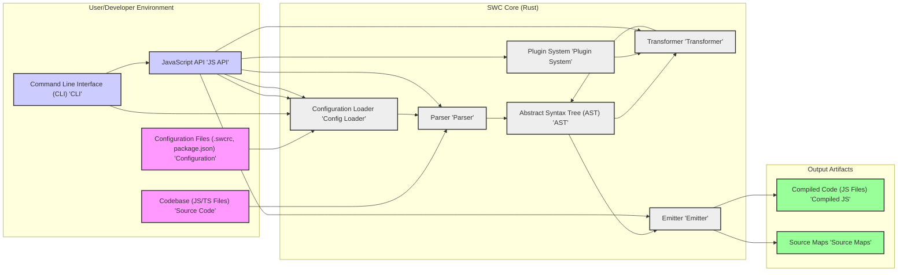
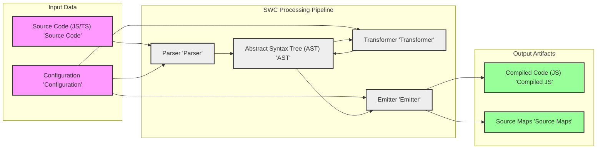

# Project Design Document: SWC (Speedy Web Compiler) - Improved

## 1. Project Overview

### 1.1. Project Name
SWC (Speedy Web Compiler)

### 1.2. Project Description
SWC is a high-performance, extensible, and open-source platform for code compilation, primarily targeting JavaScript and TypeScript. It is designed as a significantly faster alternative to existing JavaScript compilers like Babel, especially for large projects. Written in Rust for optimal performance, SWC provides both a command-line interface (CLI) and a JavaScript API, enabling seamless integration into diverse JavaScript development workflows and build systems. SWC's modular architecture and plugin system facilitate customization and extension, allowing users to tailor the compiler to specific project needs.

### 1.3. Project Goals
*   **Performance Leadership:** Achieve and maintain significantly faster JavaScript and TypeScript compilation speeds compared to industry-standard tools like Babel.
*   **Extensibility and Customization:** Provide a robust plugin system and comprehensive configuration options to enable users to customize and extend SWC's functionality for diverse use cases.
*   **Standards Compliance and Compatibility:** Ensure full compatibility with the latest JavaScript and TypeScript language standards and seamlessly integrate with existing JavaScript ecosystems and tooling.
*   **Effortless Integration:** Offer user-friendly APIs (JavaScript and CLI) for straightforward integration into various development workflows, build tools (Webpack, Parcel, Rollup), and CI/CD pipelines.
*   **Reliability and Accuracy:** Guarantee reliable and accurate compilation across a broad spectrum of JavaScript and TypeScript codebases, minimizing errors and ensuring consistent output.
*   **Open Source and Community Driven:** Foster an active and engaged open-source community to drive development, provide support, and ensure the long-term sustainability of the project.

### 1.4. Target Users
*   **Frontend Web Developers:** Developers building web applications using JavaScript and TypeScript who require fast compilation for efficient development cycles.
*   **Backend Node.js Developers:** Developers working on server-side JavaScript applications where build speed impacts development and deployment times.
*   **Build Tool and Framework Developers:** Developers of build tools (like Webpack, Parcel, Rollup, esbuild) and JavaScript frameworks (like React, Vue, Angular) seeking a high-performance compiler to integrate into their projects.
*   **Library Authors:** Authors of reusable JavaScript and TypeScript libraries who need to compile their code for distribution to various environments.
*   **Large Enterprises with Monorepos:** Organizations managing large JavaScript/TypeScript codebases in monorepos where compilation time is a significant bottleneck in development and CI/CD.
*   **Performance-Sensitive Applications:** Projects where compilation speed directly impacts developer productivity and overall project timelines.

## 2. System Architecture

### 2.1. High-Level Architecture Diagram

### 2.2. Component Description

*   **Parser ('Parser'):**
    *   **Functionality:**  Parses JavaScript and TypeScript source code into an Abstract Syntax Tree (AST).
    *   **Input:** JavaScript or TypeScript source code as text.
    *   **Output:** Abstract Syntax Tree (AST) representing the parsed code structure.
    *   **Details:**
        *   Written in Rust for performance and memory safety.
        *   Supports ECMAScript standards up to the latest versions (including ESNext proposals).
        *   Supports TypeScript syntax, including language features like decorators, namespaces, and type annotations.
        *   Designed to be resilient to syntax errors and provide informative error messages.
        *   Focuses on speed and efficiency to minimize parsing overhead.

*   **Transformer ('Transformer'):**
    *   **Functionality:** Transforms the AST based on user-defined configurations and plugins. This component performs the core compilation logic.
    *   **Input:** Abstract Syntax Tree (AST).
    *   **Output:** Transformed Abstract Syntax Tree (AST).
    *   **Details:**
        *   Highly configurable through `.swcrc` and API options.
        *   Performs various transformations, including:
            *   **Transpilation:** Converting modern JavaScript/TypeScript syntax to older ECMAScript versions (e.g., ES6 to ES5) for browser compatibility.
            *   **Syntax Transformations:** Handling JSX syntax, decorators, class properties, and other syntax extensions.
            *   **Module Transformation:** Converting between different module formats (e.g., CommonJS, AMD, ESM).
            *   **Minification (via plugins or built-in):** Reducing code size by removing whitespace, shortening variable names, etc.
            *   **Tree-shaking (via plugins or built-in):** Eliminating dead code to reduce bundle size.
            *   **Optimization (via plugins):** Applying custom code optimizations.
        *   Extensible through the Plugin System, allowing users to add custom transformations.

*   **Emitter ('Emitter'):**
    *   **Functionality:** Generates JavaScript code from the transformed AST. Also responsible for generating source maps.
    *   **Input:** Transformed Abstract Syntax Tree (AST).
    *   **Output:** JavaScript code as text, and optionally source maps (`.js.map` files).
    *   **Details:**
        *   Converts the AST back into valid JavaScript code.
        *   Generates code optimized for readability or size based on configuration (e.g., minified output).
        *   Produces accurate source maps that map compiled code back to the original source code lines and columns, facilitating debugging.
        *   Handles code formatting and indentation based on configuration settings.

*   **AST (Abstract Syntax Tree) ('AST'):**
    *   **Functionality:**  A tree-like data structure representing the syntactic structure of the parsed source code. Serves as the central intermediate representation within SWC.
    *   **Input:** Output from the Parser, Input to Transformer and Emitter.
    *   **Output:** Input to Transformer and Emitter.
    *   **Details:**
        *   SWC uses its own AST format, designed for performance and efficient manipulation in Rust.
        *   Provides a structured and programmable representation of the code, enabling transformations and analysis.
        *   The AST is mutable, allowing transformers and plugins to modify the code structure directly.

*   **Configuration Loader ('Config Loader'):**
    *   **Functionality:** Loads, merges, and validates configuration settings from various sources to determine SWC's behavior.
    *   **Input:** Configuration files (`.swcrc`, `package.json`), command-line arguments, JavaScript API options.
    *   **Output:** Merged and validated configuration object used by other SWC components.
    *   **Details:**
        *   Configuration sources are loaded in a specific order of precedence (e.g., command-line arguments override config files).
        *   Supports `.swcrc` files in the project root and parent directories, allowing for project-specific and global configurations.
        *   Reads configuration from `swc` section in `package.json`.
        *   Validates configuration options to ensure they are valid and consistent.
        *   Provides default configurations when no explicit configuration is provided.

*   **Plugin System ('Plugin System'):**
    *   **Functionality:** Enables users to extend SWC's functionality by writing and integrating custom plugins. Plugins can modify the AST during the transformation process.
    *   **Input:** Plugin code (JavaScript or WebAssembly modules).
    *   **Output:** Modified AST (as a result of plugin execution).
    *   **Details:**
        *   Supports both JavaScript and WebAssembly plugins for flexibility and performance.
        *   Plugins can hook into different stages of the transformation process, allowing for fine-grained control.
        *   Plugins can perform custom code transformations, optimizations, or integrate with external tools.
        *   Plugin API provides access to the AST and SWC's internal functionalities.
        *   Plugin discovery and loading mechanisms are in place to easily integrate plugins into the compilation process.

*   **Command Line Interface (CLI) ('CLI'):**
    *   **Functionality:** Provides a command-line interface for users to interact with SWC directly from the terminal.
    *   **Input:** Command-line arguments, configuration files, source code files or directories.
    *   **Output:** Compiled JavaScript files, source maps, and command-line output (logs, errors, progress).
    *   **Details:**
        *   Allows users to compile single files or entire directories of code.
        *   Supports various command-line options for configuration, plugin management, output control, and more.
        *   Provides informative error messages and logging for debugging and monitoring.
        *   Common commands include `swc <input> -o <output>`, `swc compile`, `swc watch`.

*   **JavaScript API ('JS API'):**
    *   **Functionality:** Exposes a JavaScript API that allows programmatic access to SWC's compilation functionalities from within JavaScript code.
    *   **Input:** JavaScript code invoking the API, configuration options passed as JavaScript objects.
    *   **Output:** Compiled JavaScript code, source maps, and API return values (e.g., compilation results, errors).
    *   **Details:**
        *   Designed for integration into build tools, testing frameworks, and other JavaScript-based workflows.
        *   Key API functions include `transform`, `transformFileSync`, `transformSync`, `compile`, etc.
        *   Allows for fine-grained control over compilation options and plugin configuration.
        *   Provides asynchronous and synchronous API methods for different use cases.

## 3. Data Flow

### 3.1. Compilation Data Flow Diagram

### 3.2. Data Flow Description

1.  **Input Stage:** The compilation process begins with two primary inputs:
    *   **Source Code:** JavaScript or TypeScript files that need to be compiled.
    *   **Configuration:** Settings that dictate how SWC should perform the compilation, loaded from configuration files, command-line arguments, or API options.
2.  **Parsing Stage:** The Parser component receives the source code and configuration. It analyzes the source code and transforms it into an Abstract Syntax Tree (AST). The configuration influences parsing behavior (e.g., TypeScript syntax parsing).
3.  **Transformation Stage:** The Transformer component takes the AST and configuration as input. It traverses and modifies the AST based on the specified transformations and active plugins. This stage can involve multiple passes over the AST to apply various transformations sequentially. The configuration and plugins heavily influence the transformations applied.
4.  **Emission Stage:** The Emitter component receives the transformed AST and configuration. It walks through the AST and generates JavaScript code based on the tree structure. It also generates source maps that correspond to the transformations applied, using configuration settings to determine source map generation options.
5.  **Output Stage:** The final output of the compilation process consists of:
    *   **Compiled JavaScript Code:** JavaScript files containing the compiled code, written to the specified output directory.
    *   **Source Maps (Optional):** Source map files that map the compiled code back to the original source code, enabling debugging in browser developer tools or other debuggers.

## 4. Deployment Architecture

### 4.1. Deployment Environment

*   **Local Developer Machines:** SWC is primarily used by developers on their local machines during development. They use the CLI for ad-hoc compilation or integrate the JavaScript API into local build scripts and development servers.
*   **Continuous Integration/Continuous Deployment (CI/CD) Pipelines:** SWC is commonly integrated into CI/CD pipelines to automate the build process. Build agents in CI/CD environments execute SWC to compile code as part of the build and deployment workflow.
*   **Build Servers and Farms:** In larger organizations, dedicated build servers or build farms may be used to perform compilation tasks. SWC can be deployed on these servers to handle compilation for multiple projects or developers.
*   **Cloud-Based Build Environments:** SWC can be utilized in cloud-based build environments, such as cloud CI/CD services (GitHub Actions, GitLab CI, CircleCI, Jenkins in the cloud) or serverless functions that require on-demand code compilation.
*   **Serverless Functions (Edge Compute):** In some edge computing scenarios or serverless functions, SWC might be used to compile code dynamically at runtime or during deployment to optimize for specific environments.

### 4.2. Runtime Environment

*   **Node.js Runtime:** SWC's CLI and JavaScript API are designed to run within a Node.js environment. Node.js provides the JavaScript runtime necessary to execute the JavaScript wrapper around the core Rust compiler.
*   **Native Binaries (Rust Core):** The core compilation logic of SWC is implemented in Rust and compiled into native binaries for different operating systems and architectures. These binaries are invoked by the Node.js wrapper for actual compilation tasks.

### 4.3. Distribution

*   **npm (Node Package Manager):** SWC is primarily distributed as npm packages. Users typically install SWC and its related packages (CLI, core, plugins) using npm or yarn. This is the most common distribution method for JavaScript developers.
*   **Standalone Binaries (Platform-Specific):** SWC also provides pre-compiled standalone binaries for various platforms (macOS, Linux, Windows). These binaries can be downloaded and used directly, potentially bypassing the need for Node.js in certain limited scenarios (though Node.js is generally required for full functionality, especially the CLI and API).
*   **Container Images (Docker):** SWC can be packaged into Docker container images for consistent and reproducible build environments. These images can be used in CI/CD pipelines or local development using containerization.

## 5. Security Considerations (Detailed)

### 5.1. Input Validation and Sanitization
*   **Source Code Parsing Vulnerabilities:**
    *   **Threat:** Maliciously crafted JavaScript/TypeScript code could exploit vulnerabilities in the Parser, leading to crashes, unexpected behavior, or even remote code execution if parsing logic is flawed.
    *   **Mitigation:** Rigorous testing of the Parser with a wide range of valid and invalid code, including fuzzing techniques. Regular updates to the parser to address discovered vulnerabilities. Input sanitization is less relevant here as the parser is designed to handle all valid syntax, but error handling and preventing crashes are key.
*   **Configuration Injection and Manipulation:**
    *   **Threat:** Malicious configuration files or command-line arguments could be crafted to inject malicious code or manipulate SWC's behavior in unintended ways. For example, path traversal vulnerabilities if configuration allows specifying output paths without proper validation.
    *   **Mitigation:** Strict validation of all configuration inputs (files, CLI arguments, API options). Input sanitization to prevent path traversal or command injection. Principle of least privilege for file system access based on configuration.

### 5.2. Plugin Security Risks
*   **Malicious Plugins:**
    *   **Threat:** Malicious plugins, especially if sourced from untrusted repositories, could contain malicious code that compromises the system during compilation. This could include data exfiltration, system compromise, or supply chain attacks.
    *   **Mitigation:** Plugin sandboxing and isolation to limit plugin access to system resources and sensitive data. Code review and security audits of popular or officially recommended plugins. Plugin signing and verification mechanisms to ensure plugin integrity and origin (future consideration). Encourage users to only use plugins from trusted sources.
*   **Plugin Vulnerabilities:**
    *   **Threat:** Even well-intentioned plugins might contain vulnerabilities (e.g., bugs in their transformation logic) that could be exploited.
    *   **Mitigation:** Encourage plugin developers to follow secure coding practices. Provide plugin development guidelines and security best practices. Community review and vulnerability reporting mechanisms for plugins.

### 5.3. Dependency Management and Supply Chain Security
*   **Dependency Vulnerabilities (Rust and JavaScript):**
    *   **Threat:** SWC relies on both Rust and JavaScript dependencies. Vulnerabilities in these dependencies could be exploited to compromise SWC.
    *   **Mitigation:** Regular scanning of dependencies for known vulnerabilities using vulnerability scanning tools (e.g., `cargo audit` for Rust, `npm audit` or `yarn audit` for JavaScript). Keeping dependencies up-to-date with security patches. Dependency pinning to ensure consistent and tested dependency versions.
*   **Supply Chain Attacks:**
    *   **Threat:** Compromised dependencies in the supply chain (e.g., malicious code injected into a dependency package on npm or crates.io) could introduce vulnerabilities into SWC.
    *   **Mitigation:** Using dependency checksum verification to ensure the integrity of downloaded dependencies. Monitoring dependency sources for security advisories. Consider using dependency mirrors or private registries for more control over the supply chain.

### 5.4. Output Integrity and Code Generation Security
*   **Code Generation Bugs Leading to Vulnerabilities:**
    *   **Threat:** Bugs in the Emitter component could lead to the generation of incorrect or insecure JavaScript code. This could introduce vulnerabilities in the compiled application, such as XSS vulnerabilities, logic errors, or security bypasses.
    *   **Mitigation:** Thorough testing of the Emitter with a wide range of AST structures and code patterns. Code review and static analysis of the Emitter code. Fuzzing techniques to identify potential code generation bugs.
*   **Source Map Security and Information Leakage:**
    *   **Threat:** Source maps, if not handled carefully, could inadvertently expose sensitive information about the source code, file system structure, or internal logic of the application.
    *   **Mitigation:** Careful configuration of source map generation to minimize information leakage. Avoid including absolute paths or sensitive data in source maps. Consider options to strip or obfuscate source maps in production environments if they are not needed for debugging.

### 5.5. Access Control and File System Security
*   **File System Access Permissions:**
    *   **Threat:** If SWC is run with excessive file system permissions, it could potentially be exploited to access or modify files outside of its intended scope.
    *   **Mitigation:** Run SWC with the principle of least privilege. Ensure that SWC only has the necessary file system permissions to read source files, configuration files, and write output files. Avoid running SWC as root or with overly permissive user accounts.
*   **Time-of-Check Time-of-Use (TOCTOU) Vulnerabilities:**
    *   **Threat:** In scenarios where SWC interacts with the file system, TOCTOU vulnerabilities could arise if file access checks are not properly synchronized with file operations.
    *   **Mitigation:** Implement proper file locking and synchronization mechanisms to prevent TOCTOU vulnerabilities when accessing and modifying files.

### 5.6. Denial of Service (DoS) Attacks
*   **Resource Exhaustion via Malicious Input:**
    *   **Threat:** Maliciously crafted input code, configuration files, or plugins could be designed to consume excessive resources (CPU, memory, disk I/O), leading to denial-of-service conditions.
    *   **Mitigation:** Implement resource limits and quotas for compilation processes. Input validation to detect and reject excessively large or complex inputs. Rate limiting or throttling mechanisms if SWC is exposed to untrusted input in a service environment.
*   **Compiler Bugs Leading to Infinite Loops or Excessive Resource Usage:**
    *   **Threat:** Bugs in the Parser, Transformer, or Emitter could potentially lead to infinite loops or excessive resource consumption when processing certain inputs.
    *   **Mitigation:** Thorough testing and debugging of SWC components to identify and fix potential infinite loop or resource exhaustion bugs. Timeout mechanisms to prevent compilation processes from running indefinitely.

## 6. Technology Stack

*   **Core Language:** Rust (for performance, memory safety, and concurrency)
*   **Target Languages:** JavaScript and TypeScript (for compilation and transformation)
*   **Runtime Environment (CLI & API):** Node.js (for JavaScript API, CLI interface, and ecosystem integration)
*   **Package Manager:** npm (Node Package Manager) for distribution of JavaScript packages and dependencies
*   **Build System (for SWC itself):** Cargo (Rust's build system and package manager)
*   **WebAssembly (WASM):** Potential support for WebAssembly plugins to enhance performance and enable cross-language plugin development.

## 7. Glossary

*   **AST (Abstract Syntax Tree):** A hierarchical tree representation of the syntactic structure of source code, used as an intermediate representation in compilers.
*   **Transpilation:** The process of converting source code from one version of a language to another, or from one language to a similar language (e.g., TypeScript to JavaScript, modern JavaScript to older JavaScript versions).
*   **Emitter:** The compiler component responsible for generating output code (e.g., JavaScript) from an intermediate representation like an AST.
*   **Plugin:** An extension module that adds custom functionality to SWC, typically by modifying the AST during the transformation phase, allowing for user-defined transformations and optimizations.
*   **CLI (Command Line Interface):** A text-based interface for interacting with SWC directly from the terminal, used for compiling code and managing configurations.
*   **API (Application Programming Interface):** A programmatic interface (JavaScript API in this case) for interacting with SWC from other software, enabling integration into build tools and workflows.
*   **Source Map:** A file that maps lines and columns of code in compiled JavaScript back to their original locations in the source code, facilitating debugging of compiled code.
*   **Tree-shaking:** A form of dead code elimination that removes unused exports from JavaScript modules to reduce bundle size.
*   **Minification:** The process of removing unnecessary characters (whitespace, comments) and shortening variable names in code to reduce its size, improving loading and execution performance.
*   **ECMAScript:** The standardized specification for JavaScript.
*   **ESNext:** Refers to the latest and upcoming features in the ECMAScript standard.

This improved document provides a more detailed and comprehensive design overview of the SWC project, specifically enhanced for threat modeling purposes. The expanded security considerations section offers a more in-depth analysis of potential threats and mitigation strategies, making it a more robust foundation for security assessments and threat modeling activities.