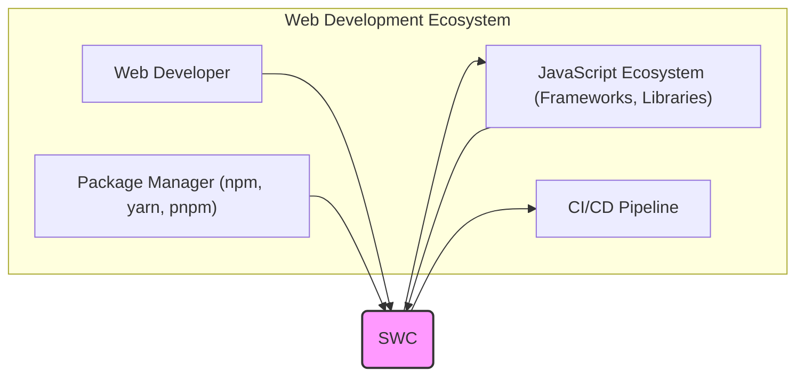
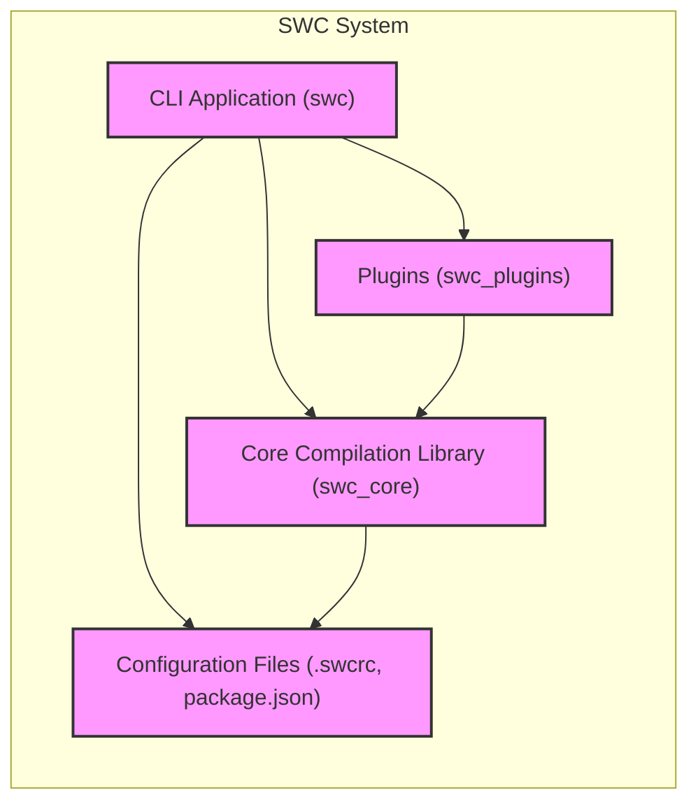
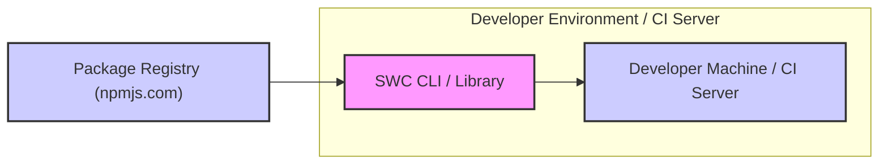

# BUSINESS POSTURE

This project, Speedy Web Compiler (SWC), aims to provide a high-performance compiler for web development, specifically targeting JavaScript and TypeScript. The primary business priority is to offer a significantly faster alternative to existing JavaScript tooling like Babel and Terser. The main business goal is to improve developer productivity and reduce build times in web development workflows.

The most important business risks associated with this project are:

- Adoption risk: The risk that developers may not adopt SWC as their primary compiler due to inertia, compatibility issues, or lack of awareness.
- Compatibility risk: The risk that SWC may not be fully compatible with all existing JavaScript and TypeScript ecosystems, frameworks, and libraries, leading to integration challenges for users.
- Performance regression risk: The risk that future updates or changes to SWC may inadvertently degrade its performance, undermining its core value proposition.
- Security vulnerability risk: The risk that security vulnerabilities in SWC itself could be exploited, potentially impacting the security of applications built using it. Given its role in the build process, vulnerabilities could have a wide-reaching impact.

# SECURITY POSTURE

Existing security controls for the SWC project include:

- security control: Code review - As an open-source project hosted on GitHub, code contributions are likely subject to review by maintainers before being merged. This is implicitly implemented through the GitHub pull request process.
- security control: Static analysis - The Rust programming language, in which SWC is written, has a strong compiler with built-in static analysis capabilities. Rust's type system and borrow checker help prevent many common classes of vulnerabilities. This is implemented by the Rust compiler during development and build processes.
- security control: Dependency management - Rust projects use Cargo for dependency management, which includes mechanisms for tracking and managing dependencies. This is implemented through Cargo.toml and Cargo.lock files.

Accepted risks for the SWC project include:

- accepted risk: Open-source vulnerability disclosure - As an open-source project, vulnerabilities may be publicly disclosed before a patch is available. This is inherent to the open-source development model.

Recommended security controls to implement for high priority:

- security control: Regular security audits - Conduct periodic security audits by external security experts to identify potential vulnerabilities in the codebase and architecture.
- security control: Fuzzing and vulnerability scanning - Implement automated fuzzing and vulnerability scanning tools in the CI/CD pipeline to proactively detect potential security issues.
- security control: Supply chain security measures - Implement measures to ensure the security of dependencies, such as dependency scanning, vulnerability monitoring, and using signed dependencies where possible.

Security requirements for the SWC project are:

- Authentication: Not directly applicable to the core functionality of SWC as it is primarily a command-line tool used in development environments. Authentication might be relevant for access to project infrastructure (e.g., repository, build systems), which should follow standard secure practices.
- Authorization: Not directly applicable to the core functionality of SWC. Authorization is relevant for access control to project resources and infrastructure, which should be managed using role-based access control (RBAC) principles.
- Input Validation: Input validation is critical for SWC. As a compiler, it processes potentially untrusted source code and configuration files. Robust input validation is necessary to prevent vulnerabilities such as code injection, denial-of-service, or unexpected behavior due to maliciously crafted input. Input validation should be implemented at all stages of input processing, including file parsing, configuration loading, and code transformation.
- Cryptography: Cryptography is not a core requirement for the primary compilation functionality of SWC. However, cryptography might be relevant for features related to secure distribution (e.g., code signing of binaries) or for future features that might involve secure processing or handling of sensitive data (though this is not currently a primary use case). If cryptography is used, it should adhere to best practices, using well-vetted libraries and algorithms.

# DESIGN

The SWC project is designed as a command-line interface (CLI) tool and a set of libraries for compiling and transforming JavaScript and TypeScript code. It is built using Rust for performance and safety.

## C4 CONTEXT

Elements of the context diagram:

- Name: Web Developer
  - Type: Person
  - Description: Developers who use SWC to compile and transform JavaScript and TypeScript code as part of their web development workflow.
  - Responsibilities: Uses SWC to improve build times and development efficiency. Configures SWC for specific project needs.
  - Security controls: Responsible for securely configuring and using SWC within their development environment.

- Name: Package Manager (npm, yarn, pnpm)
  - Type: External System
  - Description: Package managers used to install and manage SWC as a dependency in web development projects.
  - Responsibilities: Distributes SWC packages. Provides a mechanism for developers to install and update SWC.
  - Security controls: Package managers implement security controls such as package signing and vulnerability scanning to ensure the integrity and security of packages they distribute.

- Name: JavaScript Ecosystem (Frameworks, Libraries)
  - Type: External System
  - Description: The broader JavaScript and TypeScript ecosystem, including frameworks (React, Angular, Vue), libraries, and standards that SWC needs to be compatible with.
  - Responsibilities: Defines the standards and conventions that SWC must adhere to for compatibility.
  - Security controls: Security of the JavaScript ecosystem is a shared responsibility. SWC aims to be compatible with secure and widely adopted ecosystem practices.

- Name: CI/CD Pipeline
  - Type: External System
  - Description: Continuous Integration and Continuous Deployment pipelines where SWC is used as part of the build process to compile and optimize code before deployment.
  - Responsibilities: Automates the build, test, and deployment process, including invoking SWC for code compilation.
  - Security controls: CI/CD pipelines should implement security controls such as secure build environments, access control, and vulnerability scanning to ensure the security of the deployment process.

- Name: SWC
  - Type: System
  - Description: Speedy Web Compiler - a fast compiler for JavaScript and TypeScript, written in Rust.
  - Responsibilities: Compiles and transforms JavaScript and TypeScript code according to user configurations and ecosystem standards. Provides a CLI and libraries for integration into development workflows.
  - Security controls: Implements input validation, secure coding practices, and aims to mitigate potential vulnerabilities in code compilation and transformation.

## C4 CONTAINER

Elements of the container diagram:

- Name: CLI Application (swc)
  - Type: Application
  - Description: The command-line interface application that users interact with directly to invoke SWC for compilation and transformation. Written in Rust.
  - Responsibilities: Provides a command-line interface for users. Parses command-line arguments and configuration files. Orchestrates the compilation process using the core library and plugins. Handles input and output operations.
  - Security controls: Input validation of command-line arguments and configuration file paths. Secure handling of file system operations.

- Name: Core Compilation Library (swc_core)
  - Type: Library
  - Description: The core compilation library written in Rust that performs the main JavaScript and TypeScript parsing, transformation, and code generation.
  - Responsibilities: Implements the core compilation logic. Provides APIs for parsing, transforming, and generating code. Manages the Abstract Syntax Tree (AST) and compilation pipeline.
  - Security controls: Robust input validation of source code. Secure coding practices to prevent vulnerabilities in parsing and transformation logic. Memory safety provided by Rust.

- Name: Plugins (swc_plugins)
  - Type: Library/Plugin System
  - Description: A plugin system that allows extending SWC's functionality with custom transformations and optimizations. Plugins can be written in Rust or potentially WASM.
  - Responsibilities: Provides an extension mechanism for SWC. Allows users to add custom compilation steps.
  - Security controls: Plugin isolation to prevent malicious plugins from compromising the core system. Input validation for plugin configurations and plugin code. Secure plugin loading and execution mechanisms.

- Name: Configuration Files (.swcrc, package.json)
  - Type: Data Store
  - Description: Configuration files used to customize SWC's behavior, including compilation options, plugin configurations, and target environments.
  - Responsibilities: Stores user-defined configurations for SWC.
  - Security controls: Input validation of configuration file content to prevent malicious configurations. Secure file access controls to protect configuration files from unauthorized modification.

## DEPLOYMENT

SWC is primarily deployed as a command-line tool and a library that developers install and use in their local development environments and CI/CD pipelines. The most common deployment method is via package managers like npm, yarn, or pnpm.

Deployment Architecture: Package Manager Distribution

Elements of the deployment diagram:

- Name: Developer Machine / CI Server
  - Type: Environment
  - Description: The local development machine of a web developer or a Continuous Integration server where SWC is installed and used.
  - Responsibilities: Executes SWC to compile and transform code. Provides the environment for running SWC.
  - Security controls: Security of the developer machine or CI server is the responsibility of the user or organization. This includes operating system security, access controls, and secure configuration.

- Name: SWC CLI / Library
  - Type: Software
  - Description: The SWC command-line interface and library installed on the developer machine or CI server.
  - Responsibilities: Performs code compilation and transformation. Executes as a process within the developer environment or CI server.
  - Security controls: Implements security controls as described in previous sections (input validation, secure coding, etc.). Operates within the security context of the environment it is deployed in.

- Name: Package Registry (npmjs.com)
  - Type: External Service
  - Description: A package registry like npmjs.com where SWC packages are published and distributed.
  - Responsibilities: Hosts and distributes SWC packages. Provides a public repository for SWC releases.
  - Security controls: Package registries implement security controls such as package signing, malware scanning, and access control to protect the integrity and security of packages they host.

## BUILD

The SWC build process is designed to produce distributable artifacts, primarily npm packages. The build process should incorporate security checks to ensure the integrity and security of the final artifacts.

```mermaid
graph LR
    A["Developer"] --> B("Code Changes");
    B --> C["GitHub Repository"];
    C --> D["GitHub Actions CI"];
    D --> E["Build & Test"];
    E --> F["Security Checks (SAST, Linters, Dependency Scan)"];
    F --> G["Artifacts (npm package)"];
    G --> H["Package Registry (npm)"];

    style A fill:#ccf,stroke:#333,stroke-width:2px
    style B fill:#f9f,stroke:#333,stroke-width:2px
    style C fill:#ccf,stroke:#333,stroke-width:2px
    style D fill:#ccf,stroke:#333,stroke-width:2px
    style E fill:#f9f,stroke:#333,stroke-width:2px
    style F fill:#f9f,stroke:#333,stroke-width:2px
    style G fill:#f9f,stroke:#333,stroke-width:2px
    style H fill:#ccf,stroke:#333,stroke-width:2px
```

Elements of the build diagram:

- Name: Developer
  - Type: Person
  - Description: Developers who contribute code changes to the SWC project.
  - Responsibilities: Writes code, fixes bugs, and implements new features. Commits code changes to the GitHub repository.
  - Security controls: Responsible for writing secure code and following secure development practices. Code changes are subject to code review.

- Name: Code Changes
  - Type: Data
  - Description: Source code modifications made by developers.
  - Responsibilities: Represents the input to the build process.
  - Security controls: Code changes are tracked and versioned in the GitHub repository.

- Name: GitHub Repository
  - Type: Code Repository
  - Description: The central repository hosted on GitHub that stores the SWC source code and project history.
  - Responsibilities: Version control, code storage, collaboration platform.
  - Security controls: Access control to the repository, branch protection rules, audit logs.

- Name: GitHub Actions CI
  - Type: CI/CD System
  - Description: GitHub Actions is used for Continuous Integration to automate the build, test, and security check processes.
  - Responsibilities: Automates the build pipeline. Executes build scripts, tests, and security checks.
  - Security controls: Secure build environment, access control to CI configurations, audit logs of CI activities.

- Name: Build & Test
  - Type: Process
  - Description: The build and test stage in the CI pipeline. This involves compiling the Rust code, running unit tests, and integration tests.
  - Responsibilities: Compiles the SWC project. Executes automated tests to ensure code quality and functionality.
  - Security controls: Secure build environment, dependency management, test isolation.

- Name: Security Checks (SAST, Linters, Dependency Scan)
  - Type: Process
  - Description: Security checks integrated into the CI pipeline. This includes Static Application Security Testing (SAST) tools, linters, and dependency vulnerability scanning.
  - Responsibilities: Identifies potential security vulnerabilities in the code and dependencies. Enforces code quality standards.
  - Security controls: Configuration of security tools, vulnerability reporting, integration with CI pipeline for automated checks.

- Name: Artifacts (npm package)
  - Type: Software Artifact
  - Description: The build output, primarily npm packages, ready for distribution.
  - Responsibilities: Distributable software package.
  - Security controls: Package signing, integrity checks, vulnerability scanning of dependencies included in the package.

- Name: Package Registry (npm)
  - Type: Package Repository
  - Description: npm registry where SWC packages are published for public consumption.
  - Responsibilities: Distributes SWC packages to users.
  - Security controls: Package signing, malware scanning, access control to publishing accounts.

# RISK ASSESSMENT

Critical business process being protected: The software development and build process for web applications, specifically the code compilation and transformation step. SWC aims to make this process faster and more efficient.

Data being protected: Source code and configuration files processed by SWC. Sensitivity: High. Source code is intellectual property and vulnerabilities in the compiler can lead to compromised applications. Configuration files can contain sensitive settings or influence the behavior of the compiled application.

Data sensitivity classification: Confidential and Integrity are the primary concerns. Confidentiality of source code and integrity of the compiled output are crucial. Availability is also important to ensure developers can rely on SWC for their build processes.

# QUESTIONS & ASSUMPTIONS

Questions:

- What specific SAST tools and linters are currently used in the SWC build process?
- Is dependency vulnerability scanning currently implemented in the CI pipeline? If so, which tools are used?
- Are there plans for regular security audits by external security experts?
- What is the process for handling and patching security vulnerabilities discovered in SWC?
- Are there any specific guidelines or documentation for developers contributing to SWC regarding secure coding practices?

Assumptions:

- BUSINESS POSTURE: It is assumed that the primary business goal of SWC is to provide a faster and more efficient compiler for web development, and that adoption and compatibility are key business risks.
- SECURITY POSTURE: It is assumed that while basic security controls are in place (code review, static analysis), there is room for improvement in proactive security measures like regular security audits, fuzzing, and more comprehensive supply chain security.
- DESIGN: It is assumed that the C4 model accurately represents the high-level architecture of SWC, and that the deployment model is primarily focused on distribution via package managers. It is also assumed that GitHub Actions is used for CI/CD.