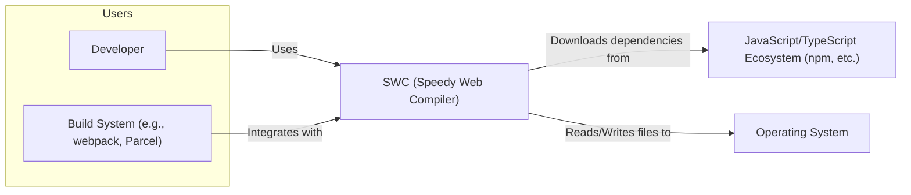
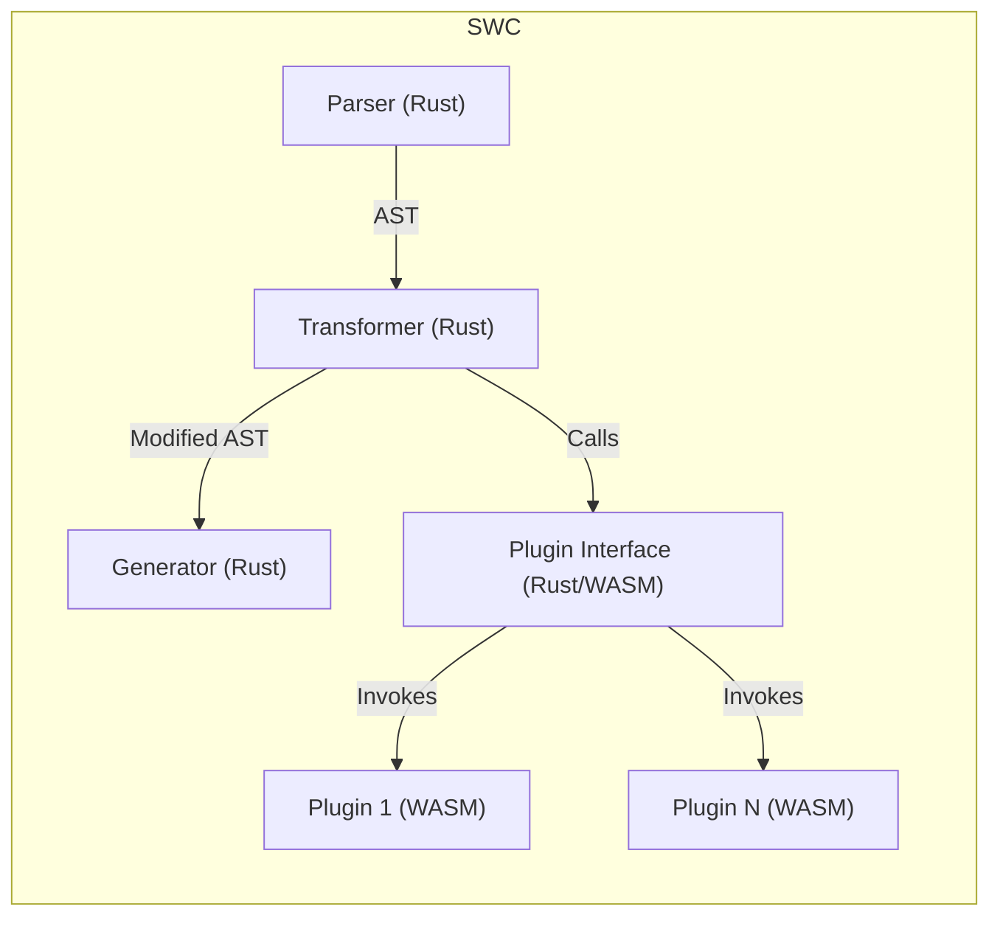
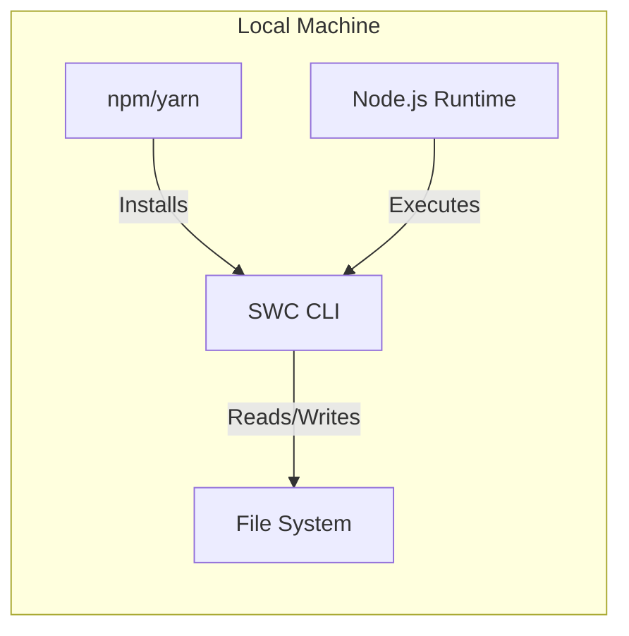
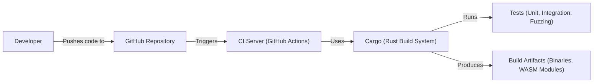

Okay, let's create a design document for the SWC project, focusing on aspects relevant for threat modeling.

# BUSINESS POSTURE

SWC (Speedy Web Compiler) is a Rust-based platform for the next generation of fast developer tools.  It's primarily used as a faster alternative to Babel for compiling/transpiling JavaScript and TypeScript code.  The core business priorities appear to be:

*   Performance:  Provide significantly faster compilation/transpilation than existing solutions (primarily Babel). This is the main selling point and competitive advantage.
*   Developer Experience: Offer a smooth, easy-to-use toolchain that integrates well with existing JavaScript/TypeScript workflows.  This includes ease of installation, configuration, and use.
*   Extensibility: Allow for plugins and integrations to expand functionality and cater to a wide range of use cases within the web development ecosystem.
*   Maintainability:  Ensure the codebase is maintainable and scalable to accommodate future growth and evolving web standards.
*   Community Adoption:  Grow a strong community of users and contributors to ensure the project's long-term viability and success.

Based on these priorities, the most important business risks are:

*   Performance Degradation:  Any changes that significantly reduce performance could undermine the core value proposition.
*   Compatibility Issues:  Inability to correctly process valid JavaScript/TypeScript code, or to integrate with common build tools and frameworks, would severely limit adoption.
*   Security Vulnerabilities:  Vulnerabilities in the compiler itself, or in its plugin system, could expose users to attacks, especially if SWC is used in production build pipelines. This is a *critical* risk.
*   Loss of Community Trust:  Poorly managed releases, unresolved bugs, or lack of responsiveness to community feedback could damage the project's reputation.
*   Competition: The project must keep up with the latest language features and ecosystem changes to remain competitive.

# SECURITY POSTURE

The repository and associated documentation provide some insights into the security posture, but many details would need to be clarified through further investigation.

*   security control: Use of Rust: The choice of Rust as the implementation language provides inherent memory safety benefits, reducing the risk of common vulnerabilities like buffer overflows and use-after-free errors. (Implemented in the core compiler codebase).
*   security control: Fuzzing: The repository mentions fuzzing, which is a positive sign. Fuzzing helps discover edge cases and potential vulnerabilities by providing random inputs to the compiler. (Described in the repository's documentation and implemented in the testing infrastructure).
*   security control: Code Reviews: The project likely uses code reviews as part of its development process, which helps catch potential security issues before they are merged. (Implied by the use of pull requests on GitHub).
*   security control: Dependency Management: Uses Cargo (Rust's package manager) which helps manage dependencies and their versions. (Implicit in the use of Rust and Cargo).
*   accepted risk: Plugin Security Model: The plugin system, while powerful, introduces a significant security risk. Plugins can execute arbitrary code, and the sandboxing/isolation mechanisms (if any) need to be thoroughly evaluated. The documentation should explicitly address the security implications of using plugins.
*   accepted risk: Limited Input Validation (Assumed): While Rust's type system provides some level of input validation, the compiler likely needs to perform additional validation to handle malformed or malicious input designed to exploit parsing or transformation logic. This needs further investigation.
*   accepted risk: Ecosystem Integration Risks: SWC integrates with various other tools and libraries (e.g., webpack, Parcel). The security of these integrations needs to be considered, as vulnerabilities in those tools could impact SWC users.

Recommended Security Controls (High Priority):

*   Implement a robust security model for plugins. This could involve sandboxing, capability-based security, or a combination of techniques. Clearly document the security guarantees and limitations of the plugin system.
*   Perform regular security audits and penetration testing, focusing on the core compiler and the plugin interface.
*   Establish a clear vulnerability disclosure process and security response plan.
*   Integrate static analysis tools (e.g., Clippy for Rust) into the CI/CD pipeline to catch potential security issues early.
*   Consider using a Software Bill of Materials (SBOM) to track dependencies and their vulnerabilities.

Security Requirements:

*   Authentication: Not directly applicable to the compiler itself, but relevant for any associated services (e.g., a plugin registry).
*   Authorization: Relevant for the plugin system. Plugins should have limited privileges and only be able to access the resources they need.
*   Input Validation: The compiler must thoroughly validate its input (source code and configuration) to prevent injection attacks and other vulnerabilities. This includes parsing and lexing stages.
*   Cryptography: If SWC handles any sensitive data (e.g., API keys in configuration files), it should use appropriate cryptographic techniques to protect it. This is likely more relevant to integrations than the core compiler.
*   Output Encoding: If SWC generates any output that is used in a security-sensitive context (e.g., HTML), it should ensure that the output is properly encoded to prevent cross-site scripting (XSS) vulnerabilities. This is more relevant to plugins that generate output.

# DESIGN

## C4 CONTEXT

Element Descriptions:

*   Element:
    *   Name: Developer
    *   Type: Person
    *   Description: A software developer who uses SWC to compile/transpile JavaScript/TypeScript code.
    *   Responsibilities: Writes code, configures SWC, runs builds.
    *   Security controls: Uses a secure development environment, follows secure coding practices.

*   Element:
    *   Name: Build System (e.g., webpack, Parcel)
    *   Type: Software System
    *   Description: A build tool that integrates with SWC to automate the build process.
    *   Responsibilities: Manages dependencies, runs SWC, bundles code.
    *   Security controls: Uses secure configuration, validates inputs, protects build artifacts.

*   Element:
    *   Name: SWC (Speedy Web Compiler)
    *   Type: Software System
    *   Description: The core compiler/transpiler.
    *   Responsibilities: Parses, transforms, and generates JavaScript/TypeScript code.
    *   Security controls: Rust memory safety, fuzzing, input validation (to be implemented/verified), plugin security model (to be implemented/verified).

*   Element:
    *   Name: JavaScript/TypeScript Ecosystem (npm, etc.)
    *   Type: External System
    *   Description: The broader ecosystem of JavaScript/TypeScript tools and libraries.
    *   Responsibilities: Provides packages and dependencies.
    *   Security controls: Package signing (optional), vulnerability scanning.

*   Element:
    *   Name: Operating System
    *   Type: External System
    *   Description: The operating system on which SWC runs.
    *   Responsibilities: Provides file system access, process management, etc.
    *   Security controls: OS-level security features (e.g., ASLR, DEP), user permissions.

## C4 CONTAINER

Element Descriptions:

*   Element:
    *   Name: Parser (Rust)
    *   Type: Container (Rust module)
    *   Description: Parses JavaScript/TypeScript source code into an Abstract Syntax Tree (AST).
    *   Responsibilities: Lexing, parsing, error handling.
    *   Security controls: Input validation, robust error handling, fuzzing.

*   Element:
    *   Name: Transformer (Rust)
    *   Type: Container (Rust module)
    *   Description: Transforms the AST based on configuration and plugins.
    *   Responsibilities: Applies transformations, manages plugin calls.
    *   Security controls: Input validation (of transformed AST), plugin security model.

*   Element:
    *   Name: Generator (Rust)
    *   Type: Container (Rust module)
    *   Description: Generates JavaScript code from the transformed AST.
    *   Responsibilities: Code generation, source map generation.
    *   Security controls: Output validation (ensure valid JavaScript is produced).

*   Element:
    *   Name: Plugin Interface (Rust/WASM)
    *   Type: Container (Rust module and WASM runtime)
    *   Description: Provides an interface for plugins to interact with the compiler.
    *   Responsibilities: Loads plugins, manages plugin communication, enforces security restrictions.
    *   Security controls: Sandboxing, capability-based security, strict API.

*   Element:
    *   Name: Plugin 1 (WASM)
    *   Type: Container (WASM module)
    *   Description: An example plugin that performs a specific transformation.
    *   Responsibilities: Implements a specific transformation logic.
    *   Security controls: Limited by the plugin interface's security model.

*   Element:
    *   Name: Plugin N (WASM)
    *   Type: Container (WASM module)
    *   Description: Another example plugin.
    *   Responsibilities: Implements a specific transformation logic.
    *   Security controls: Limited by the plugin interface's security model.

## DEPLOYMENT

SWC can be deployed in several ways:

1.  **Local Installation:**  Installed globally or locally within a project using npm or yarn. This is the most common deployment for individual developers.
2.  **Build Server Integration:**  Integrated into a CI/CD pipeline (e.g., GitHub Actions, Jenkins) as part of the build process.
3.  **Containerized Deployment:**  Potentially deployed within a Docker container for consistent build environments.
4.  **Cloud-Based Build Services:** Used within cloud-based build services (e.g., Netlify, Vercel) that may have their own deployment mechanisms.

We'll focus on the **Local Installation** and **Build Server Integration** scenarios, as they are the most common and directly relevant to the core project.

**Local Installation (and Build Server, conceptually similar):**

Element Descriptions:

*   Element:
    *   Name: Node.js Runtime
    *   Type: Infrastructure Node
    *   Description: The Node.js runtime environment.
    *   Responsibilities: Executes JavaScript code, provides access to system resources.
    *   Security controls: Node.js security updates, secure configuration.

*   Element:
    *   Name: npm/yarn
    *   Type: Software System
    *   Description: Package managers for JavaScript.
    *   Responsibilities: Downloads and installs SWC and its dependencies.
    *   Security controls: Package signing (optional), vulnerability scanning of dependencies.

*   Element:
    *   Name: SWC CLI
    *   Type: Software System
    *   Description: The command-line interface for SWC.
    *   Responsibilities: Provides access to SWC's functionality.
    *   Security controls: Input validation, secure handling of configuration files.

*   Element:
    *   Name: File System
    *   Type: Infrastructure Node
    *   Description: The local file system.
    *   Responsibilities: Stores source code, configuration files, and output.
    *   Security controls: File system permissions.

## BUILD

The build process for SWC itself (not the projects *using* SWC) is crucial for security.

*   The build process is automated using GitHub Actions.
*   Rust's Cargo build system is used to compile the code and manage dependencies.
*   The build process includes running various tests, including unit tests, integration tests, and fuzzing.
*   Security-relevant build steps:
    *   **Dependency Management:** Cargo helps ensure that dependencies are tracked and managed securely.
    *   **Fuzzing:** Fuzzing is used to discover potential vulnerabilities.
    *   **Static Analysis:** Clippy (a Rust linter) should be integrated into the CI pipeline to catch potential security issues.
    *   **Code Reviews:** All code changes should be reviewed by at least one other developer.
    *   **Secure Build Environment:** The CI server should be configured securely, with limited access and appropriate security controls.

# RISK ASSESSMENT

*   **Critical Business Processes:**
    *   Compiling/transpiling JavaScript/TypeScript code quickly and accurately.
    *   Providing a reliable and easy-to-use developer tool.
    *   Maintaining a secure and trustworthy build pipeline.

*   **Data We Are Trying to Protect:**
    *   **Source Code (Input):**  While SWC doesn't *store* source code, it processes it.  The sensitivity of the source code depends on the user and the project.  For open-source projects, the source code is public.  For proprietary projects, the source code is highly sensitive.  SWC itself must not leak or modify the source code unintentionally.
    *   **Build Artifacts (Output):** The generated JavaScript code.  The sensitivity is similar to the source code.  SWC must ensure the integrity of the generated code.
    *   **Configuration Files:**  May contain sensitive information (e.g., API keys) if used within plugins.
    *   **Dependencies:** Vulnerabilities in dependencies could be exploited.
    *   **WASM Modules (Plugins):**  Malicious plugins could compromise the build process or the resulting code.

# QUESTIONS & ASSUMPTIONS

*   **Questions:**
    *   What is the exact security model for plugins? What sandboxing or isolation mechanisms are in place?
    *   What specific input validation checks are performed by the parser and transformer?
    *   Are there any plans to support a plugin registry? If so, what security measures will be implemented for the registry?
    *   What is the process for handling security vulnerabilities?
    *   Are there any known limitations or security concerns with the current implementation?
    *   How are configuration files handled, and are there any security considerations for them?
    *   What is the long-term strategy for maintaining the security of SWC?

*   **Assumptions:**
    *   The project follows secure coding practices in Rust.
    *   The CI/CD pipeline is configured securely.
    *   Developers using SWC are aware of the potential security risks of using third-party plugins.
    *   The project will address security vulnerabilities promptly.
    *   The primary threat actors are developers introducing vulnerabilities unintentionally, and malicious actors attempting to exploit vulnerabilities in the compiler or plugins.
    *   Users are running SWC on reasonably secure systems.
    *   The project aims to minimize its attack surface.
    *   The project prioritizes security alongside performance and usability.