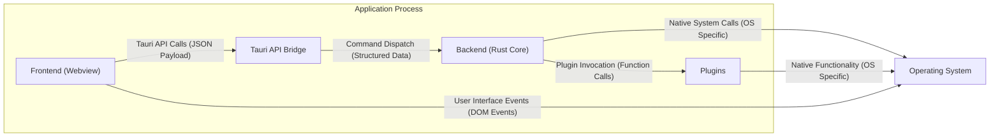
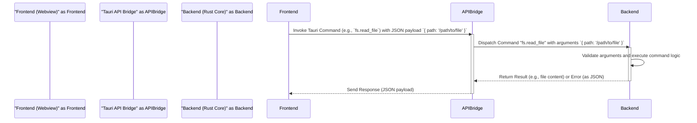
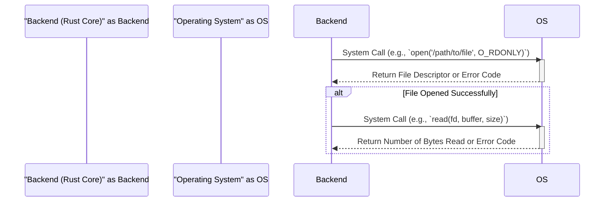
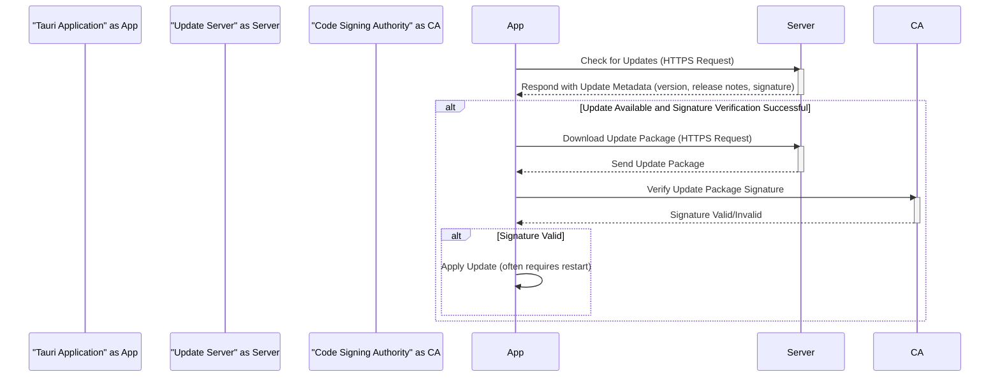

# Tauri Project Design Document

**Version:** 1.1
**Date:** October 26, 2023
**Author:** AI Software Architect

## 1. Introduction

This document provides an enhanced architectural design of the Tauri project. Tauri is a framework for building desktop applications using web technologies. It enables developers to create cross-platform applications with a significantly smaller footprint and improved security compared to traditional Electron-based applications. This document details the core components, their interactions, and data flows within the Tauri architecture, providing a robust foundation for subsequent threat modeling activities.

## 2. Goals and Non-Goals

**Goals:**

*   Deliver a refined and more detailed overview of the Tauri architecture.
*   Clearly identify each key component and its specific responsibilities.
*   Thoroughly describe the data flow within the system, including data types and direction.
*   Emphasize security-relevant aspects of the design with more specific examples.
*   Serve as a comprehensive and actionable foundation for threat modeling exercises.

**Non-Goals:**

*   Granular, line-by-line code-level design or implementation details.
*   In-depth performance benchmarking data or optimization strategies.
*   Specific UI/UX mockups or detailed interaction flows within the frontend.
*   A direct feature-by-feature comparison against alternative frameworks.

## 3. Architectural Overview

Tauri employs a secure multi-process architecture, distinctly separating the user interface (rendered within a system webview) from the core application logic (implemented in Rust). This separation is a cornerstone of Tauri's security model and contributes to its performance characteristics.

**Key Components:**

*   **Frontend (Webview):** The application's user interface, constructed using standard web technologies (HTML, CSS, JavaScript). This runs within the operating system's native webview component.
*   **Backend (Rust Core):** The central application logic, developed in Rust, providing performance, safety, and security. It manages system interactions, business logic, and communication with the frontend.
*   **Tauri API Bridge:** A secure communication channel enabling the frontend to request actions from the backend. This involves sending structured commands and receiving typed responses.
*   **Plugins:** Extend the capabilities of Tauri applications by offering access to native system features or custom functionalities. These are developed in Rust and integrated into the backend.
*   **Operating System:** The underlying operating system platform where the application is executed.

## 4. Detailed Component Description

### 4.1. Frontend (Webview)

*   **Technology:** Built using web standards: HTML for structure, CSS for styling, and JavaScript/TypeScript for interactivity.
*   **Rendering Engine:**  Utilizes the operating system's native webview:
    *   Wry on Linux and macOS (using WebKitGTK and Cocoa WebView respectively).
    *   WebView2 on Windows (based on Chromium).
*   **Communication:** Interacts with the backend exclusively through the Tauri API Bridge, sending commands as JSON payloads.
*   **Security Considerations:**
    *   Subject to common web security vulnerabilities such as Cross-Site Scripting (XSS) if not carefully developed.
    *   Has intentionally restricted direct access to system resources, enforcing the principle of least privilege.
    *   Relies on the robust security measures implemented within the Tauri API for any privileged operations.

### 4.2. Backend (Rust Core)

*   **Technology:** Implemented in Rust, leveraging its memory safety and performance characteristics.
*   **Responsibilities:**
    *   Receiving and processing commands dispatched from the frontend via the Tauri API Bridge.
    *   Executing the core business logic of the application.
    *   Interacting with the underlying operating system through system calls.
    *   Managing application state and data persistence.
    *   Loading, managing, and invoking plugins.
*   **Security Considerations:**
    *   Serves as the primary point of interaction with sensitive system resources, making its security paramount.
    *   Responsible for enforcing security policies and access controls for all operations.
    *   Potential vulnerabilities can arise from insecure command handling, improper input sanitization, or mishandling of system calls.

### 4.3. Tauri API Bridge

*   **Mechanism:** A well-defined and secure interface facilitating communication between the frontend and the backend.
*   **Communication Protocol:** Typically uses asynchronous message passing with structured data (often JSON).
*   **Command Dispatch:** Receives commands from the frontend, validates them, and routes them to the appropriate handler functions within the backend.
*   **Exposed Functionality Examples:**
    *   `window.create()`: For creating new application windows.
    *   `fs.read_file()`: For reading files from the filesystem.
    *   `http.fetch()`: For making HTTP requests.
    *   Custom commands defined by the application developer.
*   **Security Considerations:**
    *   Crucial for controlling access to backend functionality and preventing unauthorized actions.
    *   Must implement robust authorization mechanisms and strict input validation to prevent injection attacks and privilege escalation.
    *   Potential vulnerability if commands are not carefully designed and handled, leading to security breaches.

### 4.4. Plugins

*   **Purpose:** To extend the core functionality of Tauri applications, providing access to platform-specific features or custom logic.
*   **Implementation:** Developed in Rust and compiled as part of the application's backend.
*   **Access:** Can access a wide range of native system functionalities depending on their design and permissions.
*   **Examples:**
    *   A plugin for accessing the system's notification API.
    *   A plugin for interacting with specific hardware devices.
    *   A plugin providing custom cryptographic functions.
*   **Security Considerations:**
    *   Introduce potential security risks if not developed with security best practices.
    *   Require careful permission management to restrict their access to necessary resources only.
    *   Vulnerabilities within plugins can potentially compromise the security of the entire application. Tauri provides mechanisms for plugin isolation to mitigate this.

### 4.5. Updater

*   **Functionality:** Enables the application to automatically check for and install updates.
*   **Process:**
    1. The application checks a remote server for new version information.
    2. If an update is available, the application downloads the new version.
    3. The downloaded update is verified for integrity (e.g., using signatures).
    4. The update is installed, often requiring user confirmation.
*   **Security Considerations:**
    *   A critical component for maintaining application security by patching vulnerabilities.
    *   Must ensure the authenticity and integrity of updates to prevent malicious updates from being installed (e.g., through code signing and HTTPS).
    *   Vulnerable to man-in-the-middle attacks if communication with the update server is not secured or if update packages are not properly verified.

### 4.6. Bundler

*   **Purpose:** Packages the frontend assets and the backend binary into distributable application bundles for various target operating systems.
*   **Process:** Combines the necessary files, optimizes them, and creates platform-specific installers or packages (e.g., `.exe`, `.app`, `.deb`).
*   **Security Considerations:**
    *   Ensures that only intended and necessary files are included in the final application bundle, preventing the inclusion of sensitive development artifacts.
    *   May involve code signing the application bundle to verify its origin and integrity, providing assurance to users that the application is legitimate.

### 4.7. Command Line Interface (CLI)

*   **Purpose:** Provides developers with tools to create, build, debug, and manage Tauri projects.
*   **Functionality:** Includes commands for:
    *   Scaffolding new projects (`tauri init`).
    *   Building application binaries for different platforms (`tauri build`).
    *   Managing dependencies.
    *   Running development servers.
*   **Security Considerations:**
    *   Should handle user input securely to prevent command injection vulnerabilities.
    *   Relies on underlying system tools and package managers, which may have their own security considerations. Tauri aims to minimize its reliance on external tools where possible.

## 5. Data Flow Diagrams

### 5.1. Frontend to Backend Communication (Command Invocation)

**Description:** The frontend initiates an action by invoking a specific Tauri command through the API Bridge. This invocation includes a JSON payload containing the necessary arguments. The API Bridge validates the command and its arguments before dispatching it to the appropriate handler in the backend. The backend processes the request, and the result or an error is returned to the frontend as a JSON payload.

### 5.2. Backend Interaction with Operating System (File System Access)

**Description:** When the backend needs to interact with the operating system (e.g., to access the file system), it makes direct system calls. The operating system processes the request and returns the result or an error code to the backend.

### 5.3. Application Update Process (Detailed)

**Description:** The application initiates the update process by securely checking for updates on a remote server using HTTPS. The server responds with metadata about the latest version, including a digital signature. The application verifies this signature against a trusted authority. If the signature is valid, the application downloads the update package, verifies its signature again, and then applies the update, often requiring a restart.

## 6. Security Considerations

Tauri's design inherently prioritizes security. Key security features and considerations are:

*   **Strong Isolation:** The distinct separation between the frontend (webview) and the backend (Rust core) provides a strong security boundary, limiting the impact of potential vulnerabilities in either component.
*   **Principle of Least Privilege (Enforced):** The frontend operates with minimal privileges and must explicitly request access to system resources through the secure Tauri API Bridge.
*   **Secure Communication Channel:** The Tauri API Bridge facilitates secure communication between the frontend and backend, preventing eavesdropping and tampering.
*   **Robust Input Validation and Sanitization:** The backend is responsible for rigorously validating and sanitizing all data received from the frontend to prevent injection attacks (e.g., command injection, path traversal).
*   **Careful Dependency Management:** Tauri emphasizes the importance of managing and auditing dependencies in both the frontend and backend to mitigate the risk of incorporating known vulnerabilities.
*   **Mandatory Code Signing:** Tauri encourages and facilitates code signing of application binaries to ensure the integrity and authenticity of the application, protecting users from malicious software.
*   **Secure Updater Mechanism:** The update process is designed with security in mind, employing HTTPS for secure communication and digital signatures to verify the authenticity and integrity of update packages.
*   **Plugin Security Model:** Tauri provides mechanisms for plugin isolation and encourages developers to follow secure coding practices when developing plugins to minimize the risk of vulnerabilities.
*   **Content Security Policy (CSP):** Developers can leverage Content Security Policy headers within the webview to further restrict the resources the frontend can load, mitigating the risk of XSS attacks.

## 7. Deployment Considerations

*   **Cross-Platform Build Process:** Tauri facilitates building applications for multiple operating systems (Windows, macOS, Linux) from a single codebase.
*   **Small Bundle Sizes:** Utilizing the system's native webview results in significantly smaller application bundle sizes compared to frameworks that bundle their own browser engine.
*   **Platform-Specific Installers:** Tauri can generate platform-specific installers (e.g., MSI for Windows, DMG for macOS, DEB/RPM for Linux) for a better user experience.
*   **Code Signing for Distribution:** Code signing is crucial for establishing trust and is often required for distribution through app stores or to avoid security warnings on user systems.
*   **Update Mechanism Integration:** The built-in updater can be configured to integrate with various update servers or distribution platforms.

## 8. Future Considerations

*   **Enhanced Plugin Isolation:** Further strengthening the isolation between plugins to limit the potential impact of vulnerabilities within a single plugin.
*   **Improved Developer Tooling:** Continuously enhancing the CLI and development tools to provide a more seamless and efficient development experience, including better debugging and testing capabilities.
*   **Formal Security Audits:** Conducting regular and comprehensive security audits by independent security experts to identify and address potential vulnerabilities proactively.
*   **Expanded API Coverage:** Expanding the Tauri API to provide access to a wider range of native functionalities, reducing the need for complex plugin development in common scenarios.
*   **Community-Driven Security Initiatives:** Fostering a strong community focus on security best practices and encouraging contributions to enhance the framework's security posture.

This enhanced document provides a more detailed and refined understanding of the Tauri project's architecture, emphasizing the security considerations at each level. This comprehensive design serves as a valuable resource for conducting thorough threat modeling and ensuring the development of secure Tauri applications.