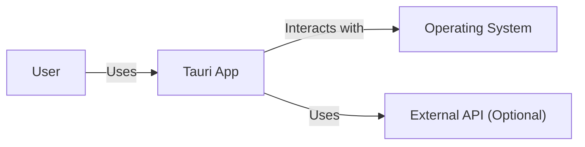
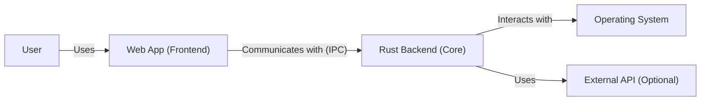
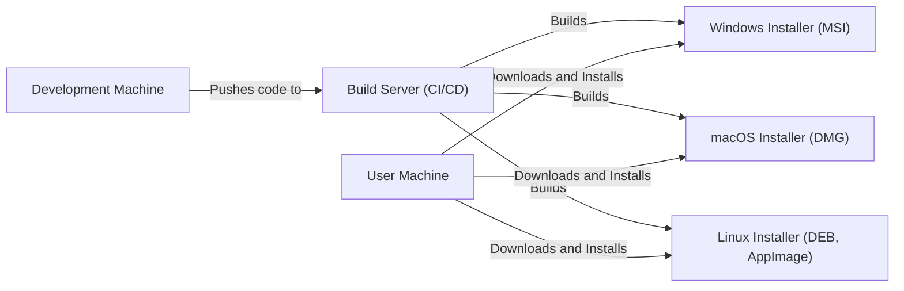
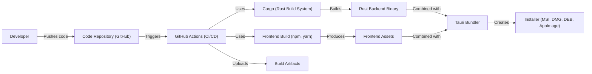

# BUSINESS POSTURE

Business Priorities and Goals:

*   Provide a framework for building lightweight, native desktop applications using web technologies.
*   Offer a smaller and more secure alternative to Electron.
*   Enable cross-platform development with a single codebase.
*   Focus on performance and security as core differentiators.
*   Maintain a vibrant and active open-source community.
*   Provide tooling and documentation to simplify the development process.

Business Risks:

*   Security vulnerabilities in the framework could expose user data or systems to attack.
*   Performance issues could lead to a poor user experience.
*   Lack of adoption by developers could limit the growth and sustainability of the project.
*   Competition from other frameworks (e.g., Electron, Flutter, native solutions) could impact market share.
*   Maintaining compatibility across multiple platforms and operating system versions could be challenging.
*   Reliance on third-party dependencies (e.g., webview libraries) could introduce risks.

# SECURITY POSTURE

Existing Security Controls:

*   security control: Use of Rust as the core language, providing memory safety and preventing common vulnerabilities like buffer overflows. (Described in the project's documentation and inherent in the choice of Rust).
*   security control: Sandboxed webview rendering to isolate web content from the operating system. (Described in the project's documentation and architecture).
*   security control: API for communication between the frontend (web) and backend (Rust) with defined permissions. (Described in the project's documentation and API design).
*   security control: Content Security Policy (CSP) support to mitigate XSS attacks. (Described in the project's documentation).
*   security control: Code signing and notarization to ensure the integrity of distributed binaries. (Described in the project's build and release process).
*   security control: Regular security audits and vulnerability patching. (Implied by the project's commitment to security and active maintenance).
*   security control: Dependency management using Cargo, with features for auditing and updating dependencies. (Inherent in the Rust ecosystem and Cargo toolchain).
*   security control: Use of GitHub Actions for CI/CD, with potential for security checks in the workflow. (Visible in the repository's configuration).

Accepted Risks:

*   accepted risk: Reliance on the security of the underlying webview implementation (e.g., WebView2 on Windows, WKWebView on macOS, WebKitGTK on Linux).
*   accepted risk: Potential for vulnerabilities in third-party Rust crates (though mitigated by auditing and the Rust community's focus on security).
*   accepted risk: The inherent complexity of cross-platform development, which can introduce subtle platform-specific security issues.

Recommended Security Controls:

*   security control: Implement a robust Software Bill of Materials (SBOM) generation and management process.
*   security control: Integrate Static Application Security Testing (SAST) and Dynamic Application Security Testing (DAST) tools into the CI/CD pipeline.
*   security control: Conduct regular penetration testing to identify and address vulnerabilities.
*   security control: Establish a clear vulnerability disclosure program.
*   security control: Provide detailed security documentation and best practices for developers using Tauri.

Security Requirements:

*   Authentication:
    *   Tauri applications should support secure authentication mechanisms, potentially leveraging OS-level authentication or secure credential storage.
    *   If Tauri applications handle user authentication directly, they must use strong, industry-standard cryptographic practices for password hashing and storage.
*   Authorization:
    *   Tauri applications should implement a robust authorization model to control access to resources and functionality.
    *   The API between the frontend and backend should enforce granular permissions.
*   Input Validation:
    *   All input from the frontend (web) to the backend (Rust) must be strictly validated to prevent injection attacks and other vulnerabilities.
    *   Data received from external sources (e.g., network requests, file system) should also be validated.
*   Cryptography:
    *   Tauri should provide secure APIs for cryptographic operations, leveraging OS-provided libraries where possible.
    *   Sensitive data should be encrypted both in transit and at rest.
    *   Key management should follow best practices, ensuring keys are securely stored and protected.

# DESIGN

## C4 CONTEXT

Element Descriptions:

*   Element:
    *   Name: User
    *   Type: Person
    *   Description: A person who interacts with the Tauri application.
    *   Responsibilities: Interacting with the application's user interface, providing input, and receiving output.
    *   Security controls: None (external to the system).

*   Element:
    *   Name: Tauri App
    *   Type: Software System
    *   Description: The desktop application built using the Tauri framework.
    *   Responsibilities: Providing the application's functionality, managing the user interface, and interacting with the operating system and external APIs.
    *   Security controls: Sandboxed webview, API with permissions, CSP support, code signing, Rust memory safety.

*   Element:
    *   Name: Operating System
    *   Type: Software System
    *   Description: The underlying operating system (Windows, macOS, Linux).
    *   Responsibilities: Providing system resources, managing hardware, and hosting the Tauri application.
    *   Security controls: OS-level security features (e.g., ASLR, DEP), user permissions.

*   Element:
    *   Name: External API (Optional)
    *   Type: Software System
    *   Description: Any external APIs that the Tauri application interacts with.
    *   Responsibilities: Providing specific services or data to the Tauri application.
    *   Security controls: Dependent on the specific API (e.g., HTTPS, API keys, OAuth).

## C4 CONTAINER

Element Descriptions:

*   Element:
    *   Name: User
    *   Type: Person
    *   Description: A person who interacts with the Tauri application.
    *   Responsibilities: Interacting with the application's user interface, providing input, and receiving output.
    *   Security controls: None (external to the system).

*   Element:
    *   Name: Web App (Frontend)
    *   Type: Container: Web Application
    *   Description: The user interface of the Tauri application, built using web technologies (HTML, CSS, JavaScript).
    *   Responsibilities: Rendering the UI, handling user input, and communicating with the Rust backend.
    *   Security controls: CSP, input validation (client-side), sandboxed within the webview.

*   Element:
    *   Name: Rust Backend (Core)
    *   Type: Container: Native Application
    *   Description: The core logic of the Tauri application, written in Rust.
    *   Responsibilities: Handling application logic, interacting with the operating system, managing data, and communicating with the web app frontend.
    *   Security controls: Rust memory safety, API with permissions, input validation (server-side).

*   Element:
    *   Name: Operating System
    *   Type: Software System
    *   Description: The underlying operating system (Windows, macOS, Linux).
    *   Responsibilities: Providing system resources, managing hardware, and hosting the Tauri application.
    *   Security controls: OS-level security features (e.g., ASLR, DEP), user permissions.

*   Element:
    *   Name: External API (Optional)
    *   Type: Software System
    *   Description: Any external APIs that the Tauri application interacts with.
    *   Responsibilities: Providing specific services or data to the Tauri application.
    *   Security controls: Dependent on the specific API (e.g., HTTPS, API keys, OAuth).

## DEPLOYMENT

Possible Deployment Solutions:

1.  Native Installers (Windows: MSI, macOS: DMG, Linux: DEB, AppImage).
2.  Microsoft Store (Windows).
3.  Mac App Store (macOS).
4.  Snapcraft (Linux).

Chosen Solution (Detailed Description): Native Installers

Tauri provides tooling to generate native installers for each supported platform. These installers package the web app frontend, the Rust backend binary, and any necessary dependencies into a single, distributable file.

Element Descriptions:

*   Element:
    *   Name: Development Machine
    *   Type: Infrastructure Node
    *   Description: The developer's workstation where code is written and tested.
    *   Responsibilities: Code development, local testing, pushing code to the repository.
    *   Security controls: Developer machine security (e.g., antivirus, firewall).

*   Element:
    *   Name: Build Server (CI/CD)
    *   Type: Infrastructure Node
    *   Description: A server that automates the build and packaging process (e.g., GitHub Actions).
    *   Responsibilities: Building the application for different platforms, running tests, creating installers.
    *   Security controls: Secure build environment, access controls, dependency auditing.

*   Element:
    *   Name: Windows Installer (MSI)
    *   Type: Software
    *   Description: The installer package for Windows.
    *   Responsibilities: Installing the Tauri application on Windows systems.
    *   Security controls: Code signing.

*   Element:
    *   Name: macOS Installer (DMG)
    *   Type: Software
    *   Description: The installer package for macOS.
    *   Responsibilities: Installing the Tauri application on macOS systems.
    *   Security controls: Code signing, notarization.

*   Element:
    *   Name: Linux Installer (DEB, AppImage)
    *   Type: Software
    *   Description: The installer packages for Linux (multiple formats).
    *   Responsibilities: Installing the Tauri application on Linux systems.
    *   Security controls: Code signing (if supported by the distribution).

*   Element:
    *   Name: User Machine
    *   Type: Infrastructure Node
    *   Description: The end-user's computer where the Tauri application is installed.
    *   Responsibilities: Running the Tauri application.
    *   Security controls: OS-level security features, user permissions.

## BUILD

The Tauri build process leverages Rust's Cargo build system and integrates with platform-specific tooling to create the final application package. GitHub Actions is used for CI/CD.

Security Controls in Build Process:

*   Supply Chain Security: Cargo.lock ensures consistent dependency versions. Cargo audit can be used to check for vulnerabilities in dependencies.
*   Build Automation: GitHub Actions automates the build process, ensuring consistency and reproducibility.
*   Security Checks:
    *   Linters: Clippy (Rust linter) is used to enforce code style and identify potential issues.
    *   SAST: Potential for integrating SAST tools into the GitHub Actions workflow.
    *   Dependency Auditing: Cargo audit can be run as part of the CI/CD pipeline.
* Code Signing: Tauri supports code signing and notarization to ensure the integrity of the released binaries.

# RISK ASSESSMENT

Critical Business Processes:

*   Application Functionality: The core functionality of the Tauri application must be protected from disruption or compromise.
*   User Data Handling: If the application handles user data, this data must be protected from unauthorized access, modification, or disclosure.
*   Software Updates: The mechanism for delivering software updates must be secure to prevent the distribution of malicious code.

Data Sensitivity:

*   The sensitivity of the data handled by a Tauri application depends on the specific application.
*   If the application handles personal data, financial information, or other sensitive data, this data must be classified as high sensitivity.
*   If the application does not handle sensitive data, the data can be classified as low sensitivity.
*   Tauri itself, as a framework, does not inherently handle user data. The data sensitivity is determined by the application built *using* Tauri.

# QUESTIONS & ASSUMPTIONS

Questions:

*   What specific types of applications are commonly built with Tauri (to better understand typical data sensitivity)?
*   Are there any specific compliance requirements (e.g., GDPR, HIPAA) that Tauri applications typically need to meet?
*   What is the expected threat model for a typical Tauri application (e.g., who are the likely attackers, what are their motivations)?
*   What level of security assurance is desired for Tauri applications (e.g., basic, moderate, high)?

Assumptions:

*   BUSINESS POSTURE: Tauri aims to be a secure-by-default framework, but the ultimate security of an application depends on the developer's implementation.
*   SECURITY POSTURE: Developers using Tauri are expected to have a basic understanding of security principles and best practices.
*   DESIGN: The provided design diagrams represent a typical Tauri application architecture. Specific applications may have variations. The deployment model assumes native installers as the primary distribution method. The build process assumes the use of GitHub Actions, but other CI/CD systems could be used.