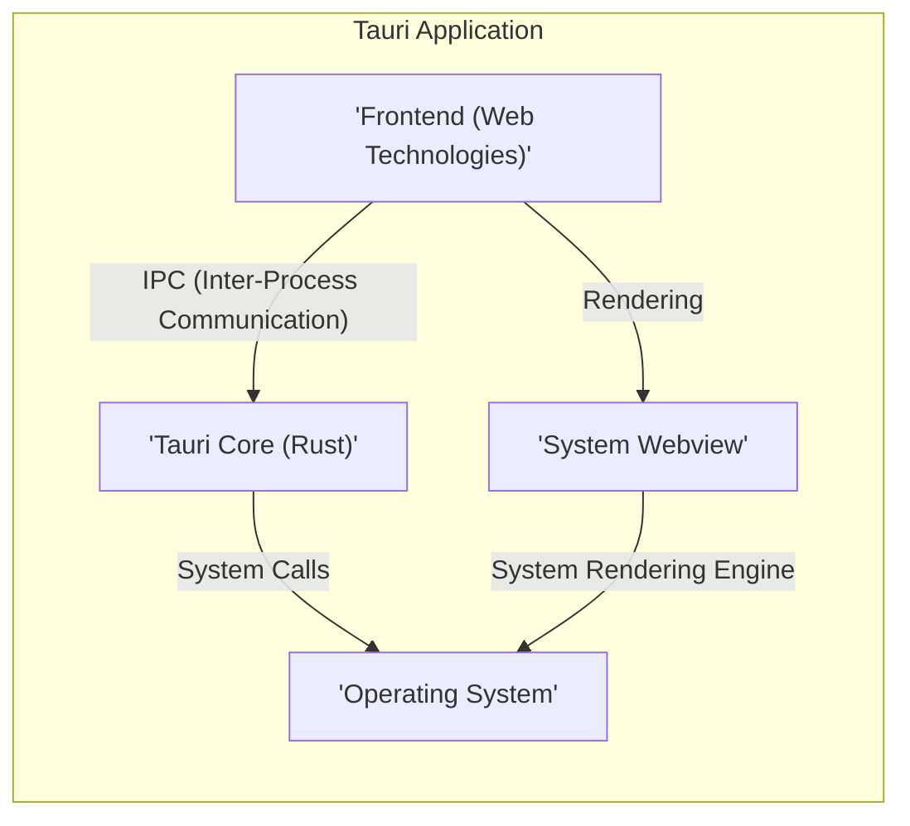
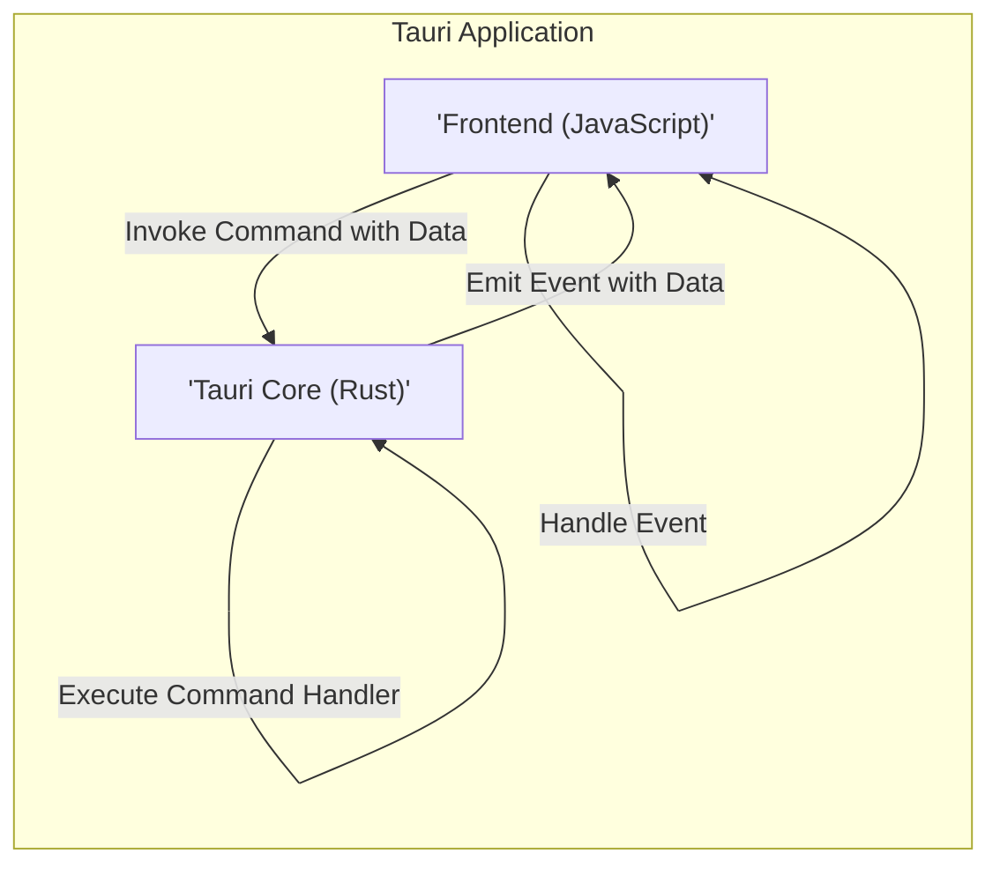
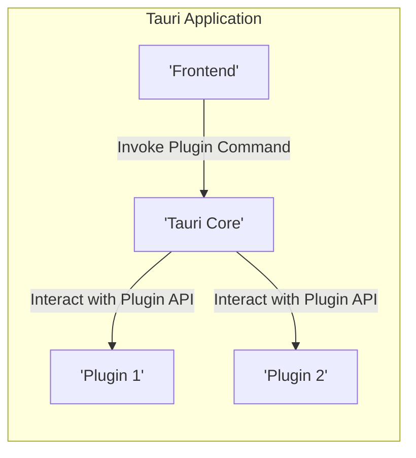
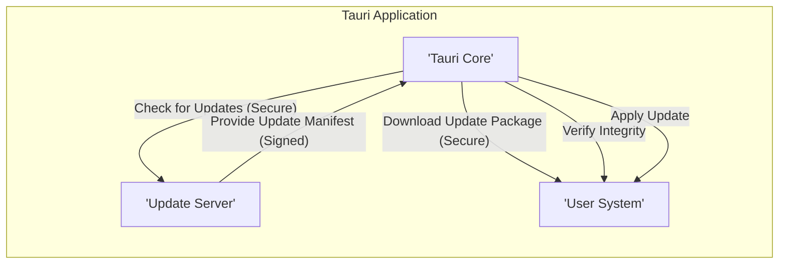
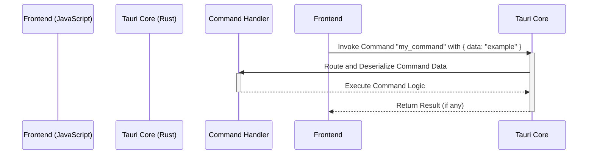
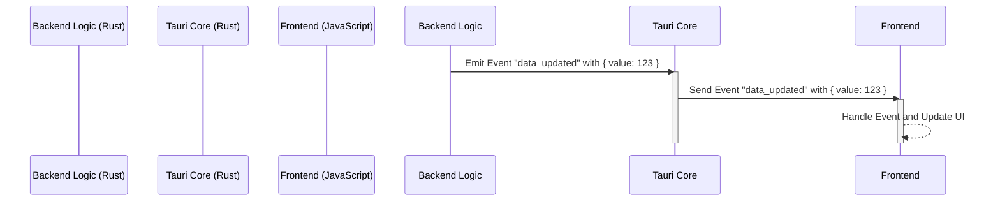
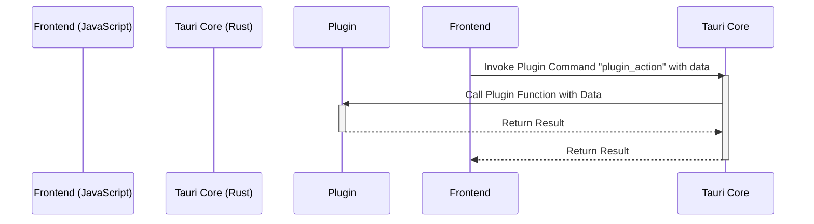

# Project Design Document: Tauri

**Version:** 1.1
**Date:** October 26, 2023
**Author:** AI Software Architect

## 1. Introduction

This document provides a detailed architectural design of the Tauri project, an open-source framework for building highly performant, secure, and cross-platform desktop applications using web technologies. This document is specifically crafted to serve as a foundation for subsequent threat modeling activities, outlining the key components, their interactions, data flows, and inherent security considerations within the Tauri framework.

## 2. Goals and Objectives

The primary goal of Tauri is to empower developers to create cross-platform desktop applications with a significantly smaller footprint and improved performance compared to traditional Electron-based applications, while maintaining a strong security posture. Key objectives include:

*   Providing a secure and resource-efficient runtime environment for web-based frontends, leveraging the system's webview.
*   Offering a well-defined and secure set of APIs for accessing native system functionalities, minimizing the attack surface.
*   Enabling straightforward distribution and secure updates of applications across various platforms.
*   Maintaining a strong emphasis on security by design, minimizing potential vulnerabilities and providing tools for developers to build secure applications.

## 3. High-Level Architecture

Tauri applications are architected with a clear separation between the user interface (frontend) built with web technologies and the application logic (backend) implemented in Rust. This architecture leverages the system's webview for rendering the frontend and provides a secure bridge for communication.

## 4. Detailed Design

This section provides a detailed breakdown of the key components within the Tauri framework and their respective functionalities.

### 4.1. Tauri Core (Rust)

The Tauri Core, written in Rust, forms the secure and performant backbone of the application. Its responsibilities include:

*   **Window Management:** Creating, managing, and controlling application windows, including their properties and behavior.
*   **Inter-Process Communication (IPC) Management:** Establishing and managing secure communication channels between the frontend and backend, often utilizing message passing or command invocation patterns.
*   **Native API Access Control:** Providing a controlled and permissioned bridge to access operating system functionalities, limiting the frontend's direct access to potentially sensitive APIs. This includes features like file system access, network operations, and system dialogs.
*   **Event Handling and Dispatching:** Managing system-level events (e.g., window resize, focus changes) and application-defined events, facilitating communication and coordination between components.
*   **Plugin System Management:** Loading, managing, and isolating plugins to extend Tauri's capabilities in a modular and potentially sandboxed manner.
*   **Security Policy Enforcement:** Implementing and enforcing security measures such as Content Security Policy (CSP) to mitigate XSS attacks and managing permissions for native API access.
*   **Updater Logic:** Orchestrating the application update process, including checking for updates, downloading new versions, and applying updates securely.

### 4.2. Frontend (Web Technologies)

The frontend of a Tauri application is constructed using standard web technologies, rendered within the system's webview:

*   **HTML:** Defines the structure and semantic content of the user interface.
*   **CSS:** Styles the visual presentation and layout of the application.
*   **JavaScript:** Implements the interactive behavior and application logic within the web view.
*   **Tauri JavaScript API Bindings:** Provides a set of JavaScript APIs that facilitate communication with the Rust backend, enabling the frontend to invoke commands and listen for events.

### 4.3. Bundler

The bundler is a crucial tool for packaging the frontend assets and the compiled Rust backend into a distributable application package for various target operating systems. Key functionalities include:

*   **Asset Collection and Packaging:** Gathering all necessary frontend assets (HTML, CSS, JavaScript, images, etc.) and packaging them for distribution.
*   **Rust Backend Compilation:** Compiling the Rust backend code into a platform-specific executable binary.
*   **Platform-Specific Packaging:** Creating installers or application bundles (e.g., `.exe`, `.app`, `.deb`) tailored for different operating systems (Windows, macOS, Linux).
*   **Code Signing and Notarization Integration:**  Supporting integration with code signing and notarization processes to ensure the authenticity and integrity of the application, enhancing user trust and security.

### 4.4. Inter-Process Communication (IPC)

Tauri employs a secure IPC mechanism to facilitate communication between the isolated frontend and backend processes. This typically involves:

*   **Command Invocation:** Frontend JavaScript can invoke predefined commands exposed by the Rust backend, passing data as arguments.
*   **Event Emission and Listening:** The backend can emit events that the frontend can subscribe to and handle, enabling asynchronous communication.
*   **Message Passing (Optional):**  Depending on the configuration, direct message passing between frontend and backend might be supported, requiring careful security considerations.

### 4.5. Plugin System

Tauri's plugin system allows developers to extend the core functionality by creating reusable modules, often written in Rust. Plugins can:

*   **Expose New Commands:** Introduce new commands that can be invoked by the frontend.
*   **Provide Access to Specialized Native APIs:** Offer access to specific native functionalities beyond the core Tauri APIs.
*   **Implement Custom Backend Logic:** Extend the backend's capabilities with custom business logic or integrations.

### 4.6. Updater

The updater component is responsible for securely managing application updates, ensuring users are running the latest and most secure version. This process typically involves:

*   **Update Manifest Retrieval:** Securely fetching an update manifest from a remote server, detailing available updates.
*   **Version Comparison:** Comparing the current application version with the available updates.
*   **Secure Download:** Downloading the new application package over a secure channel (e.g., HTTPS).
*   **Integrity Verification:** Verifying the integrity of the downloaded package (e.g., using checksums or digital signatures).
*   **Application Update and Restart:** Applying the update and restarting the application, often with user confirmation.

### 4.7. Command Line Interface (CLI)

The Tauri CLI is a powerful command-line tool used by developers for various tasks throughout the application lifecycle:

*   **Project Initialization:** Creating new Tauri projects with pre-configured templates.
*   **Development Server Management:** Starting and managing a local development server for testing and debugging.
*   **Building and Packaging:** Compiling the Rust backend and packaging the application for different target platforms.
*   **Plugin Management:** Creating, managing, and integrating plugins into the application.
*   **Code Signing and Notarization Configuration:** Configuring settings related to code signing and notarization.

## 5. Data Flow Diagrams

This section provides more detailed data flow diagrams illustrating specific interactions and data movement within the Tauri application.

### 5.1. Frontend Invoking a Backend Command with Data

### 5.2. Backend Emitting an Event to the Frontend

### 5.3. Plugin Interaction

## 6. Key Security Considerations

This section highlights critical security considerations relevant for threat modeling and secure development practices within the Tauri framework:

*   **Inter-Process Communication (IPC) Security:** Ensuring that the IPC channel between the frontend and backend is secure and resistant to manipulation or eavesdropping. This includes validating data passed between processes and preventing the execution of arbitrary code.
*   **Plugin Security and Isolation:**  Thoroughly vetting and potentially sandboxing plugins to prevent malicious or vulnerable plugins from compromising the application or the user's system. This involves defining clear plugin APIs and enforcing security boundaries.
*   **Updater Mechanism Security:**  Securing the update process to prevent man-in-the-middle attacks, ensuring the authenticity and integrity of updates through mechanisms like code signing and secure download protocols.
*   **Content Security Policy (CSP) Enforcement:**  Strictly enforcing CSP to mitigate cross-site scripting (XSS) attacks by controlling the sources from which the webview can load resources. Developers need to carefully configure CSP to balance security and functionality.
*   **Native API Access Control and Permissions:**  Implementing a robust permission system to control the frontend's access to sensitive native APIs, preventing unauthorized access to system resources or functionalities.
*   **Dependency Management and Supply Chain Security:**  Carefully managing dependencies in both the Rust backend and the frontend to avoid introducing vulnerabilities from third-party libraries. Regularly auditing and updating dependencies is crucial.
*   **Code Signing and Notarization:**  Utilizing code signing and notarization to provide assurance to users about the authenticity and integrity of the application, helping to prevent the installation of tampered or malicious software.
*   **Input Validation and Sanitization:**  Implementing robust input validation and sanitization on both the frontend and backend to prevent injection attacks (e.g., SQL injection, command injection) and other data manipulation vulnerabilities.
*   **Webview Security:**  Leveraging the security features provided by the underlying system webview and ensuring it is up-to-date with security patches.
*   **Secure Defaults and Developer Guidance:**  Providing secure default configurations and clear guidance to developers on how to build secure Tauri applications, including best practices for handling sensitive data and implementing security features.

## 7. Assumptions and Constraints

*   It is assumed that developers will adhere to security best practices when developing their frontend applications, including proper input validation and output encoding.
*   The security of the underlying operating system and its webview component plays a significant role in the overall security posture of Tauri applications.
*   The effectiveness of Tauri's security features relies on developers correctly configuring and utilizing them.
*   This design document focuses on the core Tauri framework; the security of individual applications built with Tauri will depend on their specific implementation.

## 8. Glossary

*   **IPC:** Inter-Process Communication
*   **CSP:** Content Security Policy
*   **API:** Application Programming Interface
*   **CLI:** Command Line Interface
*   **XSS:** Cross-Site Scripting
*   **Webview:** The system component used to render web content within the application.
*   **Manifest:** A file containing metadata about an application or update.
*   **Notarization:** A process by which Apple verifies that macOS software is free of malware.

This improved design document provides a more detailed and security-focused overview of the Tauri project's architecture, making it a more effective foundation for subsequent threat modeling activities. The enhanced descriptions of components, data flows, and security considerations offer a deeper understanding of potential vulnerabilities and mitigation strategies.