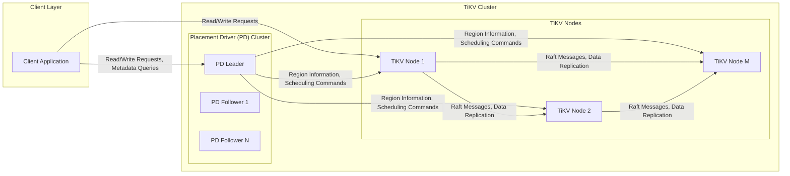
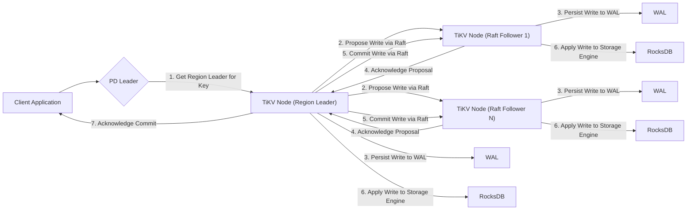
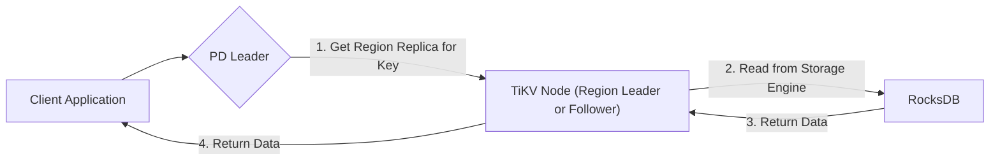

# Project Design Document: TiKV Distributed Key-Value Database

**Version:** 1.1
**Date:** October 26, 2023
**Prepared By:** AI Architecture Expert

## 1. Introduction

This document provides an enhanced architectural design of the TiKV distributed key-value database, based on the project hosted on GitHub at [https://github.com/tikv/tikv](https://github.com/tikv/tikv). This revised document aims to offer a more detailed and precise understanding of the system's components, their interactions, and key design decisions, specifically tailored for subsequent threat modeling activities.

## 2. Goals and Objectives

The primary goals of TiKV are to provide:

*   **Scalability:**  Horizontal scalability to handle increasing data volume and request load by adding more TiKV nodes.
*   **Consistency:**  Strong consistency guarantees for data integrity, primarily achieved through the Raft consensus algorithm at the Region level.
*   **High Availability:**  Fault tolerance to withstand node failures within the TiKV and PD clusters without service interruption.
*   **Durability:**  Persistence of committed data even in the face of multiple failures, ensured by replicating data across multiple nodes.
*   **Geo-Distribution:**  Support for deploying and managing data across geographically distributed locations, often involving considerations for latency and data placement.

## 3. System Architecture

TiKV employs a distributed architecture with distinct responsibilities assigned to its core components.

### 3.1. High-Level Architecture Diagram

### 3.2. Component Breakdown

*   **Client Application:**  Any application or service that interacts with the TiKV cluster to perform data read and write operations. It typically uses a TiKV client library.
*   **Placement Driver (PD) Cluster:**
    *   **PD Leader:**  The elected leader of the PD cluster, serving as the central control plane.
        *   **Responsibilities:** Metadata management (region locations, store states, key ranges), region scheduling (moving regions between TiKV nodes for load balancing and fault tolerance), garbage collection coordination, timestamp allocation (using a globally unique timestamp oracle), and cluster configuration management.
    *   **PD Follower:**  Replicates the state of the PD Leader through the Raft consensus algorithm, ensuring high availability and data consistency within the PD cluster. Followers can become the Leader in case of a failure.
*   **TiKV Nodes:**  The worker nodes in the TiKV cluster responsible for storing and serving data.
    *   **Responsibilities:** Storing data within Regions, serving read and write requests for the Regions they host, participating in Raft groups to maintain data consistency and replication, managing the underlying RocksDB storage engine, and reporting their status and load to the PD cluster.

### 3.3. Data Partitioning and Replication

*   **Regions:** The fundamental unit of data management in TiKV. The entire key space is divided into contiguous, non-overlapping ranges called Regions.
*   **Raft Consensus Group:** Each Region is managed by a Raft consensus group, typically consisting of 3 or 5 replicas distributed across different TiKV nodes. This ensures strong consistency and fault tolerance for the data within that Region.
*   **Region Leader:** Within each Raft group, one replica is elected as the Leader. The Leader is responsible for handling all write requests for that Region and replicating the changes to the Followers.
*   **Region Followers:** The other replicas in the Raft group. They receive and apply the write commands from the Leader, ensuring data is replicated. Followers can serve read requests (depending on configuration).
*   **Region Distribution:** The PD cluster is responsible for the initial placement and subsequent movement of Regions across TiKV nodes. This ensures load balancing, data availability, and adherence to placement policies.

## 4. Data Flow

### 4.1. Write Request Flow (Detailed)

*   **Step 1: Locate Region Leader:** The client sends a write request (containing the key and value) to the PD Leader to determine the TiKV node acting as the Region Leader for the given key.
*   **Step 2: Propose Write (Raft):** The PD Leader returns the address of the Region Leader. The client then sends the write request to the Region Leader. The Region Leader proposes the write operation to the other Followers in the Raft group.
*   **Step 3: Persist to WAL:** Each replica (Leader and Followers) persists the proposed write operation to its local Write-Ahead Log (WAL). This ensures durability even if a node crashes before the data is written to the main storage.
*   **Step 4: Acknowledge Proposal:** The Followers acknowledge the proposal to the Leader once they have persisted the write to their WAL.
*   **Step 5: Commit Write (Raft):** Once a quorum of replicas (majority) have acknowledged the proposal, the Leader commits the write operation through the Raft protocol. The Leader informs the Followers to commit the write.
*   **Step 6: Apply to Storage Engine:** Each replica (Leader and Followers) applies the committed write operation to its underlying storage engine (RocksDB).
*   **Step 7: Acknowledge Client:** The Region Leader sends an acknowledgment back to the client, indicating the successful completion of the write operation.

### 4.2. Read Request Flow (Detailed)

*   **Step 1: Locate Region Replica:** The client sends a read request (containing the key) to the PD Leader to find a suitable TiKV node hosting a replica of the Region containing the requested key. Depending on the configuration and consistency requirements, the PD might direct the client to the Leader or a Follower.
*   **Step 2: Read from Storage Engine:** The PD Leader returns the address of a TiKV node. The client sends the read request to the selected TiKV node. The TiKV node retrieves the data from its local RocksDB instance.
*   **Step 3: Return Data (Internal):** The TiKV node retrieves the requested data from RocksDB.
*   **Step 4: Return Data (Client):** The TiKV node sends the retrieved data back to the client application.

## 5. Key Components in Detail

*   **Placement Driver (PD):**
    *   **Role:**  The brain of the TiKV cluster, responsible for global scheduling, metadata management, and ensuring the overall health and balance of the cluster.
    *   **Key Functions:**
        *   **Metadata Management:** Stores and manages metadata about Regions (location, size, key range), TiKV nodes (status, capacity), and cluster configuration.
        *   **Region Scheduling:**  Dynamically moves Regions between TiKV nodes to balance load, handle node failures, and optimize data placement based on configured policies.
        *   **Timestamp Allocation:** Provides a monotonically increasing, globally unique timestamp oracle, crucial for implementing transactions and consistent reads.
        *   **Garbage Collection Coordination:**  Coordinates the garbage collection process across TiKV nodes to reclaim storage space.
    *   **Technology:**  Primarily built using Go, leveraging the Raft consensus algorithm (using the etcd/raft library) for high availability and data consistency within the PD cluster itself.
*   **TiKV Node:**
    *   **Role:**  The workhorse of the TiKV cluster, responsible for storing data and serving read/write requests for the Regions it hosts.
    *   **Key Functions:**
        *   **Region Management:** Manages the Regions assigned to it, including handling Raft proposals and commits.
        *   **Raft Group Participation:**  Participates in Raft consensus groups for the Regions it hosts, acting as either a Leader or a Follower.
        *   **Data Persistence:**  Persists data to disk using the RocksDB storage engine, ensuring durability.
        *   **Read/Write Handling:**  Receives and processes read and write requests for its Regions.
        *   **Gossip Communication:**  Communicates with other TiKV nodes (and PD nodes) using a gossip protocol for health checks and status updates.
    *   **Technology:** Built using Rust, known for its performance and memory safety. It embeds the RocksDB key-value store.
*   **RocksDB:**
    *   **Role:**  The embedded, persistent key-value store used by TiKV nodes to store the actual data.
    *   **Key Functions:**
        *   **Data Persistence:**  Provides durable storage for key-value pairs on disk.
        *   **Efficient Read/Write Operations:**  Offers high-performance read and write operations.
        *   **Support for Transactions:**  Provides transactional capabilities within a single TiKV node.
        *   **Various Storage Engines:**  Offers configurable storage engine options (though TiKV primarily uses the default).
    *   **Technology:**  A high-performance embedded database written in C++.
*   **Raft:**
    *   **Role:**  The distributed consensus algorithm that ensures strong consistency and fault tolerance for data within each Region.
    *   **Key Functions:**
        *   **Leader Election:**  Elects a single Leader within a Raft group to manage write operations.
        *   **Log Replication:**  Replicates write operations from the Leader to the Followers.
        *   **Membership Changes:**  Handles adding and removing members from the Raft group.
    *   **Implementation:**  Implemented within the TiKV node, based on well-established Raft principles.
*   **gRPC:**
    *   **Role:**  The primary communication protocol used for inter-component communication within the TiKV cluster.
    *   **Key Functions:**  Provides efficient and reliable remote procedure calls (RPC) between clients and TiKV nodes, TiKV nodes and PD nodes, and between TiKV nodes themselves.
    *   **Technology:**  A high-performance, open-source universal RPC framework, using Protocol Buffers for serialization.

## 6. Security Considerations

This section outlines key security considerations relevant for threat modeling, providing more specific examples.

*   **Authentication and Authorization:**
    *   **Client Authentication:** Mechanisms to verify the identity of clients connecting to the cluster. This could involve username/password, API keys, or mutual TLS. **Threat Example:** Unauthorized clients accessing sensitive data.
    *   **Inter-Node Authentication (Mutual TLS):**  Ensuring that only authorized TiKV and PD nodes can communicate with each other, preventing rogue nodes from joining the cluster. **Threat Example:** A compromised server impersonating a TiKV node.
    *   **Authorization (RBAC):** Implementing Role-Based Access Control to manage permissions for different users or applications, limiting access to specific data or administrative operations. **Threat Example:** A user with read-only access attempting to modify data.
*   **Data-in-Transit Encryption (TLS/SSL):**
    *   Encrypting all communication channels between clients and TiKV nodes, and between internal components (TiKV-PD, TiKV-TiKV) using TLS/SSL to protect data from eavesdropping and tampering. **Threat Example:** Man-in-the-middle attacks intercepting sensitive data.
*   **Data-at-Rest Encryption:**
    *   Encrypting data stored within RocksDB on disk to protect it from unauthorized access if the storage media is compromised. This can be implemented using RocksDB's encryption features or disk-level encryption. **Threat Example:**  A stolen hard drive containing unencrypted data.
*   **Access Control (Network Segmentation):**
    *   Isolating the TiKV cluster within a private network or using firewalls to restrict network access to authorized clients and components. **Threat Example:**  External attackers directly accessing TiKV nodes.
*   **Auditing and Logging:**
    *   Comprehensive logging of security-relevant events, such as authentication attempts (successful and failed), authorization decisions, data access patterns, and administrative actions. These logs should be securely stored and monitored. **Threat Example:**  Failure to detect a data breach due to insufficient logging.
*   **Input Validation:**
    *   Strictly validating all inputs received from clients to prevent injection attacks (e.g., SQL injection, command injection) if TiKV is used in conjunction with other systems. **Threat Example:**  Malicious input causing unintended data modification or system compromise.
*   **Denial of Service (DoS) Protection:**
    *   Implementing mechanisms to mitigate DoS attacks, such as rate limiting, connection limits, and resource quotas, to ensure the availability of the TiKV cluster. **Threat Example:**  An attacker overwhelming the cluster with requests, making it unavailable.
*   **Dependency Management:**
    *   Regularly scanning and updating dependencies (e.g., RocksDB, gRPC libraries, Rust crates) to patch known vulnerabilities. **Threat Example:**  Exploiting a vulnerability in an outdated library.
*   **Secrets Management:**
    *   Securely storing and managing sensitive information like encryption keys, API keys, and certificates, using dedicated secrets management solutions (e.g., HashiCorp Vault). **Threat Example:**  Hardcoded credentials being exposed.

## 7. Deployment Considerations

*   **Environment:** TiKV is designed for deployment in various environments, including bare metal servers, virtual machines, and containerized platforms like Kubernetes.
*   **Network Topology:**  Low-latency and high-bandwidth network connectivity between TiKV nodes is crucial for performance and Raft consensus.
*   **Resource Requirements:**  Careful planning of CPU, memory, and storage resources for each TiKV and PD node is essential based on the expected workload and data size.
*   **Monitoring and Alerting:**  Implementing robust monitoring and alerting systems to track cluster health, performance metrics, and potential issues. Tools like Prometheus and Grafana are commonly used.
*   **Backup and Recovery:**  Establishing strategies for regular backups of TiKV data and PD metadata, along with well-defined procedures for restoring the cluster in case of failures.

## 8. Future Considerations

*   **Multi-Tenancy:**  Further development to support multiple isolated tenants within the same TiKV cluster, improving resource utilization and management.
*   **Enhanced Observability:**  Continuous improvements in monitoring, tracing, and logging capabilities to provide deeper insights into cluster behavior and performance.
*   **Performance Optimizations:**  Ongoing efforts to optimize read and write performance, reduce latency, and improve resource efficiency.
*   **Security Enhancements:**  Continuously evaluating and implementing new security features and best practices to address emerging threats.

This improved document provides a more detailed and nuanced understanding of the TiKV architecture, specifically focusing on aspects relevant to threat modeling. The enhanced descriptions, detailed data flow diagrams, and more specific security considerations aim to facilitate a more thorough and effective threat modeling process.
