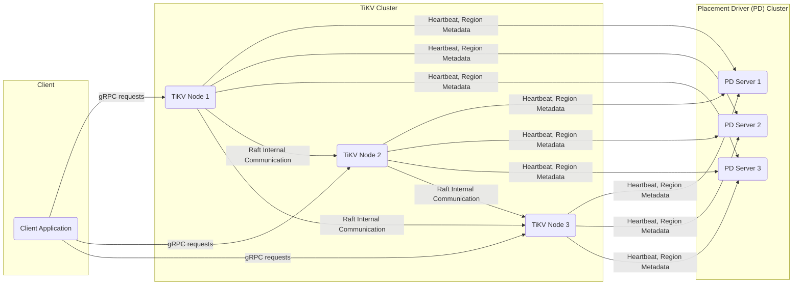
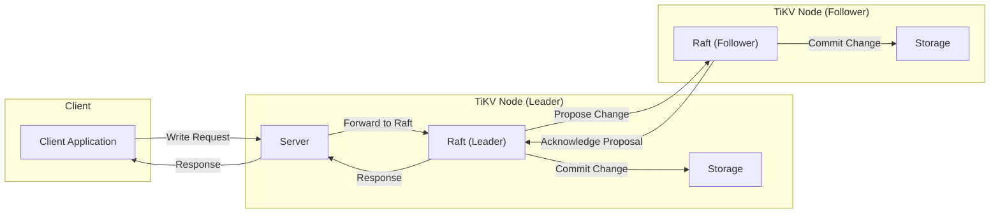
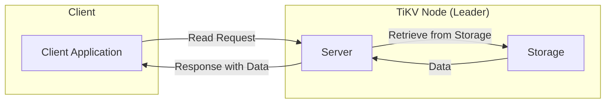

# Project Design Document: TiKV

**Version:** 1.1
**Date:** October 26, 2023
**Author:** AI Software Architect

## 1. Introduction

This document provides an enhanced architectural design of the TiKV distributed key-value database, building upon the previous version. It aims to offer a more comprehensive understanding of the system's components, their interactions, and data flow, specifically tailored for subsequent threat modeling activities.

TiKV is a distributed, transactional key-value database, originally created by PingCAP as the storage layer for the TiDB database. It is engineered for high availability, horizontal scalability, and strong consistency, making it suitable for demanding applications.

## 2. Goals

* Provide a clear, detailed, and improved overview of the TiKV architecture.
* Elaborate on the responsibilities and functionalities of key components.
* Offer more precise descriptions of the data flow within the system for both read and write operations, including routing.
* Clarify the interactions between different components with more context.
* Strengthen the foundation for threat modeling by providing more specific details about potential security considerations.

## 3. Non-Goals

* This document does not delve into the intricacies of specific feature implementations or code-level details.
* It does not cover the operational procedures for deploying, configuring, and managing a TiKV cluster.
* It does not present performance benchmarks, optimization strategies, or capacity planning guidelines.
* It does not detail the architecture or functionality of the TiDB query layer or its specific interactions with TiKV beyond a high-level understanding.

## 4. High-Level Architecture

TiKV employs a distributed architecture where multiple independent components collaborate to provide a robust and scalable key-value store.

**Key Components and their Roles:**

* **Client:** Applications that initiate read and write operations against the TiKV cluster. Clients communicate with TiKV nodes using the gRPC protocol. The client library handles initial connection and subsequent request routing.
* **TiKV Node:** The fundamental storage unit in the cluster. Each TiKV node:
    * Stores a subset of the overall data, divided into Regions.
    * Handles read and write requests for the Regions it hosts.
    * Participates in Raft consensus to ensure data consistency and fault tolerance within each Region.
    * Periodically sends heartbeats and metadata to the PD cluster.
* **Placement Driver (PD):** The central control plane and metadata manager for the TiKV cluster. The PD cluster:
    * Maintains the global view of the cluster, including the location of Regions and the status of TiKV nodes.
    * Manages the distribution and replication of data across the cluster.
    * Performs load balancing by moving Regions between TiKV nodes.
    * Elects leaders for Regions and handles leader transfers.
    * Provides a timestamp oracle (TSO) for generating globally unique, monotonically increasing timestamps essential for transactions.

## 5. Detailed Component Design

### 5.1. TiKV Node

Each TiKV node is a complex entity composed of several interacting modules:

* **Server:**
    * Accepts incoming gRPC requests from clients.
    * Authenticates and authorizes client requests (depending on configuration).
    * Routes requests to the appropriate Region based on the key.
    * Coordinates with the Storage and Raft modules to process requests.
    * Implements various APIs for data manipulation and management.
* **Storage:**
    * Provides an abstraction layer over the underlying storage engine, typically RocksDB.
    * Manages data persistence, retrieval, and deletion within Regions.
    * Supports snapshot creation for backups and data consistency.
    * Handles garbage collection of old data versions.
* **Raft:**
    * Implements the Raft consensus algorithm to ensure strong consistency and fault tolerance for each Region.
    * Manages the replication of data changes to follower replicas within the Region's Raft group.
    * Handles leader election in case of failures.
    * Ensures that all members of a Raft group agree on the sequence of operations.
* **Region:**
    * The smallest unit of data management and replication in TiKV.
    * Represents a contiguous range of keys.
    * Each Region has a leader and multiple followers (peers) distributed across different TiKV nodes for redundancy.
    * Data within a Region is managed by a dedicated Raft group.
* **Region Peer:**
    * Represents a specific instance of a Region within a TiKV node.
    * Can be a leader, follower, or learner in the Raft group.
    * Manages the Raft state machine for its associated Region.
* **Transport:**
    * Responsible for network communication between TiKV nodes for Raft messages, data replication, and internal communication.
    * Handles serialization and deserialization of messages.
    * Ensures reliable and ordered delivery of Raft messages.
* **Memory Management:**
    * Manages memory allocation and usage within the TiKV node to optimize performance and prevent out-of-memory errors.
    * Includes caching mechanisms for frequently accessed data.
* **Metrics:**
    * Collects and exposes a wide range of performance and operational metrics (e.g., CPU usage, memory consumption, request latency, Raft activity).
    * These metrics are crucial for monitoring, alerting, and troubleshooting.

### 5.2. Placement Driver (PD)

The PD cluster is responsible for the overall management and orchestration of the TiKV cluster.

* **PD Server:**
    * Runs the core PD service. A distributed consensus protocol (typically Raft within the PD cluster itself) ensures high availability and consistency of PD's metadata.
    * Provides APIs for TiKV nodes to register, report their status, and request information.
    * Exposes APIs for administrative tasks and monitoring.
* **Metadata Store (etcd):**
    * Persistently stores the cluster's metadata, including:
        * Region information (key ranges, locations, leaders).
        * TiKV node information (addresses, capacities, status).
        * Configuration settings.
    * etcd's distributed consensus ensures the reliability and consistency of this critical metadata.
* **Scheduler:**
    * Continuously monitors the cluster's state and makes decisions to optimize data distribution and availability.
    * Implements various scheduling strategies for:
        * Region placement (initial placement and rebalancing).
        * Region splitting and merging.
        * Leader election and transfer.
        * Handling node failures.
* **Timestamp Oracle (TSO):**
    * Generates globally unique, monotonically increasing timestamps.
    * Operates in a distributed manner to ensure high availability and fault tolerance.
    * These timestamps are essential for implementing transactions with snapshot isolation.

### 5.3. Client Interaction

Clients interact with the TiKV cluster through gRPC, leveraging client libraries for simplified interaction.

* **Initial Connection and Discovery:** Clients typically connect to one or more TiKV nodes initially. These nodes provide information about the PD cluster's location.
* **Metadata Retrieval:** The client library interacts with the PD cluster to retrieve metadata about Region locations and leaders based on the keys being accessed. This metadata is often cached for performance.
* **Request Routing:**
    * For each request, the client library determines the Region responsible for the requested key range.
    * It then routes the request directly to the leader of that Region.
    * If the client contacts a non-leader node, that node will redirect the client to the correct leader.
* **Read Requests:**
    * The client sends a read request (e.g., `Get`) to the Region leader.
    * The leader retrieves the data from its local Storage engine.
    * The leader returns the data to the client.
* **Write Requests:**
    * The client sends a write request (e.g., `Put`, `Delete`) to the Region leader.
    * The leader proposes the change to the Raft group for consensus.
    * Once a quorum of followers acknowledges the proposal, the leader commits the change locally.
    * The leader then informs the client of the successful write.
    * Followers also apply the committed change to their local Storage engines.

## 6. Data Flow

### 6.1. Write Path

**Detailed Steps:**

* The client application sends a write request to a TiKV node (the client library handles finding a suitable initial node and eventually the Region leader).
* The Server module on the contacted TiKV node receives the request.
* The Server identifies the target Region based on the key and forwards the write operation to the Raft leader of that Region.
* The Raft leader proposes the write operation (as a Raft log entry) to the other members (followers) of the Raft group.
* The Raft followers acknowledge the proposal.
* Once a quorum (majority) of followers have acknowledged, the Raft leader commits the log entry.
* The Raft leader instructs its local Storage module to apply the write to the underlying RocksDB instance.
* The Raft leader sends a response back to the Server module.
* The Server module then sends a success response back to the client application.
* The Raft followers also commit the log entry and instruct their local Storage modules to apply the write, ensuring data consistency across replicas.

### 6.2. Read Path

**Detailed Steps:**

* The client application sends a read request to a TiKV node. The client library ensures the request is routed to the leader of the Region responsible for the requested key.
* The Server module on the leader TiKV node receives the read request.
* The Server instructs the local Storage module to retrieve the data associated with the requested key from RocksDB.
* The Storage module retrieves the data and returns it to the Server.
* The Server sends a response containing the requested data back to the client application.

## 7. Security Considerations (For Threat Modeling)

This section outlines key security considerations relevant for threat modeling, categorized for clarity.

* **Authentication and Authorization:**
    * **Client Authentication:** How are clients authenticating their identity when connecting to the TiKV cluster? Are there mechanisms for mutual TLS, token-based authentication, or other methods?
    * **Client Authorization:** How is access control enforced to ensure clients can only access the data they are authorized to? Are there role-based access control (RBAC) mechanisms or other authorization policies?
    * **Inter-Node Authentication:** How are TiKV nodes authenticating each other and the PD nodes to prevent unauthorized nodes from joining the cluster?
    * **PD Authentication:** How are TiKV nodes and administrative tools authenticated when interacting with the PD cluster?
* **Data Confidentiality:**
    * **Data at Rest Encryption:** Is data encrypted at rest within the underlying RocksDB storage? What encryption algorithms and key management strategies are used?
    * **Data in Transit Encryption (Client-to-TiKV):** Is communication between clients and TiKV nodes encrypted using TLS? What are the supported TLS versions and cipher suites?
    * **Data in Transit Encryption (TiKV-to-TiKV & TiKV-to-PD):** Is internal communication between TiKV nodes (for Raft) and between TiKV and PD encrypted?
* **Data Integrity:**
    * **Data Corruption:** How does TiKV protect against and detect data corruption at the storage level? Are checksums or other integrity checks used?
    * **Raft Integrity:** How does the Raft consensus algorithm ensure the integrity and consistency of replicated data?
    * **Accidental Deletion/Modification:** Are there mechanisms to prevent or recover from accidental data deletion or modification by authorized users?
* **Availability:**
    * **Denial of Service (DoS) Attacks:** How does TiKV protect against DoS attacks at the network and application levels? Are there rate limiting or other protective measures?
    * **Node Failures:** How does the architecture handle TiKV node failures and ensure continued availability of data? (Raft replication, PD's role in failover).
    * **PD Failures:** How does the system tolerate failures within the PD cluster? (PD's internal Raft).
* **Operational Security:**
    * **Secret Management:** How are sensitive secrets (e.g., encryption keys, passwords, certificates) managed and protected?
    * **Auditing and Logging:** What auditing and logging capabilities are available for tracking access, modifications, and potential security events?
    * **Security Updates and Patching:** How are security vulnerabilities in TiKV and its dependencies addressed and patched?
* **Dependency Security:**
    * **Third-Party Libraries:** How are vulnerabilities in third-party libraries (e.g., gRPC, RocksDB) managed and mitigated? Are there processes for tracking and updating dependencies?

## 8. Future Considerations

* **Enhanced Security Features:**
    * Exploring more granular access control mechanisms, such as row-level security or column-level encryption.
    * Implementing data masking or anonymization features for compliance.
    * Investigating integration with Hardware Security Modules (HSMs) for enhanced key management.
* **Improved Security Monitoring and Alerting:**
    * Enhancing logging and auditing capabilities to provide richer security information.
    * Integrating with Security Information and Event Management (SIEM) systems for centralized monitoring and alerting.
* **Formal Security Audits and Penetration Testing:**
    * Conducting regular independent security audits and penetration testing to identify and address potential vulnerabilities proactively.

This improved design document provides a more detailed and structured understanding of the TiKV architecture, specifically tailored to facilitate comprehensive threat modeling. The enhanced descriptions of components, data flow, and security considerations will be valuable in identifying potential risks and vulnerabilities.