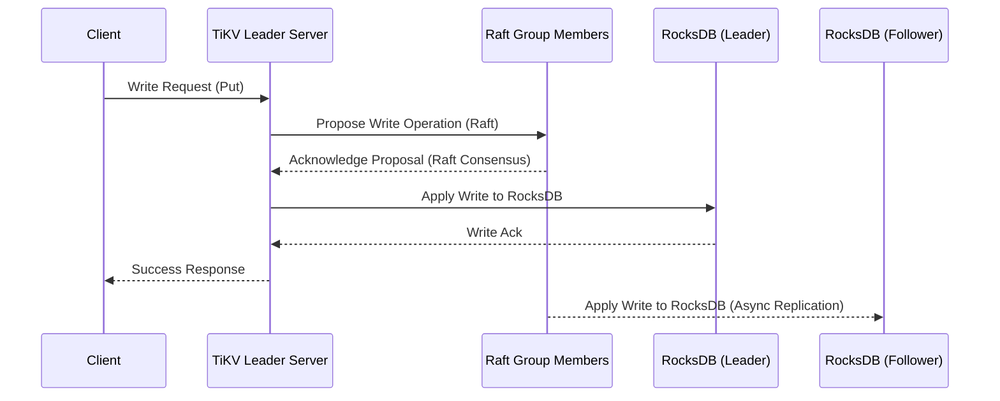
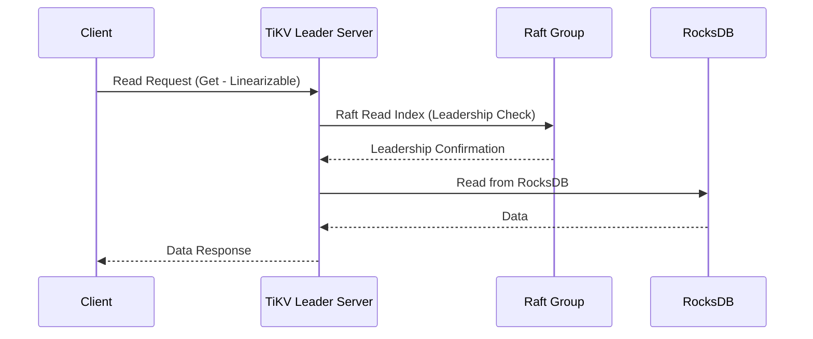

# Project Design Document: TiKV - Distributed Transactional Key-Value Database

**Project Name:** TiKV

**Project Repository:** [https://github.com/tikv/tikv](https://github.com/tikv/tikv)

**Document Version:** 1.1
**Date:** 2023-10-27
**Author:** AI Expert

**Changes from Version 1.0:**
*   Improved security considerations section with more specific examples.
*   Enhanced descriptions of data flow, especially read path consistency.
*   Clarified component interactions and configurations.
*   Minor formatting and wording improvements throughout the document.

## 1. Introduction

This document provides a detailed design overview of TiKV, a distributed transactional key-value database. This document is intended to serve as a foundation for threat modeling and security analysis of the TiKV project. It outlines the architecture, components, data flow, and key technologies involved in TiKV.

TiKV is designed to be a distributed, scalable, and highly available key-value store. It is built to provide strong consistency and ACID transactions, making it suitable as a storage layer for distributed transactional systems like TiDB. This document will be used to understand the system's boundaries, components, and interactions to facilitate a comprehensive threat model.

## 2. Project Overview

### 2.1. Purpose

TiKV's primary purpose is to provide a reliable, scalable, and consistent distributed key-value storage solution. It is designed to handle large amounts of data and high query loads while maintaining data integrity and availability. TiKV aims to be a robust and performant storage engine for mission-critical applications requiring strong data consistency and transactional guarantees in a distributed environment.

### 2.2. Key Features

*   **Distributed Architecture:** TiKV is designed for distributed operation, enabling horizontal scalability and inherent fault tolerance.
*   **Strong Consistency:**  Utilizes the Raft consensus algorithm to guarantee strong data consistency across all replicas, ensuring linearizability.
*   **ACID Transactions:** Supports full ACID (Atomicity, Consistency, Isolation, Durability) transactions, allowing complex, multi-operation transactions while preserving data integrity.
*   **Scalability:**  Achieves horizontal scalability by adding more TiKV server nodes to the cluster, increasing both storage capacity and query throughput linearly.
*   **High Availability:**  Leverages Raft replication and automated leader election and failover mechanisms to ensure continuous service availability even in the event of node failures.
*   **Geographical Replication (Planned/Future):**  Architected to support geographical replication for enhanced disaster recovery capabilities and reduced latency for geographically dispersed applications (currently under development/future roadmap).
*   **Pluggable Storage Engine:** Employs RocksDB as the default and highly optimized storage engine, but the design allows for potential integration of alternative storage engines if needed.
*   **gRPC Interface:** Exposes a well-defined gRPC interface for all communication, providing efficient, performant, and language-agnostic client and inter-component interaction.
*   **Region-based Data Management:** Data is partitioned into regions, which are the fundamental units of data management, replication, and load balancing.

## 3. Architecture Overview

TiKV's architecture is modular and distributed, comprising several interacting components. The following diagram illustrates the high-level architecture and component relationships:

```mermaid
graph LR
    subgraph "TiKV Cluster"
    A["Client Application"] --> B("PD (Placement Driver) Cluster")
    A --> C("TiKV Server Instance(s)")
    B --> C
    C --> D("Storage Engine (RocksDB)")
    C --> E("gRPC API")
    end
    style A fill:#f9f,stroke:#333,stroke-width:2px, title: "External Entity"
    style B fill:#ccf,stroke:#333,stroke-width:2px, title: "Control Plane"
    style C fill:#ccf,stroke:#333,stroke-width:2px, title: "Data Plane"
    style D fill:#eee,stroke:#333,stroke-width:2px, title: "Local Storage"
    style E fill:#eee,stroke:#333,stroke-width:2px, title: "Communication Interface"
```

### 3.1. Components

*   **Client Application:**  An external application or service that interacts with the TiKV cluster to perform data operations. Clients use the gRPC API to communicate with TiKV servers.
*   **PD (Placement Driver) Cluster:** The central control plane of the TiKV cluster, typically deployed as a cluster of 3 or 5 instances for high availability. PD is responsible for cluster-level management and coordination.
    *   **Metadata Management:** Stores and manages cluster metadata, including region information, store locations, key ranges, and cluster configuration.
    *   **Region Management:** Manages regions, the basic units of data sharding and replication. PD handles region creation, splitting, merging, and rebalancing across TiKV servers.
    *   **Placement Strategy:** Implements and enforces data placement policies, deciding where to locate regions and their replicas based on factors like store capacity, load distribution, and replication constraints.
    *   **Timestamp Oracle (TSO):** Provides a globally unique, monotonically increasing timestamp service, crucial for transaction ordering and consistency.
    *   **Cluster Monitoring and Health Check:** Monitors the health of the entire TiKV cluster, including TiKV servers and PD instances, and triggers alerts upon detecting failures or anomalies.
*   **TiKV Server Instance(s):** The core data storage and processing component of TiKV. Multiple TiKV server instances form the data plane of the cluster. Each TiKV server:
    *   **Data Storage:** Persistently stores data in RocksDB, a high-performance embedded key-value store.
    *   **Raft Consensus Group Member:** Participates in Raft consensus groups to replicate data and ensure strong consistency within each region. Each region is served by a dedicated Raft group.
    *   **Transaction Processing Engine:** Handles transactional requests from clients, including reads, writes, and complex transactions, ensuring ACID properties.
    *   **gRPC API Server:** Exposes a gRPC interface to clients for data access and management operations, and to PD for control plane communication.
    *   **Region Serving:** Serves read and write requests for specific regions it is responsible for, as determined by PD.
*   **Storage Engine (RocksDB):** The embedded persistent storage engine used by TiKV servers. RocksDB is optimized for high write throughput and efficient data retrieval from disk.
*   **gRPC API:** The communication interface used for all interactions within the TiKV ecosystem. gRPC provides a performant, strongly-typed, and language-agnostic communication layer based on Protocol Buffers.

## 4. Component Details

### 4.1. Client Application

*   **Functionality:**
    *   Initiates data operations (read, write, delete, scan) and transactional requests to the TiKV cluster.
    *   Discovers TiKV server addresses and region locations through interaction with the PD cluster.
    *   Manages transaction lifecycle (start, commit, rollback) using TiKV's transactional API.
    *   Handles connection management, retries, and error handling for communication with TiKV servers.
*   **Inputs:**
    *   User or application requests for data access and manipulation.
    *   Configuration parameters, including PD cluster addresses, security credentials, and connection timeouts.
*   **Outputs:**
    *   Data retrieved from TiKV in response to read requests.
    *   Confirmation of successful write or transactional operations.
    *   Error responses indicating failures or issues during operations.
*   **Interactions:**
    *   **PD Cluster:**  Queries for cluster metadata, region locations, and obtains timestamps for transactions.
    *   **TiKV Server Instance(s):** Sends data read and write requests, and transaction commands via the gRPC API.
*   **Configuration:**
    *   List of PD cluster addresses for initial connection and bootstrapping.
    *   Security credentials (username/password, TLS certificates) if authentication and encryption are enabled.
    *   gRPC connection parameters such as timeouts, retry policies, and keep-alive settings.

### 4.2. PD (Placement Driver) Cluster

*   **Functionality:**
    *   Centralized cluster metadata management and coordination.
    *   Automated region management, including splitting, merging, and rebalancing to optimize resource utilization and performance.
    *   Enforcement of placement strategies to ensure data distribution and replication according to defined policies.
    *   Timestamp Oracle (TSO) service for generating globally unique and monotonically increasing timestamps.
    *   Cluster health monitoring and alerting, detecting and responding to node failures and performance degradation.
    *   Provides API for cluster administration and management operations.
*   **Inputs:**
    *   Heartbeat messages and status reports from TiKV server instances.
    *   Client requests for cluster metadata and region information.
    *   Operator commands for cluster management, configuration changes, and scaling operations.
    *   Configuration parameters defining replication policies, region size limits, and cluster-wide settings.
*   **Outputs:**
    *   Cluster metadata information, including region mappings and store locations, provided to clients and TiKV servers.
    *   Region management commands (split, merge, transfer leader) issued to TiKV servers.
    *   Timestamps generated by the TSO service for transaction processing.
    *   Cluster health status, alerts, and monitoring metrics.
*   **Interactions:**
    *   **Client Application:** Provides cluster metadata, region information, and TSO timestamps.
    *   **TiKV Server Instance(s):** Receives heartbeats, issues region management commands, provides placement directives, and retrieves store status information.
    *   **Other PD Instances (within the PD cluster):**  Participates in Raft consensus to ensure data consistency and high availability of the PD cluster itself.
*   **Configuration:**
    *   Cluster ID to uniquely identify the TiKV cluster.
    *   Raft configuration for the PD cluster, including peer addresses and election settings.
    *   Storage configuration for persistent storage of PD metadata (typically RocksDB or etcd).
    *   Listen addresses and ports for client and TiKV server connections.
    *   Placement rules and policies defining data distribution and replication strategies.

### 4.3. TiKV Server Instance

*   **Functionality:**
    *   Persistent data storage and retrieval using the embedded RocksDB engine.
    *   Participation in Raft consensus groups for data replication, fault tolerance, and strong consistency within regions.
    *   Transaction processing, handling read and write operations within transactions, and ensuring ACID properties.
    *   Serving read and write requests for assigned regions, based on region ownership and leadership within Raft groups.
    *   gRPC server implementation for handling client and PD communication.
    *   Data compaction and garbage collection within RocksDB to maintain performance and storage efficiency.
    *   Region splitting and merging in coordination with PD.
*   **Inputs:**
    *   gRPC requests from client applications for data operations and transactions.
    *   gRPC requests from the PD cluster for region management commands, configuration updates, and placement information.
    *   Data replication messages from other TiKV server instances within the same Raft group.
*   **Outputs:**
    *   gRPC responses to client applications, including data, acknowledgements, and error messages.
    *   Heartbeat messages and status updates sent to the PD cluster.
    *   Data replication messages sent to Raft peers for consensus and data synchronization.
*   **Interactions:**
    *   **Client Application:** Receives data read and write requests and transaction commands via gRPC.
    *   **PD Cluster:** Sends heartbeats, receives region management commands, configuration updates, and placement directives.
    *   **RocksDB:** Interacts with RocksDB for persistent data storage and retrieval.
    *   **Other TiKV Server Instances (Raft peers):** Communicates with peers within the same Raft group for consensus, data replication, and leader election.
*   **Configuration:**
    *   Server ID to uniquely identify the TiKV server instance.
    *   PD cluster addresses for cluster discovery and control plane communication.
    *   RocksDB storage configuration, including data directory path and RocksDB options (cache size, write buffer size, etc.).
    *   Raft configuration parameters, such as election timeout and heartbeat interval.
    *   gRPC server listening address and port for client and PD connections.
    *   Region size thresholds for triggering region splitting.

### 4.4. Storage Engine (RocksDB)

*   **Functionality:**
    *   Provides persistent storage for key-value data on local disk.
    *   Optimized for high write throughput and efficient read operations.
    *   Supports data compaction and garbage collection to reclaim storage space and maintain performance.
    *   Offers features like snapshots and backups for data management and recovery.
*   **Inputs:**
    *   Write requests from the TiKV server, containing key-value pairs to be stored.
    *   Read requests from the TiKV server, specifying keys to retrieve.
    *   Configuration parameters, including storage path and RocksDB tuning options.
*   **Outputs:**
    *   Data retrieved in response to read requests.
    *   Confirmation of successful write operations.
    *   Snapshots of the database for backup purposes.
*   **Interactions:**
    *   **TiKV Server Instance:** Serves as the persistent storage layer for TiKV, providing all data storage and retrieval functionalities.
*   **Configuration:**
    *   Storage path on the local file system where data files are stored.
    *   RocksDB options for performance tuning, including cache size, block size, compression algorithms, and write buffer settings.

### 4.5. gRPC API

*   **Functionality:**
    *   Defines the communication protocols and data formats for all interactions between components in the TiKV ecosystem.
    *   Provides a high-performance and efficient communication layer based on Protocol Buffers.
    *   Supports request routing, serialization and deserialization of messages, and connection management.
    *   Enables language-agnostic communication between components written in different programming languages.
*   **Inputs:**
    *   Requests from client applications, PD cluster, and TiKV server instances.
*   **Outputs:**
    *   Responses to client applications, PD cluster, and TiKV server instances.
*   **Interactions:**
    *   Used by all components for inter-component communication, including client-to-TiKV, client-to-PD, TiKV-to-PD, and TiKV-to-TiKV (Raft) communication.
*   **Configuration:**
    *   gRPC port configurations on PD and TiKV servers.
    *   Security settings for gRPC communication, such as TLS/SSL encryption and authentication mechanisms.
    *   gRPC interceptors for request logging, monitoring, and security enforcement.

## 5. Data Flow

### 5.1. Write Request Flow (Simplified)

1.  **Client Sends Write:** The client application sends a write request (e.g., `Put`) to a TiKV server instance. The client typically uses a load balancer or PD-provided address to connect to a TiKV server.
2.  **Region and Leader Check:** The TiKV server receives the request and identifies the region responsible for the key. It then checks if it is the leader of the Raft group for that region. If not, it redirects the request to the leader.
3.  **Raft Propose and Consensus:** The leader TiKV server proposes the write operation to its Raft group. The Raft group members (replicas) participate in the consensus process.
4.  **Log Commit:** Once a majority of Raft group members have acknowledged the proposal and appended it to their Raft logs, the write operation is considered committed in the Raft log.
5.  **Apply to Storage:** The leader TiKV server applies the committed write operation to its local RocksDB storage engine.
6.  **Replication to Followers:** The committed operation is asynchronously replicated to follower replicas in the Raft group, and they also apply it to their local RocksDB instances.
7.  **Client Acknowledgment:** The leader TiKV server sends a success response back to the client application, confirming the write operation.



### 5.2. Read Request Flow (Simplified - Linearizable Read)

1.  **Client Sends Read:** The client application sends a read request (e.g., `Get`) to a TiKV server instance.
2.  **Region and Leader Check:** The TiKV server identifies the region and checks if it is the leader. For linearizable reads (strong consistency), the read typically needs to be served by the Raft leader to ensure the most up-to-date data.
3.  **Raft Read Index (Linearizability):** For linearizable reads, the leader may perform a Raft Read Index operation to ensure it is still the leader and that its data is up-to-date. This involves a lightweight Raft consensus step to confirm leadership.
4.  **Read from Storage:** The leader TiKV server reads the data from its local RocksDB storage engine.
5.  **Response to Client:** The leader TiKV server sends the retrieved data back to the client application.

For non-linearizable reads (e.g., follower reads, stale reads - for performance optimization in specific use cases), the read request can be served by a follower replica directly, bypassing the Raft Read Index step, but potentially reading slightly outdated data.



## 6. Technology Stack

*   **Core Programming Languages:**
    *   Rust: Primarily used for TiKV Server, Raft implementation, and performance-critical components.
    *   Go: Primarily used for PD (Placement Driver) and cluster management tools.
*   **Storage Engine:** RocksDB (C++ based embedded key-value store, highly optimized for performance).
*   **Consensus Algorithm Implementation:** Raft (Rust implementation, based on the Raft paper).
*   **Communication Protocol:** gRPC (Protocol Buffers for serialization and RPC framework).
*   **Monitoring and Metrics System:** Prometheus (for metrics collection), Grafana (for dashboards and visualization).
*   **Build System and Dependency Management:**
    *   Cargo (Rust's build system and package manager).
    *   Go modules (Go's dependency management system).
*   **Operating System Compatibility:** Primarily Linux-based systems, with efforts towards cross-platform compatibility where feasible.

## 7. Deployment Model

TiKV is designed for distributed deployment and can be deployed in various environments:

*   **On-Premise Datacenters:** Deployment on physical servers or virtual machines within a private datacenter, requiring manual infrastructure provisioning and management.
*   **Cloud Platforms (IaaS):** Deployment on cloud infrastructure services like AWS EC2, GCP Compute Engine, or Azure Virtual Machines, leveraging cloud-provided compute, storage, and networking.
*   **Containerized Environments (Kubernetes):** Ideal for deployment within container orchestration platforms like Kubernetes, utilizing container images and Kubernetes operators (e.g., TiDB Operator) for simplified deployment, scaling, and management.
*   **Hybrid Cloud:** Deployment across a combination of on-premise and cloud environments, potentially for disaster recovery or geographically distributed deployments.

A typical TiKV cluster deployment consists of:

*   **Multiple TiKV Server Instances:**  Number depends on data volume, throughput requirements, and desired fault tolerance. Typically 3 or more instances per region replica set.
*   **PD Cluster (3 or 5 Instances):**  For high availability of the control plane. An odd number of PD instances is recommended for Raft quorum.
*   **Load Balancer (Optional but Recommended):**  To distribute client requests across TiKV server instances, improving client-side load balancing and simplifying client connection management.
*   **Monitoring and Alerting Infrastructure:** Prometheus and Grafana for cluster monitoring, performance analysis, and alerting.

## 8. Security Considerations (Detailed)

This section expands on the security considerations for TiKV, providing more specific examples and potential threat areas. A comprehensive threat model should further analyze these and other potential vulnerabilities.

*   **Authentication and Authorization:**
    *   **Threat:** Unauthorized access to data and administrative operations.
    *   **Mitigation:**
        *   Enable TiKV's built-in authentication mechanisms (username/password).
        *   Implement Role-Based Access Control (RBAC) to restrict user and application access to specific resources and operations.
        *   Consider integration with external authentication providers (e.g., LDAP, Active Directory, OAuth 2.0) for centralized user management.
        *   Enforce strong password policies and regular password rotation.
    *   **Further Threat Modeling:** Analyze the granularity of RBAC, default roles, and potential for privilege escalation.

*   **Data Encryption:**
    *   **Threat:** Data breaches due to unauthorized access to storage media or network interception.
    *   **Mitigation:**
        *   **Encryption at Rest:** Enable TiKV's encryption at rest feature to encrypt data stored in RocksDB using industry-standard encryption algorithms (e.g., AES). Manage encryption keys securely (e.g., using a key management system).
        *   **Encryption in Transit:** Enforce TLS/SSL encryption for all gRPC communication between clients, PD, and TiKV servers. Use strong cipher suites and regularly update TLS certificates.
    *   **Further Threat Modeling:** Evaluate the key management process, encryption algorithm strength, and potential vulnerabilities in TLS configuration.

*   **Network Security:**
    *   **Threat:** Network-based attacks, including eavesdropping, man-in-the-middle attacks, and unauthorized access through network vulnerabilities.
    *   **Mitigation:**
        *   Implement network segmentation to isolate the TiKV cluster within a secure network zone.
        *   Use firewalls to restrict network access to only necessary ports and IP addresses for TiKV components.
        *   Disable unnecessary network services on TiKV and PD servers.
        *   Regularly patch operating systems and network infrastructure to address known vulnerabilities.
    *   **Further Threat Modeling:** Analyze network topology, firewall rules, exposed ports, and potential for lateral movement within the network.

*   **Access Control and Least Privilege:**
    *   **Threat:** Accidental or malicious data modification or deletion due to overly permissive access controls.
    *   **Mitigation:**
        *   Implement the principle of least privilege, granting users and applications only the minimum necessary permissions to perform their tasks.
        *   Regularly review and audit access control policies to ensure they remain appropriate and effective.
        *   Separate administrative and operational roles with distinct permissions.
    *   **Further Threat Modeling:** Review default permissions, identify sensitive operations, and analyze potential impact of compromised accounts with excessive privileges.

*   **Auditing and Logging:**
    *   **Threat:** Lack of visibility into security events and unauthorized activities, hindering incident detection and response.
    *   **Mitigation:**
        *   Enable comprehensive audit logging for all critical operations, including data access, administrative actions, and security-related events.
        *   Securely store audit logs in a centralized logging system.
        *   Implement monitoring and alerting on audit logs to detect suspicious activities and security anomalies.
        *   Regularly review audit logs for security investigations and compliance purposes.
    *   **Further Threat Modeling:** Define critical audit events, analyze log retention policies, and assess the effectiveness of log monitoring and alerting mechanisms.

*   **Security Hardening and Vulnerability Management:**
    *   **Threat:** Exploitation of vulnerabilities in TiKV software, dependencies, or underlying operating systems.
    *   **Mitigation:**
        *   Regularly update TiKV software, PD, RocksDB, and all dependencies to the latest versions with security patches.
        *   Implement a vulnerability scanning and management process to identify and remediate known vulnerabilities.
        *   Harden TiKV and PD servers by following security best practices, such as disabling unnecessary services, configuring secure OS settings, and using security tools (e.g., intrusion detection systems).
    *   **Further Threat Modeling:** Analyze dependency chain, identify critical dependencies, and assess patch management processes.

*   **Denial of Service (DoS) Protection:**
    *   **Threat:** Service disruption due to resource exhaustion or malicious traffic flooding.
    *   **Mitigation:**
        *   Implement rate limiting on client requests to prevent excessive load.
        *   Configure resource limits (CPU, memory, network bandwidth) for TiKV and PD servers.
        *   Deploy TiKV behind load balancers and firewalls to mitigate network-based DoS attacks.
        *   Consider using techniques like connection limiting and request queue management.
    *   **Further Threat Modeling:** Analyze resource consumption patterns, identify potential DoS attack vectors, and evaluate the effectiveness of DoS mitigation measures.

*   **Data Validation and Input Sanitization:**
    *   **Threat:** Data corruption or injection attacks due to improper handling of input data.
    *   **Mitigation:**
        *   Implement robust input validation and sanitization on the client and server sides to prevent injection attacks (e.g., SQL injection - although less relevant for key-value, consider command injection if extensions are used).
        *   Enforce data type and format validation to ensure data integrity.
    *   **Further Threat Modeling:** Analyze data input points, identify potential injection vulnerabilities, and review input validation mechanisms.

This improved design document provides a more detailed and security-focused overview of TiKV. It serves as a better starting point for a comprehensive threat modeling exercise, enabling a deeper understanding of potential security risks and informing the design of effective security controls.