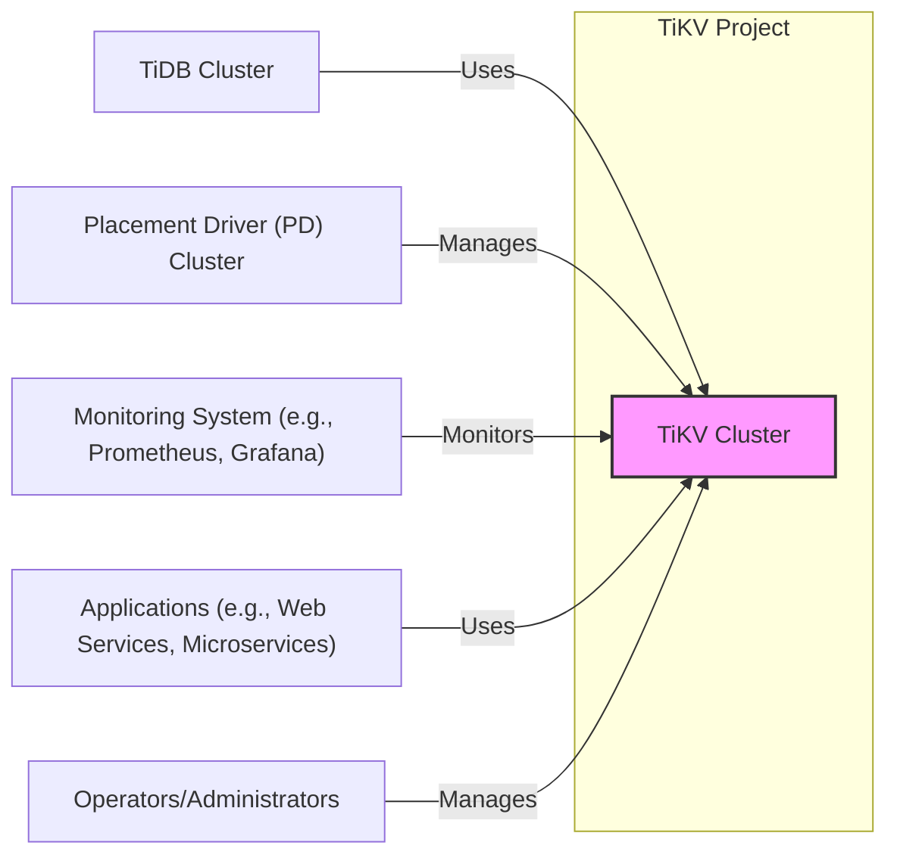
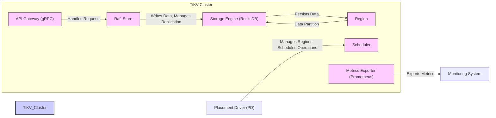
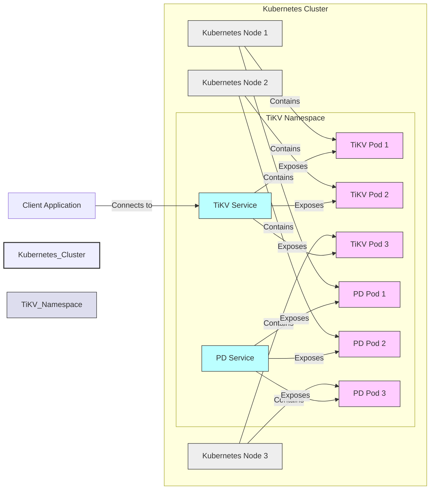

# BUSINESS POSTURE

TiKV is a distributed transactional key-value database. It is designed to provide high scalability, strong consistency, and high availability.  It is often used as the storage layer for distributed SQL databases like TiDB, but can also be used independently for applications requiring a robust key-value store.

Business Priorities and Goals:
- Provide a reliable, scalable, and performant distributed key-value storage solution.
- Ensure data consistency and durability even in the face of failures.
- Offer a robust and feature-rich database that can be used in demanding production environments.
- Support a wide range of use cases requiring distributed key-value storage.
- Maintain and grow a strong open-source community around the project.

Business Risks:
- Data loss or corruption due to software bugs, hardware failures, or operational errors.
- Unavailability of the database service, leading to application downtime.
- Performance degradation under heavy load, impacting application performance.
- Security vulnerabilities that could lead to data breaches or unauthorized access.
- Lack of adoption or community support, hindering project growth and sustainability.

# SECURITY POSTURE

Existing Security Controls:
- security control: Code review process for all code changes (inferred from standard open-source development practices).
- security control: Use of Go language, which has built-in memory safety features.
- security control:  Focus on robustness and stability, which indirectly contributes to security by reducing potential for exploitable bugs.
- security control:  Active community and maintainers who address reported issues, including security vulnerabilities.

Accepted Risks:
- accepted risk: As an open-source project, vulnerability disclosure and patching relies on community reporting and contributions. Response time may vary depending on the severity and complexity of the issue.
- accepted risk:  Security features and hardening might be prioritized based on community demand and common use cases, potentially leaving less common security needs less addressed initially.

Recommended Security Controls:
- security control: Implement automated security scanning tools (SAST, DAST, dependency scanning) in the CI/CD pipeline.
- security control:  Establish a clear security vulnerability reporting and response process.
- security control:  Provide documentation and best practices for secure deployment and configuration of TiKV.
- security control:  Consider adding encryption at rest and in transit as configurable options.
- security control:  Implement role-based access control (RBAC) for administrative operations.

Security Requirements:
- Authentication:
    - Requirement:  Mechanisms to authenticate clients connecting to TiKV, especially for administrative operations.
    - Requirement:  Consider authentication for inter-component communication within the TiKV cluster.
- Authorization:
    - Requirement:  Fine-grained authorization to control access to data and administrative functions.
    - Requirement:  Role-based access control for managing users and permissions.
- Input Validation:
    - Requirement:  Strict input validation at all API boundaries to prevent injection attacks and data corruption.
    - Requirement:  Sanitize and validate user-provided data before processing or storing it.
- Cryptography:
    - Requirement:  Consider encryption for data at rest to protect sensitive data stored on disk.
    - Requirement:  Implement encryption in transit (TLS) for all network communication between clients and TiKV servers, and between TiKV components.
    - Requirement:  Securely manage cryptographic keys used for encryption and authentication.

# DESIGN

## C4 CONTEXT

Context Diagram Elements:

- Element:
    - Name: TiKV Cluster
    - Type: Software System
    - Description: The TiKV distributed key-value database system itself. It stores data, handles transactions, and provides APIs for data access.
    - Responsibilities:
        - Storing key-value data reliably and durably.
        - Providing transactional guarantees (ACID properties).
        - Scaling horizontally to handle large datasets and high traffic.
        - Ensuring high availability and fault tolerance.
        - Exposing APIs for data read and write operations.
    - Security controls:
        - Security controls will be implemented within the TiKV containers as described in the Container Diagram.

- Element:
    - Name: TiDB Cluster
    - Type: Software System
    - Description: A distributed SQL database that often uses TiKV as its storage layer.
    - Responsibilities:
        - Providing a SQL interface for data access.
        - Query processing and optimization.
        - Transaction management across multiple TiKV instances.
    - Security controls:
        - Security controls are implemented by TiDB and are outside the scope of TiKV project itself. TiKV provides storage security features that TiDB can leverage.

- Element:
    - Name: Placement Driver (PD) Cluster
    - Type: Software System
    - Description: The control plane for TiKV. PD is responsible for cluster management, data placement, and scheduling.
    - Responsibilities:
        - Managing the topology of the TiKV cluster.
        - Scheduling data placement and rebalancing.
        - Handling leader election and cluster coordination.
        - Providing metadata about the cluster state.
    - Security controls:
        - Authentication and authorization for administrative access to PD.
        - Secure communication channels between PD and TiKV instances.

- Element:
    - Name: Monitoring System (e.g., Prometheus, Grafana)
    - Type: Software System
    - Description: External monitoring tools used to observe the health and performance of the TiKV cluster.
    - Responsibilities:
        - Collecting metrics from TiKV instances and PD.
        - Visualizing metrics and creating dashboards.
        - Alerting on anomalies and performance issues.
    - Security controls:
        - Secure access to monitoring data and dashboards.
        - Authentication and authorization for accessing monitoring system.

- Element:
    - Name: Applications (e.g., Web Services, Microservices)
    - Type: Software System
    - Description:  Applications that use TiKV to store and retrieve data.
    - Responsibilities:
        - Interacting with TiKV APIs to perform data operations.
        - Implementing application-level logic and business rules.
    - Security controls:
        - Application-level authentication and authorization.
        - Secure handling of data retrieved from TiKV.

- Element:
    - Name: Operators/Administrators
    - Type: Person
    - Description: Individuals responsible for deploying, configuring, and managing the TiKV cluster.
    - Responsibilities:
        - Deploying and configuring TiKV and PD clusters.
        - Monitoring cluster health and performance.
        - Performing maintenance and upgrades.
        - Managing security configurations.
    - Security controls:
        - Strong authentication for operator access (e.g., SSH keys, multi-factor authentication).
        - Role-based access control for administrative operations.
        - Audit logging of administrative actions.

## C4 CONTAINER

Container Diagram Elements:

- Element:
    - Name: API Gateway (gRPC)
    - Type: Container
    - Description:  The entry point for client applications to interact with TiKV. It exposes gRPC APIs for data read and write operations.
    - Responsibilities:
        - Receiving client requests over gRPC.
        - Authenticating and authorizing client requests (if implemented).
        - Forwarding requests to the Raft Store.
        - Handling API versioning and compatibility.
    - Security controls:
        - security control: TLS encryption for gRPC communication.
        - security control: Input validation of gRPC requests.
        - security control: Potential future implementation of gRPC interceptors for authentication and authorization.

- Element:
    - Name: Raft Store
    - Type: Container
    - Description: Implements the Raft consensus algorithm to ensure data consistency and fault tolerance. Manages data replication across multiple TiKV instances.
    - Responsibilities:
        - Participating in Raft consensus to replicate data changes.
        - Maintaining data consistency across replicas.
        - Handling leader election and membership changes.
        - Interacting with the Storage Engine to persist data.
    - Security controls:
        - security control: Secure inter-node communication within the Raft group (TLS if implemented).
        - security control: Data integrity checks to ensure data consistency during replication.

- Element:
    - Name: Storage Engine (RocksDB)
    - Type: Container
    - Description:  The underlying storage engine that physically stores data on disk. TiKV uses RocksDB, an embedded key-value store.
    - Responsibilities:
        - Persisting data to disk efficiently.
        - Providing fast read and write operations.
        - Managing data indexing and retrieval.
        - Handling data compaction and garbage collection.
    - Security controls:
        - security control: File system permissions to restrict access to data files.
        - security control: Potential future implementation of encryption at rest using RocksDB encryption features or OS-level encryption.

- Element:
    - Name: Region
    - Type: Container (Logical)
    - Description: A logical unit of data sharding and replication in TiKV. Data is divided into Regions, and each Region is replicated across multiple TiKV instances.
    - Responsibilities:
        - Representing a range of keys.
        - Being the unit of data replication and distribution.
        - Managed by the Placement Driver (PD).
    - Security controls:
        - Security controls are enforced at the Raft Store and Storage Engine level, which manage Regions.

- Element:
    - Name: Scheduler
    - Type: Container
    - Description:  Responsible for scheduling various operations within TiKV, such as data compaction, snapshotting, and region management.
    - Responsibilities:
        - Coordinating background tasks within TiKV.
        - Optimizing resource utilization.
        - Interacting with PD for scheduling instructions.
    - Security controls:
        - security control: Internal authorization to control access to scheduling operations.

- Element:
    - Name: Metrics Exporter (Prometheus)
    - Type: Container
    - Description: Exposes internal metrics of TiKV in Prometheus format for monitoring purposes.
    - Responsibilities:
        - Collecting and exposing metrics about TiKV performance and health.
        - Serving metrics data to monitoring systems like Prometheus.
    - Security controls:
        - security control:  Configuration to restrict access to the metrics endpoint (e.g., using network policies or authentication in Prometheus).

## DEPLOYMENT

Deployment Architecture: Kubernetes

Deployment Diagram Elements:

- Element:
    - Name: Kubernetes Cluster
    - Type: Infrastructure
    - Description:  The Kubernetes cluster providing the container orchestration platform for TiKV.
    - Responsibilities:
        - Managing container deployments and scaling.
        - Providing networking and service discovery.
        - Ensuring high availability of applications.
    - Security controls:
        - security control: Kubernetes RBAC for access control to the cluster API.
        - security control: Network policies to isolate namespaces and pods.
        - security control: Pod security policies/admission controllers to enforce security standards for pods.
        - security control: Secrets management for storing sensitive configuration data.

- Element:
    - Name: TiKV Namespace
    - Type: Namespace (Kubernetes)
    - Description: A Kubernetes namespace dedicated to deploying TiKV components.
    - Responsibilities:
        - Providing logical isolation for TiKV resources within the Kubernetes cluster.
        - Enforcing namespace-level security policies.
    - Security controls:
        - security control: Kubernetes Network Policies to restrict network traffic within the namespace and between namespaces.
        - security control: Kubernetes RBAC policies applied at the namespace level.

- Element:
    - Name: TiKV Pod 1/2/3
    - Type: Pod (Kubernetes)
    - Description: Kubernetes pods running instances of the TiKV container.
    - Responsibilities:
        - Running the TiKV container.
        - Providing compute and storage resources for TiKV.
    - Security controls:
        - security control: Container image security scanning to ensure base images are free of vulnerabilities.
        - security control: Least privilege principle applied to container runtime and user.
        - security control: Resource limits and quotas to prevent resource exhaustion.

- Element:
    - Name: PD Pod 1/2/3
    - Type: Pod (Kubernetes)
    - Description: Kubernetes pods running instances of the Placement Driver (PD) container.
    - Responsibilities:
        - Running the PD container.
        - Providing compute and storage resources for PD.
    - Security controls:
        - security control: Container image security scanning for PD images.
        - security control: Least privilege principle for PD containers.
        - security control: Resource limits and quotas for PD pods.

- Element:
    - Name: TiKV Service
    - Type: Service (Kubernetes)
    - Description: A Kubernetes service that provides a stable endpoint for accessing the TiKV cluster. Load balances traffic across TiKV pods.
    - Responsibilities:
        - Exposing the TiKV API to clients.
        - Load balancing client requests across TiKV pods.
        - Service discovery within the Kubernetes cluster.
    - Security controls:
        - security control: Network policies to control access to the TiKV service.

- Element:
    - Name: PD Service
    - Type: Service (Kubernetes)
    - Description: A Kubernetes service that provides a stable endpoint for accessing the PD cluster.
    - Responsibilities:
        - Exposing the PD API for cluster management.
        - Load balancing requests across PD pods.
    - Security controls:
        - security control: Network policies to control access to the PD service, restricting access to administrative users/systems.

- Element:
    - Name: Kubernetes Node 1/2/3
    - Type: Infrastructure (Compute)
    - Description: Physical or virtual machines that form the Kubernetes cluster and host the pods.
    - Responsibilities:
        - Providing compute resources for running containers.
        - Running the Kubernetes kubelet and container runtime.
    - Security controls:
        - security control: Hardening of the operating system on Kubernetes nodes.
        - security control: Regular patching and updates of the OS and Kubernetes components.
        - security control: Network security controls at the node level (firewalls, security groups).

## BUILD

```mermaid
graph LR
    Developer["Developer"] --> Code_Changes["Code Changes (Git)"]
    Code_Changes --> GitHub["GitHub Repository"]
    GitHub --> GitHub_Actions["GitHub Actions CI"]
    GitHub_Actions --> Build_Environment["Build Environment"]
    Build_Environment --> Build_Artifacts["Build Artifacts (Binaries, Images)"]
    Build_Artifacts --> Container_Registry["Container Registry (e.g., Docker Hub, GHCR)"]
    Build_Artifacts --> Package_Repository["Package Repository (e.g., crates.io)"]
    GitHub_Actions --> Security_Checks["Security Checks (SAST, Dependency Scan, Linting)"]
    Security_Checks --> Build_Environment

    style Developer fill:#ccf,stroke:#333,stroke-width:1px
    style GitHub fill:#ccf,stroke:#333,stroke-width:1px
    style GitHub_Actions fill:#ccf,stroke:#333,stroke-width:1px
    style Build_Environment fill:#fcf,stroke:#333,stroke-width:1px
    style Build_Artifacts fill:#fcf,stroke:#333,stroke-width:1px
    style Container_Registry fill:#bff,stroke:#333,stroke-width:1px
    style Package_Repository fill:#bff,stroke:#333,stroke-width:1px
    style Security_Checks fill:#fcf,stroke:#333,stroke-width:1px
```

Build Process Description:

The TiKV project utilizes a standard open-source build process, heavily relying on GitHub and GitHub Actions for CI/CD.

Build Process Elements:

- Element:
    - Name: Developer
    - Type: Person
    - Description: Software developers contributing to the TiKV project.
    - Responsibilities:
        - Writing code and submitting code changes.
        - Reviewing code changes from other developers.
    - Security controls:
        - security control: Developer workstations should be secured and regularly updated.
        - security control: Code review process to identify potential security vulnerabilities in code changes.

- Element:
    - Name: Code Changes (Git)
    - Type: Data
    - Description: Code modifications submitted by developers using Git version control.
    - Responsibilities:
        - Tracking code changes and history.
        - Facilitating collaboration among developers.
    - Security controls:
        - security control: Branch protection rules in GitHub to prevent unauthorized code changes to main branches.
        - security control: Signed commits to verify the authenticity of code contributions (if implemented).

- Element:
    - Name: GitHub Repository
    - Type: Software System (SaaS)
    - Description: The GitHub repository hosting the TiKV source code.
    - Responsibilities:
        - Storing and managing the source code.
        - Providing issue tracking and collaboration tools.
        - Triggering CI/CD pipelines.
    - Security controls:
        - security control: GitHub's security features, including access control, audit logs, and vulnerability scanning.
        - security control:  Two-factor authentication for maintainer accounts.

- Element:
    - Name: GitHub Actions CI
    - Type: Software System (SaaS)
    - Description: GitHub's built-in CI/CD service used to automate the build, test, and release process.
    - Responsibilities:
        - Automating the build process upon code changes.
        - Running tests and security checks.
        - Publishing build artifacts.
    - Security controls:
        - security control: Secure configuration of GitHub Actions workflows.
        - security control: Use of secrets management in GitHub Actions to protect sensitive credentials.
        - security control: Review and audit of GitHub Actions workflows.

- Element:
    - Name: Build Environment
    - Type: Infrastructure (Ephemeral)
    - Description: Ephemeral environment provisioned by GitHub Actions to perform the build process.
    - Responsibilities:
        - Providing the necessary tools and dependencies for building TiKV.
        - Executing build scripts and commands.
    - Security controls:
        - security control: Hardened build environment images.
        - security control: Isolation of build environments for different builds.
        - security control: Regular updates of build tools and dependencies.

- Element:
    - Name: Build Artifacts (Binaries, Images)
    - Type: Data
    - Description: The output of the build process, including binaries, container images, and packages.
    - Responsibilities:
        - Representing the compiled and packaged software.
        - Being distributed to users and deployment environments.
    - Security controls:
        - security control: Signing of build artifacts to ensure integrity and authenticity.
        - security control: Storage of build artifacts in secure repositories.

- Element:
    - Name: Container Registry (e.g., Docker Hub, GHCR)
    - Type: Software System (SaaS/Self-hosted)
    - Description: A registry for storing and distributing container images.
    - Responsibilities:
        - Storing container images.
        - Providing access to container images for deployment.
    - Security controls:
        - security control: Access control to the container registry to restrict who can push and pull images.
        - security control: Vulnerability scanning of container images in the registry.

- Element:
    - Name: Package Repository (e.g., crates.io)
    - Type: Software System (SaaS)
    - Description: A repository for storing and distributing software packages (e.g., Rust crates).
    - Responsibilities:
        - Storing software packages.
        - Providing access to packages for dependency management.
    - Security controls:
        - security control: crates.io security policies and infrastructure.
        - security control: Dependency scanning to identify vulnerable dependencies.

- Element:
    - Name: Security Checks (SAST, Dependency Scan, Linting)
    - Type: Software System (Automated Tools)
    - Description: Automated security tools integrated into the CI/CD pipeline to identify security issues.
    - Responsibilities:
        - Performing static application security testing (SAST).
        - Scanning dependencies for known vulnerabilities.
        - Running linters to enforce code quality and security best practices.
    - Security controls:
        - security control: Regularly updated security scanning tools and vulnerability databases.
        - security control: Configuration of security checks to match project security requirements.

# RISK ASSESSMENT

Critical Business Processes:
- Data storage and retrieval: Ensuring reliable and performant access to data is the core business process.
- Transaction processing: Maintaining ACID properties for transactions is crucial for data integrity.
- Cluster management and operations:  Efficient and reliable cluster management is essential for availability and scalability.

Data Sensitivity:
- Data stored in TiKV can be highly sensitive depending on the application using it. It can include:
    - Personally Identifiable Information (PII)
    - Financial data
    - Business-critical operational data
    - Intellectual property

Data sensitivity level is highly variable and depends on the specific use case.  For a general-purpose key-value store like TiKV, it should be assumed that it will be used to store sensitive data. Therefore, confidentiality, integrity, and availability of data are all high priorities.

# QUESTIONS & ASSUMPTIONS

Questions:
- What are the specific compliance requirements for TiKV deployments (e.g., GDPR, HIPAA, PCI DSS)?
- What is the expected threat model for TiKV? Are we primarily concerned with external attackers, insider threats, or both?
- What is the organization's risk appetite regarding security vulnerabilities and data breaches?
- Are there specific security features that are considered mandatory for deployment in production environments?
- What are the performance requirements and trade-offs when implementing security controls like encryption?

Assumptions:
- Assumption: TiKV is intended to be used in production environments that require high levels of reliability and security.
- Assumption: Security is a high priority for the TiKV project and its users.
- Assumption:  Users of TiKV will be responsible for configuring and deploying it securely in their own environments.
- Assumption:  The provided GitHub repository represents the current and actively developed version of TiKV.
- Assumption:  Kubernetes is a common deployment environment for TiKV, but other deployment methods are also possible.