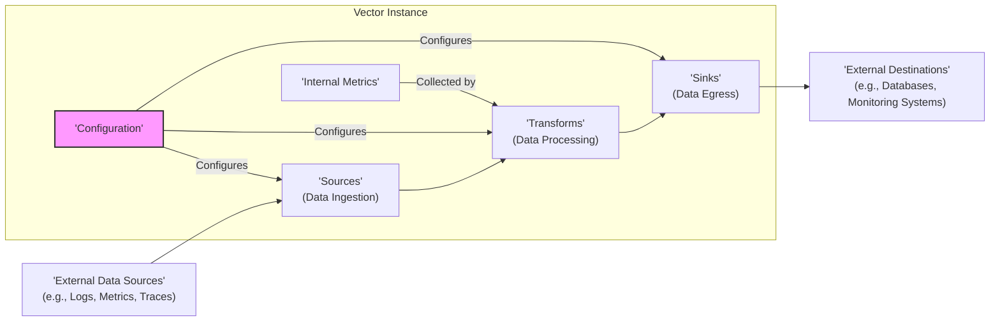

# Project Design Document: Vector - An Observability Data Router

**Version:** 1.1
**Date:** October 26, 2023
**Author:** Gemini (AI Language Model)

## 1. Introduction

This document provides an enhanced, detailed design overview of the Vector project, an open-source, high-performance observability data router. This document is intended to serve as a robust foundation for subsequent threat modeling activities, providing a clear and comprehensive understanding of the system's architecture, key components, and operational nuances.

## 2. Project Overview

Vector is a specialized tool designed for the efficient collection, transformation, and routing of observability data. It acts as a crucial intermediary within modern observability pipelines, bridging the gap between diverse data sources (logs, metrics, traces) and various destination systems (monitoring platforms, storage solutions, analytics tools). Its core functionalities are:

* **Versatile Data Collection:**  Ingesting data from a wide array of heterogeneous sources, accommodating different protocols and formats.
* **Powerful Data Transformation:**  Providing mechanisms to modify, enrich, and sanitize data streams based on user-defined rules and logic.
* **Intelligent Data Routing:**  Enabling the delivery of data to multiple destinations based on flexible configuration and conditional logic.
* **Robust Buffering and Reliability:**  Implementing strategies to ensure data delivery even during transient network issues or destination unavailability, preventing data loss.
* **Extensibility:** Designed with a plugin-based architecture allowing for custom source, transform, and sink implementations.

## 3. System Architecture

The following diagram illustrates the high-level architecture of a typical Vector instance:

### 3.1. Key Components

* **Sources:**
    * The entry points for observability data into the Vector pipeline.
    * Responsible for establishing connections with external systems and ingesting data.
    * Support a diverse range of protocols (e.g., Syslog UDP/TCP, HTTP/HTTPS, Kafka, gRPC, various cloud provider APIs) and data formats (e.g., plain text, JSON, Protobuf).
    * Often involve listening on network ports or polling external APIs.
    * Examples:
        * `file`: Reads data from local files.
        * `socket`: Listens for data on TCP or UDP sockets.
        * `http`: Exposes an HTTP endpoint for receiving data.
        * `kafka`: Consumes messages from Kafka topics.
        * `prometheus_scrape`: Scrapes metrics from Prometheus endpoints.
        * Cloud-specific sources (e.g., `aws_cloudwatch_logs`, `azure_event_hubs`).

* **Transforms:**
    * The data processing units within the Vector pipeline.
    * Receive data from sources or other transforms and apply user-defined transformations.
    * Transformations can include:
        * **Filtering:** Selecting specific events based on criteria.
        * **Aggregation:** Combining multiple data points into summaries.
        * **Enrichment:** Adding context or metadata to events.
        * **Remapping:** Restructuring or renaming fields within events.
        * **Parsing:** Extracting structured data from unstructured text.
        * **Data Masking/Obfuscation:** Redacting sensitive information.
    * Implemented using various techniques, including a powerful built-in remap language (VRL), regular expressions, and potentially external scripting capabilities.
    * Examples:
        * `remap`: Applies complex transformations using VRL.
        * `filter`: Discards events based on a boolean expression.
        * `aggregate`: Computes metrics over a window of time.
        * `json_parser`: Parses JSON formatted data.
        * `regex_parser`: Extracts data using regular expressions.

* **Sinks:**
    * The exit points for processed data from the Vector pipeline.
    * Responsible for delivering data to external destination systems.
    * Support various output formats and protocols required by different destinations.
    * Often involve establishing connections to external services and authenticating.
    * Implement buffering and retry mechanisms to handle temporary outages or failures in destination systems.
    * Examples:
        * `loki`: Sends logs to a Grafana Loki instance.
        * `elasticsearch`: Indexes data into an Elasticsearch cluster.
        * `splunk_hec`: Sends events to Splunk via the HTTP Event Collector.
        * `kafka`: Produces messages to Kafka topics.
        * Cloud-specific sinks (e.g., `aws_cloudwatch_metrics`, `google_cloud_storage`).

* **Configuration:**
    * Defines the entire behavior of a Vector instance.
    * Typically loaded from a configuration file (e.g., TOML, YAML) or potentially through environment variables.
    * Specifies the pipeline topology by defining sources, transforms, and sinks, and how they are connected.
    * Includes detailed parameters for each component, such as connection details, data formats, transformation logic, and buffering settings.
    * Supports dynamic reloading of configuration changes without requiring a full restart in most scenarios.

* **Internal Metrics:**
    * Vector generates internal metrics about its own operation and performance.
    * These metrics provide valuable insights into Vector's health, throughput, error rates, and resource utilization.
    * Can be exposed through various mechanisms (e.g., Prometheus endpoint, internal logs).
    * Important for monitoring Vector itself and identifying potential bottlenecks or issues.

## 4. Data Flow

The typical lifecycle of observability data within a Vector instance follows these stages:

1. **Ingestion:** External data sources transmit observability data to the configured Sources within the Vector instance. This might involve pushing data to Vector or Vector pulling data from the source.
2. **Initial Processing (Source):** Sources may perform some initial processing, such as parsing the raw data into a structured format.
3. **Transformation Pipeline:** Data ingested by a Source is then passed sequentially through one or more configured Transforms. Each Transform applies its specific processing logic to the data. The order of transforms is crucial and defined in the configuration.
4. **Conditional Routing (Implicit):** While not a dedicated component, the configuration of Sinks often involves implicit routing logic. Data from specific sources or after certain transformations might be directed to different Sinks based on their configuration.
5. **Egress:** Transformed data is delivered by the configured Sinks to their designated external destination systems. Sinks handle the necessary formatting and protocol conversions for the target destination.
6. **Internal Monitoring:** Vector's Internal Metrics are continuously collected and can be routed to monitoring systems via configured Sinks, allowing for observation of Vector's performance.

## 5. Deployment Model

Vector's flexibility allows for deployment in various environments, catering to different needs and scales:

* **Standalone Binary:** Running directly on an operating system (Linux, macOS, Windows) as a single process. Suitable for simpler deployments or local development.
* **Containerized Environment (Docker, Podman):** Deployed as a container image, enabling portability and consistent execution across different environments. This is a common and recommended method for production deployments.
* **Orchestrated Environment (Kubernetes):** Deployed and managed within a Kubernetes cluster, leveraging its scaling, resilience, and management capabilities. Often deployed as a `Deployment` or `StatefulSet`.
* **Managed Services:** While not currently a standard offering from major cloud providers, the possibility exists for third-party managed Vector services to emerge.

## 6. External Integrations

Vector's core purpose is to integrate with a wide range of external systems:

* **Data Sources (Examples):**
    * Log Aggregators (e.g., Fluentd, Rsyslog, journald)
    * Application Logs (e.g., log files in various formats)
    * Metrics Systems (e.g., Prometheus, StatsD, Graphite)
    * Tracing Systems (e.g., Jaeger, OpenTelemetry Collector)
    * Message Queues (e.g., Kafka, RabbitMQ, Redis Pub/Sub)
    * Cloud Provider Logging & Monitoring Services (e.g., AWS CloudWatch Logs, Azure Monitor Logs, Google Cloud Logging)
    * Databases (for reading audit logs or other relevant data)
    * Webhooks and API Endpoints

* **Data Destinations (Examples):**
    * Monitoring and Observability Platforms (e.g., Grafana, Datadog, New Relic, Dynatrace)
    * Logging Platforms (e.g., Elasticsearch, Splunk, Loki, Humio)
    * Time-Series Databases (e.g., InfluxDB, TimescaleDB, Prometheus remote write)
    * Message Queues (e.g., Kafka, RabbitMQ)
    * Object Storage (e.g., AWS S3, Google Cloud Storage, Azure Blob Storage)
    * Alerting Systems (e.g., PagerDuty, Alertmanager)

## 7. Configuration Details

Vector's configuration is declarative and defines the data pipeline. Key aspects of the configuration include:

* **Sources Configuration:**
    * `type`: Specifies the type of source (e.g., `file`, `socket`).
    * Source-specific parameters: Vary depending on the source type (e.g., `path` for `file`, `address` and `port` for `socket`).
    * `data_format`: Defines how the raw data should be interpreted (e.g., `json`, `logfmt`, `syslog`).
    * Optional settings: Buffering parameters, TLS configuration, authentication details.

* **Transforms Configuration:**
    * `type`: Specifies the type of transform (e.g., `remap`, `filter`).
    * Transform-specific parameters: Define the transformation logic (e.g., Lua script or VRL for `remap`, filter expressions for `filter`).
    * `inputs`: Specifies which sources or other transforms provide input to this transform.

* **Sinks Configuration:**
    * `type`: Specifies the type of sink (e.g., `loki`, `elasticsearch`).
    * Sink-specific connection details:  Credentials, URLs, API keys required to connect to the destination.
    * `inputs`: Specifies which sources or transforms provide input to this sink.
    * `encoding`: Defines how the data should be formatted for the destination (e.g., `json`, `protobuf`).
    * `batch`: Configuration for batching events before sending to the destination.
    * `request`:  Advanced configuration for customizing HTTP requests for HTTP-based sinks.
    * `auth`: Authentication details for connecting to the sink.
    * `tls`: TLS/SSL configuration for secure connections.
    * `buffer`: Settings for buffering data before sending.

* **Global Settings:**
    * `data_dir`:  Path to the directory used for buffering data.
    * `api`: Configuration for Vector's internal API (if enabled).
    * `logs`: Settings for Vector's own logging.
    * `telemetry`: Configuration for exporting Vector's internal metrics.

## 8. Security Considerations (Detailed)

This section expands on the initial security considerations, providing more specific details relevant for threat modeling:

* **Data in Transit Security:**
    * **TLS/SSL Encryption:**  Vector supports TLS/SSL for encrypting communication with external sources and sinks. Proper configuration of TLS versions, cipher suites, and certificate validation is crucial.
    * **Mutual TLS (mTLS):**  For enhanced security, Vector can be configured to use mTLS, requiring both Vector and the external endpoint to present valid certificates.
    * **Protocol Security:**  When using protocols like HTTP, ensure HTTPS is used. For other protocols, investigate available secure options.

* **Data at Rest Security:**
    * **Buffer Encryption:**  Consider encrypting the data buffered to disk using operating system-level encryption or dedicated encryption mechanisms.
    * **Configuration File Security:**  The configuration file often contains sensitive credentials. Secure its storage with appropriate file permissions and access control. Avoid storing it in publicly accessible locations. Consider using secrets management tools.

* **Authentication and Authorization:**
    * **Source Authentication:**  Vector needs to authenticate with certain sources (e.g., using API keys, tokens, or credentials for cloud services). Securely manage and store these credentials.
    * **Sink Authentication:**  Similarly, Vector needs to authenticate with destination systems. Employ secure credential management practices.
    * **Vector's Internal API Security:** If Vector's internal API is enabled, secure it with authentication and authorization mechanisms to prevent unauthorized access and control.

* **Configuration Security:**
    * **Preventing Unauthorized Modification:** Implement mechanisms to prevent unauthorized changes to the Vector configuration, as this could lead to data breaches or service disruption.
    * **Configuration Auditing:**  Maintain an audit log of configuration changes for traceability and security monitoring.

* **Input Validation and Sanitization:**
    * **Preventing Injection Attacks:**  Vector should implement robust input validation and sanitization to prevent injection attacks (e.g., log injection, command injection) if user-provided data is used in external system interactions.
    * **Handling Malformed Data:**  Vector should gracefully handle malformed or unexpected data from sources to prevent crashes or unexpected behavior.

* **Dependency Management and Vulnerability Scanning:**
    * **Regularly Update Dependencies:** Keep Vector's dependencies up-to-date to patch known vulnerabilities.
    * **Vulnerability Scanning:**  Integrate vulnerability scanning into the development and deployment process to identify and address potential security flaws in Vector and its dependencies.

* **Resource Limits and Denial of Service Prevention:**
    * **Rate Limiting:** Implement rate limiting on sources or sinks to prevent overwhelming Vector or downstream systems.
    * **Memory and CPU Limits:** Configure resource limits (e.g., CPU and memory limits in containerized environments) to prevent resource exhaustion attacks.
    * **Buffering Limits:**  Set appropriate limits on buffer sizes to prevent excessive disk usage.

* **Secrets Management:**
    * **Avoid Hardcoding Secrets:** Never hardcode sensitive credentials directly in the configuration file.
    * **Utilize Secrets Management Tools:** Integrate with secrets management tools (e.g., HashiCorp Vault, AWS Secrets Manager, Azure Key Vault) to securely store and retrieve credentials.

* **Network Security:**
    * **Network Segmentation:** Deploy Vector in a segmented network to limit the impact of potential breaches.
    * **Firewall Rules:**  Configure firewalls to restrict network access to Vector and from Vector to external systems, allowing only necessary traffic.

## 9. Future Considerations

* **Enhanced Control Plane:** Development of a more sophisticated control plane for managing and monitoring multiple Vector instances, potentially with features like centralized configuration management and health monitoring.
* **Advanced Plugin System:** Further enhancements to the plugin system to simplify the development and distribution of custom sources, transforms, and sinks.
* **Improved Observability of Vector:** Providing richer internal metrics, distributed tracing capabilities for the data pipeline, and more comprehensive logging for troubleshooting.
* **Stream Processing Capabilities:** Exploring more advanced stream processing features beyond basic transformations, such as windowing and stateful processing.

## 10. Conclusion

This improved design document provides a more detailed and comprehensive understanding of the Vector project's architecture and functionality. The enhanced security considerations section offers a more robust foundation for conducting thorough threat modeling exercises. This document should serve as a valuable resource for security analysts, developers, and operators working with Vector.