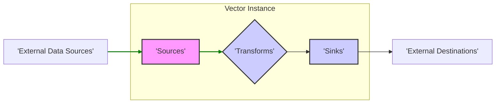
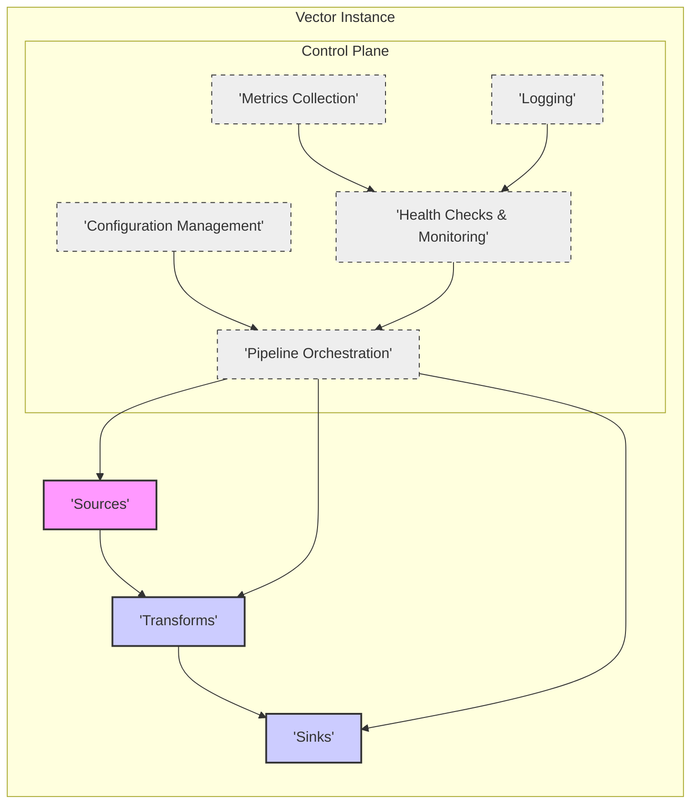

Okay, I will improve the project design document for Vector, focusing on clarity, detail, completeness, and security considerations for threat modeling. I will also ensure valid markdown and mermaid syntax, and avoid markdown tables.

# Project Design Document: Vector Observability Data Pipeline

**Project Name:** Vector

**Project Repository:** [https://github.com/timberio/vector](https://github.com/timberio/vector)

**Document Version:** 1.1
**Date:** 2023-10-27
**Author:** AI Expert

## 1. Project Overview

Vector is a robust, high-performance, and open-source observability data pipeline designed for modern infrastructure. It serves as a unified agent for collecting, transforming, and routing logs, metrics, and traces, simplifying observability infrastructure. Vector's core philosophy is to provide a universal data router that is efficient, reliable, and adaptable to diverse environments and observability backends.

Key advantages and features of Vector include:

*   **Unified Observability Pipeline:** Consolidates the handling of logs, metrics, and traces within a single, cohesive agent, reducing operational complexity.
*   **Performance and Resource Efficiency:** Built using Rust, Vector achieves exceptional performance with minimal resource consumption, making it suitable for resource-constrained environments.
*   **Broad Ecosystem Integration:** Offers extensive support for a wide array of sources and sinks, encompassing popular observability platforms, cloud providers, databases, and message queues. This ensures compatibility with existing infrastructure and reduces vendor lock-in.
*   **Advanced Data Transformation:** Employs the powerful Vector Remap Language (VRL) to enable sophisticated data enrichment, filtering, aggregation, and manipulation. VRL provides a flexible and expressive way to tailor observability data to specific needs.
*   **Reliability and Data Durability:** Incorporates robust buffering mechanisms (in-memory and on-disk) and retry logic to guarantee data delivery, even in the face of network disruptions or sink unavailability. This ensures data integrity and minimizes data loss.
*   **Declarative Configuration as Code:** Utilizes a declarative TOML-based configuration, promoting infrastructure-as-code practices. This allows for version control, automated deployments, and consistent configurations across environments.
*   **Self-Observability:** Exposes comprehensive internal metrics and logs, providing deep insights into Vector's operational health, performance characteristics, and pipeline throughput. This enables proactive monitoring and troubleshooting of the data pipeline itself.
*   **Extensibility:** Designed with extensibility in mind, allowing users to develop custom sources, transforms, and sinks to meet specific requirements not covered by the core functionality.

This design document provides a detailed overview of Vector's architecture, components, data flow, deployment models, and security considerations. It is intended to serve as a foundation for threat modeling and security analysis of Vector deployments.

## 2. System Architecture

Vector's architecture is centered around a pipeline model, where observability data progresses through distinct stages: **Sources**, **Transforms**, and **Sinks**, all orchestrated by a central **Control Plane**.

### 2.1. Components

*   **Sources:** The entry points for data ingestion into Vector.
    *   **Functionality:** Sources are responsible for:
        *   Establishing connections to various data origins.
        *   Receiving or pulling raw data.
        *   Parsing and structuring the raw data into Vector's internal event format.
        *   Handling source-specific authentication and authorization.
        *   Managing connection state and error handling for data ingestion.
    *   **Examples:**
        *   `file`: Reads logs from files, supporting various formats and rotation strategies.
        *   `journald`: Collects system logs from systemd journal.
        *   `syslog`: Receives logs over the syslog protocol (UDP, TCP).
        *   `http`: Accepts data via HTTP requests (e.g., from applications or webhooks).
        *   `tcp`, `udp`: Listens for data over raw TCP or UDP sockets.
        *   `kafka`: Consumes messages from Kafka topics.
        *   `aws_cloudwatch_logs`: Retrieves logs from AWS CloudWatch Logs.
        *   `gcp_pubsub`: Subscribes to messages from Google Cloud Pub/Sub.
        *   `prometheus_scrape`: Scrapes metrics from Prometheus endpoints.
        *   `internal_metrics`: Generates Vector's own internal performance metrics.

*   **Transforms:** Components that process and manipulate events as they traverse the pipeline.
    *   **Functionality:** Transforms are applied sequentially and perform operations such as:
        *   Filtering events based on specific criteria (e.g., log level, metric name).
        *   Data enrichment by adding metadata, lookups, or contextual information.
        *   Data modification and restructuring using VRL for complex transformations.
        *   Aggregation of events to calculate metrics or summarize data.
        *   Parsing unstructured data formats (e.g., CSV, grok patterns) into structured events.
        *   Sampling events to reduce data volume while preserving representativeness.
        *   Encoding and decoding data formats (e.g., JSON, base64).
        *   Routing events to different sinks based on event content or metadata.
    *   **Examples:**
        *   `filter`: Discards events that do not match defined criteria.
        *   `remap`: Applies VRL expressions for complex data transformation and manipulation.
        *   `aggregate`: Computes aggregations over events within a time window.
        *   `json_parser`: Parses JSON formatted data within events.
        *   `regex_parser`: Extracts data from events using regular expressions.
        *   `sample`: Randomly samples events at a specified rate.
        *   `json_encoder`, `base64_encoder`: Encodes event data into JSON or Base64 formats.

*   **Sinks:** The exit points for processed data from Vector, delivering events to external destinations.
    *   **Functionality:** Sinks are responsible for:
        *   Establishing connections to destination systems.
        *   Serializing and formatting events according to the destination's requirements.
        *   Transmitting events to the destination.
        *   Handling sink-specific authentication and authorization.
        *   Implementing buffering and retry mechanisms for reliable delivery.
        *   Managing connection pooling and error handling for data delivery.
    *   **Examples:**
        *   `file`: Writes events to files, suitable for local storage or archival.
        *   `loki`: Sends logs to Grafana Loki.
        *   `elasticsearch`: Indexes events into Elasticsearch.
        *   `clickhouse`: Writes events to ClickHouse databases.
        *   `kafka`: Produces messages to Kafka topics.
        *   `redis`: Publishes events to Redis channels or writes to Redis streams.
        *   `datadog`, `honeycomb`, `new_relic`, `splunk`: Sends data to various observability platforms.
        *   `aws_cloudwatch_metrics`, `gcp_cloud_monitoring`: Publishes metrics to cloud provider monitoring services.
        *   `http`: Sends events to HTTP endpoints (e.g., webhooks, APIs).

*   **Control Plane:** The central management and orchestration layer of Vector.
    *   **Functionality:** The Control Plane manages the lifecycle and operation of the entire Vector instance, including:
        *   **Configuration Loading and Management:** Reads, parses, validates, and manages the Vector configuration file (typically TOML). Supports hot reloading of configuration changes without service interruption.
        *   **Pipeline Orchestration:** Initializes, starts, stops, and manages the data flow between sources, transforms, and sinks. Ensures proper sequencing and error handling within the pipeline.
        *   **Health Checks and Monitoring:** Performs internal health checks on Vector components and the overall pipeline. Exposes health status via HTTP endpoints and internal metrics.
        *   **Metrics Collection and Exposure:** Gathers internal metrics related to Vector's performance, resource utilization (CPU, memory, network), and pipeline throughput. Exposes these metrics in Prometheus format for monitoring and alerting.
        *   **Logging and Error Reporting:** Generates logs for Vector's internal operations, including startup, shutdown, configuration changes, errors, and warnings. Provides detailed logging for debugging and auditing purposes.
        *   **Signal Handling:** Manages system signals (e.g., SIGTERM, SIGINT, SIGHUP) for graceful shutdown and configuration reloading.

### 2.2. Data Flow

Data within Vector flows unidirectionally through the pipeline in an asynchronous, event-driven manner:

1.  **Data Ingestion (Sources):** Sources actively ingest data from configured external systems based on their specific mechanisms (e.g., polling files, listening on network ports, subscribing to message queues).
2.  **Event Creation and Internal Representation:** Sources parse and structure the raw ingested data into Vector's internal event format. This format provides a consistent representation for data processing throughout the pipeline.
3.  **Transformation Pipeline (Transforms):** Events are sequentially passed through the configured transforms. Each transform applies its defined logic to modify, filter, or enrich the events. Transforms operate in memory and do not persist data themselves.
4.  **Routing and Fan-out:** After transformations, events are routed to one or more sinks based on the pipeline configuration. Vector supports fan-out, allowing events to be sent to multiple destinations simultaneously.
5.  **Data Delivery (Sinks):** Sinks serialize and format events according to the requirements of their respective destinations and deliver them. Sinks handle connection management, buffering, retries, and error handling to ensure reliable data delivery.

Vector utilizes internal asynchronous channels and buffering mechanisms to manage data flow, handle backpressure, and ensure efficient resource utilization. This architecture allows Vector to handle high volumes of data with low latency and minimal resource overhead.

### 2.3. Configuration

Vector's behavior is defined through a declarative TOML configuration file. This file specifies:

*   **`sources` Section:** Defines each data source instance, including:
    *   `type`: The type of source (e.g., `file`, `http`, `kafka`).
    *   `inputs`: Source-specific configuration parameters (e.g., file paths, listening addresses, Kafka brokers).
    *   `decoding`: Optional data decoding settings (e.g., character encoding).
    *   `rate_limits`: Configuration for rate limiting data ingestion from the source.
    *   `authentication` and `authorization`: Credentials and settings for secure access to the data source.
*   **`transforms` Section:** Defines a sequence of data transformations to be applied, including:
    *   `type`: The type of transform (e.g., `filter`, `remap`, `aggregate`).
    *   `inputs`: Specifies which sources or previous transforms provide input to this transform.
    *   `parameters`: Transform-specific configuration parameters (e.g., filter expressions, VRL code, aggregation settings).
*   **`sinks` Section:** Defines each data destination, including:
    *   `type`: The type of sink (e.g., `loki`, `elasticsearch`, `http`).
    *   `inputs`: Specifies which sources or transforms provide input to this sink.
    *   `encoding`: Data encoding settings for the sink (e.g., JSON, protobuf).
    *   `address` or `endpoints`: Destination-specific connection details (e.g., server addresses, API endpoints).
    *   `authentication` and `authorization`: Credentials and settings for secure access to the data sink.
    *   `buffering`: Configuration for sink-side buffering and retry mechanisms.
    *   `request_limits`: Configuration for rate limiting requests to the sink.
*   **`global` Section:** Defines global settings for the Vector instance, such as:
    *   `data_dir`: Directory for persistent data (e.g., on-disk buffers).
    *   `api`: Configuration for Vector's internal API (e.g., health check endpoint).
    *   `logs`: Configuration for Vector's internal logging (e.g., log level, output format).
    *   `telemetry`: Configuration for internal metrics exposure (e.g., Prometheus endpoint).

Configuration changes can be applied dynamically by reloading the configuration file, allowing for runtime adjustments to the data pipeline without requiring a full restart of Vector.

## 3. Deployment Model

Vector's flexible architecture supports various deployment models, catering to different use cases and scaling requirements:

*   **Agent (Forwarder):** Deployed as a lightweight agent on individual hosts, virtual machines, containers, or edge devices.
    *   **Use Case:** Collecting local logs, metrics, and traces from the host or application. Typically forwards data to a central aggregator or observability backend.
    *   **Characteristics:** Resource-efficient, focused on data collection and initial processing. Often deployed per host or application instance.
*   **Aggregator (Central Collector):** Deployed as a centralized collector to receive data from multiple Vector agents or other sources.
    *   **Use Case:** Centralizing data ingestion, performing more complex transformations, and routing data to multiple destinations. Can act as a buffer and load balancer for downstream systems.
    *   **Characteristics:** Higher resource requirements than agents, designed for handling aggregated data streams. May perform more intensive transformations and routing logic.
*   **Standalone:** Deployed as a single, self-contained instance that handles all stages of the pipeline, from ingestion to delivery.
    *   **Use Case:** Smaller deployments, testing environments, or specific use cases where a distributed architecture is not required.
    *   **Characteristics:** Simpler deployment model, suitable for less demanding workloads. Can be scaled vertically by increasing resources.
*   **Distributed Deployment (Horizontally Scaled Aggregators):**  For high-scale environments, Vector aggregators can be deployed horizontally behind a load balancer.
    *   **Use Case:** Handling massive data volumes, achieving high availability and fault tolerance.
    *   **Characteristics:** Requires more complex configuration management and coordination. Load balancing distributes traffic across multiple aggregator instances. Configuration consistency across instances is crucial. Considerations for state management and data partitioning may arise depending on the specific use case and sinks.  While Vector itself isn't inherently a distributed system with built-in coordination, deploying multiple instances behind a load balancer provides horizontal scalability and redundancy.

**Deployment Environments:**

Vector is designed to operate across diverse environments:

*   **Cloud Platforms (AWS, GCP, Azure):**  Seamlessly deployable on cloud infrastructure using virtual machines (EC2, Compute Engine, Azure VMs), container orchestration platforms (Kubernetes, ECS, GKE, AKS), and serverless functions (though less common for full pipeline due to potential state management complexities).
*   **On-Premise Data Centers:**  Deployable on physical servers, virtualized environments (VMware, Hyper-V), and on-premise Kubernetes clusters.
*   **Edge Computing Environments:**  Suitable for deployment on edge devices, gateways, and IoT infrastructure for local data processing, filtering, and forwarding before sending data to the cloud or central data centers.

## 4. Key Features Relevant to Security

Vector incorporates several features and considerations relevant to security, which are crucial for threat modeling:

*   **Data Buffering and Persistence:** Vector's buffering mechanisms (in-memory and optional on-disk persistence) enhance data reliability but introduce security considerations for persisted data.
    *   **Security Implication:** Data persisted to disk (using `data_dir`) may contain sensitive information. Encryption at rest for the `data_dir` should be considered, especially in environments with strict data privacy requirements. Access control to the `data_dir` is also critical.
*   **TLS/SSL Encryption:** Vector supports TLS/SSL encryption for secure communication with sources and sinks that utilize these protocols (e.g., `http`, `kafka`, `redis`, cloud provider APIs).
    *   **Security Benefit:** Protects data in transit from eavesdropping and man-in-the-middle attacks. Configuration of TLS/SSL certificates and key management are important security aspects.
*   **Authentication and Authorization:** Many sources and sinks support authentication mechanisms (API keys, username/password, certificates, OAuth, IAM roles). Vector can be configured to leverage these mechanisms.
    *   **Security Benefit:** Restricts access to data sources and destinations to authorized entities. Secure storage and management of credentials within Vector's configuration are paramount. Principle of least privilege should be applied when configuring access permissions.
*   **Data Masking and Redaction (via `remap` transform):** The `remap` transform with VRL provides powerful capabilities for masking, redacting, or anonymizing sensitive data within events before they reach sinks.
    *   **Security Benefit:** Helps protect sensitive information (PII, secrets, etc.) and comply with data privacy regulations (GDPR, HIPAA, etc.).  Careful design and testing of VRL-based masking rules are essential to ensure effectiveness and avoid unintended data leakage.
*   **Rate Limiting and Backpressure Handling:** Vector's rate limiting and backpressure mechanisms contribute to system stability and resilience against denial-of-service (DoS) attacks.
    *   **Security Benefit:** Prevents resource exhaustion and service disruption caused by excessive data ingestion or sink overload. Can mitigate certain types of DoS attacks targeting Vector itself or downstream systems.
*   **Configuration Security:** Vector's TOML configuration files are critical security assets.
    *   **Security Implication:** Configuration files may contain sensitive credentials, API keys, and connection strings. Secure storage, access control, and version control of configuration files are essential. Secrets management solutions should be considered for storing and injecting sensitive configuration values.
*   **Observability and Auditing (Internal Metrics and Logs):** Vector's internal metrics and logs provide valuable insights for monitoring, troubleshooting, and security auditing.
    *   **Security Benefit:** Logs can be used to detect suspicious activities, configuration changes, errors, and performance anomalies. Metrics can help identify resource utilization patterns and potential security incidents. Secure storage and analysis of Vector's logs are important for security monitoring and incident response.
*   **Input Validation and Sanitization:** While Vector relies on individual source and transform components to handle input validation, the overall pipeline design should consider input validation at source level and sanitization at transform level to prevent injection attacks and data corruption.
    *   **Security Best Practice:** Implement robust input validation in sources to reject malformed or malicious data early in the pipeline. Use transforms (e.g., `remap` with VRL) to sanitize and normalize data to prevent injection vulnerabilities in downstream sinks or processing stages.
*   **Principle of Least Privilege:** When configuring Vector, adhere to the principle of least privilege. Grant only necessary permissions to Vector processes, configuration files, data directories, and external systems (sources and sinks). Run Vector processes with non-root user accounts whenever possible.

## 5. High-Level Data Flow Diagram

**Diagram Description:**

*   **'External Data Sources'**: Represents external systems that generate observability data (e.g., applications, servers, network devices, cloud services, databases, message queues).
*   **'Sources'**: Vector components responsible for ingesting data from external sources.  Handles data acquisition, parsing, and initial structuring.
*   **'Transforms'**: Vector components that process and manipulate events. Performs filtering, enrichment, aggregation, and other data transformations.
*   **'Sinks'**: Vector components that deliver processed events to external destinations. Handles data serialization, formatting, and transmission to various backends.
*   **'External Destinations'**: Represents external systems that receive observability data (e.g., logging systems, monitoring platforms, databases, analytics dashboards, alerting systems).
*   The green arrows illustrate the unidirectional flow of observability data through the Vector pipeline, from sources to sinks, via transforms.

## 6. High-Level Component Diagram

**Diagram Description:**

*   **'Control Plane'**:  Represents the management and operational core of Vector, responsible for overall coordination and control.
    *   **'Configuration Management'**: Handles loading, parsing, validation, and hot-reloading of Vector's configuration.
    *   **'Pipeline Orchestration'**: Manages the lifecycle and data flow between Sources, Transforms, and Sinks, ensuring proper pipeline execution.
    *   **'Health Checks & Monitoring'**: Monitors the health and operational status of Vector components and the pipeline itself.
    *   **'Metrics Collection'**: Collects internal performance and resource utilization metrics from Vector.
    *   **'Logging'**: Generates internal logs for Vector's operations, errors, and events.
*   **'Sources'**: Data ingestion components, responsible for bringing data into Vector.
*   **'Transforms'**: Data processing components, responsible for manipulating and enriching data.
*   **'Sinks'**: Data delivery components, responsible for sending data to external destinations.
*   The dashed lines and light grey background for the Control Plane components visually distinguish them as the management layer, overseeing the data processing pipeline.

## 7. Security Considerations for Threat Modeling

This design document provides a solid foundation for conducting a comprehensive threat model of Vector deployments.  When performing threat modeling, consider the following key areas, categorized for clarity:

**7.1. Configuration Security Threats:**

*   **Threat:** **Configuration File Tampering/Disclosure:** Unauthorized modification or access to Vector's configuration files.
    *   **Impact:**  Compromise of sensitive credentials, disruption of data pipeline, data leakage, unauthorized access to sources/sinks.
    *   **Mitigation:** Secure file system permissions, encryption of configuration files at rest, version control, access control to configuration management systems.
*   **Threat:** **Secrets Exposure in Configuration:** Hardcoding sensitive credentials (API keys, passwords) directly in configuration files.
    *   **Impact:** Credential compromise, unauthorized access to external systems.
    *   **Mitigation:** Utilize secrets management solutions (e.g., HashiCorp Vault, Kubernetes Secrets) to store and inject secrets. Avoid hardcoding secrets in configuration files.
*   **Threat:** **Configuration Injection Vulnerabilities:** Exploiting vulnerabilities in configuration parsing to inject malicious configuration or commands.
    *   **Impact:** Remote code execution, denial of service, data manipulation.
    *   **Mitigation:** Robust configuration validation and sanitization, use of secure configuration parsing libraries, principle of least privilege for Vector process.

**7.2. Data Ingestion Security Threats (Sources):**

*   **Threat:** **Source Impersonation/Spoofing:** Malicious sources masquerading as legitimate data sources.
    *   **Impact:** Ingestion of malicious data, data corruption, denial of service.
    *   **Mitigation:** Mutual authentication (e.g., TLS client certificates), strong source authentication mechanisms, input validation and sanitization.
*   **Threat:** **Data Injection Attacks via Sources:** Exploiting vulnerabilities in data sources to inject malicious payloads into the data stream.
    *   **Impact:** Code execution in downstream components, data corruption, denial of service.
    *   **Mitigation:** Input validation and sanitization at source level, secure coding practices in custom sources, use of trusted and well-maintained sources.
*   **Threat:** **Denial of Service via Source Overload:** Overwhelming Vector with excessive data from sources.
    *   **Impact:** Resource exhaustion, pipeline disruption, data loss.
    *   **Mitigation:** Rate limiting at source level, backpressure handling in Vector, resource monitoring and alerting, capacity planning.

**7.3. Data Processing Security Threats (Transforms):**

*   **Threat:** **VRL Injection Vulnerabilities:** Exploiting vulnerabilities in VRL code or the `remap` transform to execute arbitrary code or bypass security controls.
    *   **Impact:** Remote code execution, data manipulation, privilege escalation.
    *   **Mitigation:** Secure VRL coding practices, thorough testing of VRL transforms, input validation within VRL code, sandboxing or isolation of VRL execution environment (if feasible).
*   **Threat:** **Data Leakage via Transforms:** Unintentional disclosure of sensitive data during transformations (e.g., logging sensitive data, improper masking).
    *   **Impact:** Data privacy violations, compliance breaches.
    *   **Mitigation:** Careful design and testing of transforms, data minimization principles, secure logging practices, regular security audits of transform logic.
*   **Threat:** **Resource Exhaustion via Inefficient Transforms:**  Transforms consuming excessive resources (CPU, memory) due to inefficient algorithms or malicious input.
    *   **Impact:** Denial of service, performance degradation, pipeline instability.
    *   **Mitigation:** Performance testing of transforms, resource monitoring, setting resource limits for Vector processes, optimization of transform logic.

**7.4. Data Delivery Security Threats (Sinks):**

*   **Threat:** **Sink Impersonation/Compromise:** Malicious or compromised sinks receiving data from Vector.
    *   **Impact:** Data leakage, data manipulation, unauthorized access to sensitive data.
    *   **Mitigation:** Strong sink authentication and authorization, TLS/SSL encryption for communication with sinks, regular security audits of sink infrastructure.
*   **Threat:** **Data Exfiltration via Sinks:** Unauthorized or malicious sinks used to exfiltrate sensitive data.
    *   **Impact:** Data breaches, data privacy violations.
    *   **Mitigation:** Sink whitelisting, strict access control to sink configurations, monitoring of data flow to sinks, data loss prevention (DLP) measures.
*   **Threat:** **Denial of Service via Sink Overload:** Overwhelming sinks with excessive data from Vector.
    *   **Impact:** Sink service disruption, data loss, pipeline backpressure.
    *   **Mitigation:** Rate limiting at sink level (if supported by sink), backpressure handling in Vector, capacity planning for sinks, monitoring of sink performance.

**7.5. Control Plane Security Threats:**

*   **Threat:** **Unauthorized Access to Control Plane APIs/Interfaces:**  Gaining unauthorized access to Vector's management APIs or interfaces (if exposed).
    *   **Impact:** Configuration changes, pipeline disruption, data manipulation, information disclosure.
    *   **Mitigation:** Secure access control to management interfaces (e.g., authentication, authorization), network segmentation, disabling unnecessary management interfaces, regular security audits.
*   **Threat:** **Denial of Service against Control Plane:** Targeting Vector's control plane to disrupt its operation.
    *   **Impact:** Pipeline disruption, inability to manage Vector, loss of observability data.
    *   **Mitigation:** Rate limiting for control plane requests, resource monitoring and alerting, hardening Vector's control plane components, network security measures.
*   **Threat:** **Compromise of Vector Process:** Gaining control of the Vector process itself.
    *   **Impact:** Full compromise of the data pipeline, data manipulation, data exfiltration, denial of service, lateral movement within the infrastructure.
    *   **Mitigation:** Principle of least privilege for Vector process, regular security patching, vulnerability scanning, intrusion detection systems (IDS), security hardening of the host system.

**7.6. Dependency and Supply Chain Security Threats:**

*   **Threat:** **Vulnerabilities in Dependencies:** Exploiting known vulnerabilities in Vector's dependencies (Rust crates, libraries).
    *   **Impact:** Code execution, denial of service, data manipulation.
    *   **Mitigation:** Regular dependency scanning and updates, vulnerability management processes, use of trusted dependency sources, security audits of dependencies.
*   **Threat:** **Supply Chain Attacks:** Malicious code injected into Vector's build or release process.
    *   **Impact:** Compromised Vector binaries, widespread deployment of malicious software.
    *   **Mitigation:** Secure build pipelines, code signing, verification of software integrity, use of trusted software sources, supply chain security best practices.

This expanded security considerations section provides a more structured and detailed starting point for threat modeling Vector.  Remember to tailor the threat model to your specific deployment environment, use cases, and security requirements.  Regularly review and update the threat model as Vector evolves and your environment changes.