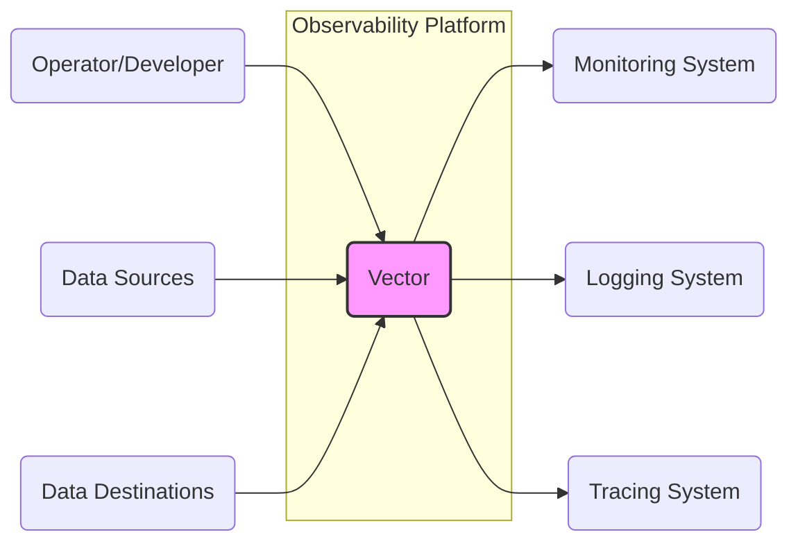
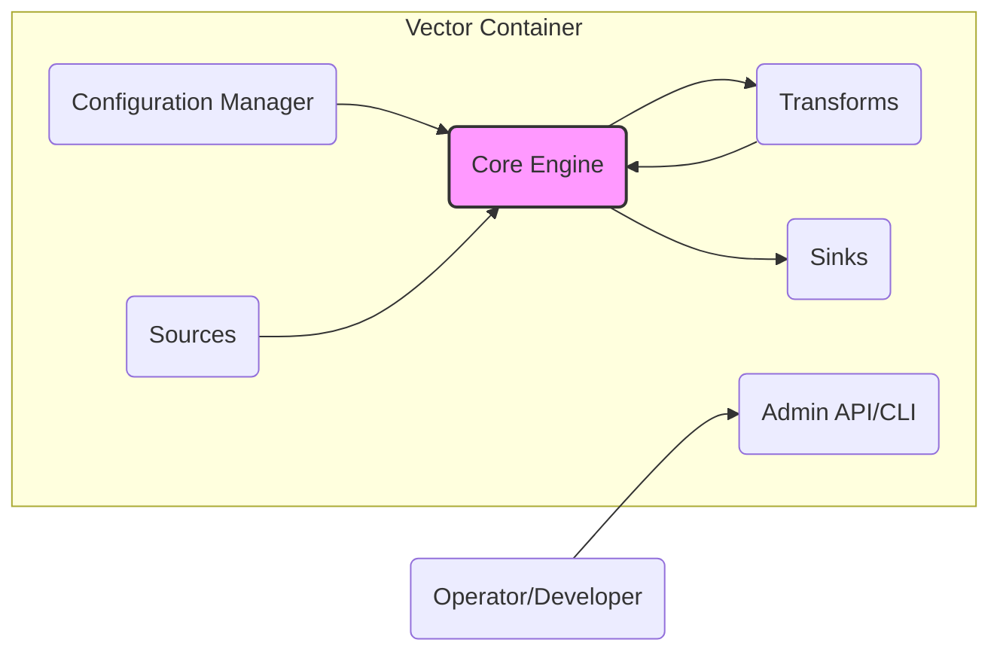
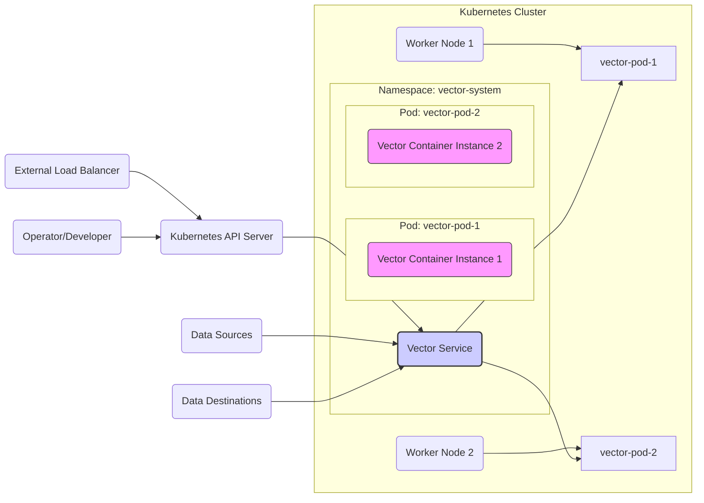
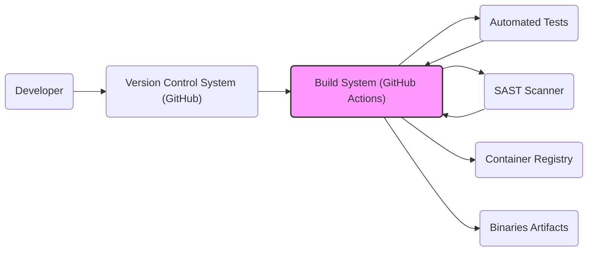

# BUSINESS POSTURE

This project, represented by the GitHub repository `timberio/vector`, aims to provide a high-performance, open-source observability data pipeline. It is designed to collect, transform, and route logs, metrics, and traces.

Business Priorities and Goals:

- Provide a reliable and scalable observability data pipeline solution.
- Offer a flexible and configurable platform to handle diverse observability data formats and sources.
- Ensure high performance and low resource consumption for efficient data processing.
- Support a wide range of data sources and destinations to integrate with existing observability infrastructure.
- Foster an open-source community and ecosystem around the project.

Business Risks:

- Data loss or corruption during processing or routing, leading to incomplete or inaccurate observability data.
- Performance bottlenecks or scalability limitations that hinder the ability to handle increasing data volumes.
- Security vulnerabilities that could expose sensitive observability data or compromise the system.
- Lack of adoption or community support, leading to project stagnation or failure to meet user needs.
- Incompatibility with evolving observability standards or technologies, requiring significant rework.

# SECURITY POSTURE

Existing Security Controls:

- security control: Code is hosted on GitHub, leveraging GitHub's infrastructure security. (Implemented: GitHub platform)
- security control: Project is open-source, allowing for community review and vulnerability identification. (Implemented: Open-source nature)
- accepted risk: Reliance on community contributions for security vulnerability identification and patching may introduce delays.
- accepted risk: Open-source nature may expose internal design details to potential attackers.

Recommended Security Controls:

- security control: Implement automated security scanning (SAST/DAST) in the CI/CD pipeline to identify vulnerabilities early in the development process.
- security control: Conduct regular penetration testing and security audits to proactively identify and address security weaknesses.
- security control: Establish a clear vulnerability disclosure and response process to handle security issues effectively.
- security control: Provide secure configuration guidelines and best practices for users to deploy and operate Vector securely.
- security control: Implement input validation and sanitization to prevent injection attacks.
- security control: Implement robust logging and monitoring of security-relevant events for incident detection and response.

Security Requirements:

- Authentication:
  - requirement: Vector itself might not require user authentication for data processing, but integrations with external systems (e.g., control plane, APIs) should use strong authentication mechanisms.
  - requirement: If Vector exposes any management interfaces (API, CLI), these must be protected with authentication.
- Authorization:
  - requirement: Access to configuration and management functions should be restricted to authorized users or roles.
  - requirement: If Vector interacts with external systems requiring authorization, it should support appropriate authorization protocols (e.g., API keys, OAuth).
- Input Validation:
  - requirement: All data inputs from sources and configuration inputs must be thoroughly validated to prevent injection attacks and data corruption.
  - requirement: Configuration parsing should be robust and prevent vulnerabilities arising from malformed configurations.
- Cryptography:
  - requirement: Sensitive data in transit should be encrypted using TLS/HTTPS.
  - requirement: Consider encryption of sensitive data at rest if Vector is designed to store data locally (e.g., buffering, caching).
  - requirement: Securely manage cryptographic keys and secrets used for encryption and authentication.

# DESIGN

## C4 CONTEXT

Context Diagram Elements:

- Element:
  - Name: Operator/Developer
  - Type: Person
  - Description: Users who configure, deploy, and manage Vector. They interact with Vector to set up data pipelines and monitor its operation.
  - Responsibilities: Configuring Vector, deploying Vector, monitoring Vector's health and performance, troubleshooting issues.
  - Security controls: Role-Based Access Control (RBAC) for management interfaces (if any), secure access to configuration files.

- Element:
  - Name: Data Sources
  - Type: External System
  - Description: Systems that generate observability data (logs, metrics, traces) that Vector collects. Examples include applications, servers, network devices, and cloud services.
  - Responsibilities: Generating and providing observability data to Vector.
  - Security controls: Authentication and authorization mechanisms to control data access by Vector, secure data transmission protocols (e.g., TLS).

- Element:
  - Name: Data Destinations
  - Type: External System
  - Description: Systems that receive and store observability data processed by Vector. Examples include monitoring systems, logging systems, tracing systems, and data lakes.
  - Responsibilities: Receiving and storing observability data from Vector.
  - Security controls: Authentication and authorization mechanisms to control data access from Vector, secure data transmission protocols (e.g., TLS), data encryption at rest.

- Element:
  - Name: Vector
  - Type: Software System
  - Description: The observability data pipeline system responsible for collecting, transforming, and routing logs, metrics, and traces from various data sources to different data destinations.
  - Responsibilities: Data collection, data transformation, data routing, data buffering, monitoring and logging of its own operations.
  - Security controls: Input validation, secure configuration management, secure data transmission (TLS), authorization for management interfaces, logging and monitoring of security events.

- Element:
  - Name: Monitoring System
  - Type: External System
  - Description: A system that visualizes and analyzes metrics data sent by Vector to monitor Vector's performance and health.
  - Responsibilities: Monitoring Vector's metrics, alerting on anomalies, providing dashboards for operational insights.
  - Security controls: Authentication and authorization to access monitoring data, secure data reception from Vector.

- Element:
  - Name: Logging System
  - Type: External System
  - Description: A system that collects and stores logs generated by Vector for auditing, debugging, and troubleshooting.
  - Responsibilities: Collecting and storing Vector's logs, providing search and analysis capabilities for logs.
  - Security controls: Secure log ingestion from Vector, access control to logs, log data integrity and retention policies.

- Element:
  - Name: Tracing System
  - Type: External System
  - Description: A system that receives and stores tracing data from Vector to provide insights into request flows and performance bottlenecks.
  - Responsibilities: Storing and analyzing tracing data from Vector, providing visualization of request traces.
  - Security controls: Secure trace data ingestion from Vector, access control to trace data.

## C4 CONTAINER

Container Diagram Elements:

- Element:
  - Name: Core Engine
  - Type: Container/Component
  - Description: The central processing unit of Vector. It manages data flow, applies transformations, and routes data to sinks. It orchestrates the data pipeline based on the configuration.
  - Responsibilities: Data ingestion from sources, applying transformations, routing data to sinks, managing data buffering and backpressure, monitoring pipeline health.
  - Security controls: Input validation on data received from sources, secure handling of data in memory, secure communication with other containers, resource management to prevent denial-of-service.

- Element:
  - Name: Configuration Manager
  - Type: Container/Component
  - Description: Responsible for loading, parsing, validating, and managing Vector's configuration. It provides the configuration to the Core Engine and other components.
  - Responsibilities: Loading configuration from files or external sources, validating configuration syntax and semantics, providing configuration data to other components, handling configuration updates.
  - Security controls: Secure loading of configuration files, input validation of configuration data, access control to configuration files, secure storage of sensitive configuration parameters (e.g., credentials).

- Element:
  - Name: Sources
  - Type: Container/Component
  - Description: Input connectors that collect data from various data sources. Each source is responsible for establishing connections, authenticating with data sources, and ingesting data in specific formats.
  - Responsibilities: Connecting to data sources, authenticating with data sources, ingesting data, converting data to Vector's internal format, handling source-specific errors.
  - Security controls: Secure connection establishment (TLS), secure authentication with data sources (credentials management), input validation of data received from sources, rate limiting to prevent abuse.

- Element:
  - Name: Transforms
  - Type: Container/Component
  - Description: Components that apply transformations to the data stream. Transforms can filter, enrich, aggregate, or modify data as it flows through the pipeline.
  - Responsibilities: Data transformation, data filtering, data enrichment, data aggregation, data format conversion.
  - Security controls: Secure implementation of transformation logic to prevent vulnerabilities, input validation of data before transformation, preventing information leakage through transformations.

- Element:
  - Name: Sinks
  - Type: Container/Component
  - Description: Output connectors that send processed data to various data destinations. Each sink is responsible for formatting data according to the destination's requirements, authenticating with destinations, and sending data.
  - Responsibilities: Connecting to data destinations, authenticating with data destinations, formatting data for destinations, sending data to destinations, handling destination-specific errors.
  - Security controls: Secure connection establishment (TLS), secure authentication with data destinations (credentials management), output sanitization to prevent injection attacks in destinations, rate limiting to prevent overwhelming destinations.

- Element:
  - Name: Admin API/CLI
  - Type: Container/Component
  - Description: Provides an interface for operators and developers to manage and monitor Vector. This could include APIs for configuration management, health checks, metrics retrieval, and pipeline control.
  - Responsibilities: Configuration management via API/CLI, health monitoring, metrics exposure, pipeline control (start/stop/reload), user authentication and authorization.
  - Security controls: Authentication and authorization for API/CLI access, secure API design (input validation, output sanitization), rate limiting to prevent abuse, audit logging of API/CLI actions.

## DEPLOYMENT

Deployment Architecture: Containerized Deployment in Kubernetes

Deployment Diagram Elements:

- Element:
  - Name: Kubernetes Cluster
  - Type: Infrastructure
  - Description: A Kubernetes cluster providing container orchestration and management.
  - Responsibilities: Container orchestration, resource management, service discovery, scaling, high availability.
  - Security controls: Kubernetes RBAC, network policies, pod security policies/admission controllers, secrets management, cluster audit logging, infrastructure security of Kubernetes nodes.

- Element:
  - Name: Namespace: vector-system
  - Type: Kubernetes Namespace
  - Description: A dedicated namespace within the Kubernetes cluster to isolate Vector deployments.
  - Responsibilities: Resource isolation, access control within the Vector deployment.
  - Security controls: Kubernetes RBAC for namespace access, network policies to restrict network traffic within the namespace.

- Element:
  - Name: Pod: vector-pod-1, vector-pod-2
  - Type: Kubernetes Pod
  - Description: Kubernetes pods hosting instances of the Vector container. Pods are the smallest deployable units in Kubernetes.
  - Responsibilities: Running Vector container instances, providing network and storage resources to containers.
  - Security controls: Pod security context, resource limits, network policies to restrict pod network access, container image security scanning.

- Element:
  - Name: Vector Container Instance 1, Vector Container Instance 2
  - Type: Container Instance
  - Description: Instances of the Vector container running within Kubernetes pods.
  - Responsibilities: Executing Vector application logic, processing observability data.
  - Security controls: Security controls defined for the Vector Container (see Container Diagram), container image security scanning, least privilege container runtime.

- Element:
  - Name: Vector Service
  - Type: Kubernetes Service
  - Description: A Kubernetes service that exposes Vector pods within the cluster. It provides a stable endpoint for accessing Vector instances.
  - Responsibilities: Load balancing traffic to Vector pods, service discovery within the cluster.
  - Security controls: Network policies to control access to the service, service account for pod-to-service communication.

- Element:
  - Name: Worker Node 1, Worker Node 2
  - Type: Infrastructure
  - Description: Worker nodes in the Kubernetes cluster where pods are scheduled to run.
  - Responsibilities: Providing compute resources for pods, running the container runtime (e.g., Docker, containerd).
  - Security controls: Operating system security hardening, node security monitoring, access control to nodes, secure container runtime configuration.

- Element:
  - Name: Kubernetes API Server
  - Type: Kubernetes Component
  - Description: The central control plane component of Kubernetes that exposes the Kubernetes API.
  - Responsibilities: API access for Kubernetes management, authentication and authorization for API requests.
  - Security controls: Authentication and authorization for API access (RBAC), API audit logging, secure API server configuration, TLS encryption for API communication.

- Element:
  - Name: External Load Balancer
  - Type: Infrastructure
  - Description: An external load balancer that provides external access to the Kubernetes API server.
  - Responsibilities: Exposing Kubernetes API server externally, load balancing API requests.
  - Security controls: Access control to the load balancer, TLS termination for external API access, DDoS protection.

- Element:
  - Name: Data Sources, Data Destinations, Operator/Developer
  - Type: External Systems/Person
  - Description: External entities interacting with the deployed Vector instances.
  - Responsibilities: Interacting with Vector as described in the Context Diagram.
  - Security controls: Security controls as described in the Context Diagram, network security controls (firewalls, network segmentation) to restrict access to the Kubernetes cluster.

## BUILD

Build Process Diagram:

Build Process Description:

1.  Developer writes code and commits changes to the Version Control System (VCS), which is GitHub in this case.
2.  The Build System, likely GitHub Actions, is triggered by code changes in the VCS.
3.  The Build System compiles the code, runs automated tests (unit tests, integration tests), and performs static application security testing (SAST) using a SAST scanner.
4.  If tests and SAST checks pass, the Build System builds container images and binaries artifacts.
5.  Container images are pushed to a Container Registry.
6.  Binaries artifacts are stored for distribution.

Build Process Security Controls:

- security control: Version Control System (GitHub) access control to manage code changes and prevent unauthorized modifications. (Implemented: GitHub access controls)
- security control: Branch protection policies in VCS to enforce code review and prevent direct commits to main branches. (Implemented: GitHub branch protection)
- security control: Automated build system (GitHub Actions) to ensure consistent and repeatable builds. (Implemented: GitHub Actions workflows)
- security control: Automated testing (unit tests, integration tests) to verify code functionality and prevent regressions. (Implemented: Test suites in the repository)
- security control: Static Application Security Testing (SAST) to identify potential security vulnerabilities in the code. (Implemented: SAST scanner integration in build pipeline - to be implemented if not already present)
- security control: Container image scanning for vulnerabilities before pushing to the container registry. (Implemented: Container image scanning in build pipeline - to be implemented if not already present)
- security control: Secure storage and access control for build artifacts (container images, binaries). (Implemented: Container registry access controls, secure artifact storage)
- security control: Code signing of binaries to ensure integrity and authenticity. (Implemented: Code signing process - to be implemented if not already present)
- security control: Dependency scanning to identify vulnerabilities in third-party libraries and dependencies. (Implemented: Dependency scanning in build pipeline - to be implemented if not already present)

# RISK ASSESSMENT

Critical Business Processes:

- Observability Data Pipeline Operation: Ensuring continuous and reliable collection, processing, and routing of observability data is critical for monitoring application and infrastructure health, performance, and security. Disruption or failure of this process can lead to blind spots in observability, hindering incident detection and response.

Data Sensitivity:

- Observability Data (Logs, Metrics, Traces): Sensitivity depends on the data sources being monitored. Logs, metrics, and traces can contain sensitive information such as:
    - Application data: User IDs, request parameters, business transactions, error messages, which might contain personally identifiable information (PII) or confidential business data.
    - Infrastructure data: Server names, IP addresses, network configurations, security events, which can reveal infrastructure details and potential vulnerabilities.
    - Security events: Audit logs, security alerts, intrusion detection logs, which are inherently sensitive and require confidentiality and integrity.

Data Sensitivity Level: Potentially High. Observability data can contain sensitive information depending on the monitored systems and applications. Proper security controls are necessary to protect the confidentiality, integrity, and availability of this data.

# QUESTIONS & ASSUMPTIONS

Questions:

- What is the intended deployment environment for Vector (cloud, on-premise, hybrid)?
- What types of data sources and destinations are primarily targeted for Vector?
- What is the expected data volume and velocity that Vector needs to handle?
- Are there any specific compliance requirements (e.g., GDPR, HIPAA, PCI DSS) that Vector needs to meet?
- Are there existing security policies or standards within the organization that Vector needs to adhere to?
- What are the performance and latency requirements for the observability data pipeline?
- Is there a need for data retention or archival within Vector itself, or is it purely a pipeline?
- What level of operational monitoring and alerting is required for Vector?

Assumptions:

- Assumption: Vector is intended to be deployed in containerized environments, such as Kubernetes, based on common practices for modern infrastructure.
- Assumption: Observability data handled by Vector can contain sensitive information, requiring appropriate security measures.
- Assumption: Performance and reliability are key requirements for Vector, as it is designed to be a high-performance data pipeline.
- Assumption: Users will configure Vector to handle various types of observability data, requiring flexibility and extensibility in data processing and routing.
- Assumption: Security is a significant concern for Vector deployments, necessitating robust security controls throughout the design, development, deployment, and operation phases.