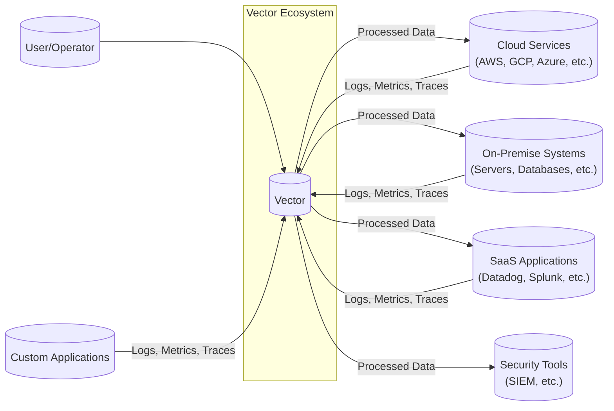

Okay, let's create a design document for the Timberio Vector project, keeping in mind its purpose and potential security considerations.

# BUSINESS POSTURE

Vector, at its core, is a high-performance, open-source observability data pipeline.  It's designed to collect, transform, and route logs, metrics, and traces.  This suggests a business posture focused on:

Priorities and Goals:

*   Reliability:  Vector must operate continuously and reliably, without data loss, as it's a critical component of the observability stack.  Downtime or data loss directly impacts a customer's ability to monitor their systems.
*   Performance:  Vector needs to handle high volumes of data with minimal latency.  Performance bottlenecks can lead to delayed insights and impact the effectiveness of monitoring.
*   Extensibility:  The ability to easily integrate with a wide variety of data sources and destinations is crucial.  This allows Vector to adapt to diverse customer environments and evolving needs.
*   Cost-Effectiveness:  While performance is key, Vector should also be resource-efficient, minimizing the operational costs associated with observability data processing.
*   Open Source Community:  Foster a strong open-source community to drive adoption, contributions, and long-term sustainability.
*   Security: Protect data in transit and at rest.

Most Important Business Risks:

*   Data Loss:  Loss of observability data due to bugs, misconfiguration, or infrastructure failures. This is a top-tier risk.
*   Performance Degradation:  Inability to handle peak loads, leading to backpressure, data loss, or delayed insights.
*   Security Breaches:  Unauthorized access to sensitive data flowing through Vector, or vulnerabilities that allow attackers to compromise the system.
*   Integration Failures:  Inability to properly collect or deliver data to specific sources or destinations, limiting Vector's usefulness.
*   Lack of Adoption:  Failure to gain traction in the open-source community, hindering development and support.
*   Compliance Violations:  Failure to meet relevant compliance requirements (e.g., GDPR, HIPAA) related to data handling and privacy.

# SECURITY POSTURE

Existing Security Controls (based on the GitHub repository and general knowledge of similar projects):

*   security control: Secure Development Practices: The project appears to use Rust, a memory-safe language, which inherently mitigates many common vulnerability classes (e.g., buffer overflows).
    *   Implemented in: Codebase (Rust language choice).
*   security control: Input Validation: Vector likely performs input validation on data received from various sources to prevent injection attacks and ensure data integrity.
    *   Implemented in: Source-specific input handling logic (e.g., parsers for different log formats).
*   security control: Regular Updates and Patching: As an active open-source project, it's reasonable to assume regular updates and patching to address security vulnerabilities.
    *   Implemented in: Project release cycle and community contributions.
*   security control: Authentication and Authorization: For certain sinks (outputs), Vector likely supports authentication mechanisms (e.g., API keys, credentials) to ensure data is sent to authorized destinations.
    *   Implemented in: Sink-specific configuration and credential handling.
*   security control: Encryption in Transit: Vector likely supports encryption in transit (e.g., TLS/SSL) for communication with sources and sinks that require it.
    *   Implemented in: Network communication libraries and configuration options.
*   security control: Access Control: Vector's configuration likely allows for some level of access control, restricting which sources can send data and which sinks can receive it.
    *   Implemented in: Configuration file and potentially through external access control mechanisms (e.g., network policies).
*   security control: Least Privilege: Vector components should run with the least privileges.
    *   Implemented in: Deployment configuration.

Accepted Risks:

*   accepted risk: Complexity of Configuration:  Vector's flexibility and extensive feature set can lead to complex configurations, increasing the risk of misconfiguration and potential security vulnerabilities.
*   accepted risk: Dependency Vulnerabilities:  Like any software project, Vector relies on external dependencies, which may contain vulnerabilities.
*   accepted risk: Zero-Day Exploits:  There's always a risk of zero-day exploits targeting Vector or its dependencies.

Recommended Security Controls (High Priority):

*   security control:  Formal Security Audits: Conduct regular, independent security audits of the codebase and infrastructure.
*   security control:  Vulnerability Scanning: Implement automated vulnerability scanning (SAST, DAST, SCA) as part of the CI/CD pipeline.
*   security control:  Fuzzing: Integrate fuzzing to test input handling and identify potential crashes or vulnerabilities.
*   security control:  Threat Modeling: Perform regular threat modeling exercises to identify and mitigate potential security threats.
*   security control:  Configuration Hardening: Provide clear guidelines and tools for hardening Vector configurations, minimizing the attack surface.
*   security control:  Data Minimization: Encourage users to collect only the necessary observability data, reducing the potential impact of a breach.
*   security control:  Audit Logging: Implement comprehensive audit logging within Vector to track configuration changes, data access, and other security-relevant events.
*   security control:  Secrets Management: Integrate with a secrets management solution (e.g., HashiCorp Vault) to securely store and manage sensitive credentials.

Security Requirements:

*   Authentication:
    *   Vector should support secure authentication mechanisms for accessing its API (if applicable).
    *   Vector should support secure authentication mechanisms for connecting to various sources and sinks.
    *   Authentication credentials should be stored and managed securely.

*   Authorization:
    *   Vector should provide mechanisms for controlling access to its resources and data.
    *   Access control policies should be configurable and granular.
    *   The principle of least privilege should be enforced.

*   Input Validation:
    *   All input from external sources should be strictly validated.
    *   Input validation should be based on a whitelist approach, rejecting any input that doesn't conform to expected patterns.
    *   Input validation should be performed at multiple layers (e.g., at the source, during transformation, and before sending to sinks).

*   Cryptography:
    *   Sensitive data should be encrypted in transit using strong, industry-standard protocols (e.g., TLS 1.3).
    *   Sensitive data at rest (if applicable) should be encrypted using strong encryption algorithms.
    *   Cryptographic keys should be managed securely.

# DESIGN

## C4 CONTEXT



Element Descriptions:

*   Element:
    *   Name: User/Operator
    *   Type: Person
    *   Description:  Individuals responsible for configuring, deploying, and managing Vector.
    *   Responsibilities:  Configuring Vector, monitoring its health, troubleshooting issues, and ensuring its security.
    *   Security controls:  Strong passwords, multi-factor authentication (if accessing a management interface), role-based access control.

*   Element:
    *   Name: Vector
    *   Type: Software System
    *   Description:  The core observability data pipeline, responsible for collecting, transforming, and routing data.
    *   Responsibilities:  Data collection, transformation, routing, buffering, and error handling.
    *   Security controls:  Input validation, encryption in transit, authentication to sources and sinks, secure configuration, regular updates.

*   Element:
    *   Name: Cloud Services (AWS, GCP, Azure, etc.)
    *   Type: External System
    *   Description:  Cloud platforms providing infrastructure and services that generate observability data and can also be destinations for processed data.
    *   Responsibilities:  Providing infrastructure, services, and APIs.
    *   Security controls:  Cloud provider's security controls (e.g., IAM, VPCs, encryption), secure communication with Vector (TLS).

*   Element:
    *   Name: On-Premise Systems (Servers, Databases, etc.)
    *   Type: External System
    *   Description:  Systems running in a customer's own data center that generate observability data.
    *   Responsibilities:  Running applications and services.
    *   Security controls:  On-premise security controls (e.g., firewalls, intrusion detection systems), secure communication with Vector (TLS).

*   Element:
    *   Name: SaaS Applications (Datadog, Splunk, etc.)
    *   Type: External System
    *   Description:  Third-party SaaS applications that can be sources or destinations for observability data.
    *   Responsibilities:  Providing application-specific functionality.
    *   Security controls:  SaaS provider's security controls, secure communication with Vector (TLS, API keys).

*   Element:
    *   Name: Security Tools (SIEM, etc.)
    *   Type: External System
    *   Description: Security tools that can receive security-related logs and events from Vector.
    *   Responsibilities: Security monitoring, analysis, and incident response.
    *   Security controls: Secure communication with Vector (TLS), access controls.

*   Element:
    *   Name: Custom Applications
    *   Type: External System
    *   Description: Applications that generate logs, metrics and traces.
    *   Responsibilities: Application specific logic.
    *   Security controls: Secure communication with Vector (TLS), access controls.

## C4 CONTAINER

```mermaid
graph LR
    subgraph Vector Ecosystem
        subgraph Vector[("Vector")]
            Sources[("Sources")]
            Transforms[("Transforms")]
            Sinks[("Sinks")]
            Buffer[("Buffer")]
        end
        User[("User/Operator")]
        CloudServices[("Cloud Services")]
        OnPremiseSystems[("On-Premise Systems")]
        SaaSApplications[("SaaS Applications")]
        SecurityTools[("Security Tools")]
        CustomApplications[("Custom Applications")]

        User --> Sources
        User --> Transforms
        User --> Sinks
        CloudServices -- Logs, Metrics, Traces --> Sources
        OnPremiseSystems -- Logs, Metrics, Traces --> Sources
        SaaSApplications -- Logs, Metrics, Traces --> Sources
        CustomApplications -- Logs, Metrics, Traces --> Sources
        Sources --> Buffer
        Buffer --> Transforms
        Transforms --> Buffer
        Buffer --> Sinks
        Sinks -- Processed Data --> CloudServices
        Sinks -- Processed Data --> OnPremiseSystems
        Sinks -- Processed Data --> SaaSApplications
        Sinks -- Processed Data --> SecurityTools
    end
```

Element Descriptions:

*   Element:
    *   Name: Sources
    *   Type: Container
    *   Description:  Components responsible for collecting data from various sources (e.g., files, syslog, APIs).
    *   Responsibilities:  Connecting to data sources, reading data, parsing data, and forwarding it to the buffer.
    *   Security controls:  Input validation, authentication to sources, TLS encryption, rate limiting.

*   Element:
    *   Name: Transforms
    *   Type: Container
    *   Description:  Components responsible for transforming data (e.g., filtering, enriching, aggregating).
    *   Responsibilities:  Applying transformations to data based on the configuration.
    *   Security controls:  Input validation, secure configuration, protection against code injection vulnerabilities in transformation logic.

*   Element:
    *   Name: Sinks
    *   Type: Container
    *   Description:  Components responsible for sending data to various destinations (e.g., cloud services, databases, monitoring tools).
    *   Responsibilities:  Connecting to destinations, formatting data, sending data, and handling errors.
    *   Security controls:  Authentication to sinks, TLS encryption, output validation, rate limiting.

*   Element:
    *   Name: Buffer
    *   Type: Container
    *   Description:  A component that provides a buffer between sources, transforms, and sinks, handling backpressure and ensuring data delivery.
    *   Responsibilities:  Storing data temporarily, managing data flow, and handling errors.
    *   Security controls:  Data integrity checks, access controls, potentially encryption at rest (if buffering to disk).

*   External elements are same as in C4 CONTEXT diagram.

## DEPLOYMENT

Possible Deployment Solutions:

1.  Standalone Binary:  Vector can be deployed as a single, self-contained binary on a virtual machine or physical server.
2.  Docker Container:  Vector can be deployed as a Docker container, making it easy to manage and scale.
3.  Kubernetes:  Vector can be deployed to a Kubernetes cluster, leveraging Kubernetes' features for orchestration, scaling, and resilience.
4.  System-Specific Packages: Vector provides pre-built packages for various operating systems (e.g., .deb, .rpm).

Chosen Solution (for detailed description): Kubernetes

```mermaid
graph LR
    subgraph Kubernetes Cluster
        subgraph Namespace[("vector-namespace")]
            VectorPod[("Vector Pod")]
            ConfigMap[("Vector ConfigMap")]
            Secrets[("Vector Secrets")]
            VectorPod -- Reads --> ConfigMap
            VectorPod -- Reads --> Secrets
        end
        Ingress[("Ingress")]
        User[("User/Operator")]
        User --> Ingress
        Ingress --> VectorPod
    end
    CloudServices[("Cloud Services")]
    OnPremiseSystems[("On-Premise Systems")]
    SaaSApplications[("SaaS Applications")]
    SecurityTools[("Security Tools")]
    CustomApplications[("Custom Applications")]

    CloudServices -- Logs, Metrics, Traces --> VectorPod
    OnPremiseSystems -- Logs, Metrics, Traces --> VectorPod
    SaaSApplications -- Logs, Metrics, Traces --> VectorPod
    CustomApplications -- Logs, Metrics, Traces --> VectorPod
    VectorPod -- Processed Data --> CloudServices
    VectorPod -- Processed Data --> OnPremiseSystems
    VectorPod -- Processed Data --> SaaSApplications
    VectorPod -- Processed Data --> SecurityTools
```

Element Descriptions:

*   Element:
    *   Name: Kubernetes Cluster
    *   Type: Infrastructure
    *   Description:  The Kubernetes cluster where Vector is deployed.
    *   Responsibilities:  Orchestrating and managing the Vector deployment.
    *   Security controls:  Kubernetes security best practices (e.g., RBAC, network policies, pod security policies).

*   Element:
    *   Name: Namespace (vector-namespace)
    *   Type: Logical Grouping
    *   Description:  A Kubernetes namespace dedicated to the Vector deployment.
    *   Responsibilities:  Isolating Vector resources from other applications in the cluster.
    *   Security controls:  Network policies to restrict traffic to/from the namespace.

*   Element:
    *   Name: Vector Pod
    *   Type: Container Instance
    *   Description:  A Kubernetes pod running the Vector container.
    *   Responsibilities:  Running the Vector process.
    *   Security controls:  Running as a non-root user, resource limits, security context.

*   Element:
    *   Name: Vector ConfigMap
    *   Type: Configuration Data
    *   Description:  A Kubernetes ConfigMap containing the Vector configuration file.
    *   Responsibilities:  Providing configuration to the Vector pod.
    *   Security controls:  Access controls to the ConfigMap.

*   Element:
    *   Name: Vector Secrets
    *   Type: Sensitive Data
    *   Description:  A Kubernetes Secret containing sensitive credentials (e.g., API keys, passwords).
    *   Responsibilities:  Providing secrets to the Vector pod.
    *   Security controls:  Encryption at rest, access controls to the Secret.

*   Element:
    *   Name: Ingress
    *   Type: API Gateway
    *   Description:  A Kubernetes Ingress controller that exposes Vector's API (if applicable) to external users.
    *   Responsibilities:  Routing external traffic to the Vector pod.
    *   Security controls:  TLS termination, authentication, authorization.

*   External elements are same as in C4 CONTEXT diagram.

## BUILD

```mermaid
graph LR
    Developer[("Developer")]
    GitRepository[("Git Repository\n(GitHub)")]
    CI[("CI/CD Pipeline\n(GitHub Actions)")]
    ArtifactRepository[("Artifact Repository\n(Docker Hub, etc.)")]
    Code[("Code Changes")]
    Build[("Build & Test")]
    Artifact[("Build Artifact\n(Docker Image, Binary)")]

    Developer -- Pushes --> GitRepository
    GitRepository -- Triggers --> CI
    CI -- Runs --> Build
    Build -- Produces --> Artifact
    Artifact -- Stored in --> ArtifactRepository
    subgraph CI[("CI/CD Pipeline")]
    Lint[("Linters")]
    SAST[("SAST")]
    SCA[("SCA")]
    UnitTests[("Unit Tests")]
    IntegrationTests[("Integration Tests")]
    Build --> Lint
    Build --> SAST
    Build --> SCA
    Build --> UnitTests
    Build --> IntegrationTests
    end
```

Build Process Description:

1.  Developer: A developer makes code changes and pushes them to the Git repository (GitHub).
2.  Git Repository: The Git repository hosts the Vector source code and triggers the CI/CD pipeline upon code changes.
3.  CI/CD Pipeline (GitHub Actions):  A CI/CD pipeline (likely using GitHub Actions, given the project's location) is triggered by changes in the repository.
4.  Build & Test: The pipeline performs the following steps:
    *   Linters: Code linters (e.g., clippy for Rust) are run to enforce code style and identify potential issues.
    *   SAST: Static Application Security Testing (SAST) tools are used to scan the codebase for security vulnerabilities.
    *   SCA: Software Composition Analysis (SCA) tools are used to identify vulnerabilities in third-party dependencies.
    *   Unit Tests: Unit tests are executed to verify the correctness of individual components.
    *   Integration Tests: Integration tests are executed to verify the interaction between different components.
5.  Build Artifact: If all tests pass, the pipeline builds the Vector artifact (e.g., a Docker image or a binary).
6.  Artifact Repository: The build artifact is stored in an artifact repository (e.g., Docker Hub, a private container registry, or a package repository).

Security Controls:

*   security control:  Automated Build: The build process is fully automated, ensuring consistency and reducing the risk of manual errors.
*   security control:  Code Review: All code changes should be reviewed by at least one other developer before being merged.
*   security control:  SAST: Static analysis tools are used to identify potential security vulnerabilities in the codebase.
*   security control:  SCA: Software Composition Analysis tools are used to identify vulnerabilities in third-party dependencies.
*   security control:  Dependency Management:  Dependencies are carefully managed and updated regularly to address security vulnerabilities.
*   security control:  Artifact Signing:  Build artifacts (e.g., Docker images) should be digitally signed to ensure their integrity and authenticity.
*   security control:  Least Privilege:  The CI/CD pipeline should run with the least privileges necessary.

# RISK ASSESSMENT

Critical Business Processes:

*   Observability Data Collection:  The continuous and reliable collection of logs, metrics, and traces from various sources.
*   Observability Data Transformation:  The ability to filter, enrich, and aggregate data to meet specific needs.
*   Observability Data Routing:  The reliable delivery of data to the appropriate destinations.
*   System Monitoring:  Monitoring the health and performance of Vector itself.

Data Sensitivity:

*   Logs:  Can contain sensitive information such as user data, credentials, API keys, and internal system details. Sensitivity varies greatly depending on the source and content of the logs. (High to Low)
*   Metrics:  Generally less sensitive than logs, but can still reveal information about system performance and usage patterns. (Medium to Low)
*   Traces:  Can contain detailed information about application behavior, including user interactions and data flows. (Medium to High)
*   Configuration Data: Contains sensitive information about sources, destinations, and transformations, including credentials and API keys. (High)

# QUESTIONS & ASSUMPTIONS

Questions:

*   What specific compliance requirements (e.g., GDPR, HIPAA, PCI DSS) are relevant to users of Vector?
*   What are the expected data volumes and peak loads that Vector needs to handle?
*   What are the specific security requirements of the most common deployment environments (e.g., cloud providers, on-premise)?
*   What level of support is provided for different authentication and authorization mechanisms?
*   Are there any plans to develop a dedicated management interface or API for Vector?
*   What is the process for reporting and handling security vulnerabilities discovered in Vector?
*   What are the specific data retention policies for data buffered or stored by Vector?

Assumptions:

*   BUSINESS POSTURE:  The primary users of Vector are technically proficient and understand the importance of observability data.
*   BUSINESS POSTURE:  Users are responsible for securing their own infrastructure and the data sources and destinations they connect to Vector.
*   SECURITY POSTURE:  The Vector project follows secure development best practices and addresses security vulnerabilities promptly.
*   SECURITY POSTURE:  Users are responsible for configuring Vector securely and following best practices for hardening their deployments.
*   DESIGN:  Vector is designed to be highly configurable and extensible, allowing users to adapt it to their specific needs.
*   DESIGN:  Vector is designed to be resilient and handle failures gracefully, minimizing data loss.
*   DESIGN: The provided deployment example with Kubernetes is just one of many possible deployment options.
*   DESIGN: Build process is automated and uses CI/CD pipeline.