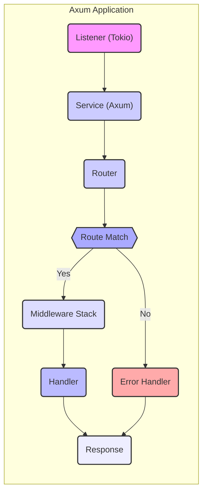
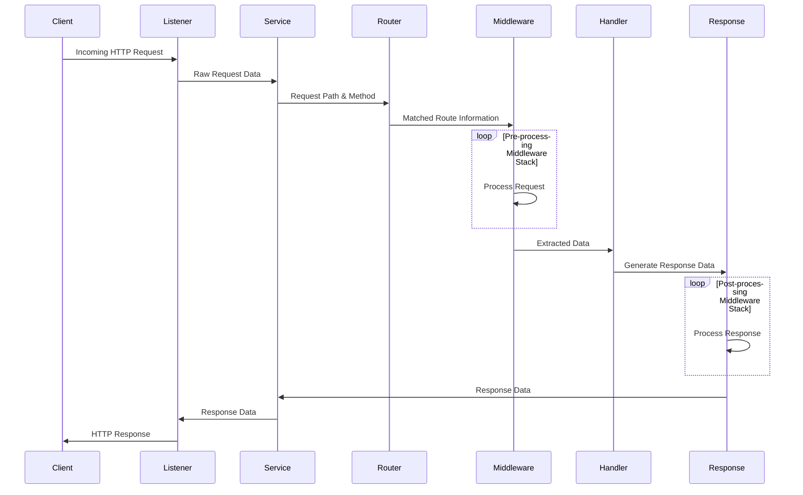

# Project Design Document: Axum Web Framework

**Version:** 1.1
**Date:** October 26, 2023
**Author:** Gemini (AI Language Model)

## 1. Project Overview

Axum is a robust and developer-friendly web framework for Rust, built upon the asynchronous capabilities of the Tokio runtime. It prioritizes performance, flexibility, and seamless integration with the broader Rust ecosystem. Axum enables developers to construct efficient and scalable web applications and APIs with a focus on composability and type safety. This document details the architectural design of Axum, outlining its core components, data flow, and security considerations to facilitate effective threat modeling and development.

## 2. Goals and Objectives

* **Maximize Performance:** Leverage Tokio's asynchronous I/O to handle a high volume of concurrent requests efficiently, minimizing latency and maximizing throughput.
* **Enhance Developer Experience:** Provide an expressive and intuitive API that simplifies the process of defining routes, handling requests, and implementing middleware.
* **Promote Modularity and Composability:** Design the framework with independent, reusable components that can be easily combined and extended to meet diverse application requirements.
* **Enforce Type Safety:** Utilize Rust's strong static typing to catch errors at compile time, reducing runtime issues and improving code reliability.
* **Facilitate Ecosystem Integration:** Ensure smooth interoperability with other Rust libraries and tools, allowing developers to leverage the rich ecosystem for tasks like database interaction, serialization, and logging.

## 3. Target Audience

This document is intended for a diverse audience involved in the development, security, and operation of Axum-based applications:

* **Security Engineers:** To understand the framework's architecture and identify potential security vulnerabilities for threat modeling and security assessments.
* **Software Developers:** To gain a comprehensive understanding of Axum's design principles and components for effective application development and contribution.
* **Operations Teams:** To understand the deployment considerations and dependencies of Axum applications for efficient deployment and management.

## 4. System Architecture

Axum's architecture revolves around a well-defined request lifecycle, where incoming HTTP requests are processed through a series of interconnected components. This modular design promotes flexibility and maintainability.

### 4.1. Core Components

* **Listener (Tokio):**  The entry point for incoming network connections. Typically, this is a `TcpListener` provided by the Tokio library, responsible for accepting new TCP connections.
* **Service (Axum):**  Implements the `tower::Service` trait, defining the core logic for processing incoming requests. The Axum application itself acts as a service.
* **Router:**  The central component responsible for mapping incoming requests to the appropriate handlers based on the HTTP method (GET, POST, etc.) and the request path.
    * Employs an efficient tree-like data structure (often a Trie) for fast route matching.
    * Supports dynamic path segments (parameters) and wildcards for flexible route definitions.
    * Allows grouping of routes under common prefixes.
* **Handlers:**  Asynchronous functions or closures that contain the specific application logic for processing a matched request.
    * Receive extracted data from the request through extractors.
    * Generate the HTTP response to be sent back to the client.
    * Can return various types that implement the `IntoResponse` trait.
* **Extractors:**  Mechanisms for extracting and transforming data from the incoming HTTP request into usable types within the handler.
    * Provide a type-safe and declarative way to access request data such as headers, query parameters, and the request body.
    * Can perform validation and deserialization of request data (e.g., parsing JSON).
    * Examples include `Path`, `Query`, `Body`, `Headers`, and custom extractors.
* **Middleware:**  Functions or types that intercept requests before they reach the handler or responses before they are sent back to the client.
    * Used for implementing cross-cutting concerns such as logging, authentication, authorization, compression, and request tracing.
    * Middleware is executed in a specific order, forming a "stack" or "chain."
    * Can modify the request or response.
* **Response (Axum):** Represents the HTTP response that will be sent back to the client.
    * Consists of a status code (e.g., 200 OK, 404 Not Found), HTTP headers, and an optional body.
    * Can be constructed using various helper functions and types.
* **Error Handling (Axum):**  Mechanisms for gracefully handling errors that occur during request processing.
    * Allows defining custom error handlers for specific error types or globally.
    * Provides ways to convert errors into appropriate HTTP responses.
    * Includes fallback mechanisms for unhandled errors.

### 4.2. Component Diagram

### 4.3. Request Lifecycle (Detailed)

1. **Connection Establishment:** The Tokio `Listener` accepts an incoming TCP connection from a client.
2. **Request Reception:** The Axum `Service` receives the raw HTTP request data (headers and body) from the established connection, typically handled by the `hyper` library.
3. **Route Matching:** The `Router` examines the request method and path and attempts to find a matching route definition.
4. **Middleware Execution (Pre-processing):** If a matching route is found, the associated middleware stack for that route is executed sequentially. Each middleware can:
    * Inspect or modify the incoming request.
    * Perform actions like logging, authentication, or authorization checks.
    * Short-circuit the request processing and return a response directly.
5. **Data Extraction:**  `Extractors` are invoked to extract specific data from the request based on the handler's signature. This might involve:
    * Parsing path parameters from the URL.
    * Deserializing the request body (e.g., JSON, form data).
    * Reading headers.
    * Extracting query parameters.
6. **Handler Invocation:** The matched `Handler` function or closure is called with the extracted data as arguments.
7. **Response Generation:** The `Handler` executes its application logic and generates an HTTP `Response`. This might involve:
    * Accessing databases or external services.
    * Performing calculations or data transformations.
    * Serializing data into a response body (e.g., JSON).
8. **Middleware Execution (Post-processing):** The response is then passed through the middleware stack in reverse order. Middleware can:
    * Inspect or modify the outgoing response (e.g., adding headers, compressing the body).
    * Perform logging or metrics collection based on the response.
9. **Response Transmission:** The final `Response` is sent back to the client over the established TCP connection.
10. **Error Handling:** If an error occurs at any stage of the request lifecycle (e.g., during extraction, in middleware, or within the handler), Axum's error handling mechanisms are invoked. This might involve:
    * Executing custom error handlers.
    * Returning a default error response.
    * Logging the error.

## 5. Data Flow

The primary data flow within an Axum application centers around the processing of HTTP requests and the generation of HTTP responses.

* **Incoming Request Data:**
    * Raw byte stream from the network connection.
    * HTTP headers (e.g., `Content-Type`, `Authorization`).
    * HTTP body (if present), which can be in various formats (e.g., JSON, XML, plain text, form data).
* **Processed Request Data:**
    * Extracted path parameters (e.g., `/users/{id}`).
    * Extracted query parameters (e.g., `/items?page=2`).
    * Deserialized request body into structured data types.
    * Authenticated user information (if authentication middleware is used).
    * Request-specific state managed by middleware.
* **Outgoing Response Data:**
    * HTTP status code indicating the outcome of the request.
    * HTTP headers providing metadata about the response (e.g., `Content-Type`, `Cache-Control`).
    * Response body containing the data to be sent back to the client, often in formats like JSON, HTML, or plain text.

## 6. Security Considerations

Security is a paramount concern when building web applications. Axum provides a foundation for building secure applications, but developers must be mindful of potential vulnerabilities.

* **Input Validation:**
    * **Threat:** Injection attacks (e.g., SQL injection, command injection, XSS) due to unsanitized user input.
    * **Mitigation:**  Thoroughly validate all data extracted from the request using extractors and custom validation logic. Employ type-safe deserialization and consider using libraries for input sanitization.
* **Authentication and Authorization:**
    * **Threat:** Unauthorized access to resources or functionality.
    * **Mitigation:** Implement robust authentication mechanisms (e.g., JWT, OAuth 2.0) and authorization policies using middleware. Securely store and handle credentials.
* **Cross-Site Scripting (XSS):**
    * **Threat:** Injection of malicious scripts into web pages viewed by other users.
    * **Mitigation:**  Properly escape or sanitize user-generated content before rendering it in HTML responses. Utilize Content Security Policy (CSP) headers.
* **Cross-Site Request Forgery (CSRF):**
    * **Threat:** Unauthorized actions performed on behalf of an authenticated user without their knowledge.
    * **Mitigation:** Implement CSRF protection mechanisms, such as synchronizer tokens, and ensure proper header checks (e.g., `Origin`, `Referer`).
* **Security Headers:**
    * **Threat:** Various attacks exploiting missing or misconfigured security headers.
    * **Mitigation:**  Utilize middleware to set appropriate HTTP security headers like `Content-Security-Policy`, `Strict-Transport-Security`, `X-Frame-Options`, and `X-Content-Type-Options`.
* **Rate Limiting and Denial of Service (DoS) Prevention:**
    * **Threat:**  Resource exhaustion and service unavailability due to excessive requests.
    * **Mitigation:** Implement rate limiting middleware to restrict the number of requests from a single client or IP address within a given timeframe. Consider other DoS mitigation strategies at the infrastructure level.
* **TLS/SSL Encryption:**
    * **Threat:**  Eavesdropping and data interception during transmission.
    * **Mitigation:**  Enforce HTTPS by configuring TLS/SSL certificates correctly. Redirect HTTP traffic to HTTPS. Use `Strict-Transport-Security` headers.
* **Dependency Management:**
    * **Threat:**  Vulnerabilities in third-party dependencies.
    * **Mitigation:** Regularly audit and update dependencies to patch known security vulnerabilities. Use tools for dependency scanning.
* **Error Handling and Information Disclosure:**
    * **Threat:**  Exposure of sensitive information in error messages or stack traces.
    * **Mitigation:**  Avoid displaying detailed error information to end-users in production environments. Implement proper logging for debugging purposes.
* **Middleware Security:**
    * **Threat:**  Vulnerabilities introduced by custom or poorly written middleware.
    * **Mitigation:**  Thoroughly review and test custom middleware for security flaws. Follow secure coding practices.
* **Resource Exhaustion:**
    * **Threat:** Attacks that attempt to consume excessive server resources (e.g., memory, CPU, file handles).
    * **Mitigation:** Implement timeouts, resource limits, and proper handling of large requests or uploads.
* **Data Serialization/Deserialization:**
    * **Threat:**  Vulnerabilities arising from insecure deserialization of data (e.g., remote code execution).
    * **Mitigation:** Use secure serialization libraries and avoid deserializing untrusted data without proper validation.

## 7. Dependencies

Axum relies on a set of powerful and well-maintained Rust crates:

* **Tokio:** The foundational asynchronous runtime for Rust, providing the core building blocks for concurrent and non-blocking I/O operations.
* **Hyper:** A low-level, HTTP-aware library that provides the underlying implementation for handling HTTP connections, parsing requests and responses.
* **Tower:** A library for building robust network services, offering abstractions like the `Service` and `Layer` traits, which Axum leverages for its middleware system.
* **Futures:** Provides abstractions for asynchronous computations, enabling the composition and management of asynchronous operations.
* **Serde:** A widely used serialization and deserialization framework for Rust, often used with Axum for handling JSON and other data formats.
* **Other Crates:** Depending on the application's specific requirements, other crates may be used for tasks such as database interaction (e.g., `sqlx`, `diesel`), logging (e.g., `tracing`, `log`), and more.

## 8. Deployment Considerations

Axum applications are typically compiled into standalone, statically linked executables, making them relatively easy to deploy. Common deployment strategies include:

* **Direct Server Deployment:** Running the compiled executable directly on a virtual machine or bare-metal server. This often involves using a process manager like `systemd` to ensure the application runs reliably.
* **Containerization (Docker, Kubernetes):** Packaging the Axum application into a Docker container image for consistent and reproducible deployments. Kubernetes can be used to orchestrate and scale containerized Axum applications.
* **Reverse Proxy Integration (Nginx, Apache, Caddy):** Deploying the Axum application behind a reverse proxy server. The reverse proxy can handle tasks such as:
    * TLS termination (handling HTTPS certificates).
    * Load balancing across multiple instances of the application.
    * Static file serving.
    * Request routing and filtering.
* **Serverless Environments (e.g., AWS Lambda, Google Cloud Functions):** While less common due to the nature of serverless functions, it's possible to deploy Axum applications in serverless environments using custom runtimes or container image support.

## 9. Future Considerations

The Axum project is actively developed, and potential future enhancements include:

* **Enhanced WebSocket Support:** Further improving the framework's capabilities for handling real-time bidirectional communication using WebSockets.
* **Built-in GraphQL Integration:** Providing more direct support for building GraphQL APIs, potentially through integration with GraphQL libraries.
* **More Advanced Routing Features:** Exploring more sophisticated routing patterns, such as regular expression-based routing or typed route parameters.
* **Improved Testing Utilities:** Developing more comprehensive and user-friendly tools and macros for testing Axum applications, including integration tests and request mocking.
* **Standardized Metrics and Tracing:**  Providing built-in support or recommendations for integrating with metrics and tracing systems for better observability.
* **Simplified State Management:** Exploring patterns or utilities for managing application state within Axum applications.

This document provides a comprehensive overview of the Axum web framework's architecture, design principles, and security considerations. It serves as a valuable resource for developers, security engineers, and operations teams working with Axum.