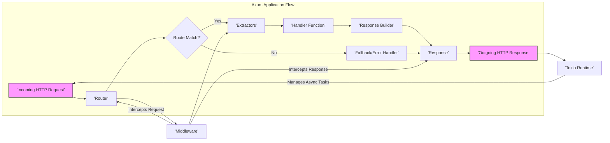

## Project Design Document: Axum Web Framework (Improved)

**1. Introduction**

This document provides a detailed design overview of the Axum web framework, a Rust-based framework for building web applications and APIs. It emphasizes clarity in architecture, component functionality, and data flow to facilitate effective threat modeling.

**2. Project Overview**

Axum is a performant and ergonomic web framework built in Rust, leveraging the asynchronous capabilities of the Tokio runtime. It prioritizes developer experience and a modular design, enabling the creation of robust and scalable web services.

**3. Goals and Objectives**

*   To offer a developer-friendly and efficient API for constructing web applications in Rust.
*   To harness the performance advantages of the Tokio asynchronous runtime for high concurrency.
*   To provide a modular and composable architecture promoting code reusability and maintainability.
*   To serve as a secure foundation for building reliable web services, with considerations for common web vulnerabilities.
*   To facilitate seamless integration with the broader Rust ecosystem and its libraries.

**4. Target Audience**

*   Rust developers building backend web applications and RESTful APIs.
*   Engineers responsible for the security assessment and threat modeling of Axum-based applications.
*   System architects designing and deploying web services using Rust.

**5. High-Level Architecture**

**6. Detailed Component Description**

*   **Tokio Runtime:**
    *   The foundational asynchronous runtime environment powering Axum.
    *   Responsible for managing asynchronous tasks, including I/O operations.
    *   Enables non-blocking behavior for high concurrency and efficiency.

*   **Incoming HTTP Request:**
    *   Represents an HTTP request received by the Axum server.
    *   Encapsulates details like headers, body, HTTP method (GET, POST, etc.), and URI.

*   **Router:**
    *   The central component responsible for directing incoming requests to the appropriate handler.
    *   Matches requests based on defined routes, which specify patterns for HTTP methods and URL paths.
    *   Supports path parameters and wildcard matching for flexible route definitions.

*   **Route Match?:**
    *   The decision point within the Router where an incoming request is evaluated against the defined routes.
    *   Determines if a matching route exists to handle the request.

*   **Extractors:**
    *   Functions that facilitate extracting data from the incoming request in a type-safe manner.
    *   Examples include:
        *   `Path`: Extracts path parameters from the URL.
        *   `Query`: Extracts query parameters from the URL.
        *   `Headers`: Accesses HTTP headers.
        *   `Json`: Deserializes the request body as JSON.
        *   `State`: Accesses shared application state.
    *   Simplify accessing request data and reduce boilerplate code.

*   **Handler Function:**
    *   The application-specific logic that processes the incoming request.
    *   Receives extracted data as arguments.
    *   Performs the core operations required to fulfill the request.
    *   Returns a type that can be converted into an HTTP `Response`.

*   **Response Builder:**
    *   Provides a fluent interface for constructing HTTP responses.
    *   Allows setting the status code, headers, and body of the response.
    *   Facilitates creating various response types, such as JSON, plain text, or redirects.

*   **Response:**
    *   Represents the HTTP response to be sent back to the client.
    *   Contains the status code, headers, and the response body.

*   **Fallback/Error Handler:**
    *   Invoked when the Router fails to find a matching route for the incoming request.
    *   Used to handle "Not Found" scenarios or other application-level errors.
    *   Provides a mechanism for customizing error responses.

*   **Outgoing HTTP Response:**
    *   The final HTTP response sent back to the client after processing by the handler and middleware.

*   **Middleware:**
    *   Functions that intercept requests before they reach the handler and responses before they are sent.
    *   Form a pipeline for request and response processing.
    *   Common uses include:
        *   Logging: Recording request details.
        *   Authentication: Verifying user identity.
        *   Authorization: Controlling access to resources.
        *   Compression: Reducing the size of responses.
        *   Setting security headers (e.g., Content-Security-Policy).

**7. Data Flow**

The processing of an incoming HTTP request in Axum follows these steps:

*   A client sends an HTTP request to the server.
*   The Tokio Runtime receives the incoming request.
*   The request is passed to the Axum `Router`.
*   The `Router` attempts to match the request's method and path against defined routes.
*   If a matching route is found:
    *   Any associated `Middleware` for that route is executed in order.
    *   `Extractors` are invoked to extract data from the request.
    *   The extracted data is passed to the corresponding `Handler Function`.
    *   The `Handler Function` processes the request and returns a value that can be converted into a `Response`.
    *   The `Response Builder` is used to construct the final `Response`.
    *   `Middleware` is executed on the outgoing `Response` in reverse order of request processing.
    *   The `Outgoing HTTP Response` is sent back to the client via the Tokio Runtime.
*   If no matching route is found:
    *   The designated `Fallback/Error Handler` is invoked to generate a `Response`.
    *   `Middleware` may still process the error response.
    *   The `Outgoing HTTP Response` (typically a 404 or other error code) is sent to the client.

**8. Security Considerations (For Threat Modeling)**

This section outlines initial security considerations relevant for threat modeling Axum applications:

*   **Input Validation & Sanitization:**
    *   Crucial to prevent injection attacks (e.g., SQL Injection, Command Injection, Cross-Site Scripting).
    *   Validate data extracted using `Extractors` to ensure it conforms to expected formats and constraints.
    *   Sanitize user-provided input before using it in potentially dangerous operations.

*   **Authentication & Authorization:**
    *   Implement robust mechanisms to verify user identity (authentication) and control access to resources (authorization).
    *   Utilize `Middleware` to enforce authentication and authorization policies.
    *   Consider using established authentication protocols (e.g., OAuth 2.0, OpenID Connect).

*   **Cross-Site Scripting (XSS):**
    *   Prevent the injection of malicious scripts into web pages served by the application.
    *   Employ proper output encoding techniques when rendering dynamic content.
    *   Set appropriate Content Security Policy (CSP) headers using `Middleware`.

*   **Cross-Site Request Forgery (CSRF):**
    *   Protect against unauthorized actions performed on behalf of authenticated users.
    *   Implement CSRF protection mechanisms, such as synchronizer tokens or the SameSite cookie attribute.

*   **Denial of Service (DoS) & Rate Limiting:**
    *   Mitigate potential attacks that aim to overwhelm the server with requests.
    *   Implement rate limiting using `Middleware` to restrict the number of requests from a single source.
    *   Consider request size limits to prevent resource exhaustion.

*   **Dependency Vulnerabilities:**
    *   Regularly audit and update dependencies to address known security vulnerabilities.
    *   Utilize tools like `cargo audit` to identify potential issues.

*   **Secrets Management:**
    *   Avoid hardcoding sensitive information (API keys, database credentials) in the application code.
    *   Utilize environment variables or dedicated secrets management solutions.

*   **Logging & Monitoring:**
    *   Implement comprehensive logging to track application behavior and detect potential security incidents.
    *   Monitor application performance and security metrics.

*   **Error Handling & Information Disclosure:**
    *   Avoid exposing sensitive information in error messages.
    *   Provide generic error responses to clients while logging detailed error information internally.

*   **TLS/SSL Configuration:**
    *   Ensure secure communication over HTTPS by properly configuring TLS/SSL certificates.
    *   Enforce HTTPS using `Middleware` to redirect HTTP traffic.

**9. Assumptions and Constraints**

*   The project utilizes the Rust programming language and the Axum web framework.
*   Asynchronous operations are managed by the Tokio runtime.
*   Communication with clients primarily occurs over the HTTP(S) protocol.
*   Threat modeling efforts will focus on vulnerabilities within the application layer and its immediate dependencies.

**10. Future Considerations**

*   Detailed design specifications for specific application features built using Axum.
*   Deployment architecture and infrastructure security considerations.
*   Implementation details of specific security controls and mitigation strategies.
*   Integration with other services and external APIs.
*   Performance testing and optimization strategies.
