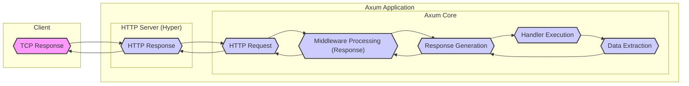

# Project Design Document: Axum Web Framework

**Project Name:** Axum Web Application Framework

**Project Repository:** [https://github.com/tokio-rs/axum](https://github.com/tokio-rs/axum)

**Document Version:** 1.1
**Date:** 2023-10-27
**Author:** AI Expert

## 1. Introduction

This document provides a detailed design overview of the Axum web framework. Axum is a modern, modular, and ergonomic web framework for Rust, built upon the robust foundation of Tokio and Hyper. It is specifically designed for building high-performance, scalable, and reliable web applications and RESTful APIs. This document serves as a comprehensive guide to Axum's architecture, components, and security considerations, making it suitable for threat modeling and security analysis.

## 2. Project Overview

Axum is engineered to empower developers to build web services in Rust with a focus on developer experience and performance. It leverages Rust's strengths in safety and concurrency, combined with the asynchronous capabilities of Tokio, to create efficient and maintainable web applications.

Key design principles of Axum include:

- **Developer Ergonomics:**  Provides a clean, intuitive, and Rust-idiomatic API, reducing boilerplate and improving developer productivity.
- **Performance and Efficiency:** Built on top of Hyper and Tokio, ensuring exceptional performance, low latency, and efficient resource utilization.
- **Modularity and Composability:** Components are designed to be independent and composable, allowing developers to select and integrate only the necessary features.
- **Type Safety and Reliability:** Rust's strong type system is leveraged throughout the framework to enhance safety, prevent common errors, and improve code reliability.
- **Extensibility:** Designed to be extensible, allowing developers to integrate custom middleware, extractors, and handlers to meet specific application requirements.

Axum offers a rich set of features for web application development:

- **Declarative Routing:**  Define routes using a clear and concise API based on HTTP methods and path patterns, including support for path parameters and wildcards.
- **Asynchronous Handlers:**  Utilize asynchronous functions as request handlers, enabling non-blocking I/O and efficient concurrency.
- **Middleware System:**  Implement cross-cutting concerns through a flexible middleware system, allowing for request and response interception and modification.
- **Powerful Extractors:**  Extract data from various parts of incoming requests (headers, path, query parameters, request body, state, etc.) with type safety and ease.
- **Flexible Responses:**  Construct HTTP responses with fine-grained control over status codes, headers, and body content, supporting various content types.
- **Application State Management:**  Share application state across handlers and middleware in a type-safe and concurrent-safe manner.
- **Testing Utilities:** Provides utilities for testing Axum applications, ensuring code quality and reliability.

## 3. System Architecture

The following diagram illustrates the high-level architecture of an Axum application, emphasizing the key components and their interactions during request processing.

### 3.1. Component Breakdown

This section provides a detailed breakdown of each component within the Axum architecture, outlining their functionality, underlying technologies, data flow, security considerations, and potential threats.

#### 3.1.1. HTTP Server (Hyper)

- **Description:**
    - The network communication layer of Axum, powered by the Hyper library.
    - Manages all low-level HTTP protocol operations, including connection handling, request parsing, and response serialization.
- **Functionality:**
    - Accepts and manages incoming TCP connections.
    - Parses HTTP requests according to HTTP/1.1 and HTTP/2 specifications.
    - Serializes HTTP responses for transmission over the network.
    - Handles connection lifecycle management (keep-alive, timeouts, connection upgrades).
    - Supports TLS/SSL termination for secure communication (when configured).
- **Key Technologies/Dependencies:**
    - [Hyper](https://github.com/hyperium/hyper):  A high-performance, correct, and extensible HTTP implementation in Rust.
    - [Tokio](https://github.com/tokio-rs/tokio):  The asynchronous runtime that provides the foundation for Hyper's non-blocking I/O operations.
- **Data Flow (Input/Output):**
    - **Input:** Raw TCP streams from client connections.
    - **Output:** Parsed HTTP Request objects to the Router, serialized HTTP Response objects back to clients.
- **Security Considerations:**
    - **DDoS Attacks:** Hyper's performance helps mitigate some DDoS attacks, but application-level rate limiting and protection are often necessary.
    - **HTTP Protocol Vulnerabilities:**  Hyper is actively maintained and generally resilient to known HTTP vulnerabilities. Regular updates are crucial.
    - **TLS/SSL Configuration:** Secure TLS configuration is paramount for confidentiality and integrity. Weak ciphers or outdated TLS versions can introduce vulnerabilities. Proper certificate management is also essential.
    - **Connection Limits and Timeouts:**  Incorrectly configured connection limits and timeouts can lead to resource exhaustion or denial of service.
- **Potential Threats:**
    - **Denial of Service (DoS):**  Exploiting resource exhaustion through connection flooding or slowloris attacks.
    - **Man-in-the-Middle (MitM):**  If TLS is not properly configured or used, communication can be intercepted and eavesdropped upon.
    - **HTTP Desync Attacks:** Exploiting inconsistencies in HTTP parsing between Hyper and other HTTP implementations.

#### 3.1.2. Router

- **Description:**
    - The request dispatcher within Axum, responsible for mapping incoming HTTP requests to the appropriate handler function.
    - Uses a routing table to match requests based on HTTP method and URL path.
- **Functionality:**
    - Defines routes using a declarative API (e.g., `axum::routing::get`, `axum::routing::post`).
    - Supports pattern matching for URL paths, including path parameters, wildcards, and regular expressions.
    - Efficiently matches incoming requests against defined routes.
    - Extracts path parameters and makes them available to handlers.
- **Key Technologies/Dependencies:**
    - Axum's internal routing logic, likely employing optimized data structures for route matching (e.g., prefix trees, hash maps).
- **Data Flow (Input/Output):**
    - **Input:** HTTP Request object from Hyper Server.
    - **Output:**  Selected Handler function (and extracted path parameters) to the Middleware Stack.
- **Security Considerations:**
    - **Route Hijacking/Confusion:**  Overlapping or poorly defined routes can lead to requests being routed to unintended handlers, potentially exposing sensitive functionality.
    - **Path Traversal (Indirect):** While the router itself doesn't directly handle file paths, misconfigured routes combined with handler logic could indirectly lead to path traversal vulnerabilities.
    - **Denial of Service (Route Complexity):**  Excessively complex routing configurations, especially with many regular expressions, can impact routing performance and become a DoS vector.
- **Potential Threats:**
    - **Unauthorized Access:**  Incorrect route definitions leading to access to protected resources without proper authorization.
    - **Information Disclosure:**  Routing errors exposing debug routes or internal application endpoints.
    - **Performance Degradation:**  Complex routing logic causing performance bottlenecks under high load.

#### 3.1.3. Middleware Stack

- **Description:**
    - A chain of interceptors that process HTTP requests and responses, enabling cross-cutting concerns to be applied to request handling.
    - Middleware functions are executed in a defined order, forming a stack.
- **Functionality:**
    - Intercepts incoming requests before they reach handlers.
    - Can modify requests, add headers, perform authentication/authorization checks, logging, etc.
    - Intercepts responses after handlers have executed.
    - Can modify responses, add security headers, compress content, log responses, etc.
    - Can short-circuit the request processing pipeline and return a response directly, preventing handler execution.
- **Key Technologies/Dependencies:**
    - Axum's middleware system, built using asynchronous functions and the `tower::Service` trait from the Tower ecosystem.
- **Data Flow (Input/Output):**
    - **Input:** HTTP Request from Router (or previous middleware in the stack).
    - **Output:** Modified HTTP Request to the next middleware or Handler, HTTP Response from Handler (or next middleware in reverse stack).
- **Security Considerations:**
    - **Vulnerable Middleware:**  A poorly implemented or vulnerable middleware can compromise the entire application's security. Middleware has broad access to requests and responses.
    - **Authentication/Authorization Bypass:**  Flaws in authentication/authorization middleware can lead to complete security bypasses.
    - **Information Leakage (Logging):**  Middleware logging sensitive information (e.g., passwords, API keys) can create security vulnerabilities. Secure logging practices are essential.
    - **Performance Impact:**  Inefficient middleware can introduce performance overhead and latency.
    - **Order of Execution:**  The order of middleware in the stack is critical. Incorrect ordering can lead to unexpected behavior or security vulnerabilities (e.g., authorization before authentication).
- **Potential Threats:**
    - **Authentication Bypass:**  Middleware failing to properly authenticate requests.
    - **Authorization Bypass:** Middleware failing to properly authorize access to resources.
    - **Information Disclosure:**  Middleware logging sensitive data or exposing internal details in error responses.
    - **Cross-Site Scripting (XSS) via Headers:** Middleware incorrectly setting or modifying response headers, potentially introducing XSS vulnerabilities.

#### 3.1.4. Handler

- **Description:**
    - The core application logic that processes requests and generates responses.
    - Typically asynchronous functions that receive extracted data and return a response.
    - Implements the specific business logic for each route and endpoint.
- **Functionality:**
    - Receives extracted data from the request via Extractors.
    - Executes application-specific logic (e.g., database queries, business rule processing, external API calls).
    - Constructs and returns an HTTP Response using Response Builders.
- **Key Technologies/Dependencies:**
    - Application-specific Rust code and external dependencies (databases, libraries, APIs).
- **Data Flow (Input/Output):**
    - **Input:** Extracted data from Extractors.
    - **Output:** HTTP Response (using Response Builders).
- **Security Considerations:**
    - **Application Logic Vulnerabilities:** Handlers are the primary location for application-specific vulnerabilities:
        - **Injection Attacks (SQL, Command Injection):**  If handlers interact with external systems and construct queries or commands based on unsanitized user input.
        - **Cross-Site Scripting (XSS):**  If handlers generate HTML responses that include unsanitized user input, leading to reflected or stored XSS.
        - **Business Logic Flaws:**  Errors in application logic can lead to unauthorized access, data manipulation, or other security issues.
        - **Insecure Dependencies:**  Vulnerabilities in external libraries used by handlers can be exploited.
        - **Input Validation Failures:**  Insufficient input validation in handlers can lead to unexpected behavior and vulnerabilities.
        - **Error Handling Weaknesses:**  Poor error handling can leak sensitive information or create denial of service opportunities.
- **Potential Threats:**
    - **SQL Injection:**  Malicious SQL queries executed against the database.
    - **Cross-Site Scripting (XSS):**  Execution of malicious scripts in the client's browser.
    - **Command Injection:**  Execution of arbitrary commands on the server.
    - **Business Logic Bypass:**  Exploiting flaws in the application's logic to gain unauthorized access or manipulate data.
    - **Remote Code Execution (RCE) via Dependencies:** Exploiting vulnerabilities in third-party libraries used by handlers.

#### 3.1.5. Extractor

- **Description:**
    - Components responsible for extracting data from incoming HTTP requests and converting it into usable Rust types for handlers.
    - Axum provides built-in extractors for common data sources (headers, path parameters, body, etc.) and allows for custom extractors.
- **Functionality:**
    - Inspects the HTTP Request object.
    - Extracts data from specific parts of the request (headers, body, path, query).
    - Deserializes or converts extracted data into Rust types (e.g., JSON to structs, strings from headers).
    - Handles potential errors during extraction (e.g., invalid JSON, missing headers, type conversion failures).
- **Key Technologies/Dependencies:**
    - Axum's extractor system, leveraging Rust's type system and traits.
    - Libraries for deserialization (e.g., `serde` for JSON, `form_urlencoded` for forms).
- **Data Flow (Input/Output):**
    - **Input:** HTTP Request object.
    - **Output:** Extracted data as Rust types (passed to Handlers).
- **Security Considerations:**
    - **Input Validation (Extractor Level):** Extractors can perform initial input validation and sanitization to prevent malformed data from reaching handlers.
    - **Deserialization Vulnerabilities:**  Extractors that deserialize data (JSON, forms) can be vulnerable to deserialization attacks if not configured securely. Using safe deserialization practices and libraries is crucial.
    - **Information Leakage (Error Messages):** Extractor error messages should not reveal sensitive information about the application's internal workings.
    - **Denial of Service (Body Size Limits):** Extractors reading request bodies should enforce limits on body size to prevent DoS attacks by sending excessively large requests.
- **Potential Threats:**
    - **Deserialization of Untrusted Data:**  Exploiting vulnerabilities in deserialization libraries to achieve remote code execution or denial of service.
    - **Denial of Service (DoS) via Large Payloads:**  Sending excessively large request bodies to exhaust server resources.
    - **Information Disclosure via Error Messages:**  Extractors revealing sensitive information in error messages (e.g., internal file paths, database schema).

#### 3.1.6. Response Builder

- **Description:**
    - Utilities for constructing HTTP responses to be sent back to clients.
    - Provides a fluent API for setting status codes, headers, and response bodies.
- **Functionality:**
    - Simplifies the creation of well-formed HTTP responses.
    - Allows setting HTTP status codes (e.g., 200 OK, 404 Not Found, 500 Internal Server Error).
    - Enables setting response headers (e.g., `Content-Type`, `Cache-Control`, security headers).
    - Handles serialization of response bodies (e.g., JSON serialization, streaming data).
- **Key Technologies/Dependencies:**
    - Axum's response building API.
    - Libraries for serialization (e.g., `serde` for JSON).
- **Data Flow (Input/Output):**
    - **Input:** Data from Handlers to be included in the response body, status code, headers.
    - **Output:** HTTP Response object (passed to Middleware Stack and then Hyper Server).
- **Security Considerations:**
    - **Information Leakage (Error Responses):**  Error responses should be carefully crafted to avoid leaking sensitive information about the application's internal state or configuration. Generic error messages are generally recommended for production.
    - **Insecure Headers:**  Failure to set appropriate security headers (e.g., `Content-Security-Policy`, `X-Frame-Options`, `Strict-Transport-Security`) can leave clients vulnerable to attacks.
    - **Content Type Mismatch:**  Incorrectly setting the `Content-Type` header can lead to security issues or unexpected client behavior.
    - **Cross-Origin Resource Sharing (CORS) Misconfiguration:**  Incorrect CORS header configuration can lead to unauthorized cross-origin access or prevent legitimate cross-origin requests.
- **Potential Threats:**
    - **Information Disclosure via Error Responses:**  Revealing sensitive details in error messages (e.g., stack traces, internal paths).
    - **Client-Side Vulnerabilities due to Missing Security Headers:**  Leaving clients vulnerable to XSS, clickjacking, and other attacks due to missing or misconfigured security headers.
    - **CORS Bypass:**  Misconfigured CORS policies allowing unauthorized cross-origin requests.

## 4. Data Flow Diagram (Detailed Request Processing)

This diagram provides a more granular view of the data flow during HTTP request processing within an Axum application, illustrating the sequence of component interactions.

```mermaid
graph LR
    subgraph "Client"
        A["Client Application"]
    end
    subgraph "Axum Application"
        subgraph "HTTP Server (Hyper)"
            B["Hyper Server\n(TCP/TLS Handling,\nHTTP Parsing)"]
        end
        subgraph "Axum Core"
            C["Router\n(Route Matching)"]
            D["Middleware 1\n(e.g., Logging)"]
            E["Middleware 2\n(e.g., AuthN)"]
            F["Extractor 1\n(e.g., Headers)"]
            G["Extractor 2\n(e.g., JSON Body)"]
            H["Handler\n(Application Logic)"]
            I["Response Builder\n(Status, Headers, Body)"]
            J["Middleware 2 (Response)\n(e.g., AuthZ)"]
            K["Middleware 1 (Response)\n(e.g., Logging)"]
        end
    end

    A --> B{{"HTTP Request\n(TCP Stream)"}};
    B --> C{{"Parsed HTTP Request"}};
    C --> D{{"Route Match\n+ Request"}};
    D --> E{{"Request (Logged)"}};
    E --> F{{"Request (AuthN)"}};
    F --> G{{"Request (AuthN)"}};
    G --> H{{"Extracted Data\n(Headers, JSON)"}};
    H --> I{{"Application Data"}};
    I --> J{{"HTTP Response"}};
    J --> K{{"HTTP Response (AuthZ)"}};
    K --> B{{"HTTP Response (Logged)"}};
    B --> A{{"HTTP Response\n(TCP Stream)"}};

    style A fill:#f9f,stroke:#333,stroke-width:2px
    style B fill:#ccf,stroke:#333,stroke-width:2px
    style C fill:#ccf,stroke:#333,stroke-width:2px
    style D fill:#ccf,stroke:#333,stroke-width:2px
    style E fill:#ccf,stroke:#333,stroke-width:2px
    style F fill:#ccf,stroke:#333,stroke-width:2px
    style G fill:#ccf,stroke:#333,stroke-width:2px
    style H fill:#ccf,stroke:#333,stroke-width:2px
    style I fill:#ccf,stroke:#333,stroke-width:2px
    style J fill:#ccf,stroke:#333,stroke-width:2px
    style K fill:#ccf,stroke:#333,stroke-width:2px
```

## 5. Security Architecture Overview

Securing an Axum application requires a layered approach, addressing security concerns at each level of the architecture. Key security considerations, categorized by the CIA triad (Confidentiality, Integrity, Availability), include:

- **Confidentiality:**
    - **TLS/SSL Encryption:**  Protect sensitive data in transit using strong TLS/SSL configurations.
    - **Data Minimization:**  Avoid collecting and storing unnecessary sensitive data.
    - **Access Control:** Implement robust authentication and authorization mechanisms to restrict access to sensitive resources.
    - **Secure Logging:**  Sanitize logs to prevent accidental exposure of sensitive information.
    - **Error Handling:**  Prevent information leakage through detailed error messages.

- **Integrity:**
    - **Input Validation and Sanitization:**  Validate and sanitize all user inputs to prevent injection attacks and ensure data integrity.
    - **Output Encoding:**  Encode outputs properly to prevent XSS vulnerabilities.
    - **Data Integrity Checks:**  Implement mechanisms to verify data integrity, especially for critical data.
    - **Secure Dependencies:**  Regularly update and scan dependencies for vulnerabilities.
    - **Code Reviews and Security Testing:**  Conduct regular code reviews and security testing to identify and address potential vulnerabilities.

- **Availability:**
    - **DDoS Protection:** Implement rate limiting, request filtering, and other DDoS mitigation techniques.
    - **Resource Limits:**  Configure resource limits (connection limits, timeouts, body size limits) to prevent resource exhaustion.
    - **Fault Tolerance and Redundancy:**  Design the application and infrastructure for fault tolerance and redundancy to ensure high availability.
    - **Monitoring and Alerting:**  Implement monitoring and alerting to detect and respond to security incidents and performance issues promptly.
    - **Regular Backups and Disaster Recovery:**  Establish backup and disaster recovery procedures to minimize downtime in case of failures or attacks.

## 6. Deployment Considerations

The security of an Axum application is significantly influenced by its deployment environment. Secure deployment practices are crucial.

- **Reverse Proxy (e.g., Nginx, Traefik):**
    - **TLS Termination:**  Offload TLS termination to the reverse proxy for performance and simplified certificate management. Ensure strong TLS configuration on the proxy.
    - **Web Application Firewall (WAF):**  Utilize WAF capabilities of the reverse proxy to filter malicious requests and protect against common web attacks (e.g., SQL injection, XSS).
    - **Rate Limiting and DDoS Protection:**  Configure rate limiting and DDoS protection features at the reverse proxy level.
    - **Request Filtering and Sanitization:**  Implement request filtering and sanitization rules in the reverse proxy to block or modify malicious requests before they reach the Axum application.
    - **Security Headers:**  Configure the reverse proxy to add security headers to responses (e.g., `Content-Security-Policy`, `Strict-Transport-Security`).

- **Containerization (Docker, Kubernetes):**
    - **Secure Container Images:**  Use minimal and hardened container base images. Regularly scan container images for vulnerabilities.
    - **Network Policies:**  Implement network policies in Kubernetes to restrict network access between containers and external networks, following the principle of least privilege.
    - **Resource Limits and Quotas:**  Define resource limits and quotas for containers to prevent resource exhaustion and ensure fair resource allocation.
    - **Security Contexts:**  Utilize Kubernetes security contexts to enforce security settings for containers (e.g., non-root user, read-only file systems).
    - **Secrets Management:**  Use secure secrets management solutions (e.g., Kubernetes Secrets, HashiCorp Vault) to store and manage sensitive credentials.

- **Cloud Environments (AWS, GCP, Azure):**
    - **Managed Security Services:**  Leverage cloud provider's managed security services, such as WAFs, DDoS protection, security monitoring, and vulnerability scanning.
    - **Identity and Access Management (IAM):**  Utilize cloud IAM services to manage access to cloud resources and enforce the principle of least privilege.
    - **Security Groups and Firewalls:**  Configure security groups and firewalls to restrict network access to the Axum application and its dependencies.
    - **Encryption at Rest and in Transit:**  Utilize cloud provider's encryption services to encrypt data at rest and in transit.
    - **Security Auditing and Logging:**  Enable security auditing and logging services provided by the cloud platform to monitor security events and detect potential threats.

## 7. Conclusion

This design document provides a comprehensive and detailed overview of the Axum web framework's architecture, components, data flow, and security considerations. It serves as a valuable foundation for threat modeling and security analysis of Axum-based applications. By understanding the architecture and potential security implications at each layer, developers and security professionals can proactively identify, assess, and mitigate risks, building more secure, resilient, and high-performing web services with Axum. This document should be considered a living document and updated as the application evolves and new security threats emerge.