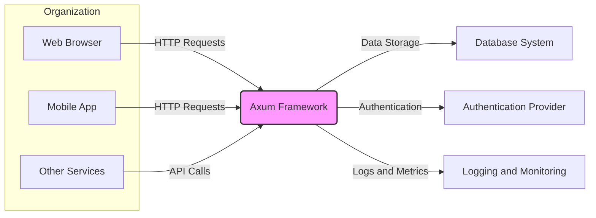
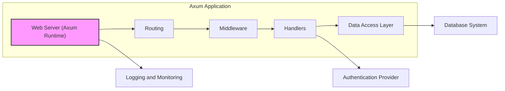
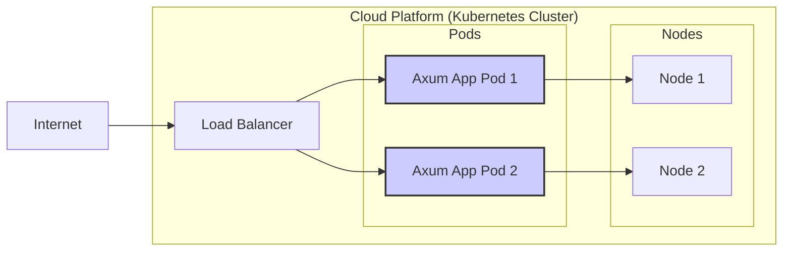

# BUSINESS POSTURE

This project, represented by the GitHub repository [https://github.com/tokio-rs/axum](https://github.com/tokio-rs/axum), is focused on providing a web application framework built with Rust and Tokio.

- Business Priorities:
  - Provide a high-performance and efficient web framework.
  - Enable developers to build robust and scalable web applications and APIs.
  - Leverage the benefits of Rust's memory safety and performance characteristics for web development.
  - Foster a strong community around Rust web development.

- Business Goals:
  - Become a leading web framework in the Rust ecosystem.
  - Offer a developer-friendly and productive environment for building web services.
  - Ensure stability, reliability, and security of the framework.
  - Promote adoption of Rust for backend web development.

- Business Risks:
  - Security vulnerabilities in the framework could lead to exploitation in applications built with Axum, causing data breaches, service disruption, or reputational damage.
  - Performance bottlenecks or inefficiencies in the framework could limit the scalability and responsiveness of applications.
  - Lack of adoption or community support could hinder the framework's long-term viability and ecosystem growth.
  - Bugs or instability in the framework could lead to application failures and developer frustration.

# SECURITY POSTURE

- Security Control: Memory safety provided by Rust language, reducing vulnerabilities like buffer overflows and use-after-free. Implemented by Rust compiler.
- Security Control: Dependency management using Cargo, allowing for controlled inclusion of external libraries. Implemented by Cargo build system.
- Accepted Risk: Potential vulnerabilities in third-party dependencies used by Axum or applications built with Axum. Mitigation relies on dependency scanning and updates.
- Accepted Risk: Security misconfigurations by developers using Axum, leading to insecure applications. Mitigation through documentation, examples, and security best practices guidance.

- Recommended Security Controls:
  - Security Control: Implement automated static application security testing (SAST) on the Axum framework codebase to identify potential vulnerabilities early in the development lifecycle.
  - Security Control: Integrate dependency vulnerability scanning into the development and release process to detect and address known vulnerabilities in dependencies.
  - Security Control: Conduct regular security audits and penetration testing of the Axum framework to identify and remediate security weaknesses.
  - Security Control: Provide comprehensive security documentation and best practices for developers using Axum to build secure applications.
  - Security Control: Establish a clear process for reporting and responding to security vulnerabilities in the Axum framework.

- Security Requirements:
  - Authentication: Applications built with Axum will likely need to implement authentication mechanisms to verify user identities. Axum should provide flexibility and tools to integrate with various authentication strategies (e.g., session-based, token-based, OAuth 2.0).
  - Authorization: Applications will require authorization to control access to resources based on user roles and permissions. Axum should facilitate the implementation of fine-grained authorization policies.
  - Input Validation: Robust input validation is crucial to prevent injection attacks (e.g., SQL injection, cross-site scripting). Axum should encourage and provide mechanisms for validating all user inputs.
  - Cryptography: Applications may need to use cryptography for protecting sensitive data in transit and at rest. Axum should support or integrate well with cryptographic libraries for secure communication (TLS/SSL) and data encryption.

# DESIGN

## C4 CONTEXT



- Context Diagram Elements:
  - Element:
    - Name: Web Browser
    - Type: User
    - Description: Represents users accessing web applications built with Axum through a web browser.
    - Responsibilities: Initiating HTTP requests to interact with the Axum application. Rendering HTML and displaying web content.
    - Security controls: Browser-based security controls (e.g., Content Security Policy, Same-Origin Policy).
  - Element:
    - Name: Mobile App
    - Type: User
    - Description: Represents users accessing web applications or APIs built with Axum through a mobile application.
    - Responsibilities: Making API calls to the Axum application. Displaying data and user interface within the mobile app.
    - Security controls: Mobile app security controls (e.g., secure storage, input validation on the client side).
  - Element:
    - Name: Other Services
    - Type: System
    - Description: Represents other backend services or systems that interact with applications built using Axum via APIs.
    - Responsibilities: Consuming APIs exposed by the Axum application. Providing data or functionality to the Axum application.
    - Security controls: API authentication and authorization mechanisms. Network security controls.
  - Element:
    - Name: Axum Framework
    - Type: Software System
    - Description: The Axum web framework itself, providing the core functionality for building web applications and APIs.
    - Responsibilities: Handling HTTP requests and responses. Routing requests to appropriate handlers. Providing middleware functionality. Integrating with other Rust libraries and the ecosystem.
    - Security controls: Security features of the Rust language. Secure coding practices in framework development. Security audits and vulnerability management.
  - Element:
    - Name: Database System
    - Type: External System
    - Description: Represents a database system used by applications built with Axum to store and retrieve data.
    - Responsibilities: Persisting application data. Providing data access and querying capabilities. Ensuring data integrity and availability.
    - Security controls: Database access controls. Data encryption at rest and in transit. Database security hardening.
  - Element:
    - Name: Authentication Provider
    - Type: External System
    - Description: Represents an external service used for user authentication, such as an OAuth 2.0 provider or an identity management system.
    - Responsibilities: Verifying user credentials. Issuing authentication tokens or sessions. Managing user identities.
    - Security controls: Secure authentication protocols (e.g., OAuth 2.0, OpenID Connect). Strong authentication mechanisms (e.g., multi-factor authentication).
  - Element:
    - Name: Logging and Monitoring
    - Type: External System
    - Description: Represents systems used for logging application events, monitoring performance, and detecting anomalies.
    - Responsibilities: Collecting logs and metrics from the Axum application. Providing dashboards and alerts for monitoring application health and security events.
    - Security controls: Secure logging practices. Access controls for log data. Monitoring for security threats and anomalies.

## C4 CONTAINER



- Container Diagram Elements:
  - Element:
    - Name: Web Server (Axum Runtime)
    - Type: Container
    - Description: The core runtime environment provided by Axum, responsible for handling HTTP connections and managing the application lifecycle.
    - Responsibilities: Accepting incoming HTTP requests. Managing concurrency and request processing. Dispatching requests to the routing component.
    - Security controls: TLS/SSL termination for secure communication. Rate limiting and request throttling to prevent denial-of-service attacks. HTTP header security controls.
  - Element:
    - Name: Routing
    - Type: Container
    - Description: The component responsible for mapping incoming HTTP requests to specific handlers based on URL paths and HTTP methods.
    - Responsibilities: Defining routes and URL patterns. Matching incoming requests to defined routes. Dispatching requests to appropriate handlers.
    - Security controls: Protection against route injection vulnerabilities. Input validation of route parameters.
  - Element:
    - Name: Middleware
    - Type: Container
    - Description: Intercepts and processes HTTP requests and responses before they reach handlers or after handlers have processed requests. Used for cross-cutting concerns like authentication, authorization, logging, and request modification.
    - Responsibilities: Implementing authentication and authorization checks. Logging request and response details. Modifying request or response headers. Handling errors and exceptions.
    - Security controls: Secure implementation of authentication and authorization logic. Input validation and sanitization within middleware. Protection against middleware bypass vulnerabilities.
  - Element:
    - Name: Handlers
    - Type: Container
    - Description: Functions or methods that implement the application's business logic and process specific HTTP requests.
    - Responsibilities: Handling specific business logic for different routes. Processing user input and generating responses. Interacting with data access layer and external services.
    - Security controls: Input validation and sanitization within handlers. Secure coding practices to prevent vulnerabilities. Proper error handling and output encoding.
  - Element:
    - Name: Data Access Layer
    - Type: Container
    - Description:  Abstracts data access operations, providing an interface for handlers to interact with the database system.
    - Responsibilities: Encapsulating database interactions. Performing data validation and sanitization before database queries. Implementing data access logic and query construction.
    - Security controls: Parameterized queries or ORM usage to prevent SQL injection. Data access control and authorization at the data layer. Secure connection to the database.

## DEPLOYMENT

Deployment Solution: Docker containers orchestrated with Kubernetes on a cloud platform (e.g., AWS, GCP, Azure).



- Deployment Diagram Elements:
  - Element:
    - Name: Internet
    - Type: Environment
    - Description: The public internet, representing external users accessing the application.
    - Responsibilities: Providing network connectivity for users to access the application.
    - Security controls: General internet security measures (e.g., DDoS protection at the network edge).
  - Element:
    - Name: Load Balancer
    - Type: Infrastructure
    - Description: Distributes incoming traffic across multiple instances of the Axum application pods.
    - Responsibilities: Load balancing traffic. Providing a single entry point to the application. Performing health checks on application pods.
    - Security controls: TLS/SSL termination. Web Application Firewall (WAF) integration. Rate limiting and traffic filtering.
  - Element:
    - Name: Axum App Pod 1 & 2
    - Type: Container Instance
    - Description: Docker containers running instances of the Axum application.
    - Responsibilities: Running the Axum application code. Handling HTTP requests. Processing business logic.
    - Security controls: Container image security scanning. Resource limits and isolation. Network policies to restrict container communication.
  - Element:
    - Name: Node 1 & 2
    - Type: Infrastructure
    - Description: Virtual machines or physical servers in the Kubernetes cluster that host the application pods.
    - Responsibilities: Providing compute resources for running containers. Managing container lifecycle.
    - Security controls: Operating system security hardening. Host-based intrusion detection systems. Security monitoring and logging.
  - Element:
    - Name: Cloud Platform (Kubernetes Cluster)
    - Type: Environment
    - Description: The cloud environment hosting the Kubernetes cluster and application deployment.
    - Responsibilities: Providing infrastructure and services for running Kubernetes. Managing cluster resources and scaling.
    - Security controls: Cloud provider security controls (e.g., network security groups, IAM roles). Kubernetes security configurations (e.g., RBAC, network policies).

## BUILD

```mermaid
flowchart LR
    A["Developer"] --> B("Code Changes")
    B --> C["GitHub Repository"]
    C --> D["GitHub Actions CI"]
    D --> E{Build & Test}
    E -- Yes --> F{Security Scans (SAST, Dependency)}
    F -- Yes --> G["Container Registry"]
    G --> H["Deployment Environment"]
    E -- No --> I["Build Failure Notification"]
    F -- No --> J["Security Issue Notification"]
    style D fill:#f9f,stroke:#333,stroke-width:2px
```

- Build Process Elements:
  - Element:
    - Name: Developer
    - Type: Actor
    - Description: Software developers who write and modify the Axum application code.
    - Responsibilities: Writing code, committing changes to the repository, and addressing build and security issues.
    - Security controls: Developer workstations security. Code review processes. Secure coding training.
  - Element:
    - Name: Code Changes
    - Type: Artifact
    - Description: Modifications to the application codebase made by developers.
    - Responsibilities: Representing the source code changes that trigger the build process.
    - Security controls: Version control system (Git) for tracking changes and ensuring code integrity. Code review to identify potential security issues.
  - Element:
    - Name: GitHub Repository
    - Type: System
    - Description: The Git repository hosted on GitHub that stores the application's source code.
    - Responsibilities: Version control. Code storage and management. Triggering CI/CD pipelines on code changes.
    - Security controls: Access control to the repository. Branch protection rules. Audit logging of repository activities.
  - Element:
    - Name: GitHub Actions CI
    - Type: System
    - Description: GitHub's built-in CI/CD service used to automate the build, test, and deployment process.
    - Responsibilities: Automating the build pipeline. Running tests and security scans. Building container images. Deploying application artifacts.
    - Security controls: Secure configuration of CI/CD pipelines. Secrets management for credentials and API keys. Audit logging of CI/CD activities.
  - Element:
    - Name: Build & Test
    - Type: Process
    - Description: The step in the CI/CD pipeline where the application code is compiled, built, and unit tests are executed.
    - Responsibilities: Compiling code. Running unit tests. Generating build artifacts.
    - Security controls: Build environment security. Dependency management and integrity checks. Test coverage to ensure code quality.
  - Element:
    - Name: Security Scans (SAST, Dependency)
    - Type: Process
    - Description: Automated security scans performed in the CI/CD pipeline, including Static Application Security Testing (SAST) and dependency vulnerability scanning.
    - Responsibilities: Identifying potential security vulnerabilities in the code and dependencies. Generating security scan reports.
    - Security controls: Configuration of SAST and dependency scanning tools. Integration with vulnerability management systems.
  - Element:
    - Name: Container Registry
    - Type: System
    - Description: A registry (e.g., Docker Hub, private registry) used to store and manage container images of the application.
    - Responsibilities: Storing container images. Providing access to container images for deployment.
    - Security controls: Access control to the container registry. Container image signing and verification. Vulnerability scanning of container images in the registry.
  - Element:
    - Name: Deployment Environment
    - Type: Environment
    - Description: The target environment where the application is deployed (e.g., Kubernetes cluster).
    - Responsibilities: Running the application. Providing runtime environment and resources.
    - Security controls: Deployment environment security controls as described in the Deployment section.

# RISK ASSESSMENT

- Critical Business Processes:
  - Depends on the application built with Axum. Examples include: User authentication and session management, handling sensitive user data (PII, financial information), processing transactions, providing core application functionality.

- Data Sensitivity:
  - Depends on the application built with Axum. Examples of data types and sensitivity levels:
    - Public data (low sensitivity): Blog posts, public product information.
    - Internal data (medium sensitivity): Internal application logs, non-sensitive user activity data.
    - Confidential data (high sensitivity): User credentials, Personally Identifiable Information (PII), financial transaction data, proprietary business data.

# QUESTIONS & ASSUMPTIONS

- Questions:
  - What specific types of applications are being built using the Axum framework (e.g., e-commerce, social media, internal tools)?
  - What are the specific compliance requirements for applications built with Axum (e.g., GDPR, HIPAA, PCI DSS)?
  - What is the organization's overall security maturity level and risk appetite?
  - Are there any specific security concerns or threat vectors that are particularly relevant to applications built with Axum?
  - What are the performance and scalability requirements for applications built with Axum?

- Assumptions:
  - Axum is intended to be used for building a variety of web applications and APIs, ranging from simple to complex.
  - Security is a significant concern for developers and organizations using Axum.
  - Applications built with Axum will handle some level of sensitive data, requiring appropriate security measures.
  - Deployment environments for Axum applications are likely to be cloud-based and containerized.
  - Organizations using Axum are seeking a balance between performance, security, and developer productivity.