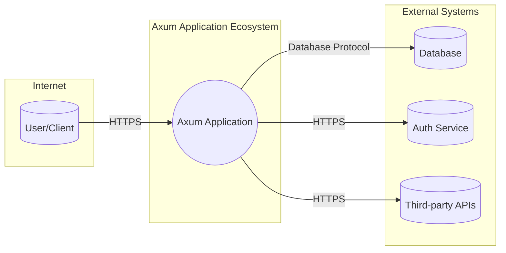
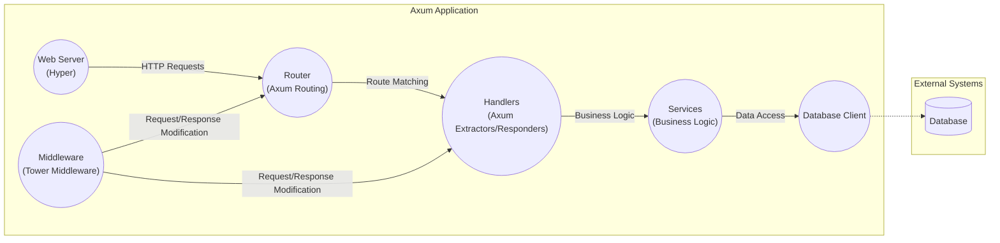
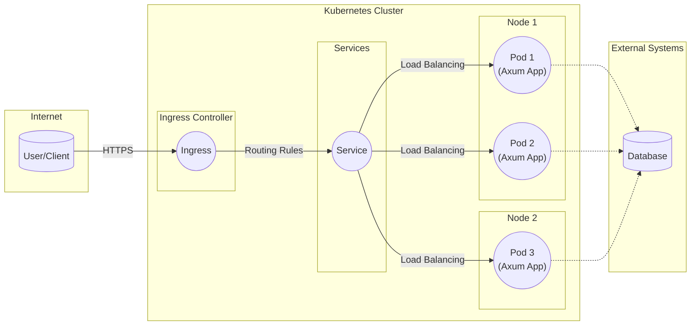
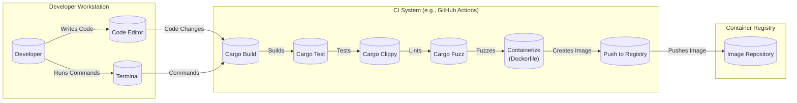

Okay, let's create a design document for the Axum web framework, keeping in mind its purpose and potential security considerations.

# BUSINESS POSTURE

Axum is a web application framework built on top of Tokio, Hyper, and Tower.  It's designed for building robust, scalable, and performant web applications and APIs in Rust.  The primary business goals and priorities that Axum addresses are:

*   Developer Productivity:  Enable rapid development of web applications with a focus on ergonomics and ease of use.  This includes a simple, consistent API, clear documentation, and a thriving community.
*   Performance:  Provide high throughput and low latency for web applications, leveraging the asynchronous capabilities of Tokio and Rust's performance characteristics.
*   Reliability:  Ensure applications built with Axum are stable and resilient to errors, leveraging Rust's strong type system and memory safety guarantees.
*   Scalability:  Allow applications to handle increasing workloads by efficiently utilizing system resources and supporting asynchronous operations.
*   Maintainability:  Facilitate the creation of maintainable codebases through a modular design and clear separation of concerns.
*   Extensibility: Allow to extend framework with custom components.

Based on these priorities, the most important business risks that need to be addressed are:

*   Vulnerabilities in Axum or its dependencies that could lead to application compromise (e.g., remote code execution, denial of service).
*   Performance bottlenecks in Axum that limit the scalability of applications built with it.
*   Complexity in Axum's API or architecture that hinders developer productivity or increases the likelihood of errors.
*   Lack of sufficient documentation or community support that makes it difficult for developers to use Axum effectively.
*   Incompatibility with other key components of the Rust ecosystem.

# SECURITY POSTURE

Axum, being a framework, provides building blocks and relies on the application developer to implement specific security controls. However, it also incorporates some security features and best practices by design.

Existing Security Controls:

*   security control: Leverage Rust's Memory Safety: Axum, being written in Rust, inherently benefits from Rust's memory safety guarantees, preventing common vulnerabilities like buffer overflows and use-after-free errors. Implemented in: Core framework design.
*   security control: Asynchronous Request Handling: Axum's asynchronous nature, based on Tokio, helps mitigate denial-of-service (DoS) attacks by allowing the server to handle many concurrent connections without blocking. Implemented in: Core framework design, integration with Tokio.
*   security control: Middleware Support (Tower): Axum leverages Tower's middleware system, which allows developers to easily add security-related functionality like authentication, authorization, rate limiting, and request validation. Implemented in: `axum::middleware` and Tower integration.
*   security control: Routing and Extraction: Axum's routing and extraction mechanisms provide a structured way to handle incoming requests and extract data, reducing the risk of parsing errors and injection vulnerabilities. Implemented in: `axum::routing` and `axum::extract`.
*   security control: HTTPS Support: Axum, through Hyper, supports HTTPS, enabling secure communication between clients and the server. Implemented in: Hyper integration (developers need to configure TLS certificates).
*   security control: HTTP/2 and HTTP/3 support: Axum, through Hyper, supports modern HTTP protocols. Implemented in: Hyper integration.

Accepted Risks:

*   accepted risk: Dependency Vulnerabilities: Axum relies on external dependencies (Tokio, Hyper, Tower, etc.).  Vulnerabilities in these dependencies could impact Axum's security. This is a common risk for all software projects.
*   accepted risk: Developer Errors: Axum provides tools and guidelines, but ultimately, the security of applications built with Axum depends on the developers implementing secure coding practices.
*   accepted risk: Misconfiguration: Incorrect configuration of Axum or its underlying components (e.g., Hyper, TLS) could lead to security vulnerabilities.

Recommended Security Controls (High Priority):

*   security control: Regular Dependency Audits: Implement automated dependency scanning to identify and address vulnerabilities in Axum and its dependencies.
*   security control: Security-Focused Code Reviews: Conduct thorough code reviews with a focus on security best practices, especially for code handling user input, authentication, and authorization.
*   security control: Fuzz Testing: Integrate fuzz testing into the development process to identify potential vulnerabilities in Axum's request handling and parsing logic.
*   security control: Content Security Policy (CSP): Encourage the use of CSP headers to mitigate cross-site scripting (XSS) attacks. This could be facilitated through middleware or documentation.
*   security control: Security Headers: Promote the use of other security-related HTTP headers (e.g., HSTS, X-Frame-Options, X-Content-Type-Options) through middleware or documentation.

Security Requirements:

*   Authentication:
    *   Axum should provide mechanisms (e.g., middleware) to easily integrate with various authentication schemes (e.g., JWT, OAuth 2.0, session-based authentication).
    *   Authentication mechanisms should be secure by default and protect against common attacks (e.g., brute-force attacks, session hijacking).
*   Authorization:
    *   Axum should provide mechanisms (e.g., middleware) to implement authorization checks based on user roles, permissions, or other attributes.
    *   Authorization should be enforced consistently across all routes and resources.
*   Input Validation:
    *   Axum should encourage and facilitate thorough input validation to prevent injection attacks (e.g., SQL injection, XSS, command injection).
    *   Input validation should be performed on all user-provided data, including request headers, query parameters, and request bodies.
    *   Consider providing helper functions or middleware for common validation tasks.
*   Cryptography:
    *   Axum should leverage secure cryptographic libraries (e.g., `ring`, `rustls`) for handling sensitive data and operations (e.g., password hashing, encryption).
    *   Cryptographic operations should be performed correctly and securely, following best practices.
    *   Key management should be handled securely.

# DESIGN

## C4 CONTEXT

Element Descriptions:

*   Element:
    *   Name: User/Client
    *   Type: Person
    *   Description: A user or client application interacting with the Axum application.
    *   Responsibilities: Sending requests to the Axum application, receiving and processing responses.
    *   Security controls: Browser security features (e.g., same-origin policy, CSP), HTTPS.
*   Element:
    *   Name: Axum Application
    *   Type: Software System
    *   Description: The web application or API built using the Axum framework.
    *   Responsibilities: Handling incoming requests, processing data, interacting with external systems, returning responses.
    *   Security controls: Rust's memory safety, middleware (authentication, authorization, rate limiting, etc.), input validation, secure coding practices.
*   Element:
    *   Name: Database
    *   Type: Software System
    *   Description: A database system used by the Axum application to store and retrieve data.
    *   Responsibilities: Storing and managing data, providing data access to the Axum application.
    *   Security controls: Database access controls, encryption at rest and in transit, input validation (to prevent SQL injection).
*   Element:
    *   Name: Auth Service
    *   Type: Software System
    *   Description: An external authentication service (e.g., OAuth 2.0 provider, identity provider).
    *   Responsibilities: Authenticating users, providing authorization tokens.
    *   Security controls: Secure authentication protocols (e.g., OAuth 2.0, OpenID Connect), secure token management.
*   Element:
    *   Name: Third-party APIs
    *   Type: Software System
    *   Description: External APIs used by the Axum application to access data or functionality.
    *   Responsibilities: Providing specific services or data to the Axum application.
    *   Security controls: API keys, access tokens, HTTPS, rate limiting.

## C4 CONTAINER

Element Descriptions:

*   Element:
    *   Name: Web Server (Hyper)
    *   Type: Container
    *   Description: The underlying HTTP server, provided by the Hyper library.
    *   Responsibilities: Handling TCP connections, parsing HTTP requests, sending HTTP responses.
    *   Security controls: HTTPS support, HTTP/2 and HTTP/3 support, connection management.
*   Element:
    *   Name: Router (Axum Routing)
    *   Type: Container
    *   Description: Axum's routing component, responsible for matching incoming requests to the appropriate handlers.
    *   Responsibilities: Matching request paths and methods to handlers, extracting path parameters.
    *   Security controls: Structured routing, reducing the risk of parsing errors.
*   Element:
    *   Name: Handlers (Axum Extractors/Responders)
    *   Type: Container
    *   Description: Axum handlers, which process requests and generate responses.  They use extractors to access request data and responders to create responses.
    *   Responsibilities: Processing requests, accessing request data, generating responses.
    *   Security controls: Input validation (through extractors), secure response generation.
*   Element:
    *   Name: Middleware (Tower Middleware)
    *   Type: Container
    *   Description: Tower middleware components, which can intercept and modify requests and responses.
    *   Responsibilities: Adding cross-cutting concerns like authentication, authorization, logging, rate limiting.
    *   Security controls: Authentication, authorization, rate limiting, request/response validation, security headers.
*   Element:
    *   Name: Services (Business Logic)
    *   Type: Container
    *   Description: Components containing the application's business logic.
    *   Responsibilities: Implementing core application functionality, interacting with data access layers.
    *   Security controls: Secure coding practices, input validation, authorization checks.
*   Element:
    *   Name: Database Client
    *   Type: Container
    *   Description: A client library for interacting with the database.
    *   Responsibilities: Establishing database connections, executing queries, handling results.
    *   Security controls: Parameterized queries (to prevent SQL injection), secure connection management.
*   Element:
    *   Name: Database
    *   Type: Software System
    *   Description: A database system used by the Axum application to store and retrieve data.
    *   Responsibilities: Storing and managing data, providing data access to the Axum application.
    *   Security controls: Database access controls, encryption at rest and in transit, input validation (to prevent SQL injection).

## DEPLOYMENT

Axum applications can be deployed in various ways, depending on the specific requirements and infrastructure. Common deployment options include:

1.  **Bare Metal/Virtual Machines:** Deploying the compiled Axum application directly on a server (physical or virtual).
2.  **Containers (Docker):** Packaging the Axum application and its dependencies into a Docker container and deploying it to a container orchestration platform (e.g., Kubernetes, Docker Swarm).
3.  **Serverless Functions:** Deploying individual Axum handlers as serverless functions (e.g., AWS Lambda, Azure Functions, Google Cloud Functions). This approach is suitable for specific use cases and requires adapting the application structure.
4.  **Cloud Platforms:** Utilizing managed services provided by cloud providers (e.g., AWS Elastic Beanstalk, Google App Engine, Azure App Service) to deploy and manage the Axum application.

We'll describe the **Container (Docker) with Kubernetes** deployment in detail:

Element Descriptions:

*   Element:
    *   Name: User/Client
    *   Type: Person
    *   Description: A user or client application accessing the Axum application.
    *   Responsibilities: Sending requests to the application, receiving responses.
    *   Security controls: Browser security features, HTTPS.
*   Element:
    *   Name: Ingress
    *   Type: Software System
    *   Description: Kubernetes Ingress controller, managing external access to the services within the cluster.
    *   Responsibilities: Routing external traffic to the appropriate services based on rules.
    *   Security controls: TLS termination, request filtering, rate limiting.
*   Element:
    *   Name: Service
    *   Type: Software System
    *   Description: Kubernetes Service, providing a stable endpoint for accessing the Axum application pods.
    *   Responsibilities: Load balancing traffic across multiple pods.
    *   Security controls: Network policies.
*   Element:
    *   Name: Pod 1, Pod 2, Pod 3 (Axum App)
    *   Type: Container
    *   Description: Kubernetes Pods running instances of the Axum application container.
    *   Responsibilities: Handling incoming requests, processing data, interacting with external systems.
    *   Security controls: Container security best practices (e.g., minimal base image, non-root user), resource limits.
*   Element:
    *   Name: Database
    *   Type: Software System
    *   Description: A database system used by the Axum application to store and retrieve data.
    *   Responsibilities: Storing and managing data, providing data access to the Axum application.
    *   Security controls: Database access controls, encryption at rest and in transit, input validation (to prevent SQL injection).

## BUILD

The build process for Axum applications typically involves the following steps:

1.  **Code Development:** Developers write code using the Axum framework and its dependencies.
2.  **Dependency Management:** `cargo` (Rust's package manager) is used to manage dependencies, ensuring consistent and reproducible builds.
3.  **Compilation:** `cargo build` compiles the Rust code into an executable binary.
4.  **Testing:** `cargo test` runs unit and integration tests to verify the code's correctness.
5.  **Containerization (Optional):** A Dockerfile is used to create a Docker image containing the compiled executable and its runtime dependencies.
6.  **Image Publishing (Optional):** The Docker image is pushed to a container registry (e.g., Docker Hub, AWS ECR).
7.  **Continuous Integration (CI):** A CI system (e.g., GitHub Actions, Jenkins, GitLab CI) automates the build, test, and packaging process.

Security Controls in the Build Process:

*   security control: Dependency Management: `cargo` ensures consistent and reproducible builds, reducing the risk of introducing vulnerabilities through inconsistent dependencies. `Cargo.lock` file locks dependencies versions.
*   security control: Static Analysis: `cargo clippy` (a linter) is used to identify potential code quality and security issues.
*   security control: Automated Testing: Unit and integration tests help ensure the code's correctness and prevent regressions.
*   security control: Fuzz Testing: `cargo fuzz` can be integrated into the CI pipeline to identify potential vulnerabilities through fuzzing.
*   security control: Container Security: If using Docker, follow best practices for creating secure container images (e.g., minimal base image, non-root user, vulnerability scanning).
*   security control: Supply Chain Security: Consider using tools like `cargo-crev` to review and trust dependencies, mitigating the risk of supply chain attacks.
*   security control: CI/CD Security: Secure the CI/CD pipeline itself (e.g., access controls, secrets management).

# RISK ASSESSMENT

*   Critical Business Processes:
    *   Serving web requests and API calls reliably and efficiently.
    *   Maintaining the availability and integrity of application data.
    *   Protecting user data and privacy.
    *   Ensuring the stability and maintainability of the codebase.

*   Data Sensitivity:
    *   The sensitivity of data handled by Axum applications varies greatly depending on the specific application.
    *   Examples:
        *   **Publicly available data (low sensitivity):** Blog posts, product catalogs, static content.
        *   **User-provided data (medium to high sensitivity):** Usernames, email addresses, profile information.
        *   **Sensitive personal data (high sensitivity):** Passwords, financial information, health data.
        *   **Application-specific data (variable sensitivity):** Data specific to the application's purpose (e.g., e-commerce transactions, social media posts, internal business data).

# QUESTIONS & ASSUMPTIONS

*   Questions:
    *   What specific types of applications will be built with Axum (e.g., public APIs, internal microservices, web applications with user authentication)? This will influence the specific security requirements and controls needed.
    *   What are the expected traffic patterns and scalability requirements? This will impact the deployment architecture and performance considerations.
    *   What external systems will Axum applications interact with (databases, authentication services, third-party APIs)? This will influence the security considerations for those integrations.
    *   What is the organization's risk tolerance and security posture? This will guide the prioritization of security controls and the acceptance of certain risks.
    *   What level of logging and monitoring is required for security auditing and incident response?

*   Assumptions:
    *   Developers building applications with Axum have a basic understanding of web security principles.
    *   The underlying operating system and infrastructure are properly secured.
    *   Regular security updates will be applied to the operating system, dependencies, and Axum itself.
    *   Developers will follow secure coding practices and utilize Axum's security features appropriately.
    *   The deployment environment (e.g., Kubernetes cluster) is configured securely.
    *   The build process is automated and secured.