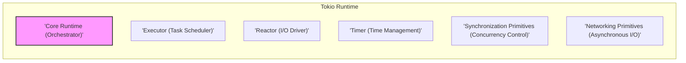
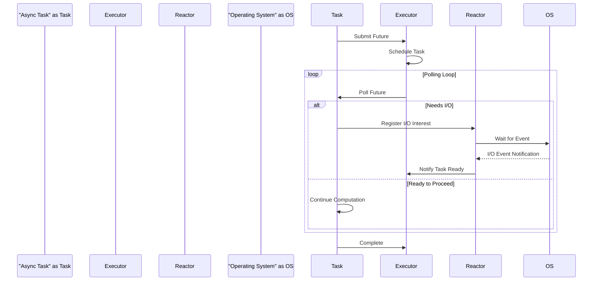
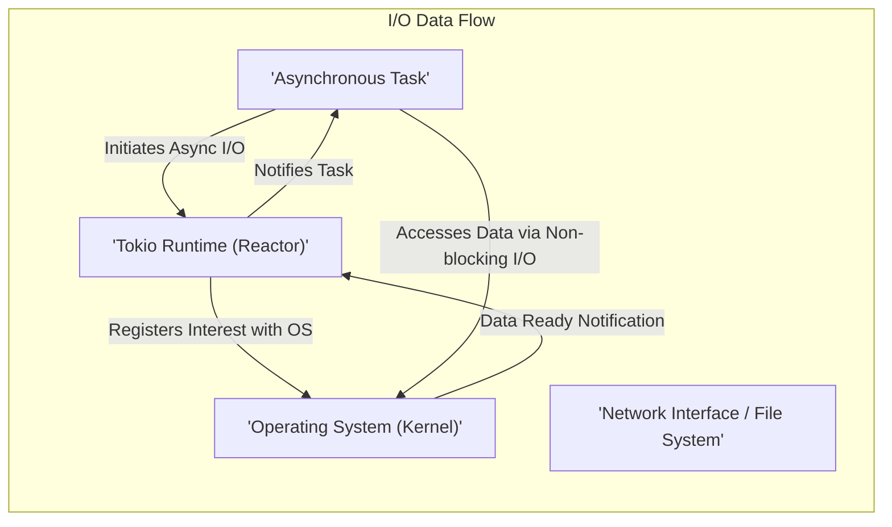

# Project Design Document: Tokio Asynchronous Runtime

**Version:** 1.1
**Date:** October 26, 2023
**Author:** AI Software Architect

## 1. Introduction

This document provides an enhanced design overview of the Tokio asynchronous runtime for Rust. Tokio serves as a fundamental library for building high-performance, concurrent applications in Rust, particularly those involving network operations and distributed systems. This revised document aims to offer a more detailed and refined articulation of Tokio's architecture, components, and data flow, providing a stronger foundation for subsequent threat modeling activities.

## 2. Goals and Objectives

The core design goals of Tokio are:

* **High Performance:** To deliver an asynchronous I/O runtime capable of achieving optimal performance.
* **Robust Reliability:** To offer a dependable and stable platform for constructing concurrent applications.
* **Developer Ergonomics:** To present a clear, intuitive, and easy-to-use API for asynchronous programming.
* **Scalable Concurrency:** To enable applications to efficiently manage and handle a large number of concurrent tasks and connections.
* **Efficient Resource Utilization:** To minimize overhead and optimize the consumption of system resources.

## 3. System Architecture

Tokio's architecture is structured around the following key components, which work in concert to provide asynchronous execution:

* **Core Runtime (Orchestrator):** The central engine responsible for managing and coordinating all other components.
* **Executors (Task Schedulers):** Components dedicated to scheduling and driving asynchronous tasks (Futures) to completion.
* **Reactors (I/O Drivers):**  The interface to the operating system's event notification mechanisms, responsible for handling I/O events.
* **Timers (Time Management):** Mechanisms for scheduling tasks to execute at specific points in time or after a defined duration.
* **Synchronization Primitives (Concurrency Control):** Tools for safely managing concurrent access to shared resources in an asynchronous context.
* **Networking Primitives (Asynchronous I/O):** Abstractions for performing network operations (TCP, UDP, etc.) asynchronously.

### 3.1. Core Runtime (Orchestrator)

The core runtime acts as the central orchestrator of Tokio. It initializes and manages the other components, ensuring their smooth interaction. Key responsibilities include:

* **Initialization and Management:**  Starting and overseeing the lifecycle of the reactor, executors, and other internal structures.
* **Global Task Management:** Maintaining and managing the global queue of runnable tasks.
* **Context Provision:** Providing access to the current asynchronous execution context, allowing tasks to interact with the runtime.
* **Graceful Shutdown:**  Orchestrating the orderly shutdown of the runtime, ensuring all tasks are completed or terminated appropriately.

### 3.2. Executors (Task Schedulers)

Executors are responsible for taking submitted asynchronous tasks (represented as `Future`s) and driving them forward. Tokio offers several executor implementations tailored to different use cases:

* **Thread Pool Executor (Work-Stealing):** The default executor, utilizing a pool of worker threads to execute tasks concurrently. It employs a work-stealing algorithm for efficient task distribution. Suitable for general-purpose asynchronous workloads.
* **Current Thread Executor (Single-Threaded):**  Executes all submitted tasks on the current thread. Primarily used for testing, debugging, or scenarios where single-threaded execution is desired.
* **Local Set Executor (Thread-Local):** Allows spawning tasks that are guaranteed to run on the same thread they were spawned on. Useful for maintaining thread-local state.
* **Custom Executors:** Provides the flexibility for users to implement their own task scheduling logic and execution strategies.

Executors interact closely with the reactor, being notified when a task's awaited I/O operation is ready, allowing the task to resume execution.

### 3.3. Reactors (I/O Drivers)

The reactor, often referred to as the I/O driver, serves as the bridge between Tokio and the operating system's event notification mechanisms. It abstracts away platform-specific details, providing a consistent interface for managing I/O events. Its core functions are:

* **I/O Event Registration:** Registering interest in specific I/O events (e.g., a socket becoming readable, a file descriptor being ready for writing) with the operating system's event notification system (e.g., `epoll` on Linux, `kqueue` on macOS, `IOCP` on Windows).
* **Event Polling:**  Waiting for the operating system to signal that registered I/O events have occurred. This is typically a blocking operation.
* **Event Notification and Dispatch:** Upon receiving event notifications from the OS, the reactor identifies the tasks or futures associated with those events and notifies the appropriate executor to wake them up and resume their execution.

### 3.4. Timers (Time Management)

The timer component enables the scheduling of tasks to be executed after a specified duration or at a particular point in time. This is crucial for implementing features like timeouts, delays, and periodic tasks. The timer typically integrates with the reactor or a dedicated OS timer mechanism:

* **Deadline Registration:** When a timer is set, the timer component registers the deadline with the underlying timer mechanism.
* **Timeout Notification:** When the specified time elapses, the timer mechanism notifies the timer component.
* **Task Waking:** The timer component then notifies the associated executor to wake up the task that was waiting for the timer to expire.

### 3.5. Synchronization Primitives (Concurrency Control)

Tokio provides a suite of asynchronous-aware synchronization primitives designed to facilitate safe and efficient management of shared resources in a concurrent environment without blocking the event loop. These include:

* **`Mutex`:** Provides exclusive, mutual exclusion access to a shared resource. Only one task can hold the mutex at a time. Useful for protecting critical sections of code.
* **`Semaphore`:** Controls the number of concurrent accesses to a particular resource. Useful for limiting the number of concurrent operations, preventing resource overload.
* **Channels (`mpsc`, `oneshot`):** Enable communication and data passing between asynchronous tasks. `mpsc` allows multiple producers and a single consumer, while `oneshot` allows a single message to be sent once.
* **`Barrier`:** Allows multiple tasks to synchronize at a specific point in their execution, ensuring that all participating tasks reach the barrier before any can proceed.
* **`RwLock`:** Provides separate locks for read and write access. Allows multiple readers to access a resource concurrently, but only one writer at a time.

These primitives are designed to be non-blocking, meaning that when a task attempts to acquire a lock or wait on a channel, it will yield control back to the executor if the resource is not immediately available, allowing other tasks to make progress.

### 3.6. Networking Primitives (Asynchronous I/O)

Tokio offers a set of asynchronous networking primitives built on top of the reactor, providing an efficient and convenient way to perform network operations:

* **`TcpListener`:**  Enables listening for incoming TCP connections asynchronously. When a new connection is established, it yields a `TcpStream`.
* **`TcpStream`:** Represents an established TCP connection, providing asynchronous methods for reading and writing data.
* **`UdpSocket`:**  Provides asynchronous methods for sending and receiving UDP datagrams.

These primitives abstract away the complexities of underlying socket operations and integrate seamlessly with the reactor, ensuring that I/O operations do not block the event loop.

## 4. Component Details and Interactions

This section provides a more granular view of how the different components interact to facilitate asynchronous execution.

### 4.1. Task Execution Flow

The typical lifecycle of an asynchronous task within the Tokio runtime involves the following steps:

1. **Task Creation:** An asynchronous operation is represented as a `Future` in Rust. This future encapsulates the logic of the operation.
2. **Task Submission:** The `Future` is submitted to an executor, indicating that the runtime should manage its execution.
3. **Task Scheduling:** The executor places the submitted task in its internal queue, awaiting its turn for execution.
4. **Polling for Readiness:** The executor periodically polls the `Future` to check if it's ready to make progress. A `Future` is ready if it can perform some computation or if an awaited I/O operation has completed.
5. **I/O Registration (Conditional):** If the `Future` needs to perform an I/O operation (e.g., reading from a socket), it registers its interest in the relevant event with the reactor.
6. **Reactor Waiting:** The reactor waits for I/O events to occur on the registered resources.
7. **Event Notification:** When a registered I/O event occurs, the operating system notifies the reactor.
8. **Task Waking:** The reactor notifies the executor that the task associated with the completed I/O operation is ready to resume.
9. **Resumed Execution:** The executor polls the woken `Future` again, allowing it to process the results of the I/O operation and continue its execution.
10. **Completion:** The `Future` eventually reaches a terminal state, either successfully producing a result or encountering an error.

### 4.2. Reactor Operation in Detail

The reactor's operation is central to Tokio's asynchronous nature:

1. **Registration Phase:** Asynchronous operations register their interest in specific events (e.g., readability, writability) on file descriptors or handles with the reactor. This involves associating a callback or waker with the event.
2. **Event Loop (Polling):** The reactor enters a blocking state, invoking the operating system's event notification mechanism (e.g., `epoll_wait`, `kqueue`, `GetQueuedCompletionStatus`). This call waits until one or more of the registered events occur.
3. **Notification and Processing:** When the OS signals that events have occurred, the reactor wakes up. It then iterates through the ready events and activates the corresponding callbacks or wakers associated with those events. This typically involves notifying the relevant tasks or futures that they can now proceed.

### 4.3. Timer Integration Mechanism

The timer component integrates with the runtime to provide time-based task scheduling:

1. **Scheduling Request:** When a timer is set (e.g., using `tokio::time::sleep`), the timer component stores the deadline for the timer.
2. **Integration with Reactor (or Dedicated Mechanism):**  The timer component often integrates with the reactor by registering a wake-up event for the timer's deadline. Alternatively, some platforms might use dedicated timer mechanisms.
3. **Timeout Notification:** When the deadline is reached, the reactor (or dedicated mechanism) signals the timer component.
4. **Task Waking:** The timer component then notifies the executor to wake up the task that was waiting for the timer to expire.

## 5. Data Flow within Tokio

Data flow within Tokio primarily occurs in the context of I/O operations and inter-task communication.

* **I/O Data Handling:** When data is received from a network connection or read from a file, the operating system places the data in a kernel buffer. The reactor detects the readability event and notifies the corresponding task. The task can then access the data from the buffer using non-blocking I/O operations. Similarly, when sending data, the task writes data to a buffer, and the reactor notifies the task when the socket is writable, allowing the OS to transmit the data.
* **Inter-Task Data Passing:** Data is exchanged between asynchronous tasks primarily through channels (e.g., `mpsc`, `oneshot`). When a task sends data on a channel, the data is placed in the channel's internal buffer. When a receiving task is waiting on the channel, it is woken up and can retrieve the data.

## 6. Security Considerations (Detailed)

This section expands on potential security vulnerabilities that will be crucial to address during threat modeling:

* **Resource Exhaustion Attacks:**
    * **Task Flooding:** A malicious actor could submit a large number of tasks, consuming excessive memory and CPU resources, potentially leading to a denial of service.
    * **Connection Exhaustion:**  Opening a large number of connections without proper closure can exhaust file descriptors and memory.
    * **Memory Leaks:** Bugs in application code or within Tokio itself could lead to memory leaks, eventually causing the application to crash.
* **Denial of Service (DoS) Attacks:**
    * **Slowloris Attacks:** Sending partial HTTP requests slowly to tie up server resources.
    * **SYN Floods:**  Exploiting the TCP handshake process to overwhelm the server with connection requests.
    * **Amplification Attacks (UDP):** Sending small requests to services that respond with much larger replies, overwhelming the target.
* **Memory Safety Vulnerabilities:**
    * **Unsafe Code Blocks:** While Rust's memory safety features are strong, `unsafe` blocks can introduce vulnerabilities if not handled carefully.
    * **FFI (Foreign Function Interface) Issues:** Interactions with C libraries or other non-Rust code can introduce memory safety risks.
    * **Buffer Overflows/Underflows:**  Errors in handling data buffers, potentially leading to crashes or arbitrary code execution.
* **Logic Errors and Application-Level Vulnerabilities:**
    * **Authentication and Authorization Flaws:**  Incorrectly implemented authentication or authorization mechanisms can allow unauthorized access.
    * **Data Validation Issues:**  Failing to properly validate input data can lead to injection attacks (e.g., SQL injection).
    * **Race Conditions:**  Bugs arising from the non-deterministic ordering of concurrent operations, potentially leading to unexpected and exploitable states.
* **Supply Chain Security Risks:**
    * **Vulnerable Dependencies:**  Tokio and applications built on it depend on other crates, which could contain vulnerabilities.
    * **Malicious Dependencies:**  Compromised or malicious dependencies could be introduced into the project.
* **Timing Attacks:**
    * **Information Leaks:**  Exploiting subtle differences in the time taken for certain operations to infer sensitive information.
* **Concurrency and Synchronization Issues:**
    * **Deadlocks:** Situations where two or more tasks are blocked indefinitely, waiting for each other to release resources.
    * **Livelocks:** Tasks repeatedly change state in response to each other, without making progress.

## 7. Dependencies

Tokio relies on a set of crucial dependencies to function correctly:

* **`mio` (Meta I/O):** A foundational, low-level I/O library that provides the core abstraction for interacting with the operating system's event notification mechanisms (epoll, kqueue, IOCP). Tokio's reactor is built upon `mio`.
* **`futures`:**  Provides the fundamental `Future` trait and related combinators and utilities that are essential for asynchronous programming in Rust.
* **`async-trait`:** Enables the use of `async` functions within trait definitions, which is a common pattern in asynchronous Rust code.
* **`parking_lot`:** A library providing implementations of mutexes, rwlocks, and other synchronization primitives that are generally faster and more memory-efficient than the standard library equivalents.
* **Platform-Specific Libraries (`libc`):** For direct interaction with operating system APIs when necessary.

## 8. Deployment Considerations

Deploying Tokio applications involves several important considerations:

* **Operating System Compatibility:** Ensure the application is deployed on an operating system supported by Tokio (Linux, macOS, Windows are primary targets).
* **Resource Provisioning:**  Allocate sufficient CPU, memory, and file descriptors based on the expected workload and concurrency levels.
* **Configuration Management:**  Externalize configuration parameters (e.g., port numbers, connection limits) for easier management and updates.
* **Monitoring and Logging:** Implement comprehensive monitoring and logging to track application performance, identify errors, and detect potential security issues. Use structured logging for easier analysis.
* **Process Management:** Utilize a robust process manager (e.g., systemd, supervisord) to ensure the application restarts automatically in case of crashes.
* **Security Hardening:** Apply appropriate security hardening measures to the deployment environment, such as firewalls, intrusion detection systems, and regular security updates.
* **Load Balancing:** For high-traffic applications, implement load balancing to distribute requests across multiple instances of the application.

## 9. Future Considerations and Potential Enhancements

The Tokio project is continuously evolving. Potential future developments might include:

* **Further Performance Optimizations:** Continuously refining the runtime for even better performance, reduced latency, and lower resource consumption. Exploring new I/O strategies and scheduler improvements.
* **Enhanced Observability and Debugging Tools:** Providing more advanced tools for profiling, tracing, and debugging asynchronous applications, making it easier to understand their behavior and diagnose issues.
* **Improved Integration with the Rust Ecosystem:**  Strengthening interoperability with other asynchronous libraries and frameworks within the Rust ecosystem.
* **Exploration of Alternative Runtime Models:** Investigating and potentially incorporating new approaches to asynchronous execution.
* **Standardization Efforts:** Contributing to and aligning with ongoing efforts to standardize asynchronous programming patterns in Rust.

This enhanced design document provides a more detailed and nuanced understanding of the Tokio asynchronous runtime's architecture and operation. It serves as a more robust foundation for conducting thorough threat modeling and building secure and reliable asynchronous applications.