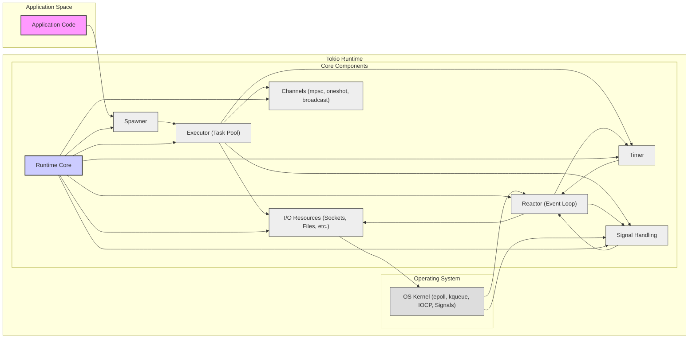

# Tokio Project Design Document for Threat Modeling (Improved)

## 1. Introduction

This document provides an enhanced design overview of the Tokio project, the asynchronous runtime for Rust. Building upon the initial design document, this version offers greater detail and clarity, specifically tailored for threat modeling. It meticulously outlines Tokio's architecture, component interactions, data flow, and expands on security considerations to facilitate a comprehensive threat analysis. This document is crucial for security experts, developers, and anyone involved in securing applications built with Tokio, enabling proactive identification and mitigation of potential security risks.

## 2. Project Overview

Tokio is a high-performance, event-driven, and non-blocking I/O runtime environment for Rust, designed for building robust asynchronous applications. It provides the foundational components necessary for developing complex, concurrent network services and applications. By leveraging Rust's inherent safety features, Tokio aims to deliver a secure and efficient platform for asynchronous programming. It abstracts away the complexities of asynchronous I/O, task scheduling, and concurrency management, allowing developers to concentrate on implementing core application logic.

Key features of Tokio include:

*   **Non-blocking Asynchronous I/O:** Enables highly concurrent operations by providing abstractions for non-blocking I/O, maximizing resource utilization.
*   **Efficient Task Scheduling:**  Manages the execution of asynchronous tasks with a work-stealing scheduler, ensuring optimal performance and fairness.
*   **Flexible Timers and Timeouts:** Offers robust mechanisms for scheduling tasks based on time and implementing timeouts for operations.
*   **Comprehensive Synchronization Primitives:** Includes a rich set of asynchronous synchronization primitives like channels, mutexes, and semaphores for coordinating concurrent tasks safely.
*   **Modular and Extensible Design:**  Architected for extensibility and composability, allowing seamless integration with diverse libraries and frameworks within the Rust ecosystem.
*   **Broad Platform Support:**  Designed for cross-platform compatibility, supporting major operating systems including Linux, macOS, and Windows through platform-specific I/O completion mechanisms.
*   **Focus on Safety and Reliability:** Built with Rust, inheriting its memory safety and concurrency safety guarantees, contributing to more reliable and secure applications.

## 3. Goals and Objectives

The core objectives driving the development of Tokio are:

*   **Maximize Performance:** To deliver a runtime with minimal overhead and maximum throughput for asynchronous applications, enabling high performance and low latency.
*   **Ensure Reliability and Stability:** To guarantee the robustness of asynchronous operations, providing mechanisms for graceful error handling and preventing runtime crashes or deadlocks.
*   **Enable Scalable Concurrency:** To facilitate efficient and safe concurrency, allowing applications to handle a massive number of concurrent operations without performance degradation or data corruption, crucial for modern network applications.
*   **Promote Developer Usability:** To offer a clear, intuitive, and ergonomic API that simplifies the complexities of asynchronous programming in Rust, making it accessible to a wider range of developers.
*   **Uphold Safety and Security:** To leverage Rust's strong safety guarantees to prevent common programming errors like data races and memory leaks in asynchronous contexts, contributing to the security of applications built on Tokio.

## 4. Target Audience

Tokio is designed to be utilized by a diverse group of users:

*   **Rust Application Developers:** Developers building high-performance network applications, servers, distributed systems, real-time applications, and any software requiring asynchronous capabilities in Rust.
*   **Rust Library and Framework Authors:** Developers creating reusable libraries and frameworks that require a robust and efficient asynchronous foundation, leveraging Tokio's capabilities to build upon.
*   **System and Solution Architects:** Architects designing complex systems that demand high concurrency, low latency, and efficient resource utilization, choosing Tokio as the underlying asynchronous runtime.
*   **Security Engineers and Researchers:** Security professionals tasked with assessing and securing systems built using Tokio, requiring a deep understanding of its architecture for effective threat modeling and vulnerability analysis.
*   **Performance Engineers:** Engineers focused on optimizing the performance of applications, utilizing Tokio's features to achieve maximum efficiency and responsiveness.

## 5. System Architecture

Tokio's architecture is fundamentally event-driven and non-blocking, centered around a set of interacting components that manage asynchronous operations and task execution.

**Enhanced Description of Architecture Diagram Components:**

*   **Application Code ("Application Space"):** Represents the Rust code written by developers that utilizes Tokio's API to perform asynchronous operations. This code interacts with Tokio to initiate tasks, manage I/O, and use synchronization primitives. Security considerations here include application-level vulnerabilities, input validation, and secure data handling within tasks.
*   **Tokio Runtime ("Tokio Runtime"):** The core of Tokio, responsible for managing asynchronous task execution and I/O operations. It's composed of several interconnected components:
    *   **Runtime Core ("Runtime Core"):** The central management unit of the Tokio runtime. It orchestrates the lifecycle of the runtime, initializes and coordinates all other components, and handles shutdown procedures. Security aspects include ensuring secure runtime initialization and proper resource cleanup to prevent leaks or vulnerabilities.
    *   **Reactor (Event Loop) ("Reactor (Event Loop)"):**  The heart of Tokio's I/O handling. It polls the operating system for I/O events on registered resources using OS-specific APIs (`epoll`, `kqueue`, IOCP). When an event occurs, it notifies the relevant task. Security considerations involve potential DoS attacks by overwhelming the reactor with events, and vulnerabilities in the underlying OS event polling mechanisms.
    *   **Executor (Task Pool) ("Executor (Task Pool)"):** Manages a pool of worker threads that execute asynchronous tasks. It uses a work-stealing scheduler for efficient task distribution. Security concerns include task starvation, resource exhaustion by malicious tasks, and ensuring proper isolation between tasks to prevent information leakage.
    *   **Spawner ("Spawner"):** Provides the interface for application code to create and submit new asynchronous tasks to the Executor. It's the entry point for initiating asynchronous operations within the Tokio runtime. Security considerations include rate limiting task spawning to prevent DoS and validating task inputs to avoid injection vulnerabilities.
    *   **Timer ("Timer"):** Manages timers and timeouts, allowing tasks to be scheduled for execution after a specific duration. Integrated with the Reactor for efficient time-based event handling. Security implications include DoS by scheduling excessive timers and potential timing attacks if timer precision is exploited.
    *   **I/O Resources (Sockets, Files, etc.) ("I/O Resources (Sockets, Files, etc.)"):** Asynchronous wrappers around OS resources like sockets, files, and pipes. They provide non-blocking I/O APIs and are registered with the Reactor for event notifications. Security considerations include vulnerabilities in I/O handling, such as buffer overflows, format string bugs (less likely in Rust, but still a principle), and ensuring secure communication protocols are used.
    *   **Channels (mpsc, oneshot, broadcast) ("Channels (mpsc, oneshot, broadcast)"):** Asynchronous communication channels for tasks to interact and exchange data. Different channel types offer various communication patterns. Security concerns include DoS by filling channels, unauthorized access to channel data, and ensuring data integrity during inter-task communication.
    *   **Signal Handling ("Signal Handling"):**  Tokio provides asynchronous signal handling, allowing applications to react to OS signals in a non-blocking manner. Security considerations include handling signals securely to prevent unexpected application behavior or vulnerabilities triggered by specific signals.
*   **Operating System Kernel ("Operating System"):** The underlying OS kernel provides the low-level I/O primitives, event notification mechanisms, and signal delivery that Tokio relies upon. Security vulnerabilities in the OS kernel directly impact Tokio's security.

## 6. Component Description (Enhanced)

This section provides a more detailed and security-focused description of each key component within the Tokio runtime.

*   **Runtime Core:**
    *   **Functionality:** Initializes, configures, and manages the lifecycle of the Tokio runtime. Coordinates all other components and handles runtime shutdown.
    *   **Responsibilities:**
        *   Runtime initialization and shutdown.
        *   Configuration management (thread pool size, reactor type, etc.).
        *   Coordination of Reactor, Executor, Timer, Spawner, Channels, and Signal Handling.
        *   Error handling for runtime-level errors.
    *   **Security Considerations:**
        *   Secure initialization process to prevent injection of malicious configurations.
        *   Proper resource cleanup during shutdown to avoid resource leaks or dangling pointers.
        *   Robust error handling to prevent runtime crashes that could lead to DoS.
        *   Configuration options should be securely managed and validated to prevent misconfiguration vulnerabilities.

*   **Reactor (Event Loop):**
    *   **Functionality:** Monitors registered I/O resources for readiness events using OS-specific APIs (e.g., `epoll`, `kqueue`, IOCP). Dispatches events to associated tasks.
    *   **Responsibilities:**
        *   Registration and deregistration of I/O resources.
        *   Polling the OS for I/O events efficiently.
        *   Event demultiplexing and dispatching to relevant tasks.
        *   Integration with Timer and Signal Handling for time-based and signal events.
    *   **Security Considerations:**
        *   DoS attacks by overwhelming the reactor with connection requests or events.
        *   Vulnerabilities in OS-level event polling mechanisms (though less likely to be directly exploitable via Tokio).
        *   Resource exhaustion if too many I/O resources are registered without proper limits.
        *   Potential for race conditions in event handling if not carefully implemented (mitigated by Rust's safety features, but still a consideration in complex logic).

*   **Executor (Task Pool):**
    *   **Functionality:** Executes asynchronous tasks using a pool of worker threads and a work-stealing scheduler.
    *   **Responsibilities:**
        *   Managing a pool of worker threads.
        *   Scheduling and executing tasks efficiently.
        *   Work-stealing algorithm for balanced task distribution.
        *   Providing task-local storage and execution context.
    *   **Security Considerations:**
        *   Task starvation if malicious tasks consume excessive resources or block worker threads.
        *   Resource exhaustion by spawning a large number of CPU-intensive or memory-intensive tasks.
        *   Ensuring proper isolation between tasks to prevent information leakage or interference.
        *   Potential for deadlocks or race conditions in task scheduling logic (mitigated by Rust, but still needs careful design).
        *   Security implications of task cancellation and graceful shutdown of tasks.

*   **Spawner:**
    *   **Functionality:** Provides the API for creating and submitting new asynchronous tasks to the Executor.
    *   **Responsibilities:**
        *   Receiving task submissions from application code.
        *   Placing tasks into the Executor's task queue.
        *   Managing task handles and futures for task lifecycle management.
    *   **Security Considerations:**
        *   DoS attacks by excessive task spawning, overwhelming the Executor.
        *   Input validation for task data to prevent injection vulnerabilities or unexpected behavior.
        *   Rate limiting task spawning to control resource consumption.
        *   Ensuring proper error handling during task submission.

*   **Timer:**
    *   **Functionality:** Manages timers and timeouts, allowing tasks to be scheduled for execution after a delay.
    *   **Responsibilities:**
        *   Scheduling timer events with the Reactor.
        *   Notifying tasks when timers expire.
        *   Maintaining timer accuracy and efficiency.
    *   **Security Considerations:**
        *   DoS attacks by scheduling a very large number of timers.
        *   Potential for timing attacks if timer precision or predictability is exploited.
        *   Resource exhaustion if timers are not properly managed and cancelled.

*   **I/O Resources (Sockets, Files, etc.):**
    *   **Functionality:** Asynchronous wrappers around OS resources, providing non-blocking I/O operations.
    *   **Responsibilities:**
        *   Providing asynchronous APIs for I/O operations (`AsyncRead`, `AsyncWrite`, etc.).
        *   Registering with the Reactor for I/O event notifications.
        *   Managing underlying OS resource handles.
        *   Implementing buffering and other I/O optimizations.
    *   **Security Considerations:**
        *   Vulnerabilities in I/O handling logic (buffer overflows, format string bugs - less likely in Rust, but principle applies).
        *   Ensuring secure communication protocols are used (TLS/SSL for sockets).
        *   Proper validation and sanitization of data read from I/O resources.
        *   Protection against injection attacks through I/O channels.
        *   Resource management for I/O resources to prevent leaks or exhaustion.

*   **Channels (mpsc, oneshot, broadcast):**
    *   **Functionality:** Asynchronous communication channels for inter-task communication.
    *   **Responsibilities:**
        *   Providing APIs for asynchronous message sending and receiving.
        *   Managing message queues and synchronization between tasks.
        *   Ensuring non-blocking communication.
        *   Implementing different channel types for various communication patterns.
    *   **Security Considerations:**
        *   DoS attacks by filling channels with messages, leading to memory exhaustion.
        *   Unauthorized access to data transmitted through channels if not properly secured at the application level.
        *   Data integrity during channel communication.
        *   Potential for race conditions in channel implementation (mitigated by Rust, but still a consideration).
        *   Security implications of channel closure and handling of closed channel errors.

*   **Signal Handling:**
    *   **Functionality:** Provides asynchronous handling of OS signals within the Tokio runtime.
    *   **Responsibilities:**
        *   Registering signal handlers with the OS.
        *   Receiving and processing OS signals asynchronously.
        *   Notifying tasks when signals are received.
    *   **Security Considerations:**
        *   Handling signals securely to prevent unexpected application behavior or vulnerabilities triggered by specific signals (e.g., SIGKILL, SIGTERM, SIGHUP).
        *   Potential for DoS if signal handlers are computationally expensive or block the runtime.
        *   Ensuring signal handlers are robust and do not introduce vulnerabilities.

## 7. Data Flow (Enhanced Security Perspective)

Data flow in Tokio, from a security perspective, involves careful consideration of data integrity, confidentiality, and availability at each stage.

1.  **Application Code initiates an asynchronous operation:** (Security: Input validation and sanitization should occur here before initiating any operation, especially if data originates from external sources.)
2.  **I/O Resource registers with the Reactor:** (Security: Ensure resource registration is properly authorized and within allowed limits to prevent resource exhaustion attacks.)
3.  **Task is yielded:** (Security: State of the task should be securely managed while yielded to prevent unauthorized access or modification.)
4.  **Reactor polls for events:** (Security: Reactor's polling mechanism should be robust against manipulation or injection of malicious events.)
5.  **OS Kernel signals event:** (Security: Trust in the OS kernel's event signaling mechanism is assumed. Kernel vulnerabilities are outside Tokio's direct control but are a dependency.)
6.  **Reactor dispatches event:** (Security: Event dispatch should be correctly routed to the intended task, preventing cross-task contamination or information leakage.)
7.  **Task is woken up:** (Security: Task wakeup mechanism should be secure and prevent unauthorized task activation.)
8.  **Executor schedules task:** (Security: Task scheduling should be fair and prevent task starvation or priority inversion vulnerabilities.)
9.  **Task resumes execution:** (Security: Upon resumption, the task should re-validate any assumptions about data integrity or security context, as the environment might have changed while yielded.)
10. **Data processing and further operations:** (Security: Secure data processing practices must be applied within the task, including encryption, access control, and output sanitization. Further asynchronous operations should repeat this security-conscious cycle.)

**Data flow for inter-task communication using channels (Security Perspective):**

1.  **Task A sends data:** (Security: Data sent through channels should be appropriately sanitized and potentially encrypted if confidentiality is required. Access control to channels should be considered at the application level.)
2.  **Channel buffers message:** (Security: Channel buffers should be protected against overflow and unauthorized access. Memory management for buffers is crucial to prevent leaks or vulnerabilities.)
3.  **Task B receives data:** (Security: Task B should validate and sanitize data received from the channel before processing it. Assume data from channels might be untrusted, especially in complex applications.)
4.  **Task B may yield:** (Security: Similar to I/O operations, task state while yielding should be securely managed.)
5.  **Message becomes available:** (Security: Message availability should be reliably signaled without race conditions that could lead to missed messages or vulnerabilities.)
6.  **Task B is woken up (if yielded):** (Security: Secure task wakeup mechanism.)
7.  **Task B receives message:** (Security: Received message should be treated with caution and validated. Access control to the channel ensures only authorized tasks can receive messages.)

## 8. Security Considerations (Detailed)

Expanding on the initial security considerations, here's a more detailed breakdown:

*   **Resource Exhaustion Attacks:**
    *   **Task Queue Exhaustion:** Malicious actors or buggy code can flood the Executor with tasks, leading to DoS. Mitigation: Implement task spawning rate limiting, task prioritization, and resource quotas.
    *   **Memory Exhaustion:** Unbounded channels, memory leaks in tasks, or excessive allocation can lead to memory exhaustion. Mitigation: Use bounded channels, implement memory limits for tasks, and perform thorough memory leak testing.
    *   **File Descriptor Exhaustion:** Opening too many sockets or files without closing them can exhaust system file descriptors. Mitigation: Implement resource limits, proper resource management (RAII in Rust helps), and connection pooling.
    *   **Thread Pool Exhaustion:**  While Tokio manages its thread pool, misconfiguration or extreme workloads could theoretically lead to thread pool exhaustion. Mitigation: Carefully configure thread pool size and monitor thread pool usage.
    *   **Timer Exhaustion:** Scheduling an excessive number of timers can consume resources. Mitigation: Implement timer limits and efficient timer management practices.

*   **Denial of Service (DoS) Attacks:**
    *   **Reactor Overload:** Overwhelming the Reactor with connection requests or I/O events can lead to DoS. Mitigation: Implement connection rate limiting, request filtering, and robust error handling in I/O operations.
    *   **Slowloris Attacks:** Slow, persistent connections designed to exhaust server resources. Mitigation: Implement timeouts for connections, limit connection duration, and use reverse proxies or load balancers with DoS protection.
    *   **Algorithmic Complexity Attacks:** Exploiting inefficient algorithms in application logic to cause excessive CPU usage. Mitigation: Review and optimize algorithms, implement input validation to prevent excessively large or complex inputs.

*   **Data Confidentiality and Integrity:**
    *   **Unintended Data Exposure:** Improper handling of sensitive data within asynchronous tasks, logging sensitive information, or insecure channel communication. Mitigation: Implement secure data handling practices, use encryption for sensitive data in transit and at rest, avoid logging sensitive data, and enforce access control.
    *   **Data Corruption:** Race conditions or errors in data processing within asynchronous tasks could lead to data corruption. Mitigation: Leverage Rust's safety features to prevent data races, implement data validation and checksums, and use transactional operations where necessary.
    *   **Channel Security:** Data transmitted through channels might be intercepted if not properly secured at the application level. Mitigation: Encrypt sensitive data before sending it through channels, and consider access control mechanisms for channels if needed.

*   **Dependency Vulnerabilities:**
    *   Tokio relies on Rust's standard library and other crates. Vulnerabilities in these dependencies can indirectly affect Tokio-based applications. Mitigation: Regularly audit and update dependencies, use vulnerability scanning tools, and follow security advisories for Rust crates.

*   **Concurrency Bugs:**
    *   Race conditions, deadlocks, and other concurrency issues can still occur in complex asynchronous code despite Rust's safety features. Mitigation: Thoroughly test concurrent code, use formal verification techniques where applicable, and follow best practices for asynchronous programming.

*   **Timing Attacks:**
    *   Exploiting timing differences in task execution or I/O operations to infer sensitive information. Mitigation: Be aware of potential timing attack vectors, avoid timing-sensitive operations on sensitive data, and consider techniques like constant-time algorithms where necessary.

*   **Signal Handling Vulnerabilities:**
    *   Improper signal handling can lead to unexpected application behavior or vulnerabilities. Mitigation: Handle signals securely, avoid complex logic in signal handlers, and ensure signal handlers are non-blocking.

## 9. Technologies Used

Tokio is built upon and leverages the following technologies:

*   **Rust Programming Language:** The foundation of Tokio, providing memory safety, performance, and concurrency features.
*   **Operating System APIs for Asynchronous I/O:**
    *   `epoll` (Linux): Efficient event notification mechanism for Linux systems.
    *   `kqueue` (macOS, BSD):  Efficient event notification mechanism for macOS and BSD systems.
    *   IOCP (Windows): I/O Completion Ports, Windows' asynchronous I/O API.
    *   `poll` and `select` (Fallback): POSIX standard I/O multiplexing APIs used when more efficient APIs are not available.
    *   OS Signal Handling APIs: Platform-specific APIs for registering and handling OS signals.
*   **Rust Standard Library:** Provides essential components like threading, synchronization primitives, networking abstractions, and core data structures.
*   **Crates.io Ecosystem (Rust Package Registry):** Tokio benefits from and contributes to the Rust ecosystem, utilizing and providing various crates for asynchronous programming and related functionalities.
*   **Work-Stealing Scheduler:**  Algorithm used by the Executor for efficient task distribution and load balancing across worker threads.

## 10. Deployment Model

Tokio is deployed as a library embedded within Rust applications. It's not a standalone service. Deployment involves:

*   **Dependency Management:** Including Tokio as a dependency in the `Cargo.toml` file of a Rust project.
*   **Compilation:** Compiling the Rust application, which statically links the Tokio library into the executable.
*   **Executable Deployment:** Deploying the compiled Rust executable to the target environment (server, container, etc.).
*   **Runtime Initialization:** The Tokio runtime initializes automatically when the Rust application starts execution.
*   **Configuration (Optional):**  Tokio can be configured through environment variables or programmatically at runtime to adjust thread pool size, reactor type, and other parameters.

Security considerations during deployment include:

*   **Secure Build Pipeline:** Ensuring the build process is secure and prevents injection of malicious code into the application or its dependencies.
*   **Dependency Management Security:** Verifying the integrity and security of dependencies used by Tokio and the application.
*   **Runtime Environment Security:** Securing the environment where the Tokio application is deployed, including OS hardening, network security, and access control.
*   **Configuration Security:** Securely managing and configuring Tokio runtime parameters to prevent misconfiguration vulnerabilities.

## 11. Future Considerations (Security Focused)

Future development of Tokio should continue to prioritize security:

*   **Formal Security Audits:** Regular security audits by external experts to identify and address potential vulnerabilities in the Tokio runtime code.
*   **Fuzzing and Security Testing:**  Continuous fuzzing and automated security testing to proactively discover bugs and vulnerabilities.
*   **Memory Safety Enhancements:**  Exploring further memory safety improvements beyond Rust's base guarantees, potentially through static analysis or formal verification techniques.
*   **DoS Protection Mechanisms:**  Developing built-in mechanisms within Tokio to mitigate common DoS attacks, such as rate limiting, resource quotas, and connection management features.
*   **Security Hardening:**  Implementing security hardening measures within Tokio to reduce the attack surface and improve resilience against exploits.
*   **Security Documentation and Best Practices:**  Providing comprehensive security documentation and best practices for developers using Tokio to build secure applications.
*   **Vulnerability Disclosure and Response Process:**  Maintaining a clear and efficient vulnerability disclosure and response process to handle security issues promptly and transparently.

## 12. Conclusion

This enhanced design document provides a detailed and security-focused overview of the Tokio project, intended to be a robust foundation for threat modeling activities. It elaborates on the architecture, component interactions, data flow, and comprehensively addresses security considerations. By understanding these aspects, developers and security professionals can effectively identify, assess, and mitigate potential security risks in applications built with Tokio, contributing to a more secure and resilient asynchronous ecosystem in Rust. This document should be used as a living document, updated as Tokio evolves and new security insights emerge.