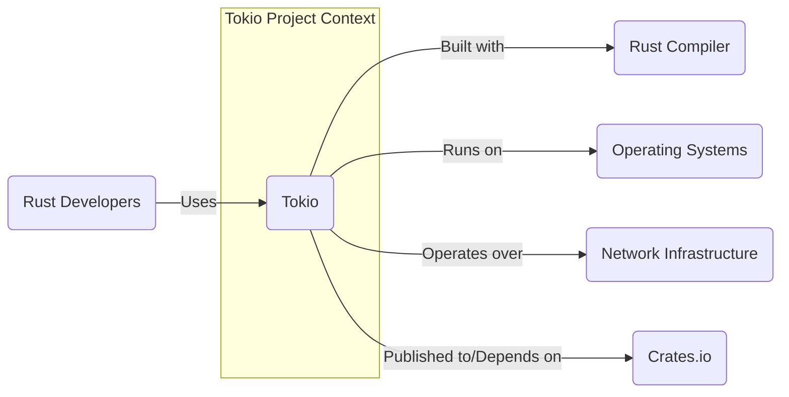
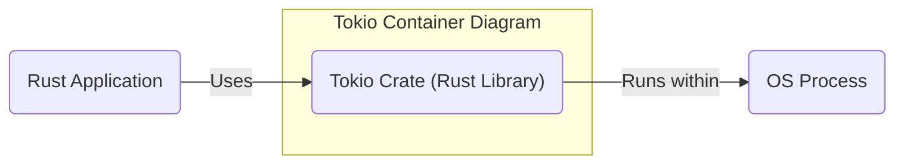
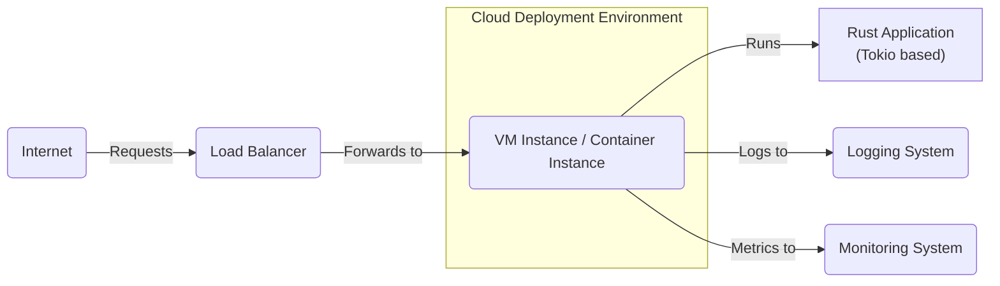
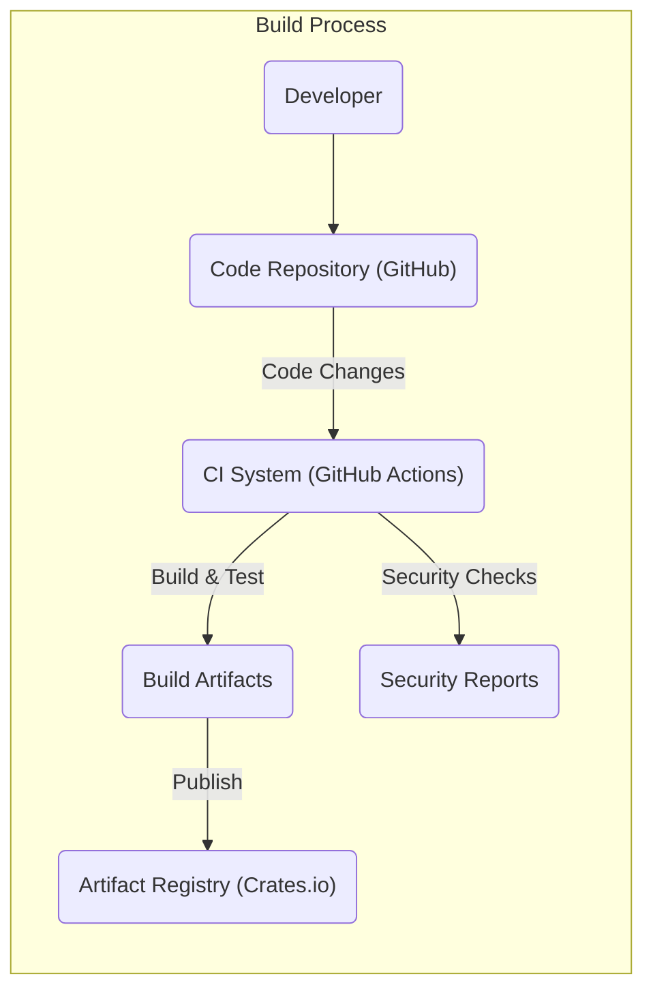

# BUSINESS POSTURE

This project, Tokio, is an asynchronous runtime for the Rust programming language.

- Business Priorities:
  - High performance and efficiency for network applications.
  - Reliability and stability for production environments.
  - Ease of use and developer experience for Rust programmers.
  - Broad platform support across different operating systems and architectures.
  - Active community and long-term maintainability.

- Business Goals:
  - To provide a foundational library for building scalable and concurrent network services in Rust.
  - To enable Rust to be a competitive language for high-performance networking and systems programming.
  - To foster a vibrant ecosystem of libraries and tools built on top of Tokio.

- Business Risks:
  - Performance regressions in new releases could impact user applications.
  - Bugs or vulnerabilities in Tokio could lead to application instability or security issues.
  - Lack of adoption or community support could hinder the project's long-term viability.
  - Dependencies on external libraries or Rust language features could introduce instability or security concerns.

# SECURITY POSTURE

- Security Controls:
  - security control: Memory safety provided by the Rust programming language, inherently reducing classes of vulnerabilities like buffer overflows. Implemented by: Rust Compiler.
  - security control: Focus on code correctness and thorough testing within the Tokio project. Implemented by: Tokio project development practices, CI/CD pipelines.
  - security control: Community contributions and code reviews help identify and address potential issues. Implemented by: Tokio project contribution guidelines and review process on GitHub.
  - security control: Use of static analysis tools (like `clippy` and `rustfmt`) to enforce code quality and catch potential errors. Implemented by: Tokio project CI/CD pipelines.

- Accepted Risks:
  - accepted risk: Potential vulnerabilities in third-party dependencies used by Tokio. Mitigation: Dependency review and updates.
  - accepted risk: Misuse of Tokio APIs by developers leading to insecure applications. Mitigation: Comprehensive documentation and examples.
  - accepted risk: Emergence of new attack vectors or vulnerabilities in asynchronous programming models. Mitigation: Continuous monitoring of security research and updates to Tokio.

- Recommended Security Controls:
  - security control: Implement automated dependency scanning to detect known vulnerabilities in Tokio's dependencies.
  - security control: Integrate fuzzing into the CI/CD pipeline to proactively discover potential bugs and vulnerabilities.
  - security control: Conduct periodic security audits by external security experts to review the codebase and identify potential weaknesses.
  - security control: Publish security guidelines and best practices for developers using Tokio to build secure applications.
  - security control: Establish a clear process for reporting and handling security vulnerabilities in Tokio.

- Security Requirements:
  - Authentication:
    - Not directly applicable to Tokio itself as it is a library.
    - Applications built using Tokio will need to implement their own authentication mechanisms if required.
  - Authorization:
    - Not directly applicable to Tokio itself.
    - Applications built using Tokio will need to implement their own authorization mechanisms if required.
  - Input Validation:
    - Applications using Tokio for network communication must perform robust input validation to prevent injection attacks and other input-related vulnerabilities.
    - Tokio provides tools for handling network data, but input validation is the responsibility of the application developer.
  - Cryptography:
    - Tokio provides asynchronous networking capabilities that can be used to implement secure communication protocols (e.g., TLS).
    - Cryptographic implementations and secure key management are the responsibility of the applications built using Tokio, potentially leveraging other Rust crates for cryptography.

# DESIGN

## C4 CONTEXT

- Context Diagram Elements:
  - - Name: Tokio
    - Type: Project/Library
    - Description: An asynchronous runtime for the Rust programming language, providing building blocks for network applications.
    - Responsibilities: Provides abstractions for asynchronous I/O, task scheduling, timers, and other concurrency primitives in Rust.
    - Security controls: Rust's memory safety, code reviews, testing, static analysis.
  - - Name: Rust Developers
    - Type: User
    - Description: Software engineers who use Tokio to build applications.
    - Responsibilities: Develop applications using Tokio, ensure secure usage of Tokio APIs, implement application-level security controls.
    - Security controls: Secure coding practices, input validation, authentication, authorization in their applications.
  - - Name: Rust Compiler
    - Type: System
    - Description: The Rust toolchain responsible for compiling Rust code, including Tokio.
    - Responsibilities: Compile Rust code into machine code, enforce Rust's safety guarantees.
    - Security controls: Memory safety checks, borrow checker, static analysis during compilation.
  - - Name: Operating Systems
    - Type: System
    - Description: Underlying operating systems (Linux, Windows, macOS, etc.) on which Tokio-based applications run.
    - Responsibilities: Provide system resources, kernel-level security features, networking stack.
    - Security controls: OS-level firewalls, access control lists, kernel security features.
  - - Name: Network Infrastructure
    - Type: System
    - Description: Physical and logical network components that Tokio-based applications communicate over.
    - Responsibilities: Provide network connectivity, routing, and potentially network security features.
    - Security controls: Firewalls, intrusion detection/prevention systems, network segmentation.
  - - Name: Crates.io
    - Type: System
    - Description: The package registry for Rust crates, where Tokio and its dependencies are published and downloaded from.
    - Responsibilities: Host and distribute Rust crates, ensure crate integrity and availability.
    - Security controls: Package signing, malware scanning (potentially), access controls for publishing.

## C4 CONTAINER

- Container Diagram Elements:
  - - Name: Tokio Crate (Rust Library)
    - Type: Library
    - Description: The Tokio crate is a Rust library that provides the core asynchronous runtime functionality. It's distributed via Crates.io and integrated into Rust applications.
    - Responsibilities: Asynchronous task scheduling, reactor for I/O events, timers, synchronization primitives, network primitives.
    - Security controls: Rust's memory safety, internal code reviews and testing, adherence to secure coding practices.
  - - Name: Rust Application
    - Type: Application
    - Description: An application written in Rust that utilizes the Tokio crate to achieve asynchronous behavior.
    - Responsibilities: Implement application logic, handle user requests, manage data, implement application-level security controls (authentication, authorization, input validation, cryptography).
    - Security controls: Application-specific security measures, secure coding practices, dependency management.
  - - Name: OS Process
    - Type: Execution Environment
    - Description: The operating system process in which the Rust application and Tokio runtime execute.
    - Responsibilities: Provide resources and isolation for the application, manage system calls, enforce OS-level security policies.
    - Security controls: OS-level security features (sandboxing, process isolation, resource limits).

## DEPLOYMENT

Tokio itself is not deployed as a standalone service. It is a library that is included in Rust applications, and the deployment of a Tokio-based application depends entirely on the nature of that application.

Assuming a common scenario where a Tokio-based application is deployed as a network service in a cloud environment:

- Deployment Diagram Elements:
  - - Name: VM Instance / Container Instance
    - Type: Compute Instance
    - Description: A virtual machine or container instance in a cloud environment (e.g., AWS EC2, Google Compute Engine, Azure VM, Kubernetes Pod) where the Rust application is deployed.
    - Responsibilities: Execute the Rust application, provide compute resources, network connectivity within the cloud environment.
    - Security controls: Instance-level firewalls, security groups, OS hardening, vulnerability scanning, access control to the instance.
  - - Name: Load Balancer
    - Type: Network Component
    - Description: Distributes incoming network traffic across multiple instances of the Rust application for scalability and availability.
    - Responsibilities: Load balancing, traffic routing, SSL/TLS termination (potentially), basic DDoS protection.
    - Security controls: SSL/TLS encryption, DDoS mitigation, access control lists, web application firewall (WAF) integration (potentially).
  - - Name: Internet
    - Type: Network
    - Description: The public internet from which users access the application.
    - Responsibilities: Global network connectivity.
    - Security controls: N/A (external network). Focus on securing application and infrastructure exposed to the internet.
  - - Name: Monitoring System
    - Type: Observability System
    - Description: Collects and visualizes metrics from the application and infrastructure for performance monitoring and alerting.
    - Responsibilities: Performance monitoring, alerting, incident response support.
    - Security controls: Access control to monitoring data, secure data transmission, audit logging.
  - - Name: Logging System
    - Type: Observability System
    - Description: Collects and stores logs from the application and infrastructure for debugging, auditing, and security analysis.
    - Responsibilities: Log aggregation, storage, search, and analysis.
    - Security controls: Secure log storage, access control to logs, log integrity checks, log retention policies.
  - - Name: Rust Application (Tokio based)
    - Type: Application Deployment
    - Description: The deployed instance of the Rust application built using Tokio.
    - Responsibilities: Handle incoming requests, process data, interact with backend services, implement application logic.
    - Security controls: Application-level security controls (authentication, authorization, input validation, cryptography), secure configuration management, regular security updates.

## BUILD

- Build Process Elements:
  - - Name: Developer
    - Type: Human
    - Description: Software developer writing and committing code to the repository.
    - Responsibilities: Writing code, performing local testing, committing code changes, adhering to coding standards.
    - Security controls: Secure development environment, code review participation, security awareness training.
  - - Name: Code Repository (GitHub)
    - Type: Version Control System
    - Description: GitHub repository hosting the Tokio project source code.
    - Responsibilities: Version control, code collaboration, access control to the codebase.
    - Security controls: Access control (authentication and authorization), branch protection, audit logging, vulnerability scanning (GitHub Dependabot).
  - - Name: CI System (GitHub Actions)
    - Type: Automation System
    - Description: GitHub Actions workflows used for automated building, testing, and security checks of the Tokio project.
    - Responsibilities: Automated build process, running tests, performing static analysis, dependency scanning, generating build artifacts.
    - Security controls: Secure CI/CD pipeline configuration, secret management, access control to CI/CD workflows, build environment security.
  - - Name: Build Artifacts
    - Type: Software Output
    - Description: Compiled Rust library (crate) and other build outputs produced by the CI system.
    - Responsibilities: Package the compiled library for distribution.
    - Security controls: Artifact signing (potentially), integrity checks.
  - - Name: Security Reports
    - Type: Security Analysis Output
    - Description: Reports generated by security scanning tools during the build process (e.g., SAST, dependency scanning).
    - Responsibilities: Provide feedback on potential security vulnerabilities, track security issues.
    - Security controls: Secure storage of security reports, access control to reports, integration with issue tracking systems.
  - - Name: Artifact Registry (Crates.io)
    - Type: Package Repository
    - Description: Crates.io, the Rust package registry where Tokio crates are published for public consumption.
    - Responsibilities: Host and distribute Tokio crates, ensure crate integrity and availability.
    - Security controls: Package signing, access control for publishing, malware scanning (potentially).

# RISK ASSESSMENT

- Critical Business Processes:
  - Applications built using Tokio are the critical business processes. The reliability and performance of these applications directly impact the business. If Tokio has vulnerabilities or performance issues, it can negatively affect all applications built upon it.

- Data to Protect and Sensitivity:
  - Tokio itself does not directly handle business data. However, applications built using Tokio will handle various types of data. The sensitivity of this data depends entirely on the application.
  - For applications using Tokio, data sensitivity can range from public information to highly confidential data like personal identifiable information (PII), financial data, or trade secrets.
  - The data sensitivity and types should be assessed in the context of each specific application built using Tokio.

# QUESTIONS & ASSUMPTIONS

- Questions:
  - What are the specific types of applications that are primarily built using Tokio? (e.g., web servers, databases, message brokers, etc.)
  - What is the risk appetite of organizations using Tokio? (Startups vs. Fortune 500 companies)
  - Are there specific compliance requirements that applications built with Tokio need to adhere to? (e.g., GDPR, HIPAA, PCI DSS)
  - What is the process for reporting and handling security vulnerabilities in Tokio?
  - Are there any existing security guidelines or best practices for developers using Tokio?

- Assumptions:
  - Tokio is primarily used for building network-facing applications.
  - Security concerns are mainly focused on the applications built using Tokio, rather than Tokio itself as a library.
  - Developers using Tokio are expected to have a reasonable level of security awareness and implement security controls in their applications.
  - The deployment environment for Tokio-based applications can vary widely, from on-premise to cloud environments.
  - The Rust compiler and ecosystem provide a baseline level of security due to memory safety and other language features.