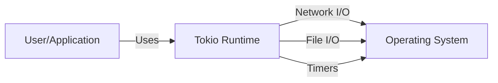
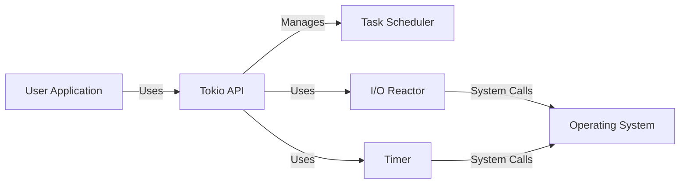
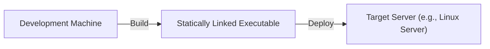
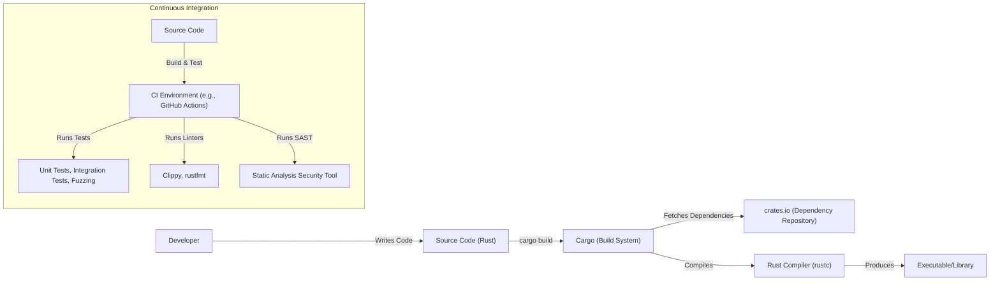

# Project Design Document: Tokio

## BUSINESS POSTURE

Tokio is a foundational library for writing asynchronous applications in Rust. It's widely used in the Rust ecosystem and underpins many high-performance network applications and services.

Priorities and Goals:

- Provide a fast, reliable, and efficient runtime for asynchronous operations in Rust.
- Minimize overhead and maximize throughput for I/O-bound tasks.
- Offer a user-friendly API that simplifies asynchronous programming.
- Maintain excellent performance and scalability as a core library.
- Ensure broad adoption and community support.

Business Risks:

- Performance regressions: Any performance degradation can significantly impact applications relying on Tokio.
- Security vulnerabilities: As a low-level library, vulnerabilities in Tokio can have widespread consequences.
- API instability: Breaking changes can disrupt the ecosystem and hinder adoption.
- Resource exhaustion: Bugs or design flaws leading to excessive resource consumption (memory, CPU, file descriptors) can cause application failures.
- Complexity: Difficulty in understanding and using Tokio correctly can lead to bugs and performance issues in applications.

## SECURITY POSTURE

Existing Security Controls:

- security control: Extensive use of Rust's memory safety features (borrow checker, ownership system) to prevent common memory-related vulnerabilities like buffer overflows, use-after-free, and data races. Implemented in: Core language features.
- security control: Continuous Integration (CI) pipeline with automated testing, including fuzzing, to identify potential bugs and vulnerabilities. Implemented in: GitHub Actions workflows.
- security control: Regular security audits and code reviews. Implemented in: Community and maintainer practices.
- security control: Use of `unsafe` code is minimized and carefully reviewed. Implemented in: Codebase and review process.
- security control: Dependencies are carefully managed and monitored for vulnerabilities. Implemented in: `Cargo.toml` and dependency management tools.
- security control: Community engagement and vulnerability reporting process. Implemented in: GitHub Issues and community forums.

Accepted Risks:

- accepted risk: Reliance on the underlying operating system's security features for network and I/O operations.
- accepted risk: Potential for denial-of-service (DoS) attacks if applications using Tokio do not implement appropriate resource limits and safeguards.
- accepted risk: The complexity of asynchronous programming can introduce subtle bugs that are difficult to detect.

Recommended Security Controls:

- security control: Integrate a Software Composition Analysis (SCA) tool to automatically scan for known vulnerabilities in dependencies.
- security control: Implement regular static analysis (SAST) scans to identify potential security issues in the codebase.
- security control: Establish a formal security vulnerability disclosure program.

Security Requirements:

- Authentication: Not directly applicable to Tokio itself, as it's a low-level runtime. Authentication should be handled by higher-level libraries or applications built on top of Tokio.
- Authorization: Not directly applicable to Tokio itself. Authorization should be handled by higher-level libraries or applications.
- Input Validation: Tokio primarily deals with raw bytes and network packets. Input validation is the responsibility of higher-level protocols and applications built using Tokio. However, Tokio should provide mechanisms (e.g., timeouts, size limits) to mitigate potential attacks related to malformed or excessive input.
- Cryptography: Tokio itself does not implement cryptographic protocols. It provides the I/O primitives that can be used by other libraries (like rustls or OpenSSL) to implement secure communication channels (TLS/SSL).

## DESIGN

### C4 CONTEXT

Element Descriptions:

- User/Application:
  - Name: User/Application
  - Type: External Entity (User or Application)
  - Description: Represents any user or application that utilizes the Tokio runtime for asynchronous operations.
  - Responsibilities: Initiates asynchronous operations, handles results, and manages application logic.
  - Security controls: Implements application-level security controls (authentication, authorization, input validation).

- Tokio Runtime:
  - Name: Tokio Runtime
  - Type: System
  - Description: The core Tokio library providing asynchronous runtime capabilities.
  - Responsibilities: Manages asynchronous tasks, handles I/O events, provides timers, and schedules execution.
  - Security controls: Leverages Rust's memory safety, uses `unsafe` sparingly, undergoes regular security audits.

- Operating System:
  - Name: Operating System
  - Type: External System
  - Description: The underlying operating system (e.g., Linux, Windows, macOS) providing system calls for network I/O, file I/O, and timers.
  - Responsibilities: Provides the fundamental I/O and timer functionalities.
  - Security controls: Relies on the OS's built-in security mechanisms.

### C4 CONTAINER

Element Descriptions:

- User Application:
    - Name: User Application
    - Type: Container
    - Description: Code written by a user that utilizes the Tokio library.
    - Responsibilities: Implements the application's specific logic and uses Tokio for asynchronous operations.
    - Security controls: Application-level security controls, input validation, proper error handling.

- Tokio API:
    - Name: Tokio API
    - Type: Container
    - Description: The public interface of the Tokio library, providing functions and types for asynchronous programming.
    - Responsibilities: Exposes a user-friendly API for interacting with the Tokio runtime.
    - Security controls: Input validation (where applicable), error handling, documentation of safe usage patterns.

- Task Scheduler:
    - Name: Task Scheduler
    - Type: Container
    - Description: The component responsible for scheduling and executing asynchronous tasks.
    - Responsibilities: Manages the execution of tasks, handles task wakeups, and ensures efficient resource utilization.
    - Security controls: Protection against resource exhaustion, fair scheduling.

- I/O Reactor:
    - Name: I/O Reactor
    - Type: Container
    - Description: The component that interacts with the operating system's I/O event notification mechanism (e.g., epoll, kqueue, IOCP).
    - Responsibilities: Registers interest in I/O events, receives notifications, and dispatches events to the appropriate tasks.
    - Security controls: Careful handling of file descriptors, protection against resource leaks.

- Timer:
    - Name: Timer
    - Type: Container
    - Description: Provides timer functionality for scheduling tasks to run at a specific time or after a delay.
    - Responsibilities: Manages timers, triggers callbacks at the appropriate times.
    - Security controls: Accurate timekeeping, protection against timer-related attacks.

- Operating System:
    - Name: Operating System
    - Type: External System
    - Description: The underlying operating system.
    - Responsibilities: Provides system calls for I/O and timers.
    - Security controls: Relies on the OS's built-in security mechanisms.

### DEPLOYMENT

Tokio is a library, not a standalone application. Therefore, deployment is inherently tied to the application that uses it.  Here are a few common deployment scenarios:

1.  **Statically Linked Binary:** The most common scenario is compiling the Rust application (which includes Tokio) into a single, statically linked executable. This executable can then be deployed to any compatible system without requiring external dependencies.
2.  **Dynamically Linked Binary:** Less common, but possible, is to compile the application with dynamic linking. This would require the target system to have compatible versions of the Rust standard library and any other dynamically linked crates.
3.  **Containerized Deployment (Docker):**  The application and its dependencies (including Tokio) are packaged into a Docker container. This provides a consistent and isolated environment for deployment.
4.  **Cloud-Specific Deployments (e.g., AWS Lambda, Google Cloud Functions):**  The application is packaged and deployed according to the specific requirements of the cloud provider.

We'll describe the statically linked binary deployment in detail, as it's the most common and straightforward:

Element Descriptions:

- Development Machine:
    - Name: Development Machine
    - Type: Node
    - Description: The machine where the Rust code is written and compiled.
    - Responsibilities: Code development, compilation, testing.
    - Security controls: Developer machine security best practices (e.g., up-to-date OS, antivirus, firewall).

- Statically Linked Executable:
    - Name: Statically Linked Executable
    - Type: Artifact
    - Description: The compiled binary containing the application code and all its dependencies (including Tokio) statically linked.
    - Responsibilities: Runs the application logic.
    - Security controls:  Relies on the security of the build process and the inherent security features of Rust.

- Target Server (e.g., Linux Server):
    - Name: Target Server
    - Type: Node
    - Description: The server where the application will be deployed and run.
    - Responsibilities: Provides the runtime environment for the application.
    - Security controls: Server hardening, firewall, intrusion detection/prevention systems, regular security updates.

### BUILD

The build process for a Tokio-based application typically involves using Cargo, Rust's build system and package manager.

Build Process Description:

1.  **Developer writes code:** The developer writes the Rust code, utilizing the Tokio library for asynchronous operations.
2.  **`cargo build`:** The developer uses the `cargo build` command to initiate the build process.
3.  **Dependency resolution:** Cargo fetches the required dependencies (including Tokio and its transitive dependencies) from crates.io (or other configured repositories).
    - security control: Dependency pinning and verification using `Cargo.lock`.
    - security control: Use of a Software Composition Analysis (SCA) tool to scan for known vulnerabilities in dependencies.
4.  **Compilation:** Cargo invokes the Rust compiler (`rustc`) to compile the source code and its dependencies.
    - security control: Rust's memory safety features are enforced during compilation.
5.  **Linking:** The compiler links the compiled code with the necessary libraries (including Tokio) to produce the final executable or library.
6.  **Continuous Integration (CI):**  A CI system (e.g., GitHub Actions) is typically used to automate the build, testing, and security checks.
    - security control: Automated unit tests, integration tests, and fuzzing are executed on every code change.
    - security control: Linters (like Clippy and rustfmt) are used to enforce code style and identify potential issues.
    - security control: Static Analysis Security Testing (SAST) tools are run to scan for potential vulnerabilities in the code.

## RISK ASSESSMENT

Critical Business Processes:

- Asynchronous I/O operations: Tokio is fundamental to handling network and file I/O efficiently. Any disruption to Tokio's functionality directly impacts the application's ability to communicate and process data.
- Task scheduling and execution: Tokio's task scheduler is critical for managing concurrent operations. Failures in the scheduler can lead to deadlocks, performance bottlenecks, or application crashes.

Data Sensitivity:

- Tokio itself does not handle sensitive data directly. It deals with raw bytes and network packets. The sensitivity of the data depends on the application using Tokio.
- Applications built on Tokio might handle:
    - Personally Identifiable Information (PII)
    - Financial data
    - Authentication credentials
    - Proprietary business data
    - Other sensitive information, depending on the application's purpose.

## QUESTIONS & ASSUMPTIONS

Questions:

- What specific types of applications are most commonly built using Tokio within the organization? (This helps tailor the threat model to the most relevant use cases.)
- Are there any existing performance benchmarks or targets for Tokio-based applications?
- What is the current process for reporting and addressing security vulnerabilities in Tokio or applications using it?
- What level of logging and monitoring is implemented for Tokio-based applications?
- Are there any specific regulatory compliance requirements (e.g., GDPR, HIPAA) that apply to applications using Tokio?

Assumptions:

- BUSINESS POSTURE: The organization prioritizes performance, reliability, and security for applications built using Tokio.
- SECURITY POSTURE: The organization has a basic understanding of secure coding practices and follows them when developing applications using Tokio. The organization has a process for managing dependencies and addressing vulnerabilities.
- DESIGN: The typical deployment model involves statically linked binaries or containerized deployments. The build process utilizes Cargo and a CI system for automated testing and security checks.