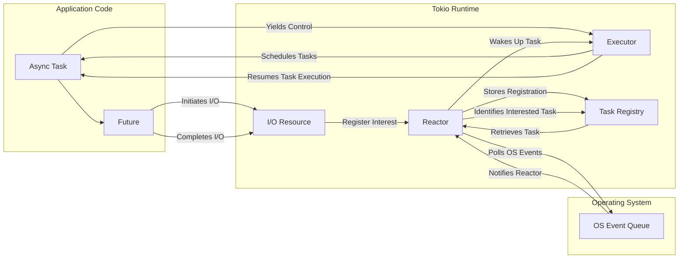

# Project Design Document: Tokio Asynchronous Runtime - Improved

**Version:** 2.0
**Date:** October 26, 2023
**Author:** Gemini (AI Language Model)

## 1. Introduction

This document provides an enhanced and more detailed design overview of the Tokio asynchronous runtime for the Rust programming language. Building upon the previous version, this iteration aims to provide a deeper understanding of Tokio's internal workings, component interactions, and security considerations. This document is intended to serve as a robust foundation for subsequent threat modeling activities, enabling a more granular and comprehensive assessment of potential security vulnerabilities.

## 2. Goals

*   Provide a clear, concise, and in-depth description of Tokio's architecture and its internal mechanisms.
*   Elaborate on the responsibilities and interactions of the major components with greater detail.
*   Illustrate the flow of data and control within the runtime with more precision.
*   Thoroughly highlight key areas relevant to security considerations, including potential attack vectors.
*   Serve as a definitive and detailed basis for subsequent threat modeling exercises.

## 3. Overview

Tokio is a powerful asynchronous runtime for Rust, designed to facilitate the development of highly concurrent and scalable network applications. It leverages Rust's strong memory safety guarantees to build a robust foundation for asynchronous programming. At its core, Tokio enables non-blocking I/O operations, allowing a single thread, or a small pool of threads, to manage a large number of concurrent tasks efficiently. It offers a rich set of abstractions, including futures, streams, and synchronization primitives, empowering developers to construct complex asynchronous workflows in a structured and maintainable manner. Tokio's architecture is event-driven, relying on the operating system's notification mechanisms to efficiently manage I/O events.

## 4. Architectural Design

Tokio's architecture comprises several interconnected components, each with specific responsibilities:

*   **Reactor (Event Loop):**
    *   The central nervous system of Tokio, responsible for monitoring operating system events related to registered I/O resources.
    *   Internally utilizes platform-specific mechanisms like `epoll` (Linux), `kqueue` (macOS, BSD), and IOCP (Windows) for efficient event notification.
    *   Maintains a registry of I/O resources and the tasks interested in their events.
    *   When an event occurs, the Reactor wakes up the associated task, allowing it to make progress.
    *   Typically operates on a dedicated thread, ensuring timely processing of events.

*   **Executor (Task Scheduler):**
    *   Manages the execution of asynchronous tasks (futures).
    *   Can be configured as single-threaded or multi-threaded (using a work-stealing thread pool for better parallelism).
    *   Maintains a queue (or multiple queues in the multi-threaded case) of ready-to-run tasks.
    *   When a task is woken up by the Reactor or becomes ready for other reasons, the Executor schedules it for execution on an available worker thread.
    *   Provides mechanisms for spawning new tasks and managing their lifecycle.

*   **Futures:**
    *   Represent the eventual result of an asynchronous operation.
    *   Implement the `Future` trait, which defines the `poll` method.
    *   The `poll` method checks if the operation has completed and returns `Poll::Ready` with the result or `Poll::Pending` if it's still in progress.
    *   Futures can be chained and composed using combinators to create complex asynchronous workflows.

*   **Tasks:**
    *   Units of work that are executed by the Executor.
    *   Typically encapsulate a `Future` and provide the context for its execution.
    *   Are registered with the Reactor when they need to wait for an I/O event.
    *   When a task's associated I/O resource becomes ready, the Reactor notifies the task, making it eligible for scheduling by the Executor.

*   **I/O Resources (Primitives):**
    *   Abstractions over operating system resources that support asynchronous I/O operations.
    *   Examples include:
        *   Sockets (`TcpListener`, `TcpStream`, `UdpSocket`)
        *   Files (`File`)
        *   Timers (`tokio::time::Sleep`, `tokio::time::Interval`)
        *   Signals (`tokio::signal`)
    *   These resources are registered with the Reactor to receive notifications about their readiness for reading or writing.

*   **Synchronization Primitives:**
    *   Tools for managing concurrent access to shared data and coordinating the execution of asynchronous tasks.
    *   Examples include:
        *   Mutexes (`tokio::sync::Mutex`): Provide exclusive access to a resource.
        *   RwLocks (`tokio::sync::RwLock`): Allow multiple readers or a single writer.
        *   Semaphores (`tokio::sync::Semaphore`): Control the number of concurrent accesses to a resource.
        *   Channels (`tokio::sync::mpsc`, `tokio::sync::oneshot`): Enable communication between asynchronous tasks.
        *   Barriers (`tokio::sync::Barrier`): Allow multiple tasks to synchronize at a specific point.

*   **Runtime Configuration:**
    *   Allows customization of Tokio's behavior at initialization.
    *   Key configuration options include:
        *   Number of worker threads for the multi-threaded Executor.
        *   The ticking interval of the Reactor.
        *   Custom task scheduling policies.
        *   Resource limits (e.g., maximum number of concurrent connections).

## 5. Data Flow

**Detailed Data Flow:**

1. An `Async Task` in the application code is initiated.
2. This task involves a `Future` that needs to perform an I/O operation using an `I/O Resource`.
3. The `I/O Resource` is registered with the `Reactor`, indicating the events it's interested in (e.g., readability, writability). This registration is stored in the `Task Registry`.
4. The `Async Task` yields control to the `Executor`, as the I/O operation is non-blocking.
5. The `Reactor` continuously polls the operating system's `OS Event Queue` for relevant events.
6. When an event occurs (e.g., data arrives on a socket), the operating system notifies the `Reactor`.
7. The `Reactor` consults the `Task Registry` to identify the `Async Task` interested in this event.
8. The `Reactor` wakes up the corresponding `Async Task`.
9. The `Executor` schedules the woken `Async Task` for execution on an available thread.
10. The `Executor` resumes the execution of the `Async Task`.
11. The `Future` associated with the task can now make progress, potentially completing the I/O operation on the `I/O Resource`.
12. The `I/O Resource` interacts with the operating system to perform the actual I/O.

## 6. Security Considerations

This section provides a more detailed breakdown of potential security considerations, categorized for clarity:

*   **Resource Exhaustion Attacks:**
    *   **Connection/Task Flooding:** Malicious actors could attempt to exhaust server resources by establishing a large number of connections or spawning an excessive number of tasks, overwhelming the `Reactor` and `Executor`.
    *   **Memory Exhaustion:**  Exploiting vulnerabilities or design flaws to cause excessive memory allocation, potentially leading to crashes or denial of service.
    *   **File Descriptor Exhaustion:** Opening a large number of connections or files without proper closure can exhaust available file descriptors.

*   **Denial of Service (DoS) Attacks:**
    *   **Reactor Overload:** Sending a flood of events that require processing by the `Reactor` could overwhelm it, preventing it from handling legitimate events.
    *   **Executor Saturation:** Submitting a large number of computationally intensive tasks can saturate the `Executor`, delaying the processing of other tasks.
    *   **Asynchronous Logic Exploits:**  Exploiting flaws in the application's asynchronous logic to create infinite loops or resource-intensive operations.

*   **Data Integrity and Confidentiality:**
    *   **Data Races:** While Rust's ownership system helps, improper use of shared mutable state within asynchronous tasks, especially when using `unsafe` code or interacting with external libraries, can lead to data corruption.
    *   **Insecure Deserialization:** If Tokio-based applications handle deserialization of untrusted data, vulnerabilities in deserialization libraries could be exploited.
    *   **Side-Channel Attacks:**  The asynchronous nature of Tokio might introduce subtle timing differences that could be exploited in timing attacks, particularly if cryptographic operations are involved in the application logic.

*   **Code Injection and Execution:**
    *   **Unsafe Code Blocks:**  Vulnerabilities within `unsafe` code blocks in Tokio or its dependencies could lead to memory corruption and potential code execution.
    *   **Dependency Vulnerabilities:**  Exploiting known vulnerabilities in the dependencies used by Tokio.

*   **Configuration and Deployment Issues:**
    *   **Insecure Defaults:**  Default configurations that are not secure can leave applications vulnerable.
    *   **Insufficient Resource Limits:**  Not setting appropriate limits on connections, tasks, or memory can make the application susceptible to resource exhaustion attacks.
    *   **Exposure of Sensitive Information:**  Logging or error messages inadvertently revealing sensitive data.

*   **Cancellation Safety Issues:**
    *   **Resource Leaks:** Improper handling of task cancellation can lead to resources not being released correctly.
    *   **Inconsistent State:**  Canceling tasks at inappropriate times can leave the application in an inconsistent state.

## 7. Dependencies

Tokio relies on a set of carefully selected dependencies to provide its functionality:

*   **Rust Standard Library (`std`):**  The foundation upon which Tokio is built, providing core functionalities.
*   **`mio` (Meta I/O):** A foundational, low-level library providing a consistent interface to the operating system's event notification mechanisms (`epoll`, `kqueue`, IOCP).
*   **`async-trait`:** Enables the use of `async` functions in traits.
*   **`futures-core` and `futures-util`:** Provide core future types and utilities for working with futures.
*   **Various utility crates:**  For specific functionalities like:
    *   Time management (`time`)
    *   Synchronization primitives (`parking_lot`)
    *   Network primitives (`socket2`)
    *   Error handling (`thiserror`, `anyhow`)

## 8. Deployment Considerations

Deploying applications built with Tokio requires careful consideration of security best practices:

*   **Secure Coding Practices:** Developers must adhere to secure coding principles when writing asynchronous code, paying close attention to data handling, error handling, and resource management.
*   **Configuration Hardening:**  Review and configure Tokio's runtime parameters to enforce appropriate resource limits and security settings.
*   **Dependency Management:**  Utilize tools like `cargo audit` to identify and address known vulnerabilities in Tokio's dependencies. Regularly update dependencies to patch security flaws.
*   **Operating System Security:** Ensure the underlying operating system is properly secured and patched.
*   **Network Security:** Implement appropriate network security measures, such as firewalls and intrusion detection systems, to protect Tokio-based applications.
*   **Monitoring and Logging:** Implement robust monitoring and logging to detect and respond to potential security incidents. Log relevant events, including connection attempts, errors, and resource usage.

## 9. Operational Considerations

*   **Monitoring:** Implement monitoring of key metrics such as CPU usage, memory consumption, number of active connections, and task queue lengths to detect anomalies and potential attacks.
*   **Logging:**  Comprehensive logging of application events, including errors, warnings, and security-related events, is crucial for incident analysis and debugging.
*   **Alerting:** Configure alerts for critical events, such as high resource usage or suspicious activity.
*   **Regular Security Audits:** Conduct periodic security audits and penetration testing to identify potential vulnerabilities in the application and its deployment environment.

## 10. Future Considerations

*   Continued performance optimization of the `Reactor` and `Executor`.
*   Further development of robust and secure synchronization primitives.
*   Enhancements to error handling and debugging capabilities for asynchronous code.
*   Exploration of new asynchronous programming patterns and abstractions within the Rust ecosystem.

This improved design document provides a more detailed and comprehensive understanding of the Tokio asynchronous runtime, offering a stronger foundation for thorough threat modeling and the development of secure and reliable asynchronous applications.