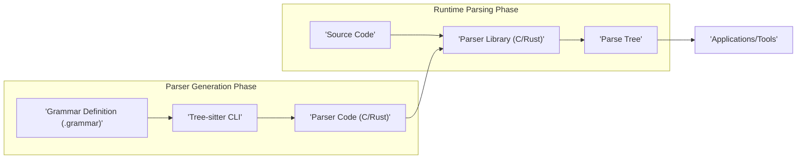
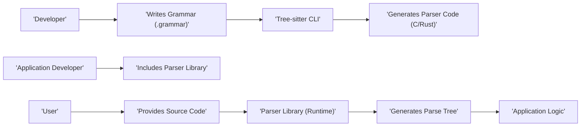

# Project Design Document: Tree-sitter

**Version:** 1.1
**Date:** October 26, 2023
**Author:** AI Software Architect

## 1. Introduction

This document provides an enhanced design overview of the Tree-sitter project, a parser generator tool and incremental parsing library. This document aims to clearly articulate the system's architecture, components, and data flow to facilitate future threat modeling activities. The information presented here is based on the public repository: [https://github.com/tree-sitter/tree-sitter](https://github.com/tree-sitter/tree-sitter). This revision includes more detail on component interactions and potential security implications.

## 2. Goals and Objectives

The primary goals of the Tree-sitter project are:

*   **Efficient Parsing:** To provide a fast and efficient mechanism for parsing source code, minimizing latency in applications.
*   **Incremental Parsing:** To enable efficient re-parsing of code as it is being edited, updating the parse tree with minimal computational cost. This is crucial for interactive tools.
*   **Error Recovery:** To gracefully handle syntax errors in the input code, producing a partial and usable parse tree even with errors present. This allows tools to provide feedback even on incomplete code.
*   **Language Agnostic:** To support parsing of a wide variety of programming languages and data formats through the use of declarative, language-specific grammar definitions.
*   **Extensibility:** To allow users to define custom grammars and seamlessly integrate the parsing library into their applications through well-defined APIs.
*   **Code Generation:** To generate highly optimized and efficient C or Rust code for the parser based on the provided grammar, ensuring performance.

## 3. System Architecture

The Tree-sitter system operates in two distinct phases: the **Parser Generation Phase** and the **Runtime Parsing Phase**. Understanding this separation is key to analyzing potential vulnerabilities.

### 3.1. High-Level Architecture

### 3.2. Detailed Architecture

#### 3.2.1. Parser Generation Phase

This phase focuses on transforming a grammar definition into executable parser code.

*   **Grammar Definition (.grammar):** This file, written in Tree-sitter's grammar DSL (Domain Specific Language), precisely describes the syntax of the target language. It defines:
    *   **Lexical Rules:** Patterns for recognizing tokens (e.g., keywords, identifiers, operators).
    *   **Syntactic Rules:**  How tokens can be combined to form valid language constructs (e.g., expressions, statements, functions).
    *   **Precedence and Associativity:** Rules for resolving ambiguities in the grammar.
*   **Tree-sitter CLI:** The command-line interface (`tree-sitter`) is the primary tool for developers. It performs several crucial actions:
    *   **Grammar Parsing:** Parses the `.grammar` file to understand the language's syntax.
    *   **Parser Generation:**  The core function, where the CLI uses the grammar definition to generate the parser implementation. This involves:
        *   **Lexer Generation:** Creates the logic for the lexer, often using techniques like finite automata.
        *   **Parser Table Generation:** Builds parsing tables (e.g., LR parsing tables) that guide the parsing process.
        *   **Code Generation:** Emits the parser's source code in either C or Rust.
*   **Parser Code (C/Rust):** The output of this phase is human-readable source code that implements the parser. This code is highly optimized for performance and includes:
    *   **Lexer Implementation:** Functions to scan the input and identify tokens.
    *   **Parser Implementation:** Functions that use the generated parsing tables to build the syntax tree based on the token stream.
    *   **Data Structures:** Definitions for representing the parse tree nodes and managing parser state.

#### 3.2.2. Runtime Parsing Phase

This phase involves using the pre-generated parser code to analyze source code at runtime.

*   **Source Code:** The actual code written in the target language that needs to be parsed.
*   **Parser Library (C/Rust):** This is the compiled version of the generated parser code, typically linked as a library into an application. It exposes an API for interacting with the parser:
    *   **`ts_parser_new()`:**  Function to create a new parser instance.
    *   **`ts_parser_set_language()`:**  Function to associate a specific language parser with the parser instance.
    *   **`ts_parser_parse_string()` / `ts_parser_parse()`:** Functions to parse a given string or input stream.
    *   **`ts_tree_root_node()`:** Function to retrieve the root node of the generated parse tree.
    *   **`ts_tree_edit()`:**  Crucial for incremental parsing, allowing the parser to efficiently update the tree based on edits.
    *   **Tree Traversal Functions:** Functions to navigate the parse tree (e.g., `ts_node_child()`, `ts_node_next_sibling()`).
*   **Parse Tree:** A hierarchical data structure representing the syntactic structure of the source code. Key characteristics include:
    *   **Nodes:** Represent syntactic constructs (e.g., expressions, statements, function definitions).
    *   **Parent-Child Relationships:**  Show how constructs are nested within each other.
    *   **Span Information:**  Indicates the start and end positions of each node in the source code.
*   **Applications/Tools:**  Software that leverages the Tree-sitter library for various tasks:
    *   **Code Editors (e.g., Atom, VS Code):** For syntax highlighting, code folding, intelligent code completion, and real-time error checking.
    *   **Static Analysis Tools (e.g., linters, security scanners):** For analyzing code structure to identify potential bugs, security vulnerabilities, or style violations.
    *   **Code Transformation Tools (e.g., refactoring tools, code formatters):** For programmatically modifying and restructuring code based on its syntactic structure.
    *   **Language Servers:** Providing language-specific features to code editors and IDEs.

## 4. Data Flow

The data flow highlights the transformation of a grammar definition into a usable parse tree.

**Detailed Data Flow Description:**

1. A **Developer** with knowledge of a programming language's syntax **Writes a Grammar Definition (.grammar)** using Tree-sitter's DSL.
2. The developer invokes the **Tree-sitter CLI**, providing the grammar definition as input.
3. The **Tree-sitter CLI** processes the grammar definition, performing lexer and parser table generation, and **Generates Parser Code (C/Rust)**.
4. An **Application Developer** who wants to parse code of that language **Includes the generated Parser Library** into their software project.
5. A **User** interacts with the application and **Provides Source Code** written in the defined language.
6. The application utilizes the integrated **Parser Library (Runtime)**, feeding it the user's source code.
7. The **Parser Library** executes the parsing logic and **Generates a Parse Tree**, representing the syntactic structure of the source code.
8. The **Application Logic** then consumes and processes the generated parse tree to perform its intended function (e.g., highlighting syntax, performing static analysis, refactoring code).

## 5. Key Components

This section provides a more detailed look at the core components.

*   **Grammar DSL (Domain Specific Language):** The declarative language used to define language grammars. Its key features include:
    *   **Rules:** Define the syntactic structure of the language using a combination of terminal symbols (tokens) and non-terminal symbols.
    *   **Precedence and Associativity Declarations:**  Used to resolve ambiguities in the grammar, ensuring consistent parsing.
    *   **External Scanners:** Allow integration of custom, hand-written lexers for handling complex tokenization scenarios.
*   **Lexer (Scanner):** The component responsible for the initial stage of parsing:
    *   **Tokenization:** Breaks down the raw input source code into a stream of meaningful tokens (e.g., keywords, identifiers, operators, literals).
    *   **State Management:**  Maintains internal state to handle context-sensitive tokenization.
    *   **Error Handling (Lexical Errors):** Detects and reports invalid sequences of characters that don't form valid tokens.
*   **Parser:** The core engine that builds the abstract syntax tree:
    *   **Parsing Algorithm:** Typically uses a shift-reduce parsing algorithm (like LR parsing) guided by the generated parsing tables.
    *   **Parse Stack:** Maintains a stack of grammar symbols and parser states during the parsing process.
    *   **Error Recovery Mechanisms:** Implements strategies to recover from syntax errors and continue parsing, producing a partial parse tree.
*   **Parse Tree Data Structure:** The in-memory representation of the parsed code:
    *   **Tree Structure:**  A hierarchical structure where each node represents a syntactic construct.
    *   **Node Attributes:** Each node stores information like its type, source code span, and relationships to other nodes.
    *   **Mutability (for Incremental Parsing):** Designed to be efficiently updated when the source code changes.
*   **Incremental Parsing Engine:** A key feature for performance:
    *   **Tree Differencing:**  Identifies the parts of the parse tree that need to be updated based on changes in the source code.
    *   **Partial Re-parsing:**  Only re-parses the affected portions of the code, reusing unchanged parts of the previous parse tree.
    *   **Performance Optimization:** Significantly reduces the computational cost of parsing during interactive editing.
*   **Tree-sitter CLI:** The developer's primary interface:
    *   **Grammar Compilation:** Compiles `.grammar` files into parser code.
    *   **Testing and Debugging:** Provides tools for testing grammars and debugging parsing issues.
    *   **Code Generation Configuration:** Allows customization of the generated parser code.
*   **Language Bindings:**  Enable integration with various programming languages:
    *   **Foreign Function Interfaces (FFI):**  Used to call the C or Rust parser library from other languages (e.g., JavaScript, Python, Ruby, Go).
    *   **Object-Oriented Wrappers:** Provide more idiomatic APIs for interacting with the parser in different languages.
    *   **Memory Management Considerations:**  Handle memory management between the host language and the underlying C/Rust library.

## 6. Security Considerations

This section provides a more detailed breakdown of potential security risks.

*   **Grammar Definition Vulnerabilities:**
    *   **Maliciously Crafted Grammars:** A carefully designed grammar could exploit vulnerabilities in the parser generator, leading to:
        *   **Denial of Service (DoS) during Generation:**  Grammars with extreme complexity or recursive rules could cause the parser generator to consume excessive CPU or memory.
        *   **Code Injection in Generated Parser:** A compromised parser generator could be tricked into embedding malicious code within the generated parser source.
    *   **Grammar Injection Attacks:** If grammar definitions are loaded from untrusted sources at runtime (less common but possible in some scenarios), attackers could inject malicious grammar rules to manipulate parsing behavior.
*   **Parser Generation Process Vulnerabilities:**
    *   **Supply Chain Attacks:** Compromise of the `tree-sitter` CLI tool itself, its dependencies (e.g., build tools, libraries), or the development environment could lead to the distribution of a backdoored or vulnerable CLI, resulting in compromised parser code.
    *   **Vulnerabilities in Parser Generator Logic:** Bugs or flaws in the code that generates the parser (within the `tree-sitter` CLI) could lead to the creation of parsers with inherent vulnerabilities (e.g., buffer overflows, incorrect state transitions).
*   **Runtime Parsing Vulnerabilities:**
    *   **Stack Overflow:**  Deeply nested language constructs or maliciously crafted input exploiting recursive grammar rules could exhaust the call stack during parsing.
    *   **Infinite Loops:**  Specifically crafted input could trigger infinite loops within the parser's logic, leading to resource exhaustion and DoS.
    *   **Memory Exhaustion:** Parsing extremely large or deeply nested code could consume excessive memory, potentially crashing the application.
    *   **ReDoS (Regular Expression Denial of Service) in Lexer:** If the lexer relies on regular expressions (especially for external scanners), carefully crafted input strings could cause the regex engine to enter a catastrophic backtracking state, leading to extreme CPU consumption.
    *   **Integer Overflow/Underflow:**  Potential vulnerabilities in the parser's internal calculations when handling large input sizes or offsets.
*   **Language Bindings Security:**
    *   **API Misuse:** Developers using the Tree-sitter API in language bindings might misuse functions, leading to vulnerabilities (e.g., incorrect memory management, passing invalid data).
    *   **Memory Safety Issues in Bindings:**  If the language bindings are not implemented carefully, they could introduce memory leaks, dangling pointers, or buffer overflows when interacting with the underlying C/Rust library.
    *   **Serialization/Deserialization Vulnerabilities:** If parse trees are serialized and deserialized (e.g., for caching), vulnerabilities could arise in the serialization format or the deserialization process.
*   **Dependency Vulnerabilities:**  Both the `tree-sitter` CLI and the generated parsers depend on other libraries. Vulnerabilities in these dependencies could be exploited.

## 7. Deployment Considerations

The way Tree-sitter parsers are deployed impacts the security landscape.

*   **Static Linking:**  The generated parser code is compiled directly into the application's executable. This can simplify deployment but increases the application's size. Security implications include:
    *   **Increased Attack Surface:** All the parser code is directly within the application, potentially increasing the attack surface if vulnerabilities exist.
    *   **Difficult Updates:** Updating the parser requires recompiling and redeploying the entire application.
*   **Dynamic Linking:** The parser is compiled into a shared library (e.g., `.so` on Linux, `.dll` on Windows) and loaded at runtime. This reduces application size and allows for independent updates. Security implications include:
    *   **DLL Hijacking/Loading Vulnerabilities:** If the shared library is not loaded from a secure location, attackers could potentially replace it with a malicious version.
    *   **ABI Compatibility:**  Care must be taken to ensure compatibility between the application and the dynamically loaded parser library.
*   **WebAssembly (Wasm):** Parsers can be compiled to WebAssembly for use in web browsers or other Wasm runtimes. This enables client-side parsing. Security implications include:
    *   **Sandboxing:** Wasm environments provide a degree of sandboxing, limiting the parser's access to system resources.
    *   **Browser Security Model:**  The security of the parser relies on the browser's security model.
    *   **Potential for Side-Channel Attacks:**  While sandboxed, there might be potential for side-channel attacks within the Wasm environment.

## 8. Future Considerations

Ongoing development and potential future directions could introduce new security considerations.

*   **Formal Verification of Grammars and Parsers:**  Applying formal methods to mathematically prove the correctness and security properties of grammars and generated parsers could significantly enhance security.
*   **Improved Error Reporting and Diagnostics:** More detailed and informative error messages during both parser generation and runtime parsing can help identify and fix potential issues, including security vulnerabilities.
*   **Standardized Security Audits:**  Regular security audits of the `tree-sitter` codebase and generated parsers are crucial for identifying and addressing potential vulnerabilities.
*   **Fuzzing and Vulnerability Testing:**  Systematic fuzzing of the parser generator and generated parsers with a wide range of inputs can help uncover unexpected behavior and potential security flaws.
*   **Enhanced Language Binding Security:**  Developing more secure and robust language bindings with a focus on memory safety and API design.

This enhanced document provides a more detailed and nuanced understanding of the Tree-sitter project's design, offering a stronger foundation for subsequent threat modeling activities.